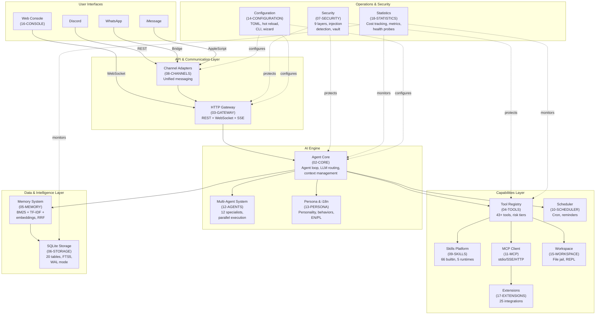
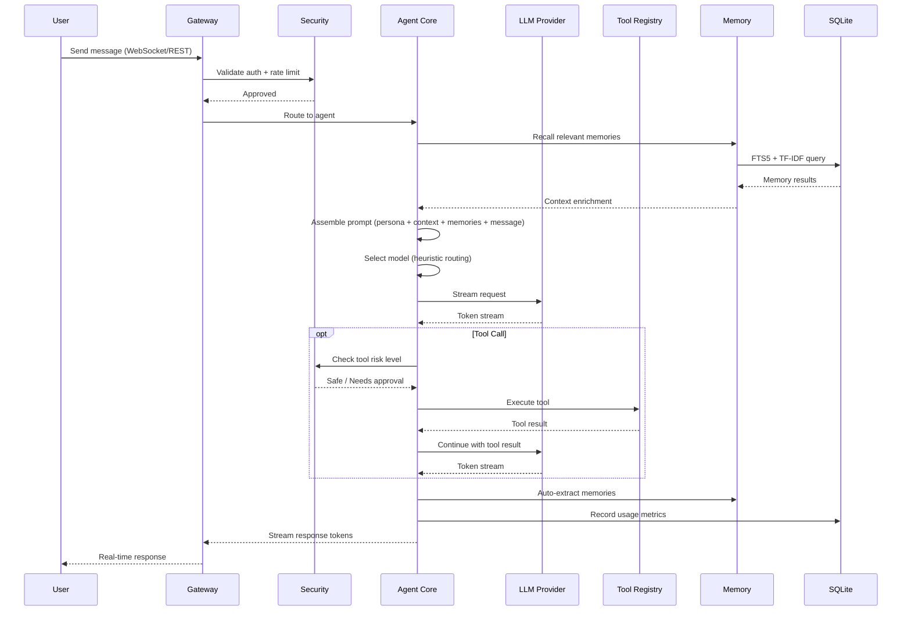

# Antec PRD


## Project Goal

The goal of this project is to create a repository with requirements for a Personal Agent system. Based on this documentation, users will be able to use **Claude Code**, **OpenAI Codex**, or similar AI coding assistants to implement the final system from scratch.

Every document in this repository is written to be **100% reproducible** -- containing exact data structures, algorithms, SQL schemas, API contracts, and configuration formats needed to rebuild the system without access to the original source code.

---

## What is Antec

Antec is a **self-hosted personal AI assistant** delivered as a single Rust binary with zero mandatory external dependencies. All data stays local on the user's machine.

Key characteristics:

- **Single binary** -- no Docker, no cloud, no external databases. Download, run, pair, chat.
- **Async Rust** -- built on Tokio with the Axum web framework for HTTP, WebSocket, and SSE.
- **SQLite storage** -- all persistent state lives in a single SQLite database with WAL mode, FTS5 full-text search, and 21 versioned migrations.
- **Vanilla web console** -- HTML + CSS + JS (ES modules) embedded in the binary via `rust-embed`. No frontend framework, no build step for the UI.
- **Multi-channel** -- a unified agent core serves Discord, WhatsApp, iMessage, and the built-in web console through swappable channel adapters.
- **Multi-provider LLM** -- supports Anthropic, OpenAI, Google, Ollama, and OpenRouter with automatic failover and cost-aware routing.
- **Extensible** -- 50+ built-in tools, a skill system with Python/Node/WASM runtimes, MCP client integration, and a hands/extensions marketplace.
- **Secure by default** -- 9 security layers including injection detection, secret vault, WASM sandbox with fuel metering, rate limiting, audit chain, and command blocklist.
- **Bilingual** -- compile-time i18n with full EN and PL locale support.

---

## System Architecture Overview



---

## Data Flow: Message Lifecycle



---

## Document Index

### System Foundation

| # | Document | Crate | Description |
|---|----------|-------|-------------|
| 01 | [Architecture](prd/01-ARCHITECTURE.md) | all | System blueprint -- 15-crate workspace, boot sequence, runtime layers, trust boundaries, deployment model |
| 06 | [Storage](prd/06-STORAGE.md) | `antec-storage` | SQLite persistence -- 20 tables, FTS5, WAL mode, 21 migrations, repository traits, connection pool |
| 14 | [Configuration](prd/14-CONFIGURATION.md) | `antec-core` | 5-layer config precedence (defaults/TOML/env/CLI/API), hot reload, setup wizard, CLI commands |

### AI Engine

| # | Document | Crate | Description |
|---|----------|-------|-------------|
| 02 | [Core](prd/02-CORE.md) | `antec-core` | Agent loop state machine, 4 LLM providers, context compaction (L0-L3), heuristic model routing, circuit breaker failover |
| 12 | [Agents](prd/12-AGENTS.md) | `antec-core` | 12 specialist agents, @mention routing, pattern matching, parallel execution, 3 merge strategies |
| 13 | [Persona](prd/13-PERSONA.md) | `antec-core` | Personality customization, behavior overlays with priorities, prompt composition, EN/PL i18n |

### Communication

| # | Document | Crate | Description |
|---|----------|-------|-------------|
| 03 | [Gateway](prd/03-GATEWAY.md) | `antec-gateway` | Axum HTTP/WS server, 148+ REST routes, OTP authentication, WebSocket streaming, SSE |
| 08 | [Channels](prd/08-CHANNELS.md) | `antec-channels` | 4 adapters (Console/Discord/WhatsApp/iMessage), unified message model, session isolation |
| 16 | [Console](prd/16-CONSOLE.md) | `antec-console` | Web UI -- 22 pages, dark monochrome design, responsive, WCAG 2.1 AA, vanilla HTML/CSS/JS |

### Capabilities

| # | Document | Crate | Description |
|---|----------|-------|-------------|
| 04 | [Tools](prd/04-TOOLS.md) | `antec-tools` | 43+ built-in tools, 3-tier risk classification, approval gating, JSON Schema validation |
| 09 | [Skills](prd/09-SKILLS.md) | `antec-skills` | 66 builtin skills, SKILL.md format, 5 runtimes (Prompt/Python/Node/WASM/Builtin), hub marketplace |
| 11 | [MCP](prd/11-MCP.md) | `antec-mcp` | MCP client -- stdio/SSE/HTTP transports, tool discovery, McpToolHandler bridge |
| 17 | [Extensions](prd/17-EXTENSIONS.md) | `antec-extensions` | 25 integration templates, credential vault (ChaCha20), health monitoring, TOML format |
| 15 | [Workspace](prd/15-WORKSPACE.md) | `antec-tools` | File jail with versioning, diff/revert, REPL (JavaScript boa_engine + Python subprocess) |

### Intelligence

| # | Document | Crate | Description |
|---|----------|-------|-------------|
| 05 | [Memory](prd/05-MEMORY.md) | `antec-memory` | Hybrid recall (BM25 + TF-IDF + embeddings via RRF), temporal decay, auto-extraction, dedup |

### Operations & Security

| # | Document | Crate | Description |
|---|----------|-------|-------------|
| 07 | [Security](prd/07-SECURITY.md) | `antec-security` | 9 defense layers -- injection detection, ChaCha20 vault, GCRA rate limiting, HMAC audit chain, WASM sandbox |
| 10 | [Scheduler](prd/10-SCHEDULER.md) | `antec-scheduler` | Cron expressions, natural language scheduling, one-shot reminders, heartbeat monitoring |
| 18 | [Statistics](prd/18-STATISTICS.md) | `antec-core` | Cost tracking, budget controls, tool metrics, retrieval quality, system health, diagnostics |

---

## Crate Map

```
antec (workspace root)
 +-- src/main.rs                    # Binary entrypoint, CLI, boot sequence
 +-- crates/
      +-- antec-core/               # Agent loop, LLM providers, routing, metrics
      +-- antec-gateway/            # Axum HTTP/WS server, REST routes, auth
      +-- antec-channels/           # Discord, WhatsApp, iMessage, Console adapters
      +-- antec-tools/              # Tool registry, 43+ implementations, MCP bridge
      +-- antec-memory/             # Memory CRUD, FTS5, TF-IDF, embeddings, recall
      +-- antec-storage/            # SQLite pool, migrations, repository traits
      +-- antec-security/           # Injection detection, vault, rate limiting, audit
      +-- antec-skills/             # Skill loader, manifest, hub, 5 runtimes
      +-- antec-scheduler/          # Cron, reminders, heartbeat, poll loop
      +-- antec-sandbox/            # WASM + OS sandbox, capabilities, policy engine
      +-- antec-mcp/                # MCP client (stdio, SSE, HTTP transports)
      +-- antec-extensions/         # Integration templates, credential vault, health
      +-- antec-i18n/               # Translation macro, EN/PL locale TOML files
      +-- antec-console/            # Web console SPA (embedded static assets)
      +-- antec-hands/              # Operational capability definitions
```

---

## Tech Stack Summary

| Layer | Technology | Details |
|-------|-----------|---------|
| Language | Rust (2021 edition) | Async via Tokio 1.x runtime |
| HTTP/WS | Axum | Tower-based, REST + WebSocket + SSE |
| Database | SQLite 3 | Bundled via `rusqlite`, WAL mode, FTS5, 8-connection pool |
| Config | TOML + JSON | Human-edited TOML, API-driven JSON, layered overrides |
| Serialization | serde | JSON for API/config, MessagePack for internal wire format |
| WASM Sandbox | Wasmtime | Fuel metering + epoch interrupts for untrusted code |
| Encryption | ChaCha20-Poly1305 | Secret vault, audit chain HMAC (SHA-256) |
| CLI | clap | Argument parsing, subcommands, environment variable fallback |
| Frontend | Vanilla HTML/CSS/JS | ES modules, no framework, embedded via `rust-embed` |
| LLM Providers | Anthropic, OpenAI, Google, Ollama, OpenRouter | Trait-based provider chain with failover |
| i18n | Compile-time macros | EN + PL locales, fallback to EN for missing keys |
| Testing | `cargo test` + `wiremock` + `assert_cmd` | Component, integration, and E2E test levels |

---

## Key Design Principles

| Principle | Implementation |
|-----------|---------------|
| **Zero dependencies** | Single binary, embedded SQLite, embedded frontend assets -- nothing to install |
| **Data sovereignty** | All data stays on user's machine -- no telemetry, no cloud sync, no external analytics |
| **Trait-based plugins** | LLM providers, channels, tools, and memory backends are swappable Rust traits |
| **Defense in depth** | 9 security layers -- no single bypass compromises the system |
| **Cost awareness** | Heuristic model routing, budget limits, usage tracking -- AI costs are visible and controlled |
| **Graceful degradation** | Circuit breaker failover, crash guard with degraded mode, backpressure on message queues |

---

## How to Use This Documentation

1. **Start with [01-ARCHITECTURE.md](01-ARCHITECTURE.md)** -- understand the crate layout and system boundaries
2. **Read [02-CORE.md](02-CORE.md)** -- learn the agent loop, the central processing pipeline
3. **Read [06-STORAGE.md](06-STORAGE.md)** -- understand the database schema that underpins everything
4. **Pick modules by need** -- each document is self-contained with all structs, traits, SQL, and API routes needed to implement that module
5. **Use the Mermaid diagrams** -- every document includes flow diagrams that show how components interact
6. **Reference [14-CONFIGURATION.md](14-CONFIGURATION.md)** -- the full TOML schema ties all modules together

Each document follows a consistent structure:
- **Module Goal** -- one-sentence purpose
- **Why This Module Exists** -- problem it solves and approach
- **Business Benefits** -- concrete value table
- **Technical sections** -- data models, traits, algorithms, API routes, Mermaid diagrams

---

## License

*License terms to be determined.*
