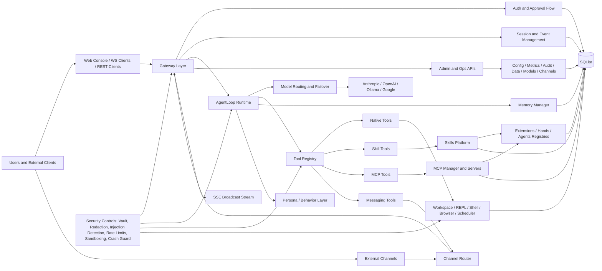
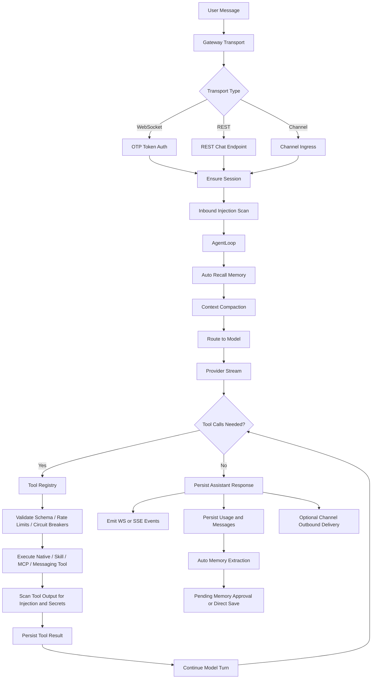

# Antec Features

This is a short comparison-friendly summary of what the current system already implements.

| Area | Implemented feature | Short description |
| --- | --- | --- |
| Core runtime | Self-hosted assistant server | Single Rust server process with WebSocket, REST, SSE, and embedded web console. |
| Deployment | Local-first persistence | SQLite with WAL, embedded migrations, pooled access, and local workspace storage. |
| Access | OTP pairing | Startup prints a 6-digit OTP; WebSocket clients can pair and receive persisted auth tokens. |
| Chat | Streaming assistant runtime | Supports synchronous REST chat, WebSocket chat, and SSE streaming of response/tool events. |
| Models | Multi-provider support | Anthropic, OpenAI, Ollama, and Google providers are implemented. |
| Routing | Automatic model selection | Heuristic routing picks cheaper/simple vs complex models and exposes routing-savings stats. |
| Reliability | Provider failover | Ordered fallback providers with retry rules, circuit breakers, and provider-switch events. |
| Tools | Native tool platform | 43 built-in native tools plus 4 messaging tools, with dynamic skill and MCP tool registration. |
| Files | Workspace file operations | Read, write, patch, search, list, stat, move, delete, diff, version, and revert files inside a jailed workspace. |
| Shell | Sandboxed command execution | Foreground and background shell execution with process tracking, blocklists, and sandbox limits. |
| Web | Safe web retrieval | Web fetch/search/extract tools with SSRF protections, DNS pinning, and body-size limits. |
| Memory | Persistent long-term memory | FTS-backed storage with categories, tags, importance, pin/archive, snapshots, and hybrid recall. |
| Memory | Auto memory extraction | User messages can be mined for facts, preferences, and decisions, then approved or rejected later. |
| Scheduler | Cron and reminders | Recurring cron jobs, natural-language reminders, one-shot jobs, and heartbeat scheduling. |
| Agents | Multi-agent architecture | Named agents with persona, tool/skill/model isolation, mention routing, and bundled agent definitions. |
| Parallelism | Parallel execution API | Parallel execution tracking and node/sub-agent APIs exist; default runtime currently simulates worker outputs. |
| Channels | Multi-channel messaging | Console, iMessage, Discord, and WhatsApp channel abstractions with send/status/test/config surfaces. |
| Skills | Skill packaging system | 66 bundled skills plus local/hub skills, manifests, scaffolding, enable/disable, import, build, and test flows. |
| MCP | External tool federation | Persisted MCP server configs, discovery, reconnect, and dynamic MCP tools bridged into the tool registry. |
| Extensions | Integration templates | 25+ bundled extension templates with enable/disable/install flows and credential support. |
| Hands | Higher-level packaged capabilities | 7 bundled hands with activation, pause/resume, categories, and associated agent metadata. |
| Security | Secret vault and redaction | Encrypted secrets, runtime secret scanning, output redaction, and provider credential lookup from vault or env. |
| Security | Prompt and tool defenses | Injection detection, chain detection, loop detection, per-tool rate limits, and circuit breakers. |
| Security | Execution isolation | OS sandboxing, command blocklists, channel allowlists, and dangerous-tool approval flows in WebSocket mode. |
| Workspace | Built-in development tools | REPL, file versioning, session export/merge, and code-evaluation support. |
| Observability | Admin and diagnostics APIs | Health, readiness, diagnostics, metrics, tool metrics, retrieval metrics, audit export, and stats endpoints. |
| Governance | Data management | Session deletion, export endpoints, storage-path introspection, and retention/purge jobs. |
| Console | Embedded SPA | Console assets are compiled into the binary and served with SPA fallback routing. |

## Detailed information

# PRD-CO: Current-State Product Requirements and System Inventory

## 1. Document Purpose

This document is a reverse-engineered product requirements document for the current codebase state in this repository. It is not a roadmap. It describes the behavior that is already implemented, the product surfaces that are exposed, the persistence model that exists, and the important partial implementations or gaps that must be preserved or deliberately changed in any rewrite.

The intended use is:

- handoff to another engineering team
- handoff to an agentic build system
- parity verification during a rebuild
- feature comparison against other assistant platforms

If a replacement system is built from this document, the target is behavioral parity with the current implementation, including current limitations where those limitations materially affect runtime behavior.

## 2. Evidence Basis

This inventory is based on code inspection of:

- `src/main.rs`
- `crates/antec-core`
- `crates/antec-gateway`
- `crates/antec-tools`
- `crates/antec-storage`
- `crates/antec-memory`
- `crates/antec-scheduler`
- `crates/antec-security`
- `crates/antec-skills`
- `crates/antec-mcp`
- `crates/antec-extensions`
- `crates/antec-hands`
- `crates/antec-channels`
- `crates/antec-console`
- integration and smoke tests under `tests/`

## 3. Product Summary

The implemented product is a self-hosted, local-first, multi-surface AI assistant platform with:

- a single Rust server binary
- a web console served from embedded static assets
- a WebSocket chat protocol with OTP-based pairing
- a REST API for administration and non-WebSocket chat access
- an SSE event stream for streaming responses and tool lifecycle events
- a SQLite-backed persistence layer
- a multi-provider LLM runtime with routing and failover
- a native tool platform with filesystem, shell, web, memory, scheduler, browser, REPL, and sub-agent primitives
- a memory subsystem with FTS, hybrid ranking, snapshots, decay, and approval of auto-extracted memory
- cron jobs, reminders, and heartbeat automation
- channel abstractions for console, Discord, WhatsApp, and iMessage
- a skills platform with bundled skills, local skills, hub catalog, and dynamic skill tools
- MCP server integration with dynamic MCP tool registration
- an extension and "hands" registry for higher-level packaged capabilities
- audit logging, secret management, injection scanning, rate limiting, sandboxing, and crash-guard protections

The product behaves as a personal assistant operating system rather than a single chat UI. It exposes operational controls, admin APIs, runtime configuration, storage/export surfaces, and extensibility primitives in addition to chat.

### 3.1 Component Overview

The following Mermaid diagram shows the major implemented components and how they relate at runtime.

### 3.2 Message and Tool Execution Flow

This diagram shows the main runtime flow for an incoming message through routing, tool use, memory, and outbound delivery.

## 4. Product Goals Inferred From Current Implementation

The current implementation is optimized for the following goals:

- local ownership of data, config, skills, and workspace files
- provider flexibility across cloud and local models
- tool-using autonomous assistant workflows
- multi-channel ingress and outbound messaging
- strong operator visibility into runtime state, costs, and failures
- controlled execution through sandboxing, approvals, allowlists, and audit trails
- pluggable extensibility through skills, MCP servers, extensions, and hands

## 5. Primary Actors

### 5.1 End User

The primary end user interacts with the system through:

- web console
- WebSocket clients
- REST clients
- external channels such as iMessage, Discord, and WhatsApp

The end user can:

- send chat messages
- receive streaming responses
- trigger tool use
- store and recall memory
- manage reminders and cron jobs
- route work to agents
- use workspace and REPL features

### 5.2 System Operator / Admin

The operator configures and maintains the system through:

- CLI commands
- config files
- REST admin endpoints
- secrets management
- diagnostics and stats endpoints
- skills, MCP, extension, and channel configuration

## 6. Core Domain Objects

| Object | Current meaning |
| --- | --- |
| Session | A conversation container with channel metadata and ordered messages. |
| Message | A persisted chat record with role, content, optional tool-call JSON, token count, and timestamp. |
| Memory | A structured persistent knowledge item with content, category, tags, importance, lifecycle flags, and search support. |
| Cron Job | A recurring or one-shot scheduled action stored in SQLite. |
| Reminder | A one-shot scheduler job created from natural-language scheduling input. |
| Agent | A named assistant persona/configuration with tools, skills, model/provider settings, and routing rules. |
| Tool | A callable runtime action exposed to the LLM or user/admin API. Tools can be native, skill-backed, or MCP-backed. |
| Skill | A package of instructions and optional executable tooling loaded from builtin, hub, or local sources. |
| MCP Server | A configured external tool provider discovered and bridged into the runtime as dynamic tools. |
| Extension | A higher-level integration template with install, enable/disable, config, and credential support. |
| Hand | A packaged operational capability with lifecycle state and agent-centric metadata. |
| Model Instance | A named provider/model configuration persisted independently of raw config. |
| Approval Request | A pending dangerous-tool approval request used in WebSocket flows. |
| Secret | An encrypted credential/value stored in the secret vault. |
| Workspace File Version | A historical snapshot of a workspace file. |
| REPL History Entry | A persisted code evaluation record. |

## 7. Runtime and Deployment Model

### 7.1 Process Model

The system is implemented as a single server process that:

- initializes storage
- loads config and runtime registries
- starts background tasks
- exposes HTTP, WebSocket, and SSE endpoints
- serves embedded console assets

### 7.2 Storage Model

The server uses SQLite via an `r2d2` pool. On each acquired connection it enables:

- `PRAGMA journal_mode=WAL`
- `PRAGMA foreign_keys=ON`

Current pool settings in code:

- `max_size = 8`
- `min_idle = 1`

The database schema is migrated via embedded migrations using `PRAGMA user_version`.

### 7.3 Packaging Artifacts

The repository includes:

- `Dockerfile`
- `docker-compose.yml`
- embedded console assets via `antec-console`

### 7.4 Console Serving

The HTTP server:

- serves `/ws` for WebSocket
- nests REST routes under `/api/v1`
- serves embedded console assets as a SPA fallback
- applies permissive CORS (`Any` origin, methods, and headers)
- applies compression middleware

## 8. First-Run and Configuration Experience

### 8.1 Setup Wizard

The first-run wizard supports:

- language selection: English or Polish
- provider selection: Anthropic, OpenAI, Ollama, or skip
- data directory override
- security mode selection: strict, balanced, permissive
- per-channel enable/disable choices for Discord, WhatsApp, iMessage
- persona preset or custom persona
- scheduler enable/disable
- automatic memory extraction enable/disable
- skills hub enable/disable

The wizard writes:

- config file
- `persona.md`

### 8.2 Configuration Sources

Configuration is layered from:

- application defaults
- TOML config file
- environment variable overrides
- CLI port override for `serve`

### 8.3 Internationalization

Implemented i18n support includes:

- English
- Polish

Locale can be configured at startup and modified via API.

## 9. CLI Surface

The binary currently implements the following top-level commands:

| Command | Implemented behavior |
| --- | --- |
| `serve` | Starts the full server runtime. |
| `chat` | Runs CLI chat flow. |
| `secret set|get|list|delete` | Manages encrypted secret-vault entries. |
| `skill list|enable|disable|import|create|remove|show|edit|hub search|hub install|new|build|test` | Manages skills and skill development workflows. |
| `memory search|export|import` | Searches and moves memory data. |
| `cron list|create|delete` | Manages cron jobs from the CLI. |
| `export` | Exports repository-managed data. |
| `doctor` | Runs diagnostics and can emit JSON output. |
| `provider test` | Verifies provider connectivity. |
| `repl --language js|python` | Runs an interactive code evaluation flow. |

### 9.1 Doctor Command

`doctor` is a real diagnostic surface, not a placeholder. It checks:

- config validity
- data-directory existence and writability
- disk space on Unix
- SQLite integrity via `PRAGMA integrity_check`
- provider environment availability
- presence of `ANTEC_MASTER_SECRET`
- sandbox mode
- memory count
- cron counts
- skill count

It supports:

- verbose output
- JSON output

## 10. Startup Sequence and Runtime Bootstrap

When `serve` runs, the system initializes the following major components:

- tracing/logging
- SQLite database and migrations
- workspace directory
- OS sandbox
- command blocklist
- injection detector
- secret vault
- secret scanner/redactor
- global tool-call rate limiter
- memory manager
- i18n manager
- scheduler manager
- skill manager
- hub service
- MCP manager
- crash guard
- metrics collector
- behavior manager
- channel router
- tool registry
- auth manager
- skill registry
- extension registry
- hand registry
- bundled agents
- model instances

It also:

- generates and prints a 6-digit OTP for pairing
- restores persisted auth tokens from storage
- extracts example skills on first run
- extracts bundled skills on first run
- scans skill directories
- loads bundled extension templates
- loads bundled hand definitions
- extracts bundled agent TOML files
- seeds a default model instance if none exists
- seeds MCP server records from config and optional external config
- restores disabled tool state from storage

### 10.1 Background Tasks Spawned at Startup

The runtime spawns recurring or long-lived background tasks for:

- expired auth-token cleanup
- audit retention cleanup
- enabled MCP connections
- cron polling and proactive sending
- crash-guard recovery probing
- data-retention purge sweeps
- memory decay sweeps
- config hot reload polling
- iMessage poll loop

## 11. Conversation and Agent Runtime

### 11.1 Session Model

Sessions are persisted with:

- `id`
- `channel`
- optional `channel_id`
- `created_at`
- `updated_at`
- optional `metadata`
- optional `archived_at`

Session capabilities include:

- create
- get
- list
- delete
- archive
- unarchive
- filter by channel, archive state, and date range
- merge source session into target session

### 11.2 Message Model

Messages are persisted with:

- `id`
- `session_id`
- `role`
- `content`
- optional `tool_calls`
- optional `token_count`
- `created_at`

Current roles are:

- `User`
- `Assistant`
- `System`
- `Tool`

Additional message characteristics:

- tool-call metadata is persisted as JSON
- token counts are stored when available
- restore logic reconstructs tool-call content into runtime context

### 11.3 Agent Loop

The main runtime state machine is `AgentLoop`. For each session it maintains:

- provider
- context window
- agent config
- session ID
- DB handle
- persona text
- selected model/provider names
- tool definitions
- tool executor
- memory manager
- routing config
- channel context
- optional compaction provider
- optional injection detector
- optional chain detector
- optional secret scanner
- audit HMAC key
- optional loop detector
- current routing mode

### 11.4 Message Processing Pipeline

Current per-message behavior is:

1. append the user message to runtime context
2. persist the user message asynchronously
3. emit typing indicators for non-console channels
4. auto-recall memories and inject them as system context
5. compact context if thresholds are crossed
6. run routing heuristics to pick provider/model
7. emit a `ModelSelected` stream event
8. build an LLM request with messages, tools, temperature, max tokens, and system prompt
9. start streaming from the selected provider
10. enter the iterative tool-call loop
11. persist assistant responses, tool messages, and usage
12. execute tool calls one by one
13. re-run compaction between model turns if needed
14. continue until provider signals completion

### 11.5 Tool-Call Loop Behavior

Tool use in the agent loop includes:

- streaming tool-call assembly from providers
- persistence of assistant messages containing tool-call JSON
- per-invocation counting against `max_tool_calls`
- loop detection for repeated identical tool calls
- chain detection for suspicious sequences of tool calls
- prompt-injection scanning of tool output
- secret redaction of tool output before re-inserting into model context
- persistence of tool result messages
- stream events for tool lifecycle transitions

### 11.6 Context Compaction

Four compaction levels are implemented:

| Level | Behavior |
| --- | --- |
| L0 | Drops older tool-call/tool-result pairs and trims whitespace. |
| L1 | Merges consecutive same-role messages and collapses long tool sequences. |
| L2 | Uses a separate provider to summarize the oldest 40 percent of non-system messages. |
| L3 | Emergency compaction keeping system messages plus only the last 10 messages. |

Compaction selection is threshold-driven based on context-window usage:

- above configured threshold: L0
- above 0.85: L1
- above 0.90: L2 if a compaction provider exists, otherwise L1
- above 0.95: L3

### 11.7 Channel Context

Channel context is a first-class part of the agent runtime and includes:

- `channel`
- `conversation_id`
- `session_key`

Typing indicators are currently:

- suppressed for `console`
- emitted for non-console channels

## 12. Provider Support, Routing, and Failover

### 12.1 Implemented Providers

The provider layer currently supports:

- Anthropic
- OpenAI
- Ollama
- Google

### 12.2 Provider Features

The provider abstraction supports:

- blocking completions
- streaming completions
- tool definitions in request payloads
- parsing tool calls from responses
- system prompt injection
- `max_tokens`

### 12.3 Credential Resolution

Two credential-resolution paths exist:

- env-vars only
- encrypted secret vault first, env fallback

### 12.4 Connectivity Testing

A real connectivity test exists through `provider test`.

### 12.5 Heuristic Routing

The routing subsystem supports:

- `auto`
- `always_default`
- `always_complex`

The classifier currently considers:

- message length
- code blocks
- complexity keywords
- question count
- line count
- math/technical indicators
- sentence complexity
- structured-list markers
- conversation context such as tool usage and message count
- penalties for very short trivial prompts

Routing output includes:

- provider
- model
- score
- reason
- whether a "simple" route was selected

### 12.6 Failover

An ordered failover provider chain is implemented with:

- retryable error classification
- retry delay
- per-provider circuit breaker
- cooldown and half-open behavior
- streaming-time provider switch events

The runtime emits `ProviderSwitch` during streaming failover.

### 12.7 Cost and Savings Tracking

The system includes a routing-savings model and exposes routing savings via stats.

## 13. Agent Catalog, Behaviors, and Personas

### 13.1 Agent Definitions

Agents can come from:

- database-backed agent definitions
- config-defined `[[agents]]`
- richer agent TOML files with capabilities, resources, schedules, and fallbacks

### 13.2 Agent Routing

The system supports:

- `@agent_name` mention routing at the start of a message
- substring/pattern-based routing rules
- default-agent fallback

### 13.3 Per-Agent Isolation

Per-agent overrides are supported for:

- persona
- tools
- skills
- model
- provider
- model-instance binding

### 13.4 Bundled Agents

Bundled agent definitions currently include:

- assistant
- coder
- researcher
- writer
- analyst
- debugger
- architect
- code-reviewer
- doc-writer
- ops
- security
- data-engineer

### 13.5 Behavior Layering

The behavior manager supports:

- a single `behavior.md`
- a directory of behavior files with priority frontmatter
- concatenation into extra prompt context

Current guardrail:

- single behavior file capped at 4 KB

## 14. Tool Platform

### 14.1 Tool Registry Model

The runtime tool platform is modeled explicitly through `ToolRegistry`. Tool metadata includes:

- `RiskLevel`: safe, moderate, dangerous
- `ToolSource`: native, MCP, skill

### 14.2 Registry Capabilities

Current runtime behavior includes:

- static registration
- dynamic registration/unregistration
- enable/disable state
- disabled tools omitted from LLM tool definitions
- direct execution of disabled tools returns an error
- JSON Schema validation before execution
- per-tool GCRA rate limiting
- per-tool circuit breaker with failure cooldown
- persistence-backed restore of disabled state and rate-limit overrides

### 14.3 Built-In Tool Counts

The codebase currently distinguishes:

- `43` built-in native tools in the default registry
- `4` messaging tools registered at server startup
- additional dynamic tools from skills and MCP servers

That means a fully booted server exposes:

- 43 default native tools
- plus `message_send`, `message_history`, `msg_edit`, `msg_react`
- plus dynamic skill tools
- plus dynamic MCP tools

### 14.4 Native Tool Inventory

#### Process and shell

- `shell_exec`
- `shell_exec_background`
- `process_status`
- `process_kill`

#### Filesystem and workspace

- `file_read`
- `file_write`
- `file_edit`
- `file_search`
- `file_apply_patch`
- `file_list`
- `file_stat`
- `file_move`
- `file_delete`

#### Memory

- `memory_store`
- `memory_recall`
- `memory_forget`
- `memory_update`
- `memory_list`
- `memory_pin`
- `memory_snapshot`
- `memory_restore`

#### Sessions

- `session_list`
- `session_archive`
- `session_export`
- `session_merge`

#### Web

- `web_fetch`
- `web_search`
- `web_extract`

#### Code and utilities

- `code_eval`
- `datetime`
- `calculate`

#### Scheduler

- `notification_schedule`
- `cron_create`
- `cron_list`
- `cron_toggle`
- `cron_delete`

#### Browser and visualization

- `browser_action`
- `canvas_render`

#### Sub-agent / node

- `node_spawn`
- `node_assign`
- `node_wait`
- `node_cancel`
- `node_collect`

#### Messaging

- `message_send`
- `message_history`
- `msg_edit`
- `msg_react`

### 14.5 Important Tool Behaviors

#### `shell_exec`

Implemented behavior:

- dangerous-risk tool
- workspace-scoped working-directory resolution
- command blocklist enforcement
- OS sandbox execution
- optional stdin
- timeout enforcement
- structured output including stdout, stderr, and exit code

#### `shell_exec_background`

Implemented behavior:

- dangerous-risk tool
- returns PID
- tracks process state in the registry
- captures stdout and stderr asynchronously
- supports later polling and termination

#### Filesystem tools

Implemented behavior:

- path resolution is routed through workspace jail logic
- edit surface includes read, write, patch, stat, move, delete, list, and search
- workspace root is canonicalized and path traversal is rejected

#### `memory_store`

Implemented behavior:

- secret redaction before persistence
- stores category, tags, and importance

#### `memory_recall`

Implemented behavior:

- FTS-backed search
- filter by limit, category, and minimum importance

#### `session_export`

Implemented behavior:

- exports session as JSON or Markdown
- optionally redacts secrets

#### `session_merge`

Implemented behavior:

- destructive merge by moving messages from source session to target session
- deletes source session after reassignment

#### `web_fetch`, `web_search`, `web_extract`

Implemented protections and behavior:

- only `http` and `https`
- private and internal IP blocking
- DNS resolution and pinning
- request client uses pinned resolution behavior
- body size capped at 5 MB

Configured search-provider support exists for:

- DuckDuckGo Lite
- Tavily
- SearXNG
- Google Custom Search

#### `code_eval`

Implemented behavior:

- JavaScript via Boa
- Python via `python3 -c`
- per-session state persistence by replaying prior code
- blocked imports/globals for file, network, and OS access
- 10-second timeout
- 50 MB per-session memory cap

#### `notification_schedule`

Implemented behavior:

- one-shot scheduling
- natural-language date parsing
- optional channel hint
- optional timezone offset
- implemented by creating one-shot scheduler jobs

#### `cron_create`

Implemented behavior:

- accepts cron expressions
- accepts a limited set of natural-language recurring schedules
- supports action object with `send_message`, `ask_agent`, `run_skill`, `reminder`
- still accepts legacy flat `prompt` and `action_type`

#### `browser_action`

Implemented behavior:

- single tool with actions: navigate, click, type, screenshot, evaluate, wait, scroll
- always registered in the runtime tool catalog
- actual execution requires both the `browser` build feature and `config.browser.enabled = true`
- manages one Chrome/Chromium session with an idle reaper
- returns a guidance message if browser support is unavailable

#### `canvas_render`

Implemented behavior:

- renders bar, line, pie, and scatter charts
- accepts `format: svg|png`
- currently returns JSON containing SVG payload rather than a true PNG binary transport

#### Messaging tools

Implemented behavior:

- outbound sending to `discord`, `whatsapp`, `imessage`, and `console`
- message-history retrieval by session
- edit and reaction operations routed through channel adapters

#### Dynamic skill tools

Implemented behavior:

- marked with source `skill`
- runtime dispatch depends on backing script type

Current script dispatch types:

- `.wasm` and `.wat`
- `.py`
- `.js`, `.mjs`, `.cjs`, `.ts`
- shell fallback for other executable types

Prompt-only skill tools currently return explanatory stub output.

#### Dynamic MCP tools

Implemented behavior:

- marked with source `mcp`
- discovered from connected MCP servers
- executed through the MCP client bridge
- raw JSON results are collapsed to text where possible

## 15. Multi-Agent, Parallel, and Node Execution

### 15.1 Parallel Executor

The runtime includes a `ParallelExecutor` with:

- execution tracking
- max concurrency
- token budget
- optional timeout
- cancellation
- merge strategies: concatenate, summarize, vote

### 15.2 Sub-Agent Runtime Capability

Library support exists for a real sub-agent runner using isolated `AgentLoop` instances with:

- independent session/context
- provider selection
- real LLM execution

### 15.3 Current Default Runtime Limitation

The main startup path creates the default tool registry without wiring a real sub-agent runner. In the shipping startup path inspected in this repo:

- `ParallelExecutor::default()` is used
- node tools operate through `SubAgentManager::default()` unless a runner is explicitly provided
- `node_assign` accepts work and produces placeholder completion behavior
- parallel execution simulates processed outputs rather than invoking real sub-agents

This is an important parity detail: real sub-agent execution is implemented as library capability, but the default server wiring runs in simulated mode.

## 16. Memory System

### 16.1 Storage Model

Memories are stored in SQLite plus an FTS5 virtual table:

- base table: `memories`
- search index: `memory_fts`

FTS details:

- external-content mode referencing `memories(rowid)`
- indexed columns: `key`, `content`, `tags`
- tokenizer: `porter unicode61`
- triggers keep FTS synchronized on insert, update, and delete

### 16.2 Memory Fields

Persisted memory fields include:

- `id`
- `key`
- `content`
- optional `category`
- optional `tags`
- `source`
- `importance`
- `access_count`
- `created_at`
- `updated_at`
- optional `expires_at`
- `archived`
- `pinned`

### 16.3 Memory Categories

User-facing memory categories include:

- fact
- preference
- event
- skill
- contact
- decision
- task
- conversation
- relationship
- other

### 16.4 Memory Writes

On store, the memory manager:

- redacts secrets before saving
- persists the memory record
- optionally generates and stores an embedding if an embedding provider is wired

### 16.5 Recall and Search

Implemented memory lookup features:

- FTS recall
- empty-query rejection
- access-count increment on recalled memories
- active-memory listing
- archived-memory listing
- per-memory fetch and update

### 16.6 Hybrid Recall

Hybrid recall combines:

- keyword/BM25-like rank signal
- semantic signal
- importance plus recency signal

Current weighting:

- keyword: `0.4`
- semantic: `0.4`
- importance plus recency: `0.2`

Additional ranking behaviors:

- recency uses exponential decay with a 7-day half-life
- pinned memories are always included even below thresholds
- detailed explanations are available for why a memory was recalled

### 16.7 Automatic Memory Extraction

Automatic extraction currently uses deterministic heuristics on user messages only.

Patterns supported:

- preferences: `I prefer`, `I like`, `My favorite ... is ...`
- decisions: `I decided to`, `I've decided`, `We agreed`, `We decided`
- facts: `My ... is/are/was`, `Our ... is/are/was`

Default extracted importance:

- preference: `0.7`
- decision: `0.8`
- fact: `0.5`

Dedup behavior:

- similarity greater than `0.95`: skip as duplicate
- similarity greater than `0.7` and up to `0.95`: update existing memory
- otherwise: create new memory

### 16.8 Pending Auto-Memory Approval Flow

WebSocket chat wiring currently:

- auto-extracts memories after a configured cadence
- auto-extracts again on disconnect if a session still has pending counts
- stores auto-extracted items as `source = "auto-pending"`
- reuses existing IDs for updates

Gateway approval/rejection routes then:

- approve by switching source from `auto-pending` to `auto`
- reject by deleting the pending memory

### 16.9 Importance, Access, and Decay

Memory importance uses:

- category-based weighting
- content-length factor
- entity-count factor
- explicit-signal factor
- temporal decay
- access-count boost

Decay behavior:

- scans all non-archived memories
- archives those below the configured effective-importance threshold
- never archives pinned memories
- optionally deletes archived memories older than retention policy

This sweep runs:

- once at startup
- then every 24 hours if temporal decay is enabled

### 16.10 Embeddings

Implemented embedding support includes:

- OpenAI embedding provider
- local deterministic hash-based fallback provider
- blob serialization/deserialization
- cosine similarity
- persistence in `memory_embeddings`

Important current-state caveat:

- the default startup path constructs `MemoryManager::new(db)`
- the default startup path does not obviously wire an embedding provider
- the semantic/embedding subsystem exists and is tested, but does not appear enabled by default in the main runtime boot path

### 16.11 Memory Links and Graph Traversal

The system includes directed memory links with relation types such as:

- `related_to`
- `contradicts`
- `supersedes`
- `part_of`

Current linked-memory operations:

- create link
- list outbound links
- list inbound links
- filter by relation
- delete one link
- delete all links for a memory
- breadth-first traversal across inbound and outbound edges up to a max depth

Important caveat:

- memory links are not enforced by foreign keys
- deleting a memory does not automatically delete its links

### 16.12 Snapshots and Restore

Snapshot support includes:

- create snapshot
- list snapshots
- get snapshot
- delete snapshot
- restore from snapshot

Snapshot storage contains:

- serialized JSON array of memories
- metadata: `created_at`, `memory_count`, `size_bytes`

Important current-state restore behavior:

- snapshots capture active memories only
- restore deletes current active memories and reinserts the snapshot set
- archived memories remain untouched
- embeddings are not rebuilt by restore
- memory links are not restored by restore

### 16.13 Important Memory Caveats

- `memory_pin` flips the `pinned` flag; the implementation does not directly set importance to `1.0` despite some user-facing wording.
- `expires_at` exists in schema and models, but expiration is not clearly enforced during recall or decay.
- exported memory data does not preserve the archived flag because the export query omits that field.
- `SessionMirror` JSONL utilities exist but are not wired into the main runtime flow.

## 17. Scheduler, Jobs, and Reminders

### 17.1 Cron Storage Model

Cron jobs persist:

- `id`
- `name`
- `cron_expr`
- `prompt`
- `enabled`
- `next_run`
- `last_run`
- `run_count`
- `action_type`
- `one_shot`
- timestamps

Allowed action types are:

- `send_message`
- `ask_agent`
- `run_skill`
- `reminder`

### 17.2 Scheduler Manager

Scheduler capabilities include:

- create job
- get job
- list jobs
- update job
- delete job
- query due jobs
- mark executed
- create one-shot jobs
- get, upsert, and delete heartbeat

### 17.3 Cron Syntax

The cron parser is a 5-field parser supporting:

- minute
- hour
- day of month
- month
- day of week

Supported syntax includes:

- `*`
- `*/N`
- single values
- ranges
- CSV lists
- combinations of the above

Not implemented in raw cron syntax:

- seconds field
- named weekdays
- named months

`next_after()` scans minute-by-minute with an upper bound of roughly 4 years.

### 17.4 Natural-Language Recurring Scheduling

The recurring natural-language parser supports:

- `hourly`
- `every N minutes`
- `every N hours`
- `daily at HH:MM`
- `every day at HH:MM`
- `every weekday at HH:MM`
- `weekdays at HH:MM`

### 17.5 Natural-Language One-Shot Reminders

The reminder parser supports:

- `in N minutes`
- `in N hours`
- `in N days`
- `at HH:MM`
- `at 3pm`
- `at 11am`
- `at noon`
- `at midnight`
- `tomorrow at HH:MM`
- `next monday at HH:MM`
- `march 15 at noon`
- `YYYY-MM-DD at HH:MM`

Timezone-offset-aware parsing is supported.

### 17.6 Scheduler Execution Loop

The scheduler executor:

- polls every 30 seconds
- skips execution entirely in crash-guard degraded mode
- writes audit entries for cron execution
- optionally chains HMAC signatures into audit
- sends proactive content through the configured proactive sender
- marks jobs executed
- recomputes `next_run`
- auto-disables one-shot jobs after first execution

### 17.7 Current Runtime Semantics of `action_type`

Although `send_message`, `ask_agent`, `run_skill`, and `reminder` are distinct persisted values, current runtime execution treats them the same: the stored `prompt` is forwarded through the proactive sender. There is not yet a separate execution backend that truly invokes agent logic or skill logic based on `action_type`.

This is a key parity note for any rewrite.

### 17.8 Heartbeat

Heartbeat is implemented as a reserved cron job named `__heartbeat__`.

Capabilities include:

- interval strings like `30m` and `2h`
- conversion from interval to cron
- reverse conversion from heartbeat-style cron back to interval
- upsert semantics for the reserved heartbeat job

## 18. Gateway and API Surface

### 18.1 Transport Summary

The server exposes:

- WebSocket at `/ws`
- REST API under `/api/v1`
- SSE at `/api/v1/events`
- embedded console via fallback asset serving

### 18.2 REST Chat

`POST /api/v1/chat/send` supports:

- blocking mode by default
- streaming mode with `?stream=true`

Blocking mode returns:

- `session_id`
- full collected response content

Streaming mode returns an immediate acknowledgement containing:

- `session_id`
- `streaming: true`
- `events_url`

Streaming events are then delivered over SSE.

### 18.3 WebSocket Protocol

#### Client to server message types

| Type | Fields | Purpose |
| --- | --- | --- |
| `auth` | `token` | First frame on a new connection. Validates session token or one-time OTP. |
| `message` | `session_id?`, `content` | Sends a user message into the agent pipeline. |
| `approval_response` | `request_id`, `approved`, `scope` | Resolves a pending dangerous-tool approval request. |
| `cancel` | `session_id` | Cancels the current streaming response for a session. |

#### Server to client message types

| Type | Purpose |
| --- | --- |
| `auth_response` | Reports auth success and may return a newly issued session token. |
| `response_chunk` | Streams assistant text chunks. |
| `tool_event` | Emits generic tool lifecycle updates. |
| `response_done` | Signals completion of a response. |
| `approval_request` | Requests user approval for a dangerous tool. |
| `memories_recalled` | Reports memories injected into context. |
| `provider_switch` | Reports failover from one provider to another. |
| `memories_extracted` | Reports newly auto-extracted memories. |
| `model_selected` | Reports routing decision. |
| `compacted` | Reports context compaction using LLM summarization. |
| `tool_started` | Reports detailed tool-start event. |
| `tool_progress` | Reports progress for long-running tools. |
| `tool_completed` | Reports detailed tool completion summary and duration. |
| `tool_failed` | Reports tool failure and risk level. |
| `error` | Reports protocol or processing errors. |

### 18.4 SSE Event Model

`GET /api/v1/events?session_id=<id>` returns a `text/event-stream` feed. If `session_id` is omitted, the stream includes all sessions.

Current SSE event types include:

- `delta`
- `done`
- `error`
- `tool_call_start`
- `tool_call_delta`
- `tool_call_end`
- `tool_started`
- `memories_recalled`
- `provider_switch`
- `memories_extracted`
- `model_selected`
- `compacted`
- `typing_indicator`
- `tool_progress`
- `tool_completed`
- `tool_failed`

### 18.5 REST Route Inventory

The current route inventory is:

| Area | Endpoints / capabilities |
| --- | --- |
| Health | `/health`, `/health/live`, `/health/ready` |
| Chat | `/chat/send`, `/chat/sessions`, `/chat/sessions/{id}` |
| Auth | `/auth/sessions` |
| Models | `/models`, `/models/detail`, `/models/instances`, `/models/instances/{id}`, `/models/instances/{id}/default` |
| Tools | `/tools`, `/tools/{name}`, `/tools/{name}/try` |
| Audit | `/audit`, `/audit/export`, `/audit/verify`, `/audit/csv` |
| Config | `/config`, `/config/reload`, `/config/allowlists`, `/config/allowlists/entry`, `/config/persona`, `/config/retention`, `/config/routing` |
| Secrets | `/secrets`, `/secrets/{name}` |
| Memory | `/memory`, `/memory/export`, `/memory/export/markdown`, `/memory/import`, `/memory/stats`, `/memory/sweep`, `/memory/archived`, `/memory/{id}`, `/memory/{id}/decay`, `/memory/{id}/approve`, `/memory/{id}/reject`, `/memory/{id}/unarchive` |
| Locale | `/locale` |
| Scheduler | `/cron`, `/cron/{id}`, `/cron/{id}/run`, `/reminders`, `/reminders/{id}`, `/heartbeat` |
| Channels | `/channels`, `/channels/status`, `/channels/{type}/send`, `/channels/{type}/status`, `/channels/{type}/enable`, `/channels/{type}/disable`, `/channels/{type}/test`, `/channels/{type}/stats`, plus Discord/WhatsApp/iMessage config and test endpoints |
| Channel ingress | `/channels/ingress`, `/channels/whatsapp/webhook`, `/channels/whatsapp/pair`, `/channels/whatsapp/pair/refresh` |
| Skills | `/skills`, `/skills/install`, `/skills/{id}`, `/skills/{id}/config`, `/skills/import`, `/skills/marketplace`, `/skills/marketplace/install`, `/skills/registry` |
| Hub | `/hub/catalog`, `/hub/categories`, `/hub/install`, `/hub/uninstall/{name}` |
| Approvals | `/approvals/pending`, `/approvals/history` |
| Data governance | `/data/sessions/{id}`, `/data/all`, `/data/paths`, `/data/purge`, `/data/export`, `/data/storage-info`, `/data/storage-paths` |
| MCP | `/mcp`, `/mcp/status`, `/mcp/{name}`, `/mcp/{name}/reconnect` |
| Diagnostics | `/diagnostics` |
| Behavior | `/behavior`, `/behaviors`, `/behaviors/{name}` |
| Stats | `/stats`, `/stats/usage`, `/stats/cost`, `/stats/sessions`, `/stats/system`, `/stats/messages-by-channel`, `/stats/tool-usage`, `/stats/budget`, `/stats/csv`, `/stats/routing-savings` |
| Metrics | `/metrics`, `/metrics/tools`, `/metrics/tools/{name}`, `/metrics/retrieval` |
| Environment | `/env`, `/env/{name}` |
| Events | `/events` |
| Crash guard | `/crash-guard` |
| Workspace | `/workspace/upload`, `/workspace/tree`, `/workspace/files/{*path}`, `/workspace/file-versions/{*path}`, `/workspace/file-diff/{*path}`, `/workspace/file-revert/{*path}` |
| REPL | `/repl/eval`, `/repl/history` |
| Agents | `/agents`, `/agents/{id}`, `/agents/{id}/enable` |
| Parallel | `/parallel`, `/parallel/{id}`, `/parallel/{id}/cancel` |
| Extensions | `/extensions`, `/extensions/install`, `/extensions/{id}`, `/extensions/{id}/enable`, `/extensions/{id}/disable` |
| Hands | `/hands`, `/hands/{id}/activate`, `/hands/{id}/deactivate`, `/hands/{id}/pause`, `/hands/{id}/resume` |

### 18.6 Approval Flow

Dangerous-tool approval is implemented in the gateway WebSocket flow via approval request/response messages. Approval state is also exposed via:

- `/approvals/pending`
- `/approvals/history`

Important boundary:

- approval gating is part of gateway-side orchestration, not a built-in property of `ToolRegistry`
- REST and SSE do not provide the same authenticated approval loop as WebSocket

### 18.7 Authentication Model

Current implemented authentication features:

- a 6-digit pairing OTP is printed at startup
- a client may authenticate with either an existing token or a one-time OTP
- successful OTP pairing returns a newly issued token
- auth tokens are persisted in the database
- expired tokens are cleaned up by background job

Important current-state caveats:

- WebSocket enforces auth on connection setup
- the REST API is not protected by comparable auth middleware in the inspected server wiring
- the SSE endpoint is not protected by comparable auth middleware in the inspected server wiring
- CORS is fully open

## 19. Channels

### 19.1 Channel Router

The channel subsystem provides an abstraction for:

- sending outbound messages
- channel-specific message edit and reaction features
- channel registration and unregistration
- status and capability reporting
- channel-specific stats and testing hooks

### 19.2 Implemented Channel Types

The codebase includes adapters for:

- console
- Discord
- WhatsApp
- iMessage

### 19.3 Discord

Current behavior:

- adapter can be registered conditionally at startup
- channel allowlists are respected
- Discord-specific config and test endpoints exist
- capabilities are surfaced through the channel router

Important caveat:

- the adapter is registered, but runtime wiring appears incomplete relative to the rest of the ingress/orchestration path; this should be treated as partially implemented until end-to-end Discord chat is re-verified

### 19.4 WhatsApp

Current behavior:

- adapter exists and is conditionally registered
- webhook, pairing, config, refresh, and test endpoints exist
- outbound channel send path exists

Important caveat:

- webhook/config surface is more complete than the fully wired agent-ingress flow; treat current WhatsApp support as partially implemented

### 19.5 iMessage

Current behavior:

- adapter exists and is conditionally registered
- startup launches an iMessage poll loop
- ingress callback wiring exists in startup
- config endpoint exists

This is the most fully wired non-console channel in the current boot path.

### 19.6 Channel Controls

Per-channel control endpoints support:

- status
- enable
- disable
- test
- stats

Important caveat:

- channel enable/disable behavior appears to mutate current runtime configuration rather than representing a durable, independently versioned channel state model

## 20. Skills Platform

### 20.1 Skill Packaging Models

The platform supports both:

- legacy `SKILL.md` instruction-based skills
- richer manifest-based skill definitions

### 20.2 Skill Sources

Skills are scanned from:

- builtin
- hub
- local

Bundled built-in skill count in code is fixed at:

- `66`

Built-in skills are extracted on first run and auto-enabled.

### 20.3 Skill Runtime Types

Skill-backed tools can be:

- prompt-only
- Python-backed
- Node-backed
- WASM-backed
- shell-backed

### 20.4 Skill Platform Features

Implemented features include:

- scanning directories for skill metadata
- progressive loading
- validation of manifests/frontmatter
- skill import from local filesystem
- enable/disable
- list/show/edit
- scaffold creation
- build/test workflows
- registry integration
- hub catalog access
- hub install and uninstall
- marketplace search and install endpoints

### 20.5 Trust and Safety Features

Implemented safety-related skill features include:

- local import safety checks
- file scanning across scripts/assets/references/agents
- signature verification support in verification code paths
- source distinction between builtin, local, and hub-managed content

### 20.6 Important Skill Caveats

- the CLI advertises skill import from URL or path, but the current CLI import path supports local filesystem import only; remote/network import returns an explicit error
- prompt-only skills do not execute code and instead surface instructional content
- WASM execution is supported in the broader sandbox/tool platform, but some legacy skill helper paths still return "not implemented" if runtime wiring is absent

## 21. MCP Integration

### 21.1 MCP Server Model

The product supports configured MCP servers with:

- persistence in SQLite
- CRUD routes
- status routes
- reconnect routes
- startup seeding from config
- optional seeding from an external MCP config file

### 21.2 Supported Transport Types

Implemented transport support includes:

- stdio
- HTTP
- SSE

### 21.3 MCP Runtime Behavior

The MCP subsystem supports:

- JSON-RPC style client behavior
- discovery of available tools
- bridging discovered tools into the main `ToolRegistry`
- connection management for enabled servers
- runtime reconnection

### 21.4 Important MCP Caveat

The SSE transport support is simplified. It behaves more like a request/response bridge than a full persistent streamed session model. A parity rewrite should preserve current behavior first, then separately decide whether to expand it.

## 22. Extensions and Integrations

### 22.1 Extension Templates

The extension platform loads bundled integration templates. The code asserts at least:

- `25` bundled templates

Templates include metadata for:

- ID
- name
- description
- required environment variables
- category-like grouping
- optional OAuth configuration
- health metadata

Known examples include:

- GitHub
- Gmail
- Google Calendar
- Google Drive

### 22.2 Extension Capabilities

Implemented features include:

- list installed/available extensions
- install
- uninstall
- enable
- disable
- credential-vault integration
- bundled template loading

### 22.3 Important Extension Caveat

Current extension health checking is lightweight metadata-driven validation rather than a deep live integration probe.

## 23. Hands

### 23.1 Hand Registry

The hand subsystem supports:

- registry of hand definitions
- activation
- deactivation
- pause
- resume
- listing

### 23.2 Bundled Hands

The codebase ships with `7` bundled hands:

- browser
- clip
- collector
- lead
- predictor
- researcher
- twitter

### 23.3 Hand Metadata

Hands include:

- ID
- name
- description
- category
- agent configuration

### 23.4 Important Hand Caveat

Requirement checks are largely declarative. The hand model is useful for packaging lifecycle and metadata, but does not by itself guarantee external dependencies are installed or live.

## 24. Workspace and REPL

### 24.1 Workspace Security Model

Workspace path handling:

- canonicalizes the workspace root
- rejects path traversal
- rejects empty paths

### 24.2 Workspace Features

The product exposes:

- workspace file upload
- workspace tree listing
- file read
- file write
- file version listing
- file diff
- file revert

### 24.3 File Versioning

`workspace_file_versions` supports:

- save new version
- get latest version
- get specific version
- list versions newest first
- revert to older content by writing a brand-new latest version containing the old content

### 24.4 REPL

The REPL subsystem supports:

- JavaScript
- Python
- evaluation endpoint
- per-session history
- global history
- persisted output and success status

## 25. Security Model

### 25.1 Secret Management

The system includes:

- encrypted secret vault
- CLI secret CRUD
- REST secret CRUD
- provider credential lookup from vault with env fallback
- secret scanning and redaction in memory storage
- secret scanning and redaction in tool outputs before reinjection into the LLM

### 25.2 Prompt-Injection and Tool-Output Defenses

Implemented defenses include:

- inbound message injection detection
- tool-output injection detection
- configurable detection modes such as block, ask, and flag
- audit logging of detected injection patterns

### 25.3 Chain and Loop Defenses

The runtime includes:

- chain detection for suspicious tool-call sequences
- loop detection for repeated identical tool invocations

### 25.4 Tool Governance

Tool governance features include:

- risk levels
- schema validation
- per-tool rate limiting
- per-tool circuit breaker
- enable/disable state
- approval requests for dangerous tools in WebSocket flows

### 25.5 Channel and Command Restrictions

Implemented controls include:

- channel allowlists
- command blocklist for shell execution

### 25.6 OS Sandboxing

The runtime initializes an OS sandbox with configurable limits such as:

- memory
- process count
- CPU

Shell execution routes through this sandbox.

### 25.7 WASM Sandboxing

The codebase includes a WASM sandbox subsystem using Wasmtime-style runtime support with host-function exposure, tool handler integration, and controlled execution. This underpins part of the skill/runtime extensibility story.

### 25.8 Audit

Audit capabilities include:

- audit log persistence
- export
- CSV export
- verification
- optional HMAC chaining/signing
- retention cleanup

### 25.9 Crash Guard

Crash guard capabilities include:

- rolling-window failure tracking
- degraded mode
- recovery after consecutive successes
- background recovery probe
- scheduler suppression during degraded mode

### 25.10 Data Retention

Background retention-related behavior includes:

- audit cleanup
- purge of older messages and memories
- memory decay sweep

### 25.11 Important Security Caveats

- WebSocket auth is present, but REST and SSE lack equivalent authentication enforcement in the inspected router.
- CORS is fully open.
- Approval gating is not a property of the tool registry itself; it is orchestrated at the gateway layer.

## 26. Persistence and Data Governance

### 26.1 Key Tables

Primary persisted tables relevant to current product behavior include:

- `sessions`
- `messages`
- `memories`
- `memory_fts`
- `cron_jobs`
- `auth_tokens`
- `memory_embeddings`
- `memory_snapshots`
- `workspace_file_versions`
- `repl_history`
- `memory_links`
- `audit_log`
- `tool_policies`
- `approval_requests`
- `model_usage`
- `skills`
- `mcp_servers`
- `agents`
- `model_instances`

### 26.2 Data Export

Repository-level export currently includes:

- sessions
- messages
- memories
- audit log
- cron jobs

CLI export augments that with:

- skills
- config

### 26.3 Data Deletion

Implemented deletion surfaces include:

- session-specific deletion
- delete-all-user-data
- purge endpoint
- storage-path introspection

### 26.4 Important Data-Governance Caveats

`delete_all_user_data()` currently deletes:

- messages
- sessions
- memories
- memory FTS rows
- audit log
- cron jobs

It does not currently delete:

- memory snapshots
- embeddings
- memory links
- REPL history
- workspace versions
- auth tokens
- skills
- secrets
- MCP servers
- agents
- model instances

This is a mismatch between the name of the endpoint and the actual implemented blast radius.

There is also a specific mismatch where:

- data-path listing includes skills
- delete-all-user-data does not actually remove skills

## 27. Observability and Diagnostics

### 27.1 Stats and Metrics

The runtime exposes:

- unified stats
- usage stats
- cost stats
- session stats
- system stats
- messages-by-channel stats
- tool-usage stats
- budget stats with update support
- CSV stats export
- routing savings stats
- metrics endpoints
- per-tool metrics
- retrieval metrics

### 27.2 Diagnostics

Operator diagnostics include:

- doctor CLI
- `/diagnostics`
- `/crash-guard`
- `/mcp/status`
- per-channel status and test endpoints
- health and readiness endpoints

### 27.3 Model and Cost Tracking

The system persists model usage and exposes:

- model list and update APIs
- model-instance CRUD APIs
- default-model-instance selection
- routing-savings reporting

## 28. Implemented vs Partial or Caveated Behavior

The following features exist in code but must be treated as partial or behaviorally caveated in a parity rewrite:

| Area | Current state caveat |
| --- | --- |
| REST/SSE security | WebSocket auth is enforced; REST and SSE do not have equivalent authentication middleware in the inspected runtime. |
| Discord | Adapter and config/test surfaces exist, but end-to-end runtime wiring appears incomplete. |
| WhatsApp | Webhook, pairing, config, and outbound surfaces exist, but full agent-ingress wiring appears partial. |
| Embeddings | Embedding subsystem exists, but default startup does not appear to wire an embedding provider. |
| Parallel/sub-agents | Real sub-agent runner exists in libraries, but default startup uses simulated mode. |
| Scheduler action types | `ask_agent` and `run_skill` are persisted distinctly, but executor currently forwards prompt content rather than invoking dedicated backends. |
| Skill import | CLI path supports local import, not true remote URL import. |
| WASM skills | Runtime support exists, but some legacy helper paths still return not-implemented behavior without full wiring. |
| Extensions | Health checks are lightweight validation, not deep live checks. |
| Hands | Requirement checks are declarative rather than enforcement-heavy. |
| Memory restore | Restores active memories only, leaves archived memories in place, and does not rebuild embeddings or links. |
| Delete all data | Endpoint name implies complete purge, but many persisted tables remain untouched. |
| Channel enable/disable | Appears to mutate runtime config rather than representing a durable dedicated channel-state model. |
| MCP SSE transport | Implemented in a simplified bridging form rather than a full long-lived stream protocol. |

## 29. Current-State Parity Requirements for a Rebuild

A replacement system intended to match the current product should preserve the following top-level behaviors:

1. Single-binary local server with embedded console, WebSocket, REST, and SSE.
2. SQLite persistence with sessions, messages, memories, scheduler, tools, agents, skills, MCP, audit, and auth tokens.
3. OTP-based pairing for WebSocket and persisted session tokens.
4. Multi-provider LLM execution with heuristic routing, failover, and provider-switch events.
5. Tool-using assistant loop with memory recall, context compaction, usage persistence, and tool lifecycle events.
6. Native tool platform covering shell, files, web, memory, scheduler, browser, REPL, sessions, messaging, and node/sub-agent primitives.
7. Memory subsystem with FTS recall, hybrid ranking, automatic extraction, pending approval flow, snapshots, links, and decay.
8. Scheduler with cron jobs, natural-language reminders, heartbeat, audit logging, and proactive sending.
9. Skills platform with bundled skills, local/hub scanning, dynamic tool registration, and development scaffolding.
10. MCP integration with persisted server configs, discovery, and dynamic MCP tools.
11. Extension and hand registries with lifecycle APIs.
12. Workspace file management, versioning, and REPL history.
13. Security controls spanning vault, redaction, injection scanning, rate limiting, circuit breakers, sandboxing, audit, crash guard, and allowlists.
14. Operational APIs for health, metrics, diagnostics, data export, stats, config, model instances, and governance.

## 30. What Should Not Be Assumed

The following should not be overstated in downstream product descriptions unless they are explicitly improved:

- that all APIs are authenticated
- that all channel adapters are production-complete
- that embeddings are enabled by default
- that scheduler action types dispatch to distinct runtime backends
- that sub-agents are fully live in the default server path
- that delete-all-user-data truly deletes all user-managed persisted state

## 31. Recommended Use of This Document

For a rebuild effort, this document should be used as:

- the feature inventory baseline
- the parity checklist
- the source for subsystem decomposition into separate implementation epics
- the source for test-plan generation

If a rewrite intentionally changes one of the caveated current behaviors above, that change should be called out as an explicit product decision rather than accidentally drifting from current behavior.
