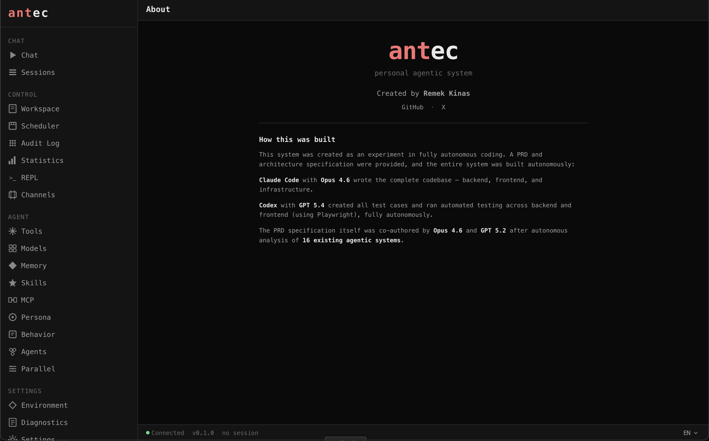
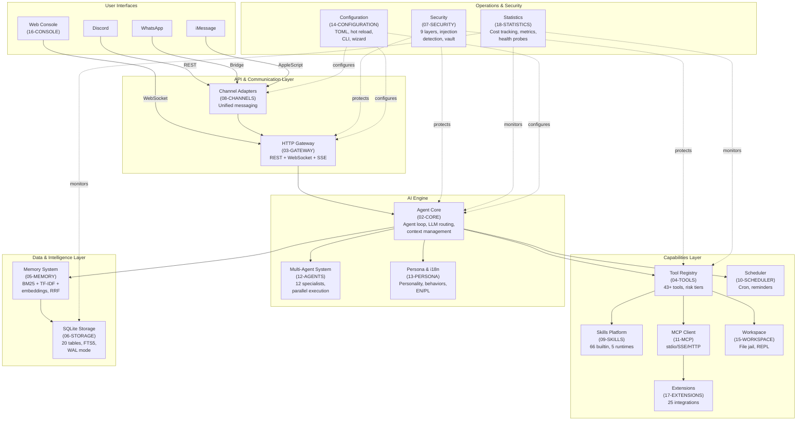
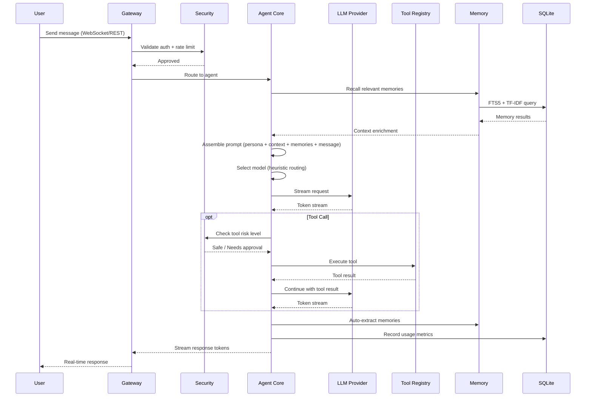

# Antec PRD



## Project Goal

The goal of this project is to create a repository with requirements for a Personal Agent system. Based on this documentation, users will be able to use **Claude Code**, **OpenAI Codex**, or similar AI coding assistants to implement the final system from scratch.

Every document in this repository is written to be **100% reproducible** -- containing exact data structures, algorithms, SQL schemas, API contracts, and configuration formats needed to rebuild the system without access to the original source code.

---

## What is Antec

Antec is a **self-hosted personal AI assistant** delivered as a single Rust binary with zero mandatory external dependencies. All data stays local on the user's machine.

Key characteristics:

- **Single binary** -- no Docker, no cloud, no external databases. Download, run, pair, chat.
- **Async Rust** -- built on Tokio with the Axum web framework for HTTP, WebSocket, and SSE.
- **SQLite storage** -- all persistent state lives in a single SQLite database with WAL mode, FTS5 full-text search, and 21 versioned migrations.
- **Vanilla web console** -- HTML + CSS + JS (ES modules) embedded in the binary via `rust-embed`. No frontend framework, no build step for the UI.
- **Multi-channel** -- a unified agent core serves Discord, WhatsApp, iMessage, and the built-in web console through swappable channel adapters.
- **Multi-provider LLM** -- supports Anthropic, OpenAI, Google, Ollama, and OpenRouter with automatic failover and cost-aware routing.
- **Extensible** -- 50+ built-in tools, a skill system with Python/Node/WASM runtimes, MCP client integration, and a hands/extensions marketplace.
- **Secure by default** -- 9 security layers including injection detection, secret vault, WASM sandbox with fuel metering, rate limiting, audit chain, and command blocklist.
- **Bilingual** -- compile-time i18n with full EN and PL locale support.

---

## System Architecture Overview



---

## Data Flow: Message Lifecycle



---

## Document Index

### System Foundation

| # | Document | Crate | Description |
|---|----------|-------|-------------|
| 01 | [Architecture](prd/01-ARCHITECTURE.md) | all | System blueprint -- 15-crate workspace, boot sequence, runtime layers, trust boundaries, deployment model |
| 06 | [Storage](prd/06-STORAGE.md) | `antec-storage` | SQLite persistence -- 20 tables, FTS5, WAL mode, 21 migrations, repository traits, connection pool |
| 14 | [Configuration](prd/14-CONFIGURATION.md) | `antec-core` | 5-layer config precedence (defaults/TOML/env/CLI/API), hot reload, setup wizard, CLI commands |
| 30 | [Database](prd/30-DATABASE.md) | `antec-core` | Consolidate the complete SQLite database schema from all 29 PRD chapters and the implemented codebase |

### AI Engine

| # | Document | Crate | Description |
|---|----------|-------|-------------|
| 02 | [Core](prd/02-CORE.md) | `antec-core` | Agent loop state machine, 4 LLM providers, context compaction (L0-L3), heuristic model routing, circuit breaker failover |
| 12 | [Agents](prd/12-AGENTS.md) | `antec-core` | 12 specialist agents, @mention routing, pattern matching, parallel execution, 3 merge strategies |
| 13 | [Persona](prd/13-PERSONA.md) | `antec-core` | Personality customization, behavior overlays with priorities, prompt composition, EN/PL i18n |

### Communication

| # | Document | Crate | Description |
|---|----------|-------|-------------|
| 03 | [Gateway](prd/03-GATEWAY.md) | `antec-gateway` | Axum HTTP/WS server, 148+ REST routes, OTP authentication, WebSocket streaming, SSE |
| 08 | [Channels](prd/08-CHANNELS.md) | `antec-channels` | 4 adapters (Console/Discord/WhatsApp/iMessage), unified message model, session isolation |
| 16 | [Console](prd/16-CONSOLE.md) | `antec-console` | Web UI -- 22 pages, dark monochrome design, responsive, WCAG 2.1 AA, vanilla HTML/CSS/JS |

### Capabilities

| # | Document | Crate | Description |
|---|----------|-------|-------------|
| 04 | [Tools](prd/04-TOOLS.md) | `antec-tools` | 43+ built-in tools, 3-tier risk classification, approval gating, JSON Schema validation |
| 09 | [Skills](prd/09-SKILLS.md) | `antec-skills` | 66 builtin skills, SKILL.md format, 5 runtimes (Prompt/Python/Node/WASM/Builtin), hub marketplace |
| 11 | [MCP](prd/11-MCP.md) | `antec-mcp` | MCP client -- stdio/SSE/HTTP transports, tool discovery, McpToolHandler bridge |
| 17 | [Extensions](prd/17-EXTENSIONS.md) | `antec-extensions` | 25 integration templates, credential vault (ChaCha20), health monitoring, TOML format |
| 15 | [Workspace](prd/15-WORKSPACE.md) | `antec-tools` | File jail with versioning, diff/revert, REPL (JavaScript boa_engine + Python subprocess) |

### Intelligence

| # | Document | Crate | Description |
|---|----------|-------|-------------|
| 05 | [Memory](prd/05-MEMORY.md) | `antec-memory` | Hybrid recall (BM25 + TF-IDF + embeddings via RRF), temporal decay, auto-extraction, dedup |

### Operations & Security

| # | Document | Crate | Description |
|---|----------|-------|-------------|
| 07 | [Security](prd/07-SECURITY.md) | `antec-security` | 9 defense layers -- injection detection, ChaCha20 vault, GCRA rate limiting, HMAC audit chain, WASM sandbox |
| 10 | [Scheduler](prd/10-SCHEDULER.md) | `antec-scheduler` | Cron expressions, natural language scheduling, one-shot reminders, heartbeat monitoring |
| 18 | [Statistics](prd/18-STATISTICS.md) | `antec-core` | Cost tracking, budget controls, tool metrics, retrieval quality, system health, diagnostics |

### User Interface & CLI

| # | Document | Crate | Description |
|---|----------|-------|-------------|
| 19 | [UI Specification](prd/19-UI.md) | `antec-console` | Design system -- color tokens, typography, spacing, component library, responsive breakpoints, accessibility (WCAG 2.1 AA) |
| 20 | [CLI Reference](prd/20-CLI.md) | `src/main.rs` | Command-line interface -- 10 commands, setup wizard, secret/skill/memory/cron management, health diagnostics |

### Deep Dives

| # | Document | Crate | Description |
|---|----------|-------|-------------|
| 21 | [Audit Logs](prd/21-AUDIT_LOGS.md) | `antec-security` | HMAC-SHA256 chained audit trail, tamper detection, chain verification, CSV export, retention cleanup |
| 22 | [Behavior System](prd/22-BEHAVIOR.md) | `antec-core` | Filesystem-backed behavior overlays with YAML frontmatter priorities, hot-apply, 4KB limit |
| 23 | [Chat Pipeline](prd/23-CHAT.md) | `antec-core` | Message processing pipeline -- AgentLoop state machine, tool call iteration, 4-level compaction (L0-L3), 16 StreamEvent types |
| 24 | [Session Management](prd/24-SESSION.md) | `antec-gateway` | Session lifecycle -- creation, isolation, backpressure (semaphore+queue), persistence, restoration, archival, merging |
| 25 | [Models & Routing](prd/25-MODELS.md) | `antec-core` | 4 LLM providers, circuit breaker failover, 10-signal heuristic model routing, credential vault |
| 26 | [Environment & Runtime](prd/26-ENVIRONMENT.md) | `src/main.rs` | 16-step boot sequence, 5-layer config cascade, CLI commands, env vars, CrashGuard degraded mode |
| 27 | [Parallel Execution](prd/27-PARALLEL.md) | `antec-core` | SubAgentRunner, ParallelExecutor with semaphore concurrency, 5 node tools, 3 merge strategies |
| 28 | [REPL System](prd/28-REPL.md) | `antec-tools` | Sandboxed JS (boa_engine) + Python (subprocess) REPL, session-state replay, blocked patterns, 50MB limit |

### Deployment

| # | Document | Crate | Description |
|---|----------|-------|-------------|
| 29 | [Deployment](prd/29-DEPLOYMENT.md) |  | Define the complete deployment pipeline -- build targets, packaging formats, release automation, install scripts etc. |
---

## Crate Map

```
antec (workspace root)
 +-- src/main.rs                    # Binary entrypoint, CLI, boot sequence
 +-- crates/
      +-- antec-core/               # Agent loop, LLM providers, routing, metrics
      +-- antec-gateway/            # Axum HTTP/WS server, REST routes, auth
      +-- antec-channels/           # Discord, WhatsApp, iMessage, Console adapters
      +-- antec-tools/              # Tool registry, 43+ implementations, MCP bridge
      +-- antec-memory/             # Memory CRUD, FTS5, TF-IDF, embeddings, recall
      +-- antec-storage/            # SQLite pool, migrations, repository traits
      +-- antec-security/           # Injection detection, vault, rate limiting, audit
      +-- antec-skills/             # Skill loader, manifest, hub, 5 runtimes
      +-- antec-scheduler/          # Cron, reminders, heartbeat, poll loop
      +-- antec-sandbox/            # WASM + OS sandbox, capabilities, policy engine
      +-- antec-mcp/                # MCP client (stdio, SSE, HTTP transports)
      +-- antec-extensions/         # Integration templates, credential vault, health
      +-- antec-i18n/               # Translation macro, EN/PL locale TOML files
      +-- antec-console/            # Web console SPA (embedded static assets)
      +-- antec-hands/              # Operational capability definitions
```

---

## Tech Stack Summary

| Layer | Technology | Details |
|-------|-----------|---------|
| Language | Rust (2021 edition) | Async via Tokio 1.x runtime |
| HTTP/WS | Axum | Tower-based, REST + WebSocket + SSE |
| Database | SQLite 3 | Bundled via `rusqlite`, WAL mode, FTS5, 8-connection pool |
| Config | TOML + JSON | Human-edited TOML, API-driven JSON, layered overrides |
| Serialization | serde | JSON for API/config, MessagePack for internal wire format |
| WASM Sandbox | Wasmtime | Fuel metering + epoch interrupts for untrusted code |
| Encryption | ChaCha20-Poly1305 | Secret vault, audit chain HMAC (SHA-256) |
| CLI | clap | Argument parsing, subcommands, environment variable fallback |
| Frontend | Vanilla HTML/CSS/JS | ES modules, no framework, embedded via `rust-embed` |
| LLM Providers | Anthropic, OpenAI, Google, Ollama, OpenRouter | Trait-based provider chain with failover |
| i18n | Compile-time macros | EN + PL locales, fallback to EN for missing keys |
| Testing | `cargo test` + `wiremock` + `assert_cmd` | Component, integration, and E2E test levels |

---

## Key Design Principles

| Principle | Implementation |
|-----------|---------------|
| **Zero dependencies** | Single binary, embedded SQLite, embedded frontend assets -- nothing to install |
| **Data sovereignty** | All data stays on user's machine -- no telemetry, no cloud sync, no external analytics |
| **Trait-based plugins** | LLM providers, channels, tools, and memory backends are swappable Rust traits |
| **Defense in depth** | 9 security layers -- no single bypass compromises the system |
| **Cost awareness** | Heuristic model routing, budget limits, usage tracking -- AI costs are visible and controlled |
| **Graceful degradation** | Circuit breaker failover, crash guard with degraded mode, backpressure on message queues |

---

## Development Standards & AI-Assisted Coding

This project is designed for **autonomous agentic coding** -- AI coding assistants build the system from the PRD documents with minimal human intervention. Three files govern how agents work:

### Agent Instruction Files

| File | Purpose | Target |
|------|---------|--------|
| [CLAUDE.md](CLAUDE.md) | Development instructions for Claude Code | Claude Code CLI |
| [AGENTS.md](AGENTS.md) | Universal development instructions | OpenAI Codex, Cursor, Windsurf, Copilot, Cline, Aider, etc. |
| [.claude/skills/rust/SKILL.md](.claude/skills/rust/SKILL.md) | Rust coding standard (179 rules, 14 categories) | All agents |

**CLAUDE.md** is the primary instruction file. Claude Code reads it automatically at session start. It defines mandatory build checks, architecture constraints, coding standards, workflow orchestration (plan mode, subagents, verification loops), and session continuity via HANDOVER protocol.

**AGENTS.md** contains the same project context and coding standards in a framework-agnostic format that any AI coding tool can consume.

**`.claude/skills/rust/SKILL.md`** (mirrored to `.agents/skills/rust/` for Codex) is the comprehensive Rust coding standard with 179 rules organized by priority (CRITICAL / HIGH / MEDIUM / LOW) across ownership, error handling, async patterns, API design, performance, testing, and more. All agents reference this file for Rust-specific decisions.

### Channel Integration (Skill + Agent)

Implementing 9 messaging channels is a major effort. We use a **Skill + Agent** pattern -- domain knowledge in a reusable skill, autonomous execution in a dedicated agent:

| Component | Location | Role |
|-----------|----------|------|
| **Skill**: `channel-integration` | `.claude/skills/channel-integration/SKILL.md` | Universal channel adapter pattern -- trait interface, normalized message format, implementation checklist, connection patterns, security requirements, rate limiting, message chunking rules |
| **Agent**: `channel-implementer` | `.claude/agents/channel-implementer.md` | Autonomous agent that implements a single channel adapter. Preloads the skill, follows the checklist, writes code + tests, verifies compilation |
| **References** (9 files) | `.claude/skills/channel-integration/references/` | Per-platform API specs -- endpoints, auth flows, payload formats, filtering rules, rate limits, platform quirks |

**Why Skill + Agent together (not one or the other):**

- **Skill alone** provides knowledge but runs in the main context -- no isolation, can't parallelize, clutters the conversation with implementation details
- **Agent alone** can execute in isolation but has no domain knowledge -- it would need to research each platform API from scratch every time
- **Skill + Agent** = the agent spawns with full platform knowledge preloaded, works autonomously in isolated context, and can be launched **in parallel** for multiple channels simultaneously

**Supported channels:**

| Channel | Connection Pattern | Reference |
|---------|-------------------|-----------|
| Discord | WebSocket Gateway + REST | `references/discord.md` |
| Telegram | Long Polling (`getUpdates`) | `references/telegram.md` |
| Slack | Socket Mode (WebSocket) + Web API | `references/slack.md` |
| WhatsApp | Webhook + Cloud API REST | `references/whatsapp.md` |
| Signal | REST Polling (signal-cli) | `references/signal.md` |
| Email | IMAP IDLE + SMTP | `references/email.md` |
| Bluesky | AT Protocol REST Polling | `references/bluesky.md` |
| Teams | Bot Framework Webhook | `references/teams.md` |
| Twitch | IRC over WebSocket | `references/twitch.md` |

**Usage -- implement a single channel:**
```
Use the channel-implementer agent to implement the Discord adapter
```

**Usage -- implement multiple channels in parallel:**
```
Use the channel-implementer agent to implement Discord, Telegram, and Slack adapters in parallel
```

**Language-agnostic design:** The skill's patterns (trait interface, normalized messages, connection patterns, security rules) apply to any language. The agent's system prompt includes Rust-specific patterns but the skill itself works for Python, TypeScript, Go, etc. To adapt for another language, create a variant agent with language-specific instructions that still preloads the same `channel-integration` skill.

### OpenAI Codex Configuration

Skills and agents are mirrored to Codex's directory format for full compatibility:

```
.agents/                              # Codex skills (agent skills standard)
  skills/
    rust/
      SKILL.md                        # Same 179-rule Rust standard
      agents/openai.yaml              # Codex UI metadata + invocation policy
    channel-integration/
      SKILL.md                        # Same channel adapter pattern
      agents/openai.yaml
      references/                     # Same 9 per-platform API specs

.codex/                               # Codex config + agent roles
  config.toml                         # Multi-agent enabled, role registration
  agents/
    channel-implementer.toml          # Agent role config (model, instructions)
```

Codex multi-agent is enabled with `channel-implementer` registered as an agent role using `gpt-5.3-codex` with `model_reasoning_effort = "high"`. Both skills use `allow_implicit_invocation: true` so Codex activates them automatically when the task matches.

| Platform | Instructions | Skills | Agent |
|----------|-------------|--------|-------|
| **Claude Code** | `CLAUDE.md` | `.claude/skills/` | `.claude/agents/` |
| **OpenAI Codex** | `AGENTS.md` | `.agents/skills/` | `.codex/config.toml` + `.codex/agents/` |
| **Other AI tools** | `AGENTS.md` | `.claude/skills/` (agent skills standard) | — |

### LSP Integration (rust-analyzer)

We use **Language Server Protocol** via the `rust-analyzer-lsp` plugin to give AI agents real-time code intelligence during development.

**Why LSP matters for agentic coding:**

- **Instant error detection** -- after every file edit, the language server analyzes changes and reports type errors, missing imports, and lifetime issues immediately. The agent catches and fixes mistakes in the same turn instead of discovering them during a full `cargo build`
- **Precise navigation** -- go-to-definition, find-references, hover-for-types, and call hierarchy give the agent exact knowledge of the codebase structure. This is significantly more accurate than grep-based search, especially in a 15-crate workspace where the same name might appear in different contexts
- **Reduced iteration cycles** -- without LSP, the agent writes code, runs the compiler, reads errors, and fixes them. With LSP, the agent sees diagnostics inline and resolves issues before compilation. On a project of Antec's size, this eliminates entire rounds of build-fix-rebuild
- **Cross-crate awareness** -- rust-analyzer understands the full workspace dependency graph. When the agent modifies a trait in `antec-core`, it immediately sees which implementations in `antec-channels` or `antec-tools` need updating

**Setup:**
```bash
# Install rust-analyzer (if not already present)
rustup component add rust-analyzer

# Install the Claude Code LSP plugin
/plugin install rust-analyzer-lsp@claude-plugins-official
```

### Context7 MCP -- Live Documentation

We use **Context7** as an MCP (Model Context Protocol) server to provide AI agents with up-to-date library documentation during development.

**Why Context7 matters:**

- **No stale knowledge** -- AI models have training cutoffs. Tokio 1.x, Axum 0.7, wasmtime 27, and rusqlite 0.32 may have API changes the model doesn't know about. Context7 fetches current documentation on demand so the agent never guesses at function signatures or deprecated patterns
- **Verified API usage** -- instead of hallucinating plausible-looking API calls, the agent queries the actual docs for `tokio-rs/tokio`, `tokio-rs/axum`, `rusqlite/rusqlite`, `bytecodealliance/wasmtime`, and `rust-lang/reference` before writing code. This eliminates a class of bugs that only surface at compile time
- **Dependency evaluation** -- when considering a new crate, the agent can check its current API surface, version compatibility, and feature flags rather than relying on potentially outdated training data
- **Language reference** -- complex Rust semantics (lifetime elision rules, trait object safety, async trait bounds) are verified against the official Rust reference rather than recalled from memory

**Configuration** (`.claude/settings.json`):
```json
{
  "mcpServers": {
    "context7": {
      "command": "npx",
      "args": ["-y", "@upstash/context7-mcp@latest"]
    }
  }
}
```

**Key libraries to query:**
| Library ID | What it provides |
|-----------|-----------------|
| `rust-lang/reference` | Rust language semantics, lifetime rules, trait system |
| `tokio-rs/tokio` | Async runtime, channels, I/O, synchronization primitives |
| `tokio-rs/axum` | HTTP framework, extractors, middleware, WebSocket |
| `rusqlite/rusqlite` | SQLite bindings, connection pooling, FTS5 |
| `bytecodealliance/wasmtime` | WASM runtime, fuel metering, epoch interrupts |
| `serde-rs/serde` | Serialization framework, derive macros, attributes |

### Rust Coding Standard

The full coding standard lives in [`.claude/skills/rust/SKILL.md`](.claude/skills/rust/SKILL.md). It defines 179 rules across 14 prioritized categories:

| Priority | Category | Prefix | Rules | Key Focus |
|----------|----------|--------|-------|-----------|
| CRITICAL | Ownership & Borrowing | `own-` | 12 | Borrow over clone, `Arc` in async, `tokio::sync::Mutex` across `.await` |
| CRITICAL | Error Handling | `err-` | 12 | `thiserror` for libs, `anyhow` for app, never `.unwrap()` in production |
| CRITICAL | Memory Optimization | `mem-` | 15 | `Vec::with_capacity`, `SmallVec`, `Cow`, zero-copy parsing |
| HIGH | API Design | `api-` | 15 | Newtype IDs, builder pattern, trait-based plugins, sealed traits |
| HIGH | Async/Await | `async-` | 15 | Tokio-only, `JoinSet`, bounded channels, `spawn_blocking`, timeouts |
| HIGH | Compiler Optimization | `opt-` | 12 | LTO, single codegen unit, `panic=abort`, PGO |
| MEDIUM | Naming Conventions | `name-` | 12 | `PascalCase` types, `snake_case` fns, `as_`/`to_`/`into_` conversions |
| MEDIUM | Type Safety | `type-` | 8 | Enum state machines, exhaustive matching, parse-don't-validate |
| MEDIUM | Testing | `test-` | 12 | Offline-only, mock via traits, `proptest`, `insta` snapshots |
| MEDIUM | Documentation | `doc-` | 8 | Public API docs, runnable examples, `# Safety` for unsafe |
| MEDIUM | Performance | `perf-` | 8 | `LazyLock`, batch SQL in transactions, streaming, connection pool |
| LOW | Project Structure | `proj-` | 6 | One type per file, `pub(crate)`, feature flags, workspace deps |
| LOW | Clippy & Linting | `lint-` | 5 | `-D warnings`, pedantic, `#![forbid(unsafe_code)]`, `rustfmt.toml` |
| REF | Anti-patterns | `anti-` | 15 | Common Rust mistakes to avoid with correct alternatives |

---

## How to Use This Documentation

1. **Start with [01-ARCHITECTURE.md](01-ARCHITECTURE.md)** -- understand the crate layout and system boundaries
2. **Read [02-CORE.md](02-CORE.md)** -- learn the agent loop, the central processing pipeline
3. **Read [06-STORAGE.md](06-STORAGE.md)** -- understand the database schema that underpins everything
4. **Pick modules by need** -- each document is self-contained with all structs, traits, SQL, and API routes needed to implement that module
5. **Use the Mermaid diagrams** -- every document includes flow diagrams that show how components interact
6. **Reference [14-CONFIGURATION.md](14-CONFIGURATION.md)** -- the full TOML schema ties all modules together

Each document follows a consistent structure:
- **Module Goal** -- one-sentence purpose
- **Why This Module Exists** -- problem it solves and approach
- **Business Benefits** -- concrete value table
- **Technical sections** -- data models, traits, algorithms, API routes, Mermaid diagrams

---

## License

*License MIT*
