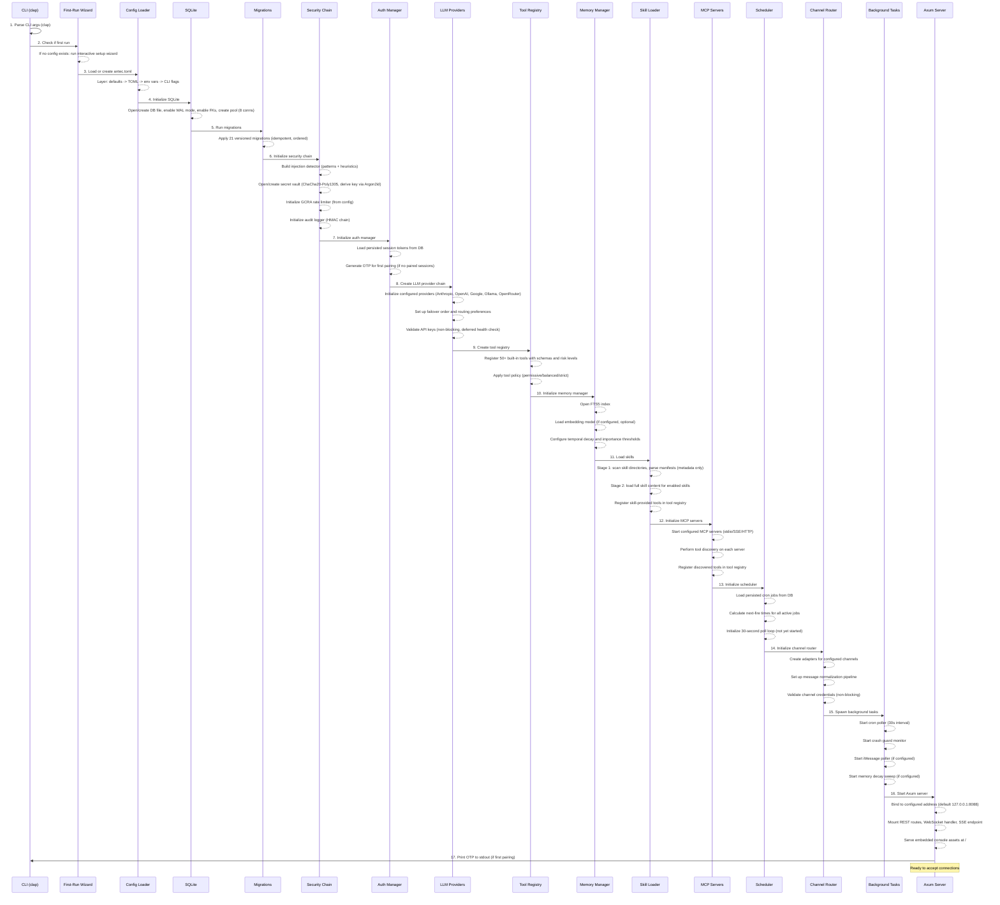
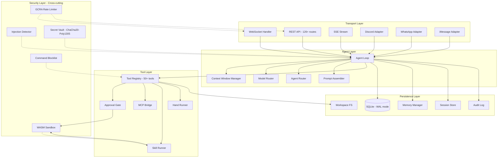
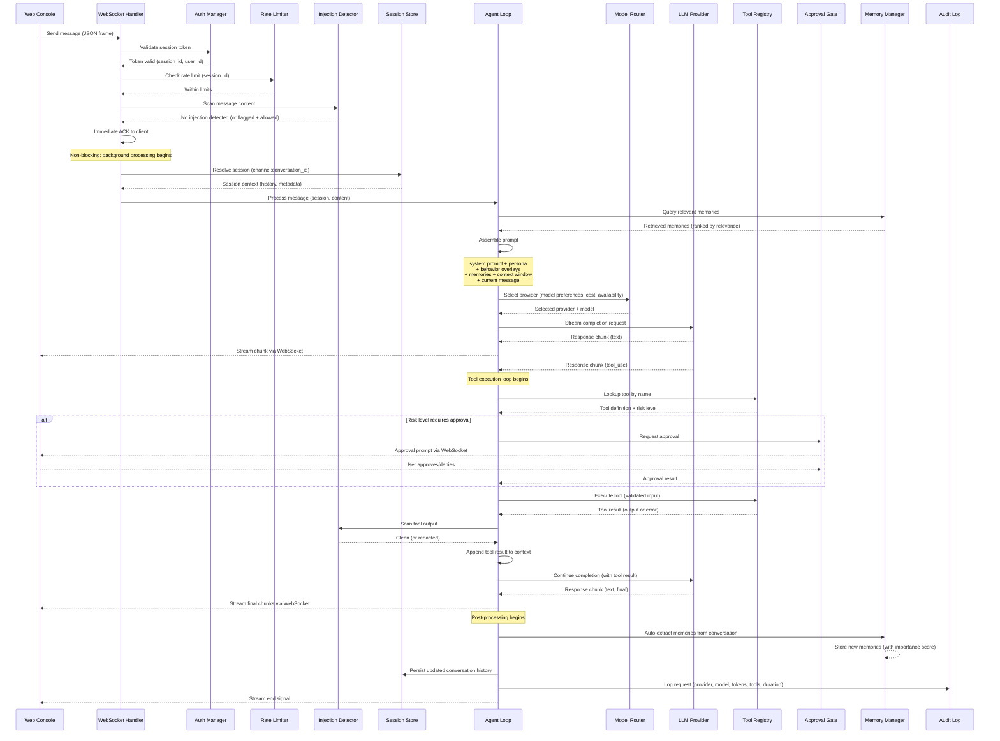
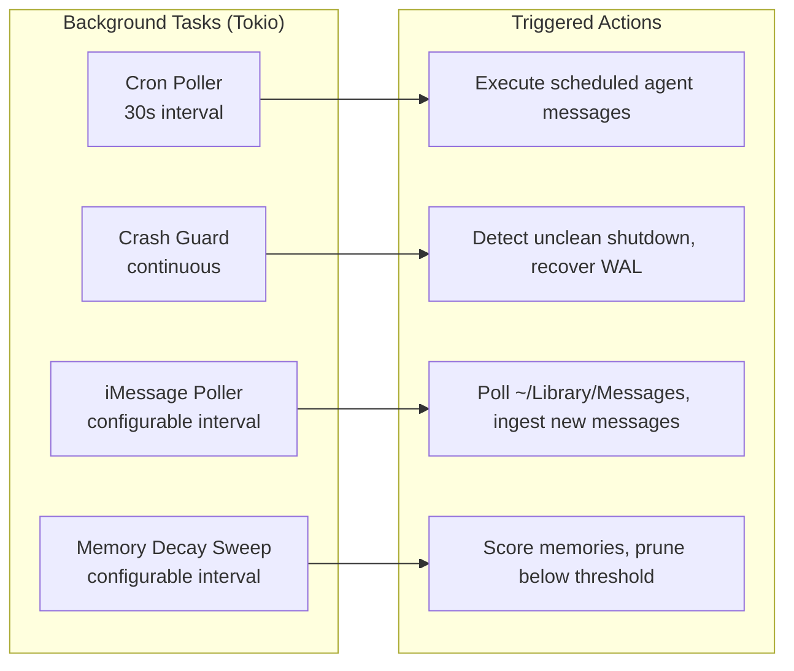
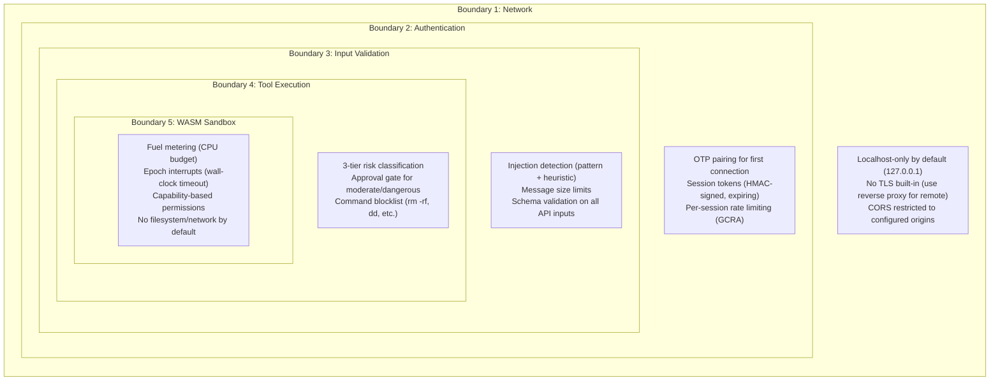

# 01 -- System Architecture

> **Module Goal:** Define the complete system blueprint — crate structure, boot sequence, runtime layers, trust boundaries, and deployment model — so that the entire Antec system can be built from this single architectural specification.

### Why This Module Exists

Building a complex multi-crate Rust application without a clear architectural map leads to circular dependencies, unclear responsibilities, and inconsistent patterns. This document serves as the master blueprint that every other module references.

It establishes the 15-crate workspace layout, defines which crate depends on which, maps the boot sequence from CLI parsing to server readiness, and draws trust boundaries between components. Any developer (human or AI) starting from scratch needs this document first.

### Business Benefits

| Benefit | Description |
|---------|-------------|
| **Reproducibility** | Complete system can be rebuilt from this spec alone — no tribal knowledge required |
| **Modularity** | Clear crate boundaries allow parallel development and independent testing |
| **Single binary** | All crates compile into one executable — zero deployment dependencies |
| **Security by design** | Trust boundaries defined at the architectural level, not bolted on later |
| **Extensibility** | Trait-based plugin architecture allows swapping providers, channels, and tools without touching core logic |

This document defines the overall system architecture of Antec: crate structure, boot sequence, runtime layers, request flow, background jobs, trust boundaries, and deployment model.

---

## 1. System Overview

Antec is a self-hosted personal AI assistant shipped as a **single statically-linked Rust binary**. It embeds an HTTP/WebSocket server, a web console UI, an SQLite database engine, and all runtime logic needed to operate without external dependencies.

The codebase is organized as a **Cargo workspace** with 15 crates under `crates/`. Each crate owns a bounded domain and exposes its capabilities through Rust traits, enabling compile-time verified composition and runtime swappability.

### 1.1 Crate Map

| Crate | Purpose |
|-------|---------|
| `antec-core` | Agent loop state machine, LLM provider chain (Anthropic, OpenAI, Google, Ollama, OpenRouter), context window management, model routing, failover logic, prompt assembly |
| `antec-gateway` | Axum HTTP/WS server, 126+ REST API routes, WebSocket protocol, SSE streaming, OTP pairing authentication, session token management, CORS, request validation |
| `antec-channels` | Channel adapters for Discord (bot API), WhatsApp (Cloud API), iMessage (AppleScript bridge), and Console (WebSocket). Unified message normalization, allowlist filtering, per-channel config |
| `antec-tools` | Built-in tool registry with 50+ tools, JSON Schema input/output validation, 3-tier risk classification (safe/moderate/dangerous), approval gate, tool execution engine |
| `antec-memory` | Long-term memory storage and retrieval, TF-IDF scoring, optional embedding vectors, hybrid recall pipeline (BM25 + semantic), auto-extraction from conversations, temporal decay, importance scoring |
| `antec-sandbox` | Wasmtime WASM sandbox with fuel metering and epoch interrupts, OS-level command blocklist, capability declaration and enforcement, policy engine (permissive/balanced/strict) |
| `antec-skills` | Skill manifest parsing (TOML), skill hub client, lifecycle management (install/enable/disable/uninstall), multi-runtime execution (Python, Node.js, WASM), scaffold CLI, progressive loading |
| `antec-mcp` | Model Context Protocol client implementation, stdio/SSE/HTTP transport layers, tool discovery and dynamic registration, server lifecycle management, protocol message serialization |
| `antec-scheduler` | Cron expression parser, natural language schedule parsing, heartbeat jobs, one-shot reminders, 30-second poll loop, missed-fire recovery, job persistence in SQLite |
| `antec-security` | Multi-layer injection detection (pattern matching + heuristic scoring), ChaCha20-Poly1305 secrets vault, HMAC-SHA256 audit chain, GCRA rate limiter, secret redaction in outputs, command blocklist |
| `antec-storage` | SQLite connection pool (r2d2, 8 connections), WAL mode initialization, foreign key enforcement, 21 versioned migrations, repository pattern for all data access, query builders |
| `antec-i18n` | Compile-time translation macro `t!()`, EN and PL locale files, fallback to EN for missing keys, format string interpolation, locale switching at runtime |
| `antec-console` | Web Console SPA frontend (vanilla HTML + CSS + JS with ES modules), static asset embedding via `rust-embed`, MIME type detection, gzip pre-compression, 22 pages |
| `antec-hands` | Operational capability (Hand) registry, bundled hands for common integrations, hand trait definition, hand lifecycle management, credential binding |
| `antec-extensions` | Integration templates for third-party services, credential vault per extension, health monitoring and heartbeat, marketplace manifest, extension hot-loading |

### 1.2 Dependency Flow

Crates form a directed acyclic graph. The key dependency chains are:

```
antec-gateway
  -> antec-core
       -> antec-tools
       -> antec-memory
       -> antec-mcp
       -> antec-hands
  -> antec-channels
  -> antec-security
  -> antec-storage
  -> antec-console

antec-core
  -> antec-storage
  -> antec-security
  -> antec-i18n
  -> antec-sandbox

antec-skills
  -> antec-sandbox
  -> antec-storage
  -> antec-tools

antec-scheduler
  -> antec-storage
  -> antec-core

antec-extensions
  -> antec-hands
  -> antec-storage
  -> antec-security
```

Leaf crates with no internal dependencies: `antec-i18n`, `antec-storage` (depends only on external crates).

---

## 2. Boot Sequence

The binary startup is a deterministic, ordered initialization. Each step must complete before the next begins. Failures at any step produce a clear error message and abort.



### 2.1 Boot Sequence Details

| Step | Component | Failure Behavior |
|------|-----------|-----------------|
| 1. CLI args | `clap` parser | Invalid args: print usage and exit with code 1 |
| 2. First-run wizard | Interactive TOML generator | Skipped if `antec.toml` exists. Ctrl+C aborts cleanly |
| 3. Config load | TOML parser + env overlay | Missing required fields: list them and exit. Invalid values: report and exit |
| 4. SQLite init | `rusqlite` + `r2d2` pool | Cannot create/open DB file: exit with filesystem error. Corruption detected: attempt WAL recovery, then exit |
| 5. Migrations | Ordered SQL scripts | Migration failure: rollback transaction, report which migration failed, exit |
| 6. Security chain | Pattern compiler, crypto init | Invalid patterns: warn and use defaults. Key derivation failure: exit |
| 7. Auth manager | Token loading, OTP generation | DB read failure: exit. OTP generation uses system CSPRNG |
| 8. LLM providers | HTTP client creation | No providers configured: warn, allow startup (tools-only mode). Invalid API keys: warn, mark provider unhealthy |
| 9. Tool registry | Schema compilation | Built-in tool registration is infallible. Schema validation errors in custom tools: warn and skip |
| 10. Memory manager | FTS5 index, embedding model | FTS5 init failure: exit. Embedding model load failure: warn, disable semantic search, continue with TF-IDF only |
| 11. Skill loader | Manifest parsing, runtime init | Invalid manifest: warn and skip skill. Runtime init failure: warn and skip that runtime |
| 12. MCP servers | Process spawn, HTTP connect | Server start failure: warn and skip. Tool discovery failure: warn, retry on first use |
| 13. Scheduler | Job loading, cron parsing | Invalid cron expressions: warn, disable that job, continue |
| 14. Channel router | Adapter creation | Channel init failure: warn and disable that channel. At least Console must succeed |
| 15. Background tasks | Tokio task spawning | Spawn failure: exit (indicates runtime problem) |
| 16. Axum server | TCP bind | Port in use: exit with clear error. Permission denied: exit with suggestion |
| 17. OTP output | stdout print | Infallible |

---

## 3. Runtime Architecture

The running system is organized into five horizontal layers. Each layer communicates only with its immediate neighbors (with the exception of the Security layer, which is cross-cutting).



### 3.1 Layer Responsibilities

**Transport Layer** -- Accepts inbound connections and normalizes messages into a unified internal format (`NormalizedMessage`). Each adapter handles protocol-specific concerns (Discord gateway, WhatsApp webhook verification, iMessage AppleScript polling, WebSocket frame management). The transport layer performs initial authentication (OTP/session token) and rate limiting before forwarding to the Agent layer.

**Agent Layer** -- The core intelligence loop. Receives normalized messages, resolves the target session (composite key: `channel:conversation_id`), assembles the prompt (system prompt + persona + behavior overlays + context window + memories), selects the LLM provider via the model router, sends the request, and processes the response. If the response contains tool calls, the agent loop iterates: execute tools, append results, re-prompt. The agent router handles multi-agent scenarios where specialized agents handle specific message types.

**Tool Layer** -- Executes tool calls requested by the LLM. The tool registry maps tool names to implementations and validates inputs against JSON Schemas. The approval gate intercepts `moderate` and `dangerous` tool calls based on the active policy mode. The MCP bridge forwards calls to external MCP servers. The skill runner executes skill-provided tools in the appropriate runtime (Python subprocess, Node.js subprocess, or Wasmtime sandbox). The hand runner executes operational capabilities (hands) that interact with external services.

**Persistence Layer** -- All durable state. SQLite is the single source of truth with WAL mode for concurrent reads during writes. The memory manager handles long-term memory storage and retrieval with FTS5 full-text search and optional semantic search via embeddings. The session store manages conversation histories with ordered message queues and backpressure. The audit log records security-relevant events with HMAC chain integrity. The workspace provides a jailed filesystem for the file editor tool.

**Security Layer** -- Cross-cutting concerns that intercept operations at multiple points. The injection detector scans all inbound messages and tool outputs for prompt injection patterns. The rate limiter enforces per-session and global request limits using GCRA (Generic Cell Rate Algorithm). The secret vault encrypts sensitive values at rest and redacts them from LLM-visible outputs. The command blocklist prevents execution of dangerous system commands. The WASM sandbox constrains untrusted skill code with fuel metering and epoch interrupts.

---

## 4. Main Request Flow

This diagram traces a complete request from WebSocket message arrival through to streaming response delivery.



### 4.1 Request Flow Details

**Immediate ACK pattern** -- The WebSocket handler sends an acknowledgement frame to the client as soon as the message passes authentication, rate limiting, and injection scanning. This provides instant feedback while background processing begins. The client sees a "thinking" indicator until the first response chunk arrives.

**Context window management** -- Before prompt assembly, the agent checks if the context window (conversation history + system prompt + memories) exceeds the target model's token limit. If so, it triggers **context compaction**: older messages are summarized by the LLM, the summary replaces the original messages, and the compacted context is used for the current request.

**Tool execution loop** -- The agent loop supports multiple rounds of tool calls. A single LLM response may contain multiple tool calls (parallel execution). After all tool results are collected, the agent re-prompts the LLM with the results. This loop continues until the LLM produces a final text response with no tool calls, or a maximum iteration limit is reached (configurable, default 25).

**Streaming** -- Response chunks are streamed to the client as they arrive from the LLM provider. This includes both text chunks and structured events (tool call start, tool result, approval request). The client reconstructs the full response from the stream.

**Memory auto-extraction** -- After a complete exchange, the memory manager analyzes the conversation for facts, preferences, and knowledge worth persisting. Extracted memories are scored for importance and stored with metadata (source message IDs, timestamp, category). Low-importance memories are subject to temporal decay and eventual pruning.

---

## 5. Background Jobs

The system runs several background tasks as Tokio tasks spawned during boot. All background tasks are cooperative and respect graceful shutdown signals.



### 5.1 Cron Poller

- **Interval**: 30 seconds (hardcoded, not configurable)
- **Logic**: On each tick, queries the `cron_jobs` table for jobs whose `next_fire <= now()` and `status = 'active'`. For each due job, enqueues a synthetic message to the agent loop as if the user had sent it. Updates `next_fire` based on the cron expression. Handles missed fires by executing once (not backfilling).
- **Concurrency**: Jobs execute sequentially to avoid overwhelming the LLM provider. A job that is still running when the next tick arrives is skipped.
- **Persistence**: Job state (last fire time, next fire time, execution count) is persisted to SQLite after each execution.

### 5.2 Crash Guard

- **Purpose**: Detects unclean shutdowns and performs recovery on next boot.
- **Mechanism**: Writes a heartbeat timestamp to a file (`~/.antec/.crash_guard`). On boot, if the file exists and the timestamp is recent (within expected heartbeat interval), the previous instance did not shut down cleanly. Recovery steps: verify SQLite WAL integrity, replay any uncommitted WAL frames, mark in-progress jobs as failed.
- **Runtime**: Continuously writes heartbeat at 10-second intervals.

### 5.3 iMessage Poller

- **Condition**: Only runs when iMessage channel is configured (macOS only).
- **Interval**: Configurable (default 5 seconds).
- **Logic**: Reads the iMessage SQLite database (`~/Library/Messages/chat.db`) for new messages since last poll. Normalizes messages and routes them to the agent loop. Responses are sent back via AppleScript `tell application "Messages"`.
- **Filtering**: Respects the configured allowlist of phone numbers/emails.

### 5.4 Memory Decay Sweep

- **Condition**: Only runs when memory decay is enabled in config.
- **Interval**: Configurable (default 24 hours).
- **Logic**: Scans all memories, applies temporal decay formula (exponential decay based on age and access frequency). Memories that fall below the configured importance threshold are marked for deletion. Deleted memories are soft-deleted (marked, not physically removed) to allow recovery.

---

## 6. Trust Boundaries

Antec enforces security at multiple concentric boundaries. Each boundary restricts what can cross it and how.



### 6.1 Boundary Details

| Boundary | Enforcement Point | What It Prevents |
|----------|------------------|------------------|
| **Network** | Axum server bind address | Remote access by default. Attacker must be on localhost or use a configured reverse proxy |
| **Authentication** | WebSocket upgrade, REST middleware | Unauthorized access. OTP pairing ensures physical presence for first connection. Tokens expire and can be revoked |
| **Input Validation** | Pre-processing middleware | Prompt injection attacks, oversized payloads, malformed requests. Injection detector uses both pattern matching (known attack strings) and heuristic scoring (structural analysis) |
| **Tool Execution** | Tool registry + approval gate | Unauthorized tool use. `safe` tools execute freely. `moderate` tools require approval in strict mode. `dangerous` tools always require approval (or are blocked in strict mode) |
| **WASM Sandbox** | Wasmtime runtime | Malicious or buggy skill code. Fuel metering prevents infinite loops. Epoch interrupts enforce wall-clock timeouts. Capability system prevents unauthorized I/O. Skills cannot access filesystem or network unless explicitly granted |

### 6.2 Tool Risk Classification

| Risk Level | Policy: Permissive | Policy: Balanced | Policy: Strict |
|-----------|-------------------|------------------|----------------|
| `safe` | Auto-execute | Auto-execute | Auto-execute |
| `moderate` | Auto-execute | Auto-execute | Require approval |
| `dangerous` | Auto-execute | Require approval | Block entirely |

Examples of risk levels:
- **Safe**: `get_current_time`, `calculate`, `search_memory`, `list_files`
- **Moderate**: `write_file`, `execute_javascript`, `send_message`, `create_cron_job`
- **Dangerous**: `execute_shell_command`, `delete_file`, `modify_config`, `install_skill`

---

## 7. Deployment

### 7.1 Single Binary Model

Antec compiles to a single binary that includes:

- All Rust code (15 crates compiled and linked)
- Web console assets (HTML, CSS, JS, fonts, icons) embedded via `rust-embed`
- SQLite engine (bundled via `rusqlite` with `bundled` feature)
- Migration SQL scripts (embedded as string constants)
- Locale files (compiled into binary via `antec-i18n`)
- Default configuration template

No runtime dependencies beyond a POSIX-compatible OS (Linux, macOS). Windows support is possible but not a primary target.

### 7.2 File System Layout

```
~/.antec/                           # ANTEC_HOME (configurable via env var or CLI)
  antec.toml                        # Primary configuration file (TOML)
  antec.db                          # SQLite database (single file)
  antec.db-wal                      # SQLite WAL file (auto-managed)
  antec.db-shm                      # SQLite shared memory file (auto-managed)
  .crash_guard                      # Crash detection heartbeat file
  skills/                           # Installed skills directory
    <skill-name>/
      manifest.toml                 # Skill metadata and tool definitions
      src/                          # Skill source code (Python/JS/WASM)
  workspace/                        # File editor workspace (jailed)
    <session-id>/                   # Per-session workspace directories
  persona/                          # Persona definition files
    default.toml                    # Default persona
  behaviors/                        # Behavior overlay files
    *.toml                          # Named behavior overlays
  extensions/                       # Installed extensions
    <extension-name>/
      manifest.toml
  logs/                             # Log files (when file logging enabled)
    antec.log
```

### 7.3 Configuration Layering

Configuration values are resolved in order of increasing precedence. Later sources override earlier ones.

```
1. Compiled defaults (hardcoded in Rust)
      |
      v
2. antec.toml file (~/.antec/antec.toml)
      |
      v
3. Environment variables (ANTEC_* prefix)
      |
      v
4. CLI flags (--port, --bind, --config, etc.)
      |
      v
5. Runtime API (POST /api/config/* endpoints)
```

Runtime API changes are ephemeral by default (lost on restart) unless explicitly persisted to `antec.toml` via the `persist=true` query parameter.

### 7.4 Resource Requirements

| Resource | Minimum | Recommended |
|----------|---------|-------------|
| Disk | 50 MB (binary + empty DB) | 500 MB (with skills, workspace, memories) |
| RAM | 64 MB (idle) | 256 MB (active conversation with embeddings) |
| CPU | 1 core | 2+ cores (concurrent requests, WASM execution) |
| Network | Outbound HTTPS to LLM providers | Same + channel APIs (Discord, WhatsApp) |
| OS | Linux (x86_64, aarch64), macOS (aarch64) | macOS for iMessage support |

### 7.5 Build Commands

```bash
# Development build (fast compilation, debug symbols, no optimizations)
cargo build

# Release build (optimized, stripped, LTO)
cargo build --release

# Run tests (all crates)
cargo test

# Run specific crate tests
cargo test -p antec-core
cargo test -p antec-gateway

# Build with specific features
cargo build --release --features "discord whatsapp imessage"
```

### 7.6 Startup Command

```bash
# Default: binds to 127.0.0.1:8088, uses ~/.antec/
antec

# Custom port and bind address
antec --bind 0.0.0.0 --port 9090

# Custom config file
antec --config /etc/antec/production.toml

# Custom home directory
ANTEC_HOME=/data/antec antec

# Verbose logging
antec --log-level debug

# First run: interactive setup wizard runs automatically
# Prints OTP to stdout for browser pairing
```

---

## 8. Component Interaction Summary

```mermaid
graph TB
    subgraph External["External Services"]
        Anthropic["Anthropic API"]
        OpenAI["OpenAI API"]
        Google["Google AI API"]
        Ollama["Ollama (local)"]
        OpenRouter["OpenRouter API"]
        DiscordAPI["Discord Gateway"]
        WhatsAppAPI["WhatsApp Cloud API"]
        iMessageDB["iMessage DB"]
        MCPServer["MCP Servers"]
    end

    subgraph Antec["Antec Binary"]
        Gateway["antec-gateway<br/>(HTTP/WS/SSE)"]
        Core["antec-core<br/>(Agent Loop)"]
        Channels["antec-channels<br/>(Adapters)"]
        Tools["antec-tools<br/>(Registry)"]
        Memory["antec-memory<br/>(FTS5 + Embeddings)"]
        Security["antec-security<br/>(9 Layers)"]
        Storage["antec-storage<br/>(SQLite Pool)"]
        Scheduler["antec-scheduler<br/>(Cron)"]
        Skills["antec-skills<br/>(Runtimes)"]
        MCP["antec-mcp<br/>(Client)"]
        Sandbox["antec-sandbox<br/>(WASM)"]
        Console["antec-console<br/>(Web UI)"]
        Hands["antec-hands<br/>(Capabilities)"]
        Extensions["antec-extensions<br/>(Integrations)"]
        I18n["antec-i18n<br/>(EN/PL)"]
    end

    subgraph Data["Local Data"]
        DB[(antec.db)]
        ConfigFile[antec.toml]
        SkillDir[skills/]
        WorkspaceDir[workspace/]
    end

    Gateway --> Core
    Gateway --> Console
    Gateway --> Security

    Core --> Tools
    Core --> Memory
    Core --> MCP
    Core --> Hands
    Core --> I18n

    Channels --> Core
    Channels --> DiscordAPI
    Channels --> WhatsAppAPI
    Channels --> iMessageDB

    Tools --> Sandbox
    Skills --> Sandbox
    Skills --> Tools

    MCP --> MCPServer

    Core --> Anthropic
    Core --> OpenAI
    Core --> Google
    Core --> Ollama
    Core --> OpenRouter

    Storage --> DB
    Memory --> Storage
    Scheduler --> Storage
    Scheduler --> Core
    Security --> Storage
    Extensions --> Hands

    Core -.-> ConfigFile
    Skills -.-> SkillDir
    Tools -.-> WorkspaceDir
```



---

## References

- [02-CORE.md](02-CORE.md) -- Agent loop, LLM providers, context management
- [03-GATEWAY.md](03-GATEWAY.md) -- HTTP server, REST API, WebSocket protocol
- [06-STORAGE.md](06-STORAGE.md) -- SQLite schema, migrations, repository pattern
- [07-SECURITY.md](07-SECURITY.md) -- Security layers, injection detection, secrets vault
- [16-CONSOLE.md](16-CONSOLE.md) -- Web Console UI specification
