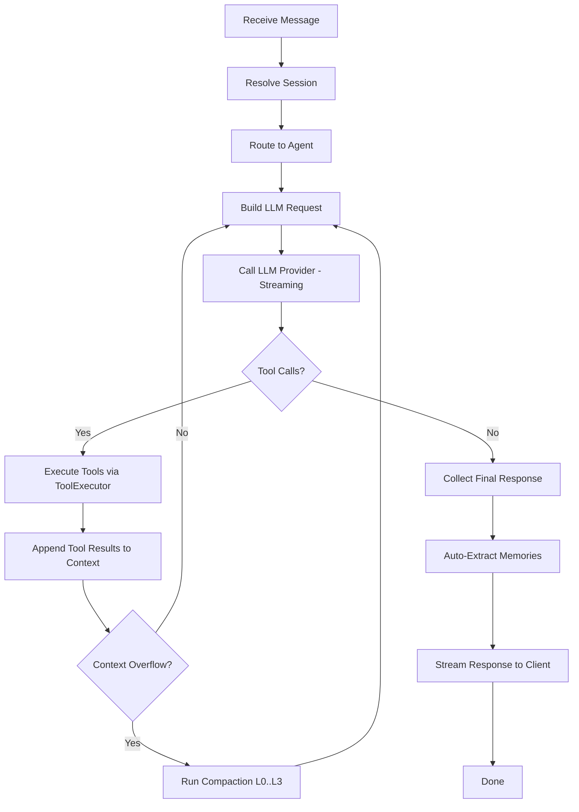
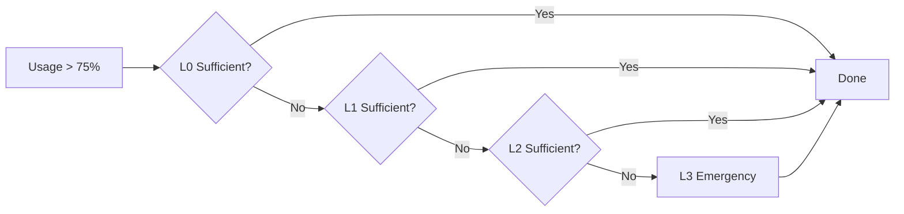
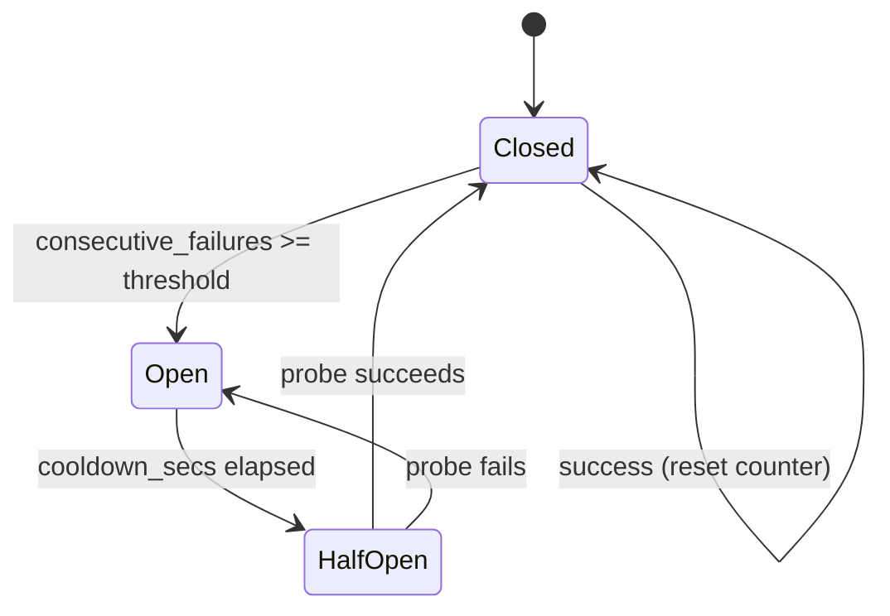
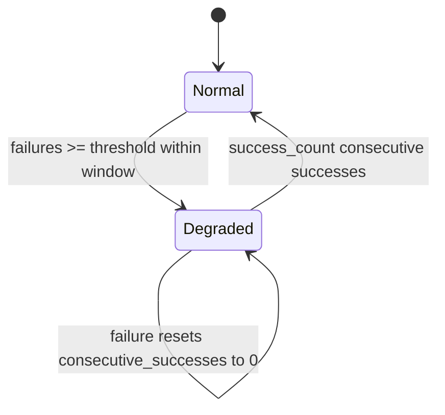

# 02 - Core Agent System

> **Module Goal:** Implement the AI brain of Antec — the agent loop that receives messages, routes them to the right LLM, manages context windows, executes tools, and streams responses back, with automatic failover and cost-optimized model routing.

### Why This Module Exists

The core agent system is the heart of Antec. Every user message flows through it: prompt assembly, LLM selection, context management, tool orchestration, and response streaming. Without a robust agent loop, the system is just a collection of disconnected utilities.

This module handles the hardest problems in AI assistant design: keeping conversations within context limits through 4-level compaction (L0-L3), routing messages to cost-appropriate models using 10 classification signals, and recovering gracefully from provider failures via circuit breaker patterns. It ensures users get reliable, cost-effective AI responses regardless of which LLM provider is available.

### Business Benefits

| Benefit | Description |
|---------|-------------|
| **Model agnostic** | Supports 4 providers (Anthropic, OpenAI, Google, Ollama) — switch models without code changes |
| **Cost optimization** | Heuristic routing sends simple queries to cheaper models, saving up to 80% on API costs |
| **Resilience** | Circuit breaker failover ensures responses even when a provider is down |
| **Unlimited conversations** | 4-level context compaction prevents context window overflow — conversations can run indefinitely |
| **Streaming** | Token-by-token streaming provides instant feedback to users |
| **Local-first** | Ollama support means fully offline operation with no API costs |

> **Crate**: `antec-core` (`crates/antec-core/`)
> **Purpose**: Agent loop state machine, LLM provider abstraction, context window management, message routing, behaviors, crash guard, and metrics.

---

## 1. Agent Loop

The agent loop is the central state machine that processes every user message from ingress to final response. It orchestrates LLM calls, tool execution, context management, and memory extraction.

### Pipeline Steps

1. **Receive message** from gateway (REST or WebSocket)
2. **Resolve session** -- create or retrieve by composite key `channel:conversation_id`
3. **Route to agent** -- by `@mention`, pattern match, or default agent
4. **Build LLM request** -- system prompt + behavior prompts + context window messages + tool definitions
5. **Call LLM provider** (streaming via `mpsc::Receiver<StreamEvent>`)
6. **If tool calls in response**: execute tools via `ToolExecutor`, append results to context, loop back to step 4
7. **If no tool calls**: collect final response text
8. **Auto-extract memories** from conversation (cadence-controlled)
9. **Stream response** back to client via WebSocket / SSE / REST

### Agent Loop Flowchart



### AgentLoop Struct

```rust
pub struct AgentLoop {
    provider: Box<dyn LlmProvider>,
    context: ContextWindow,
    config: AgentConfig,
    tool_executor: Option<Arc<dyn ToolExecutor>>,
    system_prompt: String,
    max_tool_calls: usize,    // default: 25
    session_id: String,
}
```

Key methods:

- `new(provider, config, session_id)` -- create with default 128K token context window
- `with_tool_executor(executor)` -- attach tool execution capability
- `with_system_prompt(prompt)` -- set the system prompt
- `process_message(content, stream_tx)` -- main entry point, runs the full loop
- `process_message_streaming(content, stream_tx)` -- streaming variant that emits `StreamEvent`s

The loop enforces a maximum of `max_tool_calls` (default 25) iterations to prevent infinite tool-use loops. When exceeded, returns `CoreError::MaxToolCalls`.

### ChannelContext

Populated from `UnifiedMessage` at ingress. The agent core uses this to emit typing indicators and route responses without inspecting channel-specific fields.

```rust
#[derive(Debug, Clone, Default)]
pub struct ChannelContext {
    /// Channel type identifier (e.g. "discord", "console", "whatsapp").
    pub channel: String,
    /// Channel-specific conversation ID for response routing.
    pub conversation_id: String,
    /// Session isolation key: "{channel}:{channel_id}".
    pub session_key: String,
}
```

### ToolExecutor Trait

```rust
#[async_trait]
pub trait ToolExecutor: Send + Sync {
    /// Execute a tool by name with the given JSON arguments.
    async fn execute(
        &self,
        name: &str,
        args: serde_json::Value,
    ) -> Result<ToolResult, CoreError>;

    /// Return the tool definitions available for LLM function calling.
    fn definitions(&self) -> Vec<ToolDefinition>;
}
```

---

## 2. Context Window Management

The `ContextWindow` struct manages the sliding window of messages sent to the LLM, tracking token usage and performing multi-level compaction when the window grows too large.

### ContextWindow Struct

```rust
pub struct ContextWindow {
    messages: Vec<Message>,
    max_tokens: usize,  // default: 128,000
}
```

### Key Methods

| Method | Description |
|--------|-------------|
| `new(max_tokens)` | Create empty window with token budget |
| `add(msg)` | Append a message |
| `messages()` | Reference to all messages |
| `total_tokens()` | Estimated total token count |
| `usage_ratio()` | Current usage as fraction of max (0.0 - 1.0+) |
| `compact_l0()` | Level-0 compaction |
| `compact_l1()` | Level-1 compaction |
| `compact_l2(summary)` | Level-2 compaction with LLM-generated summary |
| `compact_l3()` | Level-3 emergency compaction |
| `messages_for_llm()` | Clone messages for LLM request |
| `clear()` | Remove all messages |

### Token Estimation

Approximately 4 characters per token. Includes content text plus tool call names and serialized arguments:

```rust
fn estimate_tokens(&self) -> usize {
    let mut chars = self.content.len();
    for tc in &self.tool_calls {
        chars += tc.name.len();
        chars += tc.arguments.to_string().len();
    }
    chars / 4
}
```

### Compaction Threshold

Compaction triggers at **0.75** usage ratio (75% of `max_tokens`).

### Compaction Levels



| Level | Strategy | Details |
|-------|----------|---------|
| **L0** | Remove old tool pairs + trim whitespace | Removes tool_call/tool_result pairs more than 20 messages from the end. Strips tool_calls from older assistant messages. Trims whitespace in older messages. Keeps system and regular user/assistant messages. |
| **L1** | Dedup consecutive same-role + collapse tool sequences | Protects the most recent 10 messages. Merges consecutive messages with the same role (except System) in the older region. Collapses sequences of 3+ tool call/result pairs into a summary message: `[Collapsed N tool calls: tool1, tool2, ...]` |
| **L2** | LLM-based summarization | Replaces the oldest 40% of non-system messages with a single summary. Summary text is generated externally by a fast LLM and passed in. System messages are preserved and placed first. Summary format: `[COMPACTED] Summary of earlier conversation: {text}` |
| **L3** | Emergency truncation | Keeps only system messages + the most recent 10 non-system messages. All other messages are discarded. Last resort when L0-L2 are insufficient. |

---

## 3. Message Types

### Role Enum

```rust
#[derive(Debug, Clone, Copy, PartialEq, Eq, Serialize, Deserialize)]
#[serde(rename_all = "lowercase")]
pub enum Role {
    User,
    Assistant,
    System,
    Tool,
}
```

### Message Struct

```rust
#[derive(Debug, Clone, Serialize, Deserialize)]
pub struct Message {
    pub id: String,               // UUID v4
    pub role: Role,
    pub content: String,
    pub tool_calls: Vec<ToolCall>,       // empty unless assistant initiated tools
    pub tool_call_id: Option<String>,    // set for Tool role messages
    pub timestamp: i64,                  // Unix timestamp
    pub token_count: Option<i32>,        // optional cached count
}
```

Factory methods: `Message::user(content)`, `Message::assistant(content)`, `Message::system(content)`, `Message::tool_result(result)`.

Tool result messages with `is_error: true` prefix content with `[ERROR]`.

### ToolCall Struct

```rust
#[derive(Debug, Clone, Serialize, Deserialize)]
pub struct ToolCall {
    pub id: String,
    pub name: String,
    pub arguments: serde_json::Value,
}
```

### ToolResult Struct

```rust
#[derive(Debug, Clone, Serialize, Deserialize)]
pub struct ToolResult {
    pub call_id: String,
    pub name: String,
    pub output: String,
    pub is_error: bool,
}
```

---

## 4. LLM Providers

### Provider Trait

```rust
#[async_trait]
pub trait LlmProvider: Send + Sync {
    /// Send a request and get a complete response.
    async fn complete(&self, request: &LlmRequest) -> Result<LlmResponse, CoreError>;

    /// Send a request and get a streaming response via a channel.
    async fn stream(
        &self,
        request: &LlmRequest,
    ) -> Result<tokio::sync::mpsc::Receiver<StreamEvent>, CoreError>;

    /// The human-readable name of this provider.
    fn name(&self) -> &str;
}
```

### LlmRequest

```rust
#[derive(Debug, Clone)]
pub struct LlmRequest {
    pub model: String,
    pub messages: Vec<Message>,
    pub tools: Vec<ToolDefinition>,
    pub temperature: f64,              // default: 0.7
    pub max_tokens: Option<u32>,       // default: 4096
    pub system_prompt: Option<String>,
}
```

### LlmResponse

```rust
#[derive(Debug, Clone)]
pub struct LlmResponse {
    pub content: String,
    pub tool_calls: Vec<ToolCall>,
    pub finish_reason: FinishReason,
    pub usage: TokenUsage,
}
```

### FinishReason

```rust
#[derive(Debug, Clone, Copy, PartialEq)]
pub enum FinishReason {
    Stop,       // Natural end of response
    ToolUse,    // Response contains tool calls to execute
    MaxTokens,  // Hit max_tokens limit
    Error,      // Provider error during generation
}
```

### TokenUsage

```rust
#[derive(Debug, Clone, Copy, Default)]
pub struct TokenUsage {
    pub input_tokens: u32,
    pub output_tokens: u32,
}
```

### ToolDefinition

```rust
#[derive(Debug, Clone, Serialize, Deserialize)]
pub struct ToolDefinition {
    pub name: String,
    pub description: String,
    pub parameters: serde_json::Value, // JSON Schema
}
```

### StreamEvent Enum

All variants emitted during streaming:

```rust
pub enum StreamEvent {
    // -- Core streaming events --
    /// A chunk of text content.
    Delta(String),
    /// Start of a new tool call from the LLM.
    ToolCallStart { id: String, name: String },
    /// Incremental tool call argument data.
    ToolCallDelta { id: String, arguments_delta: String },
    /// A tool call has completed (success or error).
    ToolCallEnd { name: String, is_error: bool, result: String },
    /// The final complete response (sent last).
    Done(LlmResponse),
    /// An error occurred during streaming.
    Error(String),

    // -- Tool lifecycle events --
    /// A tool execution has started (emitted before execute).
    ToolStarted { name: String, params: serde_json::Value, session_id: String },
    /// Progress update for a long-running tool.
    ToolProgress { name: String, progress_percent: u32, status: String },
    /// A tool execution completed successfully.
    ToolCompleted { name: String, result_summary: String, duration_ms: u64 },
    /// A tool execution failed.
    ToolFailed { name: String, error: String, risk_level: String },

    // -- Agent pipeline events --
    /// Recalled memories with relevance explanations.
    MemoriesRecalled(Vec<RecalledMemory>),
    /// The provider was switched due to failover.
    ProviderSwitch { from: String, to: String },
    /// Memories automatically extracted from the conversation.
    MemoriesExtracted { count: usize, keys: Vec<String> },
    /// Model selected by the routing heuristic.
    ModelSelected { provider: String, model: String, reason: String },
    /// Typing indicator for non-console channels.
    TypingIndicator { channel: String, conversation_id: String },
    /// Context window was compacted (L2 LLM summarization).
    Compacted { start: usize, end: usize, summary: String },
}
```

---

## 5. Provider Implementations

### Anthropic (Claude Messages API)

| Property | Value |
|----------|-------|
| **Struct** | `AnthropicProvider` |
| **Base URL** | `https://api.anthropic.com` (configurable) |
| **API Version** | `2023-06-01` |
| **Default max_tokens** | `4096` |
| **Auth Header** | `x-api-key: {key}`, `anthropic-version: 2023-06-01` |

**Request format specifics:**
- System prompts extracted to top-level `system` field (not as a message)
- System role messages in the conversation are concatenated into the `system` field
- Assistant messages use content blocks: `text` blocks for content, `tool_use` blocks for tool calls (with `id`, `name`, `input` fields)
- Tool results go inside user messages as `tool_result` content blocks (with `tool_use_id` and `content`)
- Multiple tool results are batched into a single user turn (Anthropic requires alternating user/assistant)

**Streaming format:**
- SSE (Server-Sent Events)
- Event types: `message_start`, `content_block_start`, `content_block_delta`, `content_block_stop`, `message_delta`, `message_stop`
- Content deltas have `type: "text_delta"` with `text` field
- Tool use deltas have `type: "input_json_delta"` with `partial_json` field

### OpenAI (Chat Completions API)

| Property | Value |
|----------|-------|
| **Struct** | `OpenAiProvider` |
| **Base URL** | `https://api.openai.com/v1` (configurable) |
| **Default max_tokens** | `4096` |
| **Auth Header** | `Authorization: Bearer {key}` |

**Request format specifics:**
- System prompt goes as the first message with `role: "system"`
- Uses `max_completion_tokens` field (not deprecated `max_tokens`)
- Reasoning models (`o1*`, `o3*`, `o4*`) skip the `temperature` parameter
- Tool calls in assistant messages use `function` wrapper: `{"id", "type": "function", "function": {"name", "arguments"}}` where `arguments` is a JSON string
- Tool results use `role: "tool"` with `tool_call_id`

**Streaming format:**
- SSE with `data: [DONE]` terminator
- Tool calls are indexed in delta objects, accumulated via HashMap by index
- Each delta may contain partial `function.name` or `function.arguments` strings

### Google Gemini (OpenAI-compatible endpoint)

| Property | Value |
|----------|-------|
| **Struct** | `GoogleProvider` |
| **Base URL** | `https://generativelanguage.googleapis.com/v1beta/openai` (configurable) |
| **Default max_tokens** | `4096` |
| **Auth Header** | `Authorization: Bearer {key}` |

**Request format specifics:**
- Uses the same request/response format as OpenAI (OpenAI-compatible endpoint)
- System prompt as first `system` role message
- Same tool call and tool result format as OpenAI

### Ollama (Local Models)

| Property | Value |
|----------|-------|
| **Struct** | `OllamaProvider` |
| **Base URL** | `http://127.0.0.1:11434` (configurable) |
| **Auth** | None required |

**Request format specifics:**
- System prompt as a `system` role message
- Temperature sent inside an `options` object: `{"options": {"temperature": 0.7}}`
- Tool calls in assistant messages use `function` wrapper without `id` field (Ollama generates none)
- UUID generated for tool call IDs when missing from the response
- Tool results use `role: "tool"` with content only (no `tool_call_id`)

**Streaming format:**
- Newline-delimited JSON (not SSE)
- Each line is a JSON object with `message.content` for text deltas
- Final message has `done: true` with usage statistics

### API Key Resolution Priority

For all providers requiring authentication, keys are resolved in this order:

1. **Encrypted vault** -- `SecretVault` via `CredentialStore.get_secret(env_var_name)`
2. **Custom env var** -- `config.api_key_env` field from TOML config
3. **Default env var** -- `ANTHROPIC_API_KEY`, `OPENAI_API_KEY`, `GOOGLE_API_KEY`

```rust
pub struct CredentialStore {
    vault: Arc<SecretVault>,
    db: Arc<Database>,
}

impl CredentialStore {
    pub fn get_secret(&self, name: &str) -> Option<String>;
}
```

### Provider Factory Functions

```rust
/// Create a single provider by name.
pub fn create_provider(name: &str, config: &ProvidersConfig) -> Result<Box<dyn LlmProvider>, CoreError>;

/// Create with vault-backed credential resolution.
pub fn create_provider_with_credentials(
    name: &str, config: &ProvidersConfig, creds: Option<&CredentialStore>,
) -> Result<Box<dyn LlmProvider>, CoreError>;

/// Create a provider chain with failover support.
pub fn create_provider_chain_with_credentials(
    config: &ModelsConfig, creds: Option<&CredentialStore>,
) -> Result<Box<dyn LlmProvider>, CoreError>;

/// Test connectivity by sending a minimal request.
pub async fn test_provider_connectivity(
    provider: &dyn LlmProvider,
) -> Result<Duration, CoreError>;
```

---

## 6. Failover Provider

The `FailoverProvider` wraps a primary provider and a list of fallback providers with a circuit breaker pattern.

### Circuit Breaker State Machine



### BreakerState Enum

```rust
#[derive(Debug, Clone, Copy, PartialEq)]
pub enum BreakerState {
    /// Provider is healthy, requests flow normally.
    Closed,
    /// Provider has exceeded failure threshold, requests are blocked.
    Open,
    /// Cooldown expired, next request is a probe.
    HalfOpen,
}
```

### Configuration

```rust
pub struct FailoverConfig {
    pub failover_providers: Vec<String>,     // default: []
    pub max_retries: u32,                    // default: 2
    pub retry_delay_ms: u64,                 // default: 1000
    pub cooldown_secs: u64,                  // default: 60
    pub circuit_breaker_threshold: u32,      // default: 3
}
```

### Error Classification

```rust
pub enum ProviderErrorKind {
    ServerError,   // 500, 502, 503, "server error", "internal error"
    RateLimited,   // 429, "rate limit"
    Timeout,       // "timeout", "timed out"
    Other,         // everything else
}
```

Retryable errors: `ServerError`, `RateLimited`, `Timeout`. Non-retryable: `Other`.

### Behavior

1. **Iterates providers** in order (primary first, then fallbacks)
2. **Checks circuit breaker** -- skips providers with `Open` state (unless cooldown has elapsed, transitioning to `HalfOpen`)
3. **On success**: records success (resets failure counter, transitions to `Closed`)
4. **On failure**: records failure (increments counter, transitions to `Open` at threshold)
5. **On failover during streaming**: emits `StreamEvent::ProviderSwitch { from, to }` as the first event, then forwards the inner stream
6. **Retry delay**: sleeps `retry_delay_ms` between attempts
7. **Max retries**: stops after `max_retries` total attempts across all providers

---

## 7. Message Routing & Classification

Heuristic complexity scoring (0.0 - 1.0) for smart model routing. Routes simple messages to cheaper/faster models and complex messages to more capable ones.

### 10 Classification Signals

| # | Signal | Score Range | Trigger |
|---|--------|-------------|---------|
| 1 | **Message length** | 0 - 0.25 | >300 chars: +0.05, >800: +0.15, >2000: +0.25 |
| 2 | **Code blocks** | 0 - 0.25 | 1+ blocks: +0.15, 3+ blocks: +0.25 |
| 3 | **Complex keywords** | 0 - 0.30 | Keywords: analyze, implement, refactor, optimize, algorithm, debug, architecture, design pattern, performance, benchmark, explain in detail, step by step, compare, trade-off, security, vulnerability, migration, concurrency, distributed, scalab, complex. 1 hit: +0.10, 2+: +0.20, 4+: +0.30 |
| 4 | **Multi-part questions** | 0 - 0.20 | 2+ question marks: +0.10, 4+: +0.20 |
| 5 | **Multi-line input** | 0 - 0.15 | >8 lines: +0.08, >20 lines: +0.15 |
| 6 | **Math/technical** | 0 - 0.10 | Keywords: equation, formula, calculate, integral, derivative, matrix, probability, regression, theorem, proof |
| 7 | **Sentence complexity** | 0 - 0.10 | Average >25 words per sentence |
| 8 | **Enumeration/lists** | 0 - 0.15 | 2+ list items: +0.05, 4+: +0.15 |
| 9 | **Conversation context** | 0 - 0.10 | distinct_tool_count >= 3: +0.10, message_count > 15: +0.05 |
| 10 | **Simple-message penalty** | -0.10 | <= 5 words and no other signals |

Score is clamped to `[0.0, 1.0]`.

### ConversationContext

```rust
#[derive(Debug, Clone, Default)]
pub struct ConversationContext {
    pub message_count: usize,
    pub tools_used: bool,
    pub distinct_tool_count: usize,
}
```

### Routing Modes

```rust
pub enum RoutingMode {
    Auto,           // Use heuristic score to choose model
    AlwaysDefault,  // Always use default (simple/cheaper) model
    AlwaysComplex,  // Always use complex (more capable) model
}
```

### RoutingDecision

```rust
#[derive(Debug, Clone)]
pub struct RoutingDecision {
    pub provider: String,
    pub model: String,
    pub reason: String,
    pub complexity_score: f64,
    pub routed_simple: bool,
}
```

### RoutingConfig

```rust
pub struct RoutingConfig {
    pub enabled: bool,
    pub mode: String,                      // "auto", "always_default", "always_complex"
    pub simple_instance: Option<String>,
    pub complex_instance: Option<String>,
    pub simple_model: Option<String>,
    pub simple_provider: Option<String>,
    pub complex_model: Option<String>,
    pub complex_provider: Option<String>,
    pub complexity_threshold: f64,         // default: 0.5
}
```

### RoutingSavings

Tracks cost savings from routing simple queries to cheaper models:

```rust
pub struct RoutingSavings {
    pub simple_routed_count: u64,
    pub complex_routed_count: u64,
    pub estimated_savings_usd: f64,
}

impl RoutingSavings {
    pub fn calculate_saving(
        complex_cost_per_1k: f64,
        simple_cost_per_1k: f64,
        estimated_tokens: f64,
    ) -> f64;
}
```

---

## 8. Behaviors System

The `BehaviorManager` loads Markdown files from a behaviors directory and a single `behavior.md` file, combining them into additional system prompt context.

### BehaviorFile

```rust
pub struct BehaviorFile {
    pub name: String,
    pub content: String,
    pub priority: i32,
}
```

### BehaviorManager

```rust
pub struct BehaviorManager {
    behaviors_dir: PathBuf,
    behavior_file: Option<PathBuf>,  // e.g. ~/.antec/behavior.md
}
```

### File Format

Markdown files with optional YAML frontmatter:

```markdown
---
priority: 10
---
Actual behavior content here.
```

If no frontmatter, priority defaults to 0.

### Constants

- `MAX_BEHAVIOR_SIZE = 4096` bytes per file
- Files exceeding limit are truncated on load, rejected on save

### Key Methods

| Method | Description |
|--------|-------------|
| `new(behaviors_dir)` | Create manager pointing at directory |
| `with_behavior_file(path)` | Set path to single `behavior.md` file |
| `load_all()` | Load all `.md` files from behaviors directory |
| `combined_prompt()` | Single `behavior.md` first, then directory files sorted by priority (desc), joined with `\n\n` |
| `get(name)` | Get a single behavior by name |
| `save(name, content, priority)` | Save/update a behavior file (adds YAML frontmatter) |
| `delete(name)` | Delete a behavior file; returns whether it existed |
| `list()` | List all behavior file names |
| `load_behavior_file()` | Load single `behavior.md` content |
| `save_behavior_file(content)` | Save single `behavior.md` (validates size limit) |

---

## 9. Crash Guard

Rolling-window failure tracker with degraded mode for system resilience.

### CrashGuardConfig

```rust
pub struct CrashGuardConfig {
    pub window_secs: u64,           // default: 60
    pub threshold: u32,             // default: 5
    pub probe_interval_secs: u64,   // default: 30
    pub success_count: u32,         // default: 3
}
```

### DegradedMode

```rust
pub enum DegradedMode {
    Normal,    // All features enabled
    Degraded,  // Non-essential features (skills, cron) disabled; core chat remains
}
```

### State Machine



### Behavior

- **Failure recording**: Prunes entries older than `window_secs`, appends current timestamp. Resets consecutive success counter. Transitions to `Degraded` when failure count reaches threshold.
- **Success recording**: Only meaningful in `Degraded` mode. Increments consecutive success counter. Exits degraded mode when `success_count` reached, clearing all failure history.
- **Backoff**: Exponential `min(1s * 2^failures, 30s)`.
- **Probe interval**: `probe_interval_secs` between recovery probes.

### Key Methods

| Method | Description |
|--------|-------------|
| `new(config)` | Create with given configuration |
| `record_failure()` | Record a failure event |
| `record_success()` | Record a success (counts toward recovery) |
| `is_degraded()` | Whether system is in degraded mode |
| `mode()` | Current `DegradedMode` |
| `failure_count()` | Failures within rolling window |
| `backoff_duration()` | Computed backoff duration |
| `probe_interval()` | Duration between recovery probes |
| `consecutive_successes()` | Current recovery progress |

---

## 10. Metrics Collector

Thread-safe in-memory metrics with `RwLock<HashMap>` for per-tool counters and atomic counters for retrieval quality.

### MetricsCollector

```rust
pub struct MetricsCollector {
    tools: RwLock<HashMap<String, ToolCounters>>,
    // Global retrieval quality counters (AtomicU64)
    recall_attempts, recall_hits,
    compaction_count, compaction_l1, compaction_l2, compaction_l3,
    extraction_attempts, extraction_successes,
}
```

### Recording Methods

| Method | Description |
|--------|-------------|
| `record_tool_success(name, latency_ms)` | Record successful tool execution |
| `record_tool_error(name, latency_ms)` | Record failed tool execution |
| `record_recall(hit: bool)` | Record memory recall attempt |
| `record_compaction(level)` | Record compaction event (L1/L2/L3) |
| `record_extraction(success: bool)` | Record auto-extraction attempt |
| `snapshot()` | Point-in-time `MetricsSnapshot` |
| `tool_metrics(name)` | Single tool metrics |
| `reset()` | Clear all metrics |

### CompactionLevel

```rust
pub enum CompactionLevel {
    L1Dedup,
    L2Llm,
    L3Truncate,
}
```

### MetricsSnapshot

```rust
pub struct MetricsSnapshot {
    pub tools: Vec<ToolMetrics>,          // sorted by total_count desc
    pub retrieval: RetrievalMetrics,
    pub total_tool_executions: u64,
    pub overall_tool_error_rate: f64,
}
```

### ToolMetrics

```rust
pub struct ToolMetrics {
    pub tool_name: String,
    pub success_count: u64,
    pub error_count: u64,
    pub total_count: u64,
    pub error_rate: f64,
    pub avg_latency_ms: f64,
    pub total_latency_ms: u64,
}
```

### RetrievalMetrics

```rust
pub struct RetrievalMetrics {
    pub recall_attempts: u64,
    pub recall_hits: u64,
    pub recall_hit_rate: f64,
    pub compaction_count: u64,
    pub compaction_l1_count: u64,
    pub compaction_l2_count: u64,
    pub compaction_l3_count: u64,
    pub extraction_attempts: u64,
    pub extraction_successes: u64,
    pub extraction_success_rate: f64,
}
```

---

## 11. Error Types

```rust
#[derive(Debug, thiserror::Error)]
pub enum CoreError {
    #[error("Config error: {0}")]
    Config(String),

    #[error("Provider error: {0}")]
    Provider(String),

    #[error("Storage error: {0}")]
    Storage(#[from] antec_storage::StorageError),

    #[error("Tool execution error: {0}")]
    ToolExecution(String),

    #[error("Context overflow")]
    ContextOverflow,

    #[error("Max tool calls exceeded")]
    MaxToolCalls,

    #[error("IO error: {0}")]
    Io(#[from] std::io::Error),
}
```

---

## 12. Module Exports (lib.rs)

The `antec-core` crate re-exports all major types from its public API:

```rust
pub mod config;
pub mod crash_guard;
pub mod messages;
pub mod providers;
pub mod context;
pub mod agent;
pub mod agents;
pub mod bundled_agents;
pub mod behaviors;
pub mod routing;
pub mod parallel;
pub mod metrics;
```

Key re-exports:
- `AntecConfig`, `AgentConfig`, `RoutingConfig`, `RoutingMode`
- `CrashGuard`, `CrashGuardConfig`, `DegradedMode`
- `Message`, `Role`, `ToolCall`, `ToolResult`
- `LlmProvider`, `LlmRequest`, `LlmResponse`, `StreamEvent`, `ToolDefinition`, `FinishReason`, `TokenUsage`, `CredentialStore`
- `BreakerState`, `ProviderErrorKind`, `classify_provider_error`, `is_retryable`
- `ContextWindow`
- `AgentLoop`, `ToolExecutor`
- `AgentRouter`, `AgentSpawner`, `AgentTomlLoader`, `ResolvedAgentConfig`
- `ParallelExecutor`, `ParallelExecution`, `ParallelTask`, `SubAgentRunner`
- `MessageClassifier`, `ModelRouter`, `RoutingDecision`, `ConversationContext`, `RoutingSavings`
- `MetricsCollector`, `MetricsSnapshot`, `CompactionLevel`
