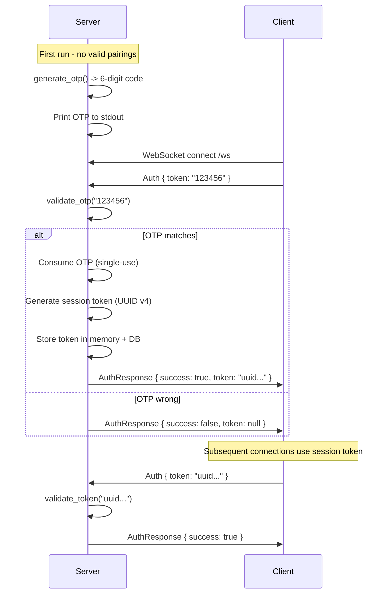
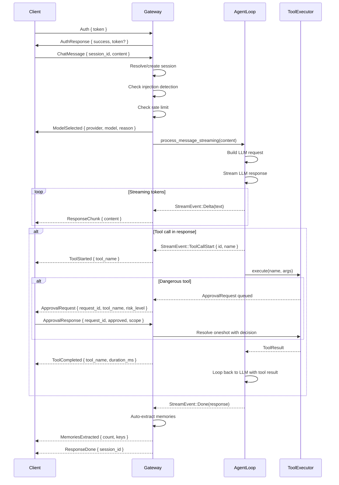
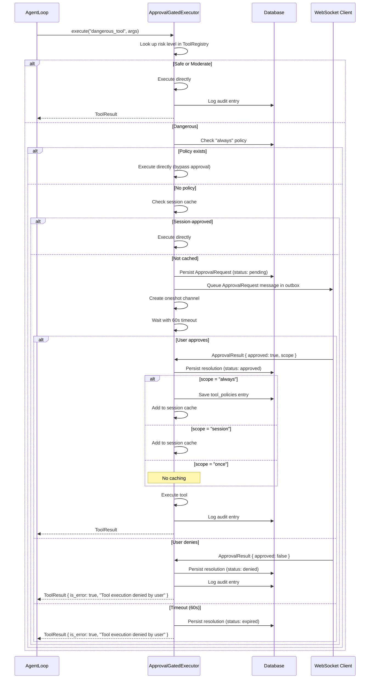
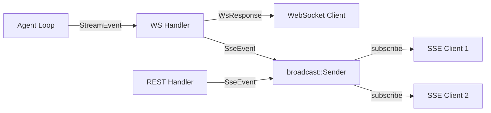

# 03 - HTTP Gateway & API

> **Module Goal:** Provide the HTTP/WebSocket entry point for all external communication — REST API with 148+ routes, real-time WebSocket streaming, OTP-based authentication, and Server-Sent Events — serving as the single interface between Antec and the outside world.

### Why This Module Exists

Every interaction with Antec flows through the gateway: the web console connects via WebSocket, external channels call REST endpoints, and administrative tools use the API for configuration. The gateway translates HTTP requests into internal operations and streams results back in real-time.

It handles authentication via one-time pairing codes (no passwords to manage), manages concurrent WebSocket connections with per-session isolation, and exposes a comprehensive REST API covering every system capability. The gateway ensures that the powerful internal engine is accessible, secure, and responsive.

### Business Benefits

| Benefit | Description |
|---------|-------------|
| **Single entry point** | One Axum server handles REST, WebSocket, SSE, and static file serving |
| **Zero-config auth** | OTP pairing eliminates password management — secure yet frictionless |
| **Real-time streaming** | WebSocket delivers token-by-token responses for instant user feedback |
| **Comprehensive API** | 148+ routes cover every feature — full programmatic control |
| **Session isolation** | Per-session state prevents cross-talk between users and channels |
| **CORS & security** | Built-in CORS, rate limiting, and request validation |

> **Crate**: `antec-gateway` (`crates/antec-gateway/`)
> **Purpose**: Axum HTTP/WebSocket server, REST API routes, WebSocket protocol, SSE transport, authentication, and approval gating.

---

## 1. Server Architecture

### Framework & Middleware

| Component | Implementation |
|-----------|---------------|
| **Framework** | Axum (Tower-based) |
| **Bind address** | `127.0.0.1:8088` (configurable via `server.bind_address` / `server.bind_port`) |
| **CORS** | Fully permissive -- all origins, methods, and headers allowed |
| **Compression** | Automatic gzip via `tower_http::compression::CompressionLayer` |
| **Static assets** | Embedded via `rust-embed` (`antec_console::ConsoleAssets`) with SPA fallback to `index.html` |

### Router Construction

```rust
pub fn build_router(state: AppState) -> Router {
    Router::new()
        .route("/ws", get(ws_handler))
        .nest("/api/v1", api_routes())
        .fallback(serve_console)
        .layer(CorsLayer::new().allow_origin(Any).allow_methods(Any).allow_headers(Any))
        .layer(CompressionLayer::new())
        .with_state(state)
}
```

The `build_router` function is factored out from `start_server` so integration tests can construct the same router without binding to a network port.

### Static Asset Serving

The fallback handler serves embedded web console assets:
1. Try the exact request path against `ConsoleAssets::get(path)`
2. If no match, serve `index.html` for SPA routing
3. If no assets embedded, return 404

MIME types detected by file extension (html, css, js, json, svg, png, jpg, ico, woff, woff2, ttf, txt).

### AppState

Shared application state threaded through all Axum handlers via `Arc`. All fields use `Arc` wrappers so the struct can be cheaply cloned across handler tasks.

```rust
#[derive(Clone)]
pub struct AppState {
    // -- Storage & Configuration --
    pub db: Arc<Database>,
    pub config: Arc<RwLock<AntecConfig>>,
    pub config_path: PathBuf,

    // -- Authentication --
    pub auth: Arc<AuthManager>,

    // -- Agent Core --
    pub tool_executor: Arc<dyn ToolExecutor>,
    pub registry: Arc<ToolRegistry>,
    pub sessions: Arc<RwLock<HashMap<String, AgentSession>>>,
    pub provider_name: String,
    pub default_model: String,

    // -- Approval System --
    pub approval_pending: PendingApprovals,    // Arc<RwLock<HashMap<String, oneshot::Sender>>>
    pub approval_outbox: ApprovalOutbox,       // Arc<RwLock<HashMap<String, Vec<WsResponse>>>>

    // -- Security --
    pub injection_detector: Arc<InjectionDetector>,
    pub secret_vault: Arc<SecretVault>,
    pub secret_scanner: Arc<SecretScanner>,
    pub rate_limiter: Arc<Mutex<GcraLimiter>>,
    pub audit_hmac_key: Vec<u8>,

    // -- Memory --
    pub memory_manager: Arc<MemoryManager>,

    // -- Internationalization --
    pub i18n: Arc<I18n>,

    // -- Scheduling --
    pub scheduler: Arc<SchedulerManager>,

    // -- Channels --
    pub channel_router: Arc<ChannelRouter>,
    pub last_channel: Arc<RwLock<HashMap<String, String>>>,

    // -- Skills --
    pub skill_manager: Arc<SkillManager>,
    pub hub_service: Arc<HubService>,
    pub skill_registry: Arc<SkillRegistry>,

    // -- MCP --
    pub mcp_servers: Arc<RwLock<Vec<McpServerConfig>>>,
    pub mcp_manager: Arc<McpManager>,

    // -- Behaviors --
    pub behavior_manager: Arc<BehaviorManager>,

    // -- Sandbox --
    pub wasm_runtime: Option<Arc<dyn Any + Send + Sync>>,

    // -- Resilience --
    pub crash_guard: Arc<RwLock<CrashGuard>>,

    // -- Parallel Execution --
    pub parallel_executor: Arc<ParallelExecutor>,

    // -- Observability --
    pub server_start_time: Instant,
    pub event_tx: broadcast::Sender<SseEvent>,
    pub metrics: Arc<MetricsCollector>,

    // -- OpenFang --
    pub extension_registry: Arc<IntegrationRegistry>,
    pub hand_registry: Arc<HandRegistry>,
}
```

---

## 2. Authentication

OTP-based pairing system for first-time client authentication.

### AuthManager

```rust
pub struct AuthManager {
    otp: RwLock<Option<String>>,
    tokens: RwLock<HashMap<String, TokenInfo>>,
    token_ttl: chrono::Duration,         // default: 720 hours (30 days)
    db: Option<Arc<Database>>,           // for persistent token storage (hash-based; tracks last_used_at)
}
```

### Pairing Flow



### Token Lifecycle

| Property | Value |
|----------|-------|
| **Format** | UUID v4 (raw token never stored; SHA-256 hash persisted as `token_hash`) |
| **TTL** | 720 hours (30 days), configurable via `with_ttl(hours)` |
| **Persistence** | Hash stored in SQLite via `AuthTokenRepo`; survives server restart |
| **Loading** | `load_tokens_from_db()` called at startup to restore valid token hashes |
| **Expiry** | `verify_token()` checks `now < expires_at` and `revoked = 0`; `cleanup_expired()` removes stale entries |
| **Revocation** | `revoke_token(id)` sets `revoked = 1` for single token; `revoke_all()` revokes everything |
| **Last-used tracking** | `touch_last_used(id)` updates `last_used_at` on each successful validation |
| **First-run detection** | `has_valid_pairing()` returns false when no valid (non-revoked, non-expired) tokens exist |

### REST Revocation

- `DELETE /api/v1/auth/sessions` -- Revoke all active session tokens

---

## 3. WebSocket Protocol (`/ws`)

### Inbound Messages (Client to Server)

All messages are JSON with a `type` discriminator tag:

```rust
#[derive(Deserialize)]
#[serde(tag = "type")]
pub enum WsMessage {
    /// Authentication request. MUST be the first message on a new connection.
    #[serde(rename = "auth")]
    Auth { token: String },

    /// A chat message to be processed by the agent.
    #[serde(rename = "message")]
    ChatMessage {
        session_id: Option<String>,
        content: String,
    },

    /// User's response to an approval request for a dangerous tool.
    #[serde(rename = "approval_response")]
    ApprovalResponse {
        request_id: String,
        approved: bool,
        scope: String,               // "once", "session", "always"
    },

    /// Request to cancel the current streaming response.
    #[serde(rename = "cancel")]
    Cancel { session_id: String },
}
```

### Outbound Messages (Server to Client)

```rust
#[derive(Serialize)]
#[serde(tag = "type")]
pub enum WsResponse {
    // -- Auth --
    #[serde(rename = "auth_response")]
    AuthResponse { success: bool, token: Option<String> },

    // -- Chat streaming --
    #[serde(rename = "response_chunk")]
    ResponseChunk { session_id: String, content: String, channel: Option<String> },

    #[serde(rename = "response_done")]
    ResponseDone { session_id: String },

    // -- Tool events --
    #[serde(rename = "tool_event")]
    ToolEvent { session_id: String, tool_name: String, event: String, result: Option<String> },

    #[serde(rename = "tool_started")]
    ToolStarted { session_id: String, tool_name: String, params: Option<Value> },

    #[serde(rename = "tool_progress")]
    ToolProgress { session_id: String, tool_name: String, progress_percent: u32, status: String },

    #[serde(rename = "tool_completed")]
    ToolCompleted { session_id: String, tool_name: String, result_summary: Option<String>, duration_ms: u64 },

    #[serde(rename = "tool_failed")]
    ToolFailed { session_id: String, tool_name: String, error: String, risk_level: String },

    // -- Memory events --
    #[serde(rename = "memories_recalled")]
    MemoriesRecalled { session_id: String, memories: Vec<RecalledMemory> },

    #[serde(rename = "memories_extracted")]
    MemoriesExtracted { session_id: String, count: usize, keys: Vec<String> },

    // -- Provider events --
    #[serde(rename = "provider_switch")]
    ProviderSwitch { session_id: String, from: String, to: String },

    #[serde(rename = "model_selected")]
    ModelSelected { session_id: String, provider: String, model: String, reason: String },

    // -- Context events --
    #[serde(rename = "compacted")]
    Compacted { session_id: String, start: usize, end: usize, summary: String },

    // -- Approval --
    #[serde(rename = "approval_request")]
    ApprovalRequest {
        request_id: String,
        session_id: String,
        tool_name: String,
        tool_params: Value,
        risk_level: String,
    },

    // -- Error --
    #[serde(rename = "error")]
    Error { message: String },
}
```

### WebSocket Flow



### Session Management

| Property | Value |
|----------|-------|
| **Per-session semaphore** | `Semaphore(1)` -- enforces ordered single-message processing (FIFO) |
| **Max queue depth** | `SESSION_MAX_QUEUE_DEPTH = 10` messages per session |
| **Queue tracking** | `Arc<AtomicUsize>` for atomic depth counter |
| **Backpressure** | `try_enqueue()` returns error when queue full |
| **Queue guard** | RAII `SessionQueueGuard` decrements depth on drop |

```rust
pub struct AgentSession {
    pub agent: AgentLoop,
    pub created_at: DateTime<Utc>,
    pub message_count: usize,
    pub processing_semaphore: Arc<Semaphore>,
    pub queue_depth: Arc<AtomicUsize>,
}
```

---

## 4. SSE Transport (`GET /api/v1/events`)

Server-Sent Events transport for streaming agent responses to non-WebSocket clients.

### SseEvent

```rust
#[derive(Clone, Debug, Serialize, Deserialize)]
pub struct SseEvent {
    pub session_id: String,
    pub event_type: String,      // Used as SSE `event:` field
    pub data: serde_json::Value,
}
```

### Query Parameters

```rust
pub struct SseQuery {
    pub session_id: Option<String>,  // Filter events by session
}
```

### Behavior

- Uses `broadcast::Sender<SseEvent>` from `AppState.event_tx` for event distribution
- SSE clients subscribe via `.subscribe()` on the broadcast channel
- Optional `session_id` query parameter filters events to a single session
- Content-Type: `text/event-stream`
- Keep-alive enabled via `KeepAlive::default()`
- Lagged subscribers (missed events) silently skip missed events

### StreamEvent to SseEvent Conversion

All `StreamEvent` variants are mapped to SSE event types:

| StreamEvent | SSE event_type | Data fields |
|-------------|---------------|-------------|
| `Delta(text)` | `delta` | `{ content }` |
| `Done(resp)` | `done` | `{ content }` |
| `Error(e)` | `error` | `{ error }` |
| `ToolCallStart` | `tool_call_start` | `{ id, name }` |
| `ToolCallDelta` | `tool_call_delta` | `{ id, arguments_delta }` |
| `ToolCallEnd` | `tool_call_end` | `{ name, is_error, result }` |
| `ToolStarted` | `tool_started` | `{ name, params }` |
| `ToolProgress` | `tool_progress` | `{ name, progress_percent, status }` |
| `ToolCompleted` | `tool_completed` | `{ name, result_summary, duration_ms }` |
| `ToolFailed` | `tool_failed` | `{ name, error, risk_level }` |
| `MemoriesRecalled` | `memories_recalled` | `{ memories }` |
| `ProviderSwitch` | `provider_switch` | `{ from, to }` |
| `MemoriesExtracted` | `memories_extracted` | `{ count, keys }` |
| `ModelSelected` | `model_selected` | `{ provider, model, reason }` |
| `Compacted` | `compacted` | `{ start, end, summary }` |
| `TypingIndicator` | `typing_indicator` | `{ channel, conversation_id }` |

---

## 5. REST API Routes (Complete Inventory)

All routes are nested under `/api/v1/`. Request and response bodies are JSON unless otherwise noted.

### Health & Status

| Method | Path | Response |
|--------|------|----------|
| `GET` | `/health` | `{ status, version, uptime_secs, memory_bytes?, active_sessions }` |
| `GET` | `/health/live` | `{ status: "ok" }` -- always 200 |
| `GET` | `/health/ready` | `{ status, mode, failure_count }` -- returns 503 when degraded |
| `GET` | `/crash-guard` | `{ mode, failure_count, consecutive_successes, threshold, success_count_required, probe_interval_secs }` |
| `GET` | `/diagnostics` | Diagnostic information about system state |

### Chat & Sessions

| Method | Path | Request Body | Response / Notes |
|--------|------|-------------|------------------|
| `POST` | `/chat/send` | `{ session_id?, content }` | `{ session_id, content }`. Supports `?stream=true` for SSE streaming |
| `GET` | `/chat/sessions` | -- | `[{ id, created_at }]` |
| `GET` | `/chat/sessions/{id}` | -- | `[{ id, role, content, created_at, channel? }]` |
| `DELETE` | `/chat/sessions/{id}` | -- | 204 No Content |

### Authentication

| Method | Path | Response |
|--------|------|----------|
| `DELETE` | `/auth/sessions` | Revoke all active session tokens. Returns count removed |

### Models

| Method | Path | Description |
|--------|------|-------------|
| `GET` | `/models` | List available models |
| `PUT` | `/models` | Update model configuration |
| `GET` | `/models/detail` | `{ default_provider, default_model, default_instance, instances[], routing, providers }` |
| `GET` | `/models/instances` | List all model instances |
| `POST` | `/models/instances` | Create a new model instance |
| `PUT` | `/models/instances/{id}` | Update a model instance |
| `DELETE` | `/models/instances/{id}` | Delete a model instance |
| `POST` | `/models/instances/{id}/default` | Set a model instance as default |

### Tools

| Method | Path | Request Body | Response |
|--------|------|-------------|----------|
| `GET` | `/tools` | -- | `[{ name, description, risk_level, source, enabled, parameters? }]` |
| `PUT` | `/tools/{name}` | `{ enabled? }` | Updated tool info |
| `POST` | `/tools/{name}/try` | `{ args }` | `{ tool, success, output, error? }` |

### Audit

| Method | Path | Description |
|--------|------|-------------|
| `GET` | `/audit` | Query audit log with filters (session_id, limit) |
| `GET` | `/audit/export` | JSON export of full audit log |
| `GET` | `/audit/csv` | CSV export of audit log |
| `GET` | `/audit/verify` | HMAC chain verification result |

### Configuration

| Method | Path | Description |
|--------|------|-------------|
| `GET` | `/config` | Get full configuration (general, server, agent, security, memory, scheduler) |
| `PUT` | `/config` | Update configuration fields |
| `POST` | `/config/reload` | Hot-reload config from TOML file |
| `GET` | `/config/allowlists` | Get channel allowlists |
| `PUT` | `/config/allowlists` | Replace channel allowlists |
| `POST` | `/config/allowlists/entry` | Add a single allowlist entry |
| `DELETE` | `/config/allowlists/entry` | Remove a single allowlist entry |
| `PUT` | `/config/persona` | Update the persona/system prompt |
| `GET` | `/config/retention` | Get data retention config |
| `PUT` | `/config/retention` | Update data retention config |
| `GET` | `/config/routing` | Get routing configuration |
| `PUT` | `/config/routing` | Update routing configuration |

### Secrets

| Method | Path | Request Body | Response |
|--------|------|-------------|----------|
| `POST` | `/secrets` | `{ name, value }` | Stores encrypted secret in vault |
| `GET` | `/secrets` | -- | `[name, ...]` (names only, no values) |
| `GET` | `/secrets/{name}` | -- | `{ name, exists }` (never reveals value) |
| `DELETE` | `/secrets/{name}` | -- | 204 No Content |

### Memory

| Method | Path | Request / Query | Response |
|--------|------|----------------|----------|
| `GET` | `/memory` | `?q=...&limit=&category=` | Search memories (FTS5 + semantic) |
| `POST` | `/memory` | `{ key, content, category, tags[], importance }` | Store a new memory |
| `GET` | `/memory/{id}` | -- | Single memory by ID |
| `PUT` | `/memory/{id}` | Partial update fields | Updated memory |
| `DELETE` | `/memory/{id}` | -- | 204 No Content |
| `GET` | `/memory/{id}/decay` | -- | Temporal decay info for memory |
| `POST` | `/memory/{id}/approve` | -- | Approve a pending memory |
| `POST` | `/memory/{id}/reject` | -- | Reject a pending memory |
| `POST` | `/memory/{id}/unarchive` | -- | Restore an archived memory |
| `GET` | `/memory/export` | -- | JSON export of all memories |
| `GET` | `/memory/export/markdown` | -- | Markdown export of all memories |
| `POST` | `/memory/import` | JSON body | Import memories from JSON |
| `GET` | `/memory/stats` | -- | Memory statistics |
| `POST` | `/memory/sweep` | -- | Run decay sweep (archive/delete old memories) |
| `GET` | `/memory/archived` | -- | List archived memories |

### Locale

| Method | Path | Description |
|--------|------|-------------|
| `GET` | `/locale` | Get current locale (en/pl) |
| `PUT` | `/locale` | Set locale |

### Scheduler

| Method | Path | Description |
|--------|------|-------------|
| `GET` | `/cron` | List all cron jobs |
| `POST` | `/cron` | Create a new cron job |
| `PUT` | `/cron/{id}` | Update a cron job |
| `DELETE` | `/cron/{id}` | Delete a cron job |
| `POST` | `/cron/{id}/run` | Manually trigger a cron job |
| `GET` | `/reminders` | List all reminders |
| `POST` | `/reminders` | Create a reminder (natural language schedule) |
| `DELETE` | `/reminders/{id}` | Delete a reminder |
| `POST` | `/heartbeat` | Create/update heartbeat |
| `GET` | `/heartbeat` | Get current heartbeat |
| `DELETE` | `/heartbeat` | Delete heartbeat |

### Channels

| Method | Path | Description |
|--------|------|-------------|
| `GET` | `/channels` | List all configured channels |
| `GET` | `/channels/status` | Status of all channels |
| `POST` | `/channels/ingress` | Unified ingress for all channels |
| `POST` | `/channels/{type}/send` | Send a message via specific channel |
| `GET` | `/channels/{type}/status` | Status of a specific channel type |
| `PUT` | `/channels/{type}/enable` | Enable a channel type |
| `PUT` | `/channels/{type}/disable` | Disable a channel type |
| `POST` | `/channels/{type}/test` | Test channel connectivity |
| `GET` | `/channels/{type}/stats` | Per-channel statistics |

**WhatsApp-specific:**

| Method | Path | Description |
|--------|------|-------------|
| `POST` | `/channels/whatsapp/webhook` | WhatsApp webhook receiver |
| `GET` | `/channels/whatsapp/pair` | Get WhatsApp pairing QR code |
| `POST` | `/channels/whatsapp/pair/refresh` | Refresh WhatsApp QR code |
| `GET` | `/channels/whatsapp/config` | Get WhatsApp configuration |
| `PUT` | `/channels/whatsapp/config` | Update WhatsApp configuration |
| `POST` | `/channels/whatsapp/test` | Test WhatsApp connection |

**Discord-specific:**

| Method | Path | Description |
|--------|------|-------------|
| `GET` | `/channels/discord/config` | Get Discord configuration |
| `PUT` | `/channels/discord/config` | Update Discord configuration |
| `POST` | `/channels/discord/test` | Test Discord connection |

**iMessage-specific:**

| Method | Path | Description |
|--------|------|-------------|
| `GET` | `/channels/imessage/config` | Get iMessage configuration |
| `PUT` | `/channels/imessage/config` | Update iMessage configuration |

### Skills

| Method | Path | Description |
|--------|------|-------------|
| `GET` | `/skills` | List installed skills |
| `POST` | `/skills/install` | Install a skill from manifest |
| `GET` | `/skills/{id}` | Get skill details |
| `PUT` | `/skills/{id}` | Update skill |
| `DELETE` | `/skills/{id}` | Uninstall a skill |
| `PUT` | `/skills/{id}/config` | Update skill configuration |
| `POST` | `/skills/import` | Import a skill package |
| `GET` | `/skills/marketplace` | Search skills marketplace |
| `POST` | `/skills/marketplace/install` | Install from marketplace |
| `GET` | `/skills/registry` | List skills in OpenFang registry |

### Skills Hub

| Method | Path | Description |
|--------|------|-------------|
| `GET` | `/hub/catalog` | Browse hub catalog |
| `GET` | `/hub/categories` | List hub categories |
| `POST` | `/hub/install` | Install from hub |
| `DELETE` | `/hub/uninstall/{name}` | Uninstall hub skill |

### Approvals

| Method | Path | Description |
|--------|------|-------------|
| `GET` | `/approvals/pending` | List pending approval requests |
| `GET` | `/approvals/history` | List historical approval decisions |

### Data Management

| Method | Path | Description |
|--------|------|-------------|
| `DELETE` | `/data/sessions/{id}` | Delete a specific session's data |
| `DELETE` | `/data/all` | Delete all user data |
| `GET` | `/data/paths` | List data file paths |
| `POST` | `/data/purge` | Purge data based on retention policy |
| `GET` | `/data/export` | Export all user data |
| `GET` | `/data/storage-info` | Storage usage information |
| `GET` | `/data/storage-paths` | Absolute paths to storage files |

### MCP (Model Context Protocol)

| Method | Path | Description |
|--------|------|-------------|
| `GET` | `/mcp` | List configured MCP servers |
| `POST` | `/mcp` | Add a new MCP server |
| `GET` | `/mcp/status` | Connection status of all MCP servers |
| `PUT` | `/mcp/{name}` | Update an MCP server config |
| `DELETE` | `/mcp/{name}` | Remove an MCP server |
| `POST` | `/mcp/{name}/reconnect` | Force reconnect to an MCP server |

### Workspace

| Method | Path | Description |
|--------|------|-------------|
| `POST` | `/workspace/upload` | Upload a file to workspace |
| `GET` | `/workspace/tree` | List workspace directory tree |
| `GET` | `/workspace/files/{*path}` | Read a workspace file |
| `PUT` | `/workspace/files/{*path}` | Write/update a workspace file |
| `GET` | `/workspace/file-versions/{*path}` | List file version history |
| `GET` | `/workspace/file-diff/{*path}` | Get diff between file versions |
| `POST` | `/workspace/file-revert/{*path}` | Revert file to a previous version |

### REPL

| Method | Path | Request Body | Response |
|--------|------|-------------|----------|
| `POST` | `/repl/eval` | `{ language, code, session_id? }` | `{ output, success, session_id }` |
| `GET` | `/repl/history` | -- | REPL execution history |

### Agents

| Method | Path | Description |
|--------|------|-------------|
| `GET` | `/agents` | List all agent definitions |
| `POST` | `/agents` | Create a new agent |
| `GET` | `/agents/{id}` | Get agent details |
| `PUT` | `/agents/{id}` | Update an agent |
| `DELETE` | `/agents/{id}` | Delete an agent |
| `PUT` | `/agents/{id}/enable` | Enable/disable an agent |

### Parallel Execution

| Method | Path | Description |
|--------|------|-------------|
| `GET` | `/parallel` | List parallel executions |
| `POST` | `/parallel` | Start a new parallel execution |
| `GET` | `/parallel/{id}` | Get execution status and results |
| `POST` | `/parallel/{id}/cancel` | Cancel a running execution |

### Extensions (OpenFang Integrations)

| Method | Path | Description |
|--------|------|-------------|
| `GET` | `/extensions` | List installed extensions |
| `POST` | `/extensions/install` | Install an extension |
| `DELETE` | `/extensions/{id}` | Uninstall an extension |
| `PUT` | `/extensions/{id}/enable` | Enable an extension |
| `PUT` | `/extensions/{id}/disable` | Disable an extension |

### Hands

| Method | Path | Description |
|--------|------|-------------|
| `GET` | `/hands` | List all hand definitions |
| `POST` | `/hands/{id}/activate` | Activate a hand |
| `POST` | `/hands/{id}/deactivate` | Deactivate a hand |
| `POST` | `/hands/{id}/pause` | Pause a hand |
| `POST` | `/hands/{id}/resume` | Resume a hand |

### Behaviors

| Method | Path | Description |
|--------|------|-------------|
| `GET` | `/behavior` | Get single behavior.md file content |
| `PUT` | `/behavior` | Save single behavior.md file |
| `GET` | `/behaviors` | List all directory-based behavior files |
| `GET` | `/behaviors/{name}` | Get a specific behavior file |
| `PUT` | `/behaviors/{name}` | Save/update a behavior file |
| `DELETE` | `/behaviors/{name}` | Delete a behavior file |

### Statistics

| Method | Path | Description |
|--------|------|-------------|
| `GET` | `/stats` | Unified stats (usage + cost + sessions + system + tool_usage) |
| `GET` | `/stats/usage` | Usage stats by provider, model, and day (`?days=30`) |
| `GET` | `/stats/cost` | Cost summary (total_cost_usd, total_input, total_output, total_calls) |
| `GET` | `/stats/sessions` | Session counts (active + total) |
| `GET` | `/stats/system` | System resource stats |
| `GET` | `/stats/messages-by-channel` | Message counts per channel |
| `GET` | `/stats/tool-usage` | Tool execution stats (`?days=30&limit=5`) |
| `GET` | `/stats/budget` | Budget tracking |
| `PUT` | `/stats/budget` | Set budget limits |
| `GET` | `/stats/csv` | CSV export of statistics |
| `GET` | `/stats/routing-savings` | Cost savings from smart routing |

### Metrics

| Method | Path | Description |
|--------|------|-------------|
| `GET` | `/metrics` | Full metrics snapshot (tools + retrieval) |
| `GET` | `/metrics/tools` | Tool execution metrics only |
| `GET` | `/metrics/tools/{name}` | Metrics for a specific tool |
| `GET` | `/metrics/retrieval` | Retrieval quality metrics |

### Environment Variables

| Method | Path | Description |
|--------|------|-------------|
| `GET` | `/env` | List runtime environment variables |
| `PUT` | `/env/{name}` | Set an environment variable |
| `DELETE` | `/env/{name}` | Unset an environment variable |

### SSE Events

| Method | Path | Description |
|--------|------|-------------|
| `GET` | `/events` | SSE stream (`?session_id=` optional filter) |

---

## 6. Approval Gating for Dangerous Tools

The `ApprovalGatedToolExecutor` wraps the inner `ToolExecutor` and gates dangerous tool calls behind explicit user approval.

### Approval Flow



### Risk Classification

| Level | Behavior |
|-------|----------|
| **Safe** | Pass through directly, no approval needed |
| **Moderate** | Pass through directly, no approval needed |
| **Dangerous** | Requires explicit user approval before execution |

### Approval Scopes

| Scope | Behavior |
|-------|----------|
| `once` | No caching. Next call for same tool requires new approval |
| `session` | Cached per-session. Same tool auto-approved for remainder of session |
| `always` | Persisted to `tool_policies` table in DB. Auto-approved across all sessions |

### Timeout

Default: **60 seconds**. If the user does not respond within this window, the tool call is auto-denied and the approval request is marked as `expired` in the database.

### Audit Logging

Every tool execution (regardless of risk level) is logged to the audit table:
- **Actor**: `"agent"`
- **Action**: `"tool_exec"`
- **Target**: tool name
- **Details**: `"ok: {output}"` or `"error: {output}"` (truncated to 200 characters)
- **Risk level**: from registry (`safe`, `moderate`, `dangerous`, `unknown`)
- **HMAC signing**: If `audit_hmac_key` is configured, entries are chained-signed

### Type Definitions

```rust
/// Pending approvals: request_id -> oneshot sender.
pub type PendingApprovals = Arc<RwLock<HashMap<String, oneshot::Sender<ApprovalResult>>>>;

/// Outbox: session_id -> list of WsResponse messages waiting to be sent.
pub type ApprovalOutbox = Arc<RwLock<HashMap<String, Vec<WsResponse>>>>;

pub struct ApprovalResult {
    pub approved: bool,
    pub scope: String,  // "once", "session", "always"
}
```

---

## 7. Streaming Architecture

### REST Streaming

`POST /api/v1/chat/send?stream=true` returns a streaming response:

1. Handler creates a `broadcast::Sender` subscription
2. Agent processing happens in a background `tokio::spawn` task
3. Background task converts `StreamEvent`s to `SseEvent`s and publishes to the broadcast channel
4. SSE clients connected to `/api/v1/events?session_id=X` receive events in real time

### Non-Streaming REST

Without `?stream=true`:
1. Handler runs the agent loop synchronously
2. Returns the complete response as JSON: `{ session_id, content }`
3. Immediate ACK

### WebSocket Streaming

The WebSocket handler directly maps `StreamEvent`s to `WsResponse` variants and sends them to the connected client. Events flow in real time as the LLM generates tokens and tools execute.

### Broadcast Architecture



The `event_tx: broadcast::Sender<SseEvent>` in `AppState` serves as the central event bus. Any handler can publish events via `publish_event(state, event)`. SSE clients filter by `session_id`.
