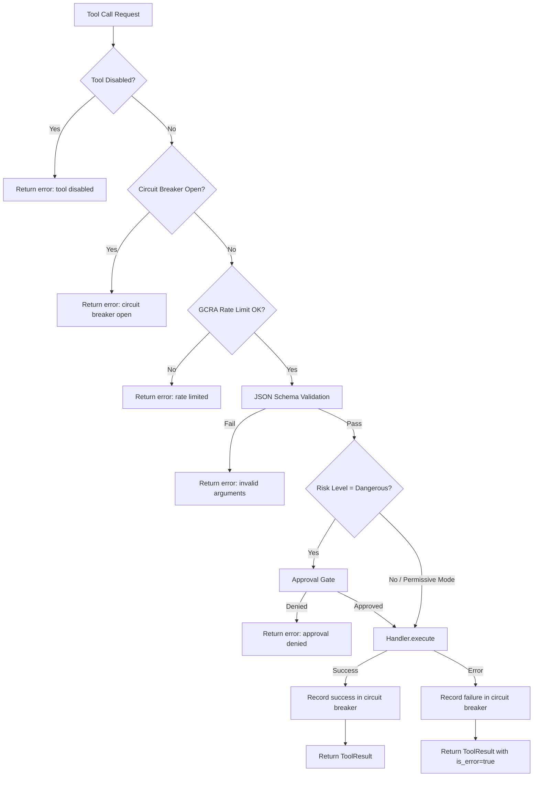

# Tool Registry & Built-in Tools

> **Module Goal:** Provide a safe, extensible tool execution framework with 43+ built-in tools, risk-based access control, and approval gating — enabling the AI to take real-world actions while preventing dangerous operations.

### Why This Module Exists

An AI assistant that can only generate text is limited. Real value comes from taking actions: reading files, searching the web, managing calendars, executing code. But unrestricted tool access is dangerous — a prompt injection could delete files or exfiltrate data.

The Tools module solves this with a three-tier risk classification (Safe/Moderate/Dangerous), policy-based access control, and human-in-the-loop approval for sensitive operations. It provides 43+ built-in tools covering file operations, web access, code execution, system management, and more — all with safety guardrails that prevent misuse while enabling powerful automation.

### Business Benefits

| Benefit | Description |
|---------|-------------|
| **Rich functionality** | 43+ tools cover files, web, code, system, memory, and more — out of the box |
| **Safety by design** | Three-tier risk classification with approval gating prevents dangerous operations |
| **Extensibility** | ToolHandler trait allows adding custom tools without modifying core code |
| **Policy control** | Three policy modes (permissive/balanced/strict) let users choose their risk tolerance |
| **Command blocklist** | 15-entry blocklist prevents destructive system commands regardless of policy |
| **Sandboxed execution** | Code evaluation runs in isolated environments (boa_engine for JS, subprocess for Python) |

This document specifies the tool execution system for Antec: the registry architecture, execution pipeline, and every built-in tool with its parameters, risk level, and behavior.

---

## 1. Registry Architecture

The `ToolRegistry` is the central coordinator for all tool execution in Antec. It holds references to every available tool handler, manages enable/disable state, enforces rate limits, and implements circuit breaking.

### Core Data Structure

```rust
pub struct ToolRegistry {
    /// All registered tool handlers, keyed by tool name.
    handlers: RwLock<HashMap<String, Arc<dyn ToolHandler>>>,

    /// Set of disabled tool names. Disabled tools are excluded from
    /// LLM definitions and return errors on execution.
    disabled: RwLock<HashSet<String>>,

    /// Per-tool GCRA rate limiter (60 requests/minute, burst 10).
    rate_limiter: Mutex<GcraLimiter>,

    /// Per-tool circuit breaker (3 consecutive failures -> 30s cooldown).
    circuit_breaker: Mutex<CircuitBreaker>,

    /// Per-tool rate limit overrides from tool_policies.rate_limit column.
    /// Maps tool_name -> requests_per_minute. Tools not in this map
    /// use the default rate (60/min).
    rate_limit_overrides: RwLock<HashMap<String, u32>>,
}
```

### ToolHandler Trait

Every tool -- native, MCP, or skill -- implements this trait:

```rust
#[async_trait]
pub trait ToolHandler: Send + Sync {
    /// Unique name of this tool (e.g. "shell_exec").
    fn name(&self) -> &str;

    /// Human-readable description sent to the LLM.
    fn description(&self) -> &str;

    /// JSON Schema describing accepted parameters.
    fn parameters(&self) -> Value;

    /// Risk classification for this tool.
    fn risk_level(&self) -> RiskLevel;

    /// Where this tool comes from. Defaults to Native.
    fn source(&self) -> ToolSource {
        ToolSource::Native
    }

    /// Execute the tool with given JSON arguments. Returns output text.
    async fn execute(&self, args: Value) -> Result<String, ToolError>;
}
```

### RiskLevel Enum

```rust
pub enum RiskLevel {
    Safe,      // Read-only, no side effects
    Moderate,  // Modifies data within expected boundaries
    Dangerous, // Arbitrary code execution or destructive operations
}
```

### ToolSource Enum

```rust
pub enum ToolSource {
    Native, // Built-in, compiled into binary
    Mcp,    // Provided by an MCP server
    Skill,  // Provided by an installed skill
}
```

### ToolError Enum

```rust
pub enum ToolError {
    InvalidArgs(String),     // JSON Schema validation failed
    ExecutionFailed(String), // Handler returned an error
    PathViolation(String),   // Attempted workspace escape
    Blocked(String),         // Blocklist, SSRF, or sandbox rejection
    Timeout(String),         // Execution exceeded time limit
    RateLimited(String),     // GCRA rate limit exceeded
}
```

### Dynamic Registration

Tools can be registered and unregistered at runtime via `&self` methods (no `&mut` needed) to support MCP server connections and skill installs:

- `register_tool(&self, handler)` -- add a tool at runtime (replaces existing)
- `unregister_tool(&self, name) -> bool` -- remove a tool at runtime
- `disable_tool(&self, name) -> bool` -- exclude from LLM definitions
- `enable_tool(&self, name) -> bool` -- re-include in LLM definitions
- `load_disabled(&self, names)` -- bulk-load disabled list from DB on startup
- `load_rate_limits(&self, overrides)` -- load per-tool rate limit overrides from DB

### Rate Limiting

Default GCRA parameters: **60 requests/minute** with **burst allowance of 10**.

Per-tool overrides can be stored in the `tool_policies` table (`rate_limit` column) and loaded at startup via `load_rate_limits()`. When the default limiter rejects a call, the override map is consulted.

### Circuit Breaker

Parameters: **3 consecutive failures** triggers the Open state with a **30-second cooldown**. During cooldown, all calls to that tool are immediately rejected with an informative message. A successful execution resets the failure counter.

States:
- **Closed** -- normal operation, requests pass through
- **Open** -- tool disabled, all calls rejected until cooldown expires
- **HalfOpen** -- after cooldown, next call is allowed; success closes, failure re-opens

### Tool Execution Pipeline



The approval gate behavior depends on the active policy mode:
- **Permissive**: dangerous tools execute without approval
- **Balanced**: dangerous tools require explicit approval (default)
- **Strict**: moderate AND dangerous tools require approval

### JSON Schema Validation

Before any tool handler executes, the registry validates the provided arguments against the tool's `parameters()` schema. This catches missing required fields, type mismatches, and constraint violations (e.g., `minimum`, `maximum`, `enum`) before the handler ever sees the arguments.

---

## 2. Filesystem Tools

All filesystem tools operate within the **workspace jail** (`antec-storage::Workspace`). Paths are resolved relative to the workspace root, and path traversal attempts (e.g., `../../../etc/passwd`) are rejected with a `PathViolation` error.

### file_read (Safe)

Read file content with numbered lines, supporting pagination for large files.

| Parameter | Type | Required | Default | Description |
|-----------|------|----------|---------|-------------|
| `path` | string | yes | -- | File path relative to workspace root |
| `offset` | integer | no | 1 | Line number to start reading from (1-based) |
| `limit` | integer | no | 2000 | Maximum number of lines to return |

**Behavior**: Returns content with line numbers in `cat -n` format. If the file exceeds `limit` lines, a truncation notice is appended with the total line count.

### file_write (Moderate)

Create or overwrite a file with new content.

| Parameter | Type | Required | Default | Description |
|-----------|------|----------|---------|-------------|
| `path` | string | yes | -- | File path relative to workspace root |
| `content` | string | yes | -- | File content to write |

**Behavior**: Creates parent directories if they do not exist. Overwrites the entire file if it already exists. Returns confirmation with file path and byte count.

### file_edit (Moderate)

Find and replace an exact string within a file.

| Parameter | Type | Required | Default | Description |
|-----------|------|----------|---------|-------------|
| `path` | string | yes | -- | File path relative to workspace root |
| `old_string` | string | yes | -- | Exact string to find |
| `new_string` | string | yes | -- | Replacement string |
| `max_replacements` | integer | no | -- | Maximum number of replacements (if unset, `old_string` must be unique) |

**Behavior**: If `max_replacements` is not set and `old_string` appears more than once, the operation fails with an error listing the number of matches. If `old_string` is not found at all, the operation fails. This ensures edits are precise and predictable.

### file_delete (Dangerous)

Delete a file or directory.

| Parameter | Type | Required | Default | Description |
|-----------|------|----------|---------|-------------|
| `path` | string | yes | -- | File or directory path relative to workspace root |
| `recursive` | boolean | no | false | Required for non-empty directories |

**Behavior**: Deletes the specified path. If the target is a non-empty directory and `recursive` is not `true`, the operation fails. The tool requires approval under balanced/strict policy modes.

### file_search (Safe)

Search file contents using glob patterns and regex.

| Parameter | Type | Required | Default | Description |
|-----------|------|----------|---------|-------------|
| `path_pattern` | string | yes | -- | Glob pattern for file paths (e.g., `"**/*.rs"`) |
| `query` | string | yes | -- | Regex pattern to search for |
| `limit` | integer | no | 50 | Maximum number of matches to return |

**Behavior**: Walks the workspace tree, filters files by the glob pattern, then searches file contents for the regex. Returns matches with file path, line number, and matching line content.

### file_list (Safe)

List directory contents with metadata.

| Parameter | Type | Required | Default | Description |
|-----------|------|----------|---------|-------------|
| `path` | string | no | `"."` | Directory path relative to workspace root |
| `recursive` | boolean | no | false | Include subdirectories recursively |
| `show_hidden` | boolean | no | false | Include hidden files (dotfiles) |

**Behavior**: Returns a listing with file names, sizes, and modification timestamps. Recursive mode uses `walkdir` for tree traversal.

### file_stat (Safe)

Get file metadata.

| Parameter | Type | Required | Default | Description |
|-----------|------|----------|---------|-------------|
| `path` | string | yes | -- | File path relative to workspace root |

**Behavior**: Returns file size (bytes), last modified time (ISO 8601), file type (file/directory/symlink), and Unix permissions.

### file_move (Moderate)

Move or rename a file or directory.

| Parameter | Type | Required | Default | Description |
|-----------|------|----------|---------|-------------|
| `from` | string | yes | -- | Source path relative to workspace root |
| `to` | string | yes | -- | Destination path relative to workspace root |

**Behavior**: Moves or renames the source to the destination. Creates parent directories for the destination if needed. Fails if the destination already exists.

### file_apply_patch (Moderate)

Apply a unified diff patch to a file.

| Parameter | Type | Required | Default | Description |
|-----------|------|----------|---------|-------------|
| `path` | string | yes | -- | File path relative to workspace root |
| `patch_content` | string | yes | -- | Patch in unified diff format |

**Behavior**: Parses the unified diff and applies it to the target file. Fails if the patch does not apply cleanly (context lines do not match).

---

## 3. Memory Tools

Memory tools interact with the `antec-memory` crate's `MemoryManager` through `antec-storage::Database`. All memory operations go through `spawn_blocking` to avoid blocking the async runtime.

### memory_store (Moderate)

Store a piece of information in long-term memory.

| Parameter | Type | Required | Default | Description |
|-----------|------|----------|---------|-------------|
| `key` | string | yes | -- | Human-readable label (e.g., `"favorite_color"`) |
| `content` | string | yes | -- | The information to remember |
| `tags` | string | no | -- | Comma-separated tags for categorization |
| `category` | string (enum) | no | `"other"` | One of: `fact`, `preference`, `event`, `skill`, `contact`, `decision`, `task`, `conversation`, `relationship`, `other` |
| `importance` | number | no | 0.5 | Importance score from 0.0 to 1.0 |

**Behavior**: Creates a new memory entry with a UUID, stores it in SQLite, and indexes it in FTS5. Content is scanned for secrets (credit card numbers, API keys) which are auto-redacted before storage. If a memory with the same key already exists, it is updated.

### memory_recall (Safe)

Search long-term memory using hybrid retrieval.

| Parameter | Type | Required | Default | Description |
|-----------|------|----------|---------|-------------|
| `query` | string | yes | -- | Natural language search query |
| `limit` | integer | no | 5 | Maximum number of results |
| `category` | string (enum) | no | -- | Filter by category |
| `min_importance` | number | no | -- | Minimum importance threshold (0.0-1.0) |

**Behavior**: Executes the hybrid recall pipeline: FTS5 BM25 keyword search + TF-IDF sparse vector search + dense embedding search (if configured). Results are merged via Reciprocal Rank Fusion (RRF) and returned with relevance explanations. Pinned memories always appear in results regardless of score. Each recalled memory's `access_count` is incremented.

### memory_forget (Moderate)

Delete a memory by ID.

| Parameter | Type | Required | Default | Description |
|-----------|------|----------|---------|-------------|
| `id` | string | yes | -- | UUID of the memory to delete |

**Behavior**: Permanently removes the memory entry, its FTS5 index entry, and any associated embeddings. Also cleans up memory links (both inbound and outbound) referencing this memory.

### memory_list (Safe)

List memories with optional filtering.

| Parameter | Type | Required | Default | Description |
|-----------|------|----------|---------|-------------|
| `category` | string (enum) | no | -- | Filter by category |
| `pinned` | boolean | no | -- | Filter by pinned status |

**Behavior**: Returns memory entries matching the filters, sorted by updated_at descending. Each entry includes id, key, content, category, importance, tags, and pinned status.

### memory_pin (Moderate)

Pin or unpin a memory.

| Parameter | Type | Required | Default | Description |
|-----------|------|----------|---------|-------------|
| `id` | string | yes | -- | UUID of the memory |
| `pinned` | boolean | yes | -- | `true` to pin, `false` to unpin |

**Behavior**: Pinned memories are exempt from temporal decay and always appear in recall results regardless of score thresholds.

### memory_update (Moderate)

Update memory metadata.

| Parameter | Type | Required | Default | Description |
|-----------|------|----------|---------|-------------|
| `id` | string | yes | -- | UUID of the memory |
| `key` | string | no | -- | New key/label |
| `importance` | number | no | -- | New importance (0.0-1.0) |
| `category` | string (enum) | no | -- | New category |
| `tags` | string | no | -- | New comma-separated tags |

**Behavior**: Updates the specified fields on the memory entry. Only provided fields are modified; others remain unchanged.

### memory_restore (Moderate)

Restore an archived memory.

| Parameter | Type | Required | Default | Description |
|-----------|------|----------|---------|-------------|
| `id` | string | yes | -- | UUID of the archived memory |

**Behavior**: Marks an archived memory as active again, restoring it to the searchable index. Archived memories are those that fell below the importance threshold during a decay sweep.

### memory_snapshot (Moderate)

Create a point-in-time snapshot of all memories.

| Parameter | Type | Required | Default | Description |
|-----------|------|----------|---------|-------------|
| `reason` | string | yes | -- | Human-readable reason for the snapshot |

**Behavior**: Serializes all active memories to JSON, calculates size, and stores the snapshot in the `memory_snapshots` table with timestamp, memory count, and size metadata.

---

## 4. Web Tools

Web tools share a dedicated rate limiter (30 requests/minute, burst 5) separate from the per-tool registry limiter.

### web_fetch (Safe)

Fetch a URL via HTTP GET with SSRF protection.

| Parameter | Type | Required | Default | Description |
|-----------|------|----------|---------|-------------|
| `url` | string | yes | -- | The URL to fetch (http/https only) |
| `headers` | object | no | -- | Additional HTTP headers as key-value pairs |
| `max_size` | integer | no | 5242880 | Maximum response body size in bytes (max 5 MB) |

**SSRF Protection**: Before any HTTP request, the URL undergoes DNS resolution and IP validation:
1. Parse the URL and extract the hostname
2. Resolve the hostname to IP addresses
3. Validate **all** resolved IPs against the private IP blocklist
4. Pin the connection to the resolved IP (DNS pinning prevents TOCTOU/rebinding attacks)

**Private IP Blocklist** (RFC 1918 and related):
- `127.0.0.0/8` -- loopback
- `10.0.0.0/8` -- private class A
- `172.16.0.0/12` -- private class B
- `192.168.0.0/16` -- private class C
- `169.254.0.0/16` -- link-local
- `224.0.0.0/4` -- multicast
- `0.0.0.0/8` -- unspecified
- IPv6 loopback (`::1`), link-local (`fe80::/10`), unique local (`fc00::/7`)

Only `http` and `https` schemes are allowed; all others are blocked.

### web_search (Moderate)

Search the web via a configurable search provider.

| Parameter | Type | Required | Default | Description |
|-----------|------|----------|---------|-------------|
| `query` | string | yes | -- | Search query |
| `provider` | string (enum) | no | config default | `duckduckgo`, `tavily`, or `searxng` |
| `limit` | integer | no | 5 | Maximum number of results |

**Behavior**: Delegates to the configured search provider. Provider selection and API keys are configured in `antec.toml` under `[web]`. Falls back to DuckDuckGo (no API key required) if no provider is configured.

### web_extract (Safe)

Extract structured data from an HTML page.

| Parameter | Type | Required | Default | Description |
|-----------|------|----------|---------|-------------|
| `url` | string | yes | -- | URL of the page to extract from |
| `selector` | string | yes | -- | CSS selector or XPath expression |

**Behavior**: Fetches the page (with SSRF protection), parses the HTML, and returns the text content of all elements matching the selector.

---

## 5. Runtime & Process Tools

### shell_exec (Dangerous)

Execute a shell command within the workspace.

| Parameter | Type | Required | Default | Description |
|-----------|------|----------|---------|-------------|
| `command` | string | yes | -- | Shell command to execute |
| `working_dir` | string | no | workspace root | Working directory relative to workspace |
| `timeout_ms` | integer | no | 30000 | Timeout in milliseconds (max 300000 = 5 min) |
| `stdin` | string | no | -- | Optional stdin input piped to the command |

**Execution flow**:
1. Check the command against the **command blocklist** (see below)
2. Resolve working directory within workspace jail
3. Execute via `OsSandbox` with timeout enforcement
4. Capture stdout + stderr
5. Return combined output

### shell_exec_background (Dangerous)

Start a background process and return its PID.

| Parameter | Type | Required | Default | Description |
|-----------|------|----------|---------|-------------|
| `command` | string | yes | -- | Shell command to execute |
| `working_dir` | string | no | workspace root | Working directory relative to workspace |

**Behavior**: Spawns the command as a detached background process, registers it in the process registry, and returns the PID immediately. The process can be monitored via `process_status` and terminated via `process_kill`.

### process_status (Moderate)

Get information about a process.

| Parameter | Type | Required | Default | Description |
|-----------|------|----------|---------|-------------|
| `pid` | integer | no* | -- | Process ID |
| `process_name` | string | no* | -- | Process name to search for |

*At least one of `pid` or `process_name` must be provided.

**Behavior**: Returns process status (running, completed, exited), exit code if finished, and any captured output.

### process_kill (Dangerous)

Terminate a process.

| Parameter | Type | Required | Default | Description |
|-----------|------|----------|---------|-------------|
| `pid` | integer | yes | -- | Process ID to kill |
| `signal` | string | no | `"SIGTERM"` | Signal to send (SIGTERM, SIGKILL, etc.) |

**Behavior**: Sends the specified signal to the process. SIGTERM allows graceful shutdown; SIGKILL forces immediate termination.

### Command Blocklist

The `CommandBlocklist` contains **15 regex patterns** that are checked before any shell command executes. If a command matches any pattern, it is immediately rejected with a human-readable reason.

| # | Pattern | Blocks |
|---|---------|--------|
| 1 | `rm\s+(-[a-zA-Z]*)?rf\s+/` | Recursive root filesystem deletion |
| 2 | `rm\s+(-[a-zA-Z]*)?rf\s+~` | Recursive home directory deletion |
| 3 | `sudo\s+` | Privilege escalation |
| 4 | `dd\s+if=` | Raw disk operations |
| 5 | `mkfs` | Filesystem formatting |
| 6 | `:\(\)\{.*\|.*&.*\};:` | Fork bomb |
| 7 | `>\s*/dev/sd[a-z]` | Direct disk device write |
| 8 | `chmod\s+777\s+/` | World-writable root |
| 9 | `curl.*\|\s*(ba)?sh` | curl pipe to shell (remote code execution) |
| 10 | `wget.*\|\s*(ba)?sh` | wget pipe to shell (remote code execution) |
| 11 | `nc\s+.*-[el]` | Netcat listener (reverse shell) |
| 12 | `python.*-c.*socket` | Python reverse shell |
| 13 | `bash\s+-i\s+>&` | Bash reverse shell |
| 14 | `/dev/tcp/` | Bash network device (reverse shell) |
| 15 | `\beval\b.*\$\(` | eval with command substitution |

The blocklist is compiled into `Regex` objects at startup for efficient matching.

---

## 6. Code Evaluation Tool

### evaluate (Moderate)

Sandboxed REPL with session-state persistence.

| Parameter | Type | Required | Default | Description |
|-----------|------|----------|---------|-------------|
| `language` | string (enum) | yes | -- | `"js"` or `"python"` |
| `code` | string | yes | -- | Code to evaluate |
| `session_id` | string | no | -- | Session ID for variable persistence across calls |

**JavaScript execution** (boa_engine sandbox):
- Runs in boa_engine with no filesystem or network access
- Blocked globals: `require()`, `import()`, `fetch()`, `XMLHttpRequest`, `WebSocket()`
- Session persistence: prior code snippets are replayed in a fresh boa context on each call, preserving variable state

**Python execution** (subprocess sandbox):
- Runs via `python3` subprocess with a clean environment
- Blocked imports: `os`, `subprocess`, `socket`, `shutil`, `sys`, `ctypes`, `signal`
- Blocked builtins: `open()`, `exec()`, `eval()`, `__import__()`
- Code is scanned for blocked patterns before execution

**Shared constraints**:
- Timeout: **10 seconds** per evaluation
- Session memory limit: **50 MB** per session (accumulated code + output)
- History replay ensures variables persist across calls within the same session

---

## 7. Browser Automation Tool

### browser_action (Moderate)

Automate Chrome/Chromium via the Chrome DevTools Protocol (CDP).

| Parameter | Type | Required | Default | Description |
|-----------|------|----------|---------|-------------|
| `action` | string (enum) | yes | -- | One of: `navigate`, `click`, `type`, `screenshot`, `evaluate`, `wait`, `scroll` |
| `url` | string | conditional | -- | URL for `navigate` action |
| `selector` | string | conditional | -- | CSS selector for `click`, `type`, `wait` actions |
| `text` | string | conditional | -- | Text for `type` action, JS code for `evaluate` action |
| `timeout` | integer | no | 30000 | Action timeout in milliseconds |

**Actions**:
- **navigate**: Load a URL in the browser
- **click**: Click an element matching the CSS selector
- **type**: Type text into an element matching the CSS selector
- **screenshot**: Capture a screenshot (returns base64-encoded PNG)
- **evaluate**: Execute JavaScript in the page context
- **wait**: Wait for an element to appear in the DOM
- **scroll**: Scroll the page (by pixels or to an element)

**Session Management**:
- Idle timeout: **60 seconds** (configurable via `config.browser.idle_timeout_secs`)
- Background reaper task checks every 5 seconds and kills idle sessions
- `shutdown()` kills all browser processes on server shutdown

**Prerequisites**:
- Feature-gated behind the `browser` Cargo feature flag
- Must also set `config.browser.enabled = true`
- Requires Chrome or Chromium installed on the system
- If unavailable, the tool returns an informative error suggesting alternatives (`web_fetch`, `shell_exec` with curl)

---

## 8. Canvas Rendering Tool

### canvas_render (Safe)

Render charts from data as SVG.

| Parameter | Type | Required | Default | Description |
|-----------|------|----------|---------|-------------|
| `chart_type` | string (enum) | yes | -- | `bar`, `line`, `pie`, or `scatter` |
| `data` | array of numbers | yes | -- | Numeric data values |
| `labels` | array of strings | no | -- | Labels for each data point |
| `title` | string | no | -- | Chart title |
| `width` | integer | no | 600 | SVG width in pixels |
| `height` | integer | no | 400 | SVG height in pixels |

**Behavior**: Pure computation -- generates an SVG string from the input data. No side effects, no external dependencies. Returns the SVG markup as a string.

---

## 9. Session Management Tools

### session_list (Safe)

List chat sessions with filtering.

| Parameter | Type | Required | Default | Description |
|-----------|------|----------|---------|-------------|
| `channel` | string | no | -- | Filter by channel (console, discord, whatsapp) |
| `status` | string (enum) | no | `"all"` | `active`, `archived`, or `all` |
| `from_date` | string | no | -- | ISO 8601 date filter (start) |
| `to_date` | string | no | -- | ISO 8601 date filter (end) |
| `limit` | integer | no | 50 | Maximum number of results |

### session_archive (Moderate)

Archive or unarchive a session.

| Parameter | Type | Required | Default | Description |
|-----------|------|----------|---------|-------------|
| `session_id` | string | yes | -- | Session UUID |
| `action` | string (enum) | yes | -- | `archive` or `unarchive` |

### session_export (Moderate)

Export a session transcript.

| Parameter | Type | Required | Default | Description |
|-----------|------|----------|---------|-------------|
| `session_id` | string | yes | -- | Session UUID |
| `format` | string (enum) | no | `"json"` | `json` or `markdown` |

**Behavior**: Returns the full message history for the session in the requested format. JSON includes all metadata (tool calls, token counts). Markdown is human-readable with role labels and timestamps.

### session_merge (Moderate)

Merge two sessions into one.

| Parameter | Type | Required | Default | Description |
|-----------|------|----------|---------|-------------|
| `primary_id` | string | yes | -- | Session to keep (target) |
| `secondary_id` | string | yes | -- | Session to merge from (source) |

**Behavior**: Moves all messages from the secondary session into the primary session, preserving chronological order. The secondary session is deleted after merging.

---

## 10. Scheduling Tools

### notification_schedule (Moderate)

Schedule a notification or reminder.

| Parameter | Type | Required | Default | Description |
|-----------|------|----------|---------|-------------|
| `title` | string | yes | -- | Notification title |
| `message` | string | yes | -- | Notification body |
| `schedule` | string | yes | -- | Natural language (e.g., "in 30 minutes") or cron expression |
| `channel` | string | no | current channel | Target channel for delivery |

### cron_create (Moderate)

Create a recurring cron job.

| Parameter | Type | Required | Default | Description |
|-----------|------|----------|---------|-------------|
| `expression` | string | yes | -- | Cron expression (5 or 6 fields) |
| `message` | string | yes | -- | Message to send when triggered |
| `channel` | string | no | current channel | Target channel |

### cron_list (Safe)

List all cron jobs. No parameters.

**Behavior**: Returns all registered cron jobs with their expression, message, enabled status, next run time, and last run time.

### cron_delete (Moderate)

Delete a cron job.

| Parameter | Type | Required | Default | Description |
|-----------|------|----------|---------|-------------|
| `id` | string | yes | -- | Cron job ID |

### cron_toggle (Moderate)

Enable or disable a cron job.

| Parameter | Type | Required | Default | Description |
|-----------|------|----------|---------|-------------|
| `id` | string | yes | -- | Cron job ID |
| `enabled` | boolean | yes | -- | `true` to enable, `false` to disable |

---

## 11. Sub-Agent / Node Tools

Node tools manage sub-agents -- independent agent instances that can execute tasks in parallel. The `SubAgentManager` coordinates lifecycle and is shared across all five tools via `Arc`.

### node_spawn (Dangerous)

Create a new sub-agent instance.

| Parameter | Type | Required | Default | Description |
|-----------|------|----------|---------|-------------|
| `agent_name` | string | yes | -- | Name/persona for the sub-agent |
| `goal` | string | yes | -- | High-level goal description |

**Behavior**: Creates a sub-agent with status `Idle`. The agent inherits the parent's policy profile (tool approvals, rate limits). Returns the assigned node ID.

### node_assign (Dangerous)

Assign a task to a sub-agent.

| Parameter | Type | Required | Default | Description |
|-----------|------|----------|---------|-------------|
| `node_id` | string | yes | -- | Sub-agent node ID |
| `task` | string | yes | -- | Task description |

**Behavior**: Assigns a structured task to the sub-agent and transitions it to `Running` status. When a `SubAgentRunner` is configured, this spawns a real agent loop through the LLM pipeline. Without a runner, tasks complete immediately with placeholder output.

### node_wait (Moderate)

Wait for a sub-agent to complete.

| Parameter | Type | Required | Default | Description |
|-----------|------|----------|---------|-------------|
| `node_id` | string | yes | -- | Sub-agent node ID |
| `timeout` | integer | no | 60000 | Timeout in milliseconds |

### node_collect (Moderate)

Collect the output from a completed sub-agent.

| Parameter | Type | Required | Default | Description |
|-----------|------|----------|---------|-------------|
| `node_id` | string | yes | -- | Sub-agent node ID |

**Behavior**: Returns the sub-agent's output text if completed, or its error message if failed.

### node_cancel (Dangerous)

Cancel a running sub-agent.

| Parameter | Type | Required | Default | Description |
|-----------|------|----------|---------|-------------|
| `node_id` | string | yes | -- | Sub-agent node ID |

**Behavior**: Transitions the sub-agent to `Cancelled` status and terminates any in-progress task.

**Sub-agent status lifecycle**: `Idle` -> `Running` -> `Completed` | `Failed` | `Cancelled`

---

## 12. Messaging Tools

Messaging tools are **dynamically registered** by channel adapters at runtime. Each active channel adapter (Discord, WhatsApp, iMessage, Console) registers its own send tool with channel-specific parameters.

The tool name format is `send_{channel}` (e.g., `send_discord`, `send_whatsapp`). These tools use `ToolSource::Native` and risk level varies by channel.

---

## 13. MCP Tools

Tools discovered from MCP (Model Context Protocol) servers are dynamically registered with the tool registry. Each MCP tool is wrapped in an `McpToolHandler` that:

- Delegates execution to the MCP client
- Uses `ToolSource::Mcp` for identification
- Defaults to risk level `Moderate`
- Inherits the tool name and JSON Schema from the MCP server's tool discovery response
- Is automatically unregistered when the MCP server disconnects

MCP tools support three transport types: stdio, HTTP, and SSE.

---

## 14. Skill Tools

Installed skills can register tools via their manifest. Skill tools are wrapped in a handler that routes execution through the appropriate runtime:

| Runtime | File Extensions | Execution Method |
|---------|----------------|-----------------|
| WASM | `.wasm`, `.wat` | Wasmtime sandbox with fuel metering + epoch interrupts |
| Python | `.py` | `python3` subprocess with environment isolation |
| Node | `.js`, `.mjs`, `.cjs`, `.ts` | `node` subprocess with environment isolation |
| Shell | `.sh`, `.bash`, and unknown | `sh -c` subprocess |

All subprocess modes enforce:
- Clean environment (only explicitly passed variables)
- Configurable timeout (default 30s, max 5 min)
- Stdout/stderr capture
- `ToolSource::Skill` identification

Skill tools use risk level as declared in their manifest, defaulting to `Moderate`.

---

## 15. Utility Tools

### datetime (Safe)

Date and time operations.

| Parameter | Type | Required | Default | Description |
|-----------|------|----------|---------|-------------|
| `operation` | string (enum) | yes | -- | `now`, `parse`, `format`, or `add` |
| `input` | string | conditional | -- | Date string for `parse`/`format`/`add` |
| `format` | string | no | ISO 8601 | strftime-compatible format string |
| `days` | integer | no | 0 | Days to add (for `add` operation) |
| `hours` | integer | no | 0 | Hours to add |
| `minutes` | integer | no | 0 | Minutes to add |

**Operations**:
- **now**: Returns current UTC timestamp
- **parse**: Parse a date string into a standardized format
- **format**: Format a date according to a strftime pattern
- **add**: Add a duration to a date

### calculate (Safe)

Evaluate a mathematical expression.

| Parameter | Type | Required | Default | Description |
|-----------|------|----------|---------|-------------|
| `expression` | string | yes | -- | Mathematical expression (safe subset) |

**Behavior**: Evaluates basic arithmetic, powers, roots, and common math functions. Does not support variable assignment or arbitrary code execution.

---

## 16. Tool Count Summary

| Category | Tools | Risk Distribution |
|----------|-------|------------------|
| Filesystem | 9 | 3 Safe, 4 Moderate, 2 Dangerous |
| Memory | 8 | 2 Safe, 6 Moderate |
| Web | 3 | 2 Safe, 1 Moderate |
| Runtime/Process | 4 | 0 Safe, 1 Moderate, 3 Dangerous |
| Code Evaluation | 1 | 0 Safe, 1 Moderate |
| Browser | 1 | 0 Safe, 1 Moderate |
| Canvas | 1 | 1 Safe |
| Session | 4 | 1 Safe, 3 Moderate |
| Scheduling | 5 | 1 Safe, 4 Moderate |
| Sub-Agent Nodes | 5 | 0 Safe, 2 Moderate, 3 Dangerous |
| Utility | 2 | 2 Safe |
| **Total Native** | **43** | **12 Safe, 22 Moderate, 8 Dangerous** |
| MCP (dynamic) | varies | Moderate (default) |
| Skills (dynamic) | varies | Per manifest |
| Messaging (dynamic) | varies | Per channel |
