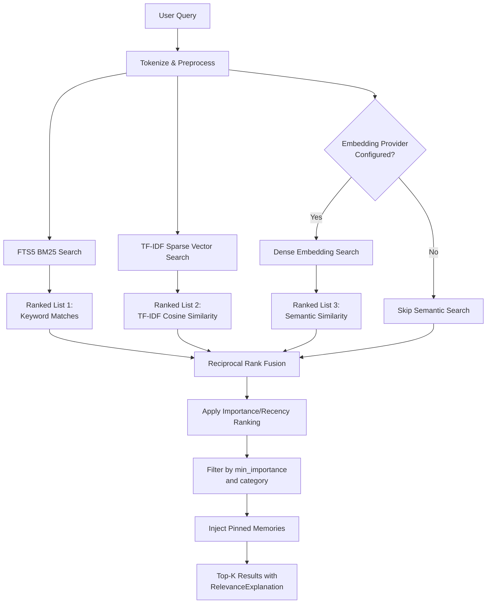
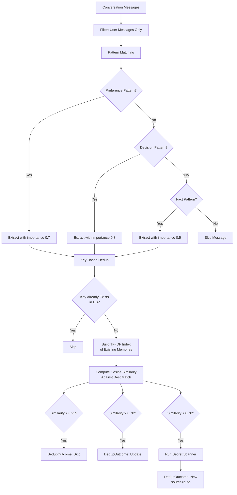

# Long-Term Memory System

> **Module Goal:** Give Antec persistent, intelligent memory — combining full-text search (BM25), TF-IDF scoring, and dense embeddings with temporal decay and importance weighting — so the AI remembers what matters and naturally forgets what doesn't.

### Why This Module Exists

Without memory, every conversation starts from zero. Users must repeatedly explain their preferences, project context, and past decisions. The Memory module transforms Antec from a stateless chatbot into a learning assistant that builds knowledge over time.

It uses a hybrid recall pipeline that merges three retrieval signals via Reciprocal Rank Fusion (RRF): FTS5 full-text search for keyword matching, TF-IDF for statistical relevance, and dense embeddings for semantic similarity. Temporal decay ensures old, unaccessed memories fade naturally, while importance scoring surfaces critical information. Auto-extraction captures key facts from conversations without explicit user action.

### Business Benefits

| Benefit | Description |
|---------|-------------|
| **Persistent context** | Remembers user preferences, project details, and past decisions across sessions |
| **Intelligent recall** | Hybrid BM25 + TF-IDF + embeddings retrieval finds relevant memories even with imprecise queries |
| **Natural forgetting** | Temporal decay formula prevents memory bloat — old, unused memories fade automatically |
| **Auto-extraction** | Key facts extracted from conversations without user intervention |
| **Deduplication** | Similarity thresholds (0.95 skip, 0.7 update) prevent redundant storage |
| **Local storage** | All memories in SQLite — no cloud dependency, full data sovereignty |

This document specifies Antec's long-term memory subsystem: the data model, importance scoring, temporal decay, hybrid recall pipeline, auto-extraction engine, TF-IDF index, embeddings, knowledge graph links, session mirroring, and export formats.

The memory system lives in the `antec-memory` crate, with storage provided by `antec-storage` (SQLite) and tool interfaces in `antec-tools`.

---

## 1. Memory Entry Model

Every piece of remembered information is stored as a `MemoryEntry`:

```rust
pub struct MemoryEntry {
    /// Unique identifier (UUID v4).
    pub id: String,
    /// Human-readable label (e.g., "favorite_color", "project_decision_backend").
    pub key: String,
    /// The actual memory content (free-form text).
    pub content: String,
    /// Category classification.
    pub category: MemoryCategory,
    /// Freeform tags for filtering and organization.
    pub tags: Vec<String>,
    /// Origin: "user" (explicit), "auto" (extracted), "skill" (from a skill).
    pub source: String,
    /// Importance score (0.0-1.0). Higher = more important.
    pub importance: f64,
    /// Number of times this memory has been accessed via recall.
    pub access_count: i32,
    /// Unix timestamp of creation.
    pub created_at: i64,
    /// Unix timestamp of last update.
    pub updated_at: i64,
    /// Optional expiration timestamp for temporal decay.
    pub expires_at: Option<i64>,
    /// Pinned memories are exempt from decay and always recalled.
    pub pinned: bool,
}
```

### Storage Format

Tags are stored in SQLite as a JSON array string (e.g., `["rust","memory"]`). Legacy comma-separated format is also supported for backward compatibility. The `parse_tags()` function handles both formats transparently.

### MemoryCategory Enum

```rust
pub enum MemoryCategory {
    Fact,           // A factual piece of information
    Preference,     // A user preference
    Decision,       // A decision that was made
    Task,           // A task or to-do item
    Contact,        // Contact or person information
    Skill,          // A learned skill or procedure
    Relationship,   // A relationship between entities or people
    Event,          // A dated event or occurrence
    Conversation,   // A conversation summary or reference
    Other,          // Uncategorized (default)
}
```

Parsing is done via `MemoryCategory::from_str_loose()` which maps string values to variants and falls back to `Other` for unknown values.

### Category Importance Weights

Each category has a default base importance weight used by the importance scorer:

| Category | Base Weight |
|----------|-------------|
| Decision | 0.80 |
| Task | 0.75 |
| Preference | 0.70 |
| Relationship | 0.65 |
| Skill | 0.60 |
| Contact | 0.60 |
| Fact | 0.50 |
| Event | 0.50 |
| Conversation | 0.40 |
| Other | 0.30 |

These weights are configurable via `CategoryWeights` in the config file.

---

## 2. Importance Scoring

The `ImportanceScorer` computes a composite importance score from multiple factors. Each factor is normalized to [0, 1] and multiplied by its weight before summing.

### Scoring Formula

```
final = (
    content_length_weight * norm_length +
    entity_count_weight   * norm_entities +
    explicit_signal_weight * (explicit ? 1.0 : 0.0) +
    category_weight       * category_base
) / total_weight
```

Result is clamped to [0.0, 1.0]. If all weights are zero, the default score is 0.5.

### Default Factor Weights

| Factor | Weight | Description |
|--------|--------|-------------|
| `content_length_weight` | 0.10 | How much content length contributes |
| `entity_count_weight` | 0.15 | How much named entity density contributes |
| `explicit_signal_weight` | 0.25 | Boost when user explicitly stores a memory |
| `category_weight` | 0.50 | Category-specific base importance |
| **Total** | **1.00** | |

### Content Length Normalization

```
norm_length = clamp(ln(len) / ln(500), 0.0, 1.0)
```

- Empty content: 0.0
- 10 characters: ~0.37
- 100 characters: ~0.74
- 500+ characters: ~1.0

### Entity Count Normalization

```
norm_entities = clamp(count / 5, 0.0, 1.0)
```

Entity detection is heuristic-based:
- Capitalized words (proper nouns): "John", "Paris", "Google"
- Numbers (dates, versions, quantities): "2024-01-15", "3.14"
- Email-like patterns: "user@example.com"

### ScoringFactors Breakdown

The scorer returns a `ScoringFactors` struct with the breakdown of each contributing factor, enabling transparency in the UI:

```rust
pub struct ScoringFactors {
    pub content_length: f64,    // Normalized length factor
    pub entity_count: f64,      // Normalized entity count
    pub explicit_signal: f64,   // 1.0 if explicit, 0.0 otherwise
    pub category_base: f64,     // Category base weight
    pub final_score: f64,       // Composite result
}
```

---

## 3. Temporal Decay

Memory importance decreases over time unless the memory is pinned or frequently accessed. This prevents old, unused memories from overwhelming the recall results.

### Effective Importance Formula

```
effective = importance * 0.5^(days_elapsed / half_life_days) * (1 + log2(access_count + 1) * 0.1)
```

Where:
- `days_elapsed = (now - updated_at) / 86400`
- `half_life_days`: configurable, default **30 days**
- `access_count`: incremented each time the memory is recalled
- Result clamped to [0.0, 1.0]

### Decay Behavior

| Time Elapsed | Decay Multiplier | With 10 Accesses |
|-------------|-----------------|-------------------|
| 0 days | 1.000 | 1.000 (clamped) |
| 15 days | 0.707 | 0.951 |
| 30 days | 0.500 | 0.673 |
| 60 days | 0.250 | 0.336 |
| 90 days | 0.125 | 0.168 |

### Exemptions

- **Pinned memories**: always exempt from decay; `effective_importance()` is bypassed
- **Access boost**: each access slightly increases the effective score logarithmically, slowing decay for frequently used memories

### Decay Sweep

The system can run a sweep to archive memories that have decayed below a configurable threshold:

- **Trigger**: manual via `POST /api/v1/memory/sweep` or via a scheduled cron job
- **Process**: calculate `effective_importance()` for all non-pinned memories; archive those below threshold
- **Result**: `DecaySweepResult` with count of archived, skipped (pinned), and remaining memories

---

## 4. Hybrid Recall Pipeline

Memory recall uses a multi-signal approach to find the most relevant memories for a given query. Three retrieval methods run in parallel, and their results are merged via Reciprocal Rank Fusion (RRF).

### Pipeline Flowchart



### Signal Weights

| Signal | Weight | Source |
|--------|--------|--------|
| FTS5 BM25 | 0.40 | SQLite full-text search index |
| Dense Embedding | 0.40 | Semantic similarity (if provider configured) |
| TF-IDF | 0.20 | Sparse vector cosine similarity |

When no embedding provider is configured, the BM25 and TF-IDF signals share the full weight.

### Reciprocal Rank Fusion (RRF)

RRF merges multiple ranked lists into a single ranking. For each document appearing in any list:

```
rrf_score(doc) = SUM_j( weight_j / (k + rank_j(doc) + 1) )
```

Where:
- `k` = 60 (smoothing constant)
- `rank_j(doc)` = 0-indexed rank of the document in list j
- `weight_j` = signal weight for list j

Documents not present in a list receive no contribution from that list (they are simply absent from the sum, not penalized).

### RecalledMemory

Each recalled memory includes a relevance explanation:

```rust
pub struct RecalledMemory {
    pub id: String,
    pub key: String,
    pub content: String,
    pub category: String,
    /// Combined relevance score (0.0-1.0).
    pub score: f64,
    /// Breakdown of how the score was determined.
    pub explanation: RelevanceExplanation,
}

pub struct RelevanceExplanation {
    /// Whether FTS5 keyword matching contributed.
    pub keyword_match: bool,
    /// Semantic similarity score (0.0-1.0).
    pub semantic_similarity: f64,
    /// Recency boost factor applied.
    pub recency_boost: f64,
    /// Whether this memory is pinned.
    pub pinned: bool,
}
```

### Pinned Memory Handling

Pinned memories are always included in recall results regardless of their relevance score. They are injected after the RRF ranking to ensure they appear even if the query does not match their content.

---

## 5. Auto-Extraction

The `AutoMemoryExtractor` scans conversation messages for patterns indicating preferences, decisions, and facts. It uses heuristic pattern matching (not LLM calls) to keep extraction fast and deterministic.

### Extraction Patterns

| Category | Patterns | Default Importance |
|----------|----------|-------------------|
| **Preference** | "i prefer X", "i like X", "my favorite X is Y", "my favourite X is Y" | 0.70 |
| **Decision** | "i decided to X", "i've decided to X", "i've decided X", "we agreed on X", "we agreed to X", "we decided to X", "we decided on X" | 0.80 |
| **Fact** | "my X is/are/was Y", "our X is/are/was Y" (excludes "my favorite" to avoid overlap) | 0.50 |

Only **user messages** are scanned (assistant messages are skipped). Patterns are matched against lowercase content but the original text is preserved in the memory.

### Extraction Result

```rust
pub struct ExtractionResult {
    /// Unique key for deduplication (e.g., "preference:dark_mode_for_coding").
    pub key: String,
    /// The extracted memory content (original message text).
    pub content: String,
    /// Category of the extracted memory.
    pub category: MemoryCategory,
    /// Importance score (0.0-1.0).
    pub importance: f64,
}
```

Keys are generated by slugifying the content: lowercase, replace non-alphanumeric with underscores, collapse consecutive underscores, truncate to 60 characters, and prefix with the category (e.g., `preference:dark_mode_for_coding`).

### Deduplication via TF-IDF Cosine Similarity

Before storing an extracted memory, the system checks for duplicates and conflicts against existing memories using TF-IDF cosine similarity:

| Threshold | Cosine Range | Action |
|-----------|-------------|--------|
| `DEDUP_THRESHOLD` | > 0.95 | **Skip** -- near-exact duplicate, do not create |
| `CONFLICT_THRESHOLD` | 0.70 - 0.95 | **Update** -- similar but different enough to update existing |
| Below threshold | < 0.70 | **New** -- create a new memory entry |

### DedupOutcome Enum

```rust
pub enum DedupOutcome {
    /// No similar existing memory found. Store as new.
    New(ExtractionResult),
    /// Similar memory found. Update existing content.
    Update { existing_id: String, result: ExtractionResult },
    /// Near-duplicate found. Skip creation.
    Skip { existing_id: String },
}
```

### Auto-Extraction Pipeline



### Secret Scanning

Before storing any memory (whether user-initiated or auto-extracted), the content is passed through the security module's secret scanner. Detected patterns (API keys, credit card numbers, etc.) are redacted before storage.

---

## 6. TF-IDF Engine

The TF-IDF engine provides sparse vector representations of text for similarity computation. It is used both for memory recall ranking and for auto-extraction deduplication.

### Tokenization

Text preprocessing pipeline:
1. Convert to lowercase
2. Split on non-alphanumeric characters
3. Filter stopwords (29 common English words: `the`, `a`, `an`, `is`, `are`, `was`, `were`, `in`, `on`, `at`, `to`, `for`, `of`, `and`, `or`, `but`, `not`, `with`, `this`, `that`, `it`, `be`, `as`, `by`, `from`, `have`, `has`, `had`)
4. Filter tokens shorter than 2 characters

### SparseVector

```rust
pub struct SparseVector {
    /// Map from term index to TF-IDF weight.
    pub entries: HashMap<u32, f64>,
}
```

Binary serialization format for SQLite BLOB storage:
```
[count: u32 LE][idx: u32 LE, weight: f64 LE]*
```
Total size: 4 + (count * 12) bytes.

### TfIdfVectorizer

Manages vocabulary and computes TF-IDF vectors:

```rust
pub struct TfIdfVectorizer {
    vocabulary: HashMap<String, u32>,  // term -> index
    idf_weights: Vec<f64>,             // indexed by term index
    doc_count: usize,
    doc_freq: HashMap<u32, usize>,     // term index -> doc count
    next_idx: u32,
}
```

**Term Frequency**: `TF(t,d) = count(t in d) / total_tokens(d)`

**Inverse Document Frequency**: `IDF(t) = ln(1 + N / (1 + df(t)))`

Where `N` is total document count and `df(t)` is the number of documents containing term `t`. The `1 +` inside the log ensures IDF is always positive.

**TF-IDF weight**: `TF(t,d) * IDF(t)` -- only non-zero entries stored in the sparse vector.

### TfIdfIndex

High-level index for memory search, wrapping `TfIdfVectorizer` with stored vectors:

```rust
pub struct TfIdfIndex {
    vectorizer: TfIdfVectorizer,
    vectors: HashMap<String, SparseVector>,  // memory_id -> vector
    texts: HashMap<String, String>,           // memory_id -> raw text (for rebuild)
}
```

**Operations**:
- `add(id, text)` -- tokenize, update vocabulary, compute and store vector
- `remove(id)` -- remove stored vector and text (does not recompute IDF)
- `rebuild()` -- recompute all IDF weights and re-vectorize all documents
- `query(text, limit)` -- vectorize query, compute cosine similarity against all stored vectors, return top-K results

### Cosine Similarity (Sparse Vectors)

```
cos(a, b) = dot(a, b) / (||a|| * ||b||)
```

Where:
- `dot(a, b) = SUM(a_i * b_i)` for indices present in both vectors
- `||v|| = sqrt(SUM(v_i^2))`
- Returns 0.0 if either vector is zero

Implementation iterates over the smaller vector for efficiency.

---

## 7. Embeddings

Dense embedding vectors provide semantic similarity search as an alternative/complement to TF-IDF sparse vectors.

### EmbeddingVector

```rust
pub type EmbeddingVector = Vec<f32>;
```

Typical dimensions: 384 (local hash / MiniLM) or 1536 (OpenAI).

### Embedding Providers

All providers implement the `EmbeddingProvider` trait:

```rust
pub trait EmbeddingProvider: Send + Sync {
    fn embed(&self, text: &str) -> Result<EmbeddingVector, EmbeddingError>;
    fn embed_batch(&self, texts: &[&str]) -> Result<Vec<EmbeddingVector>, EmbeddingError>;
    fn model_name(&self) -> &str;
    fn dimensions(&self) -> usize;
}
```

#### OpenAI Provider (`OpenAiEmbeddingProvider`)

- API: `POST https://api.openai.com/v1/embeddings`
- Default model: `text-embedding-3-small`
- Default dimensions: 1536 (configurable for text-embedding-3 models)
- API key: loaded from environment variable (default: `OPENAI_API_KEY`)
- Supports batch embedding for efficiency
- Uses `reqwest::blocking::Client` (runs in `spawn_blocking`)

#### Local Hash Provider (`LocalHashEmbeddingProvider`)

- No API calls -- fully offline, deterministic
- Uses feature hashing (FNV-1a) to map tokens to vector dimensions
- Default dimensions: 384
- Captures bag-of-words similarity only (not true semantic embeddings)
- L2-normalized output
- Zero cost, instant computation

### Provider Selection

Factory function `create_embedding_provider()` selects based on config:
- `provider = "openai"` -> `OpenAiEmbeddingProvider` (fails if API key missing)
- `provider = "local"` (default) -> `LocalHashEmbeddingProvider`

### EmbeddingsConfig

```rust
pub struct EmbeddingsConfig {
    pub provider: String,       // "local" or "openai" (default: "local")
    pub openai_model: String,   // default: "text-embedding-3-small"
    pub openai_key_env: String, // default: "OPENAI_API_KEY"
    pub dimensions: usize,      // default: 384
}
```

### Vector Operations

```rust
/// Cosine similarity between dense vectors. Returns [-1.0, 1.0], clamped.
/// Returns 0.0 if vectors differ in length or either is zero.
pub fn cosine_similarity(a: &[f32], b: &[f32]) -> f32;

/// L2-normalize a vector in place. Returns false if zero vector.
pub fn l2_normalize(vec: &mut [f32]) -> bool;

/// Serialize embedding to bytes (little-endian f32 per component).
pub fn embedding_to_bytes(vec: &[f32]) -> Vec<u8>;

/// Deserialize embedding from bytes. Returns None if length is not a multiple of 4.
pub fn embedding_from_bytes(data: &[u8]) -> Option<EmbeddingVector>;
```

### Reciprocal Rank Fusion (RRF)

Combines multiple ranked lists with configurable weights:

```rust
pub fn reciprocal_rank_fusion(
    lists: &[Vec<(String, f64)>],
    weights: &[f64],
    k: f64,  // smoothing constant, typically 60
) -> Vec<(String, f64)>;
```

For each document appearing in any list:
```
score(doc) = SUM_j( weight_j / (k + rank_j(doc) + 1) )
```

Results are sorted descending by combined score. Used in the recall pipeline to merge BM25, TF-IDF, and embedding results.

---

## 8. Memory Links (Knowledge Graph)

Memory links create a graph structure between memory entries, enabling relationship traversal and contextual recall.

### MemoryLink

```rust
pub struct MemoryLink {
    pub id: i64,
    pub source_id: String,     // Memory UUID (origin)
    pub target_id: String,     // Memory UUID (destination)
    pub relation: String,      // Relation type as string
    pub metadata: Option<String>, // Optional JSON metadata
    pub created_at: i64,       // Unix timestamp
}
```

### LinkRelation Enum

```rust
pub enum LinkRelation {
    RelatedTo,    // "related_to" -- topically connected memories
    Contradicts,  // "contradicts" -- conflicting information
    Supersedes,   // "supersedes" -- newer version replaces older
    PartOf,       // "part_of" -- belongs to a larger context
}
```

### Operations

| Operation | Description |
|-----------|-------------|
| `create_link(source, target, relation, metadata)` | Create a directed link. Uses `INSERT OR IGNORE` to silently deduplicate. |
| `get_links_from(source_id)` | Get all outbound links from a memory. |
| `get_links_to(target_id)` | Get all inbound links to a memory. |
| `get_links_by_relation(source_id, relation)` | Filter outbound links by relation type. |
| `delete_link(id)` | Delete a specific link by its database ID. |
| `delete_links_for_memory(memory_id)` | Delete all links (inbound + outbound) involving a memory. |
| `traverse(start_id, max_depth)` | BFS graph traversal with cycle detection. Returns all reachable memory IDs. |

### Graph Traversal

`traverse()` implements breadth-first search starting from a memory node:

1. Initialize a queue with `start_id` and a visited set
2. For each node in the queue, fetch all outbound links
3. Add unvisited targets to the queue (cycle detection via visited set)
4. Stop when `max_depth` is reached or no more unvisited nodes
5. Return all visited node IDs (excluding the start node)

The traversal respects the `max_depth` parameter: depth 1 returns only direct neighbors, depth 2 includes neighbors-of-neighbors, etc.

### Important Design Note

There are **no foreign key constraints** on the memory_links table. If a memory is deleted without calling `delete_links_for_memory()`, orphaned links may remain in the database. The `memory_forget` tool handler is responsible for cleaning up links when a memory is deleted.

---

## 9. Session Mirror (JSONL)

The session mirror provides an append-only transcript of every conversation, stored as JSONL files alongside the SQLite database. This serves as a human-readable backup and enables recovery.

### File Structure

```
~/.antec/sessions/
  {session_id}.jsonl      # Full message stream (one JSON object per line)
  {session_id}.meta        # Session metadata (JSON)
```

### SessionMessage

Each line in a `.jsonl` file is a serialized `SessionMessage`:

```rust
pub struct SessionMessage {
    pub id: String,              // Message UUID
    pub session_id: String,      // Session UUID
    pub role: String,            // "user", "assistant", "system", "tool"
    pub content: String,         // Message text
    pub timestamp: i64,          // Unix timestamp
    pub tool_calls: Option<String>, // JSON array of tool calls (if any)
    pub token_count: Option<i32>,   // Token count for this message
}
```

### SessionMeta

Each session has a `.meta` file with summary information:

```rust
pub struct SessionMeta {
    pub session_id: String,
    pub channel: String,       // "console", "discord", "whatsapp", etc.
    pub created_at: i64,
    pub updated_at: i64,
    pub message_count: u64,
    pub total_tokens: u64,
}
```

### Operations

| Operation | Description |
|-----------|-------------|
| `append_message(msg)` | Append a message to the session's JSONL file (creates file if needed) |
| `write_meta(meta)` | Write/overwrite session metadata |
| `read_messages(session_id)` | Read all messages from a session (skips malformed lines with warning) |
| `read_meta(session_id)` | Read session metadata (returns `None` if no meta file) |
| `list_sessions()` | List all session IDs that have JSONL files |
| `message_count(session_id)` | Count non-empty lines in the JSONL file |

### Properties

- **Append-only**: messages are only appended, never modified or deleted
- **Crash-safe**: each line is independently parseable; malformed lines are skipped
- **Isolated**: each session has its own file pair; no cross-session contamination
- **Human-readable**: JSONL format can be inspected with standard text tools

---

## 10. Markdown Export

The markdown export system provides human-readable representations of memories, both as individual files (for sync) and as bulk exports.

### Directory Structure

```
~/.antec/memory/
  facts.md            # MemoryCategory::Fact
  preferences.md      # MemoryCategory::Preference
  decisions.md        # MemoryCategory::Decision
  tasks.md            # MemoryCategory::Task
  people.md           # MemoryCategory::Contact AND MemoryCategory::Relationship
  skills.md           # MemoryCategory::Skill
  conversations.md    # MemoryCategory::Conversation
  events.md           # MemoryCategory::Event
  other.md            # MemoryCategory::Other
```

### Markdown Format

Each memory entry is rendered as a level-3 heading with an HTML comment containing the ID:

```markdown
# Fact

### user_name <!-- id:abc123 -->
Remek
*tags: personal | importance: 0.70*

### home_city <!-- id:def456 -->
Warsaw
*tags: location | importance: 0.50 | pinned*
```

### Operations

| Function | Description |
|----------|-------------|
| `sync_entry_to_markdown(dir, entry)` | Upsert a single memory entry into its category file |
| `remove_entry_from_markdown(dir, id, category)` | Remove an entry from its category file |
| `export_memories_as_markdown(memories)` | Bulk export all memories as a single markdown string |
| `default_memory_dir()` | Returns `~/.antec/memory/` |

### Sync Behavior

`sync_entry_to_markdown()` is an upsert operation:
1. Read the existing file (or start fresh)
2. Parse entries by extracting IDs from `<!-- id:xxx -->` comments
3. Insert or replace the entry with the matching ID
4. Write the complete file back (entries sorted by ID for deterministic output)

### Bulk Export

`export_memories_as_markdown()` groups entries by category in a fixed order (Fact, Preference, Decision, Task, Contact, Relationship, Skill, Conversation, Event, Other) and renders each as a section with level-2 headings.

### Import

Markdown files can be parsed back into `MemoryEntry` structs by extracting:
- Key from the heading text
- ID from the `<!-- id:xxx -->` comment
- Content from the body between headings
- Metadata from the italic line (tags, importance, pinned flag)

---

## 11. Memory Snapshots

Snapshots provide point-in-time backups of all memory entries, stored as JSON blobs in the database.

### Storage

Snapshots are stored in the `memory_snapshots` table:

| Column | Type | Description |
|--------|------|-------------|
| `id` | TEXT (UUID) | Snapshot identifier |
| `reason` | TEXT | Human-readable reason for the snapshot |
| `created_at` | INTEGER | Unix timestamp |
| `memory_count` | INTEGER | Number of memories in the snapshot |
| `size_bytes` | INTEGER | Size of the serialized JSON blob |
| `snapshot_data` | TEXT | JSON array of all memory entries |

### Creation

When `memory_snapshot` is invoked:
1. Load all active (non-archived) memories from the database
2. Serialize the complete list to JSON
3. Calculate byte size
4. Store in `memory_snapshots` with metadata

### Use Cases

- **Pre-migration backup**: snapshot before running a memory sweep
- **Disaster recovery**: restore all memories from a snapshot
- **Auditing**: track how the memory corpus has evolved over time

---

## 12. MemoryManager

The `MemoryManager` is the central business logic layer for memory operations. It wraps database access in `spawn_blocking` calls and coordinates between the various subsystems (FTS5, TF-IDF, embeddings, links).

### Key Methods

| Method | Description |
|--------|-------------|
| `store(entry)` | Store a new memory (or upsert by key) |
| `recall(query, limit, category, min_importance)` | Hybrid recall with RRF |
| `get(id)` | Get a single memory by ID |
| `get_by_key(key)` | Get a single memory by key |
| `update(id, fields)` | Update memory metadata |
| `delete(id)` | Delete a memory and its links |
| `archive(id)` | Archive a memory (soft delete) |
| `restore(id)` | Restore an archived memory |
| `pin(id, pinned)` | Pin or unpin a memory |
| `list(limit)` | List all active memories |
| `list_by_category(category)` | List memories filtered by category |
| `list_pinned()` | List all pinned memories |
| `sweep(threshold, half_life)` | Run temporal decay sweep |
| `create_snapshot(reason)` | Create a point-in-time snapshot |
| `search_fts(query, limit)` | FTS5-only search (BM25) |
| `increment_access(id)` | Bump access count after recall |

### Error Handling

```rust
pub enum MemoryError {
    Storage(StorageError),          // Database-level errors
    NotFound { id: String },        // Memory not found
    InvalidQuery(String),           // Bad search query
    Embedding(String),              // Embedding provider errors
    Internal(String),               // Catch-all (e.g., spawn_blocking panic)
}
```

All async methods use `tokio::task::spawn_blocking` for database access since `rusqlite` connections are not `Send`. The `Arc<Database>` is cloned and moved into each blocking task.
