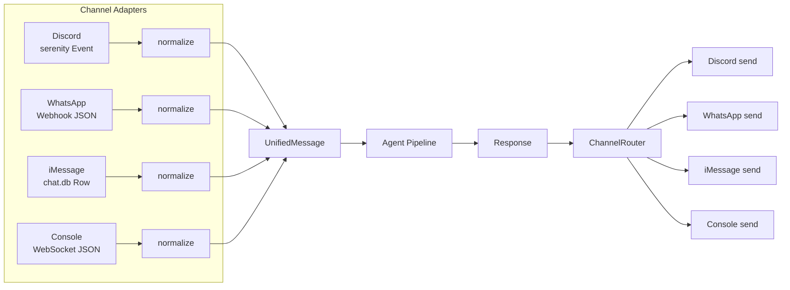
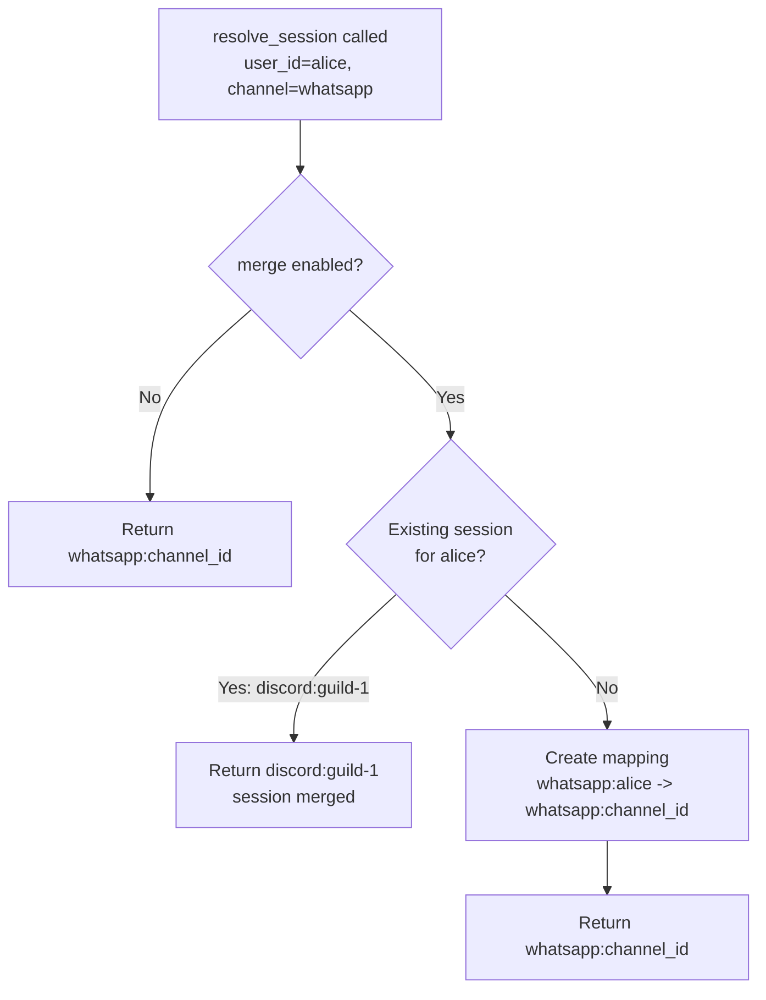
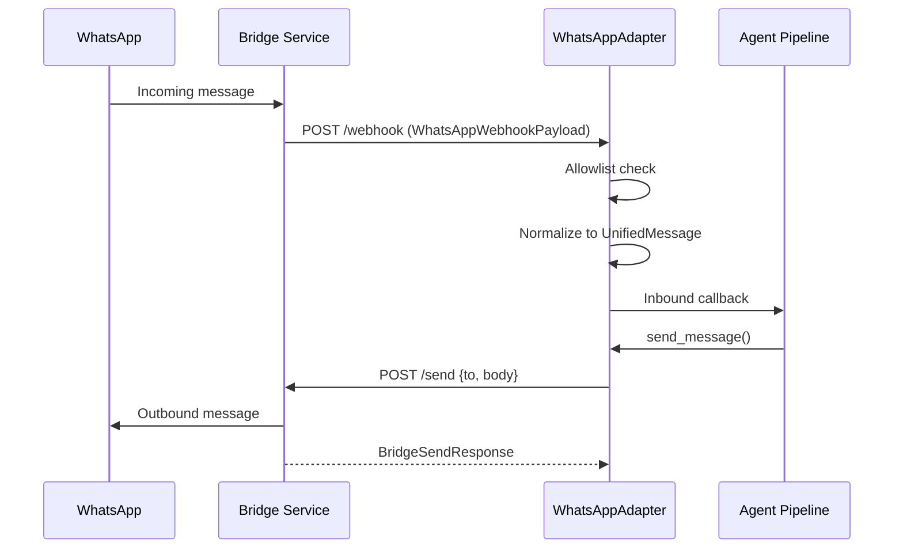
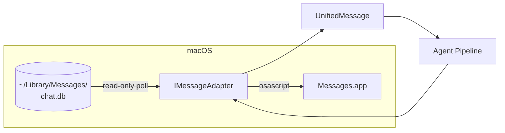

# 08 -- Channel Adapters & Unified Messaging

> **Module Goal:** Connect Antec to multiple communication platforms — Console (WebSocket), Discord, WhatsApp, and iMessage — through a unified messaging abstraction that normalizes messages, routes them to the right session, and adapts responses back to each platform's format.

### Why This Module Exists

Users communicate through different platforms throughout their day: Slack at work, WhatsApp on mobile, Discord for communities, iMessage for personal contacts. A personal AI assistant locked to a single interface forces users to context-switch. The Channels module lets users interact with Antec wherever they already are.

Each channel adapter handles platform-specific concerns — Discord slash commands, WhatsApp bridge protocols, iMessage AppleScript polling — while the unified Channel trait ensures the agent core sees a consistent message format regardless of origin. Per-session isolation prevents cross-talk, and channel-specific capabilities (attachments, reactions, threads) degrade gracefully when unavailable.

### Business Benefits

| Benefit | Description |
|---------|-------------|
| **Meet users where they are** | Interact via Discord, WhatsApp, iMessage, or web console — no app-switching needed |
| **Unified message model** | One internal format regardless of source — simplifies agent logic |
| **Session isolation** | Each channel:conversation gets its own session — no cross-talk or data leakage |
| **Graceful degradation** | Capabilities like attachments and reactions adapt to each platform's limitations |
| **Allowlist security** | Per-channel user allowlists prevent unauthorized access |
| **Extensible** | Channel trait makes adding new platforms (Telegram, Slack, email) straightforward |

This document specifies the channel adapter subsystem: the trait-based plugin interface, the unified message format, the channel router, and the four concrete adapters (Discord, WhatsApp, iMessage, Console). All inbound messages are normalized into a single canonical type before entering the agent pipeline; all outbound responses are dispatched through the same router.

**Crate:** `antec-channels`

---

## 1. Channel Trait

Every communication channel implements the `Channel` trait. This is the plugin interface that allows new channels to be added without modifying the core agent or gateway code.

### 1.1 Trait Definition

```rust
#[async_trait]
pub trait Channel: Send + Sync {
    /// Return the channel type identifier (e.g. "discord", "console").
    fn channel_type(&self) -> &str;

    /// Connect to the channel backend.
    async fn connect(&mut self) -> Result<(), ChannelError>;

    /// Disconnect from the channel backend.
    async fn disconnect(&mut self) -> Result<(), ChannelError>;

    /// Check if the channel is currently connected.
    fn is_connected(&self) -> bool;

    /// Send a complete message to a conversation.
    async fn send_message(&self, conversation_id: &str, content: &str)
        -> Result<(), ChannelError>;

    /// Send a streaming chunk to a conversation.
    /// Default: falls back to send_message.
    async fn send_chunk(&self, conversation_id: &str, chunk: &str)
        -> Result<(), ChannelError> {
        self.send_message(conversation_id, chunk).await
    }

    /// Send a typing indicator. Default: no-op.
    async fn send_typing_indicator(&self, _conversation_id: &str)
        -> Result<(), ChannelError> {
        Ok(())
    }

    /// Edit a previously sent message. Default: error (not supported).
    async fn edit_message(
        &self, _conversation_id: &str, _message_id: &str, _new_content: &str,
    ) -> Result<(), ChannelError> {
        Err(ChannelError::SendFailed("edit not supported".into()))
    }

    /// Add a reaction to a message. Default: error (not supported).
    async fn add_reaction(
        &self, _conversation_id: &str, _message_id: &str, _reaction: &str,
    ) -> Result<(), ChannelError> {
        Err(ChannelError::SendFailed("reactions not supported".into()))
    }

    /// Return the channel's capabilities.
    fn capabilities(&self) -> ChannelCapabilities;
}
```

### 1.2 Design Rationale

- **Default method implementations** allow minimal adapters (only 5 required methods: `channel_type`, `connect`, `disconnect`, `is_connected`, `send_message`, `capabilities`).
- **`Send + Sync`** bounds enable the trait object to be shared across Tokio tasks via `Arc<dyn Channel>`.
- **Error-returning defaults** for `edit_message` and `add_reaction` let the caller know the feature is unsupported rather than silently ignoring the request.

### 1.3 ChannelCapabilities

```rust
#[derive(Debug, Clone, Serialize, Deserialize, Default)]
pub struct ChannelCapabilities {
    /// Maximum message length in characters. 0 = unlimited.
    pub max_message_length: usize,
    /// Whether the channel supports streaming/chunked responses.
    pub supports_streaming: bool,
    /// Whether the channel supports typing indicators.
    pub supports_typing: bool,
    /// Whether the channel supports editing already-sent messages.
    pub supports_message_edit: bool,
    /// Whether the channel supports file attachments.
    pub supports_attachments: bool,
    /// Whether the channel supports rich formatting (Markdown, embeds).
    pub supports_rich_format: bool,
}
```

Default values are all `false` / `0`, meaning a default-constructed capability set claims no features. Each adapter sets the capabilities that its platform actually supports.

### 1.4 ChannelError

```rust
#[derive(Debug, Error)]
pub enum ChannelError {
    #[error("connection failed: {0}")]
    ConnectionFailed(String),

    #[error("send failed: {0}")]
    SendFailed(String),

    #[error("not allowed: {0}")]
    NotAllowed(String),

    #[error("rate limited: {0}")]
    RateLimited(String),

    #[error("disconnected")]
    Disconnected,

    #[error("internal error: {0}")]
    Internal(String),
}
```

Implements `From<std::io::Error>` for ergonomic I/O error conversion.

### 1.5 ConnectionStatus

```rust
#[derive(Debug, Clone, Serialize, Deserialize, PartialEq, Eq)]
pub enum ConnectionStatus {
    Connected,
    Connecting,
    Disconnected,
}
```

---

## 2. Unified Message Format

All inbound messages -- regardless of source channel -- are normalized into a `UnifiedMessage` before entering the agent pipeline. This canonical format decouples the agent core from channel-specific APIs.

### 2.1 UnifiedMessage Struct

```rust
#[derive(Debug, Clone, Serialize, Deserialize)]
pub struct UnifiedMessage {
    /// Unique message ID (UUID v4).
    pub id: String,
    /// Channel type identifier (e.g. "discord", "console", "whatsapp").
    pub channel: String,
    /// Channel-specific conversation/thread ID.
    pub channel_id: String,
    /// Internal session ID.
    pub session_id: String,
    /// Composite key: "{channel}:{channel_id}".
    pub conversation_id: String,
    /// Channel-specific sender identifier.
    pub sender_id: String,
    /// Human-readable sender name.
    pub sender_name: String,
    /// Message text content.
    pub content: String,
    /// File attachments.
    pub attachments: Vec<Attachment>,
    /// Arbitrary channel-specific metadata (JSON).
    pub metadata: serde_json::Value,
    /// When the message was originally created on the channel.
    pub created_at: DateTime<Utc>,
    /// When Antec received the message.
    pub received_at: DateTime<Utc>,
}
```

### 2.2 Factory Method

```rust
impl UnifiedMessage {
    pub fn new(channel: &str, channel_id: &str, sender_id: &str, content: &str) -> Self {
        let now = Utc::now();
        let conversation_id = format!("{channel}:{channel_id}");
        Self {
            id: uuid::Uuid::new_v4().to_string(),
            channel: channel.to_string(),
            channel_id: channel_id.to_string(),
            session_id: String::new(),
            conversation_id,
            sender_id: sender_id.to_string(),
            sender_name: sender_id.to_string(),  // defaults to sender_id
            content: content.to_string(),
            attachments: Vec::new(),
            metadata: serde_json::Value::Null,
            created_at: now,
            received_at: now,
        }
    }

    /// Return the session isolation key: "{channel}:{channel_id}".
    pub fn session_key(&self) -> String {
        format!("{}:{}", self.channel, self.channel_id)
    }
}
```

### 2.3 Session Isolation

Each conversation is identified by its **composite key** `"{channel}:{channel_id}"`. This ensures complete isolation between:
- Different channels (Discord vs WhatsApp vs Console)
- Different conversations within the same channel (multiple Discord guilds, multiple WhatsApp contacts)

The agent core uses this composite key to maintain separate message histories, context windows, and memory scopes per conversation.

### 2.4 Attachment

```rust
#[derive(Debug, Clone, Serialize, Deserialize)]
pub struct Attachment {
    pub id: String,              // UUID v4
    pub filename: String,
    pub content_type: String,    // MIME type (default: "application/octet-stream")
    pub size: u64,               // bytes
    pub url: Option<String>,     // download URL (optional)
}
```

### 2.5 Normalization Flow



---

## 3. Channel Router

The `ChannelRouter` is the central dispatch hub for outbound messages. It holds a registry of active channel adapters and routes responses to the correct channel based on the channel type string from the original inbound message.

### 3.1 Router Struct

```rust
pub struct ChannelRouter {
    channels: Arc<RwLock<HashMap<String, Arc<dyn Channel>>>>,
    /// Maps "{channel}:{user_id}" -> session_id for cross-channel merge.
    user_session_map: Arc<RwLock<HashMap<String, String>>>,
}
```

### 3.2 Core Operations

| Method | Signature | Description |
|--------|-----------|-------------|
| `new` | `() -> Self` | Create an empty router |
| `register` | `(&self, channel_type: &str, channel: Arc<dyn Channel>)` | Register a channel adapter |
| `unregister` | `(&self, channel_type: &str) -> bool` | Remove a channel adapter |
| `send_response` | `(&self, channel_type: &str, conversation_id: &str, content: &str) -> Result<()>` | Send a message to a specific channel |
| `send_typing` | `(&self, channel_type: &str, conversation_id: &str) -> Result<()>` | Send a typing indicator |
| `edit_message` | `(&self, channel_type: &str, conversation_id: &str, message_id: &str, new_content: &str) -> Result<()>` | Edit a previously sent message |
| `add_reaction` | `(&self, channel_type: &str, conversation_id: &str, message_id: &str, reaction: &str) -> Result<()>` | Add a reaction |
| `list_channels` | `(&self) -> Vec<ChannelStatus>` | List all registered channels with status |

### 3.3 ChannelStatus

```rust
#[derive(Debug, Clone, Serialize)]
pub struct ChannelStatus {
    pub channel_type: String,
    pub status: ConnectionStatus,
    pub capabilities: ChannelCapabilities,
}
```

Returned by `list_channels()` and exposed via the REST API at `GET /api/channels`.

### 3.4 Cross-Channel Session Merge

The router supports optional **cross-channel session merging** via `resolve_session()`:

```rust
pub async fn resolve_session(
    &self,
    user_id: &str,
    channel: &str,
    channel_id: &str,
    merge: bool,
) -> String
```

**Behavior:**
- When `merge = false`: always returns `"{channel}:{channel_id}"` (isolated sessions).
- When `merge = true`: checks if the same `user_id` already has a session from any channel. If found, returns the existing session ID, allowing a single conversation to span Discord + WhatsApp + Console.
- If no existing session exists, creates a new mapping `"{channel}:{user_id}" -> "{channel}:{channel_id}"`.



### 3.5 Error Handling

Sending to an unknown channel type returns `ChannelError::SendFailed("unknown channel type: {name}")`. The gateway should handle this gracefully and log the error rather than propagating it to the user.

---

## 4. Discord Adapter

**Channel type:** `"discord"`

The Discord adapter connects to the Discord Bot API via the `serenity` crate (feature-gated behind `discord`). It handles guild messages, direct messages, mentions, rich embeds, and message splitting for the 2000-character limit.

### 4.1 Capabilities

```rust
ChannelCapabilities {
    max_message_length: 2000,
    supports_streaming: false,
    supports_typing: true,
    supports_message_edit: true,
    supports_attachments: true,
    supports_rich_format: true,
}
```

### 4.2 DiscordAdapter

```rust
pub struct DiscordAdapter {
    connected: bool,
    token: String,
    callback: Option<InboundCallback>,
    allowed_guilds: Vec<String>,
    allowed_channels: Vec<String>,
    respond_to_dms: bool,
    respond_to_mentions: bool,
    bot_user_id: Arc<RwLock<Option<String>>>,
    reconnect_config: ReconnectConfig,
    status: Arc<RwLock<ConnectionStatus>>,
}
```

### 4.3 Rich Embeds

```rust
pub struct DiscordEmbed {
    pub title: Option<String>,
    pub description: String,
    pub color: Option<u32>,        // Default: 0x5865F2 (Discord blurple)
    pub fields: Vec<EmbedField>,
}

pub struct EmbedField {
    pub name: String,
    pub value: String,
    pub inline: bool,
}
```

The `maybe_as_embed()` function auto-converts long responses into embeds when they exceed the 2000-character limit, splitting by logical sections.

### 4.4 Message Splitting

When a response exceeds 2000 characters, the adapter splits it using `format_for_discord()`:
1. Split on paragraph boundaries (double newline) first.
2. If a single paragraph exceeds 2000 chars, split on sentence boundaries.
3. Each chunk is sent as a separate message.

### 4.5 Mention Handling

- `is_mention(content, bot_id)` -- checks if the message mentions the bot.
- `strip_mention(content, bot_id)` -- removes the `<@bot_id>` mention prefix.
- `is_direct_message(guild_id)` -- returns true for DM channels (no guild).

### 4.6 Inbound Message Processing

```rust
pub struct InboundMessageParams {
    pub channel_id: String,
    pub guild_id: Option<String>,
    pub message_id: String,
    pub author_id: String,
    pub author_name: String,
    pub content: String,
    pub attachments: Vec<(String, String, u64, String)>, // (id, name, size, url)
    pub is_bot: bool,
}
```

`process_inbound_message()` performs:
1. Ignore bot messages (`is_bot = true`).
2. Check guild/channel allowlist.
3. Check if DM or mention (based on config).
4. Strip mention prefix from content.
5. Convert attachments to `Attachment` structs.
6. Create `UnifiedMessage` and invoke the callback.

### 4.7 Reconnection

```rust
pub struct ReconnectConfig {
    pub max_retries: u32,              // Default: 5
    pub initial_delay_ms: u64,         // Default: 1000
    pub max_delay_ms: u64,             // Default: 30000
    pub backoff_multiplier: f64,       // Default: 2.0
}
```

`backoff_delay(attempt, config)` computes exponential backoff with jitter:
```
delay = min(initial_delay * multiplier^attempt, max_delay)
```

### 4.8 Intent Configuration

The `parse_intents()` function (feature-gated behind `discord`) constructs the serenity `GatewayIntents` bitfield:
- `GUILDS` + `GUILD_MESSAGES` + `MESSAGE_CONTENT` -- always required.
- `DIRECT_MESSAGES` -- added when `respond_to_dms` is enabled.

---

## 5. WhatsApp Adapter

**Channel type:** `"whatsapp"`

The WhatsApp adapter receives messages via webhook and sends responses through a bridge service. It supports live pairing state via bridge polling and voice note transcription.

### 5.1 Capabilities

```rust
ChannelCapabilities {
    max_message_length: 65536,
    supports_streaming: false,
    supports_typing: false,
    supports_message_edit: false,
    supports_attachments: true,
    supports_rich_format: false,
}
```

### 5.2 Architecture

WhatsApp communication goes through a **bridge service** (a separate process that maintains the WhatsApp Web connection). The adapter communicates with the bridge via HTTP REST:



### 5.3 BridgeClient Trait

The bridge communication is abstracted behind a trait for testability:

```rust
#[async_trait]
pub trait BridgeClient: Send + Sync {
    async fn send_message(
        &self, bridge_url: &str, to: &str, content: &str,
    ) -> Result<BridgeSendResponse, ChannelError>;

    async fn get_pairing_status(
        &self, bridge_url: &str,
    ) -> Result<BridgePairingResponse, ChannelError>;

    async fn request_qr_refresh(
        &self, bridge_url: &str,
    ) -> Result<BridgePairingResponse, ChannelError>;
}
```

Production uses `HttpBridgeClient`; tests use a mock implementing the same trait.

### 5.4 Pairing

```rust
pub struct PairingStatus {
    pub paired: bool,
    pub phone_number: Option<String>,
    pub last_seen: Option<i64>,
    pub qr_code: Option<String>,       // Base64-encoded QR image
    pub bridge_status: Option<String>,  // e.g. "authenticated", "waiting_for_scan"
}
```

The adapter supports:
- `refresh_pairing_status()` -- fetches live status from bridge, caches it.
- `refresh_qr_code()` -- requests a new QR code for initial pairing.
- `pairing_status()` -- returns the cached status.

### 5.5 Webhook Payload

```rust
pub struct WhatsAppWebhookPayload {
    pub from: String,          // Sender phone number
    pub name: String,          // Sender display name
    pub body: String,          // Message text
    pub timestamp: i64,        // Unix timestamp
    pub message_id: String,
    pub media: Option<WhatsAppMedia>,
    pub is_voice: bool,        // True for voice notes
}

pub struct WhatsAppMedia {
    pub url: String,
    pub mime_type: String,
    pub filename: String,
    pub size: u64,
}
```

### 5.6 Contact Allowlist

Security-first: an **empty allowlist denies all contacts**. Only explicitly listed phone numbers are processed. Non-allowed contacts get `ChannelError::NotAllowed`.

### 5.7 Voice Transcription

When `voice_transcription_enabled` is true and a `TranscriptionCallback` is configured:
1. If the message is a voice note (`is_voice = true`) with media.
2. The callback is invoked with the media URL.
3. If transcription succeeds and the body is empty, the transcription becomes the body.
4. If the body is non-empty, the transcription is appended: `"{body}\n\n[Transcription]: {text}"`.
5. The `metadata` field is set to `{"is_voice": true}`.

### 5.8 Bridge URL Validation

`validate_bridge_url(url)` checks:
- Non-empty.
- Starts with `http://` or `https://`.
- Length > 10 characters.

### 5.9 Connection Lifecycle

- **connect()**: If `bridge_url` is configured, verifies bridge reachability via `get_pairing_status()`. Falls back to webhook-only mode if bridge is unreachable (warning logged, not an error).
- **disconnect()**: Clears pairing status and sets `connected = false`.

---

## 6. iMessage Adapter

**Channel type:** `"imessage"`

The iMessage adapter is macOS-only, feature-gated behind the `imessage` Cargo flag. It reads incoming messages by polling `~/Library/Messages/chat.db` in read-only mode and sends outbound messages via AppleScript (`osascript`).

### 6.1 Capabilities

```rust
ChannelCapabilities {
    max_message_length: 0,         // unlimited
    supports_streaming: false,
    supports_typing: false,
    supports_message_edit: false,
    supports_attachments: false,
    supports_rich_format: false,
}
```

### 6.2 Architecture



### 6.3 IMessageAdapter

```rust
pub struct IMessageAdapter {
    connected: bool,
    callback: Option<InboundCallback>,
    allowed_contacts: Vec<String>,
    poll_interval_secs: u64,           // Default: 5
    last_rowid: Arc<AtomicI64>,        // Cursor for incremental polling
}
```

Builder methods: `with_callback()`, `with_allowed_contacts()`, `with_poll_interval()`.

### 6.4 chat.db Polling

The `poll_chat_db()` function:
1. Opens `~/Library/Messages/chat.db` with `SQLITE_OPEN_READ_ONLY | SQLITE_OPEN_NO_MUTEX`.
2. Queries: `SELECT m.ROWID, h.id, m.text, m.date, m.is_from_me FROM message m LEFT JOIN handle h ON m.handle_id = h.ROWID WHERE m.ROWID > ?1 ORDER BY m.ROWID ASC LIMIT 50`.
3. Returns `Vec<ChatDbMessage>`.

```rust
pub struct ChatDbMessage {
    pub rowid: i64,
    pub sender: String,      // handle_id text (phone/email)
    pub text: String,
    pub date: i64,            // Apple Core Data epoch
    pub is_from_me: bool,
}
```

### 6.5 Apple Date Conversion

macOS stores dates in different epoch formats depending on OS version:

```rust
pub fn apple_date_to_unix(apple_ns: i64) -> i64 {
    const APPLE_EPOCH_OFFSET: i64 = 978_307_200; // 2001-01-01 in Unix epoch
    let secs = if apple_ns > 1_000_000_000_000_000 {
        apple_ns / 1_000_000_000    // Nanoseconds (10.13+)
    } else if apple_ns > 1_000_000_000_000 {
        apple_ns / 1_000_000        // Microseconds
    } else {
        apple_ns                     // Seconds (very old)
    };
    secs + APPLE_EPOCH_OFFSET
}
```

### 6.6 Message Processing

`process_raw_messages()` iterates over raw `ChatDbMessage` entries:
1. **Skip outbound** messages (`is_from_me = true`).
2. **Check allowlist** -- non-allowed contacts are dropped with a debug log.
3. **Normalize** via `normalize_imessage()` to `UnifiedMessage`.
4. **Invoke callback** for each accepted message.
5. **Update `last_rowid`** to the highest ROWID processed.

Returns the count of forwarded (accepted) messages.

### 6.7 Poll Loop

`start_imessage_poll_loop()` is an async function that runs until cancelled:
1. Initializes `last_rowid` to the current max ROWID (avoids processing old messages).
2. Sleeps for `poll_interval_secs` between iterations.
3. Uses `tokio::select!` for graceful shutdown via `watch::Receiver<bool>`.

### 6.8 Outbound via AppleScript

`send_via_applescript()` (feature-gated):
```applescript
tell application "Messages" to send "{escaped_content}" to buddy "{contact}"
```

Content is sanitized: backslashes and double quotes are escaped. The function spawns `osascript -e "..."` as a subprocess.

### 6.9 Security

- **Empty allowlist denies all contacts** (security-first default).
- **Read-only database access** -- Antec never writes to `chat.db`.
- **Contact check before send** -- `send_message()` verifies the recipient is in the allowlist before invoking AppleScript.

---

## 7. Console Adapter

**Channel type:** `"console"`

The Console adapter is the built-in web console channel. Unlike the other adapters which connect to external services, the Console adapter is the WebSocket endpoint served directly by the Axum gateway. Messages are created as `UnifiedMessage::new("console", "main", "local", content)`.

### 7.1 Capabilities

The Console channel supports the full feature set:
- Streaming (via WebSocket)
- Typing indicators
- Rich formatting (Markdown rendered in the browser)
- No message length limit (`max_message_length: 0`)

### 7.2 Session Key

Console sessions use the composite key `"console:main"` for the primary session. Multi-session support can use `"console:{session_id}"` where the session_id comes from the WebSocket connection.

### 7.3 Integration with Gateway

The Console adapter is not a standalone `Channel` implementation with its own struct. Instead, it is integrated directly into the Axum WebSocket handler in `antec-gateway`. The WebSocket handler:
1. Receives JSON messages from the browser.
2. Creates `UnifiedMessage::new("console", ...)`.
3. Sends the message into the agent pipeline.
4. Streams the agent response back via WebSocket frames.

See [03-GATEWAY.md](03-GATEWAY.md) for the WebSocket protocol specification and [16-CONSOLE.md](16-CONSOLE.md) for the frontend implementation.

---

## 8. Adapter Comparison

| Feature | Discord | WhatsApp | iMessage | Console |
|---------|---------|----------|----------|---------|
| **Channel type** | `"discord"` | `"whatsapp"` | `"imessage"` | `"console"` |
| **Max message length** | 2000 | 65536 | Unlimited | Unlimited |
| **Streaming** | No | No | No | Yes (WebSocket) |
| **Typing indicator** | Yes | No | No | Yes |
| **Message editing** | Yes | No | No | No |
| **Attachments** | Yes | Yes | No | No |
| **Rich format** | Yes (embeds) | No | No | Yes (Markdown) |
| **Inbound method** | Bot event | Webhook POST | chat.db poll | WebSocket |
| **Outbound method** | Bot API | Bridge HTTP | AppleScript | WebSocket |
| **Feature gate** | `discord` | -- | `imessage` | -- |
| **Platform** | Any | Any | macOS only | Any |
| **Allowlist** | Guild/channel | Phone number | Phone/email | N/A (local) |

---

## 9. Security Model

### 9.1 Allowlist Filtering

All external channel adapters enforce an **allowlist** for inbound messages:
- **Discord**: `allowed_guilds` and `allowed_channels` lists. Messages from non-allowed guilds/channels are silently dropped.
- **WhatsApp**: `allowed_contacts` list of phone numbers. Empty list = deny all. Non-allowed contacts receive `ChannelError::NotAllowed`.
- **iMessage**: `allowed_contacts` list of phone numbers/email addresses. Empty list = deny all. Non-allowed contacts are dropped with a debug log.

### 9.2 Principle

The security model follows **deny-by-default**: an unconfigured adapter with empty allowlists will not process any inbound messages. The user must explicitly configure which contacts/channels the assistant should respond to.

### 9.3 Outbound Restrictions

- **iMessage**: `send_message()` checks the allowlist before invoking AppleScript. Sending to a non-allowed contact returns `ChannelError::NotAllowed`.
- **WhatsApp**: Bridge URL must be configured. Sending without a bridge URL returns `ChannelError::SendFailed`.
- **Discord**: Outbound messages are sent to the same channel/DM that the inbound message came from.

### 9.4 Injection Prevention

Channel adapters perform content normalization but do **not** perform injection detection. Injection scanning is handled by the `antec-security` crate at the agent pipeline level, after the message has been normalized. See [07-SECURITY.md](07-SECURITY.md) for injection detection details.

---

## Cross-References

- [01-ARCHITECTURE.md](01-ARCHITECTURE.md) -- Crate map and dependency flow
- [02-CORE.md](02-CORE.md) -- Agent pipeline that consumes UnifiedMessage
- [03-GATEWAY.md](03-GATEWAY.md) -- REST API routes for channel management, WebSocket protocol
- [07-SECURITY.md](07-SECURITY.md) -- Injection detection, rate limiting
- [10-SCHEDULER.md](10-SCHEDULER.md) -- ProactiveSender trait for cron-triggered messages
- [14-CONFIGURATION.md](14-CONFIGURATION.md) -- Channel configuration in antec.toml
- [16-CONSOLE.md](16-CONSOLE.md) -- Web Console frontend specification
