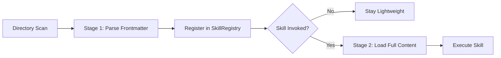
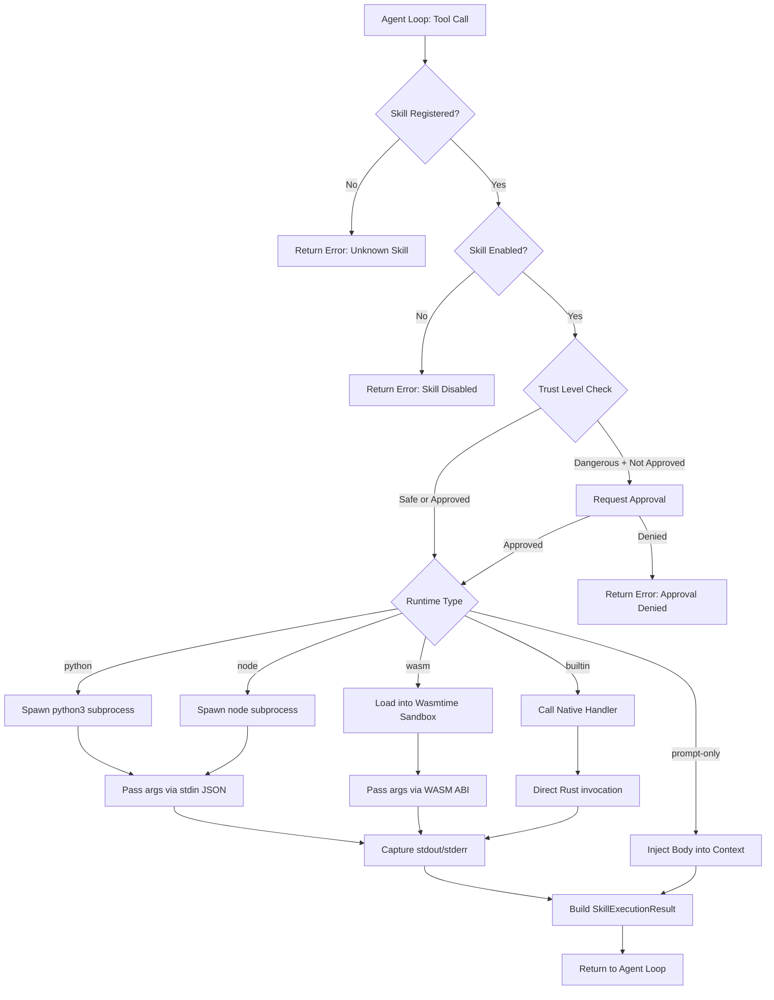
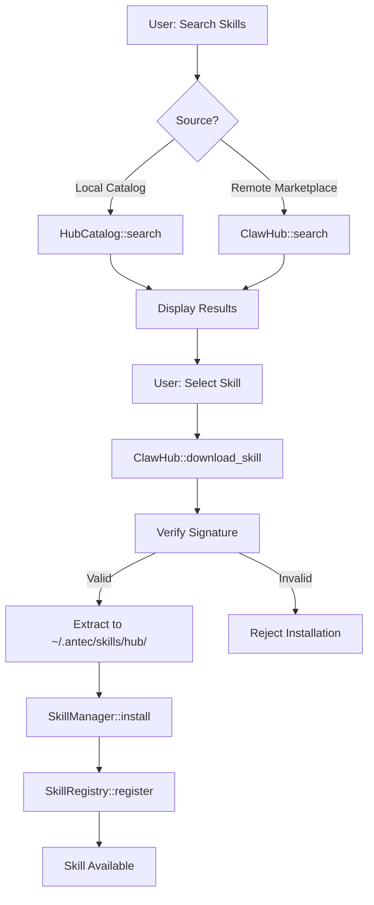
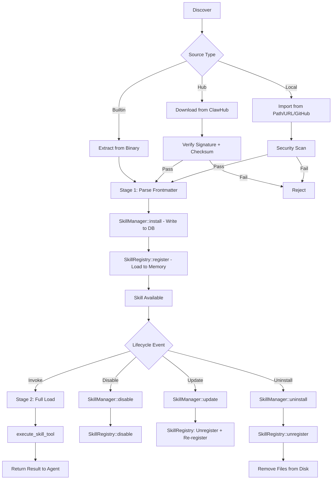

# Skills Platform

> **Module Goal:** Enable an extensible skills ecosystem where capabilities can be packaged, distributed, and safely executed — supporting 5 runtimes (PromptOnly, Python, Node, WASM, Builtin) with progressive loading, trust levels, and marketplace distribution.

### Why This Module Exists

No AI assistant can anticipate every user's needs through built-in tools alone. The Skills module creates a plugin ecosystem where new capabilities can be developed, shared, and installed without modifying Antec's core code.

Skills are defined by a simple SKILL.md format with YAML frontmatter, making them accessible to developers of any level. They can be as simple as a prompt template (PromptOnly) or as complex as a sandboxed WASM module. The progressive loading system (manifest → tools → full skill) keeps startup fast, while trust levels and Ed25519 signatures ensure security. With 66 builtin skills and a hub/catalog for community contributions, Antec's capabilities grow with its ecosystem.

### Business Benefits

| Benefit | Description |
|---------|-------------|
| **Infinite extensibility** | Anyone can create skills — from simple prompts to complex WASM modules |
| **5 runtime options** | PromptOnly for quick wins, Python/Node for flexibility, WASM for sandboxed safety, Builtin for performance |
| **Security tiers** | Builtin (trusted), Local (user), Hub (verified), Community (sandboxed) — risk scales with trust |
| **Community ecosystem** | Hub/catalog enables skill sharing and discovery |
| **Fast startup** | Progressive loading defers heavy initialization until skills are actually needed |
| **Ed25519 signatures** | Cryptographic verification ensures skill integrity from hub distribution |

This document specifies the Skills system for Antec: skill sources, packaging format, runtimes, lifecycle management, hub marketplace, security model, and execution pipeline.

---

## 1. Skill Sources & Trust Levels

Every skill in Antec originates from one of three sources. Each source carries an implicit trust level that determines sandbox restrictions and approval requirements.

| Source | Trust Level | Description | Filesystem Path |
|--------|------------|-------------|-----------------|
| **Builtin** | Full | Shipped with the Antec binary. Embedded via `rust-embed`. 66 bundled skills. | `~/.antec/skills/builtin/` |
| **Hub** | Medium | Downloaded from ClawHub marketplace. Signature-verified. | `~/.antec/skills/hub/` |
| **Local** | User | Manually installed from local path, GitHub, or direct URL. User-audited. | `~/.antec/skills/local/` |

Trust level implications:

- **Full**: No sandbox restrictions. Direct access to all tool calls. No approval prompts.
- **Medium**: Runs in sandboxed runtime. Signature must verify against Ed25519 public key. Dangerous tool calls require approval.
- **User**: Runs in sandboxed runtime. No signature verification (user takes responsibility). All non-safe tool calls require approval.

---

## 2. SKILL.md Format

Every skill is defined by a `SKILL.md` file containing YAML frontmatter followed by a Markdown body. This is the single source of truth for skill metadata and documentation.

### Frontmatter Schema

```yaml
---
name: "weather-forecast"
description: "Fetches current weather and 5-day forecasts for any location."
version: "1.2.0"
author: "antec-team"
license: "MIT"
compatibility: ">=0.5.0"
runtime: "python"
metadata:
  category: "utilities"
  homepage: "https://github.com/antec/skills-weather"
  repository: "https://github.com/antec/skills-weather"
allowed-tools:
  - "http_fetch"
  - "memory_store"
tags:
  - "weather"
  - "api"
  - "forecast"
icon: "cloud-sun"
---
```

### Field Definitions

| Field | Type | Required | Constraints | Description |
|-------|------|----------|-------------|-------------|
| `name` | String | Yes | Max 64 chars. Lowercase alphanumeric + hyphens. Must be unique. | Machine-readable skill identifier. |
| `description` | String | Yes | Max 1024 chars. | Human-readable description shown in listings and to the LLM. |
| `version` | String | Yes | Semver (MAJOR.MINOR.PATCH). | Current version of the skill. |
| `author` | String | Yes | Max 128 chars. | Skill author or organization. |
| `license` | String | No | SPDX identifier. | License under which the skill is distributed. |
| `compatibility` | String | Yes | Semver range expression (e.g., `>=0.5.0`, `^1.0.0`). | Minimum Antec version required. |
| `runtime` | String | Yes | One of: `prompt-only`, `python`, `node`, `wasm`, `builtin`. | Execution runtime for the skill. |
| `metadata` | Map | No | Arbitrary key-value pairs. | Additional metadata (category, homepage, repository). |
| `allowed-tools` | List | No | List of tool name strings. | Tools this skill is permitted to invoke. |
| `tags` | List | No | Max 10 tags, each max 32 chars. | Searchable tags for discovery. |
| `icon` | String | No | Icon identifier string. | Display icon for UI rendering. |

### Validation Rules

- `name`: Max 64 characters. Must match `^[a-z0-9][a-z0-9-]*[a-z0-9]$`.
- `description`: Max 1024 characters. Must not be empty.
- `version`: Must parse as valid semver (MAJOR.MINOR.PATCH). Pre-release and build metadata allowed.
- `compatibility`: Must parse as a valid semver range expression.
- `runtime`: Must be one of the five enumerated values.

### Markdown Body

The body after the frontmatter closing `---` is free-form Markdown. It serves as:

1. **System prompt extension** for `prompt-only` skills — the LLM receives this content as additional context.
2. **Documentation** for all other runtimes — describes what the skill does, usage examples, and configuration.

---

## 3. Runtimes

Each skill declares one runtime that determines how it executes.

| Runtime | Enum Value | Execution Model | Sandbox | Use Case |
|---------|-----------|-----------------|---------|----------|
| **PromptOnly** | `prompt-only` | No code execution. Skill content injected into LLM prompt as system context. | None | Personas, knowledge bases, specialized instructions. |
| **Python** | `python` | Subprocess execution via `python3`. Entrypoint script in `scripts/`. | OS-level process isolation. Timeout enforced. | Data processing, API integrations, file manipulation. |
| **Node** | `node` | External process via `node`. Entrypoint script in `scripts/`. | OS-level process isolation. Timeout enforced. | Web scraping, JS-native API clients. |
| **WASM** | `wasm` | Wasmtime sandbox with fuel metering + epoch interrupts. `.wasm` binary in `scripts/`. | Full WASM sandbox. Memory limits, fuel caps, capability restrictions. | Untrusted or community skills requiring strict isolation. |
| **Builtin** | `builtin` | Native Rust code compiled into the binary. Registered directly in `ToolRegistry`. | None (full trust). | Core skills shipped with Antec. |

### Runtime Execution Details

**Python/Node**: The executor spawns a child process, passes arguments as JSON via stdin, captures stdout as the result, and stderr for diagnostics. A configurable timeout (default: 30s) kills the process if exceeded.

**WASM**: Loaded into Wasmtime with:
- **Fuel metering**: Configurable fuel limit per execution (default: 1,000,000 units).
- **Epoch interrupts**: Engine-level timeout independent of fuel.
- **Memory cap**: Maximum linear memory allocation.
- **Capability declarations**: Skill must declare required capabilities in SKILL.md; only declared capabilities are granted.

---

## 4. Directory Structure

Every skill occupies a directory with the following layout:

```
my-skill/
  SKILL.md            # Required. Metadata + documentation.
  scripts/            # Optional. Executable entrypoints.
    main.py           #   Python entrypoint (runtime: python)
    main.js           #   Node entrypoint (runtime: node)
    main.wasm         #   WASM binary (runtime: wasm)
  references/         # Optional. Reference documents, data files.
    api-docs.md
    schema.json
  assets/             # Optional. Images, icons, static files.
    icon.png
  agents/             # Optional. Sub-agent definitions.
    researcher.md
```

| Directory | Purpose |
|-----------|---------|
| `SKILL.md` | Single source of truth. Always present. |
| `scripts/` | Executable code for non-prompt-only runtimes. |
| `references/` | Supplementary documents the skill can reference. |
| `assets/` | Static assets (images, icons, templates). |
| `agents/` | Sub-agent personas or workflow definitions. |

---

## 5. Progressive Loading

Skills use a two-stage loading strategy to minimize startup time and memory usage.

### Stage 1: Frontmatter Metadata

On startup or directory scan, only the YAML frontmatter of each `SKILL.md` is parsed. This provides:

- Name, version, description for listing and search.
- Runtime type for execution routing.
- Compatibility version for filtering.
- Tags and metadata for discovery.

**Cost**: Minimal. A single file open, read until second `---`, parse YAML.

### Stage 2: Full Content

When a skill is actually invoked or inspected in detail, the full `SKILL.md` body is read and parsed:

- Complete Markdown body for prompt injection or documentation display.
- `allowed-tools` list for runtime permission setup.
- `references/` directory contents loaded if needed.

**Trigger**: First invocation, explicit `get` with full details, or skill detail view in Console.



---

## 6. Filesystem Layout

```
~/.antec/
  skills/
    builtin/          # Embedded skills extracted on first run.
      weather-forecast/
        SKILL.md
        scripts/
      ...              # 66 bundled skills total.
    hub/              # Skills installed from ClawHub marketplace.
      community-tool/
        SKILL.md
        scripts/
    local/            # User-installed skills from local paths or URLs.
      my-custom-skill/
        SKILL.md
        scripts/
```

Each source directory is scanned independently. Name collisions across sources are resolved by priority: `builtin` > `hub` > `local`.

---

## 7. SkillManager (DB-Backed)

The `SkillManager` provides persistent skill state backed by SQLite. It tracks installed skills, their source, enabled/disabled state, and installation metadata.

### Interface

```rust
pub struct SkillManager {
    db: Arc<DatabasePool>,
}

impl SkillManager {
    /// Install a skill from parsed SKILL.md content.
    /// Writes metadata row to DB, copies files to appropriate source directory.
    pub async fn install(&self, skill: &SkillMetadata, source: SkillSource) -> Result<()>;

    /// Get a single skill by name. Returns full metadata from DB.
    pub async fn get(&self, name: &str) -> Result<Option<SkillRecord>>;

    /// List all installed skills, optionally filtered by source or enabled state.
    pub async fn list(&self, filter: Option<SkillFilter>) -> Result<Vec<SkillRecord>>;

    /// Enable a previously disabled skill.
    pub async fn enable(&self, name: &str) -> Result<()>;

    /// Disable a skill without uninstalling. Skill remains on disk but is
    /// excluded from registry and LLM tool definitions.
    pub async fn disable(&self, name: &str) -> Result<()>;

    /// Update a skill to a new version. Replaces files and updates DB row.
    pub async fn update(&self, name: &str, new_skill: &SkillMetadata) -> Result<()>;

    /// Uninstall a skill. Removes files from disk and deletes DB row.
    pub async fn uninstall(&self, name: &str) -> Result<()>;

    /// Scan a source directory for skills. Returns list of discovered
    /// SKILL.md frontmatter (Stage 1 only).
    pub async fn scan_directory(&self, source: SkillSource) -> Result<Vec<SkillMetadata>>;
}
```

### Database Schema

```sql
CREATE TABLE skills (
    name        TEXT PRIMARY KEY,
    version     TEXT NOT NULL,
    source      TEXT NOT NULL CHECK(source IN ('builtin', 'hub', 'local')),
    runtime     TEXT NOT NULL,
    enabled     INTEGER NOT NULL DEFAULT 1,
    description TEXT,
    author      TEXT,
    checksum    TEXT,
    installed_at TEXT NOT NULL DEFAULT (datetime('now')),
    updated_at  TEXT NOT NULL DEFAULT (datetime('now'))
);
```

---

## 8. SkillRegistry (In-Memory)

The `SkillRegistry` is the runtime counterpart of `SkillManager`. It holds loaded skill definitions in memory for fast lookup during agent execution.

### Interface

```rust
pub struct SkillRegistry {
    /// All registered skills, keyed by name.
    skills: RwLock<HashMap<String, Arc<LoadedSkill>>>,

    /// Frozen skills cannot be unregistered or modified.
    frozen: RwLock<HashSet<String>>,

    /// Disabled skills are registered but excluded from execution.
    disabled: RwLock<HashSet<String>>,
}

impl SkillRegistry {
    /// Register a loaded skill. Fails if name is already frozen.
    pub fn register(&self, skill: LoadedSkill) -> Result<()>;

    /// Unregister a skill by name. Fails if frozen.
    pub fn unregister(&self, name: &str) -> Result<()>;

    /// Get a skill by name. Returns None if not registered or disabled.
    pub fn get(&self, name: &str) -> Option<Arc<LoadedSkill>>;

    /// List all registered skills. Optionally include disabled.
    pub fn list(&self, include_disabled: bool) -> Vec<Arc<LoadedSkill>>;

    /// Freeze a skill. Frozen skills cannot be unregistered or modified
    /// until explicitly unfrozen. Used for builtin skills.
    pub fn freeze(&self, name: &str) -> Result<()>;

    /// Unfreeze a previously frozen skill.
    pub fn unfreeze(&self, name: &str) -> Result<()>;

    /// Disable a skill at runtime. It remains registered but is excluded
    /// from get() and list() results.
    pub fn enable(&self, name: &str) -> Result<()>;

    /// Re-enable a disabled skill.
    pub fn disable(&self, name: &str) -> Result<()>;
}
```

### Relationship to SkillManager

On startup, `SkillManager::scan_directory()` discovers skills on disk, and `SkillManager::list()` loads DB state. The results are reconciled and fed into `SkillRegistry::register()`. Runtime state changes (enable/disable) are written back to DB via `SkillManager`.

---

## 9. Execution Pipeline

When the agent loop determines a skill tool should be invoked, execution follows this pipeline:

```rust
/// Execute a skill's entrypoint in its declared runtime.
pub async fn execute_skill_tool(
    runtime: SkillRuntime,
    dir: &Path,
    entrypoint: &str,
    args: serde_json::Value,
    timeout: Duration,
) -> Result<SkillExecutionResult>;

pub struct SkillExecutionResult {
    pub output: String,
    pub exit_code: Option<i32>,
    pub duration: Duration,
    pub truncated: bool,
}
```

### Execution Flow



### Timeout Enforcement

All non-builtin runtimes enforce a timeout:
- Default: 30 seconds.
- Configurable per-skill via SKILL.md metadata or global config.
- On timeout: process killed (Python/Node) or epoch interrupt (WASM). Result returns with error status.

---

## 10. Hub Catalog

The Hub catalog provides local and remote skill discovery. It supports browsing, searching, and converting catalog entries to installable skills.

### Interface

```rust
pub struct HubCatalog {
    entries: Vec<CatalogEntry>,
}

pub struct CatalogEntry {
    pub name: String,
    pub description: String,
    pub version: String,
    pub author: String,
    pub tags: Vec<String>,
    pub category: String,
    pub download_url: Option<String>,
}

impl HubCatalog {
    /// Search catalog entries by query string. Matches against name,
    /// description, and tags.
    pub fn search(&self, query: &str) -> Vec<&CatalogEntry>;

    /// Filter catalog entries by category.
    pub fn by_category(&self, category: &str) -> Vec<&CatalogEntry>;

    /// Get a single catalog entry by name.
    pub fn get(&self, name: &str) -> Option<&CatalogEntry>;

    /// Load the default embedded catalog (ships with binary).
    pub fn default() -> Self;

    /// Convert a catalog entry to a SKILL.md string for installation.
    pub fn catalog_entry_to_skill_md(entry: &CatalogEntry) -> String;
}
```

---

## 11. ClawHub Marketplace

ClawHub is the remote marketplace for community-published skills. Communication is via HTTPS REST API.

### Interface

```rust
pub struct ClawHub {
    base_url: String,
    client: reqwest::Client,
}

impl ClawHub {
    /// Search the marketplace. Returns paginated results.
    pub async fn search(&self, query: &str, page: u32) -> Result<SearchResults>;

    /// Get full skill details from the marketplace by name.
    pub async fn get_skill(&self, name: &str) -> Result<SkillDetails>;

    /// Download a skill package (tarball). Returns bytes.
    pub async fn download_skill(&self, name: &str, version: &str) -> Result<Vec<u8>>;
}

pub struct SearchResults {
    pub skills: Vec<CatalogEntry>,
    pub page: u32,
    pub total_pages: u32,
    pub total_count: u32,
}
```

### Discovery Flow



---

## 12. Import System

The import system classifies and handles skill installation from diverse sources.

### Source Classification

```rust
pub enum ImportSource {
    /// GitHub repository URL. Cloned via git.
    GitHub { owner: String, repo: String, ref_: Option<String> },

    /// ClawHub registry name. Downloaded via ClawHub API.
    Registry { name: String, version: Option<String> },

    /// Direct URL to a skill tarball or zip.
    DirectUrl { url: String },

    /// Local filesystem path.
    LocalPath { path: PathBuf },
}

/// Classify a raw input string into an ImportSource.
pub fn classify_source(input: &str) -> Result<ImportSource>;
```

### Classification Rules

| Input Pattern | Classified As |
|--------------|---------------|
| `https://github.com/owner/repo` | `GitHub { owner, repo }` |
| `github:owner/repo@ref` | `GitHub { owner, repo, ref_ }` |
| `https://example.com/skill.tar.gz` | `DirectUrl { url }` |
| `skill-name` (no slashes, no protocol) | `Registry { name }` |
| `skill-name@1.2.0` | `Registry { name, version }` |
| `/path/to/skill` or `./skill` | `LocalPath { path }` |

### Import Pipeline

1. **Classify**: `classify_source(input)` determines the source type.
2. **Fetch**: Download, clone, or copy files to a temporary directory.
3. **Validate**: Verify `SKILL.md` exists and parses correctly. Check compatibility version.
4. **Security scan**: Run injection scan and path traversal detection on all files.
5. **Copy**: Move validated files to `~/.antec/skills/{hub,local}/`.
6. **Register**: Call `SkillManager::install()` then `SkillRegistry::register()`.

---

## 13. Security

### Signature Verification

Hub skills are signed with Ed25519 keys. Each skill package includes:

- `SKILL.md` and all content files.
- `signature.sig`: Ed25519 signature over the SHA256 hash of the package contents.
- `checksum.sha256`: SHA256 hash of the tarball.

Verification flow:

1. Compute SHA256 of downloaded package.
2. Compare against `checksum.sha256`.
3. Verify `signature.sig` against the computed hash using the publisher's Ed25519 public key.
4. Reject if any step fails.

### Injection Scan

All skill files are scanned for injection patterns before installation. The scanner checks 20+ patterns including:

| Category | Example Patterns |
|----------|-----------------|
| Prompt injection | `ignore previous instructions`, `you are now`, `system: override` |
| Command injection | `` `rm -rf` ``, `$(command)`, `; drop table` |
| Path traversal | `../`, `..\\`, `%2e%2e%2f` |
| Code injection | `eval(`, `exec(`, `__import__`, `require('child_process')` |
| Encoding bypass | Base64-encoded variants, Unicode homoglyphs, null bytes |

### Path Traversal Detection

All file paths within a skill directory are validated:

- No `..` components.
- No absolute paths.
- No symlinks pointing outside the skill directory.
- All paths must resolve within the skill's root directory.

---

## 14. Scaffolding

The `scaffold_skill` function generates a complete skill project structure for rapid development.

```rust
pub fn scaffold_skill(
    name: &str,
    runtime: SkillRuntime,
    output_dir: &Path,
) -> Result<()>;
```

### Generated Files by Runtime

| Runtime | Generated Files |
|---------|----------------|
| `prompt-only` | `SKILL.md` |
| `python` | `SKILL.md`, `scripts/main.py`, `scripts/requirements.txt` |
| `node` | `SKILL.md`, `scripts/main.js`, `scripts/package.json` |
| `wasm` | `SKILL.md`, `scripts/src/lib.rs`, `scripts/Cargo.toml` |
| `builtin` | `SKILL.md` (builtin skills are compiled into the binary) |

The generated `SKILL.md` includes a complete frontmatter template with placeholder values and a Markdown body with usage instructions.

---

## 15. Version Management

Skills use semantic versioning for version tracking and compatibility checks.

### Semver Operations

```rust
/// Parse a version string into components.
pub fn parse_version(version: &str) -> Result<(u32, u32, u32)>;

/// Check if a skill version satisfies a compatibility range.
/// Supports: >=X.Y.Z, ^X.Y.Z, ~X.Y.Z, exact match.
pub fn check_compatibility(skill_version: &str, range: &str) -> bool;

/// Bump the patch version: 1.2.3 -> 1.2.4
pub fn bump_patch(version: &str) -> Result<String>;

/// Bump the minor version: 1.2.3 -> 1.3.0
pub fn bump_minor(version: &str) -> Result<String>;
```

### Update Logic

When updating a skill:
1. Parse both current and new versions.
2. Verify new version is greater than current.
3. Check compatibility with running Antec version.
4. Replace files on disk.
5. Update DB record via `SkillManager::update()`.
6. Re-register in `SkillRegistry`.

---

## 16. Bundled Skills

Antec ships with 66 builtin skills embedded in the binary via `rust-embed`. These cover common use cases and serve as reference implementations.

On first run, embedded skills are extracted to `~/.antec/skills/builtin/`. They are registered with `Full` trust and frozen in the `SkillRegistry` to prevent accidental removal.

Bundled skills span categories including:

- **Utilities**: weather, calculator, unit conversion, random generation.
- **Productivity**: todo management, note taking, calendar, timers.
- **Development**: code review, git helpers, documentation generation.
- **Communication**: email drafting, message formatting, translation.
- **Knowledge**: fact lookup, summarization, research assistance.
- **System**: file management, process monitoring, configuration helpers.

---

## 17. OpenClaw Compatibility

Antec supports interoperability with the OpenClaw skill format through bidirectional conversion.

```rust
/// Convert a SKILL.md parsed structure to an OpenClaw manifest (JSON).
pub fn skill_md_to_manifest(skill: &SkillMetadata) -> Result<serde_json::Value>;

/// Convert an OpenClaw manifest (JSON) to a SKILL.md string.
pub fn manifest_to_skill_md(manifest: &serde_json::Value) -> Result<String>;
```

### Field Mapping

| SKILL.md Field | OpenClaw Manifest Field |
|---------------|------------------------|
| `name` | `id` |
| `description` | `description` |
| `version` | `version` |
| `author` | `author.name` |
| `runtime` | `execution.runtime` |
| `allowed-tools` | `permissions.tools` |
| `tags` | `metadata.tags` |
| `compatibility` | `engine.version` |

This enables users to install OpenClaw skills into Antec and publish Antec skills to OpenClaw-compatible platforms.

---

## Skill Lifecycle (Complete)


