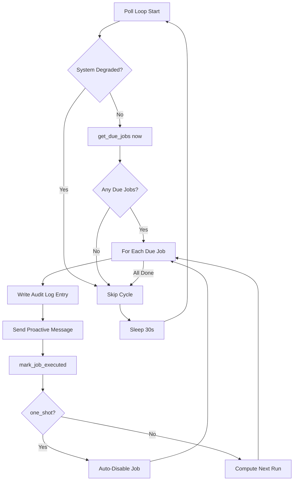
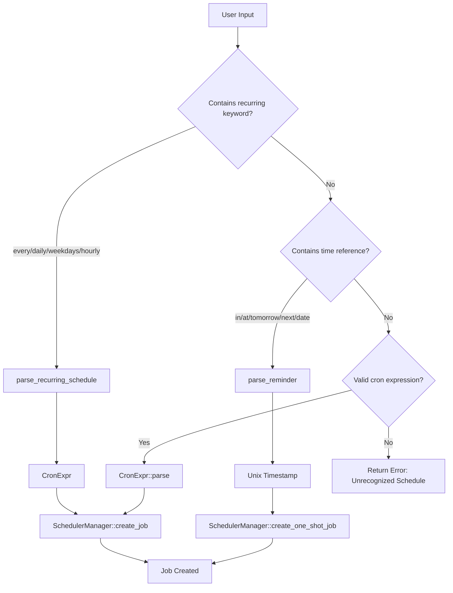
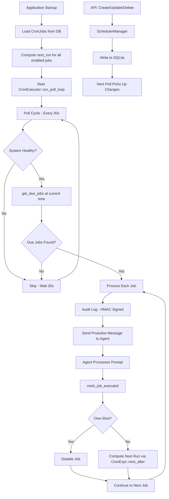

# Scheduler & Cron System

> **Module Goal:** Enable time-based automation through cron scheduling, one-shot reminders, and heartbeat monitoring — transforming Antec from a reactive chatbot into a proactive assistant that takes initiative on a schedule.

### Why This Module Exists

A truly useful personal assistant doesn't just respond to commands — it takes proactive action. "Check my email every morning," "Remind me about the meeting in 2 hours," "Run a security scan every Sunday." Without scheduling, users must manually trigger every interaction.

The Scheduler module provides standard 5-field cron expressions for recurring tasks, natural language parsing for intuitive setup ("every weekday at 9am"), one-shot reminders with automatic cleanup, and heartbeat monitoring for system health. A 30-second poll loop ensures timely execution while keeping resource usage minimal. Each scheduled action creates a message that flows through the normal agent pipeline, inheriting all tool access and safety controls.

### Business Benefits

| Benefit | Description |
|---------|-------------|
| **Proactive AI** | Scheduled tasks transform the assistant from reactive to proactive |
| **Natural language** | Users create schedules in plain English — no cron syntax knowledge needed |
| **Full agent access** | Scheduled actions use the complete agent pipeline — tools, memory, safety controls included |
| **One-shot reminders** | Simple reminder API with automatic cleanup after firing |
| **Heartbeat monitoring** | System health checks run on schedule without user intervention |
| **Minimal overhead** | 30-second poll loop balances responsiveness with resource efficiency |

This document specifies the scheduler system for Antec: cron expression parsing, natural language scheduling, one-shot reminders, the heartbeat system, execution loop, and the REST API.

---

## 1. Cron Expression Format

Antec uses standard 5-field cron expressions for recurring job scheduling.

### Field Definitions

| Position | Field | Range | Description |
|----------|-------|-------|-------------|
| 1 | Minute | 0-59 | Minute of the hour. |
| 2 | Hour | 0-23 | Hour of the day (24h). |
| 3 | Day of Month | 1-31 | Day within the month. |
| 4 | Month | 1-12 | Month of the year. |
| 5 | Day of Week | 0-6 | Day of the week (0 = Sunday). |

### Syntax

| Syntax | Meaning | Example | Expansion |
|--------|---------|---------|-----------|
| `*` | Every value in range. | `* * * * *` | Every minute. |
| `N` | Exact value. | `30 * * * *` | At minute 30 of every hour. |
| `*/N` | Every N-th value. | `*/15 * * * *` | Every 15 minutes (0, 15, 30, 45). |
| `N-M` | Range from N to M inclusive. | `0 9-17 * * *` | Every hour from 9:00 to 17:00. |
| `N,M,O` | List of specific values. | `0 8,12,18 * * *` | At 8:00, 12:00, and 18:00. |

Combinations are supported: `*/10 9-17 * * 1-5` means every 10 minutes during business hours on weekdays.

---

## 2. CronExpr

The `CronExpr` struct parses, validates, and evaluates 5-field cron expressions.

```rust
pub struct CronExpr {
    minute: CronField,
    hour: CronField,
    day_of_month: CronField,
    month: CronField,
    day_of_week: CronField,
}

impl CronExpr {
    /// Parse a 5-field cron expression string.
    /// Returns error if any field is invalid or out of range.
    pub fn parse(expr: &str) -> Result<Self>;

    /// Find the next timestamp after `after` that matches this expression.
    /// Uses brute-force minute-by-minute scan.
    /// Caps search at approximately 4 years (~2,102,400 minutes).
    /// Returns None if no match found within cap (e.g., impossible expression).
    pub fn next_after(&self, after: i64) -> Option<i64>;

    /// Convert back to a cron expression string.
    pub fn to_string_expr(&self) -> String;
}
```

### Next-After Algorithm

The `next_after` method uses a brute-force scan:

1. Start at `after + 60` (next full minute).
2. For each candidate minute timestamp:
   a. Decompose into (minute, hour, day, month, day_of_week).
   b. Check all five fields against the expression.
   c. If all match, return this timestamp.
3. If no match after ~4 years of minutes (2,102,400 iterations), return `None`.

This approach is simple, correct, and fast enough for the expected use cases. A typical scan completes in microseconds for common expressions.

---

## 3. Natural Language Recurring Schedules

Antec parses human-readable recurring schedule descriptions into cron expressions.

### Supported Patterns

| Input Pattern | Parsed Cron | Notes |
|--------------|-------------|-------|
| `every N minutes` | `*/N * * * *` | N must be 1-59. |
| `every N hours` | `0 */N * * *` | N must be 1-23. Fires at minute 0. |
| `daily at HH:MM` | `MM HH * * *` | 24h format. |
| `weekdays at HH:MM` | `MM HH * * 1-5` | Monday through Friday. |
| `hourly` | `0 * * * *` | At the top of every hour. |

### Parsing Logic

```rust
/// Parse a natural language recurring schedule into a CronExpr.
/// Returns None if the input doesn't match any known pattern.
pub fn parse_recurring_schedule(input: &str) -> Option<CronExpr>;
```

The parser applies regex patterns in priority order, returning the first match.

---

## 4. One-Shot Reminders

One-shot reminders fire once at a specific time and are then automatically disabled.

### Supported Patterns

| Input Pattern | Example | Interpretation |
|--------------|---------|----------------|
| `in N minutes` | `in 30 minutes` | Current time + 30 minutes. |
| `in N hours` | `in 2 hours` | Current time + 2 hours. |
| `in N days` | `in 3 days` | Current time + 3 days. |
| `at HH:MM` | `at 14:30` | Today at 14:30 (or tomorrow if already past). |
| `at 3pm` | `at 3pm` | Today at 15:00 (or tomorrow if already past). |
| `at noon` | `at noon` | Today at 12:00 (or tomorrow if already past). |
| `at midnight` | `at midnight` | Today at 00:00 (or tomorrow if already past). |
| `tomorrow at HH:MM` | `tomorrow at 9:00` | Tomorrow at 09:00. |
| `next <weekday> at HH:MM` | `next monday at 10:00` | Next occurrence of that weekday at 10:00. |
| `<month> <day>` | `march 15` | Next occurrence of March 15 at current time. |
| `YYYY-MM-DD` | `2026-06-15` | That date at current time. |
| `YYYY-MM-DD HH:MM` | `2026-06-15 14:00` | That date and time exactly. |

### Implementation

```rust
/// Parse a one-shot reminder from natural language.
/// Returns a Unix timestamp for when the reminder should fire.
pub fn parse_reminder(input: &str, now: i64) -> Option<i64>;
```

For one-shot reminders, the system:
1. Computes the target timestamp.
2. Generates a cron expression matching that exact minute.
3. Creates a `CronJobRow` with `one_shot = true`.
4. After execution, the job is automatically disabled.

---

## 5. Timezone Support

All scheduling functions accept an optional timezone offset to correctly interpret user-local times.

```rust
/// Parse a reminder schedule with timezone awareness.
/// `tz_offset_secs` is the UTC offset in seconds (e.g., 3600 for UTC+1).
/// The input is interpreted in the user's local time, and the resulting
/// timestamp is stored as UTC.
pub fn parse_reminder_schedule_tz(
    input: &str,
    tz_offset_secs: i32,
) -> Option<ScheduleResult>;

pub enum ScheduleResult {
    /// A one-shot timestamp (UTC).
    OneShot(i64),
    /// A recurring cron expression (fields in UTC).
    Recurring(CronExpr),
}
```

### Conversion Logic

1. Parse the input as if in local time.
2. Subtract `tz_offset_secs` from any computed timestamps to convert to UTC.
3. For cron expressions, adjust hour fields by the offset (wrapping around 0-23 and adjusting day if needed).

---

## 6. CronJobRow

The `CronJobRow` represents a single scheduled job in the database.

```rust
pub struct CronJobRow {
    /// Unique job identifier (UUID).
    pub id: String,

    /// Human-readable job name.
    pub name: String,

    /// 5-field cron expression for recurring jobs, or exact-time expression
    /// for one-shot reminders.
    pub cron_expr: String,

    /// The prompt or message to send when the job fires.
    pub prompt: String,

    /// Whether the job is currently active.
    pub enabled: bool,

    /// Next scheduled run time (UTC Unix timestamp).
    pub next_run: Option<i64>,

    /// Last time this job was executed (UTC Unix timestamp).
    pub last_run: Option<i64>,

    /// Total number of times this job has been executed.
    pub run_count: i64,

    /// The type of action to perform when the job fires.
    pub action_type: ActionType,

    /// When the job was created (UTC Unix timestamp).
    pub created_at: i64,

    /// When the job was last modified (UTC Unix timestamp).
    pub updated_at: i64,

    /// If true, the job is automatically disabled after one execution.
    pub one_shot: bool,
}
```

### Database Schema

```sql
CREATE TABLE cron_jobs (
    id          TEXT PRIMARY KEY,
    name        TEXT NOT NULL,
    cron_expr   TEXT NOT NULL,
    prompt      TEXT NOT NULL,
    enabled     INTEGER NOT NULL DEFAULT 1,
    next_run    INTEGER,
    last_run    INTEGER,
    run_count   INTEGER NOT NULL DEFAULT 0,
    action_type TEXT NOT NULL DEFAULT 'send_message',
    created_at  INTEGER NOT NULL,
    updated_at  INTEGER NOT NULL,
    one_shot    INTEGER NOT NULL DEFAULT 0
);
```

---

## 7. Action Types

Each cron job declares an action type that determines what happens when it fires.

```rust
pub enum ActionType {
    /// Send a message to the default channel.
    SendMessage,

    /// Send the prompt to the agent for processing (agent generates a response).
    AskAgent,

    /// Execute a named skill with the prompt as arguments.
    RunSkill,

    /// Fire a reminder notification with the prompt as the reminder text.
    Reminder,
}
```

**Current implementation note**: All four action types currently execute identically -- the prompt is sent as a proactive message through the agent pipeline. The distinction exists for future differentiation (e.g., `RunSkill` could bypass the LLM and invoke the skill directly, `Reminder` could use a notification subsystem).

---

## 8. SchedulerManager

The `SchedulerManager` provides CRUD operations for cron jobs, backed by SQLite.

```rust
pub struct SchedulerManager {
    db: Arc<DatabasePool>,
}

impl SchedulerManager {
    /// Create a new cron job. Computes initial `next_run` from cron expression.
    pub async fn create_job(&self, job: NewCronJob) -> Result<CronJobRow>;

    /// Get a single job by ID.
    pub async fn get_job(&self, id: &str) -> Result<Option<CronJobRow>>;

    /// List all jobs, optionally filtered by enabled state.
    pub async fn list_jobs(&self, enabled_only: bool) -> Result<Vec<CronJobRow>>;

    /// Update a job's fields (name, cron_expr, prompt, enabled).
    /// Recomputes `next_run` if cron_expr changed.
    pub async fn update_job(&self, id: &str, update: UpdateCronJob) -> Result<CronJobRow>;

    /// Delete a job permanently.
    pub async fn delete_job(&self, id: &str) -> Result<()>;

    /// Get all jobs whose `next_run` is <= `now` and `enabled` is true.
    pub async fn get_due_jobs(&self, now: i64) -> Result<Vec<CronJobRow>>;

    /// Mark a job as executed: update `last_run`, increment `run_count`,
    /// compute new `next_run`. If `one_shot`, set `enabled = false`.
    pub async fn mark_job_executed(&self, id: &str, executed_at: i64) -> Result<()>;

    /// Create a one-shot job with a specific fire time.
    /// Convenience wrapper around `create_job` with `one_shot = true`.
    pub async fn create_one_shot_job(&self, name: &str, prompt: &str, fire_at: i64) -> Result<CronJobRow>;
}
```

---

## 9. Heartbeat System

The heartbeat is a special reserved cron job that fires at a regular interval, allowing the agent to perform periodic self-maintenance (memory consolidation, health checks, proactive suggestions).

### Reserved Name

The heartbeat job uses the reserved name `"__heartbeat__"`. Only one heartbeat job can exist at a time.

### Interval Format

Heartbeat intervals use a simplified format:

| Format | Example | Meaning |
|--------|---------|---------|
| `Nm` | `30m` | Every N minutes. |
| `Nh` | `2h` | Every N hours. |

### Interface

```rust
impl SchedulerManager {
    /// Create or update the heartbeat job. If a heartbeat exists, its
    /// interval is updated. If not, a new one is created.
    /// `interval` is in "Nm" or "Nh" format.
    pub async fn upsert_heartbeat(&self, interval: &str) -> Result<CronJobRow>;

    /// Get the current heartbeat job, if one exists.
    pub async fn get_heartbeat(&self) -> Result<Option<CronJobRow>>;

    /// Delete the heartbeat job.
    pub async fn delete_heartbeat(&self) -> Result<()>;
}

/// Convert a cron expression back to a human-readable interval string.
/// Only works for simple `*/N * * * *` or `0 */N * * *` patterns.
/// Returns None for complex expressions.
pub fn cron_to_interval(cron_expr: &str) -> Option<String>;
```

### Behavior

- The heartbeat prompt is a system-defined message (e.g., `"Heartbeat: perform maintenance tasks"`).
- The agent processes heartbeat messages like any other, but with a system flag indicating it is a heartbeat.
- Heartbeat jobs are excluded from user-facing job listings unless explicitly requested.

---

## 10. CronExecutor

The `CronExecutor` runs the poll loop that checks for and executes due cron jobs.

### Poll Loop

The executor runs a polling loop on a fixed 30-second interval:



### Execution Per Job

For each due job, the executor:

1. **Audit log**: Writes an HMAC-signed audit entry recording the job ID, name, and execution timestamp.
2. **Proactive message**: Sends the job's prompt through the proactive message sender to the agent pipeline.
3. **Mark executed**: Calls `mark_job_executed` which updates `last_run`, increments `run_count`, and computes `next_run`.
4. **One-shot handling**: If the job is `one_shot`, sets `enabled = false` after execution.

### Degraded Mode

If the system is in a degraded state (e.g., database errors, agent pipeline unavailable), the executor skips the entire poll cycle. This prevents cascading failures and queuing up failed executions.

---

## 11. CronExecutor Builder

The `CronExecutor` uses a builder pattern for flexible configuration.

```rust
pub struct CronExecutor {
    manager: Arc<SchedulerManager>,
    db: Arc<DatabasePool>,
    proactive_sender: Option<Arc<ProactiveSender>>,
    audit_hmac_key: Option<Vec<u8>>,
    crash_guard: Option<Arc<CrashGuard>>,
}

impl CronExecutor {
    /// Create a new executor with required dependencies.
    pub fn new(manager: Arc<SchedulerManager>, db: Arc<DatabasePool>) -> Self;

    /// Set the proactive message sender for delivering job prompts to the agent.
    pub fn with_proactive_sender(self, sender: Arc<ProactiveSender>) -> Self;

    /// Set the HMAC key for signing audit log entries.
    pub fn with_audit_hmac_key(self, key: Vec<u8>) -> Self;

    /// Set the crash guard for safe shutdown handling.
    pub fn with_crash_guard(self, guard: Arc<CrashGuard>) -> Self;

    /// Start the poll loop. Runs until `cancel` token is triggered.
    /// This is the main entry point -- call this from the application startup.
    pub async fn run_poll_loop(self, cancel: CancellationToken);
}
```

### Startup Integration

```rust
// In application startup:
let executor = CronExecutor::new(scheduler_manager.clone(), db.clone())
    .with_proactive_sender(proactive_sender.clone())
    .with_audit_hmac_key(config.audit_hmac_key.clone())
    .with_crash_guard(crash_guard.clone());

// Spawn as background task:
let cancel = CancellationToken::new();
tokio::spawn(executor.run_poll_loop(cancel.clone()));

// On shutdown:
cancel.cancel();
```

---

## 12. REST API

The scheduler exposes a full REST API for managing cron jobs, reminders, and the heartbeat.

### Cron Job Endpoints

| Method | Path | Description |
|--------|------|-------------|
| `GET` | `/api/cron` | List all cron jobs. Query param `?enabled=true` to filter. |
| `POST` | `/api/cron` | Create a new cron job. |
| `GET` | `/api/cron/:id` | Get a single cron job by ID. |
| `PUT` | `/api/cron/:id` | Update a cron job. |
| `DELETE` | `/api/cron/:id` | Delete a cron job. |
| `POST` | `/api/cron/:id/run` | Manually trigger a cron job immediately. |

### Reminder Endpoints

| Method | Path | Description |
|--------|------|-------------|
| `GET` | `/api/reminders` | List all active one-shot reminders. |
| `POST` | `/api/reminders` | Create a new reminder from natural language input. |
| `DELETE` | `/api/reminders/:id` | Cancel a pending reminder. |

### Heartbeat Endpoints

| Method | Path | Description |
|--------|------|-------------|
| `GET` | `/api/heartbeat` | Get current heartbeat configuration. |
| `POST` | `/api/heartbeat` | Create or update heartbeat interval. |
| `DELETE` | `/api/heartbeat` | Delete the heartbeat job. |

### Request/Response Examples

**Create Cron Job**:
```json
POST /api/cron
{
    "name": "daily-summary",
    "cron_expr": "0 9 * * *",
    "prompt": "Generate a summary of yesterday's tasks and today's priorities.",
    "action_type": "ask_agent"
}

Response 201:
{
    "id": "a1b2c3d4-...",
    "name": "daily-summary",
    "cron_expr": "0 9 * * *",
    "prompt": "Generate a summary of yesterday's tasks and today's priorities.",
    "enabled": true,
    "next_run": 1741334400,
    "last_run": null,
    "run_count": 0,
    "action_type": "ask_agent",
    "one_shot": false
}
```

**Create Reminder**:
```json
POST /api/reminders
{
    "input": "tomorrow at 3pm",
    "prompt": "Remember to review the pull request.",
    "tz_offset_secs": 3600
}

Response 201:
{
    "id": "e5f6g7h8-...",
    "name": "reminder-e5f6g7h8",
    "fire_at": 1741359600,
    "prompt": "Remember to review the pull request.",
    "one_shot": true
}
```

**Set Heartbeat**:
```json
POST /api/heartbeat
{
    "interval": "30m"
}

Response 200:
{
    "id": "...",
    "name": "__heartbeat__",
    "cron_expr": "*/30 * * * *",
    "interval": "30m",
    "enabled": true,
    "next_run": 1741332600
}
```

---

## Natural Language Parsing Pipeline



---

## Scheduler Flow (Complete)


