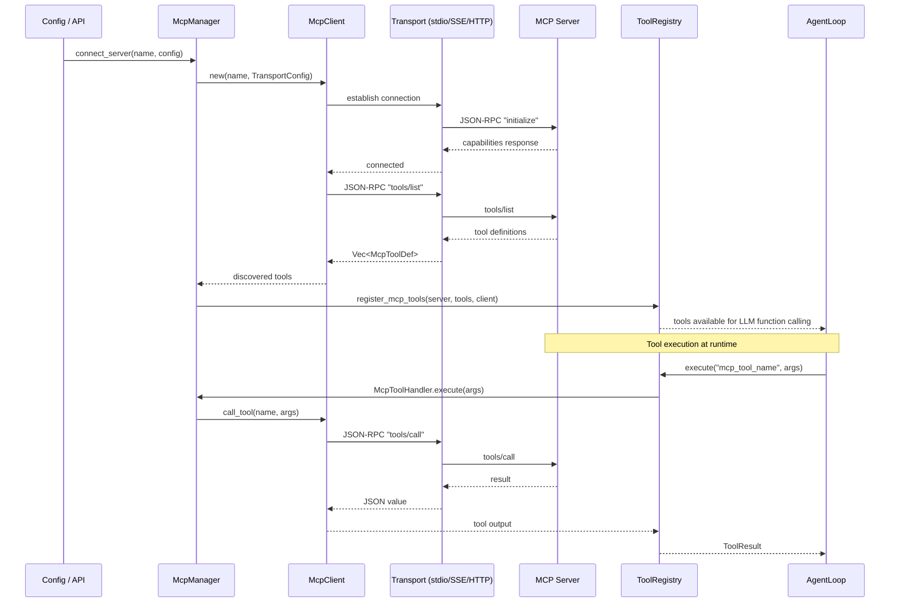

# 11 -- Model Context Protocol (MCP) Integration

> **Module Goal:** Connect Antec to the growing ecosystem of MCP-compatible tool servers — supporting stdio, SSE, and HTTP transports — so users can access hundreds of community-built tools through a standardized protocol.

### Why This Module Exists

The Model Context Protocol (MCP) is an open standard for connecting AI assistants to external tool servers. By implementing an MCP client, Antec gains access to a rapidly growing ecosystem of tool servers — from database connectors to API integrations — without implementing each one natively.

The MCP module handles the full client lifecycle: discovering available tools from MCP servers, translating them into Antec's internal tool format via the McpToolHandler bridge, and managing connections across three transport types (stdio for local processes, SSE for streaming HTTP, HTTP for simple request/response). This means any MCP-compatible server can extend Antec's capabilities immediately.

### Business Benefits

| Benefit | Description |
|---------|-------------|
| **Ecosystem access** | Hundreds of community MCP servers instantly available — databases, APIs, cloud services |
| **Standard protocol** | JSON-RPC 2.0 based protocol ensures compatibility with any MCP-compliant server |
| **Three transports** | Stdio (local), SSE (streaming), HTTP (simple) — connect to any server type |
| **Transparent bridge** | MCP tools appear as native Antec tools — users don't know the difference |
| **Zero custom code** | New integrations via MCP require no Rust code — just configure and connect |
| **Tool discovery** | Automatic tool enumeration from MCP servers — no manual registration needed |

> **Crate**: `antec-mcp` (`crates/antec-mcp/`) -- protocol client, transports, config parsing
> **Bridge**: `antec-tools` (`crates/antec-tools/src/mcp_tools.rs`) -- tool handler wrapper, McpManager lifecycle
> **Storage**: `antec-storage` -- `mcp_servers` table (migration 012)
> **Purpose**: Connect to external MCP servers that provide additional tools. Antec acts as an MCP **client** only -- it never hosts an MCP server.

---

## 1. Overview

The Model Context Protocol (MCP) allows Antec to dynamically discover and invoke tools exposed by external processes or remote services. Each MCP server is a standalone program that advertises tools via JSON-RPC 2.0. Antec connects, discovers available tools, wraps them as `ToolHandler` implementations, and registers them in the live `ToolRegistry` alongside native and skill-provided tools.

### Integration Flow



---

## 2. Transport Types

Antec supports three MCP transport mechanisms, each implemented as a struct conforming to the `McpTransport` trait.

### McpTransport Trait

```rust
#[async_trait]
pub trait McpTransport: Send + Sync {
    /// Send a JSON-RPC request and receive a response.
    async fn send(&self, request: Value) -> Result<Value>;
    /// Close the transport connection.
    async fn close(&self);
}
```

### TransportConfig Enum

```rust
#[derive(Debug, Clone, Serialize, Deserialize, PartialEq)]
#[serde(tag = "type", rename_all = "snake_case")]
pub enum TransportConfig {
    Stdio {
        command: String,
        #[serde(default)]
        args: Vec<String>,
        #[serde(default)]
        env: HashMap<String, String>,
    },
    Http {
        url: String,
        #[serde(default)]
        headers: HashMap<String, String>,
    },
    Sse {
        url: String,
        #[serde(default)]
        headers: HashMap<String, String>,
    },
}
```

### 2.1 Stdio Transport

Launches the MCP server as a child process via `tokio::process::Command`. Communication uses newline-delimited JSON-RPC messages over stdin (requests) and stdout (responses). Stderr is silenced.

```rust
pub struct StdioTransport {
    stdin: tokio::sync::Mutex<tokio::process::ChildStdin>,
    stdout: tokio::sync::Mutex<tokio::io::BufReader<tokio::process::ChildStdout>>,
    child: tokio::sync::Mutex<tokio::process::Child>,
}
```

- **spawn(command, args, env)** -- Start subprocess with piped stdin/stdout.
- **send(request)** -- Serialize request to JSON, write line to stdin, read response line from stdout, parse as JSON.
- **close()** -- Kill the child process.

This is the most common transport for local tools (e.g., `npx -y @modelcontextprotocol/server-filesystem`).

### 2.2 HTTP Transport

Communicates with an MCP server via standard HTTP POST requests. Each JSON-RPC message is sent as the request body with `Content-Type: application/json`.

```rust
pub struct HttpTransport {
    client: reqwest::Client,
    url: String,
    headers: HashMap<String, String>,
}
```

- **new(url, headers)** -- Create transport targeting the given URL.
- **send(request)** -- POST JSON to URL, parse response body as JSON. Returns error on non-2xx status.
- **close()** -- No-op (HTTP is stateless).

Custom headers (e.g., `Authorization`) can be set via the `headers` map.

### 2.3 SSE Transport (Server-Sent Events)

Designed for MCP servers that accept JSON-RPC POST requests but may respond using the SSE wire format (`data: {...}\n\n` lines).

```rust
pub struct SseTransport {
    client: reqwest::Client,
    url: String,
    headers: HashMap<String, String>,
}
```

- **new(url, headers)** -- Create transport with `Accept: text/event-stream`.
- **send(request)** -- POST JSON to URL. Attempts raw JSON parse first; if that fails, scans for `data:` lines in SSE format and extracts the first valid JSON payload.
- **close()** -- No-op (connections are per-request).

### Transport Auto-Detection

When headers are not explicitly set but the config contains env vars matching `AUTHORIZATION`, `*_API_KEY`, or `*_TOKEN`, the gateway route handler automatically derives `Authorization: Bearer <value>` headers for HTTP/SSE transports.

---

## 3. JSON-RPC Protocol

All MCP communication uses JSON-RPC 2.0 messages.

### Request

```rust
#[derive(Debug, Clone, Serialize, Deserialize)]
pub struct JsonRpcRequest {
    pub jsonrpc: String,        // always "2.0"
    pub id: u64,                // monotonically increasing per client
    pub method: String,         // e.g., "initialize", "tools/list", "tools/call"
    pub params: Option<Value>,  // method-specific parameters
}
```

### Response

```rust
#[derive(Debug, Clone, Serialize, Deserialize)]
pub struct JsonRpcResponse {
    pub jsonrpc: String,
    pub id: u64,
    pub result: Option<Value>,
    pub error: Option<JsonRpcError>,
}

#[derive(Debug, Clone, Serialize, Deserialize)]
pub struct JsonRpcError {
    pub code: i64,
    pub message: String,
    pub data: Option<Value>,
}
```

### Protocol Sequence

1. **Initialize**: Client sends `initialize` with `protocolVersion: "2024-11-05"`, `capabilities: {}`, and `clientInfo: { name: "antec", version: "<cargo_pkg_version>" }`. Server responds with its capabilities.
2. **Tool Discovery**: Client sends `tools/list` with no params. Server responds with `{ tools: [{ name, description, inputSchema }] }`.
3. **Tool Execution**: Client sends `tools/call` with `{ name, arguments }`. Server responds with `{ content: [{ type: "text", text: "..." }] }`.

---

## 4. MCP Server Configuration

### 4.1 Database Model

**Table**: `mcp_servers` (migration 012)

```sql
CREATE TABLE IF NOT EXISTS mcp_servers (
    id         TEXT PRIMARY KEY,
    name       TEXT NOT NULL UNIQUE,
    config     TEXT NOT NULL,   -- JSON: transport, command, args, url, env
    enabled    INTEGER NOT NULL DEFAULT 1,
    added_at   INTEGER NOT NULL
);

CREATE INDEX IF NOT EXISTS idx_mcp_servers_name ON mcp_servers(name);
```

**Row struct**:

```rust
pub struct McpServerRow {
    pub id: String,       // UUID v4
    pub name: String,     // unique server name
    pub config: String,   // JSON-serialized config
    pub enabled: bool,    // whether to connect on boot
    pub added_at: i64,    // Unix timestamp
}
```

### 4.2 Config JSON Format

The `config` column stores a JSON object describing the transport:

**Stdio**:
```json
{
  "transport": "stdio",
  "command": "/usr/local/bin/npx",
  "args": ["-y", "@modelcontextprotocol/server-filesystem", "/tmp"],
  "env": { "NODE_ENV": "production" }
}
```

**HTTP**:
```json
{
  "transport": "http",
  "url": "https://mcp.example.com/api",
  "env": {}
}
```

**SSE**:
```json
{
  "transport": "sse",
  "url": "https://mcp.example.com/sse",
  "env": { "AUTHORIZATION": "Bearer sk-xxx" }
}
```

### 4.3 Repository Trait

```rust
pub trait McpServerRepo {
    fn create_mcp_server(&self, server: &McpServerRow) -> Result<()>;
    fn get_mcp_server(&self, name: &str) -> Result<Option<McpServerRow>>;
    fn list_mcp_servers(&self) -> Result<Vec<McpServerRow>>;
    fn update_mcp_server(&self, name: &str, config: &str, enabled: bool) -> Result<bool>;
    fn set_mcp_server_enabled(&self, name: &str, enabled: bool) -> Result<bool>;
    fn delete_mcp_server(&self, name: &str) -> Result<bool>;
}
```

Listing is ordered by `added_at` (chronological insertion order).

### 4.4 McpServerEntry (Config File Format)

For loading from external JSON config files (compatible with Claude Desktop, Cursor, and other MCP clients):

```rust
pub struct McpServerEntry {
    pub name: String,
    pub transport: String,      // "stdio", "http", "sse"
    pub command: Option<String>,
    pub args: Vec<String>,
    pub url: Option<String>,
    pub env: HashMap<String, String>,
    pub enabled: bool,          // defaults to true
}
```

### 4.5 Config File Parsing

Three JSON formats are supported:

| Format | Shape | Example |
|--------|-------|---------|
| **Wrapper** | `{"mcpServers": {"name": {...}}}` | Standard Claude Desktop format |
| **Direct** | `{"name": {"command": "...", ...}}` | Multiple servers, no wrapper |
| **Single** | `{"command": "...", "args": [...]}` | Single unnamed server |

Functions:

- `parse_mcp_servers_json(json_str) -> Result<Vec<McpServerEntry>>` -- Parse any of the three formats.
- `parse_mcp_servers_value(value) -> Result<Vec<McpServerEntry>>` -- Parse from a `serde_json::Value`.
- `load_mcp_config_file(path) -> Result<Vec<McpServerEntry>>` -- Read file and parse.
- `entry_to_transport_config(entry) -> TransportConfig` -- Convert entry to internal transport config.

Transport auto-detection: if `command` is present, transport is `"stdio"`. If only `url` is present, transport is `"http"` unless the URL contains `/sse`, in which case it is `"sse"`.

---

## 5. MCP Client

The `McpClient` manages a single connection to one MCP server.

```rust
pub struct McpClient {
    name: String,
    transport_config: TransportConfig,
    transport: Option<Box<dyn McpTransport>>,
    connected: bool,
    discovered_tools: Vec<McpToolDef>,
    next_id: AtomicU64,
}
```

### Key Methods

| Method | Description |
|--------|-------------|
| `new(name, config)` | Create client (not yet connected) |
| `connect()` | Establish transport, send `initialize` JSON-RPC, validate response |
| `disconnect()` | Close transport, clear discovered tools, set `connected = false` |
| `is_connected()` | Check connection state |
| `discover_tools()` | Send `tools/list`, parse response into `Vec<McpToolDef>`, cache results |
| `call_tool(name, args)` | Send `tools/call`, validate tool exists in discovered set, return result |
| `name()` | Return server name |
| `transport_config()` | Return transport configuration reference |

Request IDs are monotonically increasing via `AtomicU64`.

### McpToolDef

```rust
#[derive(Debug, Clone, Serialize, Deserialize, PartialEq)]
pub struct McpToolDef {
    pub name: String,
    pub description: String,
    pub input_schema: Value,  // JSON Schema for tool parameters
}
```

### McpServer (Discovery State)

```rust
pub struct McpServer {
    pub name: String,
    pub transport_config: TransportConfig,
    pub tools: Vec<McpToolDef>,
    pub connected: bool,
}
```

---

## 6. Tool Registration Bridge

Each discovered MCP tool is wrapped in an `McpToolHandler` that implements the `ToolHandler` trait, allowing it to be registered in the `ToolRegistry` alongside native tools.

### McpToolHandler

```rust
pub struct McpToolHandler {
    def: McpToolDef,
    server_name: String,
    client: Arc<Mutex<McpClient>>,
}
```

#### Trait Implementation

| ToolHandler Method | Behavior |
|-------------------|----------|
| `name()` | Returns `def.name` (the MCP tool's original name) |
| `description()` | Returns `def.description` |
| `parameters()` | Returns `def.input_schema` (pass-through from MCP) |
| `risk_level()` | Always `RiskLevel::Moderate` (MCP tools are external, untrusted) |
| `source()` | Returns `ToolSource::Mcp` |
| `execute(args)` | Locks the shared `McpClient`, calls `call_tool()`, extracts text content from MCP response |

#### Response Parsing

MCP tool results follow the content array format:
```json
{"content": [{"type": "text", "text": "result here"}]}
```

The handler extracts all `text` entries and joins them with newlines. If no text content is found, the raw JSON response is returned pretty-printed.

### Registration Functions

```rust
/// Register all tools from an MCP server into the live registry.
pub fn register_mcp_tools(
    registry: &ToolRegistry,
    server_name: &str,
    tool_defs: &[McpToolDef],
    client: Arc<Mutex<McpClient>>,
) -> Vec<String>;

/// Unregister MCP tools by name.
pub fn unregister_mcp_tools(registry: &ToolRegistry, tool_names: &[String]);
```

Tools are registered with their original MCP name (no namespacing by server name). If two servers expose a tool with the same name, the later registration overwrites the earlier one.

---

## 7. McpManager (Runtime Lifecycle)

The `McpManager` is the single source of truth for which MCP servers are connected and which tools they provide. It lives in `antec-tools` because it bridges MCP clients with the tool registry.

```rust
pub struct McpManager {
    clients: RwLock<HashMap<String, Arc<Mutex<McpClient>>>>,
    registered_tools: RwLock<HashMap<String, Vec<String>>>,
    errors: RwLock<HashMap<String, String>>,
    registry: Arc<ToolRegistry>,
}
```

### Methods

| Method | Description |
|--------|-------------|
| `new(registry)` | Create manager with reference to the live tool registry |
| `connect_server(name, config)` | Disconnect if already connected, create client, connect, discover tools, register in registry. Records error on failure |
| `disconnect_server(name)` | Unregister tools, disconnect client, clear error |
| `reconnect_server(name, config)` | Alias for `connect_server` (which disconnects first) |
| `is_connected(name)` | Check if a server is currently connected |
| `tools_for_server(name)` | Return list of tool names registered by a server |
| `server_statuses()` | Return `Vec<McpServerStatus>` for all known servers (connected + errored) |

### McpServerStatus

```rust
pub struct McpServerStatus {
    pub name: String,
    pub connected: bool,
    pub tools: Vec<String>,
    pub error: Option<String>,
}
```

---

## 8. API Surface

All routes are authenticated and require a valid session token.

### GET /api/v1/mcp

List all configured MCP servers from the database, enriched with live connection status from the `McpManager`.

**Response**: `200 OK`
```json
[
  {
    "name": "filesystem",
    "transport": "stdio",
    "command": "npx",
    "url": null,
    "enabled": true,
    "source": "db",
    "connected": true,
    "tools": ["read_file", "write_file", "list_directory"],
    "error": null
  }
]
```

### POST /api/v1/mcp

Add a new MCP server configuration. Supports two modes:

**Mode 1 -- Direct creation**:
```json
{
  "name": "filesystem",
  "transport": "stdio",
  "command": "npx",
  "args": ["-y", "@modelcontextprotocol/server-filesystem", "/tmp"],
  "env": {}
}
```

**Mode 2 -- Bulk import from mcpServers JSON**:
```json
{
  "mcp_servers_json": "{\"mcpServers\":{\"filesystem\":{\"command\":\"npx\",\"args\":[\"-y\",\"@modelcontextprotocol/server-filesystem\",\"/tmp\"]}}}"
}
```

**Response**: `200 OK` with `{ "name": "...", "created": true }` or `{ "imported": ["name1", "name2"] }`.

After creation, enabled servers are connected in the background via `tokio::spawn`.

### GET /api/v1/mcp/status

Connection status per server (same as `GET /api/v1/mcp` but focused on live state).

### PUT /api/v1/mcp/{name}

Update server configuration and/or enabled state.

```json
{
  "enabled": false,
  "transport": "stdio",
  "command": "/new/path/to/server",
  "args": ["--new-flag"]
}
```

If `enabled` is changed to `false`, the server is disconnected. If changed to `true` or config is modified, the server is reconnected with the new config.

### DELETE /api/v1/mcp/{name}

Disconnect the server, unregister its tools, and remove the database record.

**Response**: `200 OK` with `{ "deleted": true }` or `404` if not found.

### POST /api/v1/mcp/{name}/reconnect

Disconnect and reconnect the named server using its stored config. Useful for recovery after a server crash or to pick up new tools after a server update.

**Response**: `200 OK` with `{ "connected": true, "tools": ["tool1", "tool2"] }` or error details.

---

## 9. Startup Behavior

During the boot sequence (step 12 in the boot order, see `01-ARCHITECTURE.md`):

1. Load all rows from `mcp_servers` table where `enabled = true`.
2. For each enabled server, convert its stored JSON config to a `TransportConfig`.
3. Call `McpManager::connect_server(name, config)` for each.
4. If connection or tool discovery fails, the error is logged and recorded in the manager's error map. The server is marked as disconnected but remains in the database for later reconnection.
5. Successfully connected servers have their tools immediately available in the `ToolRegistry`.

Failed connections do **not** block startup. They can be retried later via the `POST /api/v1/mcp/{name}/reconnect` API endpoint.

---

## 10. Error Handling

### McpError Enum

```rust
#[derive(Debug, Error)]
pub enum McpError {
    #[error("transport error: {0}")]
    Transport(String),

    #[error("protocol error: {0}")]
    Protocol(String),

    #[error("tool not found: {0}")]
    ToolNotFound(String),

    #[error("not connected")]
    NotConnected,

    #[error("internal error: {0}")]
    Internal(String),
}
```

- **Transport errors**: Network failures, subprocess crashes, malformed responses.
- **Protocol errors**: Invalid JSON, missing required fields in responses.
- **ToolNotFound**: Attempted to call a tool not in the discovered set.
- **NotConnected**: Attempted operation before `connect()` or after `disconnect()`.
- **Internal**: File I/O errors when loading config files.

### Resilience

- Tool calls to disconnected servers return `ToolError::ExecutionFailed` with a descriptive message.
- The circuit breaker in the `ToolRegistry` applies to MCP tools the same as native tools: 3 consecutive failures trigger a 30-second cooldown.
- The GCRA rate limiter enforces 60 requests/minute per tool by default.

---

## 11. Security Considerations

- MCP tools are always classified as `RiskLevel::Moderate` regardless of what the server declares. Under the `strict` policy mode, they require approval before execution.
- Environment variables in stdio transport configs may contain secrets (API keys, tokens). These are stored in the `config` JSON column in the database. The secrets vault (`antec-security`) does not currently encrypt MCP config values -- they are stored in plaintext in SQLite.
- SSRF protection: HTTP/SSE transport URLs are not validated against an allowlist. Network isolation (firewall rules, loopback binding) is the recommended mitigation.
- Subprocess sandboxing: Stdio-launched MCP servers run as the same OS user as Antec. The OS sandbox command blocklist does **not** apply to MCP server processes.
