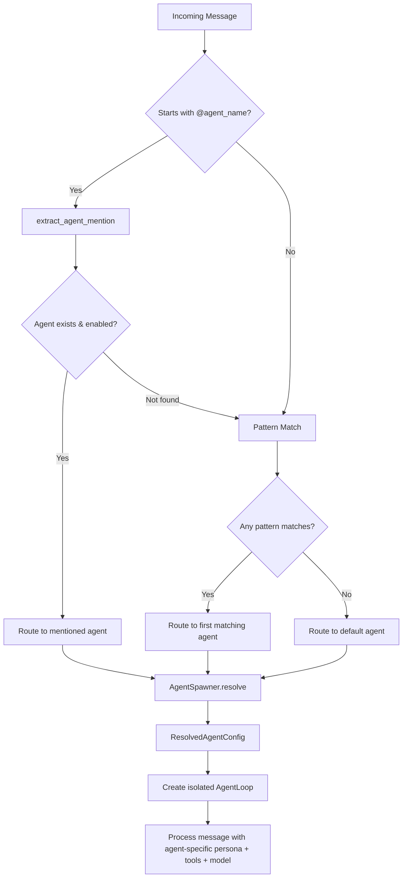
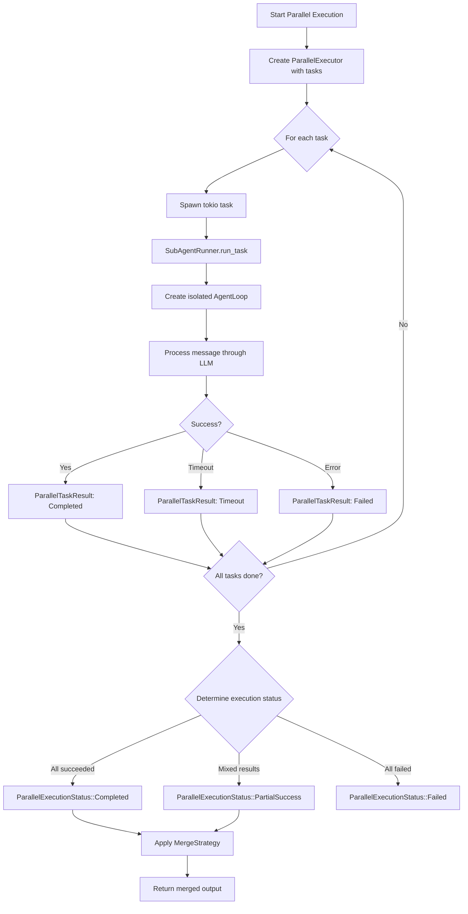

# 12 - Multi-Agent System

> **Module Goal:** Enable specialized AI agents that handle domain-specific tasks — with @mention routing, pattern-based activation, parallel execution, and configurable merge strategies — so complex queries get expert-level handling instead of one-size-fits-all responses.

### Why This Module Exists

A single general-purpose AI struggles with specialized domains: code review requires different expertise than travel planning or financial analysis. The Multi-Agent system lets Antec deploy specialized agents, each with their own system prompt, tool access, and behavioral configuration.

Users can invoke agents explicitly via @mentions or let the system route automatically based on message patterns. 12 bundled agents cover common domains (coding, writing, research, etc.), and custom agents can be defined in TOML. For complex tasks that benefit from multiple perspectives, parallel execution with configurable merge strategies (Concatenate, Summarize, VoteConsensus) enables collaborative agent workflows.

### Business Benefits

| Benefit | Description |
|---------|-------------|
| **Expert specialization** | Each agent optimized for its domain — better results than a generalist |
| **Automatic routing** | Pattern matching and @mentions route queries to the right agent without user effort |
| **12 bundled agents** | Ready-to-use specialists for coding, writing, research, analysis, and more |
| **Custom agents** | Simple TOML format lets users create domain-specific agents |
| **Parallel execution** | Multiple agents can tackle a problem simultaneously for faster, richer results |
| **Merge strategies** | Concatenate, Summarize, or VoteConsensus — flexible result combination |

> **Crate**: `antec-core` (`crates/antec-core/`) -- agent routing, spawning, parallel execution, bundled agents
> **Storage**: `antec-storage` -- `agent_definitions` table (migration 018)
> **Purpose**: Route messages to specialized agents, manage agent definitions, and execute tasks in parallel via sub-agent delegation.

---

## 1. Agent Definitions

Each agent is a named configuration that determines persona, available tools, skills, model routing, and enablement state. Agents are stored in SQLite and can be loaded from TOML files or created via API.

### Database Schema

**Table**: `agent_definitions`

| Column              | Type    | Constraints                        | Description                                      |
|---------------------|---------|------------------------------------|--------------------------------------------------|
| `id`                | TEXT    | PRIMARY KEY                        | UUID v4 identifier                               |
| `name`              | TEXT    | NOT NULL, UNIQUE                   | Agent identifier (lowercase, hyphens). Used in `@mention` routing |
| `description`       | TEXT    | NOT NULL DEFAULT ''                | Human-readable summary of the agent's purpose    |
| `persona`           | TEXT    | NOT NULL                           | System prompt persona text (minimum 100 chars for bundled agents) |
| `tools`             | TEXT    | NOT NULL DEFAULT '[]'              | JSON array of allowed tool names                 |
| `skills`            | TEXT    | NOT NULL DEFAULT '[]'              | JSON array of installed skill identifiers        |
| `model`             | TEXT    | nullable                           | Model name override (e.g., `claude-opus-4-6`). None = use system default |
| `provider`          | TEXT    | nullable                           | Provider name override (e.g., `anthropic`). None = use system default |
| `model_instance_id` | TEXT    | nullable                           | Reference to model instance config               |
| `enabled`           | INTEGER | NOT NULL DEFAULT 1                 | 1 = active, 0 = disabled (skipped during routing)|
| `is_default`        | INTEGER | NOT NULL DEFAULT 0                 | 1 = fallback agent when no routing match. Exactly one row must be 1 |
| `created_at`        | INTEGER | NOT NULL                           | Unix timestamp of creation                       |
| `updated_at`        | INTEGER | NOT NULL                           | Unix timestamp of last modification              |

**Invariants**:
- Exactly one agent must have `is_default = 1` at all times.
- `name` is case-insensitive unique (enforced via `COLLATE NOCASE`).
- `tools` and `skills` are validated JSON arrays on write.

### Row Struct

```rust
#[derive(Debug, Clone, Serialize, Deserialize)]
pub struct AgentDefinitionRow {
    pub id: String,
    pub name: String,
    pub description: String,
    pub persona: String,
    pub tools: String,              // JSON: ["shell_exec", "file_read"]
    pub skills: String,             // JSON: ["git-tools"]
    pub model: Option<String>,      // e.g., "claude-opus-4-6"
    pub provider: Option<String>,   // e.g., "anthropic"
    pub model_instance_id: Option<String>,
    pub enabled: bool,
    pub is_default: bool,
    pub created_at: i64,
    pub updated_at: i64,
}
```

### Repository Trait

```rust
pub trait AgentRepo {
    fn create_agent(&self, agent: &AgentDefinitionRow) -> Result<()>;
    fn get_agent(&self, id: &str) -> Result<Option<AgentDefinitionRow>>;
    fn get_agent_by_name(&self, name: &str) -> Result<Option<AgentDefinitionRow>>;
    fn get_default_agent(&self) -> Result<Option<AgentDefinitionRow>>;
    fn list_agents(&self) -> Result<Vec<AgentDefinitionRow>>;
    fn update_agent(&self, agent: &AgentDefinitionRow) -> Result<bool>;
    fn set_agent_enabled(&self, id: &str, enabled: bool) -> Result<bool>;
    fn delete_agent(&self, id: &str) -> Result<bool>;
}
```

---

## 2. Agent Routing

Routing determines which agent handles a given inbound message. The router evaluates three strategies in strict priority order and returns the first match.

### Routing Priority

| Priority | Strategy           | Description                                                                 |
|----------|--------------------|-----------------------------------------------------------------------------|
| 1        | `@mention` regex   | Message starts with `@agent_name` -- exact agent name match (case-insensitive) |
| 2        | Pattern match      | Case-insensitive substring match against registered routing patterns        |
| 3        | Default agent      | The single agent with `is_default = 1`                                      |

### Routing Flow



### `extract_agent_mention(message: &str) -> Option<String>`

Parses an `@name` token at the very start of the message (after trimming leading whitespace). The name token stops at the first whitespace, colon (`:`), or comma (`,`) character. Returns `Some(agent_name)` lowercased, or `None` if the message does not begin with `@`.

```rust
fn extract_agent_mention(message: &str) -> Option<String> {
    let trimmed = message.trim();
    if let Some(after_at) = trimmed.strip_prefix('@') {
        let name_end = after_at
            .find(|c: char| c.is_whitespace() || c == ':' || c == ',')
            .unwrap_or(after_at.len());
        let name = &after_at[..name_end];
        if !name.is_empty() {
            return Some(name.to_lowercase());
        }
    }
    None
}
```

Examples:
- `"@coder fix the bug"` -> `Some("coder")`
- `"@code-reviewer: check this PR"` -> `Some("code-reviewer")`
- `"hello @coder"` -> `None` (not at start)

### `AgentRouter`

Routes incoming messages to the correct agent definition. Maintains an in-memory cache of enabled agents for fast lookup.

```rust
pub struct AgentRouter {
    db: Arc<Database>,
    cache: RwLock<HashMap<String, AgentDefinitionRow>>,
    patterns: RwLock<Vec<(String, String)>>,  // (pattern, agent_name)
}
```

| Method                                           | Description                                                        |
|--------------------------------------------------|--------------------------------------------------------------------|
| `new(db: Arc<Database>) -> Self`                 | Create router with database reference. Calls `refresh()` internally |
| `refresh(&self) -> Result<()>`                   | Load all enabled agents from DB into cache. Disabled agents are excluded |
| `route(&self, message: &str) -> RoutingResult`   | Route message by priority: (1) @mention, (2) pattern match, (3) default agent |
| `get_by_name(&self, name: &str) -> Option<AgentDefinitionRow>` | Case-insensitive lookup by agent name in cache     |
| `add_pattern(&self, pattern: &str, agent_name: &str) -> Result<()>` | Register a case-insensitive substring routing rule |
| `list_agents(&self) -> Vec<AgentDefinitionRow>`  | Return all cached (enabled) agent definitions                      |

---

## 3. Agent Spawning

The `AgentSpawner` resolves an agent definition into a fully-configured runtime agent, merging the agent's overrides with the base system configuration.

### `AgentSpawner`

```rust
pub struct AgentSpawner {
    db: Arc<Database>,
}
```

| Method                                                                  | Description                                                           |
|-------------------------------------------------------------------------|-----------------------------------------------------------------------|
| `new(db: Arc<Database>) -> Self`                                        | Create spawner with database reference                                |
| `resolve(definition: &AgentDefinitionRow, base_config: &AgentConfig) -> Result<ResolvedAgentConfig>` | Merge agent-specific overrides with base `AgentConfig`. Deserialize tools/skills JSON arrays (defaults to empty on malformed JSON). Copy persona, model, provider from definition |
| `ensure_default_agent(&self) -> Result<()>`                             | Idempotent: creates the `"antec"` default agent if no default exists. Called at startup for backward compatibility |
| `sync_from_config(&self, configs: Vec<AgentDefinitionConfig>) -> Result<usize>` | Idempotent sync from config to database. Only inserts agents that do not already exist by name -- never updates existing agents. Returns count of agents synced |

### `ResolvedAgentConfig`

The fully-resolved runtime configuration for an agent, ready to drive an `AgentLoop`.

```rust
#[derive(Debug, Clone, Serialize, Deserialize)]
pub struct ResolvedAgentConfig {
    pub agent_id: String,
    pub name: String,
    pub persona: String,
    pub allowed_tools: Vec<String>,
    pub skills: Vec<String>,
    pub model: Option<String>,
    pub provider: Option<String>,
    pub agent_config: AgentConfig,
}
```

| Field           | Type               | Description                                         |
|-----------------|--------------------|-----------------------------------------------------|
| `agent_id`      | `String`           | The agent's UUID                                    |
| `name`          | `String`           | Agent name                                          |
| `persona`       | `String`           | Fully-composed persona text                         |
| `allowed_tools` | `Vec<String>`      | Resolved list of tool names this agent may invoke   |
| `skills`        | `Vec<String>`      | Resolved list of skill identifiers                  |
| `model`         | `Option<String>`   | Model override (None = use base default)            |
| `provider`      | `Option<String>`   | Provider override (None = use base default)         |
| `agent_config`  | `AgentLoopConfig`  | Remaining loop parameters (temperature, max_tokens, etc.) |

---

## 4. Agent TOML Format

Agents can be defined as standalone TOML files in `~/.antec/agents/`. Each file defines one agent.

### File Structure

```toml
name = "researcher"
description = "Research-focused agent for deep investigation"
persona = """
You are a research specialist who excels at investigating topics in depth.
You gather information from multiple sources, synthesize findings, and
present clear, well-structured reports with citations and evidence.
"""

[capabilities]
tools = ["web_fetch", "web_search", "memory_store", "memory_recall"]
skills = ["deep-research"]
shell = ["curl *", "grep *"]
agent_spawn = true

[resources]
max_llm_tokens_per_hour = 200000
max_concurrent_tools = 5
```

### Required fields
- `name` -- unique identifier (lowercase, hyphens)
- `persona` -- system prompt text

### Optional fields
- `description` -- defaults to empty string
- `capabilities.tools` -- defaults to `[]` (inherits base tools)
- `capabilities.skills` -- defaults to `[]`
- `capabilities.shell` -- shell command allowlist patterns
- `capabilities.agent_spawn` -- whether this agent can spawn sub-agents
- `resources.max_llm_tokens_per_hour` -- token rate limit
- `resources.max_concurrent_tools` -- max parallel tool executions

### AgentTomlConfig

```rust
pub struct AgentTomlConfig {
    pub name: String,
    pub description: String,
    pub persona: String,
    pub is_default: bool,         // defaults to false
    pub model: Option<String>,
    pub capabilities: AgentCapabilities,
    pub resources: AgentResources,
}

pub struct AgentCapabilities {
    pub tools: Vec<String>,
    pub skills: Vec<String>,
    pub shell: Vec<String>,
    pub agent_spawn: bool,
}

pub struct AgentResources {
    pub max_llm_tokens_per_hour: u64,
    pub max_concurrent_tools: usize,
}
```

---

## 5. Agent TOML Loading

### `AgentTomlLoader`

Scans a directory for `*.toml` files, parses them, and syncs to the database.

```rust
pub struct AgentTomlLoader {
    spawner: AgentSpawner,
}
```

| Method                                                        | Description                                                         |
|---------------------------------------------------------------|---------------------------------------------------------------------|
| `new(db: Arc<Database>) -> Self`                              | Create loader with database reference                               |
| `scan_directory(dir: &Path) -> Result<Vec<AgentTomlConfig>>`  | Read all `*.toml` files from `dir`, parse as `AgentTomlConfig`, sort by name. Skips malformed files with warnings. Returns error if directory does not exist |
| `sync_to_db(dir: &Path) -> Result<usize>`                    | Scan directory, convert to `AgentDefinitionConfig`, delegate to `AgentSpawner::sync_from_config`. Returns count of files processed |

- Non-TOML files are silently ignored.
- Malformed TOML files are logged as warnings and skipped.
- Results are sorted alphabetically by agent name for deterministic ordering.
- On sync, agents present in DB but absent from the directory are **not** deleted (manual deletion only).
- The `is_default` flag is never set by TOML loading -- it is managed via API or `ensure_default_agent()`.

---

## 6. Bundled Agents (12 Built-in)

Antec ships with 12 pre-defined agent TOML files embedded at compile time via `include_str!`. These serve as defaults and can be extracted to disk on first run.

```rust
pub const BUNDLED_AGENTS: &[(&str, &str)] = &[
    ("assistant",     include_str!("../agents/assistant.toml")),
    ("coder",         include_str!("../agents/coder.toml")),
    ("researcher",    include_str!("../agents/researcher.toml")),
    ("writer",        include_str!("../agents/writer.toml")),
    ("analyst",       include_str!("../agents/analyst.toml")),
    ("debugger",      include_str!("../agents/debugger.toml")),
    ("architect",     include_str!("../agents/architect.toml")),
    ("code-reviewer", include_str!("../agents/code-reviewer.toml")),
    ("doc-writer",    include_str!("../agents/doc-writer.toml")),
    ("ops",           include_str!("../agents/ops.toml")),
    ("security",      include_str!("../agents/security.toml")),
    ("data-engineer", include_str!("../agents/data-engineer.toml")),
];
```

### Agent Catalog

| Name | Default | Role | Model Override | Key Tools |
|------|---------|------|----------------|-----------|
| **assistant** | Yes | General-purpose personal assistant. Helpful, clear, and balanced in tone. Handles everyday questions, planning, summarization, and creative tasks. Falls back gracefully when unsure. | None (uses system default) | memory_store, memory_recall, web_fetch, datetime, shell_exec, file_read, file_write |
| **coder** | No | Software development specialist. Writes clean, well-tested, production-ready code in Rust, Python, and TypeScript. Considers edge cases, error handling, and performance. | claude-opus-4-6 | shell_exec, file_read, file_write, file_search, memory_store, memory_recall |
| **researcher** | No | Deep research and investigation agent. Thorough, methodical, and citation-aware. Searches broadly, synthesizes findings, and flags confidence levels on claims. | None | web_fetch, web_search, memory_store, memory_recall |
| **writer** | No | Technical and creative writing specialist. Adapts tone and style to the audience. Produces clear documentation, blog posts, emails, and long-form content. | None | file_read, file_write, memory_recall |
| **analyst** | No | Data analysis and interpretation agent. Works with structured data, statistics, and visualizations. Explains findings in plain language with supporting evidence. | None | shell_exec, file_read, memory_store, memory_recall |
| **debugger** | No | Bug hunting and diagnostic specialist. Reads logs, traces execution paths, isolates root causes, and proposes minimal fixes. Never applies band-aids. | claude-opus-4-6 | shell_exec, file_read, file_write, file_search |
| **architect** | No | Systems design and architecture agent. Evaluates trade-offs, draws boundaries, plans migrations, and designs APIs. Thinks in terms of maintainability and evolution. | None | file_read, file_write, memory_store, memory_recall |
| **code-reviewer** | No | Code review specialist. Reads diffs carefully, identifies bugs, security issues, performance problems, and style violations. Provides actionable, constructive feedback. | None | file_read, file_search, memory_recall |
| **doc-writer** | No | Documentation specialist. Writes READMEs, API docs, runbooks, and architecture decision records. Prioritizes clarity and completeness for the target audience. | None | file_read, file_write, memory_recall |
| **ops** | No | DevOps and infrastructure agent. Handles deployment, monitoring, CI/CD pipelines, container orchestration, and incident response. Thinks in terms of reliability. | None | shell_exec, file_read, file_write |
| **security** | No | Security analysis agent. Reviews code and configurations for vulnerabilities, injection risks, secret exposure, and compliance gaps. Follows OWASP and CWE frameworks. | None | shell_exec, file_read, file_search, memory_recall |
| **data-engineer** | No | Data pipeline and ETL specialist. Designs schemas, writes queries, builds data pipelines, and optimizes storage. Works with SQL, streaming systems, and batch processing. | None | shell_exec, file_read, file_write, memory_store |

### Invariants (enforced by tests)

- Exactly 12 bundled agents
- All names are unique
- Exactly one is marked `is_default = true` (the `assistant` agent)
- Every agent has a non-empty name, description, and persona
- Every persona is at least 100 characters
- Every agent has at least one tool
- Every agent has a positive `max_llm_tokens_per_hour`
- TOML key matches the `name` field inside the file

### Functions

```rust
/// Extract all bundled agents to disk. Creates target_dir if needed.
/// Does not overwrite existing files -- user customizations are preserved.
pub fn extract_bundled_agents(target_dir: &Path) -> Result<Vec<String>, io::Error>;

/// Parse all bundled agent TOML sources in memory.
/// Used by ensure_default_agent() to bootstrap without filesystem access.
pub fn parse_bundled_agents() -> Result<Vec<AgentTomlConfig>, toml::de::Error>;
```

- `extract_bundled_agents` is called during first-run setup.
- Existing files in `target_dir` are **not** overwritten -- user customizations are preserved.
- `parse_bundled_agents` is used by `ensure_default_agent()` to bootstrap the `assistant` agent into the database without requiring filesystem access.

---

## 7. Parallel Execution

Multiple tasks can be executed concurrently by different agents. The parallel execution system manages task scheduling, concurrent execution, timeout enforcement, and result merging.

### Parallel Execution Flow



### `ParallelTask`

A unit of work submitted to the parallel executor.

```rust
pub struct ParallelTask {
    pub id: String,             // auto-generated UUID
    pub agent_name: String,     // agent definition to use
    pub instructions: String,   // task prompt
    pub context: Option<String>,// optional additional context
}
```

### `ParallelTaskStatus`

```rust
pub enum ParallelTaskStatus {
    Queued,
    Running,
    Completed,
    Failed,
    Timeout,
}
```

| Variant     | Description                                    |
|-------------|------------------------------------------------|
| `Queued`    | Task created but not yet started               |
| `Running`   | Task is actively executing                     |
| `Completed` | Task finished successfully                     |
| `Failed`    | Task encountered an error                      |
| `Timeout`   | Task exceeded its per-task timeout limit       |

### `ParallelTaskResult`

```rust
pub struct ParallelTaskResult {
    pub task_id: String,
    pub agent_name: String,
    pub status: ParallelTaskStatus,
    pub output: Option<String>,
    pub error: Option<String>,
    pub tokens_used: u64,
    pub started_at: Option<i64>,
    pub completed_at: Option<i64>,
}
```

### `ParallelExecutionStatus`

```rust
pub enum ParallelExecutionStatus {
    Running,
    Completed,
    PartialSuccess,
    Failed,
}
```

| Variant          | Description                                         |
|------------------|-----------------------------------------------------|
| `Running`        | At least one task is still executing                 |
| `Completed`      | All tasks finished successfully                      |
| `PartialSuccess` | Some tasks succeeded, some failed or timed out       |
| `Failed`         | All tasks failed or timed out                        |

### `MergeStrategy`

Determines how individual task outputs are combined into a single result.

```rust
#[derive(Debug, Clone, Copy, Default, PartialEq, Eq, Serialize, Deserialize)]
#[serde(rename_all = "snake_case")]
pub enum MergeStrategy {
    #[default]
    Concatenate,
    Summarize,
    VoteConsensus,
}
```

| Variant          | Description                                                               |
|------------------|---------------------------------------------------------------------------|
| `Concatenate`    | Join all outputs in completion order, separated by a delimiter            |
| `Summarize`      | Feed all outputs to the orchestrating agent's LLM for a unified summary (placeholder: concatenates with headers) |
| `VoteConsensus`  | Extract answers from each output and return the majority consensus. Ties broken by first occurrence |

### `ParallelExecutor`

Manages all parallel execution runs, tracks their state, and provides listing/cancellation.

| Method                                                                        | Description                                           |
|-------------------------------------------------------------------------------|-------------------------------------------------------|
| `new(runner: Arc<dyn SubAgentRunner>, merge: MergeStrategy) -> Self`          | Create executor with a runner backend and merge strategy |
| `start(&self, config: ParallelExecutionConfig) -> Result<String>`             | Begin a new parallel execution, returns execution ID   |
| `list_executions(&self) -> Vec<ParallelExecutionSummary>`                     | Return all tracked executions                          |
| `get_execution(&self, id: &str) -> Option<ParallelExecutionResult>`           | Return a specific execution's status and results       |
| `cancel(&self, id: &str) -> Result<()>`                                       | Cancel all running tasks in the execution (sets cancellation flag) |

### `ParallelExecutionConfig`

Configures a parallel execution run:

| Field            | Type              | Default | Description                        |
|------------------|-------------------|---------|------------------------------------|
| `tasks`          | `Vec<ParallelTask>` | --    | Tasks to execute                   |
| `merge_strategy` | `MergeStrategy`   | `Concatenate` | How to combine results       |
| `max_concurrent` | `usize`           | 4       | Concurrency limit                  |
| `timeout_secs`   | `u64`             | 300     | Per-task timeout in seconds        |

---

## 8. Sub-Agent Runner

The `SubAgentRunner` trait abstracts the execution of a single agent task, enabling both real and simulated implementations.

### `SubAgentRunner` Trait

```rust
#[async_trait]
pub trait SubAgentRunner: Send + Sync {
    async fn run_task(
        &self,
        agent_name: &str,
        instructions: &str,
    ) -> Result<SubAgentOutput>;
}
```

### `SubAgentOutput`

```rust
#[derive(Debug, Clone, Serialize, Deserialize)]
pub struct SubAgentOutput {
    pub content: String,
    pub tokens_used: u64,
}
```

| Field         | Type     | Description                              |
|---------------|----------|------------------------------------------|
| `content`     | `String` | The agent's response text                |
| `tokens_used` | `u64`   | Total token consumption (input + output) |

### `DefaultSubAgentRunner`

Concrete implementation that creates real, isolated `AgentLoop` instances per task.

```rust
pub struct DefaultSubAgentRunner {
    db: Arc<Database>,
    agent_router: Arc<AgentRouter>,
    agent_spawner: Arc<AgentSpawner>,
    base_config: AgentConfig,
    provider_factory: ProviderFactory,
    memory_manager: Option<Arc<MemoryManager>>,
    tool_executor: Option<Arc<dyn ToolExecutor>>,
}
```

Execution flow per task:
1. Resolve agent definition from router by name
2. Resolve config via `AgentSpawner::resolve`
3. Create LLM provider via `provider_factory`
4. Create isolated `AgentLoop` with unique session ID (`sub-agent-{name}-{uuid}`)
5. Wire optional memory manager and tool executor
6. Build message (prepend context if provided)
7. Run `AgentLoop::process_message`, collect stream events
8. Return `SubAgentOutput` with content and token count

Each sub-agent has its own context window but shares the same database and memory store.

**Caveat**: The default mode is **simulated parallel execution**, not truly independent agent processes. All sub-agent loops share the same Tokio runtime and execute as concurrent tasks within a single process. True multi-process agent execution is reserved for a future release.

---

## 9. REST API

### Agent CRUD

| Method   | Route                              | Description                              |
|----------|------------------------------------|------------------------------------------|
| `GET`    | `/api/v1/agents`                   | List all agent definitions (includes disabled) |
| `POST`   | `/api/v1/agents`                   | Create a new agent                       |
| `GET`    | `/api/v1/agents/{id}`              | Get agent by ID                          |
| `PUT`    | `/api/v1/agents/{id}`              | Update agent definition                  |
| `DELETE` | `/api/v1/agents/{id}`              | Delete agent (cannot delete default)     |
| `PUT`    | `/api/v1/agents/{id}/enable`       | Enable or disable agent `{ "enabled": bool }` |

#### POST /api/v1/agents

```json
{
  "name": "researcher",
  "description": "Research-focused agent",
  "persona": "You are a research specialist...",
  "tools": ["web_fetch", "web_search", "memory_store"],
  "skills": ["deep-research"],
  "model": "claude-sonnet-4-20250514",
  "provider": "anthropic"
}
```

**Response**: `201 Created` with agent info.

#### GET /api/v1/agents Response

```json
[
  {
    "id": "uuid",
    "name": "assistant",
    "description": "General-purpose personal assistant",
    "persona": "You are Antec's default assistant...",
    "tools": ["memory_store", "memory_recall", "web_fetch"],
    "skills": [],
    "model": null,
    "provider": null,
    "model_instance_id": null,
    "is_default": true,
    "enabled": true
  }
]
```

### Parallel Execution

| Method   | Route                              | Description                              |
|----------|------------------------------------|------------------------------------------|
| `GET`    | `/api/v1/parallel`                 | List all parallel executions             |
| `POST`   | `/api/v1/parallel`                 | Start a new parallel execution           |
| `GET`    | `/api/v1/parallel/{id}`            | Get execution status and results         |
| `POST`   | `/api/v1/parallel/{id}/cancel`     | Cancel a running execution               |

#### POST /api/v1/parallel

```json
{
  "tasks": [
    {
      "agent_name": "researcher",
      "instructions": "Research the history of Rust programming language",
      "context": "Focus on the 2015-2020 period"
    },
    {
      "agent_name": "writer",
      "instructions": "Write a summary based on the research findings"
    }
  ],
  "merge_strategy": "concatenate",
  "max_concurrent": 2,
  "timeout_secs": 120
}
```

**Response**: `201 Created` with execution ID and initial status.

#### GET /api/v1/parallel/{id} Response

```json
{
  "id": "exec_01JABC...",
  "status": "Completed",
  "merge_strategy": "concatenate",
  "merged_output": "Combined output from all tasks...",
  "tasks": [
    {
      "task_id": "task_01JXYZ...",
      "agent_name": "researcher",
      "status": "Completed",
      "output": "Research findings...",
      "tokens_used": 4320,
      "started_at": 1700000000,
      "completed_at": 1700000009
    }
  ]
}
```

---

## 10. Startup Behavior

During the boot sequence:

1. `AgentSpawner::ensure_default_agent()` -- creates the `"antec"` default agent if no default exists.
2. `extract_bundled_agents(~/.antec/agents/)` -- writes all 12 bundled agent TOML files to disk (does not overwrite existing).
3. `AgentTomlLoader::sync_to_db(~/.antec/agents/)` -- scans the directory and syncs any new agents to the database. Existing agents (by name) are not modified.
4. `AgentSpawner::sync_from_config(config_agents)` -- syncs any agents defined in the TOML config file.
5. `AgentRouter::refresh()` -- loads all enabled agents into the routing cache.
