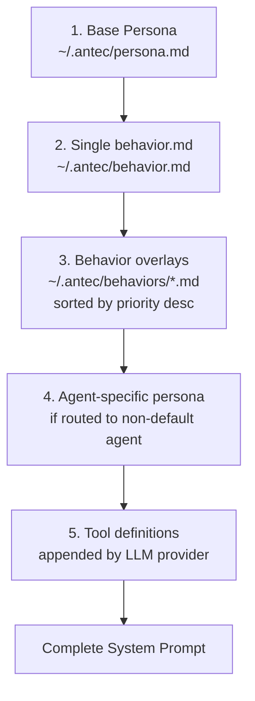
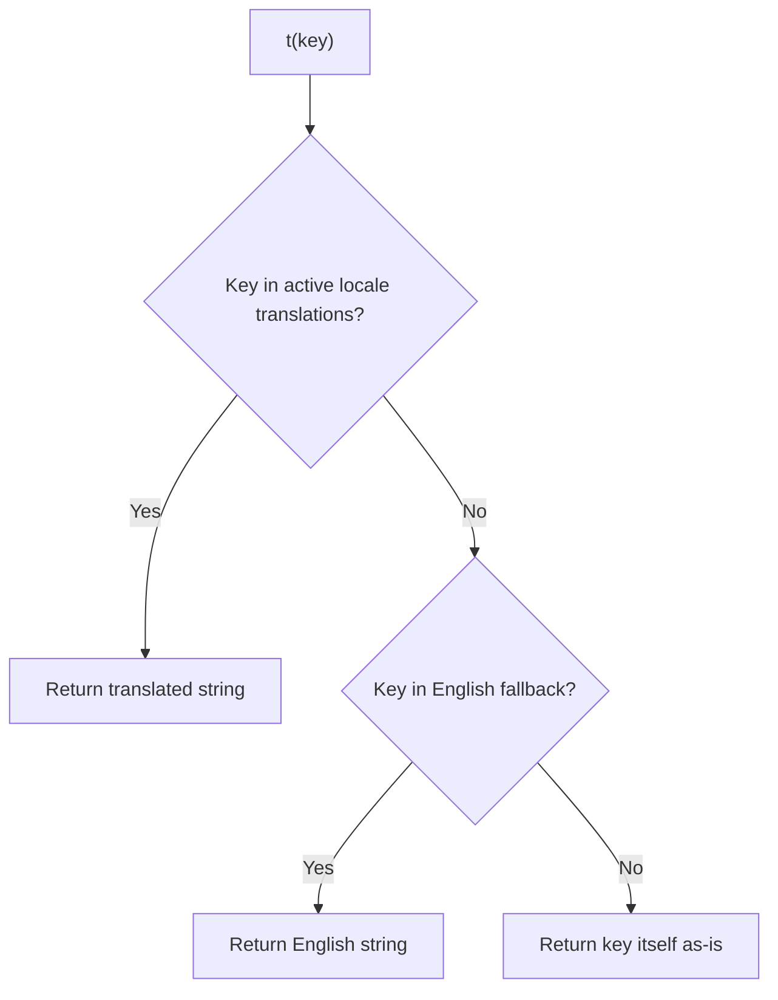

# 13 - Persona, Behavior & Internationalization

> **Module Goal:** Enable deep personality customization and multilingual support — through layered prompt composition, priority-based behavior overlays, and compile-time bilingual translations (EN/PL) — so Antec feels personal, not generic.

### Why This Module Exists

A personal AI assistant should feel personal. Generic AI responses feel robotic and impersonal. The Persona module lets users define their assistant's personality, communication style, and behavioral traits through a layered system that composes the final system prompt from multiple sources.

Behavior overlays allow temporary or context-specific personality adjustments (formal mode for work, casual for personal), while the i18n engine ensures all system messages display in the user's preferred language. Currently supporting English and Polish with compile-time TOML embedding, the system is designed for easy addition of new languages.

### Business Benefits

| Benefit | Description |
|---------|-------------|
| **Personal feel** | Customizable personality makes the AI feel like YOUR assistant, not a generic chatbot |
| **Behavior overlays** | Context-specific adjustments (formal, creative, technical) without changing base persona |
| **Priority system** | Overlays stack with priorities — fine-grained control over behavioral composition |
| **Bilingual support** | Full EN/PL translations for all system messages — native language experience |
| **Compile-time i18n** | Translations embedded at build time — no runtime file loading or missing key risks |
| **4KB limit** | Overlay size cap prevents context window bloat from excessive personality instructions |

> **Crate**: `antec-core` (`crates/antec-core/src/behaviors.rs`) -- behavior file management
> **Crate**: `antec-i18n` (`crates/antec-i18n/`) -- compile-time locale engine
> **Gateway**: `antec-gateway` -- persona, behavior, and locale API routes
> **Purpose**: System prompt composition from persona files, behavior overlays, and agent-specific personas. Bilingual EN/PL internationalization for all user-facing strings.

---

## 1. Persona System

The persona defines the AI's identity and is injected as the first component of every system prompt. It is stored as a plain Markdown file on disk and editable via the API.

### Storage

- **Path**: `~/.antec/persona.md` (resolved via `config.agent.resolve_persona_path()`)
- **Format**: Plain Markdown text, no frontmatter
- **Loading**: Read from disk at startup and on each new session
- **Size**: No enforced limit (the persona contributes to the context window token budget)

### Prompt Composition Order

The system prompt sent to the LLM is assembled in the following strict order:



1. **Base persona** -- Contents of `~/.antec/persona.md`. Defines the core identity.
2. **Single behavior file** -- Contents of `~/.antec/behavior.md` (if it exists). Highest-priority behavioral rules.
3. **Behavior overlays** -- All `*.md` files from `~/.antec/behaviors/`, sorted by priority (descending), concatenated with `\n\n` separators.
4. **Agent-specific persona** -- When a message is routed to a non-default agent, that agent's `persona` field replaces or augments the base persona.
5. **Tool definitions** -- Appended automatically by the LLM provider layer when building the `LlmRequest`.

### First-Run Default

If no `persona.md` exists at startup, a default persona is provided:

```text
You are Antec, a helpful personal AI assistant. You are knowledgeable,
concise, and friendly. You help with everyday tasks, answer questions,
and coordinate with specialized agents when deeper expertise is needed.
```

### First-Run Presets and Setup Wizard

On first run, the setup wizard offers persona selection from a set of built-in presets (professional, casual, technical, minimal). The selected preset is written to `~/.antec/persona.md`. Users can skip preset selection to use the default.

### Active Session Reload

- Persona changes via the API apply to **new sessions** immediately.
- Existing sessions continue with their current persona until a new message arrives.
- The `reload_sessions` flag on the persona update API forces an immediate reload of the persona for all active sessions.

### Persona API

#### PUT /api/v1/config/persona

Update the persona file and optionally reload active sessions.

**Request**:
```json
{
  "system_prompt": "You are a specialized coding assistant...",
  "temperature": 0.5,
  "reload_sessions": true
}
```

**Behavior**:
1. Resolve persona file path from config.
2. Create parent directory if needed.
3. Write new content to the persona file.
4. Optionally update temperature in the runtime config.
5. If `reload_sessions` is true, iterate all active sessions and call `agent.set_persona(new_content)`.

**Response**: `200 OK`
```json
{
  "updated": true,
  "temperature": 0.5,
  "sessions_reloaded": true
}
```

---

## 2. Behavior Overlay System

Behaviors are supplementary rules appended to the system prompt after the persona. They allow fine-grained control over the AI's behavior without modifying the core persona.

### Filesystem Layout

```
~/.antec/
  behavior.md           # Single main behavior file (optional)
  behaviors/            # Directory of named behavior overlays
    coding-style.md
    safety-rules.md
    custom.md
```

### Behavior File Format

Each behavior file is a Markdown file with an optional YAML frontmatter block specifying priority:

```markdown
---
priority: 10
---
Always respond in a concise, professional tone.
Never include disclaimers or caveats unless safety-critical.
```

- If no frontmatter is present, the default priority is `0`.
- Priority is an `i32` (negative values are valid and sort lower).
- Only the `priority` key is recognized in frontmatter. Other YAML keys are silently ignored.
- Malformed frontmatter (no closing `---`) causes the entire file to be treated as content with priority 0.

### Constants

```rust
pub const MAX_BEHAVIOR_SIZE: usize = 4096;  // 4KB per file
```

- The single `behavior.md` is **truncated on load** if oversized (with a warning log).
- Directory behaviors are loaded as-is on read, but the save endpoint enforces the limit.
- Exact limit (4096 bytes) is accepted.

### BehaviorFile Struct

```rust
#[derive(Debug, Clone, Serialize, Deserialize)]
pub struct BehaviorFile {
    pub name: String,      // filename stem (e.g., "safety-rules")
    pub content: String,   // body text after frontmatter extraction
    pub priority: i32,     // from frontmatter, default 0
}
```

### BehaviorManager

```rust
pub struct BehaviorManager {
    behaviors_dir: PathBuf,
    behavior_file: Option<PathBuf>,
}
```

#### Methods

| Method                                          | Description                                                                |
|-------------------------------------------------|----------------------------------------------------------------------------|
| `new(behaviors_dir: PathBuf) -> Self`           | Create manager pointing at the behaviors directory                         |
| `with_behavior_file(path: PathBuf) -> Self`     | Set the path to the single `behavior.md` file                              |
| `load_behavior_file() -> Result<Option<String>>` | Load the single `behavior.md` content. Truncates to `MAX_BEHAVIOR_SIZE` if oversized. Returns `None` if file does not exist |
| `save_behavior_file(content: &str) -> Result<()>` | Validate `MAX_BEHAVIOR_SIZE` limit and write. Returns error if no path configured or content exceeds limit |
| `load_all() -> Result<Vec<BehaviorFile>>`       | Load all `*.md` files from the behaviors directory. Parses frontmatter for priority. Non-`.md` files are ignored. Returns empty vec if directory does not exist |
| `get(name: &str) -> Result<Option<BehaviorFile>>` | Load a single behavior by name (looks for `{name}.md` in the directory)  |
| `save(name: &str, content: &str, priority: i32) -> Result<()>` | Write a behavior file with YAML frontmatter. Creates the directory if needed. Enforces `MAX_BEHAVIOR_SIZE` |
| `delete(name: &str) -> Result<bool>`            | Delete a behavior file. Returns `true` if the file existed                 |
| `list() -> Result<Vec<String>>`                 | Return all behavior file names (without `.md` extension)                   |
| `combined_prompt() -> Result<String>`           | Build the full behavior prompt: single `behavior.md` first, then directory behaviors sorted by priority (descending), joined with `\n\n` |

#### Frontmatter Parsing

```rust
fn parse_frontmatter(raw: &str) -> (i32, String) {
    // Looks for opening "---" at start of file
    // Finds closing "\n---"
    // Extracts "priority: <int>" from the frontmatter block
    // Returns (priority, content_after_frontmatter)
    // If no frontmatter: returns (0, full_content)
}
```

### Behavior API

| Method   | Route                          | Description                                    |
|----------|--------------------------------|------------------------------------------------|
| `GET`    | `/api/v1/behavior`             | Get the single `behavior.md` content           |
| `PUT`    | `/api/v1/behavior`             | Save the single `behavior.md` content          |
| `GET`    | `/api/v1/behaviors`            | List all behavior overlay files with content and priority |
| `GET`    | `/api/v1/behaviors/{name}`     | Get a specific behavior by name                |
| `PUT`    | `/api/v1/behaviors/{name}`     | Create or update a named behavior with priority |
| `DELETE` | `/api/v1/behaviors/{name}`     | Delete a named behavior                        |

#### GET /api/v1/behavior

**Response**: `200 OK`
```json
{
  "content": "Be concise and professional."
}
```

#### PUT /api/v1/behavior

**Request**:
```json
{
  "content": "New behavior rules here."
}
```

Returns `413 Payload Too Large` if content exceeds `MAX_BEHAVIOR_SIZE`.

#### PUT /api/v1/behaviors/{name}

**Request**:
```json
{
  "content": "Always use British English spelling.",
  "priority": 5
}
```

Returns `413 Payload Too Large` if content exceeds `MAX_BEHAVIOR_SIZE`.

**Response**: `200 OK`
```json
{
  "name": "spelling",
  "content": "Always use British English spelling.",
  "priority": 5
}
```

#### GET /api/v1/behaviors

**Response**: `200 OK`
```json
[
  {
    "name": "safety-rules",
    "content": "Never provide instructions for harmful activities.",
    "priority": 10
  },
  {
    "name": "coding-style",
    "content": "Use Rust idioms. Prefer iterators over loops.",
    "priority": 5
  }
]
```

---

## 3. Internationalization (i18n)

Antec is fully bilingual with English and Polish locale support. All user-facing strings are translated and loaded at compile time.

### Supported Locales

| Code | Language | Status |
|------|----------|--------|
| `en` | English  | Complete (primary) |
| `pl` | Polish   | Complete parity with English |

Both locales have identical key sets -- this is enforced by tests. Missing keys in PL fall back to EN.

### I18n Struct

```rust
pub struct I18n {
    locale: String,
    translations: HashMap<String, String>,  // active locale
    fallback: HashMap<String, String>,      // English fallback
}
```

### Methods

| Method                              | Description                                                              |
|-------------------------------------|--------------------------------------------------------------------------|
| `new(locale: &str) -> Self`        | Create instance. Falls back to `"en"` if locale is unsupported           |
| `t(key: &str) -> &str`             | Translate a dot-notation key. Lookup order: active locale -> EN fallback -> return key itself |
| `locale() -> &str`                  | Return current locale identifier                                         |
| `all_translations() -> &HashMap<String, String>` | Return the full translation map for the active locale      |
| `supported_locales() -> &[&str]`   | Return `&["en", "pl"]`                                                   |

### i18n Fallback Chain



Example:
```
t("system.ready")
  1. Check translations["system.ready"]  -> "Gotowy." (if PL)
  2. Check fallback["system.ready"]      -> "Ready." (EN)
  3. Return "system.ready" (key itself)
```

### Locale Files

Locales are TOML files embedded at compile time via `include_str!`:

- `crates/antec-i18n/src/locales/en.toml`
- `crates/antec-i18n/src/locales/pl.toml`

### TOML-to-Key Flattening

TOML tables are flattened to dot-notation keys recursively:

```toml
[system]
ready = "Ready."
starting = "Starting Antec..."
```

Becomes:
- `"system.ready"` -> `"Ready."`
- `"system.starting"` -> `"Starting Antec..."`

Nested tables produce multi-level dot paths (e.g., `[memory.category]` -> `memory.category.*`).

### Translation Key Categories

| Category | Example Keys | Description |
|----------|-------------|-------------|
| `system.*` | `ready`, `starting`, `shutting_down`, `processing`, `error` | Core system status messages |
| `chat.*` | `session_created`, `message_sent`, `new_session`, `placeholder`, `no_session` | Chat session messages |
| `memory.*` | `stored`, `recalled`, `deleted`, `search_empty`, `search_placeholder`, `key`, `content`, `tags_placeholder`, `no_category`, `archived_memories`, `category_*`, `sort_*`, `export`, `import`, `stats`, `total_memories`, `avg_importance`, `decay_sweep` | Memory system messages and UI labels |
| `auth.*` | `pairing_code`, `authenticated`, `unauthorized`, `session_expired`, `token_revoked` | Authentication messages |
| `tools.*` | `executing`, `blocked`, `approved`, `denied`, `unknown`, `timeout` | Tool execution messages |
| `security.*` | `injection_detected`, `rate_limited`, `secret_redacted`, `audit_signed` | Security system messages |
| `console.*` | `chat`, `sessions`, `workspace`, `memory`, `audit`, `persona`, `settings`, `scheduler`, `skills`, `tools`, `mcp`, `secrets`, `behavior`, `repl`, `agents`, `parallel`, `help`, `about`, `agent_config`, `system_prompt`, `temperature`, `max_tool_calls`, `max_context`, `compaction`, `streaming`, `models`, `language`, `environment`, `channels`, `statistics`, `command_palette`, `diagnostics` | Console page names and setting labels |
| `pairing.*` | `description`, `pair` | Pairing screen |
| `nav.*` | `chat`, `control`, `agent`, `settings`, `channels_status` | Navigation bar labels |
| `context.*` | `phase`, `tools_running`, `memory_used`, `approvals`, `idle`, `none`, `model` | Context panel labels |
| `actions.*` | `save`, `cancel`, `delete`, `edit`, `add`, `create`, `close`, `confirm`, `saved`, `export_data`, `import_data`, `enable`, `disable`, `refresh`, `loading`, `saving`, `executing`, `running`, `no_changes`, `set_as_default` | Common action buttons and states |
| `scheduler.*` | `title`, `create_job`, `name`, `cron_expression`, `prompt`, `action_type`, `enabled`, `disabled`, `next_run`, `last_run`, `run_count`, `run_now`, `heartbeat`, `interval`, `no_jobs`, `schedule_placeholder`, `prompt_placeholder`, `job_name` | Scheduler page |
| `skills.*` | `active`, `available`, `detail`, `import_skill`, `create_skill`, `preview`, `title`, `installed`, `no_skills`, `version`, `source`, `capabilities`, `mcp_servers`, `no_mcp`, `add_server`, `remove_server`, `url_label`, `name_label`, `description`, `markdown_label` | Skills page |
| `mcp.*` | `server_config`, `add_server`, `name`, `transport`, `command`, `url`, `paste_json`, `test`, `testing`, `test_ok`, `test_fail`, `local`, `remote` | MCP server configuration |
| `agents.*` | `title`, `create`, `no_agents`, `name`, `description_label`, `persona_label`, `tools_label`, `skills_label`, `model_label`, `provider_label`, `default_badge`, `enabled`, `disabled` | Agent management page |
| `parallel.*` | `title`, `start`, `no_executions`, `status`, `tasks_label`, `merged_output`, `tokens_used`, `max_concurrent`, `merge_strategy`, `strategy_concatenate`, `strategy_summarize`, `strategy_vote`, `cancel`, `cancelled`, `timed_out`, `completed` | Parallel execution page |
| `command_palette.*` | `placeholder` | Command palette |
| `persona.*` | `prompt_placeholder`, `error_saving`, `persona_file`, `persona_reloaded`, `multiple_files` | Persona management page |
| `behavior.*` | `title`, `description`, `placeholder`, `saved`, `error`, `too_large` | Behavior management page |
| `workspace.*` | `files`, `save`, `versions`, `version_history`, `saved`, `reverted`, `no_file_selected` | Workspace/editor page |
| `repl.*` | `placeholder`, `run`, `history`, `session`, `cleared`, `js`, `python` | REPL page |
| `statistics.*` | `title`, `usage`, `cost`, `sessions`, `by_provider`, `by_model`, `by_day`, `total_calls`, `total_tokens`, `est_cost`, `no_data`, `export_csv`, `days`, `today`, `days_7`, `days_30`, `days_90`, `all_time`, `uptime`, `memory_usage`, `disk_used`, `budget`, `monthly_budget`, `cost_over_time`, `messages_by_channel`, `top_tools`, `routing_mode`, `simple_routed`, `complex_routed`, `est_savings`, `env_vars` | Statistics page |
| `approvals.*` | `history`, `no_history`, `approved`, `denied`, `pending`, `timed_out`, `scope_once`, `scope_session`, `scope_always` | Approval system |
| `audit.*` | `filter_placeholder`, `all_actors`, `all_actions`, `all_risk`, `verify_chain`, `verifying`, `chain_intact`, `chain_broken`, `verify_failed`, `no_entries` | Audit log page |
| `models.*` | `load_failed`, `active_config`, `default_provider`, `default_model`, `model_routing`, `providers` | Models configuration page |
| `data.*` | `purge`, `export`, `storage_info`, `messages_deleted`, `memories_deleted`, `retention`, `retention_days`, `export_complete`, `save_config`, `save_retention`, `delete_all`, `row_counts`, `no_sessions`, `no_tools`, `no_mcp_servers` | Data management page |
| `health.*` | `normal`, `degraded`, `degraded_entered`, `degraded_recovered`, `live`, `ready`, `not_ready`, `crash_guard`, `failure_count`, `probe_interval` | Health monitoring |
| `channels.*` | `connected`, `connecting`, `disconnected`, `approval_pending`, `status_tab` | Channel status |
| `cli.*` | `skill_not_found`, `no_memories`, `no_cron_jobs`, `exported`, `imported` | CLI output messages |
| `help.*` | `title` | Help page |
| `about.*` | `title` | About page |

### Web Console Integration

The web console uses `data-i18n` attributes on DOM elements for automatic text replacement:

```html
<span data-i18n="nav.chat">CHAT</span>
<button data-i18n="actions.save">SAVE</button>
```

At page load, the console fetches all translations via `GET /api/v1/locale` and replaces the `textContent` of all elements with `data-i18n` attributes. This happens in the i18n module of the frontend JavaScript.

### Locale API

#### GET /api/v1/locale

Return all translations for the current (or requested) locale.

**Query Parameters**: `?lang=pl` (optional, defaults to server's active locale)

**Response**: `200 OK`
```json
{
  "locale": "pl",
  "translations": {
    "system.ready": "Gotowy.",
    "system.starting": "Uruchamianie Antec...",
    "chat.session_created": "Sesja utworzona.",
    "nav.chat": "CZAT",
    "nav.control": "KONTROLA"
  }
}
```

#### PUT /api/v1/locale

Switch the active locale. Persists the change to the config file.

**Request**:
```json
{
  "language": "pl"
}
```

**Validation**: Returns `400 Bad Request` if the locale is not in `supported_locales()`.

**Response**: `200 OK`
```json
{
  "locale": "pl",
  "translations": { ... }
}
```

### LocaleResponse Struct

```rust
#[derive(Debug, Serialize)]
pub struct LocaleResponse {
    pub locale: String,
    pub translations: HashMap<String, String>,
}
```

---

## 4. Test Coverage

### Behavior Tests

- Frontmatter parsing with priority, missing frontmatter defaults to 0, negative priority
- Load from empty/nonexistent directory returns empty vec
- Load filters `.md` files only
- `combined_prompt()` sorts by priority descending
- Save and reload round-trip preserves name, content, priority
- Delete returns true/false correctly
- Single `behavior.md` load, save, truncation on oversized load
- Save validation rejects content exceeding `MAX_BEHAVIOR_SIZE`
- Exact limit (4096 bytes) accepted
- `combined_prompt()` includes single file first, then directory behaviors
- Hot-apply: save then `combined_prompt()` reflects changes immediately

### I18n Tests

- English and Polish locales load correctly
- Polish falls back to English for missing keys
- Missing key returns the key itself
- Unsupported locale (`"fr"`) falls back to `"en"`
- `all_translations()` contains expected keys across all categories
- `supported_locales()` returns `["en", "pl"]`
- Dot-notation resolves nested TOML sections
- EN/PL key parity: every key in EN exists in PL and vice versa
- Specific key value assertions for pairing, nav, context, chat, memory, audit, statistics, MCP, persona, command palette, skills, actions, channels, and behavior categories
