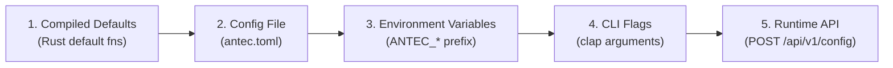
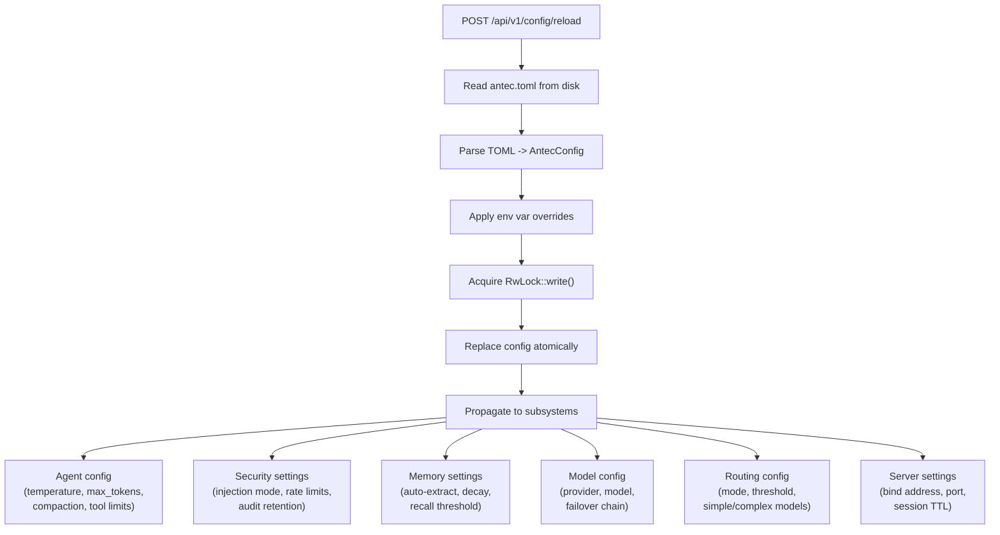
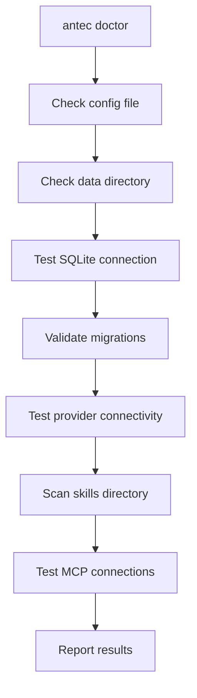
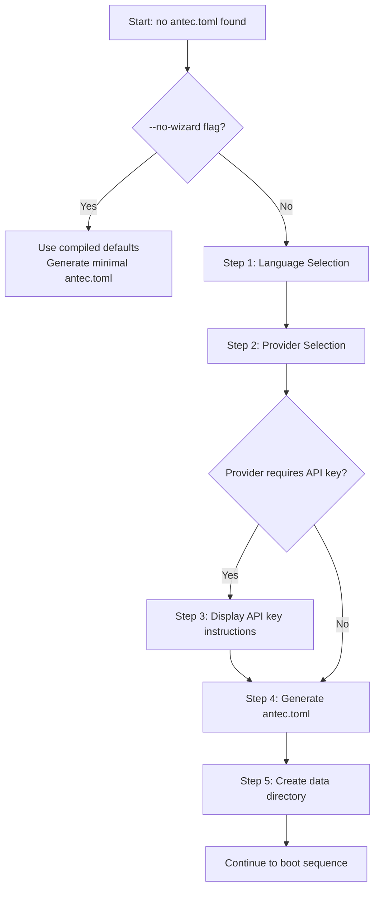

# 14 -- Configuration & CLI

> **Module Goal:** Provide a flexible, layered configuration system — from TOML files through environment variables to runtime API — with a comprehensive CLI for management and a first-run setup wizard for frictionless onboarding.

### Why This Module Exists

A self-hosted system needs flexible configuration that works for both first-time users and power users. First-time users need a guided setup wizard. Power users need TOML files for version control. Operators need environment variables for container deployments. And everyone needs runtime reconfiguration without restarts.

The Configuration module provides 5 layers of precedence (defaults → antec.toml → env vars → CLI flags → runtime API), ensuring every deployment scenario is covered. Hot reload for key settings means model switches and rate limit changes take effect immediately. The CLI provides complete system management through subcommands.

### Business Benefits

| Benefit | Description |
|---------|-------------|
| **5-layer precedence** | Defaults → TOML → env vars → CLI → API — every deployment scenario covered |
| **Hot reload** | Change models, rate limits, and settings without restarting the server |
| **Setup wizard** | Interactive first-run wizard guides new users through initial configuration |
| **CLI management** | Complete system control via command-line subcommands |
| **Container-ready** | Environment variable overrides enable 12-factor app deployment |
| **Human-readable** | TOML format is easy to read, edit, and version control |

> **Crate**: `antec-core` (`crates/antec-core/src/config.rs`) for config structs, `src/main.rs` for CLI
> **Purpose**: Layered configuration system, TOML config file schema, environment variable overrides, CLI interface, hot-reload API, and first-run setup wizard.

---

## 1. Configuration Layers (Precedence Order)

Configuration values are resolved in order of increasing precedence. Later sources override earlier ones for any field they define.



| Layer | Source | Scope | Persistence |
|-------|--------|-------|-------------|
| **1. Compiled defaults** | `default_*()` functions in `config.rs` | Every field has a sensible default | Always present, immutable |
| **2. Config file** | `~/.antec/antec.toml` (TOML format) | All configuration sections | On-disk, survives restart |
| **3. Environment variables** | `ANTEC_{SECTION}_{FIELD}` pattern | Any field addressable by section + field | Shell-session scoped |
| **4. CLI flags** | `clap` parsed arguments | Subset of fields (`--config`, `--port`, `--no-wizard`) | Process-lifetime only |
| **5. Runtime API** | `PUT /api/v1/config` endpoint | Hot-reloadable fields only | Ephemeral by default; `persist=true` writes to TOML |

Runtime API changes are **ephemeral** (lost on restart) unless the caller includes `?persist=true`, which triggers a write-back to `antec.toml`.

### Configuration Storage in Memory

```rust
pub config: Arc<RwLock<AntecConfig>>
```

All handlers and background tasks share a reference-counted, read-write locked configuration. Hot-reload replaces the inner value atomically via `RwLock::write()`.

---

## 2. Config File Schema (antec.toml)

### Location

| Priority | Path | Override Method |
|----------|------|----------------|
| Default | `~/.antec/antec.toml` | -- |
| CLI flag | any path | `--config /path/to/antec.toml` |
| Env var | any path | `ANTEC_CONFIG=/path/to/antec.toml` |

The file is TOML format (human-editable). If it does not exist on first run, the setup wizard creates it (see section 6).

### Top-Level Structure

```rust
pub struct AntecConfig {
    pub general: GeneralConfig,
    pub server: ServerConfig,
    pub agent: AgentConfig,
    pub models: ModelsConfig,
    pub security: SecurityConfig,
    pub memory: MemoryConfig,
    pub web: WebConfig,
    pub scheduler: SchedulerConfig,
    pub channels: ChannelsConfig,
    pub skills: SkillsConfig,
    pub sandbox: SandboxConfig,
    pub mcp: McpConfig,
    pub browser: BrowserConfig,
    pub crash_guard: CrashGuardConfig,
    pub data_retention: DataRetentionConfig,
    pub budget: BudgetConfig,
    pub agents: Vec<AgentDefinitionConfig>,
}
```

All sections derive `Default`, so every field is optional in the TOML file.

---

### 2.1 `[general]`

```toml
[general]
language = "en"              # UI language: "en" or "pl"
data_dir = "~/.antec"        # Root directory for all Antec data
workspace_dir = "~/.antec/workspace"  # File editor workspace root
log_level = "info"           # Tracing level: trace, debug, info, warn, error
```

| Field | Type | Default | Description |
|-------|------|---------|-------------|
| `language` | String | `"en"` | UI and system message language. Supported: `en`, `pl` |
| `data_dir` | String | `"~/.antec"` | Root directory for database, skills, personas, behaviors |
| `workspace_dir` | String | `"~/.antec/workspace"` | Jailed workspace for file tools |
| `log_level` | String | `"info"` | Tracing subscriber filter level |

### 2.2 `[server]`

```toml
[server]
bind_address = "127.0.0.1"
bind_port = 8088
```

| Field | Type | Default | Description |
|-------|------|---------|-------------|
| `bind_address` | String | `"127.0.0.1"` | Network interface to bind. Use `0.0.0.0` for all interfaces |
| `bind_port` | u16 | `8088` | TCP port for HTTP/WS server |

### 2.3 `[agent]`

```toml
[agent]
system_prompt_file = "~/.antec/persona.md"
persona_files = []
max_context_tokens = 128000
compaction_threshold = 0.75
max_tool_calls = 20
temperature = 0.7
stream_responses = true
max_tokens = 4096
compaction_model = "claude-haiku-4-5-20251001"
compaction_provider = "anthropic"
```

| Field | Type | Default | Description |
|-------|------|---------|-------------|
| `system_prompt_file` | String | `"~/.antec/persona.md"` | Path to the primary persona/system prompt file |
| `persona_files` | Vec\<String\> | `[]` | Additional persona files merged into the system prompt |
| `max_context_tokens` | usize | `128000` | Maximum token budget for context window |
| `compaction_threshold` | f64 | `0.75` | Context usage ratio (0.0-1.0) that triggers compaction |
| `max_tool_calls` | usize | `20` | Maximum tool call iterations per agent loop (prevents infinite loops) |
| `temperature` | f64 | `0.7` | LLM sampling temperature |
| `stream_responses` | bool | `true` | Whether to stream LLM responses to clients |
| `max_tokens` | Option\<u32\> | None | Maximum response tokens. If unset, uses provider default |
| `compaction_model` | Option\<String\> | None | Fast model for L2 compaction summarization |
| `compaction_provider` | Option\<String\> | None | Provider for compaction model. L2 skipped if unset |

### 2.4 `[models]`

```toml
[models]
default_provider = "anthropic"
default_model = "claude-sonnet-4-6"
default_instance = "my-instance"

[models.providers.anthropic]
api_key_env = "ANTHROPIC_API_KEY"
base_url = "https://api.anthropic.com"
cost_per_1k_input = 0.003
cost_per_1k_output = 0.015

[models.providers.openai]
api_key_env = "OPENAI_API_KEY"
base_url = "https://api.openai.com/v1"

[models.providers.google]
api_key_env = "GOOGLE_API_KEY"
base_url = "https://generativelanguage.googleapis.com/v1beta/openai"

[models.providers.ollama]
base_url = "http://127.0.0.1:11434"

[models.failover]
failover_providers = ["openai", "ollama"]
max_retries = 2
retry_delay_ms = 1000
cooldown_secs = 60
circuit_breaker_threshold = 3

[models.routing]
enabled = false
mode = "auto"
simple_instance = "fast"
complex_instance = "smart"
complexity_threshold = 0.5
```

#### Provider Config

```rust
pub struct ProviderConfig {
    pub api_key_env: Option<String>,    // Env var name holding the API key
    pub base_url: Option<String>,       // Override default API endpoint
    pub cost_per_1k_input: Option<f64>, // USD per 1K input tokens (for statistics)
    pub cost_per_1k_output: Option<f64>,// USD per 1K output tokens
}
```

API key resolution priority per provider:
1. Encrypted vault (`SecretVault` via `CredentialStore.get_secret()`)
2. Custom env var from `api_key_env` config field
3. Default env var (`ANTHROPIC_API_KEY`, `OPENAI_API_KEY`, `GOOGLE_API_KEY`)

#### Failover Config

| Field | Type | Default | Description |
|-------|------|---------|-------------|
| `failover_providers` | Vec\<String\> | `[]` | Ordered list of fallback provider names |
| `max_retries` | u32 | `2` | Maximum retry attempts across all providers |
| `retry_delay_ms` | u64 | `1000` | Delay between retry attempts |
| `cooldown_secs` | u64 | `60` | Circuit breaker cooldown before retrying failed provider |
| `circuit_breaker_threshold` | u32 | `3` | Consecutive failures before circuit opens |

#### Routing Config

| Field | Type | Default | Description |
|-------|------|---------|-------------|
| `enabled` | bool | `false` | Enable heuristic model routing |
| `mode` | String | `"auto"` | `auto`, `always_default`, or `always_complex` |
| `simple_instance` | Option\<String\> | None | Model instance for simple queries |
| `complex_instance` | Option\<String\> | None | Model instance for complex queries |
| `simple_provider` | Option\<String\> | None | Legacy: provider name for simple queries |
| `simple_model` | Option\<String\> | None | Legacy: model name for simple queries |
| `complex_provider` | Option\<String\> | None | Legacy: provider name for complex queries |
| `complex_model` | Option\<String\> | None | Legacy: model name for complex queries |
| `complexity_threshold` | f64 | `0.5` | Score threshold: below = simple, above = complex |

### 2.5 `[security]`

```toml
[security]
require_pairing = true
sandbox_mode = "auto"
max_tool_calls_per_minute = 60
audit_enabled = true
session_token_ttl_hours = 720
injection_mode = "flag"
rate_limit_burst = 10
audit_hmac_key = ""
secret_redaction_enabled = true
injection_patterns = []
audit_retention_days = 30
```

| Field | Type | Default | Description |
|-------|------|---------|-------------|
| `require_pairing` | bool | `true` | Whether OTP pairing is required for first connection |
| `sandbox_mode` | String | `"auto"` | WASM sandbox mode: `auto`, `always`, `never` |
| `max_tool_calls_per_minute` | u32 | `60` | Global GCRA rate limit for tool calls |
| `audit_enabled` | bool | `true` | Whether audit logging is active |
| `session_token_ttl_hours` | i64 | `720` | Session token lifetime (30 days) |
| `injection_mode` | String | `"flag"` | Injection detection behavior: `flag`, `block`, `disabled` |
| `rate_limit_burst` | u32 | `10` | GCRA burst allowance |
| `audit_hmac_key` | String | `""` | HMAC key for audit chain integrity. Empty = no signing |
| `secret_redaction_enabled` | bool | `true` | Auto-redact secrets in LLM outputs |
| `injection_patterns` | Vec\<String\> | `[]` | Extra injection patterns merged with built-in defaults |
| `audit_retention_days` | u32 | `30` | Days to retain audit entries (0 = forever) |

### 2.6 `[memory]`

```toml
[memory]
auto_compact = true
long_term_enabled = true
semantic_search = true
temporal_decay = true
decay_half_life_days = 30
recall_threshold = 0.3
recall_max_results = 5
auto_extract_enabled = true
auto_extract_min_messages = 5
archive_threshold = 0.05
delete_archived_after_days = 90
```

| Field | Type | Default | Description |
|-------|------|---------|-------------|
| `auto_compact` | bool | `true` | Auto-compact context when threshold exceeded |
| `long_term_enabled` | bool | `true` | Enable long-term memory storage |
| `semantic_search` | bool | `true` | Enable embedding-based semantic search |
| `temporal_decay` | bool | `true` | Enable time-based memory decay |
| `decay_half_life_days` | u32 | `30` | Half-life for exponential decay |
| `recall_threshold` | f64 | `0.3` | Minimum relevance score for recall results |
| `recall_max_results` | usize | `5` | Maximum memories returned per recall |
| `auto_extract_enabled` | bool | `true` | Auto-extract memories from conversations |
| `auto_extract_min_messages` | usize | `5` | Minimum messages before extraction triggers |
| `archive_threshold` | f64 | `0.05` | Effective importance below this triggers archival |
| `delete_archived_after_days` | u32 | `90` | Days after archival before permanent deletion (0 = never) |

### 2.7 `[web]`

```toml
[web]
search_provider = "ddg"
tavily_api_key = "..."
google_api_key = "..."
google_cx = "..."
searxng_url = "http://localhost:8080"
```

| Field | Type | Default | Description |
|-------|------|---------|-------------|
| `search_provider` | SearchProvider | `ddg` | Web search backend: `ddg`, `tavily`, `searxng`, `google_custom_search` |
| `tavily_api_key` | Option\<String\> | None | Tavily API key |
| `google_api_key` | Option\<String\> | None | Google Custom Search API key |
| `google_cx` | Option\<String\> | None | Google Custom Search engine ID |
| `searxng_url` | Option\<String\> | None | SearXNG instance URL |

### 2.8 `[scheduler]`

```toml
[scheduler]
enabled = true
heartbeat_enabled = false
heartbeat_interval = "2h"
heartbeat_prompt = "Check on me"
```

| Field | Type | Default | Description |
|-------|------|---------|-------------|
| `enabled` | bool | `true` | Enable the cron scheduler |
| `heartbeat_enabled` | bool | `false` | Enable periodic heartbeat job |
| `heartbeat_interval` | String | `"2h"` | Natural language interval for heartbeat |
| `heartbeat_prompt` | String | `""` | Message sent on heartbeat trigger |

### 2.9 `[channels]`

```toml
[channels]
merge_cross_channel = false

[channels.discord]
enabled = false
token_env = "DISCORD_BOT_TOKEN"
allowed_servers = []
allowed_channels = []
gateway_intents = ["GUILD_MESSAGES", "MESSAGE_CONTENT", "DIRECT_MESSAGES"]
reconnect_max_retries = 5
reconnect_base_delay_secs = 5

[channels.whatsapp]
enabled = false
bridge_url = ""
allowed_contacts = []
token_env = "WHATSAPP_API_TOKEN"
voice_transcription = false

[channels.imessage]
enabled = false
poll_interval_secs = 5
```

### 2.10 `[skills]`

```toml
[skills]
skills_dir = "~/.antec/skills"
hub_enabled = false
hub_url = "https://raw.githubusercontent.com/antec-hub/catalog/main/catalog.json"
```

| Field | Type | Default | Description |
|-------|------|---------|-------------|
| `skills_dir` | String | `"~/.antec/skills"` | Directory for installed skills |
| `hub_enabled` | bool | `false` | Enable skill hub connectivity |
| `hub_url` | String | (GitHub URL) | Catalog JSON URL for skill hub |

### 2.11 `[sandbox]`

```toml
[sandbox]
fuel_limit = 1000000
epoch_timeout_ms = 5000
memory_limit_bytes = 16777216
os_cpu_time_secs = 30
os_memory_bytes = 52428800
os_max_processes = 10
```

| Field | Type | Default | Description |
|-------|------|---------|-------------|
| `fuel_limit` | u64 | `1_000_000` | Max WASM fuel (instruction count) per invocation |
| `epoch_timeout_ms` | u64 | `5000` | Max wall-clock time for WASM execution |
| `memory_limit_bytes` | usize | `16 MB` | Max linear memory for WASM modules |
| `os_cpu_time_secs` | u32 | `30` | CPU time limit per shell execution (RLIMIT_CPU) |
| `os_memory_bytes` | u64 | `50 MB` | Virtual memory limit per shell execution |
| `os_max_processes` | u32 | `10` | Max child processes per shell execution |

### 2.12 `[browser]`

```toml
[browser]
enabled = false
chrome_path = "/usr/bin/chromium"
headless = true
timeout_ms = 30000
idle_timeout_secs = 60
```

| Field | Type | Default | Description |
|-------|------|---------|-------------|
| `enabled` | bool | `false` | Enable browser automation tool |
| `chrome_path` | Option\<String\> | None | Chrome/Chromium binary path (auto-detected if None) |
| `headless` | bool | `true` | Run browser in headless mode |
| `timeout_ms` | u64 | `30000` | Timeout per browser operation |
| `idle_timeout_secs` | u64 | `60` | Seconds before idle browser session is killed |

### 2.13 `[data_retention]`

```toml
[data_retention]
message_retention_days = 0
memory_retention_days = 0
```

| Field | Type | Default | Description |
|-------|------|---------|-------------|
| `message_retention_days` | u32 | `0` | Days to retain messages (0 = forever) |
| `memory_retention_days` | u32 | `0` | Days to retain memories (0 = forever) |

### 2.14 `[budget]`

```toml
[budget]
monthly_limit_usd = 0.0
warn_on_overage = true
```

| Field | Type | Default | Description |
|-------|------|---------|-------------|
| `monthly_limit_usd` | f64 | `0.0` | Monthly spending limit in USD (0 = no limit) |
| `warn_on_overage` | bool | `true` | Show overage warnings in the Console |

### 2.15 `[mcp]`

```toml
[mcp]
config_file = "~/.antec/mcp.json"

[[mcp.servers]]
name = "figma"
transport = "http"
url = "https://mcp.figma.com/mcp"
enabled = false
```

| Field | Type | Default | Description |
|-------|------|---------|-------------|
| `config_file` | Option\<String\> | None | External mcpServers JSON file path |
| `servers` | Vec\<McpServerConfig\> | `[figma]` | Inline MCP server definitions |

### 2.16 `[[agents]]`

Agent definitions as a TOML array:

```toml
[[agents]]
name = "coder"
description = "Code-focused agent"
persona = "You are a senior software engineer..."
tools = ["file_read", "file_write", "shell_exec"]
skills = ["code-review"]
model = "claude-sonnet-4-6"
provider = "anthropic"
enabled = true
```

---

## 3. Hot Reload

### API Endpoint

```
POST /api/v1/config/reload
```

Re-reads `antec.toml` from disk and replaces the in-memory `AntecConfig` via `Arc<RwLock<AntecConfig>>`. Returns the new configuration as JSON.

### Hot-Reloadable Field Groups



| Group | Fields Reloaded | Effect |
|-------|----------------|--------|
| **Agent** | temperature, max_tokens, compaction_threshold, max_tool_calls, stream_responses | Next LLM request uses new values |
| **Security** | injection_mode, max_tool_calls_per_minute, rate_limit_burst, audit_retention_days | Rate limiter and injection detector reconfigure |
| **Memory** | auto_extract_enabled, decay_half_life_days, recall_threshold, recall_max_results | Next memory operation uses new thresholds |
| **Models** | default_provider, default_model, failover chain | Next LLM request uses new provider/model |
| **Routing** | mode, complexity_threshold, simple/complex instances | Next routing decision uses new config |
| **Budget** | monthly_limit_usd, warn_on_overage | Budget tracking updated |

### Runtime Config Update via API

```
PUT /api/v1/config
Content-Type: application/json

{
    "general": { "language": "pl" },
    "agent": { "temperature": 0.5 }
}
```

Merges the provided partial config into the current in-memory config. Only provided fields are updated; others remain unchanged.

---

## 4. Environment Variable Override

### Pattern

```
ANTEC_{SECTION}_{FIELD}
```

All uppercase, underscores between section and field. Nested sections use additional underscores.

### Examples

| Environment Variable | Config Path | Value Type |
|---------------------|-------------|------------|
| `ANTEC_GENERAL_LANGUAGE` | `general.language` | String |
| `ANTEC_GENERAL_DATA_DIR` | `general.data_dir` | String |
| `ANTEC_GENERAL_LOG_LEVEL` | `general.log_level` | String |
| `ANTEC_SERVER_BIND_ADDRESS` | `server.bind_address` | String |
| `ANTEC_SERVER_BIND_PORT` | `server.bind_port` | u16 |
| `ANTEC_AGENT_TEMPERATURE` | `agent.temperature` | f64 |
| `ANTEC_AGENT_MAX_CONTEXT_TOKENS` | `agent.max_context_tokens` | usize |
| `ANTEC_MODELS_DEFAULT_PROVIDER` | `models.default_provider` | String |
| `ANTEC_MODELS_DEFAULT_MODEL` | `models.default_model` | String |
| `ANTEC_SECURITY_INJECTION_MODE` | `security.injection_mode` | String |
| `ANTEC_SECURITY_SESSION_TOKEN_TTL_HOURS` | `security.session_token_ttl_hours` | i64 |
| `ANTEC_MEMORY_DECAY_HALF_LIFE_DAYS` | `memory.decay_half_life_days` | u32 |

### Application Order

Environment variables are applied **after** TOML parsing and **before** CLI flags. They override file values but are overridden by explicit CLI arguments.

---

## 5. CLI Interface (clap)

### Top-Level

```
antec [OPTIONS] [COMMAND]

Options:
  -c, --config <PATH>    Path to config file (default: ~/.antec/antec.toml)
      --no-wizard        Skip the first-run setup wizard

Commands:
  serve      Start the server (default if no subcommand given)
  chat       Interactive CLI chat mode
  secret     Manage encrypted secrets
  skill      Manage installed skills
  memory     Manage agent memory
  cron       Manage scheduled cron jobs
  export     Export all data as JSON
  doctor     Check system health
  provider   Manage LLM providers
  repl       Interactive code REPL
```

### Command Architecture

```mermaid
graph TD
    CLI["antec"] --> Serve["serve"]
    CLI --> Chat["chat"]
    CLI --> Secret["secret"]
    CLI --> Skill["skill"]
    CLI --> Memory["memory"]
    CLI --> Cron["cron"]
    CLI --> Export["export"]
    CLI --> Doctor["doctor"]
    CLI --> Provider["provider"]
    CLI --> Repl["repl"]

    Secret --> SecSet["set <name> [value]"]
    Secret --> SecGet["get <name>"]
    Secret --> SecList["list"]
    Secret --> SecDel["delete <name>"]

    Skill --> SkList["list"]
    Skill --> SkEnable["enable <name>"]
    Skill --> SkDisable["disable <name>"]
    Skill --> SkImport["import <source>"]
    Skill --> SkCreate["create <name>"]
    Skill --> SkRemove["remove <name>"]
    Skill --> SkShow["show <name>"]
    Skill --> SkEdit["edit <name>"]
    Skill --> SkHub["hub"]
    Skill --> SkNew["new <name>"]
    Skill --> SkBuild["build <name>"]
    Skill --> SkTest["test <name>"]

    SkHub --> HubSearch["search <query>"]
    SkHub --> HubInstall["install <name>"]

    Memory --> MemSearch["search <query>"]
    Memory --> MemExport["export"]
    Memory --> MemImport["import <file>"]

    Cron --> CrList["list"]
    Cron --> CrCreate["create <name> <expr> <prompt>"]
    Cron --> CrDelete["delete <id>"]
```



### 5.1 `serve` (Default Command)

```
antec serve [--port PORT] [--no-wizard]
```

Start the HTTP/WebSocket server. This is the **default command** when no subcommand is given (`antec` is equivalent to `antec serve`).

| Flag | Type | Description |
|------|------|-------------|
| `--port` | u16 | Override bind port from config |
| `--no-wizard` | bool | Skip the first-run setup wizard even if no config exists |

### 5.2 `chat`

```
antec chat
```

Interactive CLI chat mode. Connects to a running Antec server via WebSocket and provides a terminal-based chat interface. Requires a server to be already running.

### 5.3 `secret`

Manage the AES-256-GCM encrypted secrets vault.

```
antec secret set <name> [value]    # Store a secret (prompts if value omitted)
antec secret get <name>            # Retrieve a secret (requires confirmation)
antec secret list                  # List secret names (no values shown)
antec secret delete <name>         # Delete a secret
```

| Subcommand | Args | Behavior |
|-----------|------|----------|
| `set` | `name`, optional `value` | If value omitted, reads from stdin with echo disabled. Encrypts with AES-256-GCM and stores in SQLite |
| `get` | `name` | Decrypts and prints the secret value to stdout |
| `list` | -- | Prints secret names only (never reveals values) |
| `delete` | `name` | Permanently removes the encrypted entry |

### 5.4 `skill`

Manage installed skills and the skill hub.

```
antec skill list                        # List installed skills
antec skill enable <name>               # Enable a skill
antec skill disable <name>              # Disable a skill
antec skill import <source>             # Import from URL or local path
antec skill create <name>               # Create simple skill (opens $EDITOR)
antec skill remove <name>               # Remove skill from filesystem and DB
antec skill show <name>                 # Display SKILL.md content
antec skill edit <name>                 # Edit SKILL.md (opens $EDITOR)
antec skill hub search <query>          # Search the skills hub catalog
antec skill hub install <name>          # Install a skill from the hub
antec skill new <name> [--runtime TYPE] # Scaffold a new skill project
antec skill build <name>                # Build/validate a skill
antec skill test <name>                 # Run skill tests
```

| Flag | Applies To | Default | Description |
|------|-----------|---------|-------------|
| `--runtime` | `new` | `"promptonly"` | Runtime type: `promptonly`, `python`, `node`, `wasm` |

### 5.5 `memory`

Manage long-term agent memory.

```
antec memory search <query>                                    # FTS5 search
antec memory export [--file PATH] [--format json|md] [--category CAT]  # Export
antec memory import <file>                                     # Import from JSON/md
```

### 5.6 `cron`

Manage scheduled cron jobs.

```
antec cron list                              # List all cron jobs
antec cron create <name> <expression> <prompt>  # Create a new job
antec cron delete <id>                       # Delete a job by ID
```

### 5.7 `export`

```
antec export [--output DIR] [--all]
```

Export all data (sessions, messages, memories, audit log, cron jobs, configuration) as JSON. Outputs to stdout by default, or writes to the specified directory.

| Flag | Type | Default | Description |
|------|------|---------|-------------|
| `--output` | PathBuf | stdout | Output directory |
| `--all` | bool | `true` | Export all tables |

### 5.8 `doctor`

```
antec doctor [--verbose] [--json]
```

System health diagnostics. Checks configuration, data directory, SQLite connection, provider connectivity, skill integrity, and MCP server status.



| Flag | Description |
|------|-------------|
| `--verbose` | Show detailed diagnostic output for each check |
| `--json` | Output results as structured JSON instead of human-readable text |

### 5.9 `provider`

```
antec provider test [--provider NAME]
```

Test connectivity to the configured (or specified) LLM provider by sending a minimal completion request.

### 5.10 `repl`

```
antec repl [--language js|python]
```

Interactive code REPL that connects to a running server via HTTP. Each line is evaluated via `POST /api/v1/repl/eval`. Supports session persistence for variable state.

| Flag | Type | Default | Description |
|------|------|---------|-------------|
| `--language` | String | `"js"` | Programming language: `js` or `python` |

---

## 6. First-Run Setup Wizard

When Antec starts and no `antec.toml` exists at the expected location, an interactive terminal wizard guides the user through initial setup.

### Wizard Flow



### Wizard Steps

| Step | Action | Details |
|------|--------|---------|
| 1 | **Language selection** | Prompt: `Select language / Wybierz język: (1) English (2) Polski`. Sets `general.language` |
| 2 | **Provider selection** | Prompt: `Select AI provider: (1) Anthropic (2) OpenAI (3) Ollama (4) Skip`. Sets `models.default_provider` and appropriate `api_key_env` |
| 3 | **API key instructions** | For cloud providers: displays where to obtain an API key and what env var to set (e.g., `export ANTHROPIC_API_KEY=sk-...`). For Ollama: displays `ollama serve` instructions |
| 4 | **Config generation** | Writes `antec.toml` to `~/.antec/antec.toml` with selected values plus compiled defaults for all other fields |
| 5 | **Data directory creation** | Creates `~/.antec/`, `~/.antec/workspace/`, `~/.antec/skills/`, and any other required subdirectories |

### Wizard UI (Terminal)

```
┌─────────────────────────────────────────┐
│       ╔═══════════════════════╗         │
│       ║    A N T E C          ║         │
│       ║  Personal AI Agent    ║         │
│       ╚═══════════════════════╝         │
│                                         │
│  Welcome! Let's set up your agent.      │
│                                         │
│  Select language / Wybierz język:       │
│    (1) English                          │
│    (2) Polski                           │
│                                         │
│  > _                                    │
└─────────────────────────────────────────┘
```

### Skip Behavior

- `--no-wizard` flag: generates `antec.toml` with compiled defaults, no interactive prompts
- If `antec.toml` exists: wizard is skipped entirely regardless of flags

---

## 7. Generated Config File (Example)

A complete `antec.toml` generated by the wizard or as a reference:

```toml
[general]
language = "en"
data_dir = "~/.antec"
workspace_dir = "~/.antec/workspace"
log_level = "info"

[server]
bind_address = "127.0.0.1"
bind_port = 8088

[agent]
system_prompt_file = "~/.antec/persona.md"
max_context_tokens = 128000
compaction_threshold = 0.75
max_tool_calls = 20
temperature = 0.7
stream_responses = true

[models]
default_provider = "anthropic"
default_model = "claude-sonnet-4-6"

[models.providers.anthropic]
api_key_env = "ANTHROPIC_API_KEY"

[models.providers.openai]
api_key_env = "OPENAI_API_KEY"

[models.providers.google]
api_key_env = "GOOGLE_API_KEY"

[models.providers.ollama]
base_url = "http://127.0.0.1:11434"

[models.failover]
max_retries = 2
retry_delay_ms = 1000
cooldown_secs = 60
circuit_breaker_threshold = 3

[models.routing]
enabled = false
mode = "auto"
complexity_threshold = 0.5

[security]
require_pairing = true
sandbox_mode = "auto"
max_tool_calls_per_minute = 60
injection_mode = "flag"
session_token_ttl_hours = 720
audit_enabled = true
secret_redaction_enabled = true
audit_retention_days = 30

[memory]
auto_compact = true
long_term_enabled = true
semantic_search = true
temporal_decay = true
decay_half_life_days = 30
recall_threshold = 0.3
recall_max_results = 5
auto_extract_enabled = true
auto_extract_min_messages = 5
archive_threshold = 0.05
delete_archived_after_days = 90

[web]
search_provider = "ddg"

[scheduler]
enabled = true
heartbeat_enabled = false
heartbeat_interval = "2h"

[skills]
skills_dir = "~/.antec/skills"
hub_enabled = false

[sandbox]
fuel_limit = 1000000
epoch_timeout_ms = 5000
memory_limit_bytes = 16777216
os_cpu_time_secs = 30
os_memory_bytes = 52428800
os_max_processes = 10

[browser]
enabled = false
headless = true
timeout_ms = 30000
idle_timeout_secs = 60

[data_retention]
message_retention_days = 0
memory_retention_days = 0

[budget]
monthly_limit_usd = 0.0
warn_on_overage = true
```

---

## 8. Config Validation

### Validation Rules

Configuration is validated at two points: during TOML parsing (serde type checking) and during boot (semantic validation).

| Field | Rule | Failure Behavior |
|-------|------|-----------------|
| `general.language` | Must be `"en"` or `"pl"` | Warn, default to `"en"` |
| `server.bind_port` | Must be 1-65535 | Exit with error |
| `agent.compaction_threshold` | Must be 0.0-1.0 | Clamp to valid range |
| `agent.temperature` | Must be 0.0-2.0 | Clamp to valid range |
| `security.injection_mode` | Must be `"flag"`, `"block"`, or `"disabled"` | Warn, default to `"flag"` |
| `models.routing.mode` | Must be `"auto"`, `"always_default"`, or `"always_complex"` | Default to `"auto"` |
| `sandbox.fuel_limit` | Must be > 0 | Default to 1,000,000 |
| `data_dir` path | Must be writable | Exit with filesystem error |
| Provider API keys | Checked at provider creation | Warn, mark provider unhealthy |

### Path Expansion

All path fields support `~` expansion. The `expand_tilde()` utility resolves `~` to the user's home directory at config load time:

```rust
pub fn expand_tilde(path: &str) -> PathBuf {
    if path.starts_with("~/") {
        if let Some(home) = dirs::home_dir() {
            return home.join(&path[2..]);
        }
    }
    PathBuf::from(path)
}
```

---

## References

- [01-ARCHITECTURE.md](01-ARCHITECTURE.md) -- Boot sequence, configuration layering overview
- [02-CORE.md](02-CORE.md) -- Agent config, routing config, failover config structs
- [03-GATEWAY.md](03-GATEWAY.md) -- REST API routes for config management
- [07-SECURITY.md](07-SECURITY.md) -- Security config details, injection modes, rate limiting
- [15-WORKSPACE.md](15-WORKSPACE.md) -- Workspace jail configuration
- [16-CONSOLE.md](16-CONSOLE.md) -- Console settings page for config editing
