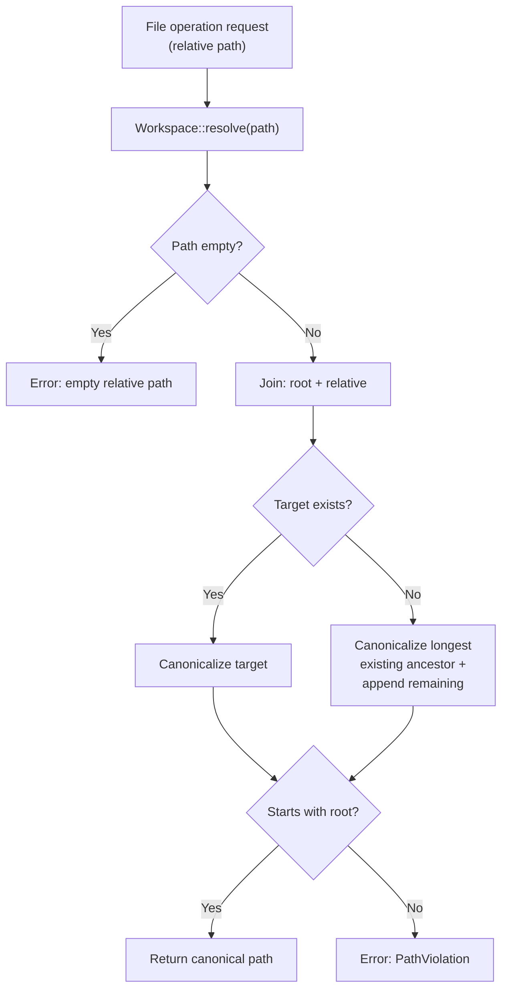
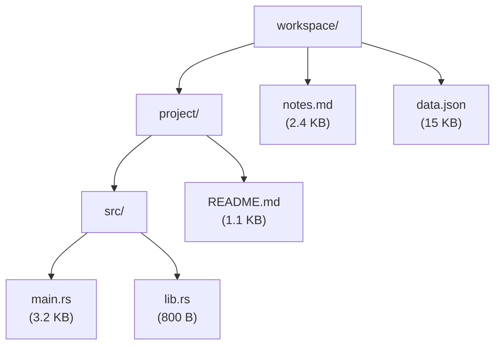
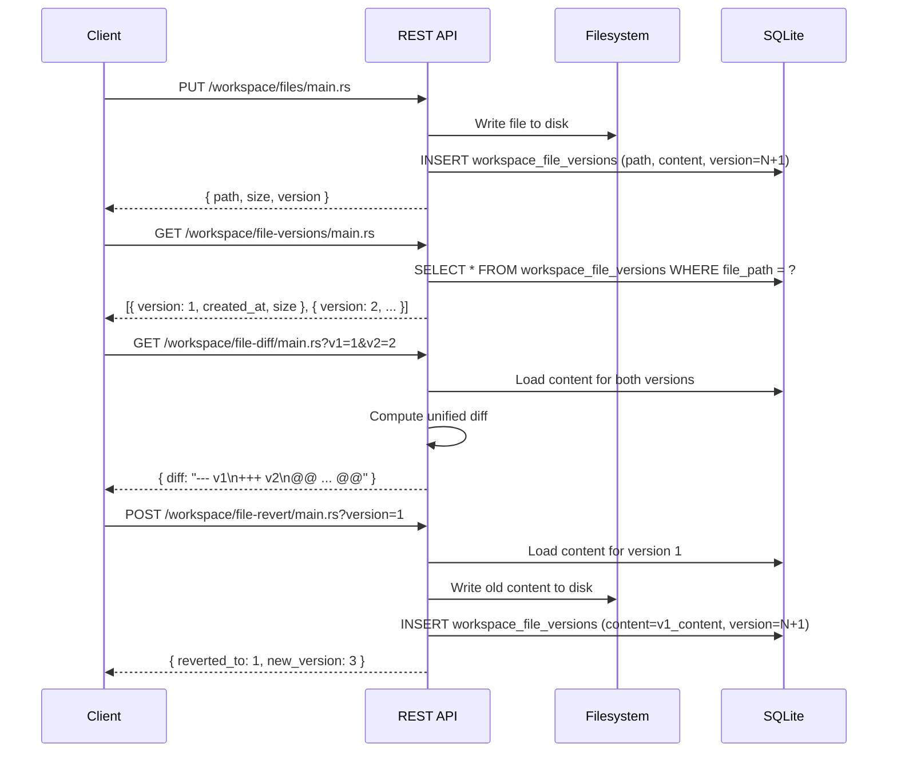
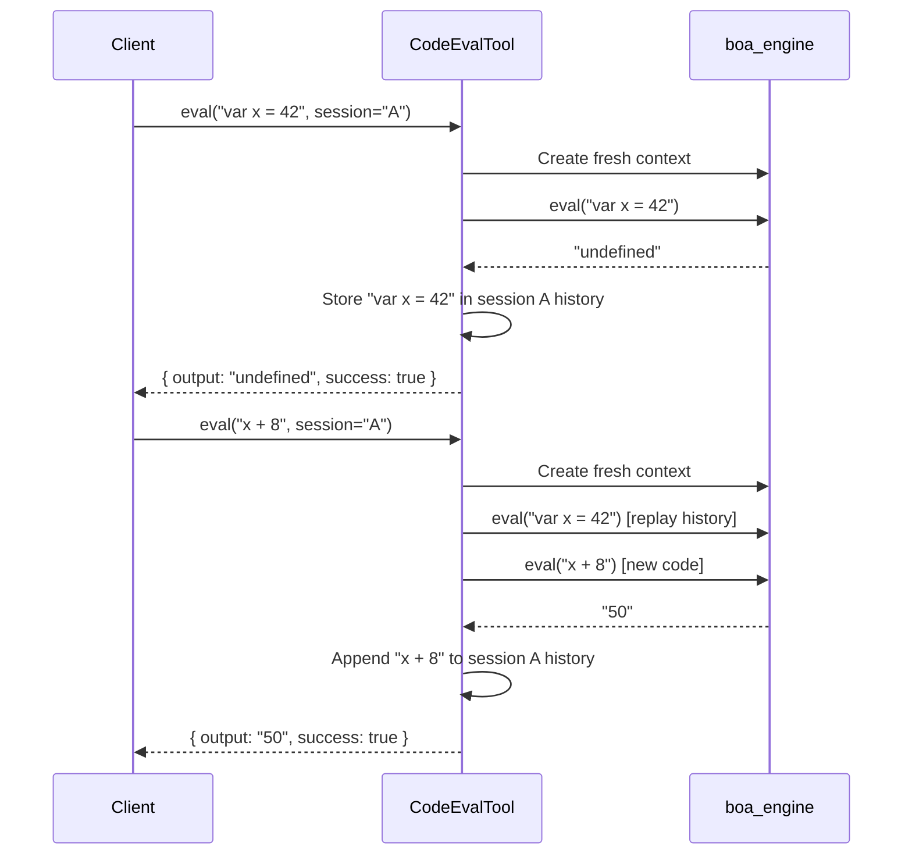
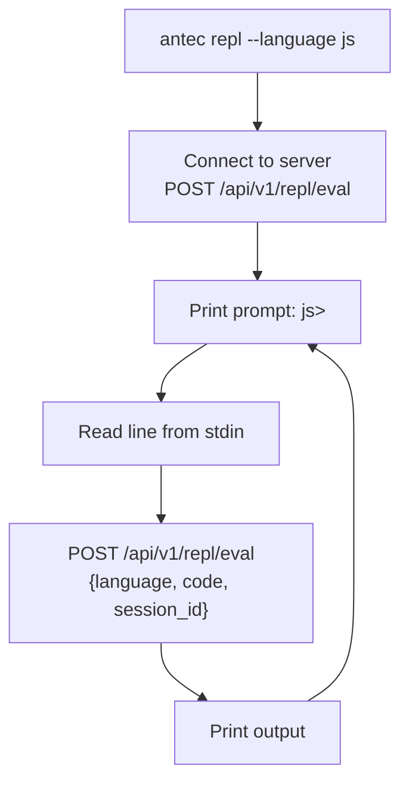

# 15 -- Workspace & REPL

> **Module Goal:** Provide safe file management with versioning, diff/revert capabilities, and sandboxed code evaluation (JavaScript via boa_engine, Python via subprocess) — enabling the AI to work with files and execute code without risking system integrity.

### Why This Module Exists

An AI assistant that can write and execute code is powerful but dangerous. Unrestricted file access could overwrite critical system files. Unconstrained code execution could run malicious commands. The Workspace module provides a sandboxed environment where the AI can safely create, edit, and version files, plus evaluate code in isolated interpreters.

The file jail restricts all operations to a designated workspace directory, preventing path traversal attacks. Automatic versioning creates snapshots before modifications, enabling diff and revert operations. The REPL supports JavaScript (via embedded boa_engine) and Python (via subprocess with timeout), providing computational capability without shell access.

### Business Benefits

| Benefit | Description |
|---------|-------------|
| **File safety** | Jail restricts operations to workspace directory — no access to system files |
| **Version control** | Automatic snapshots before edits enable diff, revert, and audit trail |
| **Code evaluation** | JavaScript and Python execution without shell access — computation without risk |
| **Embedded JS** | boa_engine runs in-process — no external runtime needed for JavaScript |
| **Blocked patterns** | Dangerous file patterns (executables, system files) blocked regardless of permissions |
| **Diff support** | View changes between versions before committing or reverting |

> **Crates**: `antec-storage` (`crates/antec-storage/src/workspace.rs`) for workspace jail, `antec-tools` (`crates/antec-tools/src/eval.rs`) for REPL, `antec-gateway` (`crates/antec-gateway/src/routes/`) for REST handlers
> **Purpose**: Sandboxed file editing with version history, code evaluation in JavaScript and Python, workspace jail enforcement, and file tree API.

---

## 1. Workspace System

### 1.1 Workspace Jail

All file operations are restricted to the workspace directory. The `Workspace` struct enforces path containment through canonicalization and prefix validation.

```rust
pub struct Workspace {
    root: PathBuf,  // Canonical absolute path
}
```

#### Security Model



**Key behaviors:**

| Operation | Protection |
|-----------|-----------|
| `../` traversal | Canonicalization resolves `..` before prefix check. `resolve("../../../etc/passwd")` produces a path outside root and is rejected |
| Symlink escape | `canonicalize()` follows symlinks. A symlink pointing outside the workspace is detected by the prefix check |
| Empty path | Rejected immediately with `PathViolation` error |
| Non-existent paths | Ancestor chain is canonicalized, then remaining components appended. Prefix still checked |

#### Three Workspace Scopes

The REST editor supports three distinct scopes, each rooted at a different directory:

| Scope | Root Directory | Use Case |
|-------|---------------|----------|
| `workspace` | `~/.antec/workspace/` | General file editing, tool outputs, user files |
| `skills` | `~/.antec/skills/` | Skill source code and manifests |
| `persona` | `~/.antec/persona.md` | Single persona file editing |

The scope is determined by the API route prefix. All three apply the same path traversal protections.

#### Workspace Struct API

```rust
impl Workspace {
    /// Create workspace, creating directory if needed. Canonicalizes root.
    pub fn new(root: PathBuf) -> Result<Self>;

    /// Return the canonical workspace root.
    pub fn root(&self) -> &Path;

    /// Resolve a relative path within the jail. Returns canonical absolute path.
    pub fn resolve(&self, relative: &str) -> Result<PathBuf>;

    /// Validate that an absolute path is inside the workspace root.
    pub fn validate_path(&self, path: &Path) -> Result<()>;
}
```

### 1.2 File Tree

```
GET /api/v1/workspace/tree
```

Returns a recursive directory structure of the workspace.

#### FileTreeEntry

```rust
pub struct FileTreeEntry {
    pub name: String,           // File or directory name
    pub path: String,           // Relative path from workspace root
    pub is_dir: bool,           // Whether this is a directory
    pub children: Vec<FileTreeEntry>,  // Recursive children (empty for files)
    pub size: Option<u64>,      // File size in bytes (None for directories)
}
```



### 1.3 File CRUD

| Method | Path | Description |
|--------|------|-------------|
| `GET` | `/api/v1/workspace/files/{*path}` | Read file content as text |
| `PUT` | `/api/v1/workspace/files/{*path}` | Write file content (creates version entry) |
| `POST` | `/api/v1/workspace/upload` | Multipart file upload |

#### Read File

```
GET /api/v1/workspace/files/project/src/main.rs

Response: {
    "path": "project/src/main.rs",
    "content": "fn main() {\n    println!(\"Hello\");\n}",
    "size": 42
}
```

#### Write File

```
PUT /api/v1/workspace/files/project/src/main.rs
Content-Type: application/json

{
    "content": "fn main() {\n    println!(\"Updated\");\n}"
}
```

**Behavior:**
1. Resolve path within workspace jail
2. Create parent directories if they do not exist
3. Write content to filesystem
4. Create a new version entry in SQLite (`workspace_file_versions` table)
5. Return confirmation with path and byte count

#### Upload File

```
POST /api/v1/workspace/upload
Content-Type: multipart/form-data

(file attachment)
```

Accepts multipart uploads. Files are written to the workspace root. Supports drag-and-drop from the Console UI.

### 1.4 Version History

Every write operation creates a new version entry in SQLite, enabling full change tracking and rollback.

#### Database Schema

```sql
CREATE TABLE workspace_file_versions (
    id          INTEGER PRIMARY KEY AUTOINCREMENT,
    file_path   TEXT NOT NULL,
    content     TEXT NOT NULL,
    version     INTEGER NOT NULL,
    created_at  INTEGER NOT NULL,
    size_bytes  INTEGER NOT NULL
);

CREATE INDEX idx_wfv_path ON workspace_file_versions(file_path);
```

#### Version Lifecycle



#### Version API

| Method | Path | Query | Description |
|--------|------|-------|-------------|
| `GET` | `/api/v1/workspace/file-versions/{*path}` | -- | List all versions for a file |
| `GET` | `/api/v1/workspace/file-diff/{*path}` | `v1=N&v2=M` | Unified diff between two versions |
| `POST` | `/api/v1/workspace/file-revert/{*path}` | `version=N` | Revert to a previous version |

**Revert behavior:** Reverts are non-destructive. Reverting to version 1 creates a **new version** (e.g., version 3) whose content equals version 1. The version history is append-only.

### 1.5 Persistence Model

| Data | Storage | Details |
|------|---------|---------|
| File content | Filesystem | Written to `~/.antec/workspace/` |
| Version history | SQLite | `workspace_file_versions` table with full content snapshots |
| File metadata | Filesystem | Size, mtime from OS stat |

The workspace directory is created on first access if it does not exist (`Workspace::new()` calls `create_dir_all`).

---

## 2. REPL System

The REPL (Read-Eval-Print Loop) provides sandboxed code evaluation in JavaScript and Python, accessible via both REST API and CLI.

### 2.1 Supported Languages

| Language | Engine | Session State | I/O |
|----------|--------|---------------|-----|
| **JavaScript** | `boa_engine` (embedded) | Variables persist via code replay | No filesystem, no network |
| **Python** | `python3` subprocess | Variables persist via accumulated script | No filesystem, no network |

### 2.2 REST API

```
POST /api/v1/repl/eval
Content-Type: application/json

{
    "language": "js",           // "js" or "python"
    "code": "2 + 3",           // Code to evaluate
    "session_id": "my-session"  // Optional: enables variable persistence
}

Response: {
    "output": "5",
    "success": true,
    "session_id": "my-session"
}
```

```
GET /api/v1/repl/history

Response: [
    {
        "id": 1,
        "session_id": "my-session",
        "language": "js",
        "code": "2 + 3",
        "output": "5",
        "success": true,
        "created_at": "2026-03-07T10:30:00Z"
    }
]
```

### 2.3 JavaScript Sandbox (boa_engine)

The JavaScript REPL uses `boa_engine`, a Rust-native ECMAScript engine. Code runs in-process with no system access.

#### Blocked Globals

```rust
const BLOCKED_JS_GLOBALS: &[&str] = &[
    "require(",
    "import(",
    "fetch(",
    "XMLHttpRequest",
    "WebSocket(",
];
```

Code containing any blocked pattern is rejected **before execution** with a `ToolError::Blocked` error.

#### Session Persistence



Variables persist by **replaying all prior code snippets** in a fresh `boa_engine::Context` on each evaluation. This ensures consistent state without long-lived mutable contexts.

#### Session Isolation

Each `session_id` has its own independent code history. Variables set in session A are invisible to session B. If no `session_id` is provided, a `"default"` session is used.

### 2.4 Python Sandbox (subprocess)

Python code runs via `python3 -c` subprocess with a clean environment.

#### Blocked Imports

```rust
const BLOCKED_PYTHON_IMPORTS: &[&str] = &[
    "import os",          "from os ",
    "import subprocess",  "from subprocess ",
    "import socket",      "from socket ",
    "import shutil",      "from shutil ",
    "import sys",         "from sys ",
    "import ctypes",      "from ctypes ",
    "import signal",      "from signal ",
    "__import__",
    "open(",
    "exec(",
    "eval(",
];
```

Code is scanned for blocked patterns **before** subprocess execution. Any match produces `ToolError::Blocked`.

#### Session Persistence

Python sessions accumulate code by concatenating all prior snippets with newlines. Each evaluation runs the full accumulated script:

```
# Call 1: "x = 42"       -> runs: "x = 42"
# Call 2: "print(x + 8)" -> runs: "x = 42\nprint(x + 8)"
```

### 2.5 Shared Constraints

| Constraint | Value | Enforcement |
|-----------|-------|-------------|
| **Timeout** | 10 seconds | `tokio::time::timeout()` wraps execution. Exceeded = `ToolError::Timeout` |
| **Session memory** | 50 MB | Tracked per-session as `memory_used` (accumulated code + output bytes). Exceeded = `ToolError::Blocked` |
| **Risk level** | Dangerous | The `code_eval` tool is classified as `RiskLevel::Dangerous`. Requires approval in balanced/strict policy modes |

### 2.6 CodeEvalTool Implementation

```rust
pub struct CodeEvalTool {
    sessions: Arc<Mutex<HashMap<String, ReplSession>>>,
}

struct ReplSession {
    js_history: Vec<String>,      // Accumulated JS snippets
    python_history: Vec<String>,  // Accumulated Python snippets
    memory_used: usize,           // Bytes consumed (code + output)
}
```

#### Tool Definition (for LLM)

```json
{
    "name": "code_eval",
    "description": "Sandboxed REPL: evaluate JavaScript or Python code with session-state persistence.",
    "parameters": {
        "type": "object",
        "properties": {
            "language": { "type": "string", "enum": ["js", "python"] },
            "code": { "type": "string" },
            "session_id": { "type": "string" }
        },
        "required": ["language", "code"]
    }
}
```

### 2.7 REPL History

Execution history is stored in SQLite for the Console UI's REPL page.

```sql
CREATE TABLE repl_history (
    id          INTEGER PRIMARY KEY AUTOINCREMENT,
    session_id  TEXT NOT NULL,
    language    TEXT NOT NULL,
    code        TEXT NOT NULL,
    output      TEXT,
    success     INTEGER NOT NULL DEFAULT 1,
    created_at  INTEGER NOT NULL
);
```

### 2.8 CLI REPL

```
antec repl --language js
```

Interactive terminal REPL mode. Connects to a running Antec server via HTTP and evaluates code line-by-line:



Session ID is auto-generated on CLI REPL start and reused for all evaluations within the session, preserving variable state.

---

## References

- [03-GATEWAY.md](03-GATEWAY.md) -- REST API routes for workspace and REPL
- [04-TOOLS.md](04-TOOLS.md) -- Filesystem tools (file_read, file_write, etc.) and code_eval tool
- [07-SECURITY.md](07-SECURITY.md) -- Path traversal prevention, command blocklist
- [14-CONFIGURATION.md](14-CONFIGURATION.md) -- workspace_dir config field
- [16-CONSOLE.md](16-CONSOLE.md) -- Workspace and REPL console pages
