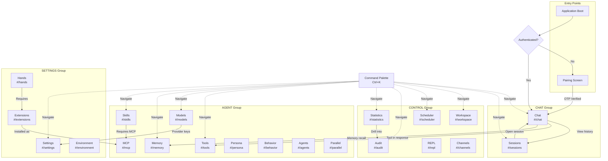
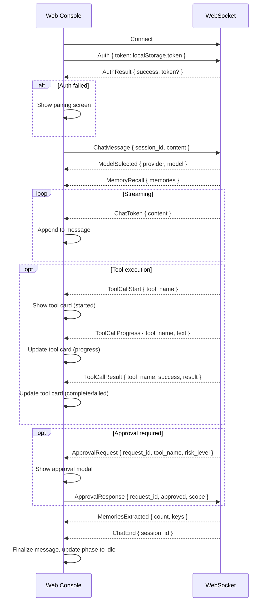

# 16 -- Web Console (Frontend)

> **Module Goal:** Provide a browser-based management interface with 22 pages — from real-time chat to configuration, monitoring, and administration — using vanilla HTML/CSS/JS with a terminal-inspired dark monochrome design, embedded directly in the binary.

### Why This Module Exists

While API access and CLI tools serve power users, most people want a visual interface for managing their AI assistant. The Web Console provides a complete management UI: real-time chat with streaming responses, system configuration, memory browsing, statistics dashboards, security management, and more — all accessible from any browser.

Built with vanilla web technologies (no framework dependencies), the console loads instantly and works offline once the binary is running. The terminal-inspired design with monochrome palette and JetBrains Mono typography creates a distinctive, professional aesthetic. All assets are embedded in the binary via rust-embed, so there are no external files to serve or CDN dependencies to manage.

### Business Benefits

| Benefit | Description |
|---------|-------------|
| **Complete management** | 22 pages cover every system capability — chat, config, memory, security, stats, and more |
| **Zero deployment** | All assets embedded in binary — no web server, CDN, or build step needed |
| **Real-time chat** | WebSocket streaming delivers token-by-token responses for instant feedback |
| **No framework lock-in** | Vanilla HTML/CSS/JS means no framework upgrades, no build tools, no node_modules |
| **Terminal aesthetic** | Distinctive dark monochrome design stands out from generic AI chat interfaces |
| **Responsive design** | Mobile, tablet, and desktop breakpoints — manage your AI from any device |

> **Crate**: `antec-console` (`crates/antec-console/`)
> **Purpose**: Browser-based SPA for interacting with Antec. Vanilla HTML/CSS/JS (ES modules), embedded in the binary via `rust-embed`, served by Axum. Dark monochrome terminal-inspired UI with full keyboard navigation and WCAG 2.1 AA compliance. 22 pages across 4 navigation groups plus a global command palette.

---

## 1. Architecture

### Technology Stack

| Layer | Implementation |
|-------|---------------|
| **Markup** | Vanilla HTML (single `index.html` shell) |
| **Styling** | Single `style.css` with CSS custom properties (design tokens) |
| **Logic** | `app.js` entry point + per-page ES modules (lazy-imported) |
| **Font** | JetBrains Mono (loaded via CSS `@font-face`) |
| **Bundling** | None -- no build step, no framework, no transpilation |
| **Embedding** | `rust-embed` via `ConsoleAssets` struct |
| **Serving** | Axum fallback handler with SPA routing |

### File Structure

```
crates/antec-console/
  src/lib.rs              # rust-embed ConsoleAssets struct + console_routes()
  frontend/
    index.html            # Shell: <head>, <nav>, <main id="app">, <script type="module">
    style.css             # All styles, CSS variables, responsive breakpoints
    app.js                # Router, page loader, global state, WebSocket client init
    pages/                # One ES module per page (lazy-imported by router)
      chat.js
      sessions.js
      workspace.js
      scheduler.js
      audit.js
      statistics.js
      repl.js
      channels.js
      tools.js
      models.js
      memory.js
      skills.js
      mcp.js
      persona.js
      behavior.js
      agents.js
      parallel.js
      settings.js
      extensions.js
      hands.js
      environment.js
      command-palette.js
    components/           # Reusable UI fragments (exported functions returning DOM nodes)
      sidebar.js
      message-bubble.js
      tool-card.js
      code-block.js
      modal.js
      toast.js
      table.js
      form.js
      chart.js
    lib/                  # Shared utilities
      ws-client.js        # WebSocket connection, auth, reconnect, message dispatch
      api.js              # REST client (fetch wrappers, error handling)
      i18n.js             # Translation loader, data-i18n attribute processor
      router.js           # Hash-based SPA router
      markdown.js         # Minimal Markdown-to-HTML renderer
      state.js            # Global reactive state store
      icons.js            # Inline SVG icon registry
```

### Embedding & Serving

```rust
#[derive(Embed)]
#[folder = "frontend/"]
pub struct ConsoleAssets;
```

The `console_routes()` function returns an Axum `Router` that:

1. **Exact match**: Serves static files from embedded assets, matching the request path against `ConsoleAssets::get(path)`.
2. **SPA fallback**: Any unmatched route serves `index.html`, enabling client-side routing.
3. **MIME detection**: File extension mapped to MIME type (`text/html`, `text/css`, `application/javascript`, `image/svg+xml`, etc.). Unknown extensions default to `application/octet-stream`.
4. **Compression**: Responses are gzip-compressed via Tower's `CompressionLayer` when the client sends `Accept-Encoding: gzip`.
5. **Cache headers**: Static assets served with `Cache-Control: public, max-age=3600`. `index.html` served with `Cache-Control: no-cache` to ensure SPA updates propagate.

### SPA Router

Hash-based routing (`#/chat`, `#/settings`, etc.). The router in `lib/router.js`:

1. Listens to `hashchange` events.
2. Matches the hash to a page module path in `pages/`.
3. Dynamically imports the page module via `import()`.
4. Calls the module's default export `render(container)` to mount the page into `<main id="app">`.
5. Updates sidebar active state and `document.title`.
6. Manages focus: after page transition, focus moves to the page's `<h1>` or first interactive element.

Default route: `#/chat` (redirect if hash is empty or unrecognized).

---

## 2. Design System

### 2.1 Visual Identity

| Principle | Rule |
|-----------|------|
| **Monochrome** | Black/white/gray palette only. Color reserved for status indicators |
| **Terminal-inspired** | Monospace typography, minimal chrome, dense information display |
| **Status colors** | Green = connected/success/active, Amber = warning/pending/degraded, Red = error/disconnected/danger |

### 2.2 CSS Variables (Design Tokens)

```css
:root {
  /* Backgrounds */
  --bg-primary:     #0a0a0a;   /* Near-black main background */
  --bg-secondary:   #141414;   /* Dark gray -- cards, sidebar */
  --bg-tertiary:    #1e1e1e;   /* Medium-dark -- hover states, inputs */
  --bg-elevated:    #282828;   /* Elevated surfaces -- modals, dropdowns, tooltips */

  /* Borders */
  --border-subtle:  #2a2a2a;   /* Subtle dividers */
  --border-default: #3a3a3a;   /* Default borders, card outlines */

  /* Text */
  --text-primary:   #e8e8e8;   /* Primary text */
  --text-secondary: #a0a0a0;   /* Secondary text, labels, hints */
  --text-tertiary:  #6a6a6a;   /* Placeholder, disabled, timestamps */

  /* Status indicators -- the ONLY non-gray colors allowed */
  --status-ok:      #4ade80;   /* Green */
  --status-warn:    #fbbf24;   /* Amber */
  --status-error:   #f87171;   /* Red */

  /* Typography */
  --font-mono: 'JetBrains Mono', 'Fira Code', 'Cascadia Code', monospace;

  --text-xs:  0.75rem;    /* 12px -- timestamps, badges */
  --text-sm:  0.875rem;   /* 14px -- secondary text, labels */
  --text-md:  1rem;       /* 16px -- body text, inputs */
  --text-lg:  1.25rem;    /* 20px -- section headings */
  --text-xl:  1.5rem;     /* 24px -- page titles */

  --line-height-tight:  1.3;
  --line-height-normal: 1.6;

  /* Spacing */
  --spacing-xs: 0.25rem;
  --spacing-sm: 0.5rem;
  --spacing-md: 1rem;
  --spacing-lg: 1.5rem;
  --spacing-xl: 2rem;

  /* Radius */
  --radius-sm: 4px;
  --radius-md: 6px;
  --radius-lg: 8px;

  /* Transitions */
  --transition: 150ms ease;
}
```

**Rule**: No hardcoded color, spacing, or font values in CSS. All visual properties reference these tokens. All text uses `--font-mono`. No serif or sans-serif fonts anywhere.

### 2.3 Responsive Breakpoints

| Breakpoint | Width | Layout |
|-----------|-------|--------|
| **Mobile** | `< 768px` | Sidebar hidden (hamburger toggle), single column, full-width cards |
| **Tablet** | `768px -- 1024px` | Sidebar collapsed (icons only, 48px wide), two-column where appropriate |
| **Desktop** | `> 1024px` | Sidebar expanded (200px), multi-column layouts, side panels |

```css
@media (max-width: 767px)  { /* mobile rules */ }
@media (min-width: 768px) and (max-width: 1024px) { /* tablet rules */ }
@media (min-width: 1025px) { /* desktop rules */ }
```

### 2.4 Accessibility (WCAG 2.1 AA)

| Requirement | Implementation |
|------------|----------------|
| **Skip-to-content** | `<a href="#app" class="skip-to-content">` as first focusable element, visible on focus, jumps to `<main>` |
| **Keyboard navigation** | All interactive elements reachable via Tab. Escape closes modals/dropdowns. Arrow keys navigate lists. Enter/Space activate buttons |
| **Focus management** | Visible focus ring (`outline: 2px solid var(--text-primary); outline-offset: 2px`). Focus trapped in modals. Focus restored when modals close |
| **ARIA** | `role`, `aria-label`, `aria-expanded`, `aria-live`, `aria-describedby` on all dynamic regions. Chat message area is `aria-live="polite"`. Toast notifications are `role="alert"` |
| **Color contrast** | All text/background combinations meet 4.5:1 minimum ratio. Status colors used alongside icons/text, never as sole indicator |
| **Reduced motion** | `@media (prefers-reduced-motion: reduce)` disables animations, streaming pulse, transitions |
| **Touch targets** | Minimum 44px height for all interactive elements on mobile |

### 2.5 Keyboard Shortcuts

| Shortcut | Action |
|----------|--------|
| `Ctrl+K` / `Cmd+K` | Open command palette |
| `Enter` | Send chat message |
| `Shift+Enter` | Insert newline in chat input |
| `Ctrl+Enter` / `Cmd+Enter` | Send without tool execution (message-only mode) |
| `Ctrl+/` / `Cmd+/` | Toggle sidebar |
| `Ctrl+N` / `Cmd+N` | New chat session |
| `Escape` | Close modal / command palette / dropdown |
| `Up/Down Arrow` (in chat input) | Browse message history |

---

## 3. Pages (22 Pages, 4 Navigation Groups)

### 3.1 Page Inventory

#### CHAT Group

| Page | Route | Purpose |
|------|-------|---------|
| **Chat** | `#/chat` | Main conversation interface. Default landing page. Streaming messages, markdown, tool call cards, memory recall hints |
| **Sessions** | `#/sessions` | List, archive, merge, and export chat sessions. Channel/date filters |

#### CONTROL Group

| Page | Route | Purpose |
|------|-------|---------|
| **Workspace** | `#/workspace` | File browser and editor for the Antec workspace directory. Version history, diff viewer |
| **Scheduler** | `#/scheduler` | Create/edit/delete cron jobs and reminders. View next-run times. Manual trigger |
| **Audit** | `#/audit` | Audit log viewer with pagination, filtering (session, action, date), CSV/JSON export, HMAC chain verification |
| **Statistics** | `#/statistics` | Usage charts (per-provider, per-model, per-day), cost breakdown, routing savings, budget tracking, metrics dashboard |
| **REPL** | `#/repl` | Interactive JS/Python execution environment with output pane, session history |
| **Channels** | `#/channels` | Configure Discord, WhatsApp, iMessage, and other channel adapters. Status indicators, test connectivity |

#### AGENT Group

| Page | Route | Purpose |
|------|-------|---------|
| **Tools** | `#/tools` | Browse registered tools, enable/disable, risk level badges (safe/moderate/dangerous), "Try" panel for testing |
| **Models** | `#/models` | Configure model instances, routing rules, provider credentials. Connectivity test |
| **Memory** | `#/memory` | Search memories (FTS5), pin/unpin, approve pending, view importance scores, category filter, archived list |
| **Skills** | `#/skills` | Browse installed skills, install from hub, view manifests, enable/disable |
| **MCP** | `#/mcp` | Manage MCP server connections (stdio, HTTP, SSE). Connection status, reconnect, discovered tools |
| **Persona** | `#/persona` | Edit agent persona (system prompt, name, traits). Save with optional session reload |
| **Behavior** | `#/behavior` | Configure behavior overlays (tone, verbosity, constraints). Priority field, create/edit/delete |
| **Agents** | `#/agents` | Define and manage multiple agent configurations. Routing patterns, tool/skill assignment, model override |
| **Parallel** | `#/parallel` | View parallel execution tasks, statuses, results. Cancel running executions |

#### SETTINGS Group

| Page | Route | Purpose |
|------|-------|---------|
| **Settings** | `#/settings` | General configuration editor (TOML-backed). Language selector, data retention, storage paths, delete-all-data |
| **Extensions** | `#/extensions` | Browse and install MCP integration templates. Enable/disable, health status |
| **Hands** | `#/hands` | Activate/deactivate operational capabilities, view dashboards, configure settings |
| **Environment** | `#/environment` | Manage environment variables (ANTEC_* vars), dependency status badges, set/unset |

#### Global

| Feature | Shortcut | Purpose |
|---------|----------|---------|
| **Command Palette** | `Ctrl+K` / `Cmd+K` | Fuzzy search across pages, actions, tools, sessions, settings |

### 3.2 Page Navigation Architecture



---

## 4. Pairing Screen

Shown on first launch or when no valid auth token exists in `localStorage`.

### Layout

- Centered card on `--bg-primary` background.
- "ant" + "ec" logo at top (styled: "ant" in `--text-primary` weight 700, "ec" in `--text-secondary` weight 400, separated by middle-dot in `--text-tertiary`).
- Heading: "Pair this Console" (`--text-lg`).
- Subtext: "Enter the 6-digit code shown in the server terminal" (`--text-secondary`).
- Six individual `<input>` fields, each accepting one digit (0-9).
  - Auto-advance focus on digit entry.
  - Backspace moves to previous field and clears it.
  - Paste support: pasting "123456" fills all six fields.
- **Pair** button below inputs. Disabled until all 6 digits filled.
- Error message area below button (`--status-error`, hidden by default).

### Flow

1. User starts Antec binary. OTP printed to stdout: `Pairing code: 482901`.
2. User opens browser to `http://127.0.0.1:8088`.
3. Console detects no token in `localStorage`, renders pairing screen.
4. User enters 6-digit code.
5. Console sends `POST /api/v1/auth/pair` with `{ "otp": "482901" }`.
6. On success: receives `{ "token": "..." }`. Stores token in `localStorage`. Redirects to `#/chat`.
7. On failure: displays error message ("Invalid code" or "Code expired"). Clears inputs. Focuses first input.

### Visual Layout

```
+------------------------------------------+
|                                          |
|            ant . ec                      |
|                                          |
|      Pair this Console                   |
|      Enter the 6-digit code shown        |
|      in the server terminal:             |
|                                          |
|      [ ] [ ] [ ] [ ] [ ] [ ]            |
|                                          |
|            [ Pair ]                      |
|                                          |
|      Error: Invalid code                 |
|                                          |
+------------------------------------------+
```

---

## 5. Chat Interface

The primary page. Occupies the full content area beside the sidebar.

### Message List

- Scrollable container with `overflow-y: auto`.
- Messages rendered as blocks, alternating user/assistant alignment.
- **User messages**: Right-aligned, `--bg-tertiary` background, `--text-primary` text.
- **Assistant messages**: Left-aligned, no background (transparent), `--text-primary` text.
- **System messages**: Centered, `--text-tertiary`, italic, `--text-xs`.
- Markdown rendering: headings, bold, italic, lists, links, inline code, code blocks.
- **Code blocks**: Syntax-highlighted (lightweight highlighter, no heavy library). Language label top-right. Copy button top-right on hover.
- Auto-scroll to bottom on new messages. Scroll lock if user has scrolled up (with "Jump to bottom" button).

### Tool Call Cards

Inline cards within assistant messages showing tool execution status.

| State | Visual |
|-------|--------|
| **Started** | Tool name + spinner icon. `--border-default` border. |
| **Progress** | Tool name + progress text. Pulsing `--border-subtle` border. |
| **Complete** | Tool name + result summary (collapsed by default, expandable). `--status-ok` left border. |
| **Failed** | Tool name + error message. `--status-error` left border. |

Cards are collapsible. Click to expand/collapse result details.

### Memory Recall Hints

When the agent retrieves memories, a subtle indicator appears above the assistant message:

- Small tag: "Recalled 3 memories" with a clickable link to view which memories were used.
- Expanding shows memory titles and relevance scores.

### Streaming Animation

- Assistant messages appear character-by-character as tokens arrive via WebSocket.
- Blinking cursor (`|`) at the end of the streaming message, `--text-primary`, 1s blink interval.
- `@media (prefers-reduced-motion: reduce)`: cursor shown static, no blink, tokens appear in chunks.

### Context Bar

Horizontal bar above the input area showing:

| Element | Data Source |
|---------|-----------|
| Session name | Editable on click |
| Token count | `used / limit` with thin progress bar |
| Active model | Model name and provider |
| Connection status | Dot: `--status-ok` (connected), `--status-warn` (reconnecting), `--status-error` (disconnected) |

### Input Area

- `<textarea>` with auto-grow (min 1 line, max 8 lines).
- Placeholder: "Type a message..." (`--text-tertiary`).
- Send button (arrow-up icon) to the right, enabled only when input is non-empty.
- `Enter` sends message. `Shift+Enter` inserts newline.
- `Ctrl+Enter` / `Cmd+Enter` sends without tool execution (message-only mode).
- File attachment button (paperclip icon) for drag-and-drop or file picker.

### Visual Layout

```
+----------------------------------------------------------+
|  -- system --                                            |
|  Memory recalled:                                        |
|  - "User timezone: Europe/Warsaw" (fact, 0.9)            |
|  - "Prefers concise answers" (preference, 0.8)           |
+----------------------------------------------------------+
|  -- user -- 10:30 ---                                    |
|  What meetings do I have today?                          |
+----------------------------------------------------------+
|  -- assistant -- 10:30 ---                               |
|  +-- tool: calendar_events ------------- running --+     |
|  | > Fetching calendar events...                   |     |
|  | OK Found 3 events                               |     |
|  +------------------------------------------------+     |
|                                                          |
|  You have 3 meetings today:                              |
|  1. **Standup** -- 09:00                                 |
|  2. **Design Review** -- 14:00                           |
|  3. **1:1 with Anna** -- 16:00                           |
+----------------------------------------------------------+
|  [Session: default] [1.2k / 128k] [claude-3] [*]        |
+----------------------------------------------------------+
|  Type a message...                        [clip] [send]  |
+----------------------------------------------------------+
```

---

## 6. WebSocket Client

### Connection

```javascript
const protocol = location.protocol === 'https:' ? 'wss:' : 'ws:';
const WS_URL = `${protocol}//${location.host}/ws`;
```

Default development URL: `ws://127.0.0.1:8088/ws`. Dynamically constructed from the page's protocol and host for production deployments.

### Authentication

Immediately after WebSocket open, the client sends an auth frame:

```json
{ "type": "Auth", "token": "<token-from-localStorage>" }
```

Server responds with `{ "type": "AuthResult", "success": true }` or closes the connection.

### Message Types Handled

All `WsResponse` variants are handled:

| Server Message (`WsResponse`) | Client Action |
|-------------------------------|---------------|
| `AuthResult` | Store token or show pairing screen |
| `ChatToken` | Append token to current streaming message |
| `ChatEnd` | Finalize message. Stop streaming animation |
| `ToolCallStart` | Insert tool card in "started" state |
| `ToolCallProgress` | Update tool card to "progress" state with text |
| `ToolCallResult` | Update tool card to "complete" or "failed" state |
| `MemoryRecall` | Show memory recall hint above next assistant message |
| `MemoriesExtracted` | Show extraction notification |
| `ModelSelected` | Update context bar model info |
| `ProviderSwitch` | Show failover notification toast |
| `Compacted` | Show compaction notification |
| `ApprovalRequest` | Show modal: "Tool X wants to execute. Approve / Deny?" |
| `SessionUpdate` | Update session list if Sessions page is open |
| `Error` | Show toast notification with error message |
| `SystemMessage` | Insert system message in chat |
| `Heartbeat` | Reset reconnect timer. Respond with client heartbeat |

### Message Flow



### Auto-Reconnect

- On disconnect: wait 1s, then attempt reconnect.
- Exponential backoff: 1s, 2s, 4s, 8s, 16s, max 30s.
- On reconnect: re-authenticate, request missed messages since last received message ID.
- Connection status reflected in context bar dot.
- After 5 failed attempts: show persistent banner "Connection lost. Retrying..." with manual "Reconnect" button.

---

## 7. Sidebar

### Structure

```
+----------------------------+
|  ant . ec         [v1.2.0] |  <- Logo + version
+----------------------------+
|                            |
|  CHAT                      |  <- Group label (--text-tertiary, --text-xs, uppercase)
|  [svg] Chat                |  <- Active: --text-primary, --bg-tertiary, 2px left border
|  [svg] Sessions            |
|                            |
|  CONTROL                   |
|  [svg] Workspace           |
|  [svg] Scheduler           |
|  [svg] Audit               |
|  [svg] Statistics          |
|  [svg] REPL                |
|  [svg] Channels            |
|                            |
|  AGENT                     |
|  [svg] Tools               |
|  [svg] Models              |
|  [svg] Memory              |
|  [svg] Skills              |
|  [svg] MCP                 |
|  [svg] Persona             |
|  [svg] Behavior            |
|  [svg] Agents              |
|  [svg] Parallel            |
|                            |
|  SETTINGS                  |
|  [svg] Settings            |
|  [svg] Extensions          |
|  [svg] Hands               |
|  [svg] Environment         |
+----------------------------+
|  * Connected               |  <- Status footer
+----------------------------+
```

### Logo

Two `<span>` elements:

- `<span class="logo-ant">ant</span>` -- `--text-primary`, font-weight 700
- `<span class="logo-dot">.</span>` -- `--text-tertiary`
- `<span class="logo-ec">ec</span>` -- `--text-secondary`, font-weight 400

Clicking the logo navigates to `#/chat`.

### Icons

All navigation icons are **inline monochrome SVGs** from `lib/icons.js`. No emoji, no icon fonts. SVGs scale with text and match the monochrome palette. Each icon is 16x16, stroke-based, `currentColor` for fill/stroke.

### Responsive Behavior

| Breakpoint | Sidebar Behavior |
|-----------|-----------------|
| **Desktop** (`> 1024px`) | Fixed, always visible, 200px width. Nav items show icon + label |
| **Tablet** (`768px -- 1024px`) | Collapsed to 48px, icons only. Hover tooltip shows label. Click expands temporarily |
| **Mobile** (`< 768px`) | Hidden entirely. Hamburger button (three lines) in top-left header. Tap opens sidebar as overlay with backdrop. Tap backdrop or nav item closes sidebar |

### Active State

Current page highlighted with `--bg-tertiary` background and 2px `--text-primary` left border.

### Group Labels

Uppercase, `--text-tertiary`, `--text-xs`, `letter-spacing: 0.1em`. Not clickable.

---

## 8. Internationalization (i18n)

### Mechanism

1. On page load, fetch current locale from `GET /api/v1/locale` which returns `{ "locale": "en", "strings": { "key": "value", ... } }`.
2. `lib/i18n.js` stores the translation map and provides a `t(key)` function.
3. All elements with `data-i18n` attributes have their `textContent` replaced with the translated string.
4. Elements with `data-i18n-placeholder` have their `placeholder` attribute replaced.
5. Supported locales: `en` (English), `pl` (Polish).
6. Fallback: if a key is missing in the current locale, fall back to `en`.

### Locale Switching

- Language toggle in Settings page or status bar.
- `PUT /api/v1/locale` with `{ "locale": "pl" }` to switch.
- After switch, `i18n.js` re-fetches strings and re-processes all `[data-i18n]` elements without page reload.
- Persists across sessions (stored server-side).

### Key Naming Convention

Hierarchical dot notation: `page.section.element`.

```
chat.input.placeholder     = "Type a message..."
chat.context.tokens        = "Tokens"
sidebar.group.chat         = "CHAT"
sidebar.group.control      = "CONTROL"
sidebar.group.agent        = "AGENT"
sidebar.group.settings     = "SETTINGS"
pairing.title              = "Pair this Console"
pairing.subtitle           = "Enter the 6-digit code shown in the server terminal"
pairing.button             = "Pair"
pairing.error.invalid      = "Invalid code"
pairing.error.expired      = "Code expired"
```

### Coverage

All user-visible text uses `data-i18n` attributes:

- Navigation labels (`nav.chat`, `nav.sessions`, `nav.workspace`, etc.)
- Page titles and section headers
- Button labels
- Placeholder text
- Status messages
- Error messages
- Toast notifications

---

## 9. Command Palette

Activated via `Ctrl+K` (Windows/Linux) or `Cmd+K` (macOS).

### UI

- Modal overlay with backdrop blur (`backdrop-filter: blur(4px)`).
- Search input at top, auto-focused, `--bg-tertiary` background.
- Results list below, filtered as user types.
- Keyboard navigation: Arrow Up/Down to select, Enter to activate, Escape to close.
- Maximum 10 results displayed. Selected result highlighted with `--bg-elevated`.

### Search Sources

| Source | Prefix | Examples |
|--------|--------|---------|
| Pages | (none) | "Chat", "Settings", "Memory" |
| Actions | `>` | "> New session", "> Clear chat", "> Toggle sidebar" |
| Tools | `tool:` | "tool:web_search", "tool:file_read" |
| Sessions | `session:` | "session:Project Alpha discussion" |
| Settings | `set:` | "set:model", "set:language" |

### Result Ranking

1. Exact prefix match.
2. Fuzzy substring match (consecutive character matches scored higher).
3. Recently used (stored in `sessionStorage`).

### Dynamic Items

On palette open, `refreshPaletteDynamicItems()` fetches:

- Active sessions from `GET /api/v1/sessions`
- Available tools from `GET /api/v1/tools`
- Installed skills from `GET /api/v1/skills`
- Pinned memories from `GET /api/v1/memory?pinned=true`

Combined with static page navigation items via `getAllPaletteItems()`.

---

## References

- [01-ARCHITECTURE.md](01-ARCHITECTURE.md) -- SPA asset embedding, Axum serving
- [03-GATEWAY.md](03-GATEWAY.md) -- WebSocket protocol, REST API routes
- [14-CONFIGURATION.md](14-CONFIGURATION.md) -- Config for bind address, language
- [15-WORKSPACE.md](15-WORKSPACE.md) -- Workspace file tree, REPL APIs
- [17-EXTENSIONS.md](17-EXTENSIONS.md) -- Extensions page data model
- [18-STATISTICS.md](18-STATISTICS.md) -- Statistics page data sources
