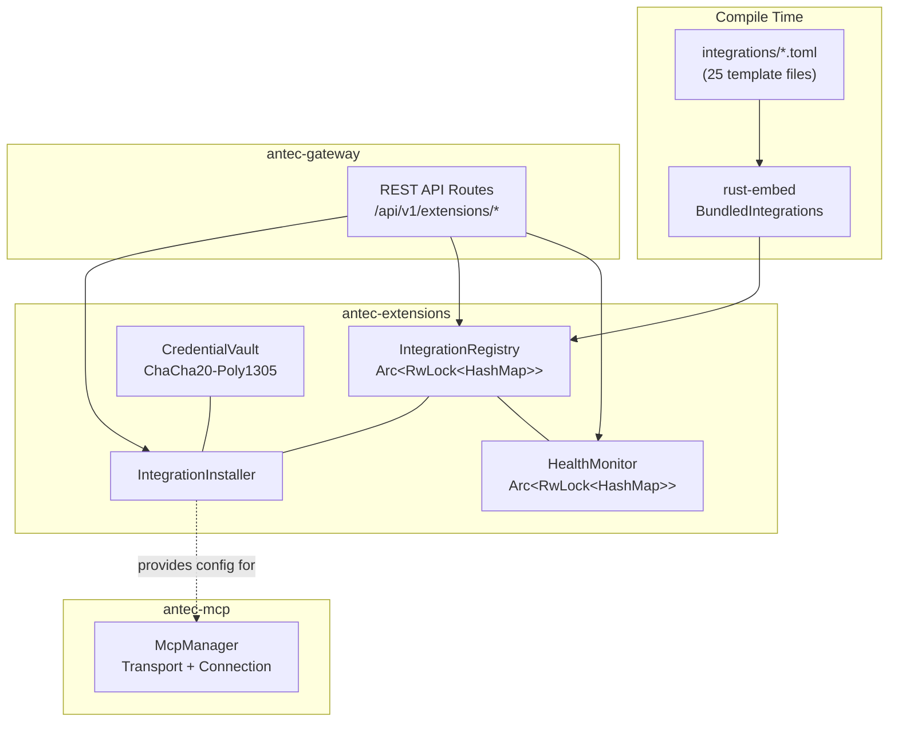
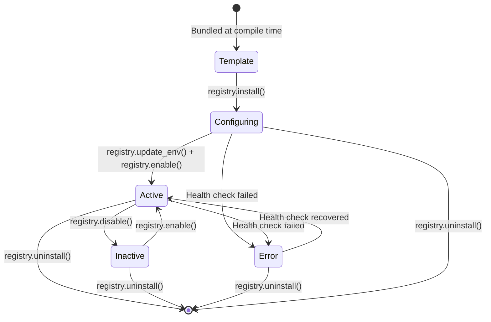
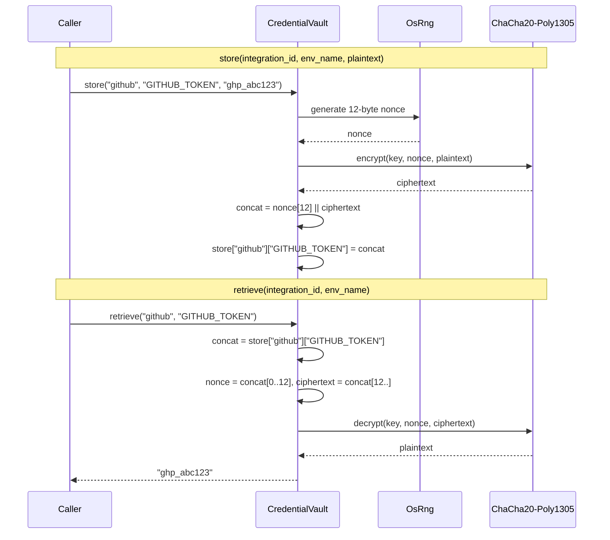
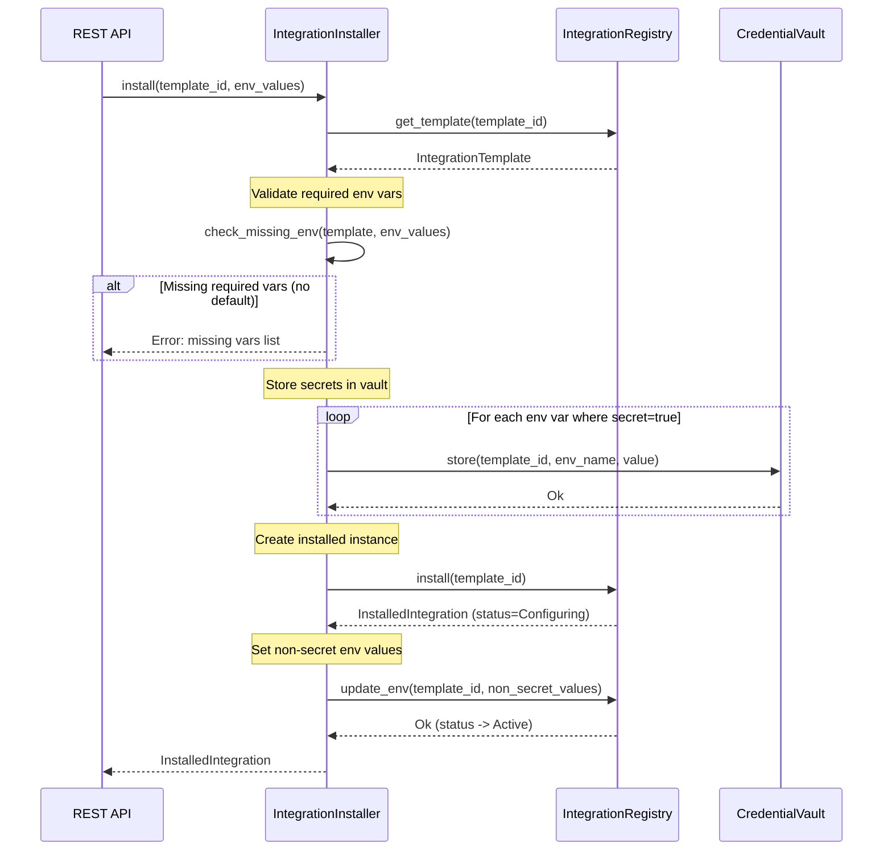
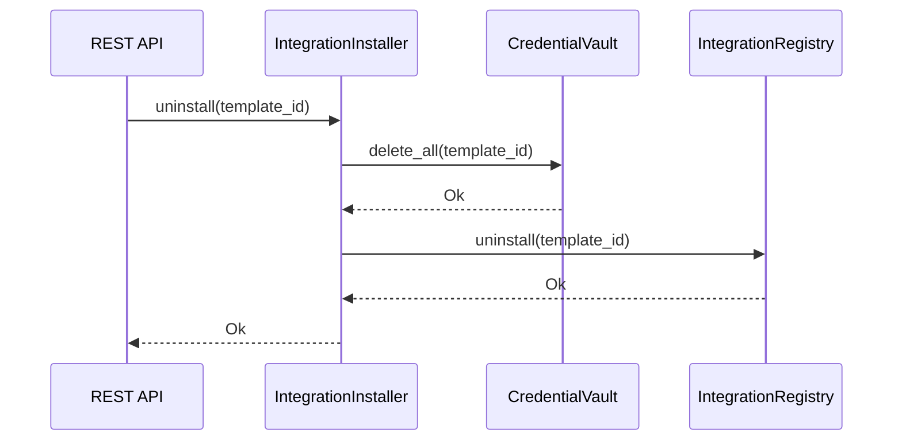
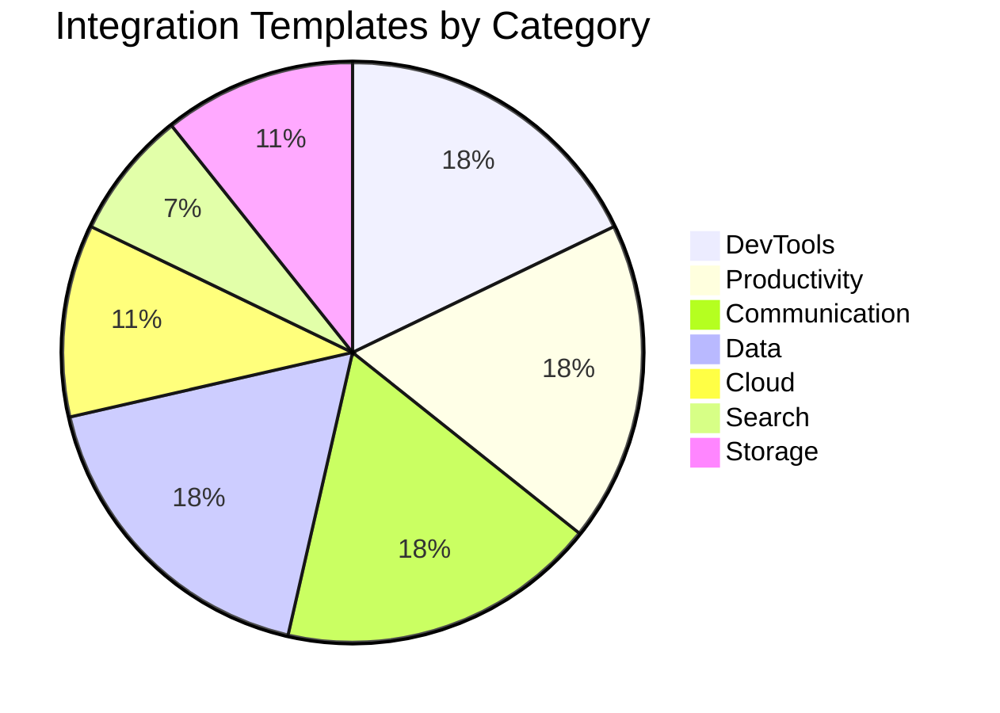
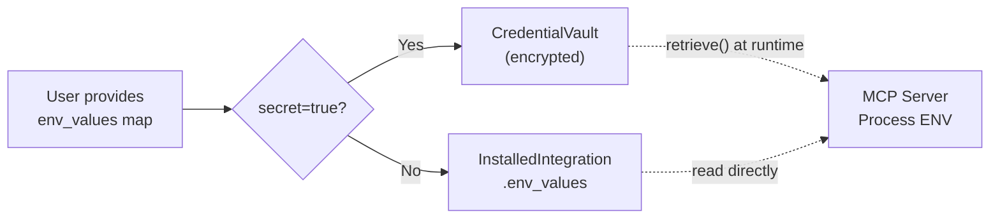

# 17 -- Extensions & Integrations

> **Module Goal:** Provide a plug-and-play integration framework that connects Antec to third-party services through pre-built MCP server templates, with secure credential management and health monitoring.

### Why This Module Exists

Personal AI assistants become exponentially more useful when they can interact with external services -- GitHub for code, Slack for messaging, Google Calendar for scheduling, databases for data. Without a structured integration system, each connection would require custom code, manual configuration, and insecure credential handling.

The Extensions module solves this by providing:

- **Pre-built templates** for 25+ popular services, ready to install in seconds
- **Secure credential vault** using ChaCha20-Poly1305 encryption -- API keys never stored in plaintext
- **Health monitoring** to detect broken integrations before users notice
- **Declarative TOML format** so new integrations can be added without writing Rust code

### Business Benefits

| Benefit | Description |
|---------|-------------|
| **Instant connectivity** | Users connect to GitHub, Slack, Gmail, databases, and more without writing integration code |
| **Security by default** | All secrets encrypted at rest with ChaCha20-Poly1305; separation of secrets from non-secret config |
| **Zero-maintenance integrations** | Health monitoring detects issues; enable/disable without uninstalling |
| **Ecosystem growth** | TOML template format lets community contribute new integrations without Rust knowledge |
| **OAuth support** | Google services (Gmail, Calendar, Drive) use OAuth2 with PKCE for secure authorization |

---

## 1. Architecture Overview

**Crate:** `antec-extensions` (`crates/antec-extensions/`)
**Files:** `lib.rs`, `bundled.rs`, `health.rs`, `installer.rs`, `registry.rs`, `vault.rs`

The Extensions system is composed of five core components that collaborate to manage the full lifecycle of third-party integrations:

1. **BundledIntegrations** -- compile-time embedded TOML templates via `rust-embed`
2. **IntegrationRegistry** -- in-memory store for templates and installed integration state
3. **CredentialVault** -- ChaCha20-Poly1305 encrypted secret storage
4. **IntegrationInstaller** -- orchestrator that coordinates registry and vault operations
5. **HealthMonitor** -- periodic liveness checker for installed integrations



### Component Responsibilities

| Component | Responsibility |
|-----------|---------------|
| `BundledIntegrations` | Load and parse embedded TOML files into `IntegrationTemplate` structs |
| `IntegrationRegistry` | Store templates, track installed state, enable/disable integrations |
| `CredentialVault` | Encrypt, store, retrieve, and delete secret environment variables |
| `IntegrationInstaller` | Validate requirements, orchestrate install/uninstall across registry and vault |
| `HealthMonitor` | Check integration health, record results, surface errors |

---

## 2. Data Model

### IntegrationCategory

Classification enum for organizing templates in the UI and API responses.

```rust
#[derive(Debug, Clone, Copy, PartialEq, Eq, Hash, Serialize, Deserialize)]
#[serde(rename_all = "lowercase")]
pub enum IntegrationCategory {
    DevTools,
    Productivity,
    Communication,
    Data,
    Cloud,
    AI,
    Search,
    Storage,
}
```

Serialized as lowercase strings: `"devtools"`, `"productivity"`, `"communication"`, `"data"`, `"cloud"`, `"ai"`, `"search"`, `"storage"`.

### IntegrationTemplate

The core definition of an extension, loaded from embedded TOML files at startup.

```rust
#[derive(Debug, Clone, Serialize, Deserialize)]
pub struct IntegrationTemplate {
    pub id: String,
    pub name: String,
    pub description: String,
    pub category: IntegrationCategory,
    pub transport: McpTransportTemplate,
    #[serde(default)]
    pub required_env: Vec<RequiredEnvVar>,
    pub oauth: Option<OAuthTemplate>,
    pub health_check: Option<HealthCheckConfig>,
    pub icon: Option<String>,
    pub docs_url: Option<String>,
}
```

| Field | Type | Description |
|-------|------|-------------|
| `id` | `String` | Unique identifier (e.g., `"github"`, `"slack"`) |
| `name` | `String` | Display name (e.g., `"GitHub"`) |
| `description` | `String` | Full description of the integration's capabilities |
| `category` | `IntegrationCategory` | Classification for grouping and filtering |
| `transport` | `McpTransportTemplate` | MCP transport configuration (Stdio or SSE) |
| `required_env` | `Vec<RequiredEnvVar>` | Environment variables needed for operation |
| `oauth` | `Option<OAuthTemplate>` | OAuth configuration if the service uses OAuth |
| `health_check` | `Option<HealthCheckConfig>` | Periodic health check configuration |
| `icon` | `Option<String>` | SVG icon identifier from the icon registry |
| `docs_url` | `Option<String>` | Link to external documentation |

### McpTransportTemplate

Tagged enum specifying how to launch the MCP server process.

```rust
#[derive(Debug, Clone, Serialize, Deserialize)]
#[serde(tag = "type")]
pub enum McpTransportTemplate {
    Stdio {
        command: String,
        #[serde(default)]
        args: Vec<String>,
    },
    Sse {
        url: String,
    },
}
```

- **Stdio** -- launches a local process via `command` with `args`, communicates over stdin/stdout
- **Sse** -- connects to a remote MCP server via Server-Sent Events at `url`

### RequiredEnvVar

Describes an environment variable that the MCP server process needs.

```rust
#[derive(Debug, Clone, Serialize, Deserialize)]
pub struct RequiredEnvVar {
    pub name: String,
    pub description: String,
    #[serde(default)]
    pub secret: bool,
    pub default_value: Option<String>,
}
```

| Field | Type | Description |
|-------|------|-------------|
| `name` | `String` | Environment variable name (e.g., `"GITHUB_TOKEN"`) |
| `description` | `String` | Human-readable description shown in UI |
| `secret` | `bool` | If `true`, value is stored in the encrypted vault, never in plaintext. Default: `false` |
| `default_value` | `Option<String>` | Default value used if user does not provide one |

### OAuthTemplate

Configuration for OAuth2-based authentication flows.

```rust
#[derive(Debug, Clone, Serialize, Deserialize)]
pub struct OAuthTemplate {
    pub provider: String,
    pub auth_url: String,
    pub token_url: String,
    #[serde(default)]
    pub scopes: Vec<String>,
    #[serde(default)]
    pub pkce: bool,
}
```

| Field | Type | Description |
|-------|------|-------------|
| `provider` | `String` | OAuth provider name (e.g., `"google"`) |
| `auth_url` | `String` | Authorization endpoint URL |
| `token_url` | `String` | Token exchange endpoint URL |
| `scopes` | `Vec<String>` | Required OAuth scopes |
| `pkce` | `bool` | Whether to use PKCE (Proof Key for Code Exchange). Default: `false` |

### HealthCheckConfig

Configuration for periodic health monitoring of an installed integration.

```rust
#[derive(Debug, Clone, Serialize, Deserialize)]
pub struct HealthCheckConfig {
    #[serde(default = "default_interval")]
    pub interval_secs: u64,    // default: 300
    #[serde(default = "default_timeout")]
    pub timeout_secs: u64,     // default: 10
    pub endpoint: Option<String>,
}
```

| Field | Type | Description |
|-------|------|-------------|
| `interval_secs` | `u64` | Check interval in seconds (default: 300 = 5 minutes) |
| `timeout_secs` | `u64` | Check timeout in seconds (default: 10) |
| `endpoint` | `Option<String>` | URL to check for liveness. Must be `http://` or `https://` |

### IntegrationStatus

Runtime status of an installed integration.

```rust
#[derive(Debug, Clone, Copy, PartialEq, Eq, Serialize, Deserialize)]
#[serde(rename_all = "lowercase")]
pub enum IntegrationStatus {
    Active,
    Inactive,
    Error,
    Configuring,
}
```

| Variant | Meaning |
|---------|---------|
| `Active` | Running and healthy, all env vars provided |
| `Inactive` | Installed but disabled by user |
| `Error` | Failed health check or connection error |
| `Configuring` | Newly installed, missing required env vars or pending OAuth |

### InstalledIntegration

Runtime state of an installed extension.

```rust
#[derive(Debug, Clone, Serialize, Deserialize)]
pub struct InstalledIntegration {
    pub template_id: String,
    pub status: IntegrationStatus,
    pub enabled: bool,
    pub installed_at: i64,
    pub env_values: HashMap<String, String>,  // non-secret only
    pub last_health_check: Option<i64>,
    pub health_ok: bool,
}
```

| Field | Type | Description |
|-------|------|-------------|
| `template_id` | `String` | References `IntegrationTemplate.id` |
| `status` | `IntegrationStatus` | Current operational status |
| `enabled` | `bool` | Whether the integration is active |
| `installed_at` | `i64` | Unix timestamp of installation |
| `env_values` | `HashMap<String, String>` | Resolved non-secret environment variable values only |
| `last_health_check` | `Option<i64>` | Unix timestamp of last health check |
| `health_ok` | `bool` | Whether the last health check passed |

**Important:** Secret values (env vars with `secret = true`) are never stored in `env_values`. They exist only in the encrypted `CredentialVault`.

---

## 3. Integration Registry

The `IntegrationRegistry` is the central in-memory store for all templates and installed integration state. It uses `Arc<RwLock<HashMap>>` for thread-safe concurrent access.

### Structure

```rust
pub struct IntegrationRegistry {
    templates: Arc<RwLock<HashMap<String, IntegrationTemplate>>>,
    installed: Arc<RwLock<HashMap<String, InstalledIntegration>>>,
}
```

### Methods

| Method | Signature | Purpose |
|--------|-----------|---------|
| `new()` | `-> Self` | Create empty registry with no templates or installed integrations |
| `load_templates()` | `(templates: Vec<IntegrationTemplate>)` | Bulk load templates into the registry, keyed by `id` |
| `list_templates()` | `-> Vec<IntegrationTemplate>` | Return all templates, sorted alphabetically by `id` |
| `get_template()` | `(id: &str) -> Option<IntegrationTemplate>` | Look up a single template by ID |
| `install()` | `(template_id: &str) -> Result<InstalledIntegration>` | Create installed instance with `status = Configuring`, `enabled = false` |
| `uninstall()` | `(template_id: &str) -> Result<()>` | Remove an installed integration |
| `enable()` | `(template_id: &str) -> Result<()>` | Set `enabled = true`, `status = Active` |
| `disable()` | `(template_id: &str) -> Result<()>` | Set `enabled = false`, `status = Inactive` |
| `list_installed()` | `-> Vec<InstalledIntegration>` | Return all installed integrations, sorted by `template_id` |
| `get_installed()` | `(template_id: &str) -> Option<InstalledIntegration>` | Look up a single installed integration by template ID |
| `update_env()` | `(template_id: &str, env: HashMap<String, String>) -> Result<()>` | Update env values; transitions `Configuring` -> `Active` |
| `template_count()` | `-> usize` | Return the number of loaded templates |
| `installed_count()` | `-> usize` | Return the number of installed integrations |

### State Transitions



### Error Conditions

- `install()` returns `AlreadyInstalled` if the template is already installed
- `install()` returns `NotFound` if the template ID does not exist
- `uninstall()`, `enable()`, `disable()`, `update_env()` return `NotFound` if the template is not installed

---

## 4. Credential Vault

The `CredentialVault` provides ChaCha20-Poly1305 encrypted storage for secret environment variables (API keys, tokens, passwords). Secrets are never stored in plaintext -- they are encrypted before storage and decrypted only when retrieved.

### Key Derivation

The master key is derived from user-provided bytes using SHA-256:

```
key = SHA256(master_key_bytes) -> [u8; 32]
```

This 32-byte key is used directly as the ChaCha20-Poly1305 symmetric key.

### Storage Format

Credentials are stored in a nested `HashMap`:

```
integration_id -> (env_name -> nonce[12] || ciphertext)
```

Each encrypted value is stored as `Vec<u8>` containing a 12-byte nonce prepended to the ciphertext. On retrieval, the nonce is split off and used for decryption.

### Structure

```rust
pub struct CredentialVault {
    key: [u8; 32],
    store: Arc<RwLock<HashMap<String, HashMap<String, Vec<u8>>>>>,
}
```

### Methods

| Method | Signature | Purpose |
|--------|-----------|---------|
| `new()` | `(master_key: &[u8]) -> Self` | Create vault with key derived via `SHA256(master_key)` |
| `store()` | `(integration_id: &str, env_name: &str, value: &str) -> Result<()>` | Encrypt and store a credential |
| `retrieve()` | `(integration_id: &str, env_name: &str) -> Result<String>` | Decrypt and return a credential |
| `delete()` | `(integration_id: &str, env_name: &str)` | Remove a single credential (idempotent) |
| `delete_all()` | `(integration_id: &str)` | Remove all credentials for an integration (idempotent) |
| `has()` | `(integration_id: &str, env_name: &str) -> bool` | Check if a credential exists |

### Encryption Flow



### Security Properties

- **Unique nonce per value**: Every `store()` call generates a fresh random 12-byte nonce via `OsRng`
- **Authenticated encryption**: ChaCha20-Poly1305 provides both confidentiality and integrity -- tampered ciphertext is detected
- **In-memory only**: The vault state is held in memory. Secrets do not touch disk in the current implementation
- **No key exposure**: The derived key is stored in the struct; the original master key bytes are not retained

---

## 5. Installation Workflow

The `IntegrationInstaller` orchestrates the install and uninstall flows, coordinating between the `IntegrationRegistry` and `CredentialVault`.

### Structure

```rust
pub struct IntegrationInstaller {
    registry: Arc<IntegrationRegistry>,
    vault: Arc<CredentialVault>,
}
```

### Install Flow



### Uninstall Flow



### Environment Variable Validation

The `check_missing_env()` helper validates that all required environment variables are provided:

```rust
fn check_missing_env(
    template: &IntegrationTemplate,
    provided: &HashMap<String, String>,
) -> Vec<String>  // returns list of missing var names
```

Logic:
1. For each entry in `template.required_env`:
2. If `default_value` is `Some(_)`, the var is satisfied regardless of whether it was provided
3. If `default_value` is `None` and the var name is not in `provided`, it is missing
4. Returns the list of missing variable names (empty list = all satisfied)

---

## 6. Health Monitoring

The `HealthMonitor` tracks the health of installed integrations and records check results.

### Structures

```rust
pub struct HealthMonitor {
    results: Arc<RwLock<HashMap<String, HealthCheckResult>>>,
}

#[derive(Debug, Clone, Serialize, Deserialize)]
pub struct HealthCheckResult {
    pub integration_id: String,
    pub healthy: bool,
    pub latency_ms: u64,
    pub error: Option<String>,
    pub checked_at: i64,
}
```

| Field | Type | Description |
|-------|------|-------------|
| `integration_id` | `String` | References the template ID of the checked integration |
| `healthy` | `bool` | Whether the check passed |
| `latency_ms` | `u64` | Time taken for the check in milliseconds |
| `error` | `Option<String>` | Error message if the check failed |
| `checked_at` | `i64` | Unix timestamp of the check |

### Methods

| Method | Signature | Purpose |
|--------|-----------|---------|
| `new()` | `-> Self` | Create monitor with empty results |
| `check()` | `(integration_id: &str, config: &HealthCheckConfig) -> HealthCheckResult` | Run a health check and record the result |
| `get_status()` | `(integration_id: &str) -> Option<HealthCheckResult>` | Get the latest result for an integration |
| `get_all()` | `-> Vec<HealthCheckResult>` | Get all recorded results |
| `record()` | `(result: HealthCheckResult)` | Store or overwrite a result |

### Check Logic

The `check()` method performs the following:

1. If `config.endpoint` is `Some(url)`:
   - Validates that the URL starts with `http://` or `https://`
   - If the URL is syntactically valid, records `healthy = true`
   - If the URL is invalid, records `healthy = false` with an error message
2. If `config.endpoint` is `None`:
   - Records `healthy = true` (no endpoint to check)
3. Records the result via `record()` and returns it

**Note:** The current implementation does **not** make actual HTTP calls. URL validation is syntactic only. Real HTTP health checks would require injecting an HTTP client (e.g., `reqwest`), which is deferred to a future implementation phase.

---

## 7. Bundled Integration Templates

Antec ships with 25 integration templates embedded in the binary at compile time. Templates are stored as TOML files in `crates/antec-extensions/integrations/` and loaded via `rust-embed`.

### BundledIntegrations

```rust
#[derive(Embed)]
#[folder = "integrations/"]
#[include = "*.toml"]
pub struct BundledIntegrations;
```

At startup, each `.toml` file is parsed into an `IntegrationTemplate` and loaded into the `IntegrationRegistry`.

### Template Catalog

| ID | Name | Category | Transport | OAuth | Key Env Vars |
|----|------|----------|-----------|-------|-------------|
| `aws` | AWS | Cloud | stdio (`npx`) | No | `AWS_ACCESS_KEY_ID`, `AWS_SECRET_ACCESS_KEY` |
| `azure` | Azure | Cloud | stdio | No | `AZURE_SUBSCRIPTION_ID` |
| `bitbucket` | Bitbucket | DevTools | stdio | No | `BITBUCKET_USERNAME`, `BITBUCKET_APP_PASSWORD` |
| `brave-search` | Brave Search | Search | stdio | No | `BRAVE_API_KEY` |
| `discord` | Discord | Communication | stdio | No | `DISCORD_BOT_TOKEN` |
| `dropbox` | Dropbox | Storage | stdio | No | `DROPBOX_ACCESS_TOKEN` |
| `elasticsearch` | Elasticsearch | Data | stdio | No | `ELASTICSEARCH_URL` |
| `exa-search` | Exa Search | Search | stdio | No | `EXA_API_KEY` |
| `gcp` | Google Cloud | Cloud | stdio | No | `GOOGLE_APPLICATION_CREDENTIALS` |
| `github` | GitHub | DevTools | stdio | No | `GITHUB_TOKEN` |
| `gitlab` | GitLab | DevTools | stdio | No | `GITLAB_TOKEN` |
| `gmail` | Gmail | Communication | stdio | Yes (Google, PKCE) | `GOOGLE_CLIENT_ID`, `GOOGLE_CLIENT_SECRET` |
| `google-calendar` | Google Calendar | Productivity | stdio | Yes (Google, PKCE) | `GOOGLE_CLIENT_ID`, `GOOGLE_CLIENT_SECRET` |
| `google-drive` | Google Drive | Storage | stdio | Yes (Google, PKCE) | `GOOGLE_CLIENT_ID`, `GOOGLE_CLIENT_SECRET` |
| `jira` | Jira | Productivity | stdio | No | `JIRA_HOST`, `JIRA_EMAIL`, `JIRA_API_TOKEN` |
| `linear` | Linear | Productivity | stdio | No | `LINEAR_API_KEY` |
| `mongodb` | MongoDB | Data | stdio | No | `MONGODB_URI` |
| `notion` | Notion | Productivity | stdio | No | `NOTION_API_KEY` |
| `postgresql` | PostgreSQL | Data | stdio | No | `POSTGRESQL_URI` |
| `redis` | Redis | Data | stdio | No | `REDIS_URL` |
| `sentry` | Sentry | DevTools | stdio | No | `SENTRY_AUTH_TOKEN`, `SENTRY_ORG` |
| `slack` | Slack | Communication | stdio | No | `SLACK_BOT_TOKEN` |
| `sqlite` | SQLite | Data | stdio | No | `SQLITE_DB_PATH` |
| `teams` | Microsoft Teams | Communication | stdio | No | `TEAMS_WEBHOOK_URL` |
| `todoist` | Todoist | Productivity | stdio | No | `TODOIST_API_TOKEN` |

All 25 templates use **stdio** transport with the `npx` launcher, invoking `@modelcontextprotocol/server-*` packages (or `@anthropic/mcp-server-*` for Google services).

### Category Distribution



---

## 8. TOML Template Format

Integration templates are declared in TOML files. Each file defines a single `IntegrationTemplate`. The format is designed to be human-readable and community-contributable -- no Rust knowledge required.

### Basic Template (no OAuth)

Example: `github.toml`

```toml
id = "github"
name = "GitHub"
description = "GitHub repository management, issues, pull requests, and code search"
category = "devtools"
icon = "github"
docs_url = "https://github.com/modelcontextprotocol/servers/tree/main/src/github"

[transport.Stdio]
command = "npx"
args = ["-y", "@modelcontextprotocol/server-github"]

[[required_env]]
name = "GITHUB_TOKEN"
description = "GitHub personal access token"
secret = true
```

### Template with OAuth

Example: `gmail.toml`

```toml
id = "gmail"
name = "Gmail"
description = "Read, send, search, and manage Gmail messages with full thread support"
category = "communication"
icon = "gmail"
docs_url = "https://github.com/anthropics/mcp-server-gmail"

[transport.Stdio]
command = "npx"
args = ["-y", "@anthropic/mcp-server-gmail"]

[[required_env]]
name = "GOOGLE_CLIENT_ID"
description = "Google OAuth client ID"
secret = true

[[required_env]]
name = "GOOGLE_CLIENT_SECRET"
description = "Google OAuth client secret"
secret = true

[oauth]
provider = "google"
auth_url = "https://accounts.google.com/o/oauth2/v2/auth"
token_url = "https://oauth2.googleapis.com/token"
scopes = ["https://www.googleapis.com/auth/gmail.modify"]
pkce = true

[health_check]
interval_secs = 300
timeout_secs = 10
```

### Template with Multiple Env Vars and Defaults

Example: `elasticsearch.toml`

```toml
id = "elasticsearch"
name = "Elasticsearch"
description = "Full-text search, analytics, and data exploration on Elasticsearch clusters"
category = "data"
icon = "elasticsearch"
docs_url = "https://github.com/modelcontextprotocol/servers/tree/main/src/elasticsearch"

[transport.Stdio]
command = "npx"
args = ["-y", "@modelcontextprotocol/server-elasticsearch"]

[[required_env]]
name = "ELASTICSEARCH_URL"
description = "Elasticsearch cluster URL"
secret = false
default_value = "http://localhost:9200"

[health_check]
interval_secs = 300
timeout_secs = 10
endpoint = "http://localhost:9200/_cluster/health"
```

### Field Reference

| TOML Key | Required | Type | Notes |
|----------|----------|------|-------|
| `id` | Yes | String | Unique identifier, lowercase, hyphens allowed |
| `name` | Yes | String | Display name |
| `description` | Yes | String | Full description |
| `category` | Yes | String | One of: `devtools`, `productivity`, `communication`, `data`, `cloud`, `ai`, `search`, `storage` |
| `icon` | No | String | Icon identifier for the UI |
| `docs_url` | No | String | External documentation URL |
| `transport.Stdio.command` | Yes* | String | Command to launch MCP server |
| `transport.Stdio.args` | No | Array | Command arguments |
| `transport.Sse.url` | Yes* | String | SSE endpoint URL |
| `required_env[].name` | Yes | String | Environment variable name |
| `required_env[].description` | Yes | String | Human-readable description |
| `required_env[].secret` | No | Bool | Default: `false` |
| `required_env[].default_value` | No | String | Default if user omits |
| `oauth.provider` | Yes** | String | OAuth provider name |
| `oauth.auth_url` | Yes** | String | Authorization endpoint |
| `oauth.token_url` | Yes** | String | Token exchange endpoint |
| `oauth.scopes` | No | Array | OAuth scopes |
| `oauth.pkce` | No | Bool | Default: `false` |
| `health_check.interval_secs` | No | Integer | Default: 300 |
| `health_check.timeout_secs` | No | Integer | Default: 10 |
| `health_check.endpoint` | No | String | Health check URL |

\* One of `transport.Stdio` or `transport.Sse` must be specified.
\** Required only if `[oauth]` section is present.

---

## 9. API Endpoints

The Extensions REST API is served by `antec-gateway` and delegates to the `IntegrationInstaller`, `IntegrationRegistry`, and `HealthMonitor`.

### Routes

| Method | Path | Description | Request Body | Response |
|--------|------|-------------|-------------|----------|
| `GET` | `/api/v1/extensions` | List all templates with installed status | -- | `Vec<ExtensionListItem>` |
| `GET` | `/api/v1/extensions/{id}` | Get a single template with installed status | -- | `ExtensionDetail` |
| `POST` | `/api/v1/extensions/install` | Install an extension | `InstallRequest` | `InstalledIntegration` |
| `DELETE` | `/api/v1/extensions/{id}` | Uninstall an extension | -- | `204 No Content` |
| `PUT` | `/api/v1/extensions/{id}/enable` | Enable an installed extension | -- | `InstalledIntegration` |
| `PUT` | `/api/v1/extensions/{id}/disable` | Disable an installed extension | -- | `InstalledIntegration` |
| `GET` | `/api/v1/extensions/health` | Get health status of all installed extensions | -- | `Vec<HealthCheckResult>` |
| `GET` | `/api/v1/extensions/{id}/health` | Get health status of a single extension | -- | `HealthCheckResult` |

### Request/Response Types

**InstallRequest:**

```json
{
  "template_id": "github",
  "env_values": {
    "GITHUB_TOKEN": "ghp_abc123..."
  }
}
```

**ExtensionListItem:**

```json
{
  "template": {
    "id": "github",
    "name": "GitHub",
    "description": "GitHub repository management...",
    "category": "devtools",
    "icon": "github",
    "docs_url": "https://...",
    "required_env": [
      {
        "name": "GITHUB_TOKEN",
        "description": "GitHub personal access token",
        "secret": true,
        "default_value": null
      }
    ],
    "oauth": null,
    "health_check": null
  },
  "installed": {
    "template_id": "github",
    "status": "active",
    "enabled": true,
    "installed_at": 1709827200,
    "env_values": {},
    "last_health_check": null,
    "health_ok": true
  }
}
```

When an extension is not installed, the `installed` field is `null`.

### Error Responses

All error responses use a consistent format:

```json
{
  "error": "Extension not found: foobar"
}
```

| Status Code | Condition |
|-------------|-----------|
| `400` | Invalid template, missing required env vars |
| `404` | Template or installed extension not found |
| `409` | Extension already installed |
| `500` | Internal vault or registry error |

---

## 10. Error Handling

All extension operations return `Result<T, ExtensionError>`. The error enum covers every failure mode:

```rust
#[derive(Debug, thiserror::Error)]
pub enum ExtensionError {
    #[error("Extension not found: {0}")]
    NotFound(String),

    #[error("Invalid template: {0}")]
    InvalidTemplate(String),

    #[error("Extension already installed: {0}")]
    AlreadyInstalled(String),

    #[error("Vault error: {0}")]
    VaultError(String),

    #[error("Health check failed: {0}")]
    HealthCheckFailed(String),

    #[error("Internal error: {0}")]
    Internal(String),
}
```

### Error Mapping

| Error Variant | When It Occurs | HTTP Status |
|---------------|---------------|-------------|
| `NotFound` | Template ID or installed integration does not exist | 404 |
| `InvalidTemplate` | TOML parsing failed, missing required fields | 400 |
| `AlreadyInstalled` | Attempting to install a template that is already installed | 409 |
| `VaultError` | Encryption/decryption failure, vault key issue | 500 |
| `HealthCheckFailed` | Health check endpoint is unreachable or returned error | 500 |
| `Internal` | Unexpected internal state, lock poisoning | 500 |

---

## 11. Design Decisions

### In-Memory Storage

The current implementation stores all registry and vault state in memory (`HashMap` behind `Arc<RwLock>`). This means:

- All installed integrations and stored credentials are **lost on restart**
- This is a deliberate choice for the current implementation phase
- Persistence would require integration with `antec-storage` (SQLite) and is planned for a future phase
- The in-memory approach simplifies the initial implementation and avoids migration complexity

### No Actual HTTP Health Checks

The `HealthMonitor.check()` method validates URL syntax only -- it does not make real HTTP requests. This is because:

- Real HTTP calls would require an async HTTP client dependency (e.g., `reqwest`)
- The health monitor would need to handle timeouts, retries, and connection errors
- Injecting an HTTP client is deferred to when the integration with `antec-mcp` transport layer is complete
- Syntactic validation still catches misconfigured endpoints early

### Secret Separation

Secrets follow a strict separation path:



- Environment variables marked `secret = true` in the template are **always** routed to the encrypted vault
- They are **never** stored in `InstalledIntegration.env_values`
- Non-secret values (like URLs, paths, non-sensitive config) are stored in plaintext in the registry
- At MCP server launch time, both sources are combined to form the process environment

### Compile-Time Embedding

Templates are embedded in the binary via `rust-embed`:

- **No filesystem access** needed at runtime -- templates are always available
- **Versioned with code** -- template changes are tracked in git alongside Rust code
- **Single binary deployment** -- no need to ship template files alongside the executable
- **Trade-off**: Adding new templates requires recompilation. Custom user templates are not supported in the current phase; users configure custom MCP connections directly via the MCP page

### Transport Standardization

All 25 bundled templates use **stdio** transport with `npx` as the launcher:

- `npx -y @modelcontextprotocol/server-<name>` downloads and runs the MCP server package on demand
- Stdio transport is simpler to manage (process lifecycle tied to Antec)
- SSE transport is supported by the data model but not used by any bundled template
- This standardization simplifies the initial deployment -- users only need Node.js/npm installed

---

## References

- [01-ARCHITECTURE.md](01-ARCHITECTURE.md) -- System architecture, crate map
- [04-TOOLS.md](04-TOOLS.md) -- Tool registry, risk classification
- [07-SECURITY.md](07-SECURITY.md) -- Encryption, secret management
- [09-SKILLS.md](09-SKILLS.md) -- Skill system, manifests
- [11-MCP.md](11-MCP.md) -- MCP client, transports, protocol details
- [16-CONSOLE.md](16-CONSOLE.md) -- Extensions UI page
