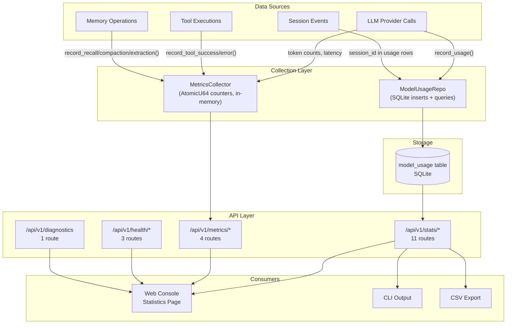
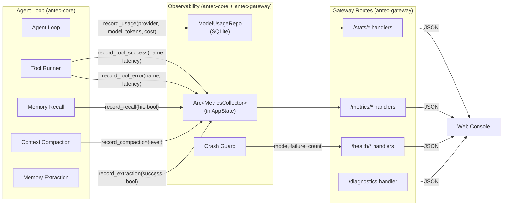

# 18 -- Statistics, Metrics & Observability

> **Crate**: `antec-core` (`crates/antec-core/`) and `antec-gateway` (`crates/antec-gateway/`)
> **Purpose**: Usage tracking, cost accounting, tool execution metrics, memory/retrieval statistics, budget management, health endpoints, diagnostics, and CSV export. All persistent data stored in SQLite; in-memory metrics via atomic counters. Queryable via REST API.

---

> **Module Goal:** Provide complete observability into Antec's operations — tracking LLM costs, token usage, tool performance, retrieval quality, system health, and budget controls — so users always know what their AI assistant is doing, how well it's performing, and how much it costs.

### Why This Module Exists

Running a personal AI assistant involves real costs (LLM API calls), performance concerns (tool latency, memory recall quality), and operational risks (service degradation, disk space). Without observability, users fly blind — they can't optimize costs, detect degradation, or understand usage patterns.

The Statistics & Metrics module provides:

- **Cost tracking** with per-provider, per-model, and per-day breakdowns — know exactly where money goes
- **Budget controls** with monthly limits and overage warnings — prevent surprise bills
- **Tool performance metrics** with success rates and latency tracking — identify bottlenecks
- **Retrieval quality metrics** tracking memory recall hit rates and compaction events — ensure the memory system works
- **System health monitoring** with liveness/readiness probes and diagnostics — catch problems early
- **CSV export** for external analysis and reporting

### Business Benefits

| Benefit | Description |
|---------|-------------|
| **Cost control** | Monthly budget limits with warnings prevent unexpected charges; routing savings show optimization value |
| **Performance visibility** | Tool error rates and latency metrics reveal bottlenecks before users notice |
| **Data sovereignty** | All metrics stored locally in SQLite — no telemetry sent externally |
| **Operational confidence** | Health checks, readiness probes, and diagnostics ensure system reliability |
| **Usage analytics** | Per-channel, per-model breakdowns inform capacity planning and optimization |
| **Audit readiness** | Usage records provide accountability trail for API consumption |

---

## 1. Architecture Overview

The observability system is composed of two distinct subsystems with different persistence characteristics:

1. **Persistent statistics** (`ModelUsageRepo` backed by the SQLite `model_usage` table) — survives restarts. Every LLM call is recorded as a row with provider, model, token counts, cost, latency, and routing mode. Aggregate queries (GROUP BY provider, model, day) power the `/api/v1/stats/*` endpoints.

2. **In-memory metrics** (`MetricsCollector` with `AtomicU64` counters) — reset on restart. Tool execution success/error counts, latency accumulators, and retrieval quality counters are maintained as lock-free atomics. These power the `/api/v1/metrics/*` endpoints.

Both subsystems are accessed through `AppState`, which holds an `Arc<MetricsCollector>` and a database connection pool for `ModelUsageRepo` queries.



### Key Design Decisions

- **Separation of concerns**: Persistent usage data (cost tracking, billing) is never lost on restart; ephemeral performance metrics (tool latency) are cheap to collect and acceptable to lose.
- **Lock-free collection**: `AtomicU64` counters in `MetricsCollector` avoid mutex contention on the hot path (every tool call, every memory recall).
- **SQL aggregation**: All cost/usage roll-ups happen in SQLite via GROUP BY queries, not in application code. This keeps the Rust side simple and lets SQLite's query optimizer do the work.

---

## 2. Database Schema

### model_usage table

Created by migration (initial schema). The `routing_mode` column was added in migration 017.

```sql
CREATE TABLE IF NOT EXISTS model_usage (
    id            INTEGER PRIMARY KEY AUTOINCREMENT,
    timestamp     INTEGER NOT NULL,
    provider      TEXT    NOT NULL,
    model         TEXT    NOT NULL,
    session_id    TEXT,
    input_tokens  INTEGER NOT NULL,
    output_tokens INTEGER NOT NULL,
    cost_usd      REAL,
    latency_ms    INTEGER,
    routing_mode  TEXT DEFAULT NULL  -- Added in migration 017
);

CREATE INDEX IF NOT EXISTS idx_model_usage_timestamp ON model_usage(timestamp);
```

#### Column Details

| Column | SQLite Type | Nullable | Description |
|--------|-------------|----------|-------------|
| `id` | INTEGER | No (PK) | Auto-incrementing primary key |
| `timestamp` | INTEGER | No | Unix timestamp (seconds since epoch) |
| `provider` | TEXT | No | Provider identifier: `"anthropic"`, `"openai"`, `"google"` |
| `model` | TEXT | No | Model identifier: `"claude-sonnet-4-20250514"`, `"gpt-4o"`, etc. |
| `session_id` | TEXT | Yes | Session that triggered the LLM call (NULL for system calls) |
| `input_tokens` | INTEGER | No | Number of tokens sent to the model |
| `output_tokens` | INTEGER | No | Number of tokens received from the model |
| `cost_usd` | REAL | Yes | Estimated cost in USD (NULL if pricing unknown) |
| `latency_ms` | INTEGER | Yes | Round-trip time in milliseconds |
| `routing_mode` | TEXT | Yes | `"simple"` or `"complex"` (NULL for non-routed / direct calls) |

#### Index Strategy

The `idx_model_usage_timestamp` index supports the most common query pattern: filtering by time range (`WHERE timestamp >= ?`). All aggregate endpoints accept a `days` parameter that translates to a `since_ts` lower bound.

---

## 3. Storage Models

All structs are defined in `antec-storage/src/models.rs`.

### 3.1 ModelUsageRow (lines 199-212)

The primary insert/read model. Maps 1:1 to the `model_usage` table.

| Field | Type | Description |
|-------|------|-------------|
| `id` | `Option<i64>` | Auto-increment PK (None on insert, Some on read) |
| `timestamp` | `i64` | Unix timestamp (seconds) |
| `provider` | `String` | Provider name, e.g. `"anthropic"`, `"openai"`, `"google"` |
| `model` | `String` | Model identifier, e.g. `"claude-sonnet-4-20250514"` |
| `session_id` | `Option<String>` | Session that triggered the call |
| `input_tokens` | `i64` | Tokens sent to the LLM |
| `output_tokens` | `i64` | Tokens received from the LLM |
| `cost_usd` | `Option<f64>` | Estimated cost in USD |
| `latency_ms` | `Option<i64>` | Round-trip time in milliseconds |
| `routing_mode` | `Option<String>` | `"simple"` or `"complex"` (None for direct calls) |

### 3.2 Aggregate Result Types

These structs are returned by `ModelUsageRepo` query methods. Each corresponds to a SQL GROUP BY pattern.

#### UsageByProvider

| Field | Type | Description |
|-------|------|-------------|
| `provider` | `String` | Provider name |
| `total_input` | `i64` | Sum of `input_tokens` |
| `total_output` | `i64` | Sum of `output_tokens` |
| `cost_usd` | `f64` | Sum of `cost_usd` |
| `call_count` | `i64` | COUNT(*) |

Used by: `GET /api/v1/stats/usage` (the `by_provider` array)

#### UsageByModel

| Field | Type | Description |
|-------|------|-------------|
| `model` | `String` | Model identifier |
| `total_input` | `i64` | Sum of `input_tokens` |
| `total_output` | `i64` | Sum of `output_tokens` |
| `cost_usd` | `f64` | Sum of `cost_usd` |
| `call_count` | `i64` | COUNT(*) |

Used by: `GET /api/v1/stats/usage` (the `by_model` array)

#### UsageByDay

| Field | Type | Description |
|-------|------|-------------|
| `date` | `String` | Date string (YYYY-MM-DD) |
| `total_input` | `i64` | Sum of `input_tokens` for this day |
| `total_output` | `i64` | Sum of `output_tokens` for this day |
| `cost_usd` | `f64` | Sum of `cost_usd` for this day |
| `call_count` | `i64` | COUNT(*) for this day |

Used by: `GET /api/v1/stats/usage` (the `by_day` array), `GET /api/v1/stats/csv`

#### TotalCost

| Field | Type | Description |
|-------|------|-------------|
| `total_cost_usd` | `f64` | Sum of all `cost_usd` in the period |
| `total_input` | `i64` | Sum of all `input_tokens` |
| `total_output` | `i64` | Sum of all `output_tokens` |
| `total_calls` | `i64` | COUNT(*) |

Used by: `GET /api/v1/stats/cost`, budget calculation

#### MessagesByChannel

| Field | Type | Description |
|-------|------|-------------|
| `channel` | `String` | Channel type (e.g. `"console"`, `"discord"`) |
| `message_count` | `i64` | Number of messages from this channel |

Used by: `GET /api/v1/stats/messages-by-channel`

#### ToolUsageCount

| Field | Type | Description |
|-------|------|-------------|
| `tool_name` | `String` | Tool identifier |
| `call_count` | `i64` | Number of executions |

Used by: `GET /api/v1/stats/tool-usage`

#### RoutingSavingsRow

| Field | Type | Description |
|-------|------|-------------|
| `simple_count` | `i64` | Calls routed to the "simple" model |
| `complex_count` | `i64` | Calls routed to the "complex" model |
| `simple_cost_usd` | `f64` | Actual cost of simple-routed calls |
| `complex_cost_usd` | `f64` | Actual cost of complex-routed calls |

Used by: `GET /api/v1/stats/routing-savings`

---

## 4. ModelUsageRepo Trait

Defined in `antec-storage`. Implemented against SQLite. All methods accept a `since_ts: i64` parameter (Unix timestamp) as the lower bound for time-filtered queries.

```rust
pub trait ModelUsageRepo {
    fn record_usage(&self, usage: &ModelUsageRow) -> Result<()>;
    fn usage_by_provider(&self, since_ts: i64) -> Result<Vec<UsageByProvider>>;
    fn usage_by_model(&self, since_ts: i64) -> Result<Vec<UsageByModel>>;
    fn usage_by_day(&self, since_ts: i64) -> Result<Vec<UsageByDay>>;
    fn total_cost(&self, since_ts: i64) -> Result<TotalCost>;
    fn session_count(&self, since_ts: i64) -> Result<i64>;
    fn messages_by_channel(&self, since_ts: i64) -> Result<Vec<MessagesByChannel>>;
    fn tool_usage_top(&self, since_ts: i64, limit: i64) -> Result<Vec<ToolUsageCount>>;
    fn routing_savings(&self, since_ts: i64) -> Result<RoutingSavingsRow>;
}
```

### Method SQL Patterns

#### record_usage

Inserts a single row into `model_usage`.

```sql
INSERT INTO model_usage (timestamp, provider, model, session_id, input_tokens, output_tokens, cost_usd, latency_ms, routing_mode)
VALUES (?1, ?2, ?3, ?4, ?5, ?6, ?7, ?8, ?9)
```

Called by the agent loop after every LLM provider response. The cost is calculated from the provider's pricing table before insertion.

#### usage_by_provider

Groups all usage by provider, summing tokens and cost.

```sql
SELECT provider,
       SUM(input_tokens) AS total_input,
       SUM(output_tokens) AS total_output,
       COALESCE(SUM(cost_usd), 0.0) AS cost_usd,
       COUNT(*) AS call_count
FROM model_usage
WHERE timestamp >= ?1
GROUP BY provider
ORDER BY cost_usd DESC
```

#### usage_by_model

Groups all usage by model, summing tokens and cost.

```sql
SELECT model,
       SUM(input_tokens) AS total_input,
       SUM(output_tokens) AS total_output,
       COALESCE(SUM(cost_usd), 0.0) AS cost_usd,
       COUNT(*) AS call_count
FROM model_usage
WHERE timestamp >= ?1
GROUP BY model
ORDER BY cost_usd DESC
```

#### usage_by_day

Groups usage by calendar day using SQLite's `date()` function on the Unix timestamp.

```sql
SELECT date(timestamp, 'unixepoch') AS date,
       SUM(input_tokens) AS total_input,
       SUM(output_tokens) AS total_output,
       COALESCE(SUM(cost_usd), 0.0) AS cost_usd,
       COUNT(*) AS call_count
FROM model_usage
WHERE timestamp >= ?1
GROUP BY date(timestamp, 'unixepoch')
ORDER BY date ASC
```

#### total_cost

Sums all cost and token metrics across the period.

```sql
SELECT COALESCE(SUM(cost_usd), 0.0) AS total_cost_usd,
       COALESCE(SUM(input_tokens), 0) AS total_input,
       COALESCE(SUM(output_tokens), 0) AS total_output,
       COUNT(*) AS total_calls
FROM model_usage
WHERE timestamp >= ?1
```

#### session_count

Counts distinct sessions that had LLM calls in the period.

```sql
SELECT COUNT(DISTINCT session_id)
FROM model_usage
WHERE timestamp >= ?1
  AND session_id IS NOT NULL
```

#### messages_by_channel

Joins against the sessions table to determine channel type, then groups by channel.

```sql
SELECT s.channel, COUNT(*) AS message_count
FROM model_usage u
JOIN sessions s ON u.session_id = s.id
WHERE u.timestamp >= ?1
GROUP BY s.channel
ORDER BY message_count DESC
```

#### tool_usage_top

Queries the `audit_log` table for tool execution events, grouped by tool name.

```sql
SELECT target AS tool_name, COUNT(*) AS call_count
FROM audit_log
WHERE action = 'tool_call'
  AND timestamp >= ?1
GROUP BY target
ORDER BY call_count DESC
LIMIT ?2
```

#### routing_savings

Uses conditional aggregation on `routing_mode` to separate simple vs complex costs.

```sql
SELECT
    COALESCE(SUM(CASE WHEN routing_mode = 'simple' THEN 1 ELSE 0 END), 0) AS simple_count,
    COALESCE(SUM(CASE WHEN routing_mode = 'complex' THEN 1 ELSE 0 END), 0) AS complex_count,
    COALESCE(SUM(CASE WHEN routing_mode = 'simple' THEN cost_usd ELSE 0.0 END), 0.0) AS simple_cost_usd,
    COALESCE(SUM(CASE WHEN routing_mode = 'complex' THEN cost_usd ELSE 0.0 END), 0.0) AS complex_cost_usd
FROM model_usage
WHERE timestamp >= ?1
  AND routing_mode IS NOT NULL
```

---

## 5. In-Memory MetricsCollector

**Location**: `antec-core/src/metrics.rs`

Thread-safe metrics collection using `AtomicU64` counters. Stored in `AppState` as `Arc<MetricsCollector>` and shared across all request handlers and the agent loop.

### 5.1 Internal Data Structures

#### ToolCounters (per tool)

Each registered tool gets its own set of atomic counters, stored in a `DashMap<String, ToolCounters>` (or equivalent concurrent map).

| Field | Type | Description |
|-------|------|-------------|
| `success_count` | `AtomicU64` | Number of successful executions |
| `error_count` | `AtomicU64` | Number of failed executions |
| `total_latency_ms` | `AtomicU64` | Cumulative execution time in milliseconds |

#### Retrieval Counters (global)

Flat atomic counters on the `MetricsCollector` struct itself.

| Field | Type | Description |
|-------|------|-------------|
| `recall_attempts` | `AtomicU64` | Total memory recall attempts |
| `recall_hits` | `AtomicU64` | Recalls that returned at least one result |
| `compaction_count` | `AtomicU64` | Total compaction events (all levels) |
| `compaction_l1` | `AtomicU64` | Level 1 (sliding window) compaction count |
| `compaction_l2` | `AtomicU64` | Level 2 (summary) compaction count |
| `compaction_l3` | `AtomicU64` | Level 3 (aggressive) compaction count |
| `extraction_attempts` | `AtomicU64` | Memory extraction attempts |
| `extraction_successes` | `AtomicU64` | Successful memory extractions |

### 5.2 Methods

| Method | Signature | Description |
|--------|-----------|-------------|
| `record_tool_success` | `(&self, tool_name: &str, latency_ms: u64)` | Increments `success_count` by 1, adds `latency_ms` to `total_latency_ms` |
| `record_tool_error` | `(&self, tool_name: &str, latency_ms: u64)` | Increments `error_count` by 1, adds `latency_ms` to `total_latency_ms` |
| `record_recall` | `(&self, hit: bool)` | Increments `recall_attempts` by 1; if `hit` is true, also increments `recall_hits` |
| `record_compaction` | `(&self, level: CompactionLevel)` | Increments `compaction_count` + the level-specific counter (`compaction_l1`, `l2`, or `l3`) |
| `record_extraction` | `(&self, success: bool)` | Increments `extraction_attempts`; if `success`, also increments `extraction_successes` |
| `snapshot` | `(&self) -> MetricsSnapshot` | Returns a point-in-time snapshot of all counters (reads all atomics with `Ordering::Relaxed`) |
| `tool_metrics` | `(&self, name: &str) -> Option<ToolMetrics>` | Returns computed metrics for a single tool, or `None` if tool not tracked |
| `reset` | `(&self)` | Stores 0 to all atomic counters. Used in tests |

### 5.3 Output Structs

#### ToolMetrics

Computed from `ToolCounters`. Returned by `tool_metrics()` and included in `MetricsSnapshot`.

| Field | Type | Description |
|-------|------|-------------|
| `tool_name` | `String` | Tool identifier |
| `success_count` | `u64` | Total successful executions |
| `error_count` | `u64` | Total failed executions |
| `total_count` | `u64` | `success_count + error_count` |
| `error_rate` | `f64` | `error_count / total_count` (0.0 if `total_count == 0`) |
| `avg_latency_ms` | `f64` | `total_latency_ms / total_count` (0.0 if `total_count == 0`) |
| `total_latency_ms` | `u64` | Cumulative latency |

#### RetrievalMetrics

Computed from the global retrieval counters.

| Field | Type | Description |
|-------|------|-------------|
| `recall_attempts` | `u64` | Total recall attempts |
| `recall_hits` | `u64` | Recalls with at least one result |
| `recall_hit_rate` | `f64` | `recall_hits / recall_attempts` (0.0 if no attempts) |
| `compaction_count` | `u64` | Total compaction events |
| `compaction_l1_count` | `u64` | Level 1 compactions |
| `compaction_l2_count` | `u64` | Level 2 compactions |
| `compaction_l3_count` | `u64` | Level 3 compactions |
| `extraction_attempts` | `u64` | Total extraction attempts |
| `extraction_successes` | `u64` | Successful extractions |
| `extraction_success_rate` | `f64` | `extraction_successes / extraction_attempts` (0.0 if no attempts) |

#### MetricsSnapshot

Top-level snapshot returned by `snapshot()` and serialized as the response to `GET /api/v1/metrics`.

| Field | Type | Description |
|-------|------|-------------|
| `tools` | `Vec<ToolMetrics>` | Per-tool metrics for all tracked tools |
| `retrieval` | `RetrievalMetrics` | Memory/retrieval quality metrics |
| `total_tool_executions` | `u64` | Sum of all `total_count` across tools |
| `overall_tool_error_rate` | `f64` | Sum of all errors / sum of all executions |

---

## 6. REST API Endpoints

All endpoints require authentication (see [03-GATEWAY.md](03-GATEWAY.md)). Time-filtered endpoints accept a `days` query parameter (default: 30) that is converted to a `since_ts` Unix timestamp: `now() - (days * 86400)`.

### 6.1 Stats Routes (`/api/v1/stats/*`)

| Route | Method | Handler | Query Params | Response |
|-------|--------|---------|-------------|----------|
| `/api/v1/stats/usage` | GET | `stats_usage` | `days` (default 30) | `{ by_provider: [UsageByProvider], by_model: [UsageByModel], by_day: [UsageByDay] }` |
| `/api/v1/stats/cost` | GET | `stats_cost` | `days` (default 30) | `{ total_cost_usd, total_input, total_output, total_calls }` |
| `/api/v1/stats/sessions` | GET | `stats_sessions` | `days` (default 30) | `{ active_sessions, total_sessions }` |
| `/api/v1/stats/system` | GET | `stats_system` | -- | `{ disk: { available, total }, process_memory_bytes, uptime_secs }` |
| `/api/v1/stats/messages-by-channel` | GET | `stats_messages_by_channel` | `days` (default 30) | `{ by_channel: [MessagesByChannel] }` |
| `/api/v1/stats/tool-usage` | GET | `stats_tool_usage` | `days` (default 30), `limit` (default 5) | `{ top_tools: [ToolUsageCount] }` |
| `/api/v1/stats/budget` | GET | `stats_budget` | -- | `{ monthly_limit_usd, current_month_cost, remaining, over_budget, warn }` |
| `/api/v1/stats/budget` | PUT | `put_stats_budget` | -- | Body: `{ monthly_limit_usd }` |
| `/api/v1/stats/csv` | GET | `stats_csv_export` | `days` (default 30) | CSV file download |
| `/api/v1/stats/routing-savings` | GET | `stats_routing_savings` | `days` (default 30) | `{ simple_count, complex_count, simple_cost_usd, complex_cost_usd, estimated_savings_usd }` |
| `/api/v1/stats` | GET | `stats_unified` | `days` (default 30) | Combined: usage + cost + sessions + system + tools |

### 6.2 Metrics Routes (`/api/v1/metrics/*`)

| Route | Method | Handler | Response |
|-------|--------|---------|----------|
| `/api/v1/metrics` | GET | `get_metrics` | Full `MetricsSnapshot` (tools + retrieval) |
| `/api/v1/metrics/tools` | GET | `get_metrics_tools` | `{ tools: [ToolMetrics], total_executions, error_rate }` |
| `/api/v1/metrics/tools/{name}` | GET | `get_metrics_tool` | Single `ToolMetrics` or 404 if tool not tracked |
| `/api/v1/metrics/retrieval` | GET | `get_metrics_retrieval` | `RetrievalMetrics` |

### 6.3 Health Routes

| Route | Method | Handler | Response |
|-------|--------|---------|----------|
| `/api/v1/health` | GET | `health` | `{ status, version, uptime_secs, memory_bytes, active_sessions }` |
| `/api/v1/health/live` | GET | `health_live` | `{ status: "alive" }` — always returns 200 |
| `/api/v1/health/ready` | GET | `health_ready` | `{ status, mode, failure_count }` — returns 503 if degraded |

#### Health Status Values

| Status | Meaning |
|--------|---------|
| `"ok"` | All providers reachable, SQLite writable, no active errors |
| `"degraded"` | At least one provider unreachable or non-critical subsystem in error state; system can still serve requests |
| `"error"` | Critical failure — SQLite unavailable or all providers down |

#### Readiness Probe Behavior

The `/api/v1/health/ready` endpoint integrates with the crash guard:

- **Normal mode**: Returns `200 OK` with `{ status: "ready", mode: "normal", failure_count: 0 }`
- **Degraded mode**: Returns `503 Service Unavailable` with `{ status: "not_ready", mode: "degraded", failure_count: N }`

### 6.4 Diagnostics Route

| Route | Method | Handler | Response |
|-------|--------|---------|----------|
| `/api/v1/diagnostics` | GET | `get_diagnostics` | `[DiagnosticCheck]` |

The diagnostics endpoint performs 5 system checks and returns an array of results:

#### Diagnostic Checks

| # | Check Name | What It Verifies | Warning Threshold |
|---|------------|-----------------|-------------------|
| 1 | **Configuration** | Validates `antec.toml` can be parsed and all required fields are present | Any parse error |
| 2 | **Data Directory** | Existence, write permissions, available disk space | < 100 MB free |
| 3 | **Database** | SQLite connectivity, schema version matches expected, `PRAGMA integrity_check` passes | Integrity errors |
| 4 | **Providers** | Checks for configured API key environment variables (e.g. `ANTHROPIC_API_KEY`) | Missing API keys |
| 5 | **Channels** | Lists configured channel types and their connection status | Disconnected channels |

#### DiagnosticCheck Response Shape

```json
{
    "name": "Database",
    "status": "ok",
    "message": "SQLite database accessible, schema version 17",
    "details": {
        "path": "/home/user/.antec/antec.db",
        "schema_version": 17,
        "integrity": "ok",
        "size_bytes": 2048576
    },
    "fix": null
}
```

| Field | Type | Description |
|-------|------|-------------|
| `name` | `String` | Human-readable check name |
| `status` | `String` | `"ok"`, `"warning"`, or `"error"` |
| `message` | `String` | Summary of the check result |
| `details` | `Value` | JSON object with check-specific details |
| `fix` | `Option<String>` | Suggested fix if status is warning or error |

---

## 7. Budget Management

### 7.1 Configuration

Budget limits are configured in `antec.toml`:

```toml
[budget]
monthly_limit_usd = 50.0
warn_on_overage = true
```

| Field | Type | Default | Description |
|-------|------|---------|-------------|
| `monthly_limit_usd` | `f64` | `50.0` | Maximum allowed spend per calendar month in USD |
| `warn_on_overage` | `bool` | `true` | Whether to emit a warning when the budget is exceeded |

### 7.2 Budget Calculation

The `GET /api/v1/stats/budget` endpoint calculates the current budget status:

1. **month_start**: First day of the current calendar month, midnight UTC, as a Unix timestamp
2. **current_month_cost**: `total_cost(since: month_start).total_cost_usd`
3. **remaining**: `monthly_limit_usd - current_month_cost`
4. **over_budget**: `remaining < 0.0`
5. **warn**: `warn_on_overage && over_budget`

#### Response Example

```json
{
    "monthly_limit_usd": 50.0,
    "current_month_cost": 32.47,
    "remaining": 17.53,
    "over_budget": false,
    "warn": false
}
```

### 7.3 Budget Update

The `PUT /api/v1/stats/budget` endpoint updates the monthly limit:

```json
{
    "monthly_limit_usd": 75.0
}
```

This updates the in-memory configuration and persists the change to `antec.toml` via the configuration hot-reload system (see [14-CONFIGURATION.md](14-CONFIGURATION.md)).

---

## 8. Routing Savings Analysis

The routing savings endpoint analyzes cost optimization from the heuristic model router (see [02-CORE.md](02-CORE.md) for routing logic).

### 8.1 How It Works

The model router classifies incoming messages as "simple" or "complex" and routes them to the appropriate model tier. Simple messages go to a cheaper model (e.g., `claude-haiku`); complex messages go to a more capable model (e.g., `claude-sonnet`).

The savings calculation answers: "How much did intelligent routing save compared to sending everything to the complex model?"

### 8.2 Calculation

```
estimated_savings_usd = complex_avg_cost_per_call * simple_count - simple_cost_usd
```

Where:
- `complex_avg_cost_per_call` = `complex_cost_usd / complex_count` (average cost of a complex-routed call)
- `simple_count` = number of calls routed to the simple model
- `simple_cost_usd` = actual total cost of simple-routed calls

This estimates what the simple calls would have cost if they had all been sent to the complex model, minus what they actually cost.

### 8.3 Response Example

```json
{
    "simple_count": 847,
    "complex_count": 203,
    "simple_cost_usd": 1.27,
    "complex_cost_usd": 14.83,
    "estimated_savings_usd": 60.60
}
```

---

## 9. CSV Export

### 9.1 Endpoint

`GET /api/v1/stats/csv?days=30`

### 9.2 Response Headers

```
Content-Type: text/csv
Content-Disposition: attachment; filename="antec-usage.csv"
```

### 9.3 Format

The CSV contains one row per day, sourced from `usage_by_day()`:

```csv
date,input_tokens,output_tokens,cost_usd,call_count
2026-03-01,45230,12847,1.23,15
2026-03-02,67891,23456,2.45,22
2026-03-03,12345,4567,0.67,8
```

| Column | Source | Description |
|--------|--------|-------------|
| `date` | `UsageByDay.date` | Calendar date (YYYY-MM-DD) |
| `input_tokens` | `UsageByDay.total_input` | Total input tokens for the day |
| `output_tokens` | `UsageByDay.total_output` | Total output tokens for the day |
| `cost_usd` | `UsageByDay.cost_usd` | Total cost for the day |
| `call_count` | `UsageByDay.call_count` | Number of LLM calls for the day |

---

## 10. System Metrics

System-level metrics gathered at runtime for the `/api/v1/stats/system` and `/api/v1/health` endpoints.

### 10.1 Process Memory

`get_process_memory() -> u64`

Returns the process's resident memory in bytes.

| Platform | Method |
|----------|--------|
| Linux | Reads `/proc/self/statm`, parses the second field (resident pages), multiplies by page size |
| macOS | Uses `sysctl` with `KERN_PROC` / `KERN_PROC_PID` to read `p_rssize` |

Falls back to 0 if the platform-specific call fails.

### 10.2 Disk Space

Two functions operate on the configured `data_dir`:

- `get_available_disk_space(path) -> u64` — available bytes on the filesystem containing `path`
- `get_total_disk_space(path) -> u64` — total bytes on the filesystem containing `path`

Both use `std::fs::metadata` and platform-specific `statvfs` (Unix) calls.

### 10.3 Uptime

The `AppState` stores `server_start_time: Instant` at startup. Uptime is calculated as:

```rust
let uptime_secs = state.server_start_time.elapsed().as_secs();
```

### 10.4 Active Sessions

```rust
let active_sessions = state.sessions.read().await.len();
```

Reads the session map (behind a `RwLock`) to count currently active sessions.

### 10.5 System Response Example

```json
{
    "disk": {
        "available": 107374182400,
        "total": 499963174912
    },
    "process_memory_bytes": 52428800,
    "uptime_secs": 86423
}
```

---

## 11. Integration Points

The observability system connects to multiple Antec subsystems. Data flows in from the agent loop, tool executor, and memory system; data flows out through the gateway API to the Web Console and CLI.



### Integration Call Sites

| Subsystem | Call Site | Metrics Method | Data Recorded |
|-----------|----------|---------------|---------------|
| Agent loop | After each LLM response | `ModelUsageRepo::record_usage()` | Provider, model, tokens, cost, latency, routing_mode |
| Tool executor | After successful tool execution | `MetricsCollector::record_tool_success()` | Tool name, execution latency |
| Tool executor | After failed tool execution | `MetricsCollector::record_tool_error()` | Tool name, execution latency |
| Memory recall | After each memory search | `MetricsCollector::record_recall()` | Whether any results were returned |
| Context compaction | After each compaction event | `MetricsCollector::record_compaction()` | Compaction level (L1, L2, L3) |
| Memory extraction | After auto-extraction attempt | `MetricsCollector::record_extraction()` | Whether extraction succeeded |
| Crash guard | On readiness probe | Reads `CrashGuard::mode()` | Normal vs degraded mode, failure count |
| AppState | At server startup | Stores `Instant::now()` | Server start time for uptime calculation |

### AppState Fields

The following fields in `AppState` support observability:

| Field | Type | Purpose |
|-------|------|---------|
| `metrics` | `Arc<MetricsCollector>` | Shared reference to in-memory metrics |
| `db` | Database connection pool | Used by `ModelUsageRepo` for persistent stats |
| `server_start_time` | `Instant` | Uptime calculation |
| `sessions` | `Arc<RwLock<HashMap<...>>>` | Active session count |
| `crash_guard` | `Arc<CrashGuard>` | Mode and failure count for readiness probe |
| `config` | `Arc<RwLock<Config>>` | Budget configuration (`monthly_limit_usd`) |

---

## References

- [01-ARCHITECTURE.md](01-ARCHITECTURE.md) -- Crate map, system overview
- [02-CORE.md](02-CORE.md) -- Agent loop, model routing, crash guard, context compaction
- [03-GATEWAY.md](03-GATEWAY.md) -- REST API route registration, authentication
- [05-MEMORY.md](05-MEMORY.md) -- Memory storage, recall, extraction, importance scoring
- [06-STORAGE.md](06-STORAGE.md) -- SQLite schema, migrations, connection pool
- [07-SECURITY.md](07-SECURITY.md) -- Audit logging, HMAC chain
- [14-CONFIGURATION.md](14-CONFIGURATION.md) -- TOML config, hot-reload
- [16-CONSOLE.md](16-CONSOLE.md) -- Statistics and Audit UI pages
