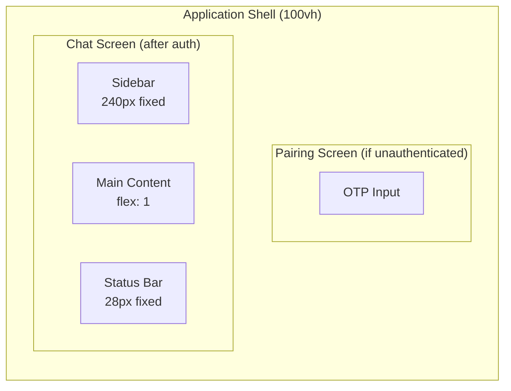
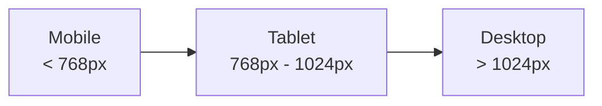

# 19 -- User Interface Specification

> **Module Goal:** Define the complete visual design system, component library, responsive layout rules, and accessibility requirements for Antec's web console -- a terminal-inspired dark monochrome interface built with vanilla HTML/CSS/JS and zero framework dependencies.

### Why This Module Exists

The web console is the primary visual interface for managing Antec. Without a rigorous UI specification, implementations drift toward inconsistent styling, accessibility gaps, and responsive breakage. This document serves as the single source of truth for every visual element -- from color tokens to component states to mobile adaptations.

The design philosophy is intentional: a monochrome dark palette with terminal aesthetics creates a distinctive, professional interface that stands apart from generic AI chat UIs. JetBrains Mono typography, dense information display, and minimal chrome put the focus on content and functionality. Color is reserved exclusively for status indicators (green/amber/red), ensuring maximum signal clarity.

### Business Benefits

| Benefit | Description |
|---------|-------------|
| **Distinctive identity** | Terminal-inspired monochrome design creates memorable, professional aesthetic |
| **Accessibility first** | WCAG 2.1 AA compliance with keyboard navigation, focus management, and screen reader support |
| **Zero dependencies** | CSS custom properties only -- no Tailwind, no SASS, no framework lock-in |
| **Responsive** | Three breakpoints (mobile/tablet/desktop) with mobile-first approach |
| **Consistent** | Design tokens ensure uniform spacing, typography, and colors across all 22 pages |
| **Maintainable** | All values in CSS variables -- theme changes require editing only the `:root` block |

---

## 1. Design Tokens

All design values are CSS custom properties defined in `:root`. No hardcoded values anywhere in the stylesheet.

### 1.1 Color Palette

```css
:root {
  /* Backgrounds (darkest to lightest) */
  --bg-primary:     #0a0a0a;    /* Main background, code blocks */
  --bg-secondary:   #141414;    /* Sidebar, headers, input areas, status bar */
  --bg-tertiary:    #1e1e1e;    /* Cards, modals, tool cards, memory items */
  --bg-elevated:    #282828;    /* Hover states, elevated buttons */

  /* Borders */
  --border-subtle:  #2a2a2a;    /* Dividers, inactive borders */
  --border-default: #3a3a3a;    /* Default borders, card outlines */
  --border-strong:  #505050;    /* Focus rings, hover borders, active states */

  /* Text */
  --text-primary:   #e8e8e8;    /* Main body text, headings */
  --text-secondary: #a0a0a0;    /* Labels, descriptions, nav items */
  --text-tertiary:  #6a6a6a;    /* Hints, placeholders, muted text */
  --text-inverse:   #0a0a0a;    /* Text on primary-colored backgrounds */

  /* Status indicators (ONLY color in the palette) */
  --status-ok:      #4ade80;    /* Success, connected, enabled, safe */
  --status-warn:    #fbbf24;    /* Warning, connecting, pending approval */
  --status-error:   #f87171;    /* Error, disconnected, dangerous, denied */
}
```

**Color Rules:**
- The interface is strictly monochrome (black/white/gray)
- Color is reserved ONLY for status indicators: green (#4ade80), amber (#fbbf24), red (#f87171)
- Two special-purpose accent colors exist for tool source badges only:
  - MCP source: `#6b8aff` (blue)
  - Skill source: `#b88fff` (purple)

### 1.2 Typography

```css
:root {
  --font-mono: 'JetBrains Mono', 'Fira Code', 'SF Mono', 'Consolas', monospace;

  --text-xs:  0.75rem;    /* 12px -- badges, timestamps, metadata */
  --text-sm:  0.875rem;   /* 14px -- base text size, body copy */
  --text-md:  1rem;       /* 16px -- headings, emphasis */
  --text-lg:  1.25rem;    /* 20px -- page titles, OTP input */
  --text-xl:  1.5rem;     /* 24px -- logo, hero text */
}
```

**Typography Rules:**
- ALL text uses `--font-mono` -- no sans-serif anywhere
- Base font size: `--text-sm` (14px)
- Font smoothing: `-webkit-font-smoothing: antialiased`
- Line height: 1.5 for body text, 1.6 for messages
- Letter spacing: 0.05em for uppercase labels, 0.1em for logo and nav group labels, 0.3em for OTP input

### 1.3 Spacing Scale

```css
:root {
  --space-1: 0.25rem;   /* 4px  -- tight gaps, badge padding */
  --space-2: 0.5rem;    /* 8px  -- standard gap, small padding */
  --space-3: 0.75rem;   /* 12px -- card padding, input padding */
  --space-4: 1rem;      /* 16px -- section padding, page margins */
  --space-6: 1.5rem;    /* 24px -- group spacing */
  --space-8: 2rem;      /* 32px -- page-level spacing, large gaps */
}
```

### 1.4 Border Radius

```css
:root {
  --radius-sm: 4px;    /* Badges, small elements, allowlist entries */
  --radius-md: 6px;    /* Buttons, inputs, cards, modals */
  --radius-lg: 8px;    /* Message bubbles, mobile bottom sheets */
}
```

### 1.5 Transitions

```css
:root {
  --transition: 150ms ease;   /* Standard transition for all interactive elements */
}
```

Additional specific transitions:
- Voice pulse animation: 1.2s ease-in-out infinite
- Mobile bottom sheet: 0.3s ease
- Toggle switch: 0.2s (background and transform)
- Streaming cursor blink: 1s step-end infinite

### 1.6 Z-Index Layers

| Layer | Z-Index | Elements |
|-------|---------|----------|
| Base | 0 | Page content, messages, cards |
| Sticky | 10 | Chat input area |
| Mobile tabs | 100 | Bottom tab bar, context bottom sheet |
| Sidebar overlay | 199 | Mobile backdrop behind sidebar |
| Sidebar (mobile) | 200 | Sidebar panel when open on mobile |
| Command palette | 9999 | Command palette overlay and panel |
| Skip-to-content | 9999 | Accessibility skip link on focus |

---

## 2. Global Styles

### 2.1 Reset & Base

```css
*, *::before, *::after {
  box-sizing: border-box;
  margin: 0;
  padding: 0;
}

html, body {
  height: 100%;
  font-family: var(--font-mono);
  font-size: var(--text-sm);
  background: var(--bg-primary);
  color: var(--text-primary);
  -webkit-font-smoothing: antialiased;
}
```

### 2.2 Hidden Elements

```css
[hidden] { display: none !important; }
```

### 2.3 Focus Styles

```css
:focus-visible {
  outline: 2px solid var(--border-strong);
  outline-offset: 2px;
}
```

### 2.4 Scrollbar

```css
::-webkit-scrollbar { width: 6px; }
::-webkit-scrollbar-track { background: transparent; }
::-webkit-scrollbar-thumb { background: var(--border-default); border-radius: 3px; }
::-webkit-scrollbar-thumb:hover { background: var(--border-strong); }
```

### 2.5 Reduced Motion

```css
@media (prefers-reduced-motion: reduce) {
  *, *::before, *::after {
    animation-duration: 0.01ms !important;
    animation-iteration-count: 1 !important;
    transition-duration: 0.01ms !important;
    scroll-behavior: auto !important;
  }
}
```

### 2.6 Accessibility: Skip-to-Content

```css
.skip-to-content {
  position: absolute;
  top: -100%;
  left: var(--space-2);
  z-index: 9999;
  padding: var(--space-2) var(--space-4);
  background: var(--bg-elevated);
  border: 1px solid var(--border-default);
  color: var(--text-primary);
}
.skip-to-content:focus {
  top: var(--space-2);
}
```

---

## 3. Layout Structure

### 3.1 Application Shell



The application has two main screens:
1. **Pairing Screen** -- centered OTP input, shown before authentication
2. **Chat Screen** -- sidebar + main content + status bar, shown after pairing

### 3.2 Sidebar

- Width: **240px** (fixed, `flex-shrink: 0`)
- Background: `var(--bg-secondary)`
- Border-right: `1px solid var(--border-subtle)`
- Contains: logo, navigation groups, nav items, logout button
- Overflow-y: auto (scrollable when content exceeds height)

#### Sidebar Logo
- Font-size: `var(--text-xl)` (1.5rem)
- Font-weight: 700
- Letter-spacing: 0.1em
- Text: "ANTEC" with "ANT" in `var(--status-error)` red, "EC" in `var(--text-primary)` white

#### Navigation Groups
- Label: `var(--text-xs)`, uppercase, letter-spacing: 0.1em, color: `var(--text-tertiary)`
- Groups: CHAT, CONTROL, AGENT, SETTINGS

#### Navigation Items
- Padding: `var(--space-2) var(--space-4)`
- Color: `var(--text-secondary)` (default), `var(--text-primary)` (hover/active)
- Active state: background `var(--bg-tertiary)`, left border: `2px solid var(--text-primary)`
- Icon: 16px wide, `var(--text-xs)` font-size
- Hover: background `var(--bg-tertiary)`
- Logout item: at bottom, color `var(--text-tertiary)`, hover color `var(--status-error)`

### 3.3 Main Content Area

- `flex: 1`, `min-width: 0` (allows flex-shrinking)
- Flex-direction: column
- Contains: page header + page content
- Overflow: hidden (individual pages handle their own scrolling)

#### Page Header
- Background: `var(--bg-secondary)`
- Padding: `var(--space-3) var(--space-4)`
- Border-bottom: `1px solid var(--border-subtle)`
- Title: `var(--text-md)`, font-weight: 600

### 3.4 Status Bar
- Height: **28px** (fixed)
- Background: `var(--bg-secondary)`
- Border-top: `1px solid var(--border-subtle)`
- Font-size: `var(--text-xs)`, color: `var(--text-tertiary)`
- Contains: connection status, model name, token count, session ID
- Hidden on mobile

### 3.5 Navigation Structure (22 Pages)

| Group | Page | Route | Icon |
|-------|------|-------|------|
| **CHAT** | Chat | `#chat` | speech bubble |
| | Sessions | `#sessions` | list |
| **CONTROL** | Tools | `#tools` | wrench |
| | Memory | `#memory` | brain |
| | Scheduler | `#scheduler` | clock |
| | Workspace | `#workspace` | folder |
| | REPL | `#repl` | terminal |
| | Skills | `#skills` | puzzle |
| | Agents | `#agents` | users |
| | Parallel | `#parallel` | parallel arrows |
| | Channels | `#channels` | radio |
| | Extensions | `#extensions` | plug |
| | Hands | `#hands` | hand |
| | MCP | `#mcp` | connector |
| **AGENT** | Persona | `#persona` | mask |
| | Behaviors | `#behaviors` | sliders |
| | Models | `#models` | CPU |
| **SETTINGS** | Settings | `#settings` | gear |
| | Security | `#security` | shield |
| | Audit | `#audit` | scroll |
| | Help | `#help` | question mark |
| | About | `#about` | info |

---

## 4. Component Library

### 4.1 Buttons

#### Base Button
```css
.btn {
  font-family: var(--font-mono);
  font-size: var(--text-sm);
  padding: var(--space-2) var(--space-6);
  border: 1px solid var(--border-default);
  border-radius: var(--radius-md);
  background: transparent;
  color: var(--text-primary);
  cursor: pointer;
  transition: all var(--transition);
}
.btn:hover {
  background: var(--bg-tertiary);
  border-color: var(--border-strong);
}
.btn:focus-visible {
  outline: 2px solid var(--border-strong);
  outline-offset: 2px;
}
```

#### Button Variants

| Variant | Background | Color | Border | Hover |
|---------|-----------|-------|--------|-------|
| `.btn` (default) | transparent | `--text-primary` | `--border-default` | bg: `--bg-tertiary` |
| `.btn-primary` | `--text-primary` | `--text-inverse` | `--text-primary` | bg: `--text-secondary` |
| `.btn-approve` | transparent | `--status-ok` | `--status-ok` | bg: `rgba(74,222,128,0.1)` |
| `.btn-deny` | transparent | `--status-error` | `--status-error` | bg: `rgba(248,113,113,0.1)` |
| `.btn-warn` | transparent | `--status-warn` | `--status-warn` | -- |
| `.btn-danger` | transparent | `--status-error` | `--status-error` | -- |
| `.btn-cancel` | transparent | `--status-error` | `--status-error` | bg: `rgba(248,113,113,0.1)` |

#### Button Sizes

| Size | Padding | Font-size |
|------|---------|-----------|
| `.btn` (default) | `var(--space-2) var(--space-6)` | `var(--text-sm)` |
| `.btn-sm` | `var(--space-1) var(--space-3)` | `var(--text-xs)` |
| `.btn-xs` | `2px 6px` | `11px` |

#### Icon Buttons
- `.btn-send`, `.btn-cancel`, `.btn-attach`: 38x38px square, centered content
- `.btn-voice`: 38x38px, with `.voice-active` state (red color, pulse animation), `.voice-unsupported` (opacity: 0.3, pointer-events: none)

### 4.2 Form Inputs

#### Text Input
```css
input, textarea {
  font-family: var(--font-mono);
  font-size: var(--text-sm);
  padding: var(--space-2) var(--space-3);
  background: var(--bg-tertiary);
  color: var(--text-primary);
  border: 1px solid var(--border-default);
  border-radius: var(--radius-md);
}
input:focus, textarea:focus {
  border-color: var(--border-strong);
  outline: none;
}
input::placeholder {
  color: var(--text-tertiary);
}
```

#### Select / Dropdown
```css
select {
  font-family: var(--font-mono);
  font-size: var(--text-xs);
  background: var(--bg-tertiary);
  color: var(--text-primary);
  border: 1px solid var(--border-default);
  border-radius: var(--radius-sm);
  padding: var(--space-1) var(--space-2);
}
```

#### Toggle Switch
```css
.tool-toggle { width: 36px; height: 20px; position: relative; display: inline-block; }
.toggle-slider {
  position: absolute; inset: 0;
  background: var(--bg-tertiary);
  border-radius: 10px;
  transition: background 0.2s;
}
.toggle-slider::before {
  content: ''; position: absolute;
  left: 2px; top: 2px;
  width: 16px; height: 16px;
  background: var(--text-primary);
  border-radius: 50%;
  transition: transform 0.2s;
}
input:checked + .toggle-slider { background: var(--status-ok); }
input:checked + .toggle-slider::before { transform: translateX(16px); }
```

### 4.3 Cards

#### Base Card Pattern
```css
.card {
  background: var(--bg-tertiary);
  border: 1px solid var(--border-subtle);
  border-radius: var(--radius-md);
  padding: var(--space-3);
}
.card:hover {
  background: var(--bg-elevated);  /* optional, for interactive cards */
}
```

Used by: session items, memory items, tool items, agent cards, skill cards, provider cards, stats cards, help cards.

#### Tool Card (Collapsible)
- Header: flex row, gap `var(--space-2)`, cursor: pointer, font-size: `var(--text-xs)`
- Status dot: 8x8px circle -- `var(--status-warn)` (running), `var(--status-ok)` (done), `var(--status-error)` (error)
- Body: hidden by default, `display: block` when `.open`, max-height: 200px, overflow-y: auto

#### Approval Card
- Border: `1px solid var(--status-warn)` (amber border)
- Header: `var(--status-warn)` color, font-weight: 600
- Actions: flex row with approve/deny buttons
- Detail rows: label (60px min-width, `var(--text-tertiary)`) + value

#### Agent Card
- Grid layout: `repeat(auto-fill, minmax(320px, 1fr))`
- Default agent: `border-color: var(--border-default)` (slightly highlighted)
- Disabled agent: `opacity: 0.6`
- Name: font-weight: 600, `var(--text-sm)`
- Status indicators: `.status-ok` green, `.status-off` `var(--text-tertiary)`

#### Stats Card
- Label: `var(--text-xs)`, `var(--text-secondary)`
- Value: font-weight: 600, `var(--text-lg)` (large number display)

### 4.4 Badges

#### Risk Classification Badges
```css
.risk-badge {
  font-size: var(--text-xs);
  padding: var(--space-1) var(--space-2);
  border-radius: var(--radius-sm);
  border: 1px solid;
  white-space: nowrap;
}
.risk-safe     { color: var(--status-ok);    border-color: var(--status-ok); }
.risk-moderate { color: var(--status-warn);  border-color: var(--status-warn); }
.risk-dangerous{ color: var(--status-error); border-color: var(--status-error); }
```

#### Source Badges
```css
.source-native { color: var(--text-secondary); border-color: var(--border-subtle); }
.source-mcp    { color: #6b8aff;              border-color: #6b8aff; }
.source-skill  { color: #b88fff;              border-color: #b88fff; }
```

#### Provider Status Badges
```css
.provider-status-configured  { background: rgba(74,222,128,0.12);  color: var(--status-ok); }
.provider-status-available   { background: rgba(251,191,36,0.12);  color: var(--status-warn); }
.provider-status-unconfigured{ background: var(--bg-secondary);     color: var(--text-tertiary); }
```

#### General Badges
- Agent badge: font-size: 10px, uppercase, letter-spacing: 0.05em, border: `1px solid var(--border-subtle)`
- Model badge: font-size: 10px, `var(--bg-secondary)` background, `var(--text-secondary)` color
- Phase badge: `var(--bg-tertiary)` background, `var(--radius-sm)` border-radius

### 4.5 Status Indicators

#### Connection Dot (8x8px circle)
```css
.status-indicator {
  width: 8px; height: 8px;
  border-radius: 50%;
  background: var(--status-ok);
}
.status-indicator.disconnected { background: var(--status-error); }
.status-indicator.connecting   { background: var(--status-warn); }
```

#### Channel Status Dot
Same 8x8px pattern, classes: `.status-ok`, `.status-warn`, `.status-error`

### 4.6 Modals

```css
.modal-overlay {
  position: fixed; inset: 0;
  background: rgba(0,0,0,0.5);
  display: flex;
  align-items: center;
  justify-content: center;
}
.modal {
  background: var(--bg-secondary);
  border: 1px solid var(--border-default);
  border-radius: var(--radius-md);
  max-width: 560px;
  width: 90%;
  max-height: 80vh;
  display: flex;
  flex-direction: column;
}
.modal-header {
  padding: var(--space-3) var(--space-4);
  border-bottom: 1px solid var(--border-subtle);
  display: flex;
  align-items: center;
  justify-content: space-between;
}
.modal-body {
  padding: var(--space-3) var(--space-4);
  overflow-y: auto;
}
.modal-footer {
  padding: var(--space-3) var(--space-4);
  border-top: 1px solid var(--border-subtle);
  display: flex;
  gap: var(--space-2);
  justify-content: flex-end;
}
```

Skill editor modal is wider: `max-width: 800px`, with split panes (flex row, each `flex: 1`).

### 4.7 Command Palette

Triggered by **Ctrl+K** (or Cmd+K on macOS).

```css
.command-palette-overlay {
  position: fixed; inset: 0;
  background: rgba(0,0,0,0.5);
  display: flex;
  align-items: flex-start;
  justify-content: center;
  padding-top: 25vh;
  z-index: 9999;
}
.command-palette {
  width: 90vw; max-width: 500px;
  background: var(--bg-secondary);
  border: 1px solid var(--border-default);
  border-radius: var(--radius-md);
  box-shadow: 0 10px 40px rgba(0,0,0,0.5);
}
.command-palette-input {
  width: 100%;
  padding: var(--space-3) var(--space-4);
  border: none;
  border-bottom: 1px solid var(--border-subtle);
  background: var(--bg-secondary);
  color: var(--text-primary);
  font-family: var(--font-mono);
  font-size: var(--text-sm);
}
.command-palette-results { max-height: 400px; overflow-y: auto; }
```

---

## 5. Chat Interface

### 5.1 Message List
- Container: `flex: 1`, `overflow-y: auto`, padding: `var(--space-4)`
- Messages stacked vertically with `gap: var(--space-3)`

### 5.2 Message Bubbles

| Type | Alignment | Background | Border | Max Width |
|------|-----------|-----------|--------|-----------|
| User | `flex-end` (right) | `--bg-elevated` | `--border-default` | 80% |
| Assistant | `flex-start` (left) | `--bg-secondary` | `--border-subtle` | 80% |
| Tool | `flex-start` (left) | `--bg-tertiary` | `--border-subtle` | 90% |

All messages: padding `var(--space-3) var(--space-4)`, border-radius: `var(--radius-lg)`, line-height: 1.6, word-wrap: break-word.

Role label: `var(--text-xs)`, uppercase, letter-spacing: 0.05em, color: `var(--text-tertiary)`, displayed as block above message text.

### 5.3 Markdown Rendering (Assistant Messages)

| Element | Styles |
|---------|--------|
| `pre` | bg: `--bg-primary`, border: `--border-subtle`, padding: `--space-3`, overflow-x: auto |
| `code` (inline) | bg: `--bg-tertiary`, padding: 1px 4px, border-radius: 2px, font-size: 0.9em |
| `h1` | font-size: `--text-lg`, font-weight: 600 |
| `h2` | font-size: `--text-md`, font-weight: 600 |
| `h3` | font-size: `--text-sm`, font-weight: 600 |
| `table` | border-collapse: collapse, font-size: `--text-xs` |
| `th` | bg: `--bg-tertiary`, font-weight: 600, border: `--border-default` |
| `td` | border: `--border-default`, padding: `--space-1 --space-2` |
| `blockquote` | border-left: 2px solid `--border-default`, padding-left: `--space-3`, color: `--text-secondary` |
| `a` | color: `--text-primary`, underline, text-underline-offset: 2px |
| `ul, ol` | padding-left: `--space-6` |

### 5.4 Streaming Indicator

```css
.streaming::after {
  content: '\2588';  /* Unicode block character */
  animation: blink 1s step-end infinite;
}
@keyframes blink {
  50% { opacity: 0; }
}
```

### 5.5 Chat Input Area

- Background: `var(--bg-secondary)`, border-top: `1px solid var(--border-subtle)`
- Form: flex row, `gap: var(--space-2)`, align-items: flex-end
- Textarea: flex: 1, min-height: 38px, max-height: 200px, resize: none
- Send button: 38x38px square
- Attachment button: 38x38px square
- Voice button: 38x38px square with recording state animation

### 5.6 Context Panel (Chat Sidebar)

- Width: 240px, right side of chat
- Background: `var(--bg-secondary)`, border-left: `1px solid var(--border-subtle)`
- Sections: active memories, active behaviors, context window usage, model info
- Hidden on mobile -- replaced by bottom sheet

### 5.7 Compacted Message Range

```css
.compacted-range {
  background: rgba(148,163,184,0.08);
  border: 1px solid rgba(148,163,184,0.2);
  border-radius: var(--radius-sm);
  cursor: pointer;
  font-size: var(--text-xs);
  color: var(--text-secondary);
}
.compacted-body {
  display: none;
  max-height: 200px;
  overflow-y: auto;
}
.compacted-body.open { display: block; }
```

---

## 6. Pairing Screen

Shown before authentication:
- Centered container, max-width: 360px, padding: `var(--space-8)`
- Logo: "ANTEC" text, font-weight: 700, letter-spacing: 0.1em
- Description: `var(--text-secondary)` text explaining the pairing process
- OTP input: full width, font-size: `var(--text-lg)`, letter-spacing: 0.3em, text-align: center
- Submit button: `.btn-primary`, full width
- Error display: `var(--status-error)` color

---

## 7. Responsive Breakpoints

### 7.1 Three Breakpoints



### 7.2 Mobile (max-width: 768px)

| Change | Value |
|--------|-------|
| Sidebar | Hidden, slides in from left as overlay (z-index: 200, width: 280px) |
| Sidebar backdrop | `rgba(0,0,0,0.5)`, z-index: 199, position: fixed |
| Sidebar toggle | Visible (hamburger button in header) |
| Status bar | Hidden |
| Mobile tab bar | Visible at bottom (position: fixed, z-index: 100) |
| Main content | padding-bottom: 52px (space for tab bar) |
| Message max-width | 95% (vs 80% desktop) |
| Chat padding | `var(--space-2)` (vs `var(--space-4)` desktop) |
| Context panel | Hidden, replaced by bottom sheet (40vh max-height, slides up) |
| Modals | width: 95vw, max-height: 90vh |
| Touch targets | All interactive elements min 44px |
| Focus ring | 2px solid `var(--text-primary)` with 2px offset |
| Viewport | Uses `dvh` (dynamic viewport height) for keyboard support |

#### Mobile Tab Bar
```css
.mobile-tabs {
  position: fixed; bottom: 0; left: 0; right: 0;
  background: var(--bg-secondary);
  border-top: 1px solid var(--border-subtle);
  z-index: 100;
  display: flex;
}
.mobile-tab {
  flex: 1;
  display: flex;
  flex-direction: column;
  align-items: center;
  gap: 2px;
  padding: var(--space-1);
  color: var(--text-tertiary);
  font-size: var(--text-xs);
}
.mobile-tab.active { color: var(--text-primary); }
.tab-icon { font-size: var(--text-md); }
.tab-label { font-size: 0.625rem; }
```

#### Mobile Context Bottom Sheet
```css
.mobile-context-sheet {
  position: fixed;
  bottom: 52px;
  left: 0; right: 0;
  max-height: 40vh;
  background: var(--bg-secondary);
  border-radius: var(--radius-lg) var(--radius-lg) 0 0;
  transition: transform 0.3s ease;
  transform: translateY(100%);
}
.mobile-context-sheet.open { transform: translateY(0); }
.sheet-handle {
  width: 40px; height: 4px;
  background: var(--border-default);
  border-radius: 2px;
  margin: var(--space-1) auto var(--space-3);
  cursor: grab;
}
```

### 7.3 Desktop (min-width: 1024px)

| Change | Value |
|--------|-------|
| Chat padding | `var(--space-6) var(--space-8)` (wider margins) |
| Message max-width | 70% (narrower, more readable) |

---

## 8. Animations

| Animation | Keyframes | Duration | Timing | Usage |
|-----------|-----------|----------|--------|-------|
| Streaming cursor | `blink: 50% { opacity: 0 }` | 1s | step-end infinite | Active LLM response |
| Voice recording | `voice-pulse: 50% { opacity: 0.5 }` | 1.2s | ease-in-out infinite | Active voice recording |
| Reduced motion | All animations: 0.01ms duration | -- | -- | `prefers-reduced-motion: reduce` |

---

## 9. Page-Specific Layouts

### 9.1 Sessions Page
- List: flex column, gap `var(--space-2)`, padding `var(--space-4)`
- Session item: flex row (space-between), padding `var(--space-3) var(--space-4)`, border: `--border-subtle`, cursor: pointer
- Delete button: hidden until parent hover, color: `var(--text-tertiary)`, hover: `#c00`

### 9.2 Settings Page
- Groups with uppercase titles (font-weight: 600, letter-spacing: 0.05em)
- Setting rows: flex (space-between), border-bottom: `--border-subtle`, font-size: `var(--text-xs)`
- Keys: `var(--text-secondary)`, values: `var(--text-primary)` right-aligned

### 9.3 Tools Page
- Tool items: flex row (space-between), padding `var(--space-3) var(--space-4)`, border: `--border-subtle`
- Disabled tools: `opacity: 0.5`
- Risk and source badges inline
- Toggle switch for enable/disable
- "Try" button opens modal with form fields + result output

### 9.4 Memory Page
- Toolbar: search input (flex: 1) + filter select + add button
- Memory items: cards with category, content, tags, importance score
- Add form: bg `--bg-tertiary`, with inputs for key, content, category, tags

### 9.5 Workspace Page
- Split layout: tree panel (240px, left) + editor (flex: 1, right)
- Tree items: min-height: 28px, cursor: pointer, file/folder icons
- Editor: full-width textarea, line-height: 1.5, no border on focus

### 9.6 REPL Page
- Split layout: output (flex: 1, top) + input bar (bottom)
- Language selector: dropdown (js/python)
- Output: monospace, line-height: 1.6, overflow-y: auto
- Input: resizable textarea, min-height: 44px

### 9.7 Agents Page
- Grid: `repeat(auto-fill, minmax(320px, 1fr))`
- Agent cards with name, description, status, tools list, model info

### 9.8 Models Page
- Config grid: `grid-template-columns: 160px 1fr auto`
- Provider cards with status badges
- Model instance cards with default indicator (green border)

### 9.9 Help Page
- Cards grid: `repeat(auto-fill, minmax(280px, 1fr))`
- Card: bg `--bg-elevated`, border `--border-default`, padding `--space-4`

### 9.10 About Page
- Centered layout, max-width: 600px
- Large logo: 3rem, "ANT" red + "EC" white
- Subtitle: `var(--text-tertiary)`
- Story section with headings and paragraphs

---

## 10. Accessibility Requirements

### 10.1 WCAG 2.1 AA Compliance

| Requirement | Implementation |
|-------------|---------------|
| Color contrast | Minimum 4.5:1 ratio for normal text, 3:1 for large text |
| Focus indicators | 2px solid outline on all interactive elements via `:focus-visible` |
| Keyboard navigation | All functionality accessible via keyboard (Tab, Enter, Escape, Arrow keys) |
| Skip-to-content | Link visible on focus, targets `#messages` |
| Screen reader | Proper ARIA labels on all interactive elements |
| Reduced motion | All animations disabled when `prefers-reduced-motion: reduce` |
| Touch targets | Minimum 44x44px on mobile |
| Semantic HTML | Proper heading hierarchy, landmark regions, form labels |

### 10.2 Keyboard Shortcuts

| Shortcut | Action |
|----------|--------|
| `Ctrl+K` / `Cmd+K` | Open command palette |
| `Escape` | Close modal, command palette, or mobile sidebar |
| `Enter` | Send message (in chat input) |
| `Shift+Enter` | New line in chat input |
| `Tab` | Navigate between focusable elements |

### 10.3 ARIA Patterns

- Navigation: `role="navigation"`, `aria-label="Main navigation"`
- Chat messages: `role="log"`, `aria-live="polite"` for new messages
- Modals: `role="dialog"`, `aria-modal="true"`, `aria-labelledby`
- Toggle switches: `role="switch"`, `aria-checked`
- Status indicators: `aria-label` describing current state
- Loading states: `aria-busy="true"`

---

## 11. Icon System

Icons use inline SVG elements for zero-dependency rendering, sized at 16x16px by default. All icons are monochrome using `currentColor` for fill/stroke, inheriting the text color of their container.

No icon library is loaded -- all icons are embedded directly in the HTML.

---

## 12. Internationalization (i18n) in UI

All user-facing text uses `data-i18n` attributes:
```html
<span data-i18n="nav.chat">Chat</span>
```

The JavaScript i18n engine:
1. Fetches locale data from `GET /api/v1/config/locale`
2. Queries all `[data-i18n]` elements
3. Replaces `textContent` with translated string
4. Falls back to English if key not found
5. Re-runs on locale change via `PUT /api/v1/config`

Supported locales: **EN** (English), **PL** (Polish)
