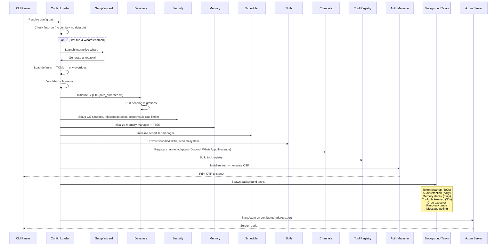
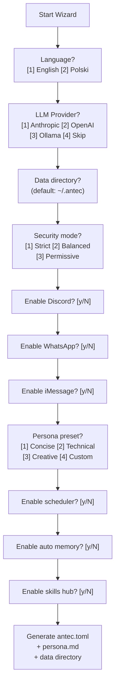
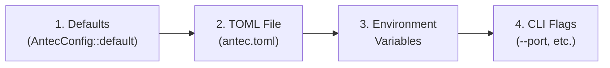

# Command-Line Interface (CLI)

> **Module Goal:** Provide a comprehensive command-line interface for managing every aspect of Antec — from server startup and first-run wizard to secret management, skill development, memory operations, cron scheduling, health diagnostics, and interactive code evaluation — all through a single `antec` binary with intuitive subcommands.

### Why This Module Exists

While the web console provides visual management, power users and automation scripts need command-line access. System administrators deploying Antec in containers need CLI tools for health checks and configuration. Skill developers need scaffolding, building, and testing commands. The CLI ensures every system capability is accessible without a browser.

The CLI is built with Clap (derive macros) for argument parsing, providing automatic help text, shell completions, and environment variable fallback. It follows Unix conventions: exit code 0 for success, 1 for errors, structured JSON output via `--json` flags, and stdin/stdout piping support.

### Business Benefits

| Benefit | Description |
|---------|-------------|
| **Complete control** | Every system feature accessible from the command line — no browser required |
| **Automation-friendly** | Structured output formats (JSON, CSV) enable scripting and CI/CD integration |
| **Developer workflow** | Skill scaffolding, building, testing, and publishing from the terminal |
| **Container-ready** | Health checks, diagnostics, and configuration via CLI for container orchestration |
| **First-run wizard** | Interactive guided setup eliminates manual config file editing |
| **Offline capable** | Secret management, memory export/import, and skill creation work without a running server |

---

## 1. Binary & Global Options

**Binary**: `antec`
**Version**: 0.1.0
**About**: "Self-hosted personal AI assistant"

```
USAGE: antec [OPTIONS] [COMMAND]
```

### Global Options

| Flag | Short | Long | Type | Default | Description |
|------|-------|------|------|---------|-------------|
| Config | `-c` | `--config` | PathBuf | `~/.antec/antec.toml` | Path to configuration file |
| No Wizard | — | `--no-wizard` | bool | false | Skip the first-run setup wizard |

If no command is specified, defaults to `serve`.

---

## 2. Commands Overview

```mermaid
graph TD
    ANTEC["antec"] --> SERVE["serve<br/>(default)"]
    ANTEC --> CHAT["chat"]
    ANTEC --> SECRET["secret"]
    ANTEC --> SKILL["skill"]
    ANTEC --> MEMORY["memory"]
    ANTEC --> CRON["cron"]
    ANTEC --> EXPORT["export"]
    ANTEC --> DOCTOR["doctor"]
    ANTEC --> PROVIDER["provider"]
    ANTEC --> REPL["repl"]

    SECRET --> S_SET["set"]
    SECRET --> S_GET["get"]
    SECRET --> S_LIST["list"]
    SECRET --> S_DEL["delete"]

    SKILL --> SK_LIST["list"]
    SKILL --> SK_ENABLE["enable"]
    SKILL --> SK_DISABLE["disable"]
    SKILL --> SK_IMPORT["import"]
    SKILL --> SK_CREATE["create"]
    SKILL --> SK_REMOVE["remove"]
    SKILL --> SK_SHOW["show"]
    SKILL --> SK_EDIT["edit"]
    SKILL --> SK_NEW["new"]
    SKILL --> SK_BUILD["build"]
    SKILL --> SK_TEST["test"]
    SKILL --> SK_HUB["hub"]

    SK_HUB --> HUB_SEARCH["search"]
    SK_HUB --> HUB_INSTALL["install"]

    MEMORY --> M_SEARCH["search"]
    MEMORY --> M_EXPORT["export"]
    MEMORY --> M_IMPORT["import"]

    CRON --> C_LIST["list"]
    CRON --> C_CREATE["create"]
    CRON --> C_DELETE["delete"]

    PROVIDER --> P_TEST["test"]
```



---

## 3. serve — Start Server

**Usage**: `antec [serve] [OPTIONS]`

The default command when no subcommand is specified.

### Options

| Flag | Short | Long | Type | Default | Description |
|------|-------|------|------|---------|-------------|
| Port | `-p` | `--port` | u16 | from config | Override bind port |
| No Wizard | — | `--no-wizard` | bool | false | Skip first-run wizard |

### Boot Sequence



### Background Tasks Spawned

| Task | Interval | Purpose |
|------|----------|---------|
| Token cleanup | Every 300s | Remove expired auth tokens |
| Audit log retention | Daily | Trim old audit entries per retention policy |
| Memory decay sweep | Daily (if enabled) | Apply temporal decay to memory importance |
| Data retention sweep | Daily (if enabled) | Clean expired data per retention config |
| Config hot-reload | Every 30s | Poll config file for changes |
| Cron executor | 30s poll loop | Fire due cron jobs |
| Recovery probe | As needed | Check system health after crash guard triggers |
| iMessage polling | Configured interval | Poll iMessage database for new messages |

---

## 4. chat — Interactive CLI Chat

**Usage**: `antec chat`

Connects to a running Antec server and provides interactive text-based chat.

### Behavior
1. Checks server health via `GET /api/v1/health`
2. Reads lines from stdin in a loop
3. Sends each line to `POST /api/v1/chat`
4. Displays response `content` field
5. Continues until EOF (Ctrl+D) or exit signal

**Exit Code**: 0 on success, 1 if server unreachable

---

## 5. secret — Manage Encrypted Secrets

**Usage**: `antec secret <SUBCOMMAND>`

Requires `ANTEC_MASTER_SECRET` environment variable for encryption operations.

### 5.1 secret set

**Usage**: `antec secret set <NAME> [VALUE]`
**Alias**: `antec secret store`

| Argument | Type | Required | Description |
|----------|------|----------|-------------|
| `name` | String | Yes | Secret name (identifier) |
| `value` | String | No | Secret value (prompts interactively if omitted) |

**Behavior**: Encrypts value with ChaCha20-Poly1305 via SecretVault, stores in SQLite with UUID.
**Output**: `[OK] Secret '<name>' stored.`

### 5.2 secret get

**Usage**: `antec secret get <NAME>`

| Argument | Type | Required | Description |
|----------|------|----------|-------------|
| `name` | String | Yes | Secret name to retrieve |

**Behavior**: Prompts for confirmation (`Reveal secret '<name>'? [y/N]:`), then decrypts and prints.
**Output**: Plaintext value or `[WARN] Secret '<name>' not found.`

### 5.3 secret list

**Usage**: `antec secret list`

**Output**: One secret name per line, or `No secrets stored.` (dimmed)

### 5.4 secret delete

**Usage**: `antec secret delete <NAME>`

| Argument | Type | Required | Description |
|----------|------|----------|-------------|
| `name` | String | Yes | Secret name to delete |

**Output**: `[OK] Secret '<name>' deleted.` or `[WARN] Secret '<name>' not found.`

---

## 6. skill — Manage Skills

**Usage**: `antec skill <SUBCOMMAND>`

### 6.1 skill list

**Usage**: `antec skill list`

**Output**: Table format

```
ID          | NAME           | TYPE        | STATUS
────────────┼────────────────┼─────────────┼────────
abc123      | git-tools      | builtin     | enabled
def456      | deep-research  | local       | enabled
ghi789      | translator     | hub         | disabled
```

### 6.2 skill enable / disable

**Usage**: `antec skill enable <NAME>` / `antec skill disable <NAME>`

**Output**: `[OK] Skill '<name>' enabled/disabled.`

### 6.3 skill import

**Usage**: `antec skill import <SOURCE>`

| Argument | Type | Required | Description |
|----------|------|----------|-------------|
| `source` | String | Yes | Local path, GitHub URL, or registry URL |

**Behavior**:
- Validates source (classifies as local/GitHub/registry/URL)
- Currently supports local filesystem import only
- Copies to `{skills_dir}/imported/`
- Installs to DB, auto-enables if manifest specifies
- Warns if skill contains executable code

**Output**: `[OK] Imported skill '<name>' from <source>`

### 6.4 skill create

**Usage**: `antec skill create <NAME>`

| Argument | Type | Required | Description |
|----------|------|----------|-------------|
| `name` | String | Yes | Skill name (lowercase, alphanumeric, hyphens) |

**Behavior**:
1. Creates `{skills_dir}/local/{name}/SKILL.md`
2. Opens `$EDITOR` (or `$VISUAL`, defaults to `vi`)
3. Validates SKILL.md parse on save
4. Installs to DB and auto-enables

**Output**: `[OK] Created skill '<name>' at <path>`

### 6.5 skill remove

**Usage**: `antec skill remove <NAME>`

Removes from DB and deletes from filesystem (searches local/, imported/, hub/).

### 6.6 skill show

**Usage**: `antec skill show <NAME>`

Displays skill metadata header + SKILL.md content.

### 6.7 skill edit

**Usage**: `antec skill edit <NAME>`

Opens SKILL.md in `$EDITOR`, validates and updates DB on save.

### 6.8 skill new — Scaffold Project

**Usage**: `antec skill new <NAME> [--runtime RUNTIME]`

| Argument | Type | Required | Description |
|----------|------|----------|-------------|
| `name` | String | Yes | Skill name (lowercase, alphanumeric, hyphens) |

| Option | Long | Type | Default | Values |
|--------|------|------|---------|--------|
| Runtime | `--runtime` | String | `promptonly` | `promptonly`, `python`, `node`, `wasm` |

**Generated Files by Runtime**:

| Runtime | Files Created |
|---------|--------------|
| `promptonly` | `SKILL.md` |
| `python` | `SKILL.md`, `scripts/main.py`, `scripts/requirements.txt` |
| `node` | `SKILL.md`, `scripts/index.js`, `scripts/package.json` |
| `wasm` | `SKILL.md`, `Cargo.toml`, `src/lib.rs` |

### 6.9 skill build

**Usage**: `antec skill build <NAME>`

| Runtime | Build Action |
|---------|-------------|
| WASM | `cargo build --target wasm32-unknown-unknown --release` |
| Python | `python3 -m py_compile` on all scripts |
| Node | `node --check` + `npm install` if package.json exists |
| PromptOnly | Validates SKILL.md parse only |

### 6.10 skill test

**Usage**: `antec skill test <NAME>`

Runs validation + runtime-specific tests:
- Validates SKILL.md parse and semver version
- WASM: checks binary exists, runs `cargo test`
- Python: checks `scripts/main.py`, runs `scripts/test_main.py` if exists
- Node: checks `scripts/index.js`, runs `scripts/test_index.js` if exists
- PromptOnly: checks body is non-empty

### 6.11 skill hub search

**Usage**: `antec skill hub search <QUERY>`

**Output**: Table with NAME | CATEGORY | STATUS (installed/available) | DESCRIPTION

### 6.12 skill hub install

**Usage**: `antec skill hub install <NAME>`

Supports both catalog names and direct URLs. Downloads and installs from hub.

---

## 7. memory — Manage Agent Memory

**Usage**: `antec memory <SUBCOMMAND>`

### 7.1 memory search

**Usage**: `antec memory search <QUERY>`

| Argument | Type | Required | Description |
|----------|------|----------|-------------|
| `query` | String | Yes | FTS5 search query |

**Output**: List of matching memories with `[CATEGORY] KEY (id)` format.

### 7.2 memory export

**Usage**: `antec memory export [OPTIONS]`

| Option | Short | Long | Type | Default | Description |
|--------|-------|------|------|---------|-------------|
| File | `-f` | `--file` | PathBuf | stdout | Output file path |
| Format | — | `--format` | String | `json` | Export format: `json` or `md` |
| Category | — | `--category` | String | all | Filter by memory category |

### 7.3 memory import

**Usage**: `antec memory import <FILE>`

| Argument | Type | Required | Description |
|----------|------|----------|-------------|
| `file` | PathBuf | Yes | Path to JSON or markdown file |

Auto-detects format. Shows progress bar during import.

---

## 8. cron — Manage Scheduled Jobs

**Usage**: `antec cron <SUBCOMMAND>`

### 8.1 cron list

**Usage**: `antec cron list`

**Output**: Table format

```
ID                                   | NAME          | EXPRESSION   | ENABLED | NEXT RUN
─────────────────────────────────────┼───────────────┼──────────────┼─────────┼──────────────────
a1b2c3d4-e5f6-7890-abcd-ef1234567890 | daily-summary | 0 9 * * *    | yes     | 2026-03-08T09:00:00
```

### 8.2 cron create

**Usage**: `antec cron create <NAME> <EXPRESSION> <PROMPT>`

| Argument | Type | Required | Description |
|----------|------|----------|-------------|
| `name` | String | Yes | Job name (identifier) |
| `expression` | String | Yes | Cron expression (e.g., "0 9 * * *") |
| `prompt` | String | Yes | Message to send when job fires |

**Output**: `[OK] Created cron job '<name>' (ID: <uuid>)\nNext run: <datetime>`

### 8.3 cron delete

**Usage**: `antec cron delete <ID>`

| Argument | Type | Required | Description |
|----------|------|----------|-------------|
| `id` | String | Yes | Job UUID |

**Output**: `[OK] Cron job '<id>' deleted.` or `[WARN] Cron job '<id>' not found.`

---

## 9. export — Export All Data

**Usage**: `antec export [OPTIONS]`

| Option | Short | Long | Type | Default | Description |
|--------|-------|------|------|---------|-------------|
| Output | `-o` | `--output` | PathBuf | stdout | Output directory |
| All | — | `--all` | bool | true | Export all tables |

**Output Format** (JSON):

```json
{
  "version": "0.1.0",
  "exported_at": "2026-03-07T10:00:00Z",
  "sessions": [],
  "messages": [],
  "memories": [],
  "audit_log": [],
  "cron_jobs": [],
  "skills": [],
  "config": {}
}
```

Exports to `antec-export.json` in output directory, or stdout if no output specified.

---

## 10. doctor — System Health Check

**Usage**: `antec doctor [OPTIONS]`

| Option | Short | Long | Type | Default | Description |
|--------|-------|------|------|---------|-------------|
| Verbose | `-v` | `--verbose` | bool | false | Show verbose diagnostic details |
| JSON | `-j` | `--json` | bool | false | Output as structured JSON |

### Checks Performed

| # | Check | Pass Condition | Warn Condition |
|---|-------|---------------|----------------|
| 1 | Configuration | antec.toml parses successfully | — |
| 2 | Data directory | Exists and writable | — |
| 3 | Disk space | Available disk space | < 100MB available |
| 4 | Database | Connects, schema version valid, PRAGMA integrity_check = ok | — |
| 5 | Master secret | `ANTEC_MASTER_SECRET` env var set | Not set |
| 6 | Anthropic | `ANTHROPIC_API_KEY` set | Not set |
| 7 | OpenAI | `OPENAI_API_KEY` set | Not set |
| 8 | Ollama | `OLLAMA_HOST` set | Not set |
| 9 | Sandbox mode | Configuration valid | — |
| 10 | Server bind | Address and port resolvable | — |
| 11 | Language | Valid locale (en/pl) | — |

### Plain Text Output

```
Antec Doctor
────────────────────────────────────────
[PASS] Configuration valid
[PASS] Data directory: /Users/user/.antec
[PASS] Database: schema v42, integrity OK
[PASS] ANTEC_MASTER_SECRET is set
[PASS] Anthropic (ANTHROPIC_API_KEY set)
[WARN] OpenAI (OPENAI_API_KEY not set)
[PASS] Sandbox mode: balanced
[INFO] Server bind: 127.0.0.1:8088
[INFO] Language: en, Log level: info
[INFO] Memories: 42
[INFO] Cron jobs: 3 enabled, 1 disabled
[INFO] Skills: 8 installed
```

### JSON Output (`--json`)

```json
{
  "config_valid": true,
  "data_dir": {
    "exists": true,
    "writable": true,
    "path": "/Users/user/.antec",
    "disk_available_bytes": 1073741824,
    "disk_low": false
  },
  "database": {
    "connected": true,
    "schema_version": 42,
    "integrity": "ok"
  },
  "providers": [
    { "name": "Anthropic", "env_var": "ANTHROPIC_API_KEY", "available": true },
    { "name": "OpenAI",    "env_var": "OPENAI_API_KEY",    "available": false },
    { "name": "Ollama",    "env_var": "OLLAMA_HOST",        "available": false }
  ],
  "master_secret_set": true,
  "sandbox": { "mode": "balanced" },
  "memory_count": 42,
  "cron_jobs": { "enabled": 3, "disabled": 1 },
  "skills_count": 8,
  "server": { "bind_address": "127.0.0.1", "bind_port": 8088 },
  "language": "en",
  "log_level": "info"
}
```

---

## 11. provider — LLM Provider Management

**Usage**: `antec provider <SUBCOMMAND>`

### 11.1 provider test

**Usage**: `antec provider test [--provider NAME]`

| Option | Short | Long | Type | Default | Description |
|--------|-------|------|------|---------|-------------|
| Provider | `-p` | `--provider` | String | from config | Provider name to test |

**Behavior**: Creates provider instance, sends test request, measures response time.
**Output**: `[OK] Provider '<name>' responded in X ms` or `[FAIL] Provider failed: <error>`
**Exit Code**: 0 on success, 1 on failure

---

## 12. repl — Interactive Code Evaluation

**Usage**: `antec repl [OPTIONS]`

| Option | Short | Long | Type | Default | Description |
|--------|-------|------|------|---------|-------------|
| Language | `-l` | `--language` | String | `js` | Language: `js` or `python` |

**Behavior**:
1. Connects to running server via HTTP
2. Creates session with UUID
3. Reads code from stdin (multi-line with `\` continuation)
4. Sends to `POST /api/v1/repl/eval`:
   ```json
   { "language": "js", "code": "1 + 1", "session_id": "<uuid>" }
   ```
5. Displays output, color-codes errors (red)
6. Continues until EOF (Ctrl+D)

---

## 13. First-Run Setup Wizard

Launched automatically on first run (when no config file and no data directory exist). Skippable with `--no-wizard`.

### Wizard Flow



### Wizard Questions

| Step | Prompt | Default | Options |
|------|--------|---------|---------|
| 1 | Language? | 1 (English) | 1=English, 2=Polski |
| 2 | LLM Provider? | 1 (Anthropic) | 1=Anthropic, 2=OpenAI, 3=Ollama, 4=Skip |
| 3 | Data directory | `~/.antec` | Any valid path |
| 4 | Security mode? | 2 (Balanced) | 1=Strict, 2=Balanced, 3=Permissive |
| 5 | Enable Discord? | N | y/N |
| 6 | Enable WhatsApp? | N | y/N |
| 7 | Enable iMessage? | N | y/N |
| 8 | Persona preset? | 1 (Concise) | 1=Concise, 2=Technical, 3=Creative, 4=Custom |
| 9 | Enable scheduler? | N | y/N |
| 10 | Enable auto memory? | N | y/N |
| 11 | Enable skills hub? | N | y/N |

### Generated Files
- `~/.antec/antec.toml` — configuration file with wizard choices
- `~/.antec/` — data directory
- `~/.antec/persona.md` — persona text based on chosen preset

---

## 14. Environment Variables

| Variable | Purpose | Used By |
|----------|---------|---------|
| `ANTEC_MASTER_SECRET` | Encryption key for secret vault | `secret` commands, server startup |
| `ANTHROPIC_API_KEY` | Anthropic API authentication | Provider initialization, `doctor` check |
| `OPENAI_API_KEY` | OpenAI API authentication | Provider initialization, `doctor` check |
| `OLLAMA_HOST` | Ollama server URL | Provider initialization, `doctor` check |
| `GOOGLE_API_KEY` | Google Gemini API authentication | Provider initialization |
| `DISCORD_BOT_TOKEN` | Discord bot token | Channel adapter |
| `EDITOR` / `VISUAL` | Editor command for skill editing | `skill create`, `skill edit` (defaults to `vi`) |
| `RUST_LOG` | Log level filter | Tracing subscriber |

---

## 15. Configuration Loading

### Precedence (highest wins)



### Hot-Reloadable Fields

These fields can be changed at runtime without restart (polled every 30s):

| Field | Config Path |
|-------|------------|
| Temperature | `agent.temperature` |
| Max tool calls | `agent.max_tool_calls` |
| Recall threshold | `memory.recall_threshold` |
| Injection mode | `security.injection_mode` |
| Rate limit burst | `security.rate_limit_burst` |
| Language | `general.language` |

Non-reloadable changes are logged as warnings and require server restart.

---

## 16. Output Formatting

### Color Codes

| Prefix | Color | Meaning |
|--------|-------|---------|
| `[OK]` | Green bold | Success |
| `[PASS]` | Green bold | Diagnostic check passed |
| `[ERROR]` | Red bold | Error |
| `[FAIL]` | Red bold | Diagnostic check failed |
| `[WARN]` | Yellow bold | Warning |
| `[INFO]` | Blue bold | Informational |

### Exit Codes

| Code | Meaning |
|------|---------|
| 0 | Success |
| 1 | General error (config invalid, DB error, connectivity failure) |

Error messages print to stderr with contextual suggestions for remediation.

---

## 17. Command Summary

| Command | Subcommand | Requires Server | Description |
|---------|-----------|----------------|-------------|
| `serve` | — | No (starts it) | Start the Antec server |
| `chat` | — | Yes | Interactive CLI chat session |
| `secret` | `set` | No | Store encrypted secret |
| | `get` | No | Retrieve encrypted secret |
| | `list` | No | List secret names |
| | `delete` | No | Remove a secret |
| `skill` | `list` | No | List installed skills |
| | `enable` | No | Enable a skill |
| | `disable` | No | Disable a skill |
| | `import` | No | Import skill from path |
| | `create` | No | Create and edit new skill |
| | `remove` | No | Uninstall a skill |
| | `show` | No | Display skill details |
| | `edit` | No | Edit skill in $EDITOR |
| | `new` | No | Scaffold skill project |
| | `build` | No | Build/validate skill |
| | `test` | No | Run skill tests |
| | `hub search` | No | Search skill catalog |
| | `hub install` | No | Install from hub |
| `memory` | `search` | No | FTS5 search memories |
| | `export` | No | Export memories (JSON/MD) |
| | `import` | No | Import memories from file |
| `cron` | `list` | No | List scheduled jobs |
| | `create` | No | Create a cron job |
| | `delete` | No | Delete a cron job |
| `export` | — | No | Export all data as JSON |
| `doctor` | — | No | System health diagnostics |
| `provider` | `test` | No | Test LLM provider connectivity |
| `repl` | — | Yes | Interactive code evaluation |
