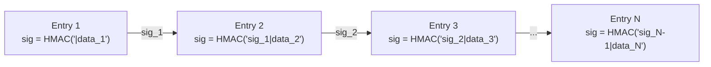
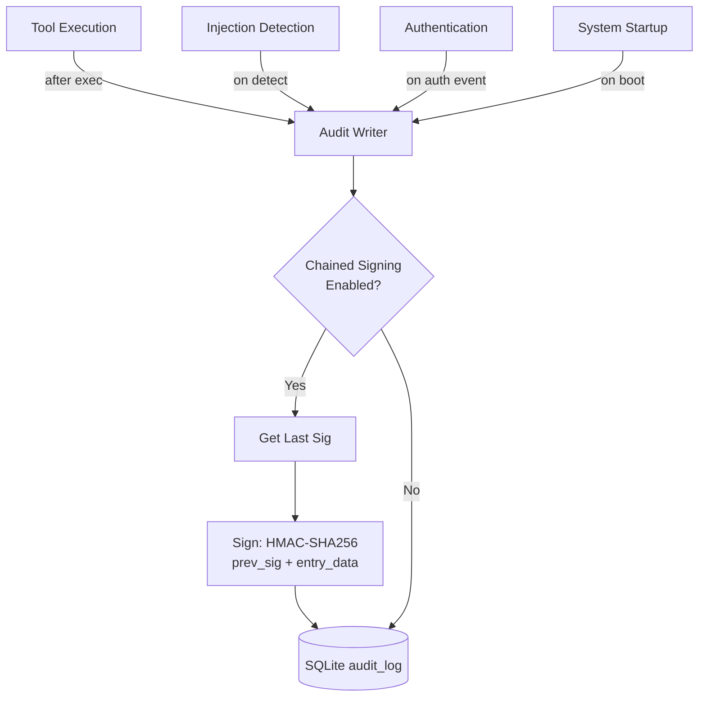
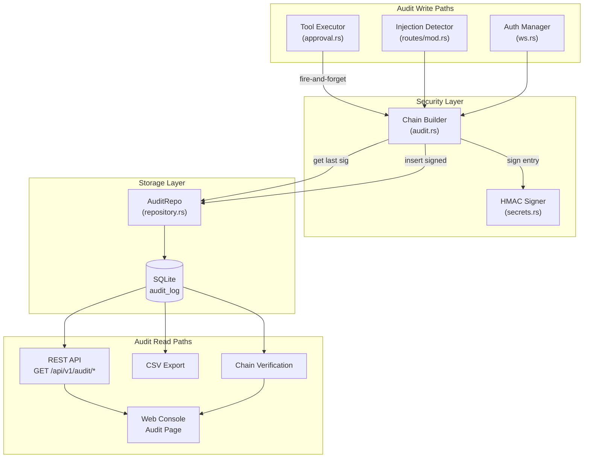

# 21 -- Audit Logs

> **Module Goal:** Provide a tamper-evident, cryptographically signed audit trail that records every security-relevant action in the system -- tool executions, authentication events, injection detections -- with chain verification, rich filtering, and CSV export, so that any forensic review can reconstruct exactly what happened and prove integrity.

### Why This Module Exists

An AI agent that can execute tools, access files, and interact with external services must maintain a complete, tamper-proof record of its actions. Without audit logging, there is no way to investigate incidents, verify that the agent acted within policy, or detect unauthorized modifications to the log itself.

The audit subsystem records every tool execution, authentication event, and security detection. Each entry is optionally signed with HMAC-SHA256 in a chained scheme where each signature depends on the previous entry's signature -- creating a Merkle-like chain where tampering with any single entry breaks all subsequent signatures. The system provides REST APIs for querying, exporting, and verifying the chain, plus a Web Console page with real-time filtering and one-click chain verification.

### Business Benefits

| Benefit | Description |
|---------|-------------|
| **Tamper detection** | HMAC-SHA256 chained signatures detect any modification, insertion, or deletion of audit entries |
| **Forensic capability** | Rich filtering by session, actor, action, risk level, and time range enables rapid incident investigation |
| **Compliance readiness** | Immutable audit trail with cryptographic proof of integrity satisfies security audit requirements |
| **Operational visibility** | Real-time audit view in Web Console shows exactly what the agent is doing and why |
| **Data portability** | CSV export enables integration with external SIEM tools and log analysis platforms |

---

## 1. Database Schema

**Table: `audit_log`** (created in migration `001_initial.sql`, enhanced in `002_security.sql`)

```sql
CREATE TABLE IF NOT EXISTS audit_log (
    id         INTEGER PRIMARY KEY AUTOINCREMENT,
    timestamp  INTEGER NOT NULL,
    actor      TEXT    NOT NULL,
    action     TEXT    NOT NULL,
    target     TEXT,
    details    TEXT,
    session_id TEXT,
    risk_level TEXT    DEFAULT 'low',
    hmac_sig   TEXT    -- Added in migration 002
);

CREATE INDEX IF NOT EXISTS idx_audit_log_session_id ON audit_log(session_id);
CREATE INDEX IF NOT EXISTS idx_audit_log_timestamp  ON audit_log(timestamp);
```

---

## 2. Data Model

**AuditLogRow** (`crates/antec-storage/src/models.rs`)

```rust
pub struct AuditLogRow {
    pub id: i64,                    // Auto-increment primary key
    pub timestamp: i64,             // Unix epoch seconds
    pub actor: String,              // "agent", "system", "user"
    pub action: String,             // "tool_exec", "auth", "startup", "injection_detected"
    pub target: Option<String>,     // Resource affected (tool name, file path)
    pub details: Option<String>,    // Additional context (truncated to 200 bytes for tool results)
    pub session_id: Option<String>, // Associated chat session ID
    pub risk_level: String,         // "safe", "moderate", "dangerous", "unknown", "low"
    pub hmac_sig: Option<String>,   // Hex-encoded HMAC-SHA256 signature (64 chars)
}
```

**Field semantics:**

| Field | Values | Description |
|-------|--------|-------------|
| `actor` | `"agent"`, `"system"`, `"user"` | Who initiated the action |
| `action` | `"tool_exec"`, `"auth"`, `"startup"`, `"injection_detected"` | What happened |
| `risk_level` | `"safe"`, `"moderate"`, `"dangerous"`, `"low"`, `"unknown"` | Risk classification from tool registry |
| `hmac_sig` | 64-char hex string or NULL | Chain signature (NULL if signing disabled) |

---

## 3. HMAC Signing & Chain Verification

**Location:** `crates/antec-security/src/audit.rs` and `crates/antec-security/src/secrets.rs`

### 3.1 Canonical Data Format

```rust
pub fn format_audit_data(timestamp: i64, actor: &str, action: &str, target: &str) -> String {
    format!("{timestamp}|{actor}|{action}|{target}")
}
```

Example: `"1234567890|agent|tool_exec|shell_exec"`

### 3.2 HMAC Algorithm

- **Hash function:** HMAC-SHA256 (`hmac` + `sha2` crates)
- **Key:** User-provided `audit_hmac_key` (arbitrary length; empty disables signing)
- **Output:** Hex-encoded 64-character string

```rust
type HmacSha256 = Hmac<Sha256>;

pub fn sign_audit_entry(key: &[u8], entry_data: &str) -> String {
    let mut mac: HmacSha256 = Mac::new_from_slice(key)
        .expect("HMAC-SHA256 accepts keys of any length");
    mac.update(entry_data.as_bytes());
    hex::encode(mac.finalize().into_bytes())
}
```

### 3.3 Chained Signing

Each entry's signature depends on the previous entry's signature, creating a tamper-evident chain:

```
Sign("{previous_sig}|{entry_data}")
```

- First entry uses empty string as previous_sig: `"|{entry_data}"`
- Each subsequent entry chains from the last: `"{sig_n-1}|{entry_data_n}"`



### 3.4 Chain Verification

```rust
pub struct ChainVerifyResult {
    pub total: usize,               // Total entries checked
    pub valid: usize,               // Entries with valid signature
    pub unsigned: usize,            // Entries with no signature (breaks chain)
    pub broken: usize,              // Entries with invalid/tampered signatures
    pub first_broken_at: Option<usize>, // Index of first broken entry
    pub chain_intact: bool,         // true only if no unsigned or broken entries
}
```

**Verification algorithm (`verify_chain`):**
1. Load entries ordered ascending by `id`
2. Initialize `previous_sig = ""`
3. For each entry:
   - If `hmac_sig` is NULL: mark as unsigned, reset `previous_sig = ""`
   - Else: recompute expected sig from `"{previous_sig}|{entry_data}"`, compare
   - Match: mark valid, update `previous_sig = entry.hmac_sig`
   - Mismatch: mark broken, record index if first
4. `chain_intact = (unsigned == 0 && broken == 0)`

---

## 4. Repository Methods

**Location:** `crates/antec-storage/src/repository.rs`

**AuditRepo trait:**

| Method | Signature | SQL / Behavior |
|--------|-----------|----------------|
| `log_audit` | `(&AuditLogRow) -> Result<()>` | `INSERT INTO audit_log ...` (unsigned) |
| `log_audit_chained` | `(&mut AuditLogRow, sign_fn: Fn(&str)->String) -> Result<()>` | Get last sig, call closure, insert signed |
| `get_last_audit_sig` | `() -> Result<String>` | `SELECT hmac_sig FROM audit_log ORDER BY id DESC LIMIT 1` |
| `query_audit_log` | `(session_id: Option<&str>, limit: i64) -> Result<Vec<AuditLogRow>>` | Descending by timestamp |
| `query_audit_log_filtered` | `(session_id, actor, action, risk_level, from_ts, to_ts, limit) -> Result<Vec<AuditLogRow>>` | Multi-filter, descending |
| `query_audit_chain` | `(limit: i64) -> Result<Vec<AuditLogRow>>` | ASCENDING by id (for verification) |
| `export_audit_csv` | `(limit: i64) -> Result<String>` | CSV columns: `id,timestamp,actor,action,target,details,session_id,risk_level` |
| `delete_audit_before` | `(before_ts: i64) -> Result<u64>` | Retention cleanup, returns count deleted |

---

## 5. Audit Write Paths



### 5.1 Tool Execution Audit

**Location:** `crates/antec-gateway/src/approval.rs:116-167`

- **When:** After every tool execution (safe, moderate, dangerous, or denied)
- **Entry:** actor=`"agent"`, action=`"tool_exec"`, target=tool_name, risk_level from registry
- **Details:** `"ok: {output}"` or `"error: {error}"` (truncated to 200 bytes)
- **Pattern:** Fire-and-forget async spawned task
- **Chained:** If `audit_hmac_key` is non-empty, queries last sig and signs atomically

### 5.2 Injection Detection Audit

**Location:** `crates/antec-gateway/src/routes/mod.rs:414-415`

- **When:** Injection pattern detected in REST inbound message
- **Entry:** actor=`"system"`, action=`"injection_detected"`
- **Called via:** `log_injection_audit()` function

---

## 6. REST API Routes

**Location:** `crates/antec-gateway/src/routes/mod.rs`

### 6.1 GET /api/v1/audit

Query audit log entries with optional filters.

**Query parameters:**

| Parameter | Type | Default | Description |
|-----------|------|---------|-------------|
| `session_id` | string | - | Filter by session |
| `actor` | string | - | Filter by actor ("agent", "system", "user") |
| `action` | string | - | Filter by action type |
| `risk_level` | string | - | Filter by risk level |
| `from_ts` | i64 | - | Start timestamp (inclusive) |
| `to_ts` | i64 | - | End timestamp (inclusive) |
| `limit` | i64 | 100 | Maximum entries to return |

**Response:** `Vec<AuditLogRow>` (JSON array, descending by timestamp)

### 6.2 GET /api/v1/audit/export

Export audit entries with per-entry HMAC verification.

**Response type:**
```rust
struct AuditExportEntry {
    #[serde(flatten)]
    entry: AuditLogRow,
    hmac_valid: Option<bool>,  // true/false/None if key not configured
}
```

### 6.3 GET /api/v1/audit/verify

Verify integrity of the entire audit chain (up to 100K entries).

**Response:** `ChainVerifyResult` (JSON)

Returns 400 if `audit_hmac_key` is not configured.

### 6.4 GET /api/v1/audit/csv

Export audit log as CSV text.

**Response:** `text/csv` with columns: `id,timestamp,actor,action,target,details,session_id,risk_level`

Implicit limit: 10,000 entries.

---

## 7. Configuration

```toml
[security]
audit_enabled = true              # Master flag for audit logging
audit_hmac_key = ""               # Secret key for HMAC signing (empty = unsigned)
audit_retention_days = 30         # Days before automatic cleanup (0 = forever)
```

**AppState integration:** `audit_hmac_key: Vec<u8>` loaded from config at startup.

**Retention cleanup:** Background task runs daily (`tokio::spawn`, 86400s interval), deletes entries older than `retention_days`.

---

## 8. Web Console UI

**Location:** `crates/antec-console/frontend/dist/app.js:2688-2778`

### 8.1 Audit Page Layout

| Element | Description |
|---------|-------------|
| **Filter bar** | Session ID, Actor, Action, Risk Level, Date Range, Limit inputs |
| **Results table** | Columns: Time, Actor, Action, Target, Risk, Sig (checkmark), Session |
| **Detail row** | Click to expand -- shows full JSON including id, hmac_sig |
| **Chain verify button** | Triggers GET /api/v1/audit/verify, displays status banner |

### 8.2 Visual Indicators

| Indicator | CSS Class | Meaning |
|-----------|-----------|---------|
| Checkmark | - | Entry is signed |
| Dash (--) | - | Entry is unsigned |
| Green banner | `audit-chain-ok` | Chain integrity verified |
| Red banner | `audit-chain-broken` | Tampered or missing signatures |
| Yellow banner | `audit-chain-warn` | Partial signing (unsigned entries) |
| Spinner | `audit-chain-loading` | Verification in progress |
| Risk styling | `dangerous` / `moderate` / `safe` | Color-coded risk levels |

---

## 9. Integration Architecture



---

## 10. Implementation Checklist

| Step | Component | Key Files |
|------|-----------|-----------|
| 1 | SQL migration: `audit_log` table + indexes | `crates/antec-storage/src/migrations/001_initial.sql` |
| 2 | SQL migration: add `hmac_sig` column | `crates/antec-storage/src/migrations/002_security.sql` |
| 3 | `AuditLogRow` model | `crates/antec-storage/src/models.rs` |
| 4 | `AuditRepo` trait + SQLite impl | `crates/antec-storage/src/repository.rs` |
| 5 | `format_audit_data` + `sign_audit_entry` | `crates/antec-security/src/secrets.rs` |
| 6 | `verify_chain` + `ChainVerifyResult` | `crates/antec-security/src/audit.rs` |
| 7 | Tool execution audit logging | `crates/antec-gateway/src/approval.rs` |
| 8 | Injection detection audit logging | `crates/antec-gateway/src/routes/mod.rs` |
| 9 | REST routes: query, export, verify, csv | `crates/antec-gateway/src/routes/mod.rs` |
| 10 | Retention cleanup background task | `src/main.rs` (boot sequence) |
| 11 | Console UI: audit page + chain verify | `crates/antec-console/frontend/dist/app.js` |
