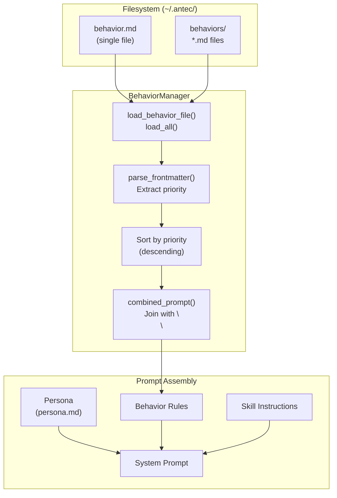
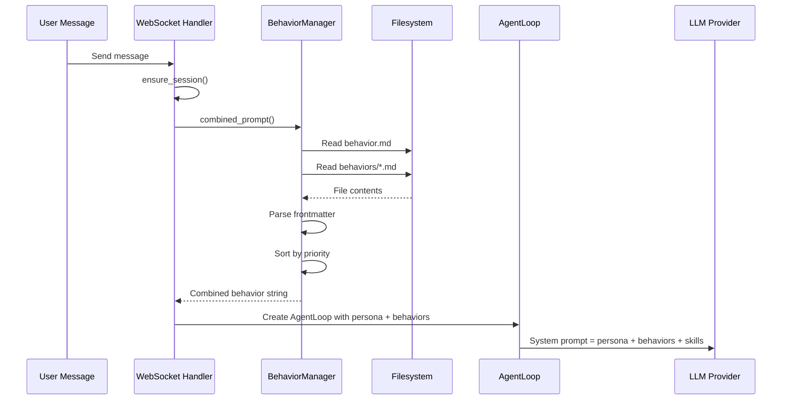

# 22 -- Behavior System

> **Module Goal:** Provide a filesystem-backed behavior overlay system that lets users define runtime rules for the AI agent -- injected into the system prompt after the persona, with YAML frontmatter priorities, hot-apply on every message, and a 4KB size limit -- without requiring a restart or database migration.

### Why This Module Exists

The persona defines *who* the agent is. Behaviors define *how* the agent should act in specific situations. Users need a way to add, modify, and remove behavioral rules without editing the core persona file or restarting the server. The behavior system solves this by reading markdown files from the filesystem on every message, sorting by priority, and concatenating them into the system prompt.

Behaviors are intentionally filesystem-backed (not database-backed) for three reasons: they are human-editable with any text editor, they integrate naturally with version control, and they require zero migration overhead. Changes take effect immediately on the next message -- no restart, no cache invalidation.

### Business Benefits

| Benefit | Description |
|---------|-------------|
| **Zero-restart changes** | Behavior modifications apply immediately on the next message |
| **Human-editable** | Plain markdown files editable with any text editor or IDE |
| **Priority ordering** | YAML frontmatter `priority` field controls injection order |
| **Version control friendly** | Filesystem files integrate naturally with git |
| **Size-bounded** | 4KB limit per behavior file prevents prompt bloat |

---

## 1. Core Architecture



---

## 2. Data Structures

**Location:** `crates/antec-core/src/behaviors.rs`

### 2.1 Constants

```rust
pub const MAX_BEHAVIOR_SIZE: usize = 4096;  // 4KB maximum per behavior file
```

### 2.2 BehaviorManager

```rust
pub struct BehaviorManager {
    behaviors_dir: PathBuf,             // Directory containing behavior files
    behavior_file: Option<PathBuf>,     // Path to single behavior.md file
}
```

### 2.3 BehaviorFile

```rust
pub struct BehaviorFile {
    pub name: String,       // Filename without extension
    pub content: String,    // File contents (after frontmatter stripped)
    pub priority: i32,      // Sort order (higher = injected first)
}
```

---

## 3. YAML Frontmatter Format

Behavior files in the `behaviors/` directory use optional YAML frontmatter to control priority:

```markdown
---
priority: 10
---
Always respond in a formal tone when discussing technical topics.
Use bullet points for lists longer than 3 items.
```

### 3.1 Parsing Logic (`parse_frontmatter`)

1. Detect `---` delimiter at start of file
2. Find closing `---` delimiter
3. Extract `priority: <integer>` from YAML section
4. Return `(priority, content_without_frontmatter)`
5. **Default priority** if missing: `0`
6. **Malformed frontmatter**: treats entire file as content with priority `0`

---

## 4. BehaviorManager API

### 4.1 Initialization

```rust
pub fn new(behaviors_dir: impl AsRef<Path>) -> Self
pub fn with_behavior_file(mut self, path: PathBuf) -> Self
```

### 4.2 Loading Methods

| Method | Returns | Behavior |
|--------|---------|----------|
| `load_behavior_file()` | `Option<String>` | Load single `behavior.md`; truncates if >4KB with warning |
| `load_all()` | `Vec<BehaviorFile>` | Load all `.md` files from directory (max_depth=1), parse frontmatter |
| `get(name: &str)` | `Option<BehaviorFile>` | Load specific behavior by name |

### 4.3 Combined Prompt Assembly

```rust
pub fn combined_prompt(&self) -> String {
    let mut parts: Vec<String> = Vec::new();

    // 1. Single behavior.md file first (highest priority)
    if let Some(content) = self.load_behavior_file() {
        if !content.trim().is_empty() {
            parts.push(content);
        }
    }

    // 2. Directory-based behaviors sorted by priority (descending)
    let mut behaviors = self.load_all();
    behaviors.sort_by(|a, b| b.priority.cmp(&a.priority));
    for b in behaviors {
        parts.push(b.content);
    }

    // 3. Join with double newline
    parts.join("\n\n")
}
```

**Priority ordering:**
1. `behavior.md` (single file) -- always first
2. Directory behaviors sorted by `priority` field descending (higher number = earlier)
3. Equal priority: filesystem order (non-deterministic)

### 4.4 Writing Methods

| Method | Returns | Behavior |
|--------|---------|----------|
| `save(name, content, priority)` | `std::io::Result<()>` | Write behavior file with frontmatter to `behaviors/{name}.md` |
| `save_behavior_file(content)` | `Result<(), String>` | Write single `behavior.md`, validate 4KB limit |
| `delete(name)` | `std::io::Result<bool>` | Delete behavior file, return true if existed |
| `list()` | `Vec<String>` | Return all behavior names (without `.md` extension) |

---

## 5. Integration with Prompt System



**Key properties:**
- Behaviors are read on **every message** (not cached)
- Changes apply **immediately** on next agent response
- No restart required
- Behaviors are NOT stored in the database -- filesystem only

---

## 6. REST API Routes

**Location:** `crates/antec-gateway/src/routes/mod.rs:4841-4945`

### 6.1 Directory-Based Behaviors (Multiple Files)

#### GET /api/v1/behaviors

List all directory-based behaviors.

**Response:** `Vec<BehaviorInfo>`

```json
[
  { "name": "formal-tone", "content": "Always respond formally...", "priority": 10 },
  { "name": "code-style", "content": "Use snake_case...", "priority": 5 }
]
```

#### GET /api/v1/behaviors/{name}

Get a single behavior by name.

**Response:** `BehaviorInfo` or 404

#### PUT /api/v1/behaviors/{name}

Create or update a behavior.

**Request body:**
```rust
struct SaveBehaviorRequest {
    content: String,
    #[serde(default)]
    priority: i32,  // Defaults to 0 if not provided
}
```

**Response:** `BehaviorInfo` or 413 (Payload Too Large) if >4KB

#### DELETE /api/v1/behaviors/{name}

Delete a behavior file.

**Response:** `{ "deleted": bool }` (true if file existed)

### 6.2 Single Behavior File

#### GET /api/v1/behavior

Load the single `behavior.md` file.

**Response:** `{ "content": "..." }`

#### PUT /api/v1/behavior

Save the single `behavior.md` file.

**Request body:** `{ "content": "..." }`

**Response:** `{ "content": "..." }` or 413 if >4KB

---

## 7. Request/Response Types

```rust
#[derive(Serialize)]
struct BehaviorInfo {
    name: String,
    content: String,
    priority: i32,
}

#[derive(Deserialize)]
struct SaveBehaviorRequest {
    content: String,
    #[serde(default)]
    priority: i32,
}

#[derive(Serialize)]
struct BehaviorFileResponse {
    content: String,
}

#[derive(Deserialize)]
struct BehaviorFileRequest {
    content: String,
}
```

---

## 8. Size Limits & Validation

| Validation Point | Limit | Behavior |
|-----------------|-------|----------|
| `load_behavior_file()` | 4KB (4096 bytes) | Truncates with warning log |
| `save_behavior_file()` | 4KB | Returns error string |
| REST `PUT /api/v1/behavior` | 4KB | Returns 413 Payload Too Large |
| REST `PUT /api/v1/behaviors/{name}` | 4KB | Returns 413 Payload Too Large |
| Directory files on load | No per-file limit | Only `behavior.md` is size-checked |

---

## 9. Web Console UI

**Location:** `crates/antec-console/frontend/dist/app.js:3901-3966`

| Element | Description |
|---------|-------------|
| **Title** | "Behavior Rules" (i18n: `behavior.title`) |
| **Description** | "Define behavior rules for the AI agent. These rules are included in the system prompt after the persona. Maximum 4KB." |
| **Textarea** | 12 rows, markdown-formatted placeholder |
| **Byte counter** | Real-time display: "X / 4096 bytes" (red when exceeded) |
| **Save button** | Triggers `PUT /api/v1/behavior` |
| **Toast notifications** | Success/error with 3-second auto-hide |
| **Client validation** | Prevents saving >4KB with error toast |

---

## 10. Filesystem Layout

```
~/.antec/
  behavior.md                # Single behavior file (highest priority)
  behaviors/                 # Directory for multiple behaviors
    formal-tone.md          # priority: 10
    code-guidelines.md      # priority: 5
    safety-rules.md         # priority: 20 (injected first)
```

---

## 11. Boot Sequence Integration

**Location:** `src/main.rs` (Step 11 of boot sequence)

```rust
let behaviors_dir = data_dir.join("behaviors");
let behavior_file = config.agent.resolve_behavior_path();  // ~/.antec/behavior.md
let behavior_manager = Arc::new(
    BehaviorManager::new(&behaviors_dir)
        .with_behavior_file(behavior_file)
);
```

The `behavior_manager` is stored in `AppState` and shared across all route handlers and session creation flows.

---

## 12. Implementation Checklist

| Step | Component | Key Files |
|------|-----------|-----------|
| 1 | `BehaviorManager` struct + `BehaviorFile` | `crates/antec-core/src/behaviors.rs` |
| 2 | YAML frontmatter parser | `crates/antec-core/src/behaviors.rs` |
| 3 | `combined_prompt()` with priority sorting | `crates/antec-core/src/behaviors.rs` |
| 4 | `save()`, `delete()`, `list()` methods | `crates/antec-core/src/behaviors.rs` |
| 5 | REST routes: CRUD for behaviors + behavior | `crates/antec-gateway/src/routes/mod.rs` |
| 6 | 4KB size validation at all write points | `crates/antec-core/src/behaviors.rs`, routes |
| 7 | Integration in `ensure_session()` | `crates/antec-gateway/src/ws.rs` |
| 8 | Boot sequence: create BehaviorManager | `src/main.rs` |
| 9 | Console UI: behavior editor page | `crates/antec-console/frontend/dist/app.js` |
