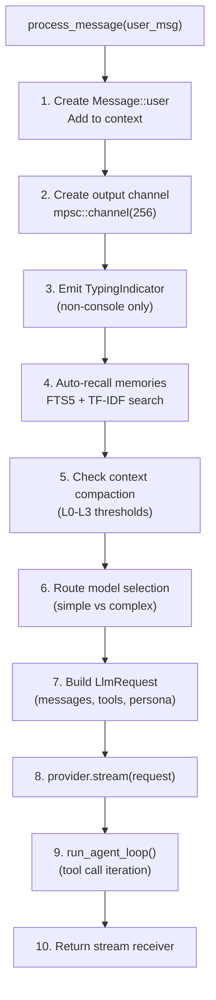
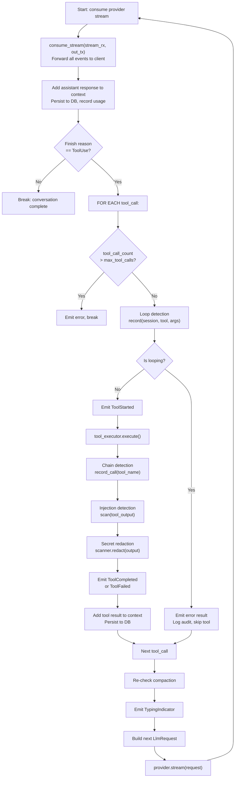
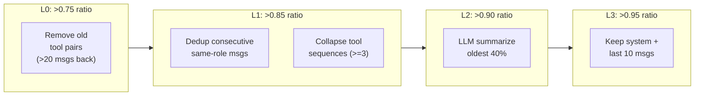

# 23 -- Chat Pipeline

> **Module Goal:** Define the complete message processing pipeline from user input to streamed response -- covering REST and WebSocket ingress, the AgentLoop state machine, tool call iteration with security scanning, 4-level context compaction (L0-L3), memory auto-recall, model routing, and 16 StreamEvent types -- so that every step of a chat interaction can be rebuilt from this specification.

### Why This Module Exists

The chat pipeline is the central nervous system of Antec. Every user message -- whether arriving via WebSocket, REST API, Discord, WhatsApp, or iMessage -- flows through the same processing pipeline: ingress validation, session resolution, memory recall, prompt assembly, LLM streaming, tool execution with security checks, context management, and response delivery. Without a precise specification of this pipeline, the agent's behavior becomes unpredictable and unreproducible.

This document specifies every message format at every layer boundary, the exact steps of the AgentLoop state machine, the tool call iteration loop with all security checks, the 4-level compaction algorithm with threshold values, and the streaming event protocol that connects the backend to all frontends.

### Business Benefits

| Benefit | Description |
|---------|-------------|
| **Reproducibility** | Every pipeline step is specified with exact data structures and algorithms |
| **Multi-transport** | Same pipeline serves REST, WebSocket, SSE, and channel adapters |
| **Streaming-first** | 16 event types provide real-time visibility into agent reasoning and tool use |
| **Context efficiency** | 4-level compaction keeps conversations within token budgets automatically |
| **Security in-line** | Injection detection, loop detection, chain detection, and secret redaction are integral pipeline stages |

---

## 1. Message Formats Across Layers

### 1.1 Unified Message (Channel Ingress)

**Location:** `crates/antec-channels/src/message.rs`

```rust
pub struct UnifiedMessage {
    pub id: String,                      // UUID v4
    pub channel: String,                 // "discord", "console", "whatsapp"
    pub channel_id: String,              // e.g. guild:channel or group ID
    pub session_id: String,              // Internal session ID (set during routing)
    pub conversation_id: String,         // "{channel}:{channel_id}"
    pub sender_id: String,               // Channel-specific user/sender ID
    pub sender_name: String,             // Display name
    pub content: String,                 // Message text
    pub attachments: Vec<Attachment>,    // Optional file attachments
    pub metadata: serde_json::Value,     // Arbitrary channel-specific data
    pub created_at: DateTime<Utc>,       // Original message timestamp
    pub received_at: DateTime<Utc>,      // When Antec received it
}

pub struct Attachment {
    pub id: String,                      // UUID v4
    pub filename: String,
    pub content_type: String,            // MIME type
    pub size: u64,                       // Bytes
    pub url: Option<String>,             // Optional download URL
}
```

**Session key formula:** `"{channel}:{channel_id}"` -- used for isolation across channels.

### 1.2 Core Message Type

**Location:** `crates/antec-core/src/messages.rs`

```rust
pub enum Role {
    User,       // Inbound user message
    Assistant,  // LLM response
    System,     // System prompt, compaction summary, recalled memories
    Tool,       // Tool result message
}

pub struct Message {
    pub id: String,                      // UUID v4
    pub role: Role,
    pub content: String,
    pub tool_calls: Vec<ToolCall>,       // LLM-initiated tool invocations
    pub tool_call_id: Option<String>,    // For role=Tool: which call was resolved
    pub timestamp: i64,                  // Unix seconds
    pub token_count: Option<i32>,        // Token estimate (~4 chars/token)
}

pub struct ToolCall {
    pub id: String,                      // Unique call ID
    pub name: String,                    // Tool name (e.g. "file_read")
    pub arguments: serde_json::Value,    // JSON params
}

pub struct ToolResult {
    pub call_id: String,                 // Links back to ToolCall.id
    pub name: String,                    // Tool name
    pub output: String,                  // Execution result
    pub is_error: bool,                  // True if output is an error message
}
```

**Token estimation:** `content.len() / 4` (~4 characters per token).

### 1.3 WebSocket Protocol

**Location:** `crates/antec-gateway/src/ws.rs`

**Client -> Server:**

```rust
pub enum WsMessage {
    Auth { token: String },
    ChatMessage { session_id: Option<String>, content: String },
    ApprovalResponse { request_id: String, approved: bool, scope: String },
    Cancel { session_id: String },
}
```

**Server -> Client (WsResponse):**

| Type | Fields | Description |
|------|--------|-------------|
| `AuthResponse` | `success, token` | Authentication result |
| `ResponseChunk` | `session_id, content, channel` | Streaming text delta |
| `ToolEvent` | `session_id, tool_name, event, result` | Generic tool event |
| `ResponseDone` | `session_id` | End of response |
| `ApprovalRequest` | `request_id, session_id, tool_name, tool_params, risk_level` | Dangerous tool approval |
| `MemoriesRecalled` | `session_id, memories` | Memory recall results |
| `ProviderSwitch` | `session_id, from, to` | Failover notification |
| `MemoriesExtracted` | `session_id, count, keys` | Auto-extraction results |
| `ModelSelected` | `session_id, provider, model, reason` | Routing decision |
| `Compacted` | `session_id, start, end, summary` | Context compaction |
| `ToolStarted` | `session_id, tool_name, params` | Tool execution begins |
| `ToolProgress` | `session_id, tool_name, progress_percent, status` | Tool progress update |
| `ToolCompleted` | `session_id, tool_name, result_summary, duration_ms` | Tool success |
| `ToolFailed` | `session_id, tool_name, error, risk_level` | Tool failure |
| `Error` | `message` | Error message |

### 1.4 StreamEvent (Internal Provider Events)

**Location:** `crates/antec-core/src/providers/mod.rs`

```rust
pub enum StreamEvent {
    Delta(String),
    Done(LlmResponse),
    Error(String),
    ToolCallStart { id: String, name: String },
    ToolCallDelta { id: String, arguments_delta: String },
    ToolCallEnd { name: String, is_error: bool, result: String },
    ToolStarted { name: String, params: Value, session_id: String },
    MemoriesRecalled(Vec<RecalledMemory>),
    ProviderSwitch { from: String, to: String },
    MemoriesExtracted { count: usize, keys: Vec<String> },
    ModelSelected { provider: String, model: String, reason: String },
    Compacted { start: usize, end: usize, summary: String },
    TypingIndicator { channel: String, conversation_id: String },
    ToolProgress { name: String, progress_percent: u32, status: String },
    ToolCompleted { name: String, result_summary: String, duration_ms: u64 },
    ToolFailed { name: String, error: String, risk_level: String },
}
```

### 1.5 SSE Event Format

**Location:** `crates/antec-gateway/src/sse.rs`

```rust
pub struct SseEvent {
    pub session_id: String,
    pub event_type: String,     // "delta", "done", "tool_started", etc.
    pub data: serde_json::Value,
}
```

**Endpoint:** `GET /api/v1/events?session_id=<id>` returns `text/event-stream`.

---

## 2. AgentLoop State Machine

**Location:** `crates/antec-core/src/agent.rs`

### 2.1 Struct Definition

```rust
pub struct AgentLoop {
    // Core LLM interaction
    provider: Box<dyn LlmProvider>,
    context: ContextWindow,
    config: AgentConfig,
    session_id: String,
    db: Arc<antec_storage::Database>,
    persona: String,
    model: String,
    provider_name: String,

    // Tool execution
    tool_definitions: Vec<ToolDefinition>,
    tool_executor: Option<Box<dyn ToolExecutor>>,

    // Memory recall
    memory_manager: Option<Arc<antec_memory::MemoryManager>>,
    recall_threshold: f64,           // default 0.3
    recall_max_results: usize,       // default 5

    // Model routing
    routing_config: Option<RoutingConfig>,

    // Channel context
    channel_context: ChannelContext,

    // L2 compaction provider
    compaction_provider: Option<Box<dyn LlmProvider>>,

    // Security layers
    injection_detector: Option<Arc<InjectionDetector>>,
    chain_detector: Option<Arc<Mutex<ChainDetector>>>,
    secret_scanner: Option<Arc<SecretScanner>>,
    loop_detector: Option<Arc<Mutex<LoopDetector>>>,
    audit_hmac_key: Vec<u8>,

    // Routing tracking
    current_routing_mode: Option<String>,
}
```

---

## 3. Message Processing Pipeline

**Location:** `crates/antec-core/src/agent.rs:process_message()` (line 202)



### 3.1 Step-by-Step Details

| Step | Action | Side Effects |
|------|--------|--------------|
| 1 | Create `Message::user(user_msg)`, add to context | `persist_message_background()` to SQLite |
| 2 | Create `mpsc::channel(256)` | Output channel for streaming events |
| 3 | Emit `TypingIndicator` if channel != "console" | Forwarded to Discord/WhatsApp |
| 4 | `memory_manager.auto_recall_with_details()` | Inject as System message, emit `MemoriesRecalled` |
| 5 | `run_compaction()` based on usage ratio | May emit `Compacted` event |
| 6 | `ModelRouter::route()` if routing enabled | Emit `ModelSelected`, track `current_routing_mode` |
| 7 | Build `LlmRequest` with context, tools, persona | - |
| 8 | `provider.stream(&request)` | Returns `mpsc::Receiver<StreamEvent>` |
| 9 | `run_agent_loop()` -- processes stream, handles tool calls | See section 4 |
| 10 | Return `Ok(out_rx)` | Client reads events from receiver |

---

## 4. Agent Loop: Tool Call Iteration

**Location:** `crates/antec-core/src/agent.rs:run_agent_loop()` (line 320)



**Key invariants:**
- Tool calls processed **sequentially** (not parallelized)
- Each tool call counted individually toward `max_tool_calls` (default: 20)
- Failed tools: error result added to context, loop continues
- Loop detected: skip execution, inject error message
- Chain detected: log audit alert, continue execution

---

## 5. Context Compaction Algorithm

**Location:** `crates/antec-core/src/context.rs`

### 5.1 Usage Ratio

```rust
pub fn usage_ratio(&self) -> f64 {
    self.total_tokens() as f64 / self.max_tokens as f64
}

pub fn estimate_tokens(&self) -> usize {
    (self.content.len() + tool_call_lengths) / 4
}
```

### 5.2 Compaction Thresholds

```rust
if ratio > 0.95       → L3: Aggressive truncation
else if ratio > 0.90  → L2: LLM-based summarization (or L1 fallback)
else if ratio > 0.85  → L1: Dedup + tool collapse
else if ratio > 0.75  → L0: Remove old tool pairs
else                   → No compaction
```

### 5.3 L0: Tool Pair Removal

Remove tool_call/tool_result pairs more than 20 messages from the end.

1. If message count <= 20: no-op
2. Collect ToolCall IDs from messages `[0..cutoff]`
3. Delete Tool messages with matching `tool_call_id`
4. Clear `tool_calls` from Assistant messages (delete if empty after)
5. Keep all messages `[cutoff..end]` unchanged

### 5.4 L1: Deduplication + Tool Collapse

**Phase 1 -- Deduplication** (protect last 10 messages):
- Find runs of 3+ consecutive same-role messages (not System)
- Merge content with `"\n"` separator
- Replace N messages with 1

**Phase 2 -- Tool Collapse** (protect last 10 messages):
- Find sequences: Assistant(with tool_calls) -> Tool -> Tool -> ...
- If >= 3 tool calls: collapse to System("[Collapsed N tool calls: name1, name2, ...]")
- Effect: 30-50% message count reduction

### 5.5 L2: LLM-Based Summarization

1. Separate system from non-system messages
2. If non-system < 5: fall back to L1
3. Take oldest 40% of non-system messages
4. Send to compaction_provider (default: claude-haiku-4-5-20251001):
   - Prompt: "Summarize this conversation. Preserve: key decisions, facts, user preferences, action items."
   - Temperature: 0.3, max_tokens: 500
5. Insert summary as System message: `"[COMPACTED: messages N-M] {summary}"`
6. Keep remaining messages

### 5.6 L3: Aggressive Truncation

1. Separate system from non-system messages
2. Drop ALL non-system except last 10
3. Rebuild: all system + last 10 non-system
4. Effect: ~90% reduction, used only at 95%+ ratio



---

## 6. REST Chat Endpoint

**Location:** `crates/antec-gateway/src/routes/mod.rs`

### POST /api/v1/chat/send

```
Request: { "session_id": "optional-uuid", "content": "user message" }
Response: { "session_id": "uuid", "events_url": "/api/v1/events?session_id=uuid" }
```

**Flow:**
1. Parse and validate request
2. Auto-generate `session_id` if omitted
3. Scan content for injection attacks
4. Check allowlist (console always allowed)
5. Ensure session exists (create if missing)
6. Check backpressure (queue depth)
7. Spawn background processing task
8. Return ACK immediately with `events_url`
9. Client polls `events_url` for SSE stream

---

## 7. WebSocket Handler

**Location:** `crates/antec-gateway/src/ws.rs:handle_socket()` (line 204)

### Phase 1: Authentication

```
Client: {"type": "auth", "token": "..."}
Server: Try session token -> Try OTP -> Respond success/failure
Failure: Close connection
```

### Phase 2: Message Loop

```
Client: {"type": "message", "session_id": "optional", "content": "..."}

Server:
  1. Auto-generate session_id if omitted
  2. Check allowlist
  3. Ensure session exists
  4. Check backpressure (queue depth <= 10)
  5. Acquire processing semaphore (1 message at a time)
  6. Call session.agent.process_message(content)
  7. Forward StreamEvent -> WsResponse to client
  8. Release semaphore
```

### Approval Flow

```
Server: {"type": "approval_request", "request_id": "id", "tool_name": "...", ...}
Client: {"type": "approval_response", "request_id": "id", "approved": true, "scope": "once|session|always"}
```

### Cancellation

```
Client: {"type": "cancel", "session_id": "id"}
Server: Closes output channel, terminates streaming
```

---

## 8. Memory Auto-Recall

```rust
if let Some(ref mm) = self.memory_manager {
    let (context_str, recalled) = mm.auto_recall_with_details(
        user_msg,
        self.recall_threshold,    // default 0.3
        self.recall_max_results   // default 5
    ).await?;

    if let Some(ctx) = context_str {
        self.context.add(Message::system(&ctx));
        out_tx.send(StreamEvent::MemoriesRecalled(recalled)).await;
    }
}
```

**Strategy:** FTS5 keyword search + TF-IDF semantic scoring. Only memories above threshold injected as System message.

---

## 9. Persistence Pattern

All message persistence uses **fire-and-forget** background tasks:

```rust
fn persist_message_background(&self, session_id, role, content, tool_calls, token_count) {
    let db = self.db.clone();
    tokio::spawn(async move {
        tokio::task::spawn_blocking(move || {
            // INSERT INTO messages ...
        }).await;
    });
}
```

**Write points:**
- User message: at `process_message()` start
- Assistant message: after LLM response with token_count
- Tool result: after each tool execution
- Model usage: after each LLM response (provider, model, tokens, routing_mode)

---

## 10. Implementation Checklist

| Step | Component | Key Files |
|------|-----------|-----------|
| 1 | `UnifiedMessage` + `Attachment` structs | `crates/antec-channels/src/message.rs` |
| 2 | `Message`, `Role`, `ToolCall`, `ToolResult` | `crates/antec-core/src/messages.rs` |
| 3 | `StreamEvent` enum (16 variants) | `crates/antec-core/src/providers/mod.rs` |
| 4 | `WsMessage` + `WsResponse` enums | `crates/antec-gateway/src/ws.rs` |
| 5 | `SseEvent` struct + SSE endpoint | `crates/antec-gateway/src/sse.rs` |
| 6 | `AgentLoop` struct + `process_message()` | `crates/antec-core/src/agent.rs` |
| 7 | `run_agent_loop()` tool call iteration | `crates/antec-core/src/agent.rs` |
| 8 | `ContextWindow` + L0/L1/L2/L3 compaction | `crates/antec-core/src/context.rs` |
| 9 | Memory auto-recall integration | `crates/antec-core/src/agent.rs` |
| 10 | REST `POST /api/v1/chat/send` | `crates/antec-gateway/src/routes/mod.rs` |
| 11 | WebSocket handler + auth + approval | `crates/antec-gateway/src/ws.rs` |
| 12 | `persist_message_background()` | `crates/antec-core/src/agent.rs` |
| 13 | `record_usage_background()` | `crates/antec-core/src/agent.rs` |
