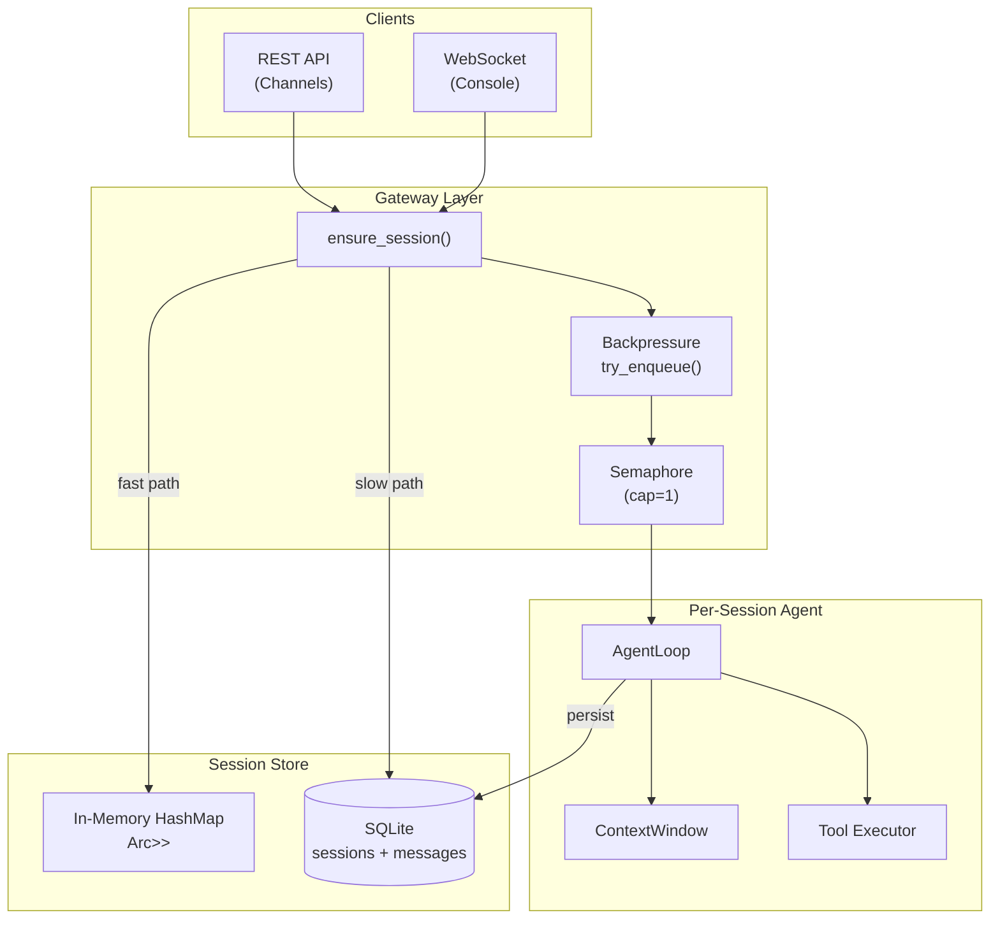
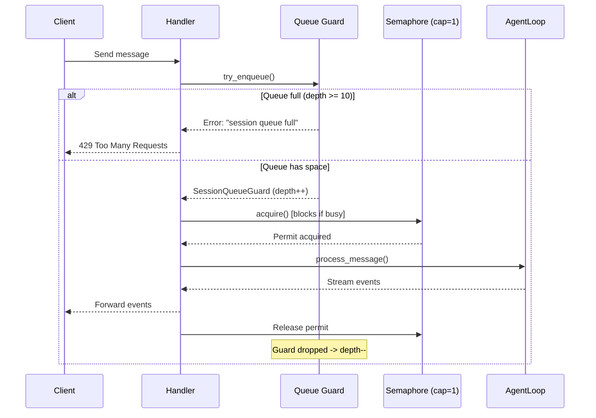
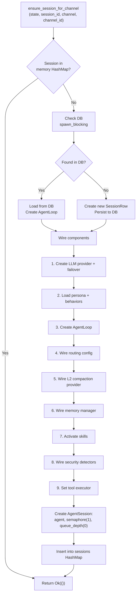

# 24 -- Session Management

> **Module Goal:** Define the complete session lifecycle -- creation, isolation, backpressure, persistence, restoration, archival, merging, and retention cleanup -- so that every conversation maintains isolated state with ordered message delivery, survives server restarts via SQLite WAL, and never overwhelms the system through queue depth limits and semaphore-based serialization.

### Why This Module Exists

An AI assistant serving multiple channels (Console, Discord, WhatsApp, iMessage) simultaneously must isolate conversations so that messages from one user don't leak into another's context. Sessions provide this isolation boundary. Each session owns an `AgentLoop` instance with its own context window, tool state, and memory scope.

Beyond isolation, sessions must handle backpressure (what happens when messages arrive faster than the LLM can respond), persistence (surviving crashes and restarts), and lifecycle management (archiving old conversations, merging cross-channel interactions). This document specifies every data structure, SQL query, and algorithm involved.

### Business Benefits

| Benefit | Description |
|---------|-------------|
| **Channel isolation** | Each conversation is fully isolated -- no cross-talk between channels or users |
| **Crash recovery** | Sessions restored from SQLite WAL after unexpected shutdown |
| **Backpressure** | Queue depth limit (10) + semaphore (1) prevent system overload |
| **Cross-channel merge** | Same user on Discord + WhatsApp can be merged into one conversation |
| **Data retention** | Configurable auto-cleanup of old sessions and messages |

---

## 1. Session Architecture



---

## 2. Database Schema

### 2.1 Sessions Table

**Location:** `crates/antec-storage/src/migrations/001_initial.sql` + `015_session_archive.sql`

```sql
CREATE TABLE IF NOT EXISTS sessions (
    id         TEXT    PRIMARY KEY,
    channel    TEXT    NOT NULL,
    channel_id TEXT,
    created_at INTEGER NOT NULL,
    updated_at INTEGER NOT NULL,
    metadata   TEXT
);

-- Migration 015: Archive support
ALTER TABLE sessions ADD COLUMN archived_at INTEGER DEFAULT NULL;
CREATE INDEX IF NOT EXISTS idx_sessions_archived_at ON sessions(archived_at);
```

### 2.2 Messages Table

```sql
CREATE TABLE IF NOT EXISTS messages (
    id          TEXT    PRIMARY KEY,
    session_id  TEXT    NOT NULL REFERENCES sessions(id),
    role        TEXT    NOT NULL,
    content     TEXT    NOT NULL,
    tool_calls  TEXT,
    token_count INTEGER,
    created_at  INTEGER NOT NULL
);

CREATE INDEX IF NOT EXISTS idx_messages_session_id ON messages(session_id);
```

---

## 3. Data Models

### 3.1 SessionRow

```rust
pub struct SessionRow {
    pub id: String,                     // UUID v4
    pub channel: String,                // "discord", "console", "whatsapp"
    pub channel_id: Option<String>,     // e.g. guild:channel
    pub created_at: i64,                // Unix epoch seconds
    pub updated_at: i64,                // Last message timestamp
    pub metadata: Option<String>,       // JSON arbitrary data
    pub archived_at: Option<i64>,       // NULL = active, timestamp = archived
}
```

### 3.2 MessageRow

```rust
pub struct MessageRow {
    pub id: String,                     // UUID v4
    pub session_id: String,             // Foreign key to sessions.id
    pub role: String,                   // "user", "assistant", "system", "tool"
    pub content: String,
    pub tool_calls: Option<String>,     // JSON serialized Vec<ToolCall>
    pub token_count: Option<i32>,       // For cost tracking / context estimation
    pub created_at: i64,                // Unix epoch seconds
}
```

### 3.3 AgentSession (In-Memory State)

**Location:** `crates/antec-gateway/src/state.rs`

```rust
pub struct AgentSession {
    pub agent: AgentLoop,                       // Core state machine
    pub created_at: DateTime<Utc>,              // Session creation time
    pub message_count: usize,                   // User message count
    pub processing_semaphore: Arc<Semaphore>,   // Cap=1: serialize processing
    pub queue_depth: Arc<AtomicUsize>,          // Current queue size
}
```

---

## 4. Backpressure Model



### 4.1 Constants

```rust
pub const SESSION_MAX_CONCURRENT: usize = 1;   // Only 1 message at a time
pub const SESSION_MAX_QUEUE_DEPTH: usize = 10;  // Max 10 waiting + processing
```

### 4.2 Queue Guard (RAII)

```rust
impl AgentSession {
    pub fn try_enqueue(&self) -> Result<SessionQueueGuard, &'static str> {
        let depth = self.queue_depth.fetch_add(1, Ordering::SeqCst);
        if depth >= SESSION_MAX_QUEUE_DEPTH {
            self.queue_depth.fetch_sub(1, Ordering::SeqCst);
            return Err("session queue full -- try again later");
        }
        Ok(SessionQueueGuard { queue_depth: self.queue_depth.clone() })
    }
}

pub struct SessionQueueGuard {
    queue_depth: Arc<AtomicUsize>,
}

impl Drop for SessionQueueGuard {
    fn drop(&mut self) {
        self.queue_depth.fetch_sub(1, Ordering::SeqCst);
    }
}
```

---

## 5. Session Creation Flow: ensure_session()

**Location:** `crates/antec-gateway/src/ws.rs:863`



### Step Details

| Step | Action | Details |
|------|--------|---------|
| 1 | Fast path | Check `state.sessions.read().await.contains_key(session_id)` |
| 2 | DB lookup | `spawn_blocking { repo.get_session(session_id) }` |
| 3 | Create session | `SessionRow { id, channel, channel_id, created_at, updated_at, metadata: None, archived_at: None }` |
| 4 | Create provider | Resolve from ModelInstance table or config defaults; wrap with failover chain |
| 5 | Build persona | Load persona.md + additional persona files + behavior_manager.combined_prompt() + language hint |
| 6 | Create AgentLoop | `AgentLoop::new(provider, config, session_id, db, persona)` |
| 7 | Wire routing | Set `routing_config` from config |
| 8 | Wire compaction | Set `compaction_provider` if `config.agent.compaction_provider` configured |
| 9 | Wire memory | Set `memory_manager` if `config.memory.long_term_enabled` |
| 10 | Activate skills | Parse SKILL.md frontmatter, append instructions, register tools |
| 11 | Wire security | Injection detector, chain detector, secret scanner, loop detector, HMAC key |
| 12 | Set tool executor | `ApprovalGatedToolExecutor` wrapping base executor |
| 13 | Create AgentSession | `processing_semaphore: Semaphore(1)`, `queue_depth: AtomicUsize(0)` |

---

## 6. Session Repository Operations

**Location:** `crates/antec-storage/src/repository.rs`

### 6.1 SessionRepo Trait

```rust
pub trait SessionRepo {
    fn create_session(&self, session: &SessionRow) -> Result<()>;
    fn get_session(&self, id: &str) -> Result<Option<SessionRow>>;
    fn list_sessions(&self) -> Result<Vec<SessionRow>>;
    fn delete_session(&self, id: &str) -> Result<()>;
    fn update_session_timestamp(&self, id: &str, updated_at: i64) -> Result<()>;
    fn archive_session(&self, id: &str, archived_at: i64) -> Result<bool>;
    fn unarchive_session(&self, id: &str) -> Result<bool>;
    fn list_sessions_filtered(
        &self,
        channel: Option<&str>,
        archived: Option<bool>,
        from_ts: Option<i64>,
        to_ts: Option<i64>,
        limit: i64,
    ) -> Result<Vec<SessionRow>>;
    fn merge_sessions(&self, target_id: &str, source_id: &str) -> Result<u64>;
    fn get_session_messages_ordered(&self, session_id: &str) -> Result<Vec<MessageRow>>;
}
```

### 6.2 SQL Implementations

| Method | SQL |
|--------|-----|
| `create_session` | `INSERT INTO sessions (id, channel, channel_id, created_at, updated_at, metadata, archived_at) VALUES (...)` |
| `get_session` | `SELECT ... FROM sessions WHERE id = ?1` |
| `list_sessions` | `SELECT ... FROM sessions ORDER BY updated_at DESC` |
| `delete_session` | `BEGIN; DELETE FROM messages WHERE session_id = ?1; DELETE FROM sessions WHERE id = ?1; COMMIT;` |
| `update_session_timestamp` | `UPDATE sessions SET updated_at = ?1 WHERE id = ?2` |
| `archive_session` | `UPDATE sessions SET archived_at = ?1 WHERE id = ?2` |
| `unarchive_session` | `UPDATE sessions SET archived_at = NULL WHERE id = ?1` |
| `list_sessions_filtered` | Dynamic WHERE clause with optional channel, archived, from_ts, to_ts filters |
| `merge_sessions` | `UPDATE messages SET session_id = ?1 WHERE session_id = ?2` + `DELETE FROM sessions WHERE id = ?2` |
| `get_session_messages_ordered` | `SELECT ... FROM messages WHERE session_id = ?1 ORDER BY created_at ASC` |

### 6.3 MessageRepo Trait

```rust
pub trait MessageRepo {
    fn insert_message(&self, msg: &MessageRow) -> Result<()>;
    fn get_messages_for_session(&self, session_id: &str) -> Result<Vec<MessageRow>>;
    fn get_message(&self, id: &str) -> Result<Option<MessageRow>>;
    fn delete_messages_for_session(&self, session_id: &str) -> Result<()>;
}
```

---

## 7. Session Restoration

**Location:** `crates/antec-core/src/agent.rs:restore_session()` (line 902)

```rust
pub async fn restore_session(&mut self) -> Result<(), CoreError> {
    let messages = tokio::task::spawn_blocking(move || {
        // SELECT id, role, content, tool_calls, token_count, created_at
        // FROM messages WHERE session_id = ?1 ORDER BY created_at ASC
    }).await??;

    for row in messages {
        let role = match row.role.as_str() {
            "user" => Role::User,
            "assistant" => Role::Assistant,
            "system" => Role::System,
            "tool" => Role::Tool,
            _ => Role::User,
        };
        let tool_calls: Vec<ToolCall> = row.tool_calls
            .as_deref()
            .and_then(|s| serde_json::from_str(s).ok())
            .unwrap_or_default();

        self.context.add(Message { id: row.id, role, content: row.content, tool_calls, ... });
    }

    Ok(())
}
```

Called when loading an existing session from DB into memory. Rebuilds the full context window from persisted messages.

---

## 8. Session Merging

**Use case:** User contacts via Discord, then continues on WhatsApp. Merge both conversations into one session.

```rust
fn merge_sessions(&self, target_id: &str, source_id: &str) -> Result<u64> {
    // 1. Move all messages from source to target
    conn.execute("UPDATE messages SET session_id = ?1 WHERE session_id = ?2",
        params![target_id, source_id])?;
    // 2. Delete source session record
    conn.execute("DELETE FROM sessions WHERE id = ?1", params![source_id])?;
    Ok(count)
}
```

Returns the number of messages moved.

---

## 9. Session Archival

| Operation | SQL | Description |
|-----------|-----|-------------|
| Archive | `UPDATE sessions SET archived_at = ?1 WHERE id = ?2` | Mark session as archived |
| Unarchive | `UPDATE sessions SET archived_at = NULL WHERE id = ?1` | Restore archived session |
| List active | `WHERE archived_at IS NULL` | Filter active sessions |
| List archived | `WHERE archived_at IS NOT NULL` | Filter archived sessions |

---

## 10. Data Retention

**Configuration:**

```toml
[data_retention]
sessions_retention_days = 0    # 0 = forever
messages_retention_days = 0    # 0 = forever
memories_retention_days = 0    # 0 = forever
```

When non-zero, background tasks periodically clean up old data based on `created_at` timestamps.

---

## 11. REST API Routes

| Endpoint | Method | Description |
|----------|--------|-------------|
| `/api/v1/sessions` | GET | List sessions (with optional filters: channel, archived, from_ts, to_ts, limit) |
| `/api/v1/sessions/{id}` | GET | Get single session |
| `/api/v1/sessions/{id}` | DELETE | Delete session and all its messages |
| `/api/v1/sessions/{id}/messages` | GET | Get ordered messages for session |
| `/api/v1/sessions/{id}/archive` | POST | Archive session |
| `/api/v1/sessions/{id}/unarchive` | POST | Unarchive session |
| `/api/v1/sessions/merge` | POST | Merge source session into target |

---

## 12. Implementation Checklist

| Step | Component | Key Files |
|------|-----------|-----------|
| 1 | SQL migration: sessions + messages tables | `crates/antec-storage/src/migrations/001_initial.sql` |
| 2 | SQL migration: archived_at column | `crates/antec-storage/src/migrations/015_session_archive.sql` |
| 3 | `SessionRow` + `MessageRow` models | `crates/antec-storage/src/models.rs` |
| 4 | `SessionRepo` + `MessageRepo` traits | `crates/antec-storage/src/repository.rs` |
| 5 | `AgentSession` struct + backpressure | `crates/antec-gateway/src/state.rs` |
| 6 | `ensure_session()` flow | `crates/antec-gateway/src/ws.rs` |
| 7 | `restore_session()` | `crates/antec-core/src/agent.rs` |
| 8 | `persist_message_background()` | `crates/antec-core/src/agent.rs` |
| 9 | Session REST routes | `crates/antec-gateway/src/routes/mod.rs` |
| 10 | Data retention background tasks | `src/main.rs` |
