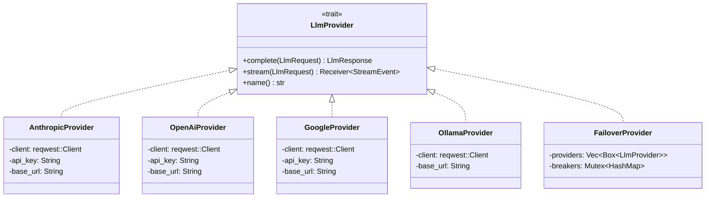
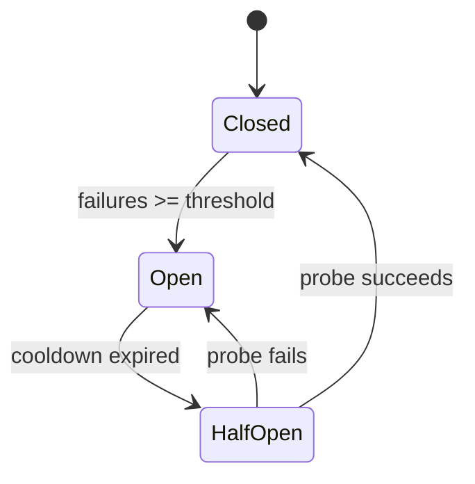
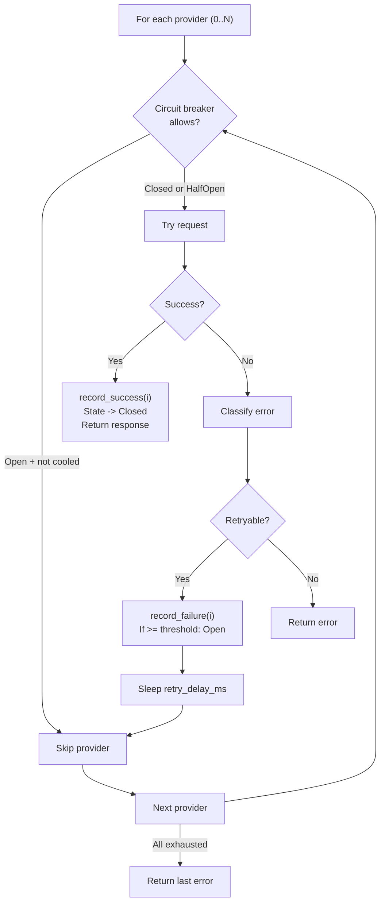

# 25 -- Models, Providers & Routing

> **Module Goal:** Define the complete LLM provider abstraction -- the `LlmProvider` trait, four provider implementations (Anthropic, OpenAI, Google, Ollama), circuit breaker failover with automatic recovery, 10-signal heuristic model routing for cost optimization, credential management with encrypted vault storage, and per-request metrics collection -- so that the system can be rebuilt with full multi-provider support and intelligent model selection.

### Why This Module Exists

A personal AI assistant must support multiple LLM providers to avoid vendor lock-in, optimize costs, and provide resilience against outages. The model layer abstracts provider differences behind a unified trait, implements automatic failover with circuit breaker patterns, and routes messages to cost-appropriate models based on complexity analysis.

The routing system uses a 10-signal heuristic classifier (message length, code blocks, keywords, question count, line count, math indicators, sentence complexity, list markers, conversation context, and short message penalty) to score each message's complexity from 0.0 to 1.0, then routes to a simple (cheap/fast) or complex (powerful/slow) model based on a configurable threshold.

### Business Benefits

| Benefit | Description |
|---------|-------------|
| **No vendor lock-in** | Four providers with unified trait -- switch by changing one config line |
| **Automatic failover** | Circuit breaker pattern with exponential backoff and half-open probing |
| **Cost optimization** | Heuristic routing sends simple messages to cheaper models (up to 80% cost reduction) |
| **Encrypted credentials** | API keys stored in ChaCha20-Poly1305 vault, not plain text |
| **Metrics visibility** | Per-tool, per-provider usage tracking with cost estimation |

---

## 1. LlmProvider Trait

**Location:** `crates/antec-core/src/providers/mod.rs`

```rust
#[async_trait]
pub trait LlmProvider: Send + Sync {
    async fn complete(&self, request: &LlmRequest) -> Result<LlmResponse, CoreError>;
    async fn stream(&self, request: &LlmRequest) -> Result<mpsc::Receiver<StreamEvent>, CoreError>;
    fn name(&self) -> &str;
}
```

### 1.1 LlmRequest

```rust
pub struct LlmRequest {
    pub model: String,                    // e.g. "claude-sonnet-4-6", "gpt-4"
    pub messages: Vec<Message>,           // Conversation history
    pub tools: Vec<ToolDefinition>,       // Available tools (JSON Schema)
    pub temperature: f64,                 // 0.0-1.0
    pub max_tokens: Option<u32>,          // None = provider default
    pub system_prompt: Option<String>,    // System instructions
}
```

### 1.2 LlmResponse

```rust
pub struct LlmResponse {
    pub content: String,
    pub tool_calls: Vec<ToolCall>,
    pub finish_reason: FinishReason,
    pub usage: TokenUsage,
}

pub enum FinishReason {
    Stop,
    ToolUse,
    MaxTokens,
    Error,
}

pub struct TokenUsage {
    pub input_tokens: u32,
    pub output_tokens: u32,
}
```

---

## 2. Provider Implementations



### 2.1 Anthropic Provider

**File:** `crates/antec-core/src/providers/anthropic.rs`

| Property | Value |
|----------|-------|
| **Endpoint** | `{base_url}/v1/messages` (default: `https://api.anthropic.com`) |
| **Auth header** | `x-api-key: {api_key}` |
| **Version header** | `anthropic-version: 2023-06-01` |
| **Default max_tokens** | 4096 |
| **System prompt** | Top-level `"system"` field (not in messages array) |
| **Tool calls** | `content_block` with type `"tool_use"` (id, name, input JSON) |
| **Tool results** | User message with `tool_result` content block (tool_use_id, content) |
| **Stop reasons** | `"end_turn"`/`"stop"` -> Stop, `"tool_use"` -> ToolUse, `"max_tokens"` -> MaxTokens |
| **Streaming** | SSE: message_start, content_block_start, content_block_delta, content_block_stop, message_delta, message_stop |

### 2.2 OpenAI Provider

**File:** `crates/antec-core/src/providers/openai.rs`

| Property | Value |
|----------|-------|
| **Endpoint** | `{base_url}/chat/completions` (default: `https://api.openai.com/v1`) |
| **Auth header** | `Authorization: Bearer {api_key}` |
| **Default max_tokens** | 4096 |
| **System prompt** | First message with role `"system"` |
| **O-series models** | Uses `max_completion_tokens` (not `max_tokens`), NO temperature |
| **Tool calls** | `tool_calls` array with type `"function"`, arguments as stringified JSON |
| **Tool results** | Role `"tool"` message with `tool_call_id` |
| **Stop reasons** | `"stop"` -> Stop, `"tool_calls"` -> ToolUse, `"length"` -> MaxTokens |
| **Streaming** | Deltas in choice[0].delta, tool calls tracked by position HashMap |

### 2.3 Google Gemini Provider

**File:** `crates/antec-core/src/providers/google.rs`

| Property | Value |
|----------|-------|
| **Endpoint** | `{base_url}/chat/completions` (default: `https://generativelanguage.googleapis.com/v1beta/openai`) |
| **Note** | Uses OpenAI-compatible API (not native Gemini) |
| **Auth** | Bearer token (same as OpenAI) |
| **Request/Response** | Identical to OpenAI format |

### 2.4 Ollama Provider

**File:** `crates/antec-core/src/providers/ollama.rs`

| Property | Value |
|----------|-------|
| **Endpoint** | `{base_url}/api/chat` (default: `http://127.0.0.1:11434`) |
| **Auth** | None (local) |
| **Temperature** | Via `options: { "temperature": value }` |
| **Tool calls** | `function.name` + `function.arguments` (JSON object, not string) |
| **Tool call IDs** | Generated UUIDs (Ollama doesn't provide them) |
| **Streaming** | Newline-delimited JSON, `done: true` signals end |

---

## 3. Provider Factory & Credentials

**Location:** `crates/antec-core/src/providers/mod.rs`

```rust
pub fn create_provider(
    provider_name: &str,
    config: &ProvidersConfig,
) -> Result<Box<dyn LlmProvider>, CoreError>
```

Supported: `"anthropic"`, `"openai"`, `"ollama"`, `"google"`

### 3.1 API Key Resolution (2-tier fallback)

1. `ProviderConfig.api_key_env` (custom env var, e.g. `"MY_CUSTOM_KEY"`)
2. Default env var (e.g. `"ANTHROPIC_API_KEY"`)

### 3.2 Credential Store (Encrypted)

```rust
pub struct CredentialStore {
    vault: Arc<antec_security::SecretVault>,  // ChaCha20-Poly1305
    db: Arc<antec_storage::Database>,
}
```

- Encrypts/decrypts secrets via `SecretVault`
- Stored in DB with ciphertext and nonce
- Vault-first lookup, then environment variable fallback

### 3.3 ProviderConfig

```rust
pub struct ProviderConfig {
    pub api_key_env: Option<String>,       // Custom env var name
    pub base_url: Option<String>,          // Custom endpoint
    pub cost_per_1k_input: Option<f64>,    // Cost tracking
    pub cost_per_1k_output: Option<f64>,
}
```

---

## 4. Failover & Circuit Breaker

**Location:** `crates/antec-core/src/providers/failover.rs`

### 4.1 FailoverProvider

```rust
pub struct FailoverProvider {
    providers: Vec<Box<dyn LlmProvider>>,
    max_retries: u32,
    retry_delay_ms: u64,
    cooldown_secs: u64,
    circuit_breaker_threshold: u32,
    breakers: Mutex<HashMap<usize, ProviderBreaker>>,
}
```

### 4.2 Circuit Breaker States



```rust
pub enum BreakerState {
    Closed,    // Healthy, requests flow normally
    Open,      // Threshold exceeded, requests blocked
    HalfOpen,  // Cooldown expired, next request is probe
}

struct ProviderBreaker {
    state: BreakerState,
    consecutive_failures: u32,
    last_failure: Option<Instant>,
}
```

### 4.3 Error Classification

```rust
pub enum ProviderErrorKind {
    ServerError,   // 500, 502, 503
    RateLimited,   // 429
    Timeout,       // "timeout", "timed out"
    Other,         // Non-retryable
}

// Retryable: ServerError, RateLimited, Timeout
// Non-retryable: Other
```

### 4.4 Failover Algorithm



On streaming failover, emits `StreamEvent::ProviderSwitch { from, to }`.

---

## 5. Model Routing System

**Location:** `crates/antec-core/src/routing.rs`

### 5.1 Configuration

```rust
pub struct RoutingConfig {
    pub enabled: bool,
    pub mode: String,                   // "auto", "always_default", "always_complex"
    pub simple_instance: Option<String>,
    pub complex_instance: Option<String>,
    pub simple_provider: Option<String>,
    pub simple_model: Option<String>,
    pub complex_provider: Option<String>,
    pub complex_model: Option<String>,
    pub complexity_threshold: f64,      // default 0.5
}
```

### 5.2 Heuristic Classifier: 10 Complexity Signals

| # | Signal | Max Score | Thresholds |
|---|--------|-----------|------------|
| 1 | **Message length** | 0.25 | >2000 chars: +0.25, >800: +0.15, >300: +0.05 |
| 2 | **Code blocks** | 0.25 | >=3 blocks: +0.25, 1-2: +0.15 |
| 3 | **Complex keywords** | 0.30 | >=4 keywords: +0.30, >=2: +0.20, 1: +0.10 |
| 4 | **Multi-part questions** | 0.20 | >=4 question marks: +0.20, >=2: +0.10 |
| 5 | **Multi-line input** | 0.15 | >20 lines: +0.15, >8: +0.08 |
| 6 | **Math/technical** | 0.10 | Keywords: equation, formula, calculate, integral, etc. |
| 7 | **Sentence complexity** | 0.10 | Avg words/sentence > 25: +0.10 |
| 8 | **Enumeration/lists** | 0.15 | >=4 list markers: +0.15, >=2: +0.05 |
| 9 | **Conversation context** | 0.15 | >=3 distinct tools used: +0.10, >15 messages: +0.05 |
| 10 | **Short message penalty** | -0.10 | <=5 words + no other signals: -0.10 |

**Complex keywords list:** analyze, implement, refactor, optimize, algorithm, debug, architecture, design pattern, performance, benchmark, explain in detail, step by step, compare, trade-off, security, vulnerability, migration, concurrency, distributed, scalab*, complex

**Final score:** Clamped to `[0.0, 1.0]`

### 5.3 Routing Decision

```rust
pub struct RoutingDecision {
    pub provider: String,
    pub model: String,
    pub reason: String,
    pub complexity_score: f64,
    pub routed_simple: bool,
}
```

**Logic:**
1. If disabled: return defaults
2. If `AlwaysDefault`: return simple model
3. If `AlwaysComplex`: return complex model
4. If `Auto`: classify message, compare to `complexity_threshold`
   - score < threshold -> simple
   - score >= threshold -> complex

### 5.4 Cost Savings Calculation

```rust
pub fn calculate_saving(
    complex_cost_per_1k: f64,
    simple_cost_per_1k: f64,
    estimated_tokens: f64,
) -> f64 {
    (complex_cost - simple_cost) * estimated_tokens / 1000.0
}
```

Returns 0 if simple is more expensive.

---

## 6. Connectivity Testing

```rust
pub async fn test_provider_connectivity(
    provider: &dyn LlmProvider
) -> Result<Duration, CoreError>
```

Sends minimal request ("Say hello", max_tokens=5), measures roundtrip time. Used for health checks and provider validation.

---

## 7. Metrics Collection

**Location:** `crates/antec-core/src/metrics.rs`

```rust
pub struct MetricsCollector {
    tools: RwLock<HashMap<String, ToolCounters>>,
    recall_attempts: AtomicU64,
    recall_hits: AtomicU64,
    compaction_count: AtomicU64,
    compaction_l1: AtomicU64,
    compaction_l2: AtomicU64,
    compaction_l3: AtomicU64,
    extraction_attempts: AtomicU64,
    extraction_successes: AtomicU64,
}
```

**Per-tool metrics:** success_count, error_count, total_count, error_rate, avg_latency_ms, total_latency_ms

**Compaction levels tracked:** L1Dedup, L2Llm, L3Truncate

---

## 8. Configuration

```toml
[models]
default_provider = "anthropic"
default_model = "claude-sonnet-4-6"
default_instance = null

[models.providers.anthropic]
api_key_env = "ANTHROPIC_API_KEY"
base_url = null
cost_per_1k_input = null
cost_per_1k_output = null

[models.providers.openai]
api_key_env = "OPENAI_API_KEY"
base_url = null

[models.providers.ollama]
base_url = "http://127.0.0.1:11434"

[models.providers.google]
api_key_env = "GOOGLE_API_KEY"
base_url = "https://generativelanguage.googleapis.com/v1beta/openai"

[models.failover]
failover_providers = []
max_retries = 2
retry_delay_ms = 1000
cooldown_secs = 60
circuit_breaker_threshold = 3

[models.routing]
enabled = false
mode = "auto"
simple_instance = null
complex_instance = null
complexity_threshold = 0.5
```

---

## 9. Implementation Checklist

| Step | Component | Key Files |
|------|-----------|-----------|
| 1 | `LlmProvider` trait + `LlmRequest`/`LlmResponse` | `crates/antec-core/src/providers/mod.rs` |
| 2 | `AnthropicProvider` (SSE streaming) | `crates/antec-core/src/providers/anthropic.rs` |
| 3 | `OpenAiProvider` (o-series support) | `crates/antec-core/src/providers/openai.rs` |
| 4 | `GoogleProvider` (OpenAI-compatible) | `crates/antec-core/src/providers/google.rs` |
| 5 | `OllamaProvider` (NDJSON streaming) | `crates/antec-core/src/providers/ollama.rs` |
| 6 | `create_provider()` factory + credential resolution | `crates/antec-core/src/providers/mod.rs` |
| 7 | `CredentialStore` with vault integration | `crates/antec-core/src/providers/mod.rs` |
| 8 | `FailoverProvider` + circuit breaker | `crates/antec-core/src/providers/failover.rs` |
| 9 | `RoutingConfig` + 10-signal classifier | `crates/antec-core/src/routing.rs` |
| 10 | `MetricsCollector` (atomic counters) | `crates/antec-core/src/metrics.rs` |
| 11 | `test_provider_connectivity()` | `crates/antec-core/src/providers/mod.rs` |
| 12 | Model instance seeding in boot | `src/main.rs` |
