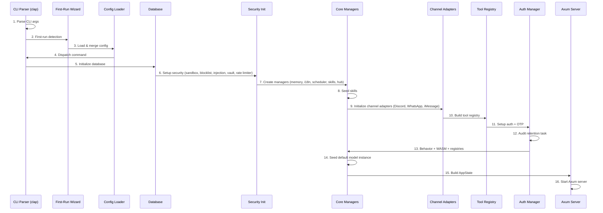
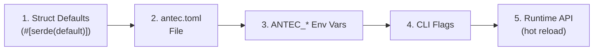
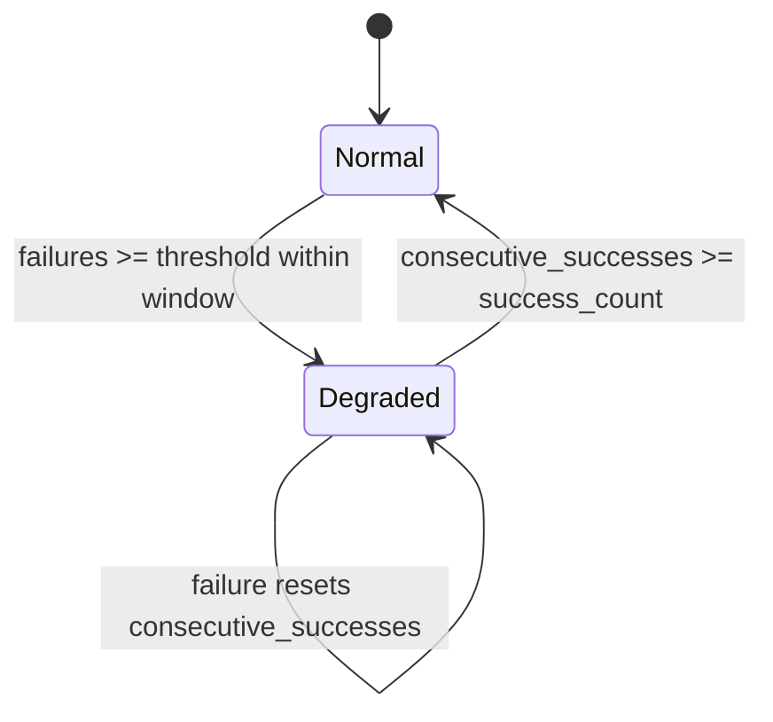

# 26 -- Environment & Runtime

> **Module Goal:** Define the complete runtime environment -- the 16-step boot sequence, CLI command structure, 5-layer configuration cascade (defaults/TOML/env/CLI/API), environment variables, filesystem layout, feature flags, workspace sandboxing, and CrashGuard degraded mode recovery -- so that the system can be started, configured, and operated from this specification alone.

### Why This Module Exists

A self-hosted AI assistant delivered as a single binary must have a deterministic, well-documented startup process. Users need to understand how configuration is resolved (which layer overrides which), what environment variables are available, where data is stored on disk, and what happens when things go wrong (crash recovery).

This document specifies every step from `main()` to server readiness, the complete TOML configuration schema with defaults, all environment variable overrides, the CLI command structure, the filesystem layout, Cargo feature flags, and the CrashGuard mechanism that enters degraded mode when failures exceed a threshold.

### Business Benefits

| Benefit | Description |
|---------|-------------|
| **Deterministic startup** | 16 ordered steps, each must complete before next -- failures abort with clear messages |
| **First-run wizard** | Interactive setup for new users -- language, provider, security mode, channels |
| **Layered config** | 5-layer cascade: defaults -> TOML -> env vars -> CLI -> runtime API |
| **Zero dependencies** | Single binary, SQLite bundled, frontend embedded -- nothing to install |
| **Crash recovery** | CrashGuard with exponential backoff and degraded mode preserves core chat |

---

## 1. Boot Sequence

**Location:** `src/main.rs`



### Step Details

| Step | Action | Key Code |
|------|--------|----------|
| **1** | Parse CLI args via clap | `Cli { config, no_wizard, command }` |
| **2** | First-run detection | `!config_path.exists() && !data_dir.exists()` -- launches wizard if true |
| **3** | Load config cascade | `AntecConfig::load(&path)` then `config.apply_env_overrides()` |
| **4** | Command dispatch | `None`/`Serve` -> `run_serve()`, else handle subcommand |
| **5** | Database init | `Database::open(&db_path)` -- creates dir, opens SQLite, runs migrations |
| **6** | Security infrastructure | OsSandbox, CommandBlocklist, InjectionDetector, SecretVault, GcraLimiter |
| **7** | Core managers | MemoryManager, I18n, SchedulerManager, SkillManager, HubService |
| **8** | Skill seeding | Extract builtin skills, scan tiers (builtin/hub/local) |
| **9** | Channel adapters | Discord (bot API + reconnect), WhatsApp (webhook), iMessage (AppleScript poll) |
| **10** | Tool registry | `create_default_registry()` + messaging tools + restore disabled state |
| **11** | Auth manager | Load tokens from DB, generate OTP, spawn cleanup task (5-min interval) |
| **12** | Audit retention | Daily background task: `delete_audit_before(cutoff)` |
| **13** | Registries | BehaviorManager, WASM runtime, bundled agents/extensions/hands, builtin skills |
| **14** | Model instance | Seed default ModelInstanceRow if table is empty |
| **15** | AppState | Build with 20+ Arc-wrapped components |
| **16** | Server start | `TcpListener::bind()` + `axum::serve()` |

---

## 2. CLI Commands

**Entry point:** `#[tokio::main] async fn main()`

```rust
struct Cli {
    config: Option<PathBuf>,        // --config PATH
    no_wizard: bool,                // --no-wizard
    command: Option<Command>,
}

enum Command {
    Serve { port: Option<u16>, no_wizard: bool },
    Chat,
    Secret { action: SecretAction },
    Skill { action: SkillAction },
    Memory { action: MemoryAction },
    Cron { action: CronAction },
    Export { output, all },
    Doctor { verbose, json },
    Provider { action: ProviderAction },
    Repl { language: String },
}
```

| Command | Subcommands | Description |
|---------|-------------|-------------|
| `serve` (default) | `--port`, `--no-wizard` | Start HTTP/WS server |
| `chat` | - | Interactive CLI chat |
| `secret` | `set NAME [VALUE]`, `get NAME`, `list`, `delete NAME` | Secret management |
| `skill` | `list`, `enable`, `disable`, `import`, `create`, `remove`, `show`, `edit`, `hub search/install`, `new`, `build`, `test` | Skill management |
| `memory` | `search QUERY`, `export [--file --format --category]`, `import FILE` | Memory management |
| `cron` | `list`, `create NAME EXPR PROMPT`, `delete ID` | Cron job management |
| `export` | `[--output --all]` | Data export |
| `doctor` | `[--verbose --json]` | Health diagnostics |
| `provider` | `test [--provider NAME]` | Provider connectivity test |
| `repl` | `[--language js\|python]` | Interactive code REPL |

---

## 3. Configuration Cascade



Each layer overrides the previous. Later layers take precedence.

### 3.1 AntecConfig Structure

```rust
pub struct AntecConfig {
    pub general: GeneralConfig,
    pub server: ServerConfig,
    pub agent: AgentConfig,
    pub models: ModelsConfig,
    pub security: SecurityConfig,
    pub memory: MemoryConfig,
    pub web: WebConfig,
    pub scheduler: SchedulerConfig,
    pub channels: ChannelsConfig,
    pub skills: SkillsConfig,
    pub sandbox: SandboxConfig,
    pub mcp: McpConfig,
    pub browser: BrowserConfig,
    pub crash_guard: CrashGuardConfig,
    pub data_retention: DataRetentionConfig,
    pub budget: BudgetConfig,
    pub agents: Vec<AgentDefinitionConfig>,
}
```

### 3.2 Complete TOML Schema with Defaults

```toml
[general]
language = "en"                              # en or pl
data_dir = "~/.antec"
workspace_dir = "~/.antec/workspace"
log_level = "info"

[server]
bind_address = "127.0.0.1"
bind_port = 8088

[agent]
system_prompt_file = "~/.antec/persona.md"
persona_files = []
max_context_tokens = 128000
compaction_threshold = 0.75
max_tool_calls = 20
temperature = 0.7
stream_responses = true
max_tokens = null                            # null = provider default
compaction_model = null
compaction_provider = null

[models]
default_provider = "anthropic"
default_model = "claude-sonnet-4-6"
default_instance = null

[models.providers.anthropic]
api_key_env = "ANTHROPIC_API_KEY"
base_url = null
cost_per_1k_input = null
cost_per_1k_output = null

[models.providers.openai]
api_key_env = "OPENAI_API_KEY"

[models.providers.ollama]
base_url = "http://127.0.0.1:11434"

[models.providers.google]
api_key_env = "GOOGLE_API_KEY"
base_url = "https://generativelanguage.googleapis.com/v1beta/openai"

[models.failover]
failover_providers = []
max_retries = 2
retry_delay_ms = 1000
cooldown_secs = 60
circuit_breaker_threshold = 3

[models.routing]
enabled = false
mode = "auto"
simple_instance = null
complex_instance = null
complexity_threshold = 0.5

[security]
require_pairing = true
sandbox_mode = "auto"
max_tool_calls_per_minute = 60
audit_enabled = true
session_token_ttl_hours = 720               # 30 days
injection_mode = "flag"                     # flag, block, ask
rate_limit_burst = 10
audit_hmac_key = ""
secret_redaction_enabled = true
injection_patterns = []
audit_retention_days = 30

[memory]
auto_compact = true
long_term_enabled = true
semantic_search = true
temporal_decay = true
decay_half_life_days = 30
recall_threshold = 0.3
recall_max_results = 5
auto_extract_enabled = true
auto_extract_min_messages = 5
archive_threshold = 0.05
delete_archived_after_days = 90

[web]
search_provider = "ddg"
tavily_api_key = null
google_api_key = null
google_cx = null
searxng_url = null

[scheduler]
enabled = true
heartbeat_enabled = false
heartbeat_interval = "2h"
heartbeat_prompt = ""

[channels.discord]
enabled = false
token_env = "DISCORD_BOT_TOKEN"
allowed_servers = []
allowed_channels = []
gateway_intents = ["GUILD_MESSAGES"]
reconnect_max_retries = 5
reconnect_base_delay_secs = 1

[channels.whatsapp]
enabled = false
allowed_contacts = []

[channels.imessage]
enabled = false
poll_interval_secs = 5

[skills]
hub_enabled = false
skills_dir = "~/.antec/skills"

[sandbox]
fuel_limit = 1000000
epoch_timeout_ms = 5000
memory_limit_bytes = 16777216               # 16 MB
os_cpu_time_secs = 30
os_memory_bytes = 52428800                  # 50 MB
os_max_processes = 10

[crash_guard]
window_secs = 60
threshold = 5
probe_interval_secs = 30
success_count = 3

[data_retention]
sessions_retention_days = 0                 # 0 = forever
messages_retention_days = 0
memories_retention_days = 0

[budget]
monthly_limit_usd = 0.0                    # 0 = no limit
warn_on_overage = true
```

---

## 4. Environment Variables

| Variable | Default | Description |
|----------|---------|-------------|
| `ANTEC_MASTER_SECRET` | random UUID | Encryption key for vault (random if missing = non-persistent) |
| `ANTHROPIC_API_KEY` | - | Anthropic API key (overridable via config) |
| `OPENAI_API_KEY` | - | OpenAI API key |
| `GOOGLE_API_KEY` | - | Google API key |
| `OLLAMA_HOST` | - | Ollama endpoint override |
| `DISCORD_BOT_TOKEN` | - | Discord bot token (overridable via config) |
| `RUST_LOG` | - | Tracing filter (overrides config.general.log_level) |
| `EDITOR` | - | Text editor for skill editing |
| `VISUAL` | - | Fallback editor |
| `HOME` | - | Tilde expansion for paths |

### Environment Override Format

```
ANTEC_{SECTION}_{FIELD}=value

Examples:
ANTEC_SERVER_PORT=9090
ANTEC_GENERAL_LOG_LEVEL=debug
ANTEC_SECURITY_INJECTION_MODE=block
ANTEC_MEMORY_RECALL_THRESHOLD=0.8
ANTEC_SCHEDULER_ENABLED=false
ANTEC_SANDBOX_OS_CPU_TIME_SECS=60
ANTEC_BROWSER_ENABLED=true
```

---

## 5. Filesystem Layout

```
~/.antec/
  antec.toml                  # Main config file
  antec.db                    # SQLite database (WAL mode)
  persona.md                  # System prompt
  behavior.md                 # Behavior rules (single file)
  behaviors/                  # Additional behavior definitions
  agents/                     # Agent TOML definitions (synced to DB)
  workspace/                  # Sandboxed file directory
  skills/
    builtin/                  # Built-in skills (bundled, extracted on boot)
    hub/                      # Hub skills (downloaded, disabled by default)
    local/                    # User-created skills
```

### 5.1 Workspace Sandboxing

**Location:** `crates/antec-storage/src/workspace.rs`

```rust
pub struct Workspace {
    root: PathBuf,  // Canonical, absolute path
}

impl Workspace {
    pub fn resolve(&self, relative: &str) -> Result<PathBuf>;  // Jail to root
    pub fn validate_path(&self, path: &Path) -> Result<()>;    // Check bounds
}
```

**Path resolution safeguards:**
1. Reject empty paths
2. Reject obvious path traversal (`../../../etc/passwd`)
3. Canonicalize longest existing ancestor
4. Append non-existent tail components
5. Validate final path `starts_with(root)`

---

## 6. First-Run Setup Wizard

**Triggers when:** `!config_path.exists() && !data_dir.exists()` and `--no-wizard` not set

**Interactive prompts:**
1. **Language:** EN / PL
2. **LLM Provider:** Anthropic / OpenAI / Ollama / Skip
3. **Data directory:** (default: `~/.antec`)
4. **Security mode:** Strict / Balanced / Permissive
5. **Channels:** Discord / WhatsApp / iMessage (each optional)
6. **Persona preset:** 4 choices
7. **Features:** Scheduler, auto-extract, hub (each optional)

**Output:**
- Writes `antec.toml` to config path
- Creates data directory + `persona.md`
- Displays auth token in green bold

---

## 7. CrashGuard (Degraded Mode Recovery)

**Location:** `crates/antec-core/src/crash_guard.rs`

### 7.1 Configuration

```rust
pub struct CrashGuardConfig {
    pub window_secs: u64,       // default 60 -- rolling window
    pub threshold: u32,          // default 5 -- failures to trigger
    pub probe_interval_secs: u64, // default 30 -- recovery probe interval
    pub success_count: u32,      // default 3 -- successes to exit degraded
}
```

### 7.2 State Machine



```rust
pub enum DegradedMode {
    Normal,    // All features enabled
    Degraded,  // Non-essential features disabled
}
```

### 7.3 Algorithm

1. Record failure with `Instant` timestamp
2. Prune failures older than `window_secs`
3. If `failures.len() >= threshold`: enter Degraded mode
4. In Degraded: require `success_count` consecutive successful operations
5. Any failure resets `consecutive_successes` to 0
6. Exponential backoff: `min(1s * 2^failure_count, 30s)`

### 7.4 Disabled in Degraded Mode

- Skill execution
- Cron jobs
- (Core chat continues operating)

---

## 8. Cargo Feature Flags

**Location:** `Cargo.toml`

```toml
[features]
default = ["discord"]
wasm = ["antec-sandbox/wasm"]           # WASM sandbox support
browser = ["antec-tools/browser"]       # Browser tool support
imessage = ["antec-channels/imessage"]  # macOS iMessage channel
discord = ["antec-channels/discord"]    # Discord channel
```

---

## 9. Config Loading & Validation

```rust
impl AntecConfig {
    pub fn load(path: &Path) -> Result<Self, CoreError>;
    pub fn apply_env_overrides(&mut self);
    pub fn validate(&self) -> Result<(), CoreError>;
    pub fn resolve_data_dir(&self) -> PathBuf;
    pub fn resolve_workspace_dir(&self) -> PathBuf;
}
```

**Tilde expansion:**
```rust
pub fn expand_tilde(path: &str) -> PathBuf {
    if path.starts_with("~") {
        path.replace("~", &std::env::var("HOME").unwrap()).into()
    } else {
        path.into()
    }
}
```

---

## 10. Implementation Checklist

| Step | Component | Key Files |
|------|-----------|-----------|
| 1 | CLI parsing (clap) + Command enum | `src/main.rs` |
| 2 | First-run wizard | `src/main.rs` |
| 3 | `AntecConfig` struct with all sections | `crates/antec-core/src/config.rs` |
| 4 | `load()` + `apply_env_overrides()` | `crates/antec-core/src/config.rs` |
| 5 | `run_serve()` -- 16-step boot | `src/main.rs` |
| 6 | Database init + migrations | `crates/antec-storage/src/lib.rs` |
| 7 | Security infrastructure setup | `src/main.rs` |
| 8 | Channel adapter registration | `src/main.rs` |
| 9 | Tool registry + skill seeding | `src/main.rs` |
| 10 | Auth + OTP + cleanup task | `src/main.rs` |
| 11 | Workspace sandboxing | `crates/antec-storage/src/workspace.rs` |
| 12 | CrashGuard degraded mode | `crates/antec-core/src/crash_guard.rs` |
| 13 | `AppState` construction | `crates/antec-gateway/src/state.rs` |
| 14 | Axum server start | `src/main.rs` |
