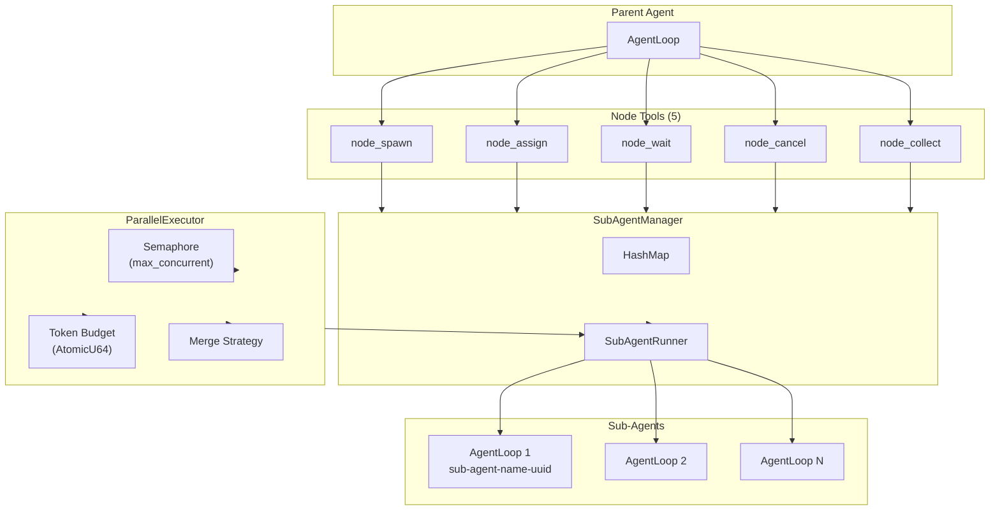
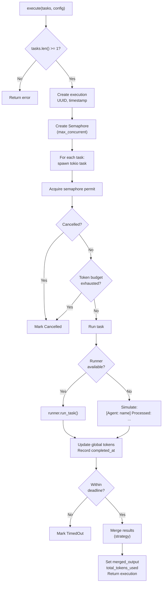

# 27 -- Parallel Execution

> **Module Goal:** Define the complete parallel execution system -- the `SubAgentRunner` trait, `ParallelExecutor` with semaphore-based concurrency control, 5 node tools for spawning/assigning/waiting/cancelling/collecting sub-agents, 3 merge strategies (concatenate/summarize/vote), token budget enforcement, and timeout handling -- so that the parent agent can orchestrate multiple sub-agents concurrently with full lifecycle management.

### Why This Module Exists

Complex tasks often decompose into independent subtasks that can be executed concurrently. A research query might spawn agents for different sources; a code review might spawn agents for different files. The parallel execution system provides two complementary interfaces: a high-level `ParallelExecutor` for batch execution with merge strategies, and a low-level `SubAgentManager` with 5 node tools for fine-grained control.

Each sub-agent gets its own isolated `AgentLoop` with an independent session ID, optional memory access, and configurable tool permissions. The parent agent controls concurrency via semaphore permits, enforces global token budgets, and collects results using one of three merge strategies.

### Business Benefits

| Benefit | Description |
|---------|-------------|
| **Concurrent execution** | Multiple sub-agents run simultaneously, bounded by configurable concurrency limit |
| **Token budget** | Global token budget prevents runaway costs across all sub-agents |
| **Merge strategies** | Concatenate, summarize, or vote to combine results intelligently |
| **Fine-grained control** | 5 node tools let the parent agent manage individual sub-agent lifecycles |
| **Isolation** | Each sub-agent gets its own session, preventing cross-contamination |

---

## 1. Architecture Overview



---

## 2. Core Traits

**Location:** `crates/antec-core/src/parallel.rs`

### 2.1 SubAgentRunner

```rust
#[async_trait]
pub trait SubAgentRunner: Send + Sync {
    async fn run_task(
        &self,
        agent_name: &str,
        instructions: &str,
        context: Option<&str>,
    ) -> Result<SubAgentOutput, CoreError>;
}
```

### 2.2 SubAgentOutput

```rust
pub struct SubAgentOutput {
    pub content: String,      // Text output from agent
    pub tokens_used: u64,     // Token consumption
}
```

### 2.3 ProviderFactory

```rust
pub type ProviderFactory = Arc<
    dyn Fn(Option<&str>, Option<&str>) -> Option<(Box<dyn LlmProvider>, String)>
        + Send + Sync,
>;
```

Takes optional provider and model names, returns boxed LLM provider and resolved model name.

---

## 3. DefaultSubAgentRunner

**Location:** `crates/antec-core/src/parallel.rs:59-103`

```rust
pub struct DefaultSubAgentRunner {
    db: Arc<Database>,
    agent_router: Arc<AgentRouter>,
    agent_spawner: Arc<AgentSpawner>,
    base_config: AgentConfig,
    provider_factory: ProviderFactory,
    memory_manager: Option<Arc<MemoryManager>>,
    tool_executor: Option<Arc<dyn ToolExecutor>>,
}
```

**Execution flow:**
1. Resolve agent definition from router/DB
2. Create isolated `AgentLoop` with session ID: `sub-agent-{name}-{uuid}`
3. Wire optional memory and tool executor
4. Execute agent loop with full message (context + instructions)
5. Collect output and token usage from `StreamEvent` stream

---

## 4. Merge Strategies

```rust
pub enum MergeStrategy {
    Concatenate,  // default
    Summarize,
    Vote,
}
```

### 4.1 Concatenate

Join all completed outputs with `"\n\n"` separator in completion order.

### 4.2 Summarize

Generate markdown with headers for each agent:

```markdown
## Parallel Execution Summary

### Agent: researcher
[output]

### Agent: analyst
[output]

Total: 2 agents completed
```

### 4.3 Vote

Majority vote selects output. Ties broken by first occurrence order.

```rust
// Count occurrences in HashMap
// Find max vote count
// Return winning output with vote ratio: "X/N agents agreed"
```

---

## 5. Parallel Task Data Model

```rust
pub struct ParallelTask {
    pub id: String,                     // UUID (auto-generated)
    pub agent_name: String,             // Agent definition to execute
    pub instructions: String,           // Task description/prompt
    pub context: Option<String>,        // Additional context
}

pub enum ParallelTaskStatus {
    Pending,
    Running,
    Completed,
    Failed,
    Cancelled,
}

pub struct ParallelTaskResult {
    pub task_id: String,
    pub agent_name: String,
    pub status: ParallelTaskStatus,
    pub output: Option<String>,
    pub error: Option<String>,
    pub tokens_used: u64,
    pub started_at: Option<i64>,        // Unix timestamp
    pub completed_at: Option<i64>,
}
```

---

## 6. Execution Configuration

```rust
pub struct ParallelExecutionConfig {
    pub max_concurrent: usize,          // default: 5
    pub token_budget: u64,              // 0 = unlimited
    pub timeout_ms: u64,                // 0 = no timeout
    pub merge_strategy: MergeStrategy,
}
```

---

## 7. ParallelExecutor Engine

**Location:** `crates/antec-core/src/parallel.rs:376-390`

```rust
pub struct ParallelExecutor {
    executions: RwLock<HashMap<String, Arc<Mutex<ParallelExecution>>>>,
    global_tokens_used: AtomicU64,
    cancelled: AtomicBool,
    cancel_notify: Notify,
    default_max_concurrent: usize,
    runner: Option<Arc<dyn SubAgentRunner>>,
}
```

### 7.1 Execute Algorithm



### 7.2 Key Methods

| Method | Description |
|--------|-------------|
| `new(max_concurrent)` | Constructor without runner (simulation mode) |
| `with_runner(max_concurrent, runner)` | Constructor with real runner |
| `execute(tasks, config)` | Main orchestrator -- returns `ParallelExecution` |
| `cancel_execution(id)` | Cancel all running/pending tasks |
| `get_execution(id)` | Retrieve single execution |
| `list_executions()` | List all stored executions |
| `global_tokens_used()` | Get global token counter |

---

## 8. SubAgentManager (Node Tools)

**Location:** `crates/antec-tools/src/nodes.rs`

### 8.1 State Structures

```rust
pub struct SubAgentManager {
    agents: Mutex<HashMap<String, SubAgent>>,
    max_agents: usize,
    runner: Option<Arc<dyn SubAgentRunner>>,
}

pub struct SubAgent {
    pub id: String,                     // UUID
    pub name: String,                   // Unique among active
    pub persona: Option<String>,        // System prompt
    pub tools: Vec<String>,            // Allowed tools (empty = all)
    pub context: Option<String>,        // Background info
    pub status: SubAgentStatus,
    pub current_task: Option<SubAgentTask>,
    pub output: Option<String>,
    pub error: Option<String>,
    pub created_at: i64,
    pub completed_at: Option<i64>,
    pub inherits_parent_policy: bool,   // Always true
}

pub enum SubAgentStatus {
    Idle, Running, Completed, Failed, Cancelled,
}

pub struct SubAgentTask {
    pub description: String,
    pub instructions: Option<String>,
    pub expected_output: Option<String>,
    pub timeout_ms: Option<u64>,
}
```

### 8.2 Manager Methods

| Method | Behavior |
|--------|----------|
| `spawn(name, persona, tools, context)` | Create idle sub-agent. Enforces max_agents + duplicate name check. |
| `assign(agent_id, task)` | Assign task. Rejects if Running/Cancelled. With runner: spawns background task. |
| `wait(agent_id, timeout_ms)` | Poll every 50ms until terminal status or timeout. |
| `cancel(agent_id, reason)` | Mark Cancelled. Rejects if already Completed/Failed/Cancelled. |
| `collect(agent_ids)` | Get multiple agents by ID. |
| `list()` | Get all agents. |

---

## 9. Node Tools (5 Tools)

All share `Arc<SubAgentManager>`, return JSON responses.

### 9.1 node_spawn

| Property | Value |
|----------|-------|
| **Risk Level** | Moderate |
| **Parameters** | `name` (required), `persona` (optional), `tools` (optional array), `context` (optional) |
| **Response** | `{ id, name, tools, inherits_parent_policy }` |

### 9.2 node_assign

| Property | Value |
|----------|-------|
| **Risk Level** | Moderate |
| **Parameters** | `agent_id` (required), `description` (required), `instructions` (optional), `expected_output` (optional), `timeout_ms` (optional, min 100) |
| **Response** | `{ status, id, name, output }` |

### 9.3 node_wait

| Property | Value |
|----------|-------|
| **Risk Level** | Safe |
| **Parameters** | `agent_id` (required), `timeout_ms` (optional, 0 = no timeout) |
| **Response** | `{ status, id, name, output, error, completed_at }` |

### 9.4 node_cancel

| Property | Value |
|----------|-------|
| **Risk Level** | Moderate |
| **Parameters** | `agent_id` (required), `reason` (required) |
| **Response** | `{ status: "cancelled", id, name, reason, cancelled_at }` |

### 9.5 node_collect

| Property | Value |
|----------|-------|
| **Risk Level** | Safe |
| **Parameters** | `agent_ids` (optional array; empty = all agents) |
| **Response** | Array of agent states + summary `{ total, completed, failed, running }` |

---

## 10. REST API Endpoints

| Endpoint | Method | Description |
|----------|--------|-------------|
| `/api/v1/parallel` | POST | Start parallel execution |
| `/api/v1/parallel` | GET | List all executions |
| `/api/v1/parallel/{id}` | GET | Get single execution |
| `/api/v1/parallel/{id}/cancel` | POST | Cancel execution |

### 10.1 Start Execution Request

```rust
struct StartParallelExecutionRequest {
    tasks: Vec<ParallelTaskInput>,
    config: ParallelExecutionConfigInput,
}

struct ParallelTaskInput {
    agent_name: String,
    instructions: String,
    context: Option<String>,
}

struct ParallelExecutionConfigInput {
    max_concurrent: usize,          // default: 5
    token_budget: u64,              // default: 0
    timeout_ms: u64,                // default: 0
    merge_strategy: String,         // default: "concatenate"
}
```

### 10.2 Execution Response

```rust
struct ParallelExecutionInfo {
    id: String,
    status: String,
    tasks: Vec<ParallelTaskInfo>,
    merged_output: Option<String>,
    total_tokens_used: u64,
    max_concurrent: usize,
    merge_strategy: String,
    created_at: i64,
    completed_at: Option<i64>,
}

struct ParallelTaskInfo {
    task_id: String,
    agent_name: String,
    status: String,
    output: Option<String>,
    error: Option<String>,
    tokens_used: u64,
    started_at: Option<i64>,
    completed_at: Option<i64>,
}
```

---

## 11. Integration

**AppState field:**
```rust
pub parallel_executor: Arc<antec_core::ParallelExecutor>
```

Initialized in boot sequence, accessible to all route handlers.

---

## 12. Implementation Checklist

| Step | Component | Key Files |
|------|-----------|-----------|
| 1 | `SubAgentRunner` trait + `SubAgentOutput` | `crates/antec-core/src/parallel.rs` |
| 2 | `DefaultSubAgentRunner` implementation | `crates/antec-core/src/parallel.rs` |
| 3 | `MergeStrategy` enum + merge functions | `crates/antec-core/src/parallel.rs` |
| 4 | `ParallelTask`, `ParallelTaskResult` structs | `crates/antec-core/src/parallel.rs` |
| 5 | `ParallelExecutor` with semaphore + budget | `crates/antec-core/src/parallel.rs` |
| 6 | `SubAgentManager` + `SubAgent` state | `crates/antec-tools/src/nodes.rs` |
| 7 | 5 node tools (spawn/assign/wait/cancel/collect) | `crates/antec-tools/src/nodes.rs` |
| 8 | REST endpoints for parallel execution | `crates/antec-gateway/src/routes/mod.rs` |
| 9 | AppState integration | `crates/antec-gateway/src/state.rs` |
