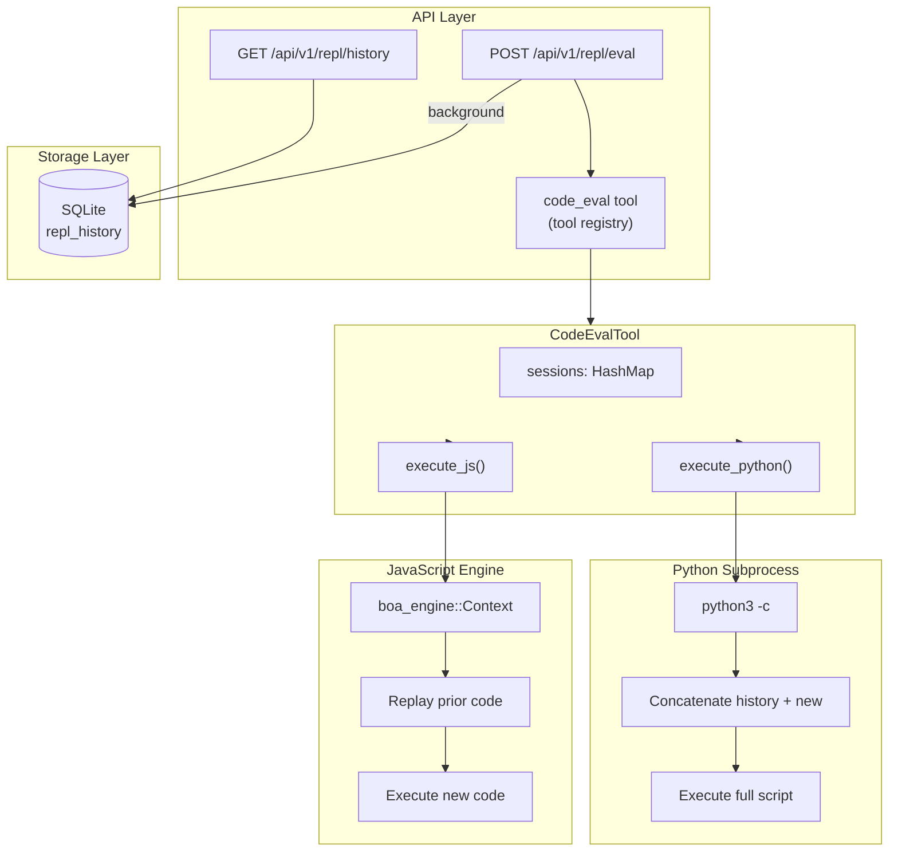
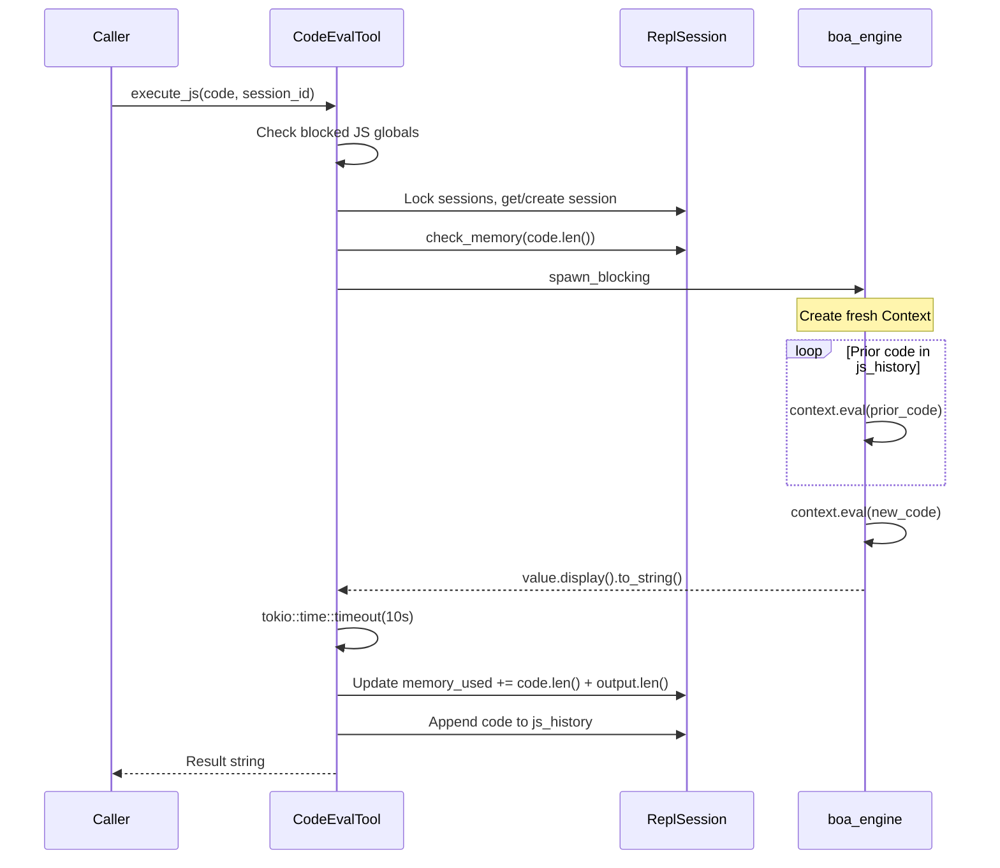
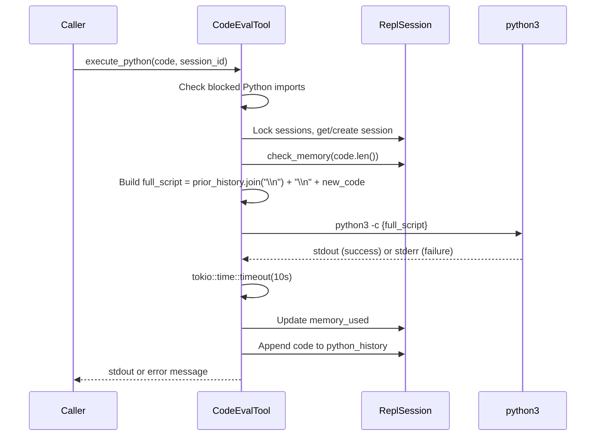

# 28 -- REPL System

> **Module Goal:** Define the complete REPL (Read-Eval-Print Loop) system -- sandboxed JavaScript evaluation via boa_engine, Python execution via subprocess, session-state persistence through code replay, blocked pattern lists for both languages, memory limits, timeout enforcement, SQLite history storage, and REST API -- so that the agent can safely evaluate code with stateful sessions and full audit trail.

### Why This Module Exists

An AI assistant that can reason about code is significantly more useful if it can *execute* code to verify its reasoning. The REPL system provides sandboxed code evaluation for JavaScript and Python with two critical constraints: security (no filesystem, network, or system access) and statefulness (variables persist across calls within a session).

JavaScript runs in-process via `boa_engine` (a Rust-native ECMAScript interpreter) with blocked globals. Python runs as a subprocess via `python3 -c` with blocked imports. Both languages maintain session state through code replay -- each new evaluation replays all prior code in the session to restore variable state, then executes the new code.

### Business Benefits

| Benefit | Description |
|---------|-------------|
| **Safe execution** | No filesystem, network, or system access -- blocked at pattern level |
| **Session persistence** | Variables survive across calls within a session via code replay |
| **Dual language** | JavaScript (in-process boa_engine) + Python (subprocess) |
| **Memory bounded** | 50 MB per session prevents resource exhaustion |
| **Full audit trail** | Every evaluation persisted to SQLite with input, output, success, and session ID |

---

## 1. Architecture Overview



---

## 2. Security: Blocked Patterns

### 2.1 JavaScript Blocked Globals

**Location:** `crates/antec-tools/src/eval.rs:33`

```rust
const BLOCKED_JS_GLOBALS: &[&str] = &[
    "require(",
    "import(",
    "fetch(",
    "XMLHttpRequest",
    "WebSocket(",
];
```

Blocks module loading and network access via substring match against user code.

### 2.2 Python Blocked Imports

**Location:** `crates/antec-tools/src/eval.rs:11`

```rust
const BLOCKED_PYTHON_IMPORTS: &[&str] = &[
    "import os",
    "import subprocess",
    "import socket",
    "import shutil",
    "import sys",
    "import ctypes",
    "import signal",
    "from os ",
    "from subprocess ",
    "from socket ",
    "from shutil ",
    "from sys ",
    "from ctypes ",
    "from signal ",
    "__import__",
    "open(",
    "exec(",
    "eval(",
];
```

Blocks dangerous modules and builtins via substring match. Patterns like `"from os "` (with trailing space) catch `from os import path` variants.

---

## 3. Constants

```rust
const EVAL_TIMEOUT_SECS: u64 = 10;                    // 10-second execution timeout
const MAX_SESSION_MEMORY_BYTES: usize = 50 * 1024 * 1024;  // 50 MB per session
```

---

## 4. Session State

**Location:** `crates/antec-tools/src/eval.rs`

```rust
pub struct ReplSession {
    js_history: Vec<String>,        // Prior JS code snippets
    python_history: Vec<String>,    // Prior Python code lines
    memory_used: usize,             // Cumulative bytes (code + output)
}

impl ReplSession {
    pub fn new() -> Self;

    pub fn check_memory(&self, additional: usize) -> Result<(), ToolError> {
        if self.memory_used + additional > MAX_SESSION_MEMORY_BYTES {
            return Err(ToolError::Blocked(format!(
                "REPL session memory limit exceeded: {} bytes used, limit is {} bytes",
                self.memory_used, MAX_SESSION_MEMORY_BYTES
            )));
        }
        Ok(())
    }
}
```

---

## 5. CodeEvalTool

```rust
pub struct CodeEvalTool {
    sessions: Arc<Mutex<HashMap<String, ReplSession>>>,
}
```

### 5.1 Tool Handler Interface

```rust
impl ToolHandler for CodeEvalTool {
    fn name(&self) -> &str { "code_eval" }

    fn description(&self) -> &str {
        "Sandboxed REPL: evaluate JavaScript or Python code with session-state persistence. \
         Variables carry across calls within a session. No filesystem or network access."
    }

    fn parameters(&self) -> Value {
        // JSON Schema:
        // language: string, enum: ["js", "python"] (required)
        // code: string (required)
        // session_id: string (optional)
    }

    fn risk_level(&self) -> RiskLevel { RiskLevel::Dangerous }
}
```

---

## 6. JavaScript Execution

**Location:** `crates/antec-tools/src/eval.rs:112-165`



**Key properties:**
- Fresh `boa_engine::Context::default()` created per execution (not reused)
- State preserved via **replay**: all prior code re-executed in fresh context
- Output: `value.display().to_string()`
- Errors: JS runtime errors caught as `ToolError::ExecutionFailed`
- Timeout: 10 seconds via `tokio::time::timeout()`

---

## 7. Python Execution

**Location:** `crates/antec-tools/src/eval.rs:168-219`



**Key properties:**
- Full accumulated script (all prior + new) passed as `-c` argument
- State preserved via **concatenation**: Python maintains scope in subprocess
- Captures stdout on success (exit 0), stderr on failure
- Timeout: 10 seconds

---

## 8. Session Persistence Strategy

| Language | State Method | Persistence | Isolation |
|----------|-------------|-------------|-----------|
| JavaScript | Code replay in fresh boa_engine Context | In-memory HashMap only | Per session_id |
| Python | Script concatenation via `python3 -c` | In-memory HashMap only | Per session_id |

**Important:** Session state is NOT persisted across server restart (in-memory only). History is persisted to SQLite for audit trail, but execution state must be rebuilt.

---

## 9. REST API Endpoints

### 9.1 POST /api/v1/repl/eval

**Request:**
```rust
struct ReplEvalRequest {
    language: String,           // "js" or "python"
    code: String,
    session_id: Option<String>, // Generated if not provided
}
```

**Response:**
```rust
struct ReplEvalResponse {
    output: String,
    success: bool,
    session_id: String,
}
```

**Flow:**
1. Generate `session_id` (UUID) if not provided
2. Build tool args JSON: `{ language, code, session_id }`
3. Look up `"code_eval"` tool in registry
4. Execute tool
5. Record history to SQLite (background task)
6. Return response

### 9.2 GET /api/v1/repl/history

**Query parameters:**
```rust
struct ReplHistoryQuery {
    session_id: Option<String>,
    limit: i64,                 // default: 100
}
```

**Response:** `Vec<ReplHistoryRow>` (newest first)

---

## 10. Storage Model

### 10.1 ReplHistoryRow

```rust
pub struct ReplHistoryRow {
    pub id: i64,                // Auto-increment
    pub session_id: String,     // Not unique (many per session)
    pub language: String,       // "js" or "python"
    pub code: String,           // Source code executed
    pub output: Option<String>, // Result or error message
    pub success: bool,
    pub created_at: i64,        // Unix timestamp
}
```

### 10.2 Repository Methods

**ReplHistoryRepo trait:**

| Method | SQL |
|--------|-----|
| `insert_repl_entry(entry)` | `INSERT INTO repl_history (session_id, language, code, output, success, created_at) VALUES (...)` |
| `get_repl_history(session_id, limit)` | `SELECT ... WHERE session_id = ?1 ORDER BY created_at DESC LIMIT ?2` |
| `get_all_repl_history(limit)` | `SELECT ... ORDER BY created_at DESC LIMIT ?1` |

**Note:** `success` stored as i32 (0/1), converted to bool on read.

---

## 11. Memory Limit Enforcement

```
Per-session limit: 50 MB (52,428,800 bytes)
Tracked: cumulative code.len() + output.len() across all evaluations
Checked: before each execution via session.check_memory(code.len())
Error: "REPL session memory limit exceeded: X bytes used, limit is 52428800 bytes"
Effect: Once exceeded, session is effectively locked (all future evals fail)
```

---

## 12. Timeout Enforcement

Both JavaScript and Python use identical timeout:

```rust
tokio::time::timeout(
    Duration::from_secs(EVAL_TIMEOUT_SECS),  // 10 seconds
    execution_task,
)
```

**Timeout errors:**
- JavaScript: `ToolError::Timeout("JavaScript execution timed out (10s)")`
- Python: `ToolError::Timeout("Python execution timed out (10s)")`

---

## 13. Implementation Checklist

| Step | Component | Key Files |
|------|-----------|-----------|
| 1 | `BLOCKED_JS_GLOBALS` + `BLOCKED_PYTHON_IMPORTS` constants | `crates/antec-tools/src/eval.rs` |
| 2 | `ReplSession` struct + memory check | `crates/antec-tools/src/eval.rs` |
| 3 | `CodeEvalTool` struct + ToolHandler impl | `crates/antec-tools/src/eval.rs` |
| 4 | `execute_js()` with boa_engine replay | `crates/antec-tools/src/eval.rs` |
| 5 | `execute_python()` with subprocess | `crates/antec-tools/src/eval.rs` |
| 6 | `ReplHistoryRow` model | `crates/antec-storage/src/models.rs` |
| 7 | `ReplHistoryRepo` trait + impl | `crates/antec-storage/src/repository.rs` |
| 8 | SQL migration: `repl_history` table | `crates/antec-storage/src/migrations/` |
| 9 | REST endpoint: `POST /api/v1/repl/eval` | `crates/antec-gateway/src/routes/mod.rs` |
| 10 | REST endpoint: `GET /api/v1/repl/history` | `crates/antec-gateway/src/routes/mod.rs` |
| 11 | Register `code_eval` in tool registry | `crates/antec-tools/src/lib.rs` |
