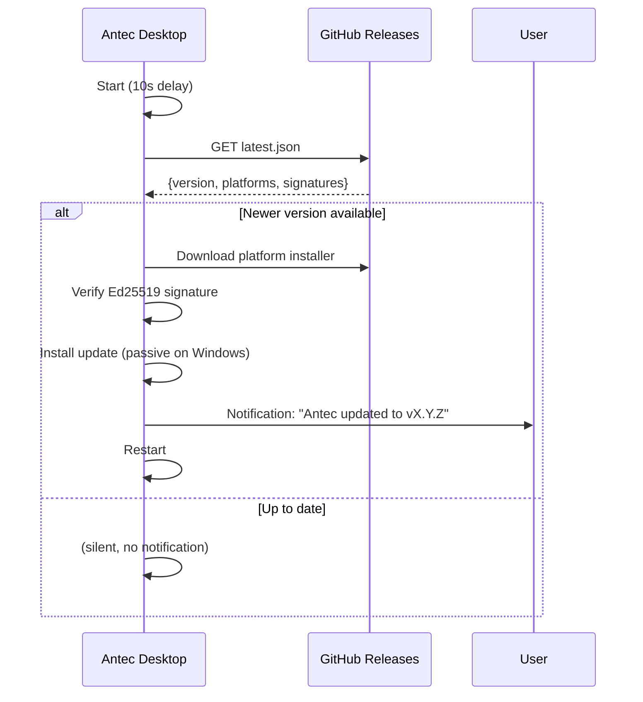

# 29 -- Deployment & Distribution

> **Module Goal:** Define the complete deployment pipeline -- build targets, packaging formats, release automation, install scripts, database migrations, Docker images, desktop auto-updater, systemd service, health monitoring, backup/restore, and security hardening -- so that Antec can be distributed as a single binary across all major platforms with zero-friction upgrades.

### Why This Module Exists

A self-hosted AI assistant is only as useful as it is easy to install and keep running. Without a clear deployment strategy, users face manual compilation, platform-specific gotchas, and risky upgrades. This document specifies every artifact the release pipeline produces, how each platform receives updates, and the operational patterns for running Antec in production.

Crate Rust workspace that ships CLI binaries, Docker multi-arch images, and Tauri desktop apps with Ed25519-signed auto-updates.

### Business Benefits

| Benefit | Description |
|---------|-------------|
| **Zero-friction install** | One-liner install scripts for Linux, macOS, and Windows -- no Rust toolchain required |
| **Multi-platform** | Native binaries for 5 targets, Docker for 2 architectures, desktop app for 3 OSes |
| **Automatic upgrades** | Desktop app auto-updates via signed manifests; Docker via `:latest` tag; CLI via re-running install script |
| **Zero-downtime schema changes** | SQLite migrations run on startup, append-only, idempotent -- users skip versions freely |
| **Production-hardened** | Systemd unit with 12 security directives, non-root Docker, health checks at three levels |
| **Data sovereignty** | All backup/restore is local -- no cloud sync, no telemetry, no external dependencies |

> **Crates**: All crates (distribution touches the final binary assembled from the entire workspace)
> **Scripts**: `scripts/docker/`, `scripts/install.sh`, `scripts/install.ps1`
> **CI**: `.github/workflows/release.yml`

---

## 1. Distribution Strategy

Antec ships as a **single binary** with zero mandatory external dependencies. Three distribution channels serve different user personas:

| Channel | Target Audience | Artifacts | Auto-Update |
|---------|----------------|-----------|-------------|
| **CLI** | Developers, server admins, Raspberry Pi | Platform-specific tarball/zip | Re-run install script |
| **Docker** | Home lab, NAS, cloud VPS | Multi-arch OCI image (ghcr.io) | `:latest` tag or Watchtower |
| **Desktop** | Non-technical users | macOS `.dmg`, Linux `.AppImage`/`.deb`, Windows `.msi` | Built-in Tauri auto-updater |

## 2. Build Targets

### 2.1 CLI Binary Targets

| Target Triple | OS | Arch | Runner | Notes |
|---------------|----|------|--------|-------|
| `x86_64-unknown-linux-gnu` | Linux | x86_64 | `ubuntu-22.04` | Primary server target |
| `aarch64-unknown-linux-gnu` | Linux | ARM64 | `ubuntu-22.04` + `cross` | Raspberry Pi 4/5, ARM VPS |
| `x86_64-apple-darwin` | macOS | Intel | `macos-13` | Legacy Mac support |
| `aarch64-apple-darwin` | macOS | Apple Silicon | `macos-14` | Primary Mac target |
| `x86_64-pc-windows-msvc` | Windows | x86_64 | `windows-latest` | Windows 10+ |

### 2.2 Desktop App Targets (Tauri 2.0)

| Platform | Format | Signing |
|----------|--------|---------|
| macOS (Universal) | `.dmg` + `.app.tar.gz` | Apple Developer ID (notarized) |
| Linux | `.AppImage` + `.deb` | None (AppImage self-contained) |
| Windows | `.msi` + `.exe` (NSIS) | Optional code signing certificate |

### 2.3 Docker Targets

| Architecture | Base Image | Notes |
|-------------|------------|-------|
| `linux/amd64` | `debian:bookworm-slim` | Primary cloud/VPS |
| `linux/arm64` | `debian:bookworm-slim` | Raspberry Pi, ARM servers |

---

## 3. Build System

### 3.1 Release Profile

```toml
# Cargo.toml [profile.release]
[profile.release]
opt-level = "z"          # Optimize for size (target < 20 MB)
lto = true               # Full link-time optimization
codegen-units = 1        # Single codegen unit for max optimization
strip = true             # Strip debug symbols
panic = "abort"          # Smaller than unwind tables
```

### 3.2 Build Prerequisites

```bash
# Core toolchain
rustup target add wasm32-wasip2       # WASM channel compilation
cargo install wasm-tools --locked      # WASM component model tooling
cargo install cross --locked           # Cross-compilation for ARM64 Linux

# Desktop app
cargo install tauri-cli --locked       # Tauri 2.0 CLI

# Optional: cargo-dist (future automation)
cargo install cargo-dist --locked      # Automated release packaging
```

### 3.3 Build Script (`build.rs`)

The workspace build script handles three compile-time embedding steps:

1. **WASM Channels** -- Compiles channel adapters from `channels-src/` to `.wasm` via `cargo build --target wasm32-wasip2`, converts to component model via `wasm-tools component new`, strips debug info via `wasm-tools strip`
2. **Registry Catalog** -- Collects all `registry/tools/*.json` and `registry/channels/*.json` manifests into a single `embedded_catalog.json` blob in `$OUT_DIR`
3. **Frontend Assets** -- `rust-embed` bakes the Web Console SPA (`crates/antec-console/frontend/`) into the binary with gzip pre-compression and MIME type detection

### 3.4 Cross-Compilation

```toml
# Cross.toml (for aarch64-unknown-linux-gnu)
[target.aarch64-unknown-linux-gnu]
pre-build = [
    "dpkg --add-architecture arm64",
    "apt-get update",
    "apt-get install -y libssl-dev:arm64"
]
```

All other targets build natively on their platform's runner. ARM64 Linux uses `cross` (Docker-based cross-compilation) since native ARM CI runners are expensive.

---

## 4. Packaging

### 4.1 CLI Archives

Each release produces platform-specific archives with SHA256 checksums:

```
antec-v{VERSION}-x86_64-unknown-linux-gnu.tar.gz
antec-v{VERSION}-x86_64-unknown-linux-gnu.tar.gz.sha256
antec-v{VERSION}-aarch64-unknown-linux-gnu.tar.gz
antec-v{VERSION}-aarch64-unknown-linux-gnu.tar.gz.sha256
antec-v{VERSION}-x86_64-apple-darwin.tar.gz
antec-v{VERSION}-x86_64-apple-darwin.tar.gz.sha256
antec-v{VERSION}-aarch64-apple-darwin.tar.gz
antec-v{VERSION}-aarch64-apple-darwin.tar.gz.sha256
antec-v{VERSION}-x86_64-pc-windows-msvc.zip
antec-v{VERSION}-x86_64-pc-windows-msvc.zip.sha256
```

Archive contents:

```
antec-v1.0.0-x86_64-unknown-linux-gnu/
    antec                    # The binary
    LICENSE
    antec.example.toml       # Annotated example config
```

macOS binaries receive ad-hoc codesigning in the release pipeline (`codesign -s -`).

### 4.2 Docker Image

```dockerfile
# scripts/docker/Dockerfile

# ── Builder ──────────────────────────────────────────────────
FROM rust:1.82-bookworm AS builder

RUN rustup target add wasm32-wasip2 && \
    cargo install wasm-tools --locked

WORKDIR /build
COPY . .

RUN cargo build --release && \
    strip target/release/antec

# ── Runtime ──────────────────────────────────────────────────
FROM debian:bookworm-slim

RUN apt-get update && \
    apt-get install -y --no-install-recommends \
        ca-certificates \
        libsqlite3-0 && \
    rm -rf /var/lib/apt/lists/*

# Non-root user (uid 1000)
RUN useradd -m -u 1000 -s /bin/sh antec
USER antec

COPY --from=builder /build/target/release/antec /usr/local/bin/antec

VOLUME ["/data"]

ENV ANTEC_DATA_DIR=/data
ENV ANTEC_CONFIG=/data/antec.toml

EXPOSE 8088

HEALTHCHECK --interval=30s --timeout=5s --retries=3 \
    CMD antec health || exit 1

ENTRYPOINT ["antec"]
CMD ["serve"]
```

**.dockerignore:**

```
target/
.git/
.env
.env.*
*.md
!CLAUDE.md
node_modules/
```

**Multi-arch build:**

```bash
docker buildx build \
    --platform linux/amd64,linux/arm64 \
    -t ghcr.io/antec/antec:latest \
    -t ghcr.io/antec/antec:${VERSION} \
    --push .
```

### 4.3 Docker Compose (Reference)

```yaml
# docker-compose.yml
services:
  antec:
    image: ghcr.io/antec/antec:latest
    container_name: antec
    restart: unless-stopped
    ports:
      - "8088:8088"
    volumes:
      - antec-data:/data
      - ./antec.toml:/data/antec.toml:ro
    environment:
      - RUST_LOG=antec=info
      - ANTEC_DATA_DIR=/data
      # Secrets via env vars -- never bake into image
      - ANTHROPIC_API_KEY=${ANTHROPIC_API_KEY}
    healthcheck:
      test: ["CMD", "antec", "health"]
      interval: 30s
      timeout: 5s
      retries: 3

volumes:
  antec-data:
```

### 4.4 Desktop App (Tauri 2.0)

The desktop app wraps the Antec binary with a native window hosting the Web Console. Tauri 2.0 provides cross-platform window management, system tray, and signed auto-updates.

```json
{
  "productName": "Antec",
  "version": "1.0.0",
  "identifier": "ai.antec.app",
  "build": {
    "beforeBuildCommand": "cargo build --release -p antec-console",
    "frontendDist": "../frontend/dist"
  },
  "bundle": {
    "active": true,
    "targets": ["dmg", "appimage", "deb", "msi", "nsis"],
    "icon": [
      "icons/32x32.png",
      "icons/128x128.png",
      "icons/128x128@2x.png",
      "icons/icon.icns",
      "icons/icon.ico"
    ]
  },
  "app": {
    "windows": [{
      "title": "Antec",
      "width": 1200,
      "height": 800,
      "minWidth": 768,
      "minHeight": 600
    }],
    "security": {
      "csp": "default-src 'self'; connect-src 'self' ws://127.0.0.1:8088"
    }
  },
  "plugins": {
    "updater": {
      "active": true,
      "pubkey": "UPDATER_PUBKEY_HERE",
      "endpoints": [
        "https://github.com/antec/antec/releases/latest/download/latest.json"
      ]
    }
  }
}
```

---

## 5. Install Scripts

### 5.1 Linux / macOS (`scripts/install.sh`)

Pattern:  installer with SHA256 verification, ad-hoc codesigning on macOS, and PATH setup for zsh/bash/fish.

```bash
#!/usr/bin/env bash
# Usage: curl -sSf https://antec.dev/install | sh
#
# Environment variables:
#   ANTEC_VERSION      Pin to a specific version (default: latest)
#   ANTEC_INSTALL_DIR  Override install directory (default: ~/.antec/bin)
set -euo pipefail

REPO="antec/antec"
INSTALL_DIR="${ANTEC_INSTALL_DIR:-$HOME/.antec/bin}"

# ── Detect platform ────────────────────────────────────────────
OS="$(uname -s | tr '[:upper:]' '[:lower:]')"
ARCH="$(uname -m)"

case "${OS}" in
    linux)  TARGET_OS="unknown-linux-gnu" ;;
    darwin) TARGET_OS="apple-darwin" ;;
    *)      echo "Error: unsupported OS '${OS}'"; exit 1 ;;
esac

case "${ARCH}" in
    x86_64|amd64)  TARGET_ARCH="x86_64" ;;
    aarch64|arm64) TARGET_ARCH="aarch64" ;;
    *)             echo "Error: unsupported architecture '${ARCH}'"; exit 1 ;;
esac

TARGET="${TARGET_ARCH}-${TARGET_OS}"

# ── Resolve version ────────────────────────────────────────────
if [ -n "${ANTEC_VERSION:-}" ]; then
    VERSION="${ANTEC_VERSION}"
else
    VERSION=$(curl -sSf "https://api.github.com/repos/${REPO}/releases/latest" \
        | grep '"tag_name"' | sed -E 's/.*"v([^"]+)".*/\1/')
fi

ARCHIVE="antec-v${VERSION}-${TARGET}.tar.gz"
URL="https://github.com/${REPO}/releases/download/v${VERSION}/${ARCHIVE}"
CHECKSUM_URL="${URL}.sha256"

echo "Installing Antec v${VERSION} for ${TARGET}..."

# ── Download and verify SHA256 ─────────────────────────────────
TMPDIR=$(mktemp -d)
trap "rm -rf ${TMPDIR}" EXIT

curl -sSfL "${URL}" -o "${TMPDIR}/${ARCHIVE}"
curl -sSfL "${CHECKSUM_URL}" -o "${TMPDIR}/${ARCHIVE}.sha256"

cd "${TMPDIR}"
if command -v sha256sum >/dev/null 2>&1; then
    sha256sum -c "${ARCHIVE}.sha256"
elif command -v shasum >/dev/null 2>&1; then
    shasum -a 256 -c "${ARCHIVE}.sha256"
else
    echo "Warning: no SHA256 tool found, skipping checksum verification"
fi

# ── Extract and install ────────────────────────────────────────
tar xzf "${ARCHIVE}"
mkdir -p "${INSTALL_DIR}"
install -m 755 "antec-v${VERSION}-${TARGET}/antec" "${INSTALL_DIR}/antec"

# Ad-hoc codesign on macOS (prevents Gatekeeper quarantine)
if [ "${OS}" = "darwin" ]; then
    codesign -s - "${INSTALL_DIR}/antec" 2>/dev/null || true
fi

# ── Update PATH ────────────────────────────────────────────────
add_to_path() {
    local line="export PATH=\"${INSTALL_DIR}:\$PATH\""
    for rc in "$HOME/.zshrc" "$HOME/.bashrc" "$HOME/.bash_profile"; do
        if [ -f "$rc" ] && ! grep -q "${INSTALL_DIR}" "$rc"; then
            echo "$line" >> "$rc"
        fi
    done
    # Fish shell
    local fish_conf="$HOME/.config/fish/conf.d/antec.fish"
    if [ -d "$(dirname "$fish_conf")" ]; then
        echo "set -gx PATH ${INSTALL_DIR} \$PATH" > "$fish_conf"
    fi
}
add_to_path

echo ""
echo "Antec v${VERSION} installed to ${INSTALL_DIR}/antec"
echo ""
echo "Quick start:"
echo "  antec init        # Create default config"
echo "  antec serve       # Start the assistant"
echo "  antec --help      # Show all commands"
echo ""
echo "Restart your shell or run: export PATH=\"${INSTALL_DIR}:\$PATH\""
```

### 5.2 Windows (`scripts/install.ps1`)

```powershell
# Usage: irm https://antec.dev/install.ps1 | iex
#
# Environment variables:
#   ANTEC_VERSION       Pin to a specific version
#   ANTEC_INSTALL_DIR   Override install directory
$ErrorActionPreference = "Stop"

$Repo = "antec/antec"
$Target = "x86_64-pc-windows-msvc"
$InstallDir = if ($env:ANTEC_INSTALL_DIR) { $env:ANTEC_INSTALL_DIR } else { "$env:LOCALAPPDATA\antec\bin" }

# Detect architecture (multi-method for reliability)
try {
    $Arch = [System.Runtime.InteropServices.RuntimeInformation]::OSArchitecture
    if ($Arch -eq "Arm64") { $Target = "aarch64-pc-windows-msvc" }
} catch {
    if ($env:PROCESSOR_ARCHITECTURE -eq "ARM64") { $Target = "aarch64-pc-windows-msvc" }
}

# Resolve version
if ($env:ANTEC_VERSION) {
    $Version = $env:ANTEC_VERSION
} else {
    $Release = Invoke-RestMethod "https://api.github.com/repos/$Repo/releases/latest"
    $Version = $Release.tag_name -replace '^v', ''
}

$Archive = "antec-v$Version-$Target.zip"
$Url = "https://github.com/$Repo/releases/download/v$Version/$Archive"
$ChecksumUrl = "$Url.sha256"

Write-Host "Installing Antec v$Version for $Target..."

# Download
$TmpDir = New-TemporaryFile | ForEach-Object { Remove-Item $_; New-Item -ItemType Directory -Path $_ }
$ArchivePath = Join-Path $TmpDir $Archive
Invoke-WebRequest -Uri $Url -OutFile $ArchivePath

# Verify SHA256
$ChecksumPath = Join-Path $TmpDir "$Archive.sha256"
Invoke-WebRequest -Uri $ChecksumUrl -OutFile $ChecksumPath
$Expected = (Get-Content $ChecksumPath).Split(" ")[0].Trim()
$Actual = (Get-FileHash $ArchivePath -Algorithm SHA256).Hash.ToLower()
if ($Actual -ne $Expected) {
    throw "SHA256 mismatch: expected $Expected, got $Actual"
}

# Extract and install
Expand-Archive -Path $ArchivePath -DestinationPath $TmpDir -Force
New-Item -ItemType Directory -Path $InstallDir -Force | Out-Null
Copy-Item "$TmpDir\antec-v$Version-$Target\antec.exe" "$InstallDir\antec.exe" -Force

# Add to user PATH
$UserPath = [Environment]::GetEnvironmentVariable("Path", "User")
if ($UserPath -notlike "*$InstallDir*") {
    [Environment]::SetEnvironmentVariable("Path", "$UserPath;$InstallDir", "User")
    Write-Host "Added $InstallDir to PATH (restart terminal to take effect)"
}

Remove-Item $TmpDir -Recurse -Force
Write-Host ""
Write-Host "Antec v$Version installed to $InstallDir\antec.exe"
Write-Host ""
Write-Host "Quick start:"
Write-Host "  antec init        # Create default config"
Write-Host "  antec serve       # Start the assistant"
Write-Host "  antec --help      # Show all commands"
```

### 5.3 Install Smoke Test

```dockerfile
# scripts/docker/install-smoke.Dockerfile
FROM debian:bookworm-slim
RUN apt-get update && apt-get install -y curl ca-certificates
COPY scripts/install.sh /tmp/install.sh
RUN bash -n /tmp/install.sh
# Optional: full E2E (requires a published release)
# RUN bash /tmp/install.sh && antec --version
```

---

## 6. GitHub Actions Release Pipeline

### 6.1 Trigger

Releases are triggered by pushing a semver git tag:

```bash
# Verify version consistency
grep '^version' Cargo.toml
grep '"version"' crates/antec-console/tauri.conf.json

# Tag and push
git tag v1.0.0
git push origin main --tags
```

### 6.2 Workflow (`.github/workflows/release.yml`)

```yaml
name: Release
on:
  push:
    tags: ["v*"]

permissions:
  contents: write
  packages: write

env:
  CARGO_TERM_COLOR: always

jobs:
  # ── Job 1: CLI Binaries ────────────────────────────────────
  build-cli:
    strategy:
      matrix:
        include:
          - target: x86_64-unknown-linux-gnu
            os: ubuntu-22.04
            archive: tar.gz
            use_cross: false
          - target: aarch64-unknown-linux-gnu
            os: ubuntu-22.04
            archive: tar.gz
            use_cross: true
          - target: x86_64-apple-darwin
            os: macos-13
            archive: tar.gz
            use_cross: false
          - target: aarch64-apple-darwin
            os: macos-14
            archive: tar.gz
            use_cross: false
          - target: x86_64-pc-windows-msvc
            os: windows-latest
            archive: zip
            use_cross: false
    runs-on: ${{ matrix.os }}

    steps:
      - uses: actions/checkout@v4

      - name: Install Rust toolchain
        uses: dtolnay/rust-toolchain@stable
        with:
          targets: ${{ matrix.target }},wasm32-wasip2

      - name: Install wasm-tools
        run: cargo install wasm-tools --locked

      - name: Install cross
        if: matrix.use_cross
        run: cargo install cross --locked

      - name: Build
        shell: bash
        run: |
          if [ "${{ matrix.use_cross }}" = "true" ]; then
            cross build --release --target ${{ matrix.target }}
          else
            cargo build --release --target ${{ matrix.target }}
          fi

      - name: Ad-hoc codesign (macOS)
        if: contains(matrix.target, 'apple-darwin')
        run: codesign -s - target/${{ matrix.target }}/release/antec

      - name: Package (tar.gz)
        if: matrix.archive == 'tar.gz'
        shell: bash
        run: |
          VERSION=${GITHUB_REF_NAME#v}
          DIR="antec-v${VERSION}-${{ matrix.target }}"
          mkdir "${DIR}"
          cp "target/${{ matrix.target }}/release/antec" "${DIR}/"
          cp LICENSE "${DIR}/" 2>/dev/null || true
          cp antec.example.toml "${DIR}/" 2>/dev/null || true
          tar czf "${DIR}.tar.gz" "${DIR}"
          shasum -a 256 "${DIR}.tar.gz" > "${DIR}.tar.gz.sha256"

      - name: Package (zip)
        if: matrix.archive == 'zip'
        shell: pwsh
        run: |
          $Version = "$env:GITHUB_REF_NAME" -replace '^v', ''
          $Dir = "antec-v${Version}-${{ matrix.target }}"
          New-Item -ItemType Directory -Path $Dir
          Copy-Item "target/${{ matrix.target }}/release/antec.exe" "$Dir/"
          Copy-Item "LICENSE" "$Dir/" -ErrorAction SilentlyContinue
          Copy-Item "antec.example.toml" "$Dir/" -ErrorAction SilentlyContinue
          Compress-Archive -Path $Dir -DestinationPath "${Dir}.zip"
          $hash = (Get-FileHash "${Dir}.zip" -Algorithm SHA256).Hash.ToLower()
          "${hash}  ${Dir}.zip" | Out-File "${Dir}.zip.sha256" -Encoding ascii

      - uses: actions/upload-artifact@v4
        with:
          name: cli-${{ matrix.target }}
          path: |
            antec-v*.tar.gz
            antec-v*.tar.gz.sha256
            antec-v*.zip
            antec-v*.zip.sha256

  # ── Job 2: Desktop App (Tauri) ─────────────────────────────
  build-desktop:
    strategy:
      matrix:
        include:
          - os: ubuntu-22.04
            target: linux
          - os: macos-14
            target: macos
          - os: windows-latest
            target: windows
    runs-on: ${{ matrix.os }}

    steps:
      - uses: actions/checkout@v4

      - name: Install Rust toolchain
        uses: dtolnay/rust-toolchain@stable
        with:
          targets: wasm32-wasip2

      - name: Install system deps (Linux)
        if: matrix.target == 'linux'
        run: |
          sudo apt-get update
          sudo apt-get install -y libwebkit2gtk-4.1-dev \
              libayatana-appindicator3-dev librsvg2-dev

      - name: Build desktop app
        uses: tauri-apps/tauri-action@v0
        env:
          GITHUB_TOKEN: ${{ secrets.GITHUB_TOKEN }}
          TAURI_SIGNING_PRIVATE_KEY: ${{ secrets.TAURI_SIGNING_PRIVATE_KEY }}
          TAURI_SIGNING_PRIVATE_KEY_PASSWORD: ${{ secrets.TAURI_SIGNING_PRIVATE_KEY_PASSWORD }}
          # macOS notarization (optional)
          APPLE_CERTIFICATE: ${{ secrets.APPLE_CERTIFICATE }}
          APPLE_CERTIFICATE_PASSWORD: ${{ secrets.APPLE_CERTIFICATE_PASSWORD }}
          APPLE_SIGNING_IDENTITY: ${{ secrets.APPLE_SIGNING_IDENTITY }}
          APPLE_ID: ${{ secrets.APPLE_ID }}
          APPLE_PASSWORD: ${{ secrets.APPLE_PASSWORD }}
          APPLE_TEAM_ID: ${{ secrets.APPLE_TEAM_ID }}
        with:
          tagName: ${{ github.ref_name }}
          releaseName: "Antec ${{ github.ref_name }}"
          releaseBody: "See CHANGELOG.md for details."
          releaseDraft: false
          prerelease: false
          includeUpdaterJson: true

  # ── Job 3: Docker Image ────────────────────────────────────
  build-docker:
    runs-on: ubuntu-latest
    steps:
      - uses: actions/checkout@v4

      - uses: docker/setup-buildx-action@v3
      - uses: docker/setup-qemu-action@v3

      - name: Login to GHCR
        uses: docker/login-action@v3
        with:
          registry: ghcr.io
          username: ${{ github.actor }}
          password: ${{ secrets.GITHUB_TOKEN }}

      - name: Build and push
        uses: docker/build-push-action@v5
        with:
          context: .
          file: scripts/docker/Dockerfile
          platforms: linux/amd64,linux/arm64
          push: true
          tags: |
            ghcr.io/antec/antec:latest
            ghcr.io/antec/antec:${{ github.ref_name }}
          cache-from: type=gha
          cache-to: type=gha,mode=max

  # ── Job 4: GitHub Release ──────────────────────────────────
  publish-release:
    needs: [build-cli, build-docker]
    runs-on: ubuntu-latest
    steps:
      - uses: actions/download-artifact@v4
        with:
          pattern: cli-*
          merge-multiple: true

      - name: Create GitHub Release
        uses: softprops/action-gh-release@v2
        with:
          generate_release_notes: true
          files: |
            antec-v*.tar.gz
            antec-v*.tar.gz.sha256
            antec-v*.zip
            antec-v*.zip.sha256
```

> **Note:** The `build-desktop` job (Tauri action) creates the GitHub Release and uploads desktop artifacts + `latest.json` automatically. The `publish-release` job appends CLI artifacts to the same release.

### 6.3 CI Test Pipeline (`.github/workflows/ci.yml`)

```yaml
name: CI
on:
  push:
    branches: [main]
  pull_request:

jobs:
  check:
    strategy:
      matrix:
        os: [ubuntu-22.04, macos-14, windows-latest]
    runs-on: ${{ matrix.os }}
    steps:
      - uses: actions/checkout@v4
      - uses: dtolnay/rust-toolchain@stable
      - run: cargo check --workspace

  test:
    runs-on: ubuntu-22.04
    steps:
      - uses: actions/checkout@v4
      - uses: dtolnay/rust-toolchain@stable
      - run: cargo test --workspace

  clippy:
    runs-on: ubuntu-22.04
    steps:
      - uses: actions/checkout@v4
      - uses: dtolnay/rust-toolchain@stable
        with:
          components: clippy
      - run: cargo clippy --workspace --all-features -- -D warnings

  format:
    runs-on: ubuntu-22.04
    steps:
      - uses: actions/checkout@v4
      - uses: dtolnay/rust-toolchain@stable
        with:
          components: rustfmt
      - run: cargo fmt --check

  security-audit:
    runs-on: ubuntu-22.04
    steps:
      - uses: actions/checkout@v4
      - uses: rustsec/audit-check@v2
        with:
          token: ${{ secrets.GITHUB_TOKEN }}

  install-smoke:
    runs-on: ubuntu-22.04
    steps:
      - uses: actions/checkout@v4
      - run: bash -n scripts/install.sh
      - run: shellcheck scripts/install.sh
```

---

## 7. Database Migrations

Antec uses **SQLite with version-tracked sequential migrations** (pattern `PRAGMA user_version` approach).

### 7.1 Migration Engine

```rust
// crates/antec-storage/src/migration.rs

/// Current schema version -- bump when adding a new migrate_vN function.
const SCHEMA_VERSION: u32 = 1;

/// Run all pending migrations on startup. Idempotent and append-only.
pub fn run_migrations(conn: &rusqlite::Connection) -> Result<(), rusqlite::Error> {
    let current = get_schema_version(conn);

    if current < 1 { migrate_v1(conn)?; }
    // if current < 2 { migrate_v2(conn)?; }
    // Add new migrations here -- NEVER modify existing migrate_vN functions.

    set_schema_version(conn, SCHEMA_VERSION)?;
    Ok(())
}

fn get_schema_version(conn: &rusqlite::Connection) -> u32 {
    conn.pragma_query_value(None, "user_version", |row| row.get(0))
        .unwrap_or(0)
}

fn set_schema_version(conn: &rusqlite::Connection, v: u32) -> Result<(), rusqlite::Error> {
    conn.pragma_update(None, "user_version", v)
}

/// Check if a column exists (SQLite lacks ADD COLUMN IF NOT EXISTS).
fn column_exists(conn: &rusqlite::Connection, table: &str, column: &str) -> bool {
    let sql = format!("PRAGMA table_info({})", table);
    let Ok(mut stmt) = conn.prepare(&sql) else { return false };
    let Ok(rows) = stmt.query_map([], |row| row.get::<_, String>(1)) else { return false };
    rows.filter_map(|r| r.ok()).any(|n| n == column)
}
```

### 7.2 Migration Rules

| Rule | Rationale |
|------|-----------|
| Migrations are **append-only** | Never modify an existing `migrate_vN` function after release |
| Each migration is **idempotent** | `CREATE TABLE IF NOT EXISTS`, `column_exists()` guard before `ALTER TABLE` |
| Migrations run **on startup** | No separate migration command -- zero-friction upgrades |
| Pre-migration backup | Copy `antec.db` to `antec.db.bak-vN` before running new migrations |
| Test with in-memory SQLite | Every migration gets `#[test]` proving idempotency (`run_migrations` twice) |
| Version skipping is safe | v1.0 -> v2.0 runs all intermediate migrations sequentially |

### 7.3 Upgrade Path Diagram

```
v1.0.0 (schema v1) ──> v1.1.0 (schema v2) ──> v2.0.0 (schema v5)
          │                      │                        │
     migrate_v1            migrate_v2               migrate_v3
                                                    migrate_v4
                                                    migrate_v5
```

---

## 8. Configuration for Deployment

### 8.1 Config File Location

| Platform | Default Path |
|----------|-------------|
| Linux | `~/.config/antec/antec.toml` |
| macOS | `~/Library/Application Support/antec/antec.toml` |
| Windows | `%APPDATA%\antec\antec.toml` |
| Docker | `/data/antec.toml` (via volume mount) |
| Override | `$ANTEC_CONFIG` environment variable |

### 8.2 Config Layering (Priority Order)

```
1. Compiled defaults           (lowest -- all fields have serde defaults)
2. antec.toml config file
3. Environment variables       (ANTEC_* prefix)
4. CLI flags                   (--port, --data-dir, etc.)
5. Runtime API changes         (highest -- ephemeral, lost on restart)
```

### 8.3 Minimal Production Config

```toml
# antec.toml -- minimal self-hosted deployment

[server]
host = "127.0.0.1"
port = 8088

[llm]
provider = "anthropic"
model = "claude-sonnet-4-20250514"
# API key via env: ANTHROPIC_API_KEY (never in config file)

[storage]
data_dir = "/var/lib/antec"   # Linux server
# data_dir = "/data"          # Docker

[security]
pairing_enabled = true        # First-run OTP pairing
injection_detection = true
rate_limit_rpm = 60
```

### 8.4 Secrets Management

Secrets are **never** stored in `antec.toml`. Following pattern, config fields reference environment variable names:

```toml
[llm]
api_key_env = "ANTHROPIC_API_KEY"   # Name of env var, not the actual key
```

Sensitive fields are automatically redacted in debug output and logs.

For Docker, pass secrets via `--env-file`:

```bash
docker run -d --env-file .env -v antec-data:/data ghcr.io/antec/antec:latest
```

### 8.5 Daemon Discovery

When Antec starts in daemon mode, it writes `~/.config/antec/daemon.json`:

```json
{
  "pid": 12345,
  "listen": "127.0.0.1:8088",
  "started_at": "2026-03-08T12:00:00Z",
  "version": "1.0.0",
  "platform": "aarch64-apple-darwin"
}
```

CLI commands (`antec status`, `antec health`) use this file to auto-discover the running instance.

---

## 9. Health Checks & Monitoring

Three-tier health check pattern:

### 9.1 Public Health Endpoint

```
GET /health → 200 OK
{
  "status": "ok",
  "version": "1.0.0"
}
```

Minimal -- no internal details exposed. Returns `"degraded"` if database is unreachable.

### 9.2 Authenticated Detailed Health

```
GET /api/v1/health/detail → 200 OK  (requires auth token)
{
  "status": "ok",
  "version": "1.0.0",
  "uptime_secs": 3600,
  "db_ok": true,
  "active_sessions": 3,
  "panic_count": 0,
  "restart_count": 0,
  "agents_loaded": 1,
  "skills_loaded": 12,
  "mcp_servers_connected": 2,
  "config_warnings": []
}
```

### 9.3 Prometheus Metrics

```
GET /api/v1/metrics → 200 OK  (text/plain; version=0.0.4)

# HELP antec_uptime_seconds Time since server start
# TYPE antec_uptime_seconds gauge
antec_uptime_seconds 3600

# HELP antec_sessions_active Currently active sessions
# TYPE antec_sessions_active gauge
antec_sessions_active 3

# HELP antec_tokens_total Total tokens consumed
# TYPE antec_tokens_total counter
antec_tokens_total{direction="input"} 150000
antec_tokens_total{direction="output"} 45000

# HELP antec_tool_calls_total Total tool invocations
# TYPE antec_tool_calls_total counter
antec_tool_calls_total 892

# HELP antec_panics_total Recovered panics
# TYPE antec_panics_total counter
antec_panics_total 0
```

### 9.4 CLI Health & Diagnostics

```bash
antec health              # Exit 0 if healthy, exit 1 if not
antec health --json       # JSON output for monitoring tools
antec doctor              # 15+ diagnostic checks (config, API keys, DB, skills)
antec doctor --repair     # Auto-fix known issues
```

### 9.5 Logging

```bash
# Structured logging via RUST_LOG
RUST_LOG=antec=info                    # Production
RUST_LOG=antec=debug,tower_http=debug  # Development
RUST_LOG=antec=trace                   # Troubleshooting
```

Logs go to stderr. Docker captures via `docker logs`. For file logging, redirect or use a sidecar.

---

## 10. Systemd Service (Linux)

Pattern with 12 security hardening directives.

```ini
# /etc/systemd/system/antec.service
# Or: deploy/antec.service in the repository
[Unit]
Description=Antec AI Assistant
After=network-online.target
Wants=network-online.target

[Service]
Type=simple
User=antec
Group=antec
WorkingDirectory=/var/lib/antec
ExecStart=/usr/local/bin/antec serve
Restart=on-failure
RestartSec=5
TimeoutStartSec=10

# Environment
Environment=RUST_LOG=antec=info
EnvironmentFile=-/etc/antec/env

# ── Security hardening ────────────────────────────────────────
NoNewPrivileges=true
ProtectSystem=strict
ProtectHome=true
ReadWritePaths=/var/lib/antec
PrivateTmp=true
ProtectKernelTunables=true
ProtectKernelModules=true
ProtectControlGroups=true
RestrictSUIDSGID=true
RestrictRealtime=true
MemoryDenyWriteExecute=false          # Required for WASM sandbox (Wasmtime JIT)

# Resource limits
LimitNOFILE=65536
LimitNPROC=4096
MemoryMax=512M
TasksMax=256

[Install]
WantedBy=multi-user.target
```

Setup:

```bash
sudo useradd -r -s /sbin/nologin -d /var/lib/antec antec
sudo mkdir -p /var/lib/antec
sudo chown antec:antec /var/lib/antec
sudo cp deploy/antec.service /etc/systemd/system/
sudo systemctl daemon-reload
sudo systemctl enable --now antec
sudo systemctl status antec
```

---

## 11. Desktop Auto-Updater

### 11.1 Architecture (Tauri 2.0 Updater)



### 11.2 Signing Key Setup (One-Time)

```bash
# Generate Ed25519 keypair for update signing
cargo tauri signer generate -w ~/.tauri/antec.key

# Store in GitHub Secrets:
#   TAURI_SIGNING_PRIVATE_KEY     → contents of ~/.tauri/antec.key
#   TAURI_SIGNING_PRIVATE_KEY_PASSWORD → passphrase (if set)
#
# Embed public key in tauri.conf.json → plugins.updater.pubkey
```

### 11.3 Updater Manifest (`latest.json`)

Published alongside every GitHub Release:

```json
{
  "version": "1.1.0",
  "notes": "Bug fixes and performance improvements",
  "pub_date": "2026-03-08T12:00:00Z",
  "platforms": {
    "darwin-aarch64": {
      "signature": "dW50cnVzdGVkIGNvbW1lbnQ6...",
      "url": "https://github.com/antec/antec/releases/download/v1.1.0/Antec.app.tar.gz"
    },
    "darwin-x86_64": {
      "signature": "dW50cnVzdGVkIGNvbW1lbnQ6...",
      "url": "https://github.com/antec/antec/releases/download/v1.1.0/Antec.app.tar.gz"
    },
    "linux-x86_64": {
      "signature": "dW50cnVzdGVkIGNvbW1lbnQ6...",
      "url": "https://github.com/antec/antec/releases/download/v1.1.0/antec_1.1.0_amd64.AppImage"
    },
    "windows-x86_64": {
      "signature": "dW50cnVzdGVkIGNvbW1lbnQ6...",
      "url": "https://github.com/antec/antec/releases/download/v1.1.0/Antec_1.1.0_x64-setup.msi"
    }
  }
}
```

---

## 12. Raspberry Pi Deployment

Antec's ARM64 support makes it ideal for always-on Raspberry Pi deployment.

### 12.1 Recommended Hardware

| Model | RAM | Notes |
|-------|-----|-------|
| Raspberry Pi 4 Model B | 4 GB+ | Good baseline for single-user |
| Raspberry Pi 5 | 4 GB+ | Better performance, NVMe option |

### 12.2 Setup

```bash
# Option 1: Install script (recommended)
curl -sSf https://antec.dev/install | sh

# Option 2: Docker
docker run -d \
    --name antec \
    --restart unless-stopped \
    -p 8088:8088 \
    -v antec-data:/data \
    ghcr.io/antec/antec:latest

# Initialize and start
antec init
antec serve
```

### 12.3 Performance Tuning for Pi

```toml
# antec.toml -- Pi-optimized settings
[server]
max_concurrent_sessions = 3    # Limit for 4 GB RAM

[memory]
compaction_threshold = 50      # Compact earlier to save RAM

[storage]
sqlite_cache_size_kb = 8192    # 8 MB SQLite cache (default: 32 MB)
```

---

## 13. Backup & Restore

### 13.1 What to Back Up

| Path | Contents | Critical |
|------|----------|----------|
| `antec.toml` | Configuration | Yes |
| `antec.db` | SQLite database (conversations, memory, sessions, schedules) | Yes |
| `workspace/` | Memory files, workspace documents | Yes |
| `skills/` | Installed SKILL.md files | No (re-downloadable) |

### 13.2 Backup

```bash
# Built-in backup (creates timestamped archive)
antec backup --output /backups/

# Manual (safe while running -- SQLite WAL mode allows concurrent reads)
sqlite3 ~/.config/antec/antec.db ".backup '/backups/antec-$(date +%Y%m%d).db'"
```

### 13.3 Restore

```bash
# From backup archive
antec restore --from /backups/antec-backup-20260308.tar.gz

# Manual restore
cp /backups/antec-20260308.db ~/.config/antec/antec.db
antec serve   # Migrations run automatically on startup
```

---

## 14. Uninstall

```bash
# CLI uninstall (stops daemon, removes binary, cleans PATH)
antec uninstall                # Interactive confirmation
antec uninstall --keep-config  # Preserve config and data
antec uninstall --force        # No confirmation

# Manual cleanup
rm -rf ~/.antec/
rm -rf ~/.config/antec/
# Remove PATH entries from ~/.zshrc, ~/.bashrc
```

Docker cleanup:

```bash
docker stop antec && docker rm antec
docker volume rm antec-data     # Removes all data
docker rmi ghcr.io/antec/antec
```

---

## 15. Security Considerations for Production

| Concern | Mitigation |
|---------|------------|
| **Exposed port** | Bind to `127.0.0.1` by default. Use reverse proxy (nginx/Caddy) for external access with TLS |
| **TLS termination** | Antec speaks plain HTTP/WS. Terminate TLS at reverse proxy -- never expose port 8088 directly |
| **First-run pairing** | OTP printed to stdout on first launch. Must be entered in Web Console to authenticate |
| **API authentication** | Bearer token issued after pairing. Stored in browser localStorage and `daemon.json` |
| **Secrets in config** | Never stored directly -- `api_key_env` references env var names. Redacted in debug output |
| **Docker secrets** | Never bake API keys into images. Use `--env-file` or Docker secrets |
| **File permissions** | Data directory owned by dedicated `antec` user (non-root) with mode 700 |
| **Container hardening** | Non-root user (uid 1000) in Dockerfile. Read-only filesystem where possible |
| **Systemd isolation** | 12 security directives: `NoNewPrivileges`, `ProtectSystem=strict`, `PrivateTmp`, etc. |
| **Network isolation** | Docker: dedicated bridge network. Systemd: `IPAddressDeny` for restrictive setups |
| **Supply chain** | SHA256 checksums on every CLI archive. Ed25519 signatures on desktop updates |
| **Dependency audit** | `cargo audit` in CI pipeline. Dependabot for weekly update PRs |

---

## 16. Release Checklist

### Pre-Release

- [ ] Version bumped consistently in `Cargo.toml` (workspace root) and `tauri.conf.json`
- [ ] `CHANGELOG.md` updated with release notes
- [ ] `cargo test --workspace` passes
- [ ] `cargo clippy --workspace --all-features -- -D warnings` clean
- [ ] Binary size < 20 MB (`ls -lh target/release/antec`)
- [ ] Docker build succeeds locally (`docker build -f scripts/docker/Dockerfile .`)
- [ ] Install scripts pass lint (`shellcheck scripts/install.sh`)
- [ ] Tauri signing keys configured in GitHub Secrets

### Tag and Push

```bash
git tag v${VERSION}
git push origin main --tags
```

### Post-Release Verification

- [ ] GitHub Release has all CLI archives (5 targets) + checksums
- [ ] Desktop installers present (`.dmg`, `.AppImage`, `.deb`, `.msi`)
- [ ] `latest.json` present with valid Ed25519 signatures
- [ ] `docker pull ghcr.io/antec/antec:latest` works on amd64 and arm64
- [ ] Install script fetches correct version
- [ ] `antec --version` matches the tag
- [ ] Desktop auto-updater picks up new version (test with previous version installed)

### Implementation Checklist

- [ ] Create `scripts/docker/Dockerfile` (multi-stage, non-root, healthcheck)
- [ ] Create `scripts/install.sh` (platform detection, SHA256, PATH setup)
- [ ] Create `scripts/install.ps1` (architecture detection, SHA256, PATH setup)
- [ ] Create `scripts/docker/install-smoke.Dockerfile` (install script validation)
- [ ] Create `.github/workflows/release.yml` (CLI + Desktop + Docker pipeline)
- [ ] Create `.github/workflows/ci.yml` (check + test + clippy + fmt + audit)
- [ ] Create `deploy/antec.service` (systemd unit with security hardening)
- [ ] Create `docker-compose.yml` (reference deployment)
- [ ] Create `antec.example.toml` (annotated example config)
- [ ] Create `Cross.toml` (ARM64 Linux cross-compilation)
- [ ] Implement migration engine in `crates/antec-storage/src/migration.rs`
- [ ] Implement `antec health` CLI subcommand
- [ ] Implement `GET /health` and `GET /api/v1/health/detail` endpoints
- [ ] Implement `GET /api/v1/metrics` Prometheus endpoint
- [ ] Implement `antec doctor` diagnostic CLI subcommand
- [ ] Implement `antec backup` and `antec restore` CLI subcommands
- [ ] Implement `antec uninstall` CLI subcommand
- [ ] Implement daemon discovery (`daemon.json` write on startup)
- [ ] Configure Tauri 2.0 updater with Ed25519 signing in `tauri.conf.json`
- [ ] Set up GHCR package repository for Docker images
