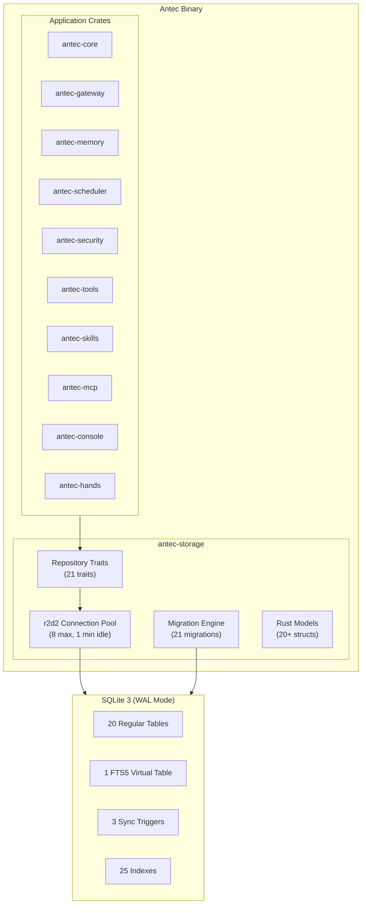
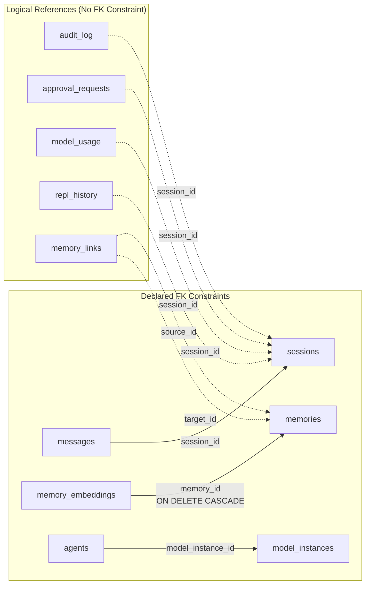
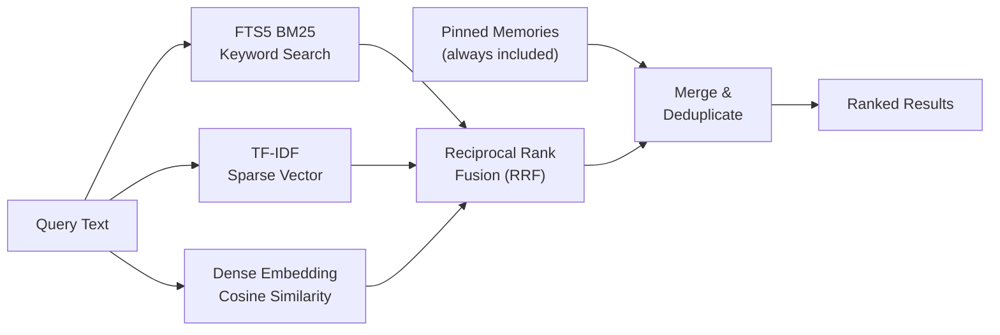
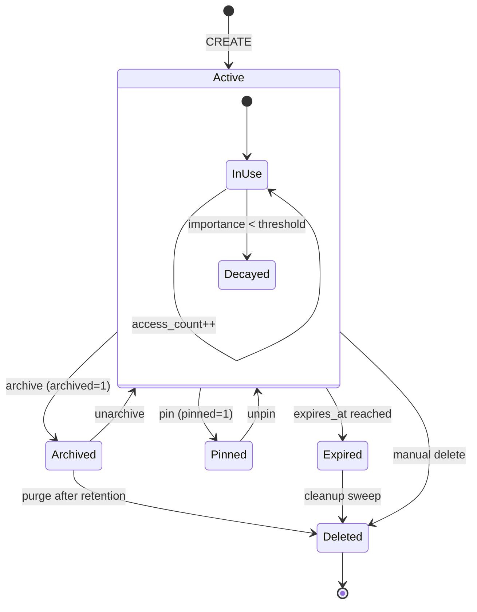
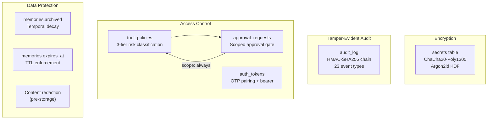

# 30 -- Database Schema Reference

> **Module Goal:** Consolidate the complete SQLite database schema from all 29 PRD chapters and the implemented codebase into a single authoritative reference -- every table, column, index, trigger, foreign key, migration, and query pattern -- with Mermaid diagrams, consistency analysis, and a gap/contradiction register so that the schema can be verified as complete, correct, and free of conflicts.

### Why This Module Exists

Database schema details are scattered across 29 PRD documents and 21 migration files. Each chapter defines tables relevant to its domain (memory in 05-MEMORY, scheduling in 10-SCHEDULER, audit in 21-AUDIT_LOGS, etc.), but no single document shows the full picture. This creates risks: naming conflicts between chapters, orphaned foreign keys, contradictory column definitions, and gaps where planned tables were never implemented. This document serves as the single source of truth for the entire database layer.

### Business Benefits

| Benefit | Description |
|---------|-------------|
| **Single source of truth** | One document for the complete schema -- no hunting across 29 chapters |
| **Consistency verification** | All contradictions between chapters documented and resolved |
| **Migration safety** | Full dependency graph prevents breaking changes |
| **Onboarding** | New developers understand the entire data model from one file |
| **Audit readiness** | Complete FK map, index inventory, and security column catalog |

> **Crate**: `antec-storage` (`crates/antec-storage/`)
> **Purpose**: SQLite connection pool, migrations, repository traits, workspace manager

---

## 1. Architecture Overview



### 1.1 Engine Configuration

| Setting | Value | Rationale |
|---------|-------|-----------|
| **Engine** | SQLite 3, bundled via `rusqlite` (`bundled` feature) | Zero external dependencies |
| **Journal mode** | WAL (Write-Ahead Logging) | Concurrent reads during writes, crash recovery |
| **Foreign keys** | `PRAGMA foreign_keys = ON` | Enforced per connection via pool customizer |
| **Connection pool** | `r2d2` with `r2d2_sqlite::SqliteConnectionManager` | Thread-safe connection sharing |
| **Max connections** | 8 | Balances concurrency with SQLite's single-writer model |
| **Min idle** | 1 | Avoids cold-start latency |
| **Migration tracking** | `PRAGMA user_version` (integer, 0 = fresh) | Simple, atomic, no extra table needed |
| **Database path** | `{data_dir}/antec.db` (default: `~/.antec/antec.db`) | Configurable via `[general] data_dir` |
| **Test path** | `:memory:` | Ephemeral, per-test isolation |

### 1.2 Data Conventions

| Convention | Rule |
|------------|------|
| **Primary keys** | `TEXT` (UUID v4) unless noted as `INTEGER PRIMARY KEY AUTOINCREMENT` |
| **Timestamps** | `INTEGER` Unix epoch seconds (see inconsistency §16.3) |
| **Booleans** | `INTEGER` (0 = false, 1 = true) |
| **JSON data** | `TEXT` columns (validated at application layer) |
| **Binary data** | `BLOB` (encryption nonces, embedding vectors) |
| **Nullable** | Explicit `DEFAULT NULL` or no `NOT NULL` constraint |

---

## 2. Entity-Relationship Diagram

```mermaid
erDiagram
    sessions ||--o{ messages : "has"
    sessions ||--o{ approval_requests : "generates"
    sessions ||--o{ repl_history : "contains"
    sessions ||--o{ model_usage : "tracks"

    memories ||--o| memory_embeddings : "has embedding"
    memories ||--o{ memory_links : "source"
    memories ||--o{ memory_links : "target"

    model_instances ||--o{ agents : "configures"

    sessions {
        TEXT id PK
        TEXT channel
        TEXT channel_id
        INTEGER created_at
        INTEGER updated_at
        TEXT metadata
        INTEGER archived_at
    }

    messages {
        TEXT id PK
        TEXT session_id FK
        TEXT role
        TEXT content
        TEXT tool_calls
        INTEGER token_count
        INTEGER created_at
    }

    memories {
        TEXT id PK
        TEXT key
        TEXT content
        TEXT category
        TEXT tags
        TEXT source
        REAL importance
        INTEGER access_count
        INTEGER created_at
        INTEGER updated_at
        INTEGER expires_at
        INTEGER archived
        INTEGER pinned
    }

    memory_embeddings {
        TEXT memory_id PK_FK
        BLOB embedding
        TEXT model
        INTEGER dimensions
        INTEGER created_at
    }

    memory_links {
        INTEGER id PK
        TEXT source_id
        TEXT target_id
        TEXT relation
        TEXT metadata
        INTEGER created_at
    }

    memory_snapshots {
        TEXT id PK
        INTEGER created_at
        INTEGER memory_count
        INTEGER size_bytes
        TEXT snapshot_data
    }

    agents {
        TEXT id PK
        TEXT name
        TEXT description
        TEXT persona
        TEXT tools
        TEXT skills
        TEXT model
        TEXT provider
        TEXT model_instance_id FK
        INTEGER enabled
        INTEGER is_default
        INTEGER created_at
        INTEGER updated_at
    }

    model_instances {
        TEXT id PK
        TEXT name
        TEXT provider
        TEXT model
        INTEGER is_default
        INTEGER created_at
        INTEGER updated_at
    }

    audit_log {
        INTEGER id PK
        INTEGER timestamp
        TEXT actor
        TEXT action
        TEXT target
        TEXT details
        TEXT session_id
        TEXT risk_level
        TEXT hmac_sig
    }

    secrets {
        TEXT id PK
        TEXT name
        BLOB ciphertext
        BLOB nonce
        INTEGER created_at
    }

    tool_policies {
        TEXT tool_name PK
        TEXT risk_class
        TEXT policy
        INTEGER rate_limit
        INTEGER timeout_ms
        INTEGER enabled
        INTEGER updated_at
    }

    approval_requests {
        TEXT id PK
        TEXT session_id
        TEXT tool_name
        TEXT tool_params
        TEXT risk_level
        TEXT status
        TEXT scope
        INTEGER created_at
        INTEGER resolved_at
        TEXT resolved_by
    }

    model_usage {
        INTEGER id PK
        INTEGER timestamp
        TEXT provider
        TEXT model
        TEXT session_id
        INTEGER input_tokens
        INTEGER output_tokens
        REAL cost_usd
        INTEGER latency_ms
        TEXT routing_mode
    }

    auth_tokens {
        TEXT token PK
        INTEGER created_at
        INTEGER expires_at
        INTEGER paired_at
    }

    cron_jobs {
        TEXT id PK
        TEXT name
        TEXT cron_expr
        TEXT prompt
        INTEGER enabled
        INTEGER next_run
        INTEGER last_run
        INTEGER run_count
        TEXT action_type
        INTEGER created_at
        INTEGER updated_at
        INTEGER one_shot
    }

    skills {
        TEXT id PK
        TEXT name
        TEXT description
        TEXT content
        INTEGER enabled
        TEXT skill_type
        INTEGER has_code
        TEXT source_url
        INTEGER installed_at
    }

    mcp_servers {
        TEXT id PK
        TEXT name
        TEXT config
        INTEGER enabled
        INTEGER added_at
    }

    workspace_file_versions {
        TEXT id PK
        TEXT file_path
        TEXT content
        INTEGER version
        INTEGER created_at
        INTEGER size_bytes
    }

    repl_history {
        INTEGER id PK
        TEXT session_id
        TEXT language
        TEXT code
        TEXT output
        INTEGER success
        INTEGER created_at
    }
```

---

## 3. Table Definitions

### 3.1 `sessions`

**Created**: Migration 001 | **Modified**: Migration 015 | **Sources**: 06-STORAGE §3.1, 24-SESSION

```sql
CREATE TABLE sessions (
    id         TEXT    PRIMARY KEY,
    channel    TEXT    NOT NULL,
    channel_id TEXT,
    created_at INTEGER NOT NULL,
    updated_at INTEGER NOT NULL,
    metadata   TEXT,
    archived_at INTEGER DEFAULT NULL       -- Migration 015
);

CREATE INDEX idx_sessions_archived_at ON sessions(archived_at);
```

| Column | Type | Constraints | Description |
|--------|------|-------------|-------------|
| `id` | TEXT | PK | UUID v4 |
| `channel` | TEXT | NOT NULL | `'console'`, `'discord'`, `'whatsapp'`, `'imessage'` |
| `channel_id` | TEXT | nullable | Channel-specific conversation ID (e.g., guild:channel) |
| `created_at` | INTEGER | NOT NULL | Unix epoch seconds |
| `updated_at` | INTEGER | NOT NULL | Updated on each new message |
| `metadata` | TEXT | nullable | Arbitrary JSON blob |
| `archived_at` | INTEGER | DEFAULT NULL | NULL = active, timestamp = archived |

**Isolation key**: Composite `"{channel}:{channel_id}"` used by agent core for per-conversation isolation (08-CHANNELS).

---

### 3.2 `messages`

**Created**: Migration 001 | **Sources**: 06-STORAGE §3.2, 23-CHAT, 24-SESSION

```sql
CREATE TABLE messages (
    id          TEXT    PRIMARY KEY,
    session_id  TEXT    NOT NULL REFERENCES sessions(id),
    role        TEXT    NOT NULL,
    content     TEXT    NOT NULL,
    tool_calls  TEXT,
    token_count INTEGER,
    created_at  INTEGER NOT NULL
);

CREATE INDEX idx_messages_session_id ON messages(session_id);
```

| Column | Type | Constraints | Description |
|--------|------|-------------|-------------|
| `id` | TEXT | PK | UUID v4 |
| `session_id` | TEXT | NOT NULL, FK -> sessions(id) | Parent session |
| `role` | TEXT | NOT NULL | `'user'`, `'assistant'`, `'system'`, `'tool'` |
| `content` | TEXT | NOT NULL | Message body |
| `tool_calls` | TEXT | nullable | JSON array of `ToolCall` objects |
| `token_count` | INTEGER | nullable | Estimated tokens (~content.len()/4) |
| `created_at` | INTEGER | NOT NULL | Unix epoch seconds |

**Write pattern**: Fire-and-forget via `tokio::spawn` + `spawn_blocking` (23-CHAT).

---

### 3.3 `audit_log`

**Created**: Migration 001 | **Modified**: Migration 002 | **Sources**: 06-STORAGE §3.3, 07-SECURITY §9, 21-AUDIT_LOGS

```sql
CREATE TABLE audit_log (
    id         INTEGER PRIMARY KEY AUTOINCREMENT,
    timestamp  INTEGER NOT NULL,
    actor      TEXT    NOT NULL,
    action     TEXT    NOT NULL,
    target     TEXT,
    details    TEXT,
    session_id TEXT,
    risk_level TEXT    DEFAULT 'low',
    hmac_sig   TEXT                         -- Migration 002
);

CREATE INDEX idx_audit_log_session_id ON audit_log(session_id);
CREATE INDEX idx_audit_log_timestamp  ON audit_log(timestamp);
```

| Column | Type | Constraints | Description |
|--------|------|-------------|-------------|
| `id` | INTEGER | PK AUTOINCREMENT | Sequential, used for HMAC chain ordering |
| `timestamp` | INTEGER | NOT NULL | Unix epoch seconds |
| `actor` | TEXT | NOT NULL | `'agent'`, `'user'`, `'system'`, `'scheduler'` |
| `action` | TEXT | NOT NULL | See audited events below |
| `target` | TEXT | nullable | Resource affected (tool name, file path) |
| `details` | TEXT | nullable | JSON context (truncated to 200 chars for tool results) |
| `session_id` | TEXT | nullable | Associated session (no FK constraint -- intentional) |
| `risk_level` | TEXT | DEFAULT 'low' | See §16.1 for value set inconsistency |
| `hmac_sig` | TEXT | nullable | Hex-encoded HMAC-SHA256 (64 chars), NULL if signing disabled |

**HMAC chain** (07-SECURITY §9):
- Canonical: `"{timestamp}|{actor}|{action}|{target}"`
- Chain: `HMAC-SHA256(key, "{prev_sig}|{data}")`
- First entry: empty previous signature
- Key derived via Argon2id, salt `"antec-audit-chain-v1"`
- Verification: `SELECT * FROM audit_log ORDER BY id ASC`

**Audited events**: `tool_executed`, `tool_blocked`, `tool_approval_requested`, `tool_approval_granted`, `tool_approval_denied`, `injection_detected`, `injection_blocked`, `secret_stored`, `secret_deleted`, `secret_redacted`, `session_created`, `session_deleted`, `auth_pair`, `auth_pair_fail`, `memory_stored`, `memory_deleted`, `command_blocked`, `rate_limited`, `sandbox_violation`, `crash_circuit_open`, `crash_recovered`, `config_changed`, `cron_executed`.

---

### 3.4 `secrets`

**Created**: Migration 002 | **Sources**: 06-STORAGE §3.4, 07-SECURITY §7

```sql
CREATE TABLE secrets (
    id         TEXT PRIMARY KEY,
    name       TEXT NOT NULL UNIQUE,
    ciphertext BLOB NOT NULL,
    nonce      BLOB NOT NULL,
    created_at INTEGER NOT NULL
);
```

| Column | Type | Constraints | Description |
|--------|------|-------------|-------------|
| `id` | TEXT | PK | UUID v4 |
| `name` | TEXT | NOT NULL, UNIQUE | Human-readable secret name |
| `ciphertext` | BLOB | NOT NULL | Encrypted data |
| `nonce` | BLOB | NOT NULL | 12-byte random nonce |
| `created_at` | INTEGER | NOT NULL | Unix epoch seconds |

**Encryption** (07-SECURITY §7): ChaCha20-Poly1305 (AEAD). Key derived via Argon2id with salt `b"antec-secret-vault-v1"`, memory 64 MB, iterations 3, parallelism 4, output 32 bytes. Storage format: `nonce (12B) || ciphertext || tag (16B)`.

---

### 3.5 `memories`

**Created**: Migration 003 | **Modified**: Migrations 008, 013 | **Sources**: 06-STORAGE §3.5, 05-MEMORY

```sql
CREATE TABLE memories (
    id           TEXT    PRIMARY KEY,
    key          TEXT    NOT NULL,
    content      TEXT    NOT NULL,
    category     TEXT,
    tags         TEXT,
    source       TEXT    NOT NULL DEFAULT 'user',
    importance   REAL    NOT NULL DEFAULT 0.5,
    access_count INTEGER NOT NULL DEFAULT 0,
    created_at   INTEGER NOT NULL,
    updated_at   INTEGER NOT NULL,
    expires_at   INTEGER,
    archived     INTEGER NOT NULL DEFAULT 0,     -- Migration 008
    pinned       INTEGER NOT NULL DEFAULT 0      -- Migration 013
);

CREATE INDEX idx_memories_key        ON memories(key);
CREATE INDEX idx_memories_source     ON memories(source);
CREATE INDEX idx_memories_category   ON memories(category);
CREATE INDEX idx_memories_expires_at ON memories(expires_at);
CREATE INDEX idx_memories_pinned     ON memories(pinned) WHERE pinned = 1;
```

| Column | Type | Constraints | Description |
|--------|------|-------------|-------------|
| `id` | TEXT | PK | UUID v4 |
| `key` | TEXT | NOT NULL | Short identifier / title |
| `content` | TEXT | NOT NULL | Full memory content |
| `category` | TEXT | nullable | See §16.2 for value set note |
| `tags` | TEXT | nullable | JSON array of strings |
| `source` | TEXT | NOT NULL, DEFAULT 'user' | `'user'`, `'auto'`, `'pending'`, `'skill'` |
| `importance` | REAL | NOT NULL, DEFAULT 0.5 | 0.0 to 1.0 |
| `access_count` | INTEGER | NOT NULL, DEFAULT 0 | Incremented on recall |
| `created_at` | INTEGER | NOT NULL | Unix epoch seconds |
| `updated_at` | INTEGER | NOT NULL | Unix epoch seconds |
| `expires_at` | INTEGER | nullable | Optional TTL (NULL = permanent) |
| `archived` | INTEGER | NOT NULL, DEFAULT 0 | 1 = soft-deleted by decay |
| `pinned` | INTEGER | NOT NULL, DEFAULT 0 | 1 = exempt from decay, always recalled |

**Temporal decay** (05-MEMORY): Exponential decay based on age and access frequency. Background sweep every 24h. Memories below threshold archived (`archived = 1`). Pinned memories exempt.

---

### 3.6 `memory_fts` (FTS5 Virtual Table)

**Created**: Migration 003 | **Sources**: 06-STORAGE §3.6, 05-MEMORY

```sql
CREATE VIRTUAL TABLE memory_fts USING fts5(
    key, content, tags,
    content='memories',
    content_rowid='rowid',
    tokenize='porter unicode61'
);

-- Sync triggers (3)
CREATE TRIGGER memory_ai AFTER INSERT ON memories BEGIN
    INSERT INTO memory_fts(rowid, key, content, tags)
    VALUES (new.rowid, new.key, new.content, new.tags);
END;

CREATE TRIGGER memory_ad AFTER DELETE ON memories BEGIN
    INSERT INTO memory_fts(memory_fts, rowid, key, content, tags)
    VALUES ('delete', old.rowid, old.key, old.content, old.tags);
END;

CREATE TRIGGER memory_au AFTER UPDATE ON memories BEGIN
    INSERT INTO memory_fts(memory_fts, rowid, key, content, tags)
    VALUES ('delete', old.rowid, old.key, old.content, old.tags);
    INSERT INTO memory_fts(rowid, key, content, tags)
    VALUES (new.rowid, new.key, new.content, new.tags);
END;
```

**Tokenizer**: Porter stemmer + Unicode 6.1 tokenization.
**Sync**: 3 triggers keep FTS index in sync with `memories` table on INSERT/UPDATE/DELETE.

**Primary query pattern**:
```sql
SELECT m.* FROM memories m
JOIN memory_fts ON m.rowid = memory_fts.rowid
WHERE memory_fts MATCH ? AND m.archived = 0
```

---

### 3.7 `memory_embeddings`

**Created**: Migration 014 | **Sources**: 06-STORAGE §3.7, 05-MEMORY

```sql
CREATE TABLE memory_embeddings (
    memory_id  TEXT PRIMARY KEY REFERENCES memories(id) ON DELETE CASCADE,
    embedding  BLOB NOT NULL,
    model      TEXT NOT NULL,
    dimensions INTEGER NOT NULL,
    created_at INTEGER NOT NULL DEFAULT (unixepoch())
);
```

| Column | Type | Constraints | Description |
|--------|------|-------------|-------------|
| `memory_id` | TEXT | PK, FK -> memories(id) ON DELETE CASCADE | 1:1 with memories |
| `embedding` | BLOB | NOT NULL | Little-endian f32 byte array |
| `model` | TEXT | NOT NULL | e.g., `'all-MiniLM-L6-v2'`, `'text-embedding-3-small'` |
| `dimensions` | INTEGER | NOT NULL | Vector dimensionality (384, 1536) |
| `created_at` | INTEGER | NOT NULL, DEFAULT `(unixepoch())` | Unix epoch seconds |

**Embedding format**: Each f32 as 4 little-endian bytes. Size: `dimensions * 4` bytes.
**Cosine similarity**: Computed in Rust by deserializing BLOBs to `Vec<f32>`.

---

### 3.8 `memory_links`

**Created**: Migration 020 | **Sources**: 06-STORAGE §3.8, 05-MEMORY

```sql
CREATE TABLE memory_links (
    id          INTEGER PRIMARY KEY AUTOINCREMENT,
    source_id   TEXT NOT NULL,
    target_id   TEXT NOT NULL,
    relation    TEXT NOT NULL,
    metadata    TEXT,
    created_at  INTEGER NOT NULL,
    UNIQUE(source_id, target_id, relation)
);

CREATE INDEX idx_memory_links_source   ON memory_links(source_id);
CREATE INDEX idx_memory_links_target   ON memory_links(target_id);
CREATE INDEX idx_memory_links_relation ON memory_links(relation);
```

| Column | Type | Constraints | Description |
|--------|------|-------------|-------------|
| `id` | INTEGER | PK AUTOINCREMENT | Sequential |
| `source_id` | TEXT | NOT NULL | Outbound memory UUID |
| `target_id` | TEXT | NOT NULL | Inbound memory UUID |
| `relation` | TEXT | NOT NULL | `'related_to'`, `'contradicts'`, `'supersedes'`, `'part_of'` |
| `metadata` | TEXT | nullable | Optional JSON |
| `created_at` | INTEGER | NOT NULL | Unix epoch seconds |

**No FK constraints** on source_id/target_id (deliberate -- orphaned links cleaned by `delete_links_for_memory()`). Dedup via `INSERT OR IGNORE`. Graph traversal: BFS over both directions.

---

### 3.9 `memory_snapshots`

**Created**: Migration 016 | **Sources**: 06-STORAGE §3.9

```sql
CREATE TABLE memory_snapshots (
    id            TEXT PRIMARY KEY,
    created_at    INTEGER NOT NULL,
    memory_count  INTEGER NOT NULL DEFAULT 0,
    size_bytes    INTEGER NOT NULL DEFAULT 0,
    snapshot_data TEXT NOT NULL
);
```

---

### 3.10 `tool_policies`

**Created**: Migration 001 | **Modified**: Migration 010 | **Sources**: 06-STORAGE §3.10, 04-TOOLS

```sql
CREATE TABLE tool_policies (
    tool_name  TEXT    PRIMARY KEY,
    risk_class TEXT    NOT NULL,
    policy     TEXT,
    rate_limit INTEGER,
    timeout_ms INTEGER,
    updated_at INTEGER NOT NULL,
    enabled    INTEGER NOT NULL DEFAULT 1     -- Migration 010
);
```

| Column | Type | Constraints | Description |
|--------|------|-------------|-------------|
| `tool_name` | TEXT | PK | Tool identifier |
| `risk_class` | TEXT | NOT NULL | `'safe'`, `'moderate'`, `'dangerous'` |
| `policy` | TEXT | nullable | `'always_allow'`, `'always_deny'`, etc. |
| `rate_limit` | INTEGER | nullable | Requests per minute (NULL = default 60/min) |
| `timeout_ms` | INTEGER | nullable | Execution timeout in ms |
| `updated_at` | INTEGER | NOT NULL | Unix epoch seconds |
| `enabled` | INTEGER | NOT NULL, DEFAULT 1 | 0 = disabled, 1 = enabled |

**Note**: `network_scope` and `fs_scope` columns appear in `prd/architecture.md` but are **not implemented** in migrations. See §16.5.

---

### 3.11 `approval_requests`

**Created**: Migration 001 | **Sources**: 06-STORAGE §3.11, 03-GATEWAY §6

```sql
CREATE TABLE approval_requests (
    id          TEXT PRIMARY KEY,
    session_id  TEXT NOT NULL,
    tool_name   TEXT NOT NULL,
    tool_params TEXT NOT NULL,
    risk_level  TEXT NOT NULL,
    status      TEXT DEFAULT 'pending',
    scope       TEXT DEFAULT 'once',
    created_at  INTEGER NOT NULL,
    resolved_at INTEGER,
    resolved_by TEXT
);
```

**Timeout**: 60 seconds. Unresolved requests marked `status = 'expired'`. Scope `'always'` persists approval as a `tool_policies` entry.

---

### 3.12 `cron_jobs`

**Created**: Migration 004 | **Modified**: Migrations 006, 007 | **Sources**: 06-STORAGE §3.12, 10-SCHEDULER

```sql
CREATE TABLE cron_jobs (
    id          TEXT PRIMARY KEY,
    name        TEXT NOT NULL,
    cron_expr   TEXT NOT NULL,
    prompt      TEXT NOT NULL DEFAULT '',
    enabled     INTEGER NOT NULL DEFAULT 1,
    next_run    INTEGER,
    last_run    INTEGER,
    run_count   INTEGER NOT NULL DEFAULT 0,
    action_type TEXT NOT NULL DEFAULT 'send_message',   -- Migration 006
    created_at  INTEGER NOT NULL,
    updated_at  INTEGER NOT NULL,
    one_shot    INTEGER NOT NULL DEFAULT 0              -- Migration 007
);

CREATE INDEX idx_cron_jobs_next_run ON cron_jobs(next_run) WHERE enabled = 1;
CREATE INDEX idx_cron_jobs_enabled  ON cron_jobs(enabled);
```

**Poller query** (30-second interval):
```sql
SELECT * FROM cron_jobs WHERE enabled = 1 AND next_run IS NOT NULL AND next_run <= ?
```

**One-shot**: `mark_job_run` sets `enabled = 0` when `one_shot = 1`.
**Reserved name**: `__heartbeat__`.

---

### 3.13 `skills` (v2)

**Created**: Migration 005 | **Redesigned**: Migration 011 | **Sources**: 06-STORAGE §3.13, 09-SKILLS

```sql
CREATE TABLE skills (
    id           TEXT PRIMARY KEY,
    name         TEXT NOT NULL UNIQUE,
    description  TEXT,
    content      TEXT NOT NULL,
    enabled      INTEGER DEFAULT 0,
    skill_type   TEXT NOT NULL,
    has_code     INTEGER DEFAULT 0,
    source_url   TEXT,
    installed_at INTEGER NOT NULL
);

CREATE INDEX idx_skills_name       ON skills(name);
CREATE INDEX idx_skills_enabled    ON skills(enabled);
CREATE INDEX idx_skills_skill_type ON skills(skill_type);
```

**Migration 011** dropped v1 columns (`version`, `manifest`, `updated_at`) and added v2 columns (`content`, `skill_type`, `has_code`, `source_url`). See §16.4 for the 09-SKILLS vs 06-STORAGE schema conflict.

---

### 3.14 `model_usage`

**Created**: Migration 001 | **Modified**: Migration 017 | **Sources**: 06-STORAGE §3.14, 18-STATISTICS, 25-MODELS

```sql
CREATE TABLE model_usage (
    id            INTEGER PRIMARY KEY AUTOINCREMENT,
    timestamp     INTEGER NOT NULL,
    provider      TEXT    NOT NULL,
    model         TEXT    NOT NULL,
    session_id    TEXT,
    input_tokens  INTEGER NOT NULL,
    output_tokens INTEGER NOT NULL,
    cost_usd      REAL,
    latency_ms    INTEGER,
    routing_mode  TEXT DEFAULT NULL          -- Migration 017
);

CREATE INDEX idx_model_usage_timestamp ON model_usage(timestamp);
```

**Aggregate queries** (18-STATISTICS §4): `usage_by_provider`, `usage_by_model`, `usage_by_day` (using `date(timestamp, 'unixepoch')`), `total_cost`, `routing_savings` (groups by `routing_mode`), `messages_by_channel` (JOINs `sessions`), `tool_usage_top` (queries `audit_log`).

---

### 3.15 `auth_tokens`

**Created**: Migration 009 | **Sources**: 06-STORAGE §3.15

```sql
CREATE TABLE auth_tokens (
    token      TEXT    PRIMARY KEY,
    created_at INTEGER NOT NULL,
    expires_at INTEGER NOT NULL,
    paired_at  INTEGER NOT NULL
);
```

**Token lifecycle**: Loaded at startup via `load_tokens_from_db()`. Expired tokens cleaned by `cleanup_expired()`. Default TTL: 30 days (720 hours). See §16.6 for the auth token model inconsistency across chapters.

---

### 3.16 `mcp_servers`

**Created**: Migration 012 | **Sources**: 06-STORAGE §3.16, 11-MCP

```sql
CREATE TABLE mcp_servers (
    id       TEXT PRIMARY KEY,
    name     TEXT NOT NULL UNIQUE,
    config   TEXT NOT NULL,
    enabled  INTEGER NOT NULL DEFAULT 1,
    added_at INTEGER NOT NULL
);

CREATE INDEX idx_mcp_servers_name ON mcp_servers(name);
```

**Config JSON formats**: Stdio: `{"transport":"stdio","command":"...","args":[...],"env":{...}}` | HTTP: `{"transport":"http","url":"..."}` | SSE: `{"transport":"sse","url":"..."}`

**Security note** (11-MCP): API keys in config JSON are stored in **plaintext** -- not encrypted via the secrets vault. This is a known documented gap.

---

### 3.17 `workspace_file_versions`

**Created**: Migration 018 | **Sources**: 06-STORAGE §3.17, 15-WORKSPACE

```sql
CREATE TABLE workspace_file_versions (
    id         TEXT PRIMARY KEY,
    file_path  TEXT    NOT NULL,
    content    TEXT    NOT NULL,
    version    INTEGER NOT NULL DEFAULT 1,
    created_at INTEGER NOT NULL,
    size_bytes INTEGER NOT NULL DEFAULT 0
);

CREATE INDEX idx_wfv_path         ON workspace_file_versions(file_path);
CREATE INDEX idx_wfv_path_version ON workspace_file_versions(file_path, version DESC);
```

**Versioning**: Each write creates a new row with `version = max(current) + 1`. Full content snapshots (not diffs). Revert creates a new version with old content.

---

### 3.18 `agents`

**Created**: Migration 019 | **Modified**: Migration 021 | **Sources**: 06-STORAGE §3.18, 12-AGENTS

```sql
CREATE TABLE agents (
    id                TEXT PRIMARY KEY,
    name              TEXT NOT NULL UNIQUE,
    description       TEXT NOT NULL DEFAULT '',
    persona           TEXT NOT NULL DEFAULT '',
    tools             TEXT NOT NULL DEFAULT '[]',
    skills            TEXT NOT NULL DEFAULT '[]',
    model             TEXT,
    provider          TEXT,
    model_instance_id TEXT REFERENCES model_instances(id),  -- Migration 021
    enabled           INTEGER NOT NULL DEFAULT 1,
    is_default        INTEGER NOT NULL DEFAULT 0,
    created_at        INTEGER NOT NULL,
    updated_at        INTEGER NOT NULL
);

CREATE UNIQUE INDEX idx_agents_default ON agents(is_default) WHERE is_default = 1;
```

**Invariant**: Exactly one agent may have `is_default = 1` (enforced by partial unique index).

See §16.7 for the `agents` vs `agent_definitions` naming inconsistency.

---

### 3.19 `model_instances`

**Created**: Migration 021 | **Sources**: 06-STORAGE §3.19, 25-MODELS

```sql
CREATE TABLE model_instances (
    id         TEXT PRIMARY KEY,
    name       TEXT NOT NULL UNIQUE,
    provider   TEXT NOT NULL,
    model      TEXT NOT NULL,
    is_default INTEGER NOT NULL DEFAULT 0,
    created_at INTEGER NOT NULL,
    updated_at INTEGER NOT NULL
);
```

**Boot behavior** (26-ENVIRONMENT, step 14): Seeds a default `ModelInstanceRow` if the table is empty, using values from `[models]` config section.

---

### 3.20 `repl_history`

**Created**: Migration 018 | **Sources**: 06-STORAGE §3.20, 28-REPL

```sql
CREATE TABLE repl_history (
    id         INTEGER PRIMARY KEY AUTOINCREMENT,
    session_id TEXT NOT NULL,
    language   TEXT NOT NULL,
    code       TEXT NOT NULL,
    output     TEXT,
    success    INTEGER NOT NULL DEFAULT 1,
    created_at INTEGER NOT NULL
);

CREATE INDEX idx_repl_session ON repl_history(session_id, created_at DESC);
```

**Important**: REPL execution state (variables, interpreter context) is in-memory only (`HashMap<String, ReplSession>`). This table is the **audit trail only** -- it cannot restore execution state after restart.

---

## 4. Foreign Key Map



| Child Table | Child Column | Parent Table | Parent Column | ON DELETE | Enforced? |
|-------------|-------------|--------------|---------------|-----------|-----------|
| `messages` | `session_id` | `sessions` | `id` | (default: RESTRICT) | Yes (PRAGMA FK ON) |
| `memory_embeddings` | `memory_id` | `memories` | `id` | **CASCADE** | Yes |
| `agents` | `model_instance_id` | `model_instances` | `id` | (default: RESTRICT) | Yes |
| `audit_log` | `session_id` | `sessions` | `id` | -- | **No** (intentional) |
| `approval_requests` | `session_id` | `sessions` | `id` | -- | **No** |
| `model_usage` | `session_id` | `sessions` | `id` | -- | **No** |
| `repl_history` | `session_id` | `sessions` | `id` | -- | **No** |
| `memory_links` | `source_id` / `target_id` | `memories` | `id` | -- | **No** (deliberate) |

**Design rationale for missing FKs**: Audit entries must outlive sessions. Memory links use `INSERT OR IGNORE` and rely on `delete_links_for_memory()` for cleanup. Usage data is valuable even after session deletion.

**Cascade risk**: Deleting a session with `DELETE FROM sessions WHERE id = ?` will fail if `messages` exist for that session (FK RESTRICT). The repository's `delete_session_data()` deletes messages first within a transaction.

---

## 5. Complete Index Inventory

| # | Table | Index Name | Columns | Type |
|---|-------|-----------|---------|------|
| 1 | `sessions` | `idx_sessions_archived_at` | `archived_at` | Regular |
| 2 | `messages` | `idx_messages_session_id` | `session_id` | Regular |
| 3 | `audit_log` | `idx_audit_log_session_id` | `session_id` | Regular |
| 4 | `audit_log` | `idx_audit_log_timestamp` | `timestamp` | Regular |
| 5 | `memories` | `idx_memories_key` | `key` | Regular |
| 6 | `memories` | `idx_memories_source` | `source` | Regular |
| 7 | `memories` | `idx_memories_category` | `category` | Regular |
| 8 | `memories` | `idx_memories_expires_at` | `expires_at` | Regular |
| 9 | `memories` | `idx_memories_pinned` | `pinned` | **Partial** (`WHERE pinned = 1`) |
| 10 | `cron_jobs` | `idx_cron_jobs_next_run` | `next_run` | **Partial** (`WHERE enabled = 1`) |
| 11 | `cron_jobs` | `idx_cron_jobs_enabled` | `enabled` | Regular |
| 12 | `skills` | `idx_skills_name` | `name` | Regular |
| 13 | `skills` | `idx_skills_enabled` | `enabled` | Regular |
| 14 | `skills` | `idx_skills_skill_type` | `skill_type` | Regular |
| 15 | `model_usage` | `idx_model_usage_timestamp` | `timestamp` | Regular |
| 16 | `mcp_servers` | `idx_mcp_servers_name` | `name` | Regular (redundant, see §16.8) |
| 17 | `workspace_file_versions` | `idx_wfv_path` | `file_path` | Regular |
| 18 | `workspace_file_versions` | `idx_wfv_path_version` | `file_path, version DESC` | **Composite DESC** |
| 19 | `memory_links` | `idx_memory_links_source` | `source_id` | Regular |
| 20 | `memory_links` | `idx_memory_links_target` | `target_id` | Regular |
| 21 | `memory_links` | `idx_memory_links_relation` | `relation` | Regular |
| 22 | `repl_history` | `idx_repl_session` | `session_id, created_at DESC` | **Composite DESC** |
| 23 | `agents` | `idx_agents_default` | `is_default` | **Partial UNIQUE** (`WHERE is_default = 1`) |

**Implicit indexes** (from UNIQUE constraints, not counted above): `secrets.name`, `skills.name`, `mcp_servers.name`, `agents.name`, `model_instances.name`, `memory_links(source_id, target_id, relation)`.

---

## 6. Migration Dependency Graph

```mermaid
flowchart TB
    M001["001: sessions, messages,<br/>audit_log, tool_policies,<br/>approval_requests, model_usage"]
    M002["002: secrets,<br/>audit_log.hmac_sig"]
    M003["003: memories,<br/>memory_fts + 3 triggers"]
    M004["004: cron_jobs"]
    M005["005: skills (v1)"]
    M006["006: cron_jobs.action_type"]
    M007["007: cron_jobs.one_shot"]
    M008["008: memories.archived"]
    M009["009: auth_tokens"]
    M010["010: tool_policies.enabled"]
    M011["011: skills v2 (redesign)"]
    M012["012: mcp_servers"]
    M013["013: memories.pinned"]
    M014["014: memory_embeddings"]
    M015["015: sessions.archived_at"]
    M016["016: memory_snapshots"]
    M017["017: model_usage.routing_mode"]
    M018["018: workspace_file_versions,<br/>repl_history"]
    M019["019: agents"]
    M020["020: memory_links"]
    M021["021: model_instances,<br/>agents.model_instance_id"]

    M001 --> M002 --> M003 --> M004 --> M005
    M005 --> M006 --> M007 --> M008 --> M009
    M009 --> M010 --> M011 --> M012 --> M013
    M013 --> M014 --> M015 --> M016 --> M017
    M017 --> M018 --> M019 --> M020 --> M021

    style M001 fill:#e8f5e9
    style M011 fill:#fff3e0
    style M021 fill:#e3f2fd
```



**Schema version**: `PRAGMA user_version = 21` after all migrations.

Version skipping is safe: upgrading from v1.0 (schema v5) to v2.0 (schema v21) runs migrations 6-21 sequentially.

---

## 7. Hybrid Recall Pipeline (Memory Search)



| Stage | Source Table | Query | Notes |
|-------|-------------|-------|-------|
| FTS5 BM25 | `memory_fts` JOIN `memories` | `WHERE memory_fts MATCH ? AND m.archived = 0` | Porter stemmer + Unicode |
| TF-IDF sparse | In-memory `TfIdfIndex` | N/A (precomputed in RAM) | Binary serialized for persistence |
| Dense embedding | `memory_embeddings` | Load all BLOBs, compute cosine in Rust | Optional (requires embedding model) |
| Pinned bypass | `memories` | `WHERE pinned = 1 AND archived = 0` | Always included regardless of score |

---

## 8. Repository Traits

All data access goes through 21 repository traits implemented by `SqliteRepository { db: Arc<Database> }`:

| # | Trait | Table(s) | Key Operations |
|---|-------|----------|----------------|
| 1 | `SessionRepo` | sessions | CRUD, archive/unarchive, merge, filtered listing |
| 2 | `MessageRepo` | messages | Insert, get by session, paged, count, export |
| 3 | `AuditRepo` | audit_log | Log (plain + chained), query (filtered), CSV export, chain verify, retention delete |
| 4 | `MemoryRepo` | memories | CRUD, FTS search, upsert, archive/unarchive, pin, stats |
| 5 | `MemoryEmbeddingRepo` | memory_embeddings | Upsert, get, batch get, list all, delete, count |
| 6 | `MemoryLinkRepo` | memory_links | Create, get from/to, BFS traversal, delete |
| 7 | `ToolPolicyRepo` | tool_policies | Get/set policy, enable/disable, rate limits |
| 8 | `ModelUsageRepo` | model_usage | Record, aggregates (provider/model/day), cost, channel messages, routing savings |
| 9 | `ApprovalRepo` | approval_requests | Create, get pending, resolve, list |
| 10 | `SecretRepo` | secrets | Store, get, list names, delete |
| 11 | `CronJobRepo` | cron_jobs | CRUD, get due, mark run |
| 12 | `SkillRepo` | skills | Install, get, list, enable/disable, delete, update content |
| 13 | `AuthTokenRepo` | auth_tokens | Store, list valid, delete, cleanup expired |
| 14 | `McpServerRepo` | mcp_servers | CRUD, enable/disable |
| 15 | `MemorySnapshotRepo` | memory_snapshots | Create, get, list, delete |
| 16 | `WorkspaceFileRepo` | workspace_file_versions | Save version, get latest, get specific, list, revert |
| 17 | `ReplHistoryRepo` | repl_history | Insert, get by session, get all |
| 18 | `AgentRepo` | agents | CRUD, get by name, get default, enable/disable |
| 19 | `ModelInstanceRepo` | model_instances | CRUD, get by name, get/set default |
| 20 | `DiagnosticsRepo` | (all) | `PRAGMA integrity_check` |
| 21 | `DataDeletionRepo` | (all) | Delete session data, delete all, purge old, GDPR export |

---

## 9. Data Lifecycle & Retention



### 9.1 Automatic Retention

| Data | Retention Policy | Trigger |
|------|-----------------|---------|
| **Memories** | Decay sweep every 24h | Background task |
| **Audit log** | `audit_retention_days` config (default: 30, 0 = forever) | Background task daily |
| **Auth tokens** | 30-day expiry | `cleanup_expired()` on startup |
| **Archived memories** | Configurable via `purge_old_memories(before_ts)` | Manual or scheduled |
| **Old messages** | `purge_old_messages(before_ts)` | Manual |

### 9.2 GDPR Operations

| Operation | Method | Tables Affected |
|-----------|--------|----------------|
| **Export all data** | `export_all_data()` | sessions, messages, memories, audit_log, cron_jobs |
| **Delete session data** | `delete_session_data(id)` | messages (DELETE) + sessions (DELETE) in transaction |
| **Delete all user data** | `delete_all_user_data()` | sessions, messages, memories, cron_jobs, approval_requests, secrets |
| **Storage info** | `storage_info()` | COUNT(*) per table |

---

## 10. Non-Database Storage

Not everything is in SQLite. The following use filesystem or in-memory storage:

| System | Storage Medium | Path / Location | Rationale |
|--------|---------------|-----------------|-----------|
| **Persona** | Filesystem | `~/.antec/persona.md` | Human-editable Markdown |
| **Behaviors** | Filesystem | `~/.antec/behavior.md`, `~/.antec/behaviors/*.md` | YAML frontmatter overlays |
| **Workspace files** | Filesystem + SQLite | `~/.antec/workspace/` (files) + `workspace_file_versions` (history) | Dual model |
| **i18n translations** | Compiled in (Rust) | `crates/antec-i18n/src/locales/*.toml` | `include_str!` at compile time |
| **Extension credentials** | In-memory | `HashMap` behind `Arc<RwLock>` | Lost on restart (future: persist) |
| **REPL execution state** | In-memory | `HashMap<String, ReplSession>` | Code replay from DB on restore |
| **Parallel exec state** | In-memory | `HashMap` | Sub-agent and parallel task state |
| **Circuit breaker** | In-memory | `Mutex<HashMap>` | Provider failure tracking |
| **Metrics counters** | In-memory | `AtomicU64` counters | Reset on restart |
| **TF-IDF index** | In-memory | `TfIdfIndex` struct | Binary-serializable for optional persistence |
| **Config (TOML)** | Filesystem | `~/.antec/antec.toml` (or platform-specific) | Human-edited |
| **Daemon discovery** | Filesystem | `~/.antec/daemon.json` | PID, port, version |

---

## 11. SQLite Features Used

| Feature | Usage | Migration |
|---------|-------|-----------|
| **WAL journal mode** | Concurrent reads, crash safety | Applied per connection |
| **FTS5** | Full-text search on memories (BM25 ranking) | 003 |
| **Porter tokenizer** | Stemming for English search queries | 003 |
| **Unicode61 tokenizer** | Proper Unicode word boundary detection | 003 |
| **Triggers** | FTS5 sync (3 triggers: INSERT/UPDATE/DELETE) | 003 |
| **External content FTS** | `content='memories'` avoids data duplication | 003 |
| **Partial indexes** | `WHERE pinned = 1`, `WHERE enabled = 1`, `WHERE is_default = 1` | 013, 004, 019 |
| **AUTOINCREMENT** | Monotonic IDs for audit chain ordering | 001 |
| **FOREIGN KEYS** | `PRAGMA foreign_keys = ON` per connection | Pool customizer |
| **ON DELETE CASCADE** | memory_embeddings auto-deleted with parent memory | 014 |
| **BLOB storage** | Encryption nonces, embedding vectors | 002, 014 |
| **`unixepoch()`** | Default timestamp in memory_embeddings | 014 |
| **`PRAGMA user_version`** | Migration version tracking (0 = fresh, 21 = current) | All |
| **`PRAGMA integrity_check`** | Database health diagnostics | DiagnosticsRepo |
| **`PRAGMA table_info()`** | Column existence checks for safe ALTER TABLE | Migration engine |

---

## 12. Security-Relevant Schema Elements



| Concern | Schema Element | Protection |
|---------|---------------|------------|
| Credential storage | `secrets.ciphertext` + `nonce` | ChaCha20-Poly1305, Argon2id key derivation |
| Audit integrity | `audit_log.hmac_sig` | Chained HMAC-SHA256, Argon2id key |
| Tool safety | `tool_policies.risk_class` | 3-tier classification with approval gate |
| Authentication | `auth_tokens.token` | UUID bearer token with expiry |
| Memory privacy | `memories.expires_at`, `archived` | Auto-expiry, temporal decay |
| Rate limiting | `tool_policies.rate_limit` | Per-tool RPM limits |

---

## 13. Key Query Patterns

### 13.1 Highest-Frequency Queries

```sql
-- Session message retrieval (every chat interaction)
SELECT id, role, content, tool_calls, token_count, created_at
FROM messages WHERE session_id = ?1 ORDER BY created_at ASC;

-- Memory recall (FTS5 + filter archived)
SELECT m.* FROM memories m
JOIN memory_fts ON m.rowid = memory_fts.rowid
WHERE memory_fts MATCH ?1 AND m.archived = 0;

-- Due cron jobs (30-second poller)
SELECT * FROM cron_jobs
WHERE enabled = 1 AND next_run IS NOT NULL AND next_run <= ?1;

-- Token validation (every authenticated request)
SELECT * FROM auth_tokens WHERE token = ?1 AND expires_at > ?2;
```

### 13.2 Analytics Queries

```sql
-- Cost by day
SELECT date(timestamp, 'unixepoch') AS day,
       SUM(input_tokens), SUM(output_tokens), SUM(cost_usd), COUNT(*)
FROM model_usage GROUP BY day ORDER BY day ASC;

-- Routing savings
SELECT routing_mode, COUNT(*) AS calls, SUM(cost_usd)
FROM model_usage GROUP BY routing_mode;

-- Messages by channel
SELECT s.channel, COUNT(*) FROM messages m
JOIN sessions s ON m.session_id = s.id GROUP BY s.channel;

-- Top tools
SELECT target, COUNT(*) FROM audit_log
WHERE action = 'tool_call' GROUP BY target ORDER BY COUNT(*) DESC;
```

### 13.3 Maintenance Queries

```sql
-- HMAC chain verification
SELECT * FROM audit_log ORDER BY id ASC;

-- Retention cleanup
DELETE FROM audit_log WHERE timestamp < ?1;
DELETE FROM memories WHERE archived = 1 AND updated_at < ?1;

-- Storage stats
SELECT 'sessions' AS tbl, COUNT(*) FROM sessions
UNION ALL SELECT 'messages', COUNT(*) FROM messages
UNION ALL SELECT 'memories', COUNT(*) FROM memories;

-- Database integrity
PRAGMA integrity_check;
```

---

## 14. Schema Metrics

| Metric | Value |
|--------|-------|
| Regular tables | 20 |
| FTS5 virtual tables | 1 |
| Total table-like objects | 21 |
| Total columns | ~160 |
| Explicit indexes | 23 |
| Implicit indexes (UNIQUE) | 6 |
| Triggers | 3 (FTS5 sync) |
| Foreign key constraints | 3 (declared) |
| Logical references (no FK) | 5 |
| UNIQUE constraints | 7 |
| Migrations | 21 |
| Repository traits | 21 |
| AUTOINCREMENT tables | 4 (audit_log, model_usage, memory_links, repl_history) |
| BLOB columns | 3 (secrets.ciphertext, secrets.nonce, memory_embeddings.embedding) |
| JSON columns | 6+ (tool_calls, tags, tools, skills, config, metadata) |

---

## 15. Schema Completeness Matrix

Cross-reference of every table against the PRD chapters that define, reference, or query it:

| Table | Defined In | Referenced By | Migration |
|-------|-----------|---------------|-----------|
| `sessions` | 06-STORAGE, 24-SESSION | 03-GATEWAY, 08-CHANNELS, 18-STATISTICS, 23-CHAT | 001, 015 |
| `messages` | 06-STORAGE, 23-CHAT | 03-GATEWAY, 24-SESSION | 001 |
| `audit_log` | 06-STORAGE, 21-AUDIT_LOGS | 07-SECURITY, 18-STATISTICS, 23-CHAT | 001, 002 |
| `secrets` | 06-STORAGE, 07-SECURITY | 20-CLI, 25-MODELS | 002 |
| `memories` | 06-STORAGE, 05-MEMORY | 20-CLI, 23-CHAT | 003, 008, 013 |
| `memory_fts` | 06-STORAGE, 05-MEMORY | 20-CLI | 003 |
| `memory_embeddings` | 06-STORAGE, 05-MEMORY | -- | 014 |
| `memory_links` | 06-STORAGE, 05-MEMORY | -- | 020 |
| `memory_snapshots` | 06-STORAGE | 05-MEMORY | 016 |
| `tool_policies` | 06-STORAGE, 04-TOOLS | 03-GATEWAY, 23-CHAT | 001, 010 |
| `approval_requests` | 06-STORAGE | 03-GATEWAY, 23-CHAT | 001 |
| `cron_jobs` | 06-STORAGE, 10-SCHEDULER | 20-CLI | 004, 006, 007 |
| `skills` | 06-STORAGE, 09-SKILLS | 20-CLI | 005, 011 |
| `model_usage` | 06-STORAGE, 18-STATISTICS | 23-CHAT, 25-MODELS | 001, 017 |
| `auth_tokens` | 06-STORAGE | 03-GATEWAY, 07-SECURITY | 009 |
| `mcp_servers` | 06-STORAGE, 11-MCP | 20-CLI | 012 |
| `workspace_file_versions` | 06-STORAGE, 15-WORKSPACE | -- | 018 |
| `repl_history` | 06-STORAGE, 28-REPL | 15-WORKSPACE | 018 |
| `agents` | 06-STORAGE, 12-AGENTS | 20-CLI | 019, 021 |
| `model_instances` | 06-STORAGE, 25-MODELS | 12-AGENTS, 26-ENVIRONMENT | 021 |

---

## 16. Inconsistencies & Contradictions Register — RESOLVED

All 14 inconsistencies identified during the cross-chapter audit have been resolved. Each PRD chapter now uses consistent terminology, schema definitions, and configuration names. This section documents the resolutions for traceability.

| # | Issue | Resolution | Files Changed |
|---|-------|------------|---------------|
| 16.1 | `audit_log.risk_level` DEFAULT `'low'` vs `'safe'` | Changed to `DEFAULT 'safe'` with enum `'safe', 'moderate', 'dangerous', 'unknown'` | 06-STORAGE, prd/architecture.md |
| 16.2 | `memories.category` — 4 values vs 10 | Updated comment to full 10-value enum from 05-MEMORY | 06-STORAGE |
| 16.3 | Timestamps `TEXT` vs `INTEGER` in 15-WORKSPACE | Changed to `INTEGER NOT NULL` | 15-WORKSPACE |
| 16.4 | `skills` v1 schema in 09-SKILLS | Marked v1 as superseded by migration 011, added v2 schema | 09-SKILLS |
| 16.5 | `tool_policies` missing `network_scope`/`fs_scope` | Added both columns to 06-STORAGE DDL to match architecture.md | 06-STORAGE |
| 16.6 | `auth_tokens` — three conflicting models | Standardized on hash-stored model (`token_hash`, `last_used_at`, `revoked`) | 06-STORAGE, 03-GATEWAY |
| 16.7 | `agent_definitions` vs `agents` | Changed to `agents` everywhere | 12-AGENTS |
| 16.8 | `file_versions` vs `workspace_file_versions` | Changed to `workspace_file_versions` everywhere | 15-WORKSPACE |
| 16.9 | AES-256-GCM vs ChaCha20-Poly1305 | Changed to ChaCha20-Poly1305 with Argon2id KDF | 01-ARCHITECTURE |
| 16.10 | `memory_snapshots` missing `reason` column | Added `reason TEXT` to DDL and model | 06-STORAGE |
| 16.11 | Redundant `idx_mcp_servers_name` index | Removed (UNIQUE on name creates implicit index) | 06-STORAGE |
| 16.12 | `memory_ops_log` — documented but missing from 06-STORAGE | Added as §3.21 with DDL, model, repo trait, migration 022 | 06-STORAGE |
| 16.13 | `delete_session` orphaning risk | Updated SQL to transaction: delete messages first, then session | 24-SESSION |
| 16.14 | Config `[storage]`/`[llm]` vs `[general]`/`[models]` | Aligned to canonical 26-ENVIRONMENT names | 29-DEPLOYMENT |

---

## 17. Table Count Summary

| Category | Tables | List |
|----------|--------|------|
| **Core messaging** | 3 | sessions, messages, approval_requests |
| **Memory system** | 6 | memories, memory_fts, memory_embeddings, memory_links, memory_snapshots, memory_ops_log |
| **Security** | 3 | audit_log, secrets, auth_tokens |
| **Tools & policies** | 1 | tool_policies |
| **LLM & models** | 3 | model_usage, model_instances, agents |
| **Skills & MCP** | 2 | skills, mcp_servers |
| **Scheduling** | 1 | cron_jobs |
| **Workspace & REPL** | 2 | workspace_file_versions, repl_history |
| **Total** | **21 regular + 1 FTS5 = 22** | |
